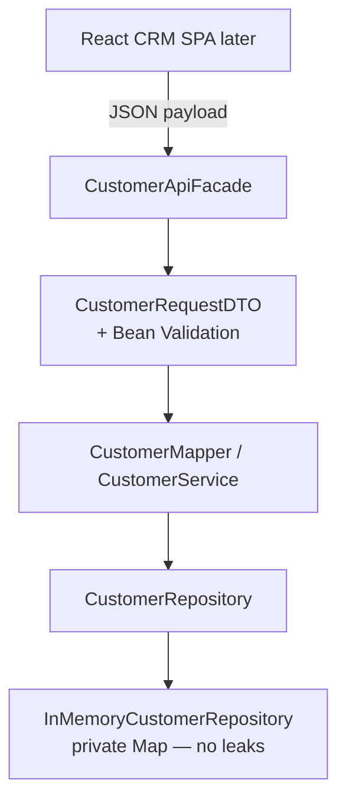
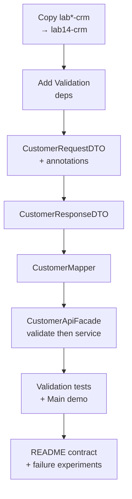

# Lab 14: DTOs and Validation — Northstar CRM API Contract Boundary

**Module:** 14 — DTOs, Validation and API Contracts  
**Lab folder:** `labs/Week 2 - Backend, AI Tools and Testing/module-14/lab14/`  
**Difficulty:** Intermediate  
**Duration:** 3–4 Hours

**Primary IDE:** IntelliJ IDEA Community Edition · **Optional IDE:** VS Code

| OS | How-to for this lab |
| -- | ------------------- |
| Windows | [LAB-14-WINDOWS.md](LAB-14-WINDOWS.md) |
| macOS | [LAB-14-MACOS.md](LAB-14-MACOS.md) |

> **Environment reminder:** Finish [Lab 0](../../../Week%201%20-%20Java%20and%20JVM%20Foundations/module-00/lab0/LAB-0-GUIDE.md). Use **IntelliJ IDEA Community** (primary; optional VS Code) on your laptop with **JDK 21** and **Maven 3.9+**. Work under `~/java-bootcamp` (Windows: `%USERPROFILE%\java-bootcamp`).

---

## How to follow this lab

1. Open the **Windows** or **macOS** how-to (links above) in a second tab.
2. Create/work only under your `java-bootcamp/examples/…` folder from the steps (not inside this `labs/` git clone unless a step says otherwise).
3. For each **Step N**: read **Why** (if present) → do the actions → confirm **Expected** / **Expected result** → then continue.
4. When stuck, use **Failure Experiments** / troubleshooting in this guide before asking for help.
5. Capture evidence under `notes/screenshots/` (redact secrets). Use the **Pass criteria** tables — write **Pass** or **Fail** in your notes. GitHub file view does not support clickable checkboxes.

## Lab Overview

This Module 14 lab extends the **Northstar Customer Management Platform** with a clear **API contract boundary**: request and response DTOs, Jakarta Bean Validation on inbound payloads, and mapping that returns DTOs **without** exposing the `Customer` entity over the API.

**Purpose.** Accepting the entity as the public shape couples callers to internal fields, makes validation ad hoc, and risks leaking persistence-only data. DTOs + Bean Validation push the trust boundary to the edge—before business rules or storage run.

**What you build (exercise).** Copy forward to `lab14-crm`; add Validation API + Hibernate Validator; create `CustomerRequestDTO` / `CustomerResponseDTO`; implement `CustomerMapper`; validate in `CustomerApiFacade` with correlation `lab-request-001`; prove happy path with `CUS-1001` / `CUS-1002`; reject invalid email/blank name in tests; document the contract in README.

**What success looks like.** Under `~/java-bootcamp/examples/lab14-crm/` you run green validation tests, a facade create/get demo that returns response DTOs only, and evidence that invalid payloads never reach `CustomerService.addCustomer`.

**Depends on Labs 9–12 domain.** Need `Customer`, `CustomerStatus`, and a working in-memory service/repository. Lab 13 SOAP contracts are parallel design artifacts—reuse status vocabulary, not WSDL hosting.

**CRM connection.** Same fixtures. Later Labs 29+ will reuse these DTOs under Spring `@Valid` / `@ControllerAdvice`. React JSON and PostgreSQL remain future; in-memory store stays.

---

## Learning Objectives

After completing this lab, you will be able to:

* Explain why entities must not be the public API contract
* Design `CustomerRequestDTO` and `CustomerResponseDTO` for create/update/read flows
* Apply Jakarta Bean Validation annotations (`@NotNull`, `@NotBlank`, `@Email`, `@Size`)
* Trigger validation programmatically with `Validator` / `ValidatorFactory`
* Map between entity and DTO without leaking persistence or internal fields
* Return structured validation failures with field messages the client can act on
* Keep correlation ID `lab-request-001` visible in logs for invalid requests
* Prove rejection of invalid payloads with automated tests

---

## Business Scenario

The React client (and later HTTP/SOAP adapters) must send customer payloads that look like JSON/XML contracts—not raw domain objects. Until now, services often accepted `Customer` directly.

Your lead wants a contract layer:

* Incoming create/update bodies use `CustomerRequestDTO` with Bean Validation
* Outgoing reads use `CustomerResponseDTO` only
* Invalid email, blank name, or oversized fields fail **before** business rules run
* Fixtures remain `CUS-1001` Amina Khan (`ACTIVE`) and `CUS-1002` Ravi Singh (`PROSPECT`)

Use these examples consistently:

| ID | Name | Status | Email |
| -- | ---- | ------ | ----- |
| `CUS-1001` | Amina Khan | `ACTIVE` | `amina.khan@example.com` |
| `CUS-1002` | Ravi Singh | `PROSPECT` | `ravi.singh@example.com` |

* Correlation ID: `lab-request-001`
* ISO-8601 / `Instant` timestamps where responses include `createdAt` / `updatedAt`

**Security note for evidence.** Keep sample emails. No secrets, tokens, or real PII in DTOs, logs, or Git.

---

## Architecture Context

### NOW (this lab)



### Lab flow (mermaid)



### Architecture NOW vs LATER

| Aspect | Lab 14 (NOW) | Later (Spring / Lab 29+) |
| ------ | ------------ | ------------------------ |
| Trigger | Manual `Validator.validate` | `@Valid` on controllers |
| Errors | `IllegalArgumentException` + field messages | Problem details / `@ControllerAdvice` |
| Transport | Facade + Main (no HTTP required) | REST/SOAP adapters |
| Store | In-memory | JPA/PostgreSQL |

**Lab focus:** DTOs, Bean Validation annotations, mapping without exposing the entity over the API.

---

## Prerequisites

Complete [SETUP](../../../SETUP-INSTRUCTIONS.md) and [Lab 0](../../../Week%201%20-%20Java%20and%20JVM%20Foundations/module-00/lab0/LAB-0-GUIDE.md). Confirm:

* JDK 21; Maven; Git
* Working CRM Maven project from Labs 9–12 (`Customer`, `CustomerStatus`, service)—copy forward as `lab14-crm/`
* No secrets committed to Git

### Pre-flight

```bash
java -version
mvn -version
git --version
pwd
ls ~/java-bootcamp/examples
```

Fix environment failures before changing application code.

---

## Suggested Project Files

```text
~/java-bootcamp/examples/lab14-crm/
├── src/
│   ├── main/java/com/northstar/crm/
│   │   ├── Main.java
│   │   ├── dto/
│   │   │   ├── CustomerRequestDTO.java
│   │   │   └── CustomerResponseDTO.java
│   │   ├── entity/
│   │   │   ├── Customer.java
│   │   │   └── CustomerStatus.java
│   │   ├── mapper/
│   │   │   └── CustomerMapper.java
│   │   ├── api/
│   │   │   └── CustomerApiFacade.java
│   │   ├── service/
│   │   │   └── CustomerService.java
│   │   └── repository/
│   │       └── InMemoryCustomerRepository.java   (or your existing store)
│   └── test/java/com/northstar/crm/dto/
│       └── CustomerRequestDTOValidationTest.java
├── docs/
│   └── dto-boundary-notes.md
├── notes/screenshots/
├── pom.xml
├── .gitignore
└── README.md
```

Ignore `target/`, IDE metadata, tokens, and passwords. Adapt `Customer` constructor/`Instant` vs `LocalDateTime` to your prior labs—mapper must match **your** entity.

---

## Concepts to Discuss

Write 2–3 sentences each in `docs/dto-boundary-notes.md`:

1. Main data/request flow (facade → validate → map → service → response DTO)
2. Trust boundary and input validation point
3. Success and failure contract (validation vs duplicate ID vs not found)
4. Stable identity (`CUS-1001`) vs mutable display fields
5. Retry/idempotency implications at the DTO boundary
6. Local programmatic Validator vs Spring `@Valid` later
7. Logs/evidence for support (`lab-request-001` on failures)
8. Behavior with two application instances (independent memory)
9. Why response DTOs should prefer getters-only / factory methods
10. What must never appear on a response DTO (password hashes, internal flags)

---

## Implementation Steps

Complete each step in order. Commands assume `~/java-bootcamp/examples/lab14-crm` (Windows: `%USERPROFILE%\java-bootcamp\examples\lab14-crm`) unless noted.

---

### Step 1 — Branch the project and add Validation dependencies

**Why:** Annotations alone do nothing without an implementation provider. Hibernate Validator + EL (`expressly`) enable runtime checks.

**Do this:**

```bash
cd ~/java-bootcamp/examples
cp -r lab12-crm lab14-crm   # or lab11-crm if that is your latest working tree
cd lab14-crm
mkdir -p docs notes/screenshots
```

Add to `pom.xml` (merge with existing deps; keep JUnit test-scoped):

```xml
<dependency>
  <groupId>jakarta.validation</groupId>
  <artifactId>jakarta.validation-api</artifactId>
  <version>3.1.0</version>
</dependency>
<dependency>
  <groupId>org.hibernate.validator</groupId>
  <artifactId>hibernate-validator</artifactId>
  <version>8.0.2.Final</version>
</dependency>
<dependency>
  <groupId>org.glassfish.expressly</groupId>
  <artifactId>expressly</artifactId>
  <version>5.0.0</version>
</dependency>
```

```bash
mvn -q dependency:resolve
mvn -q -DincludeArtifactIds=jakarta.validation-api,hibernate-validator dependency:tree
```

**Expected result:** Validation API + Hibernate Validator on classpath; `BUILD SUCCESS`.

**If it fails:** Network/proxy → SETUP. Mix of `javax.validation` and `jakarta.validation` → use **Jakarta** only on Java 21. Missing EL → add `expressly`.

---

### Step 2 — Create `CustomerRequestDTO` with Bean Validation

**Why:** Inbound contract carries constraints the client can learn from documentation—and the runtime enforces before the service runs.

**Do this:** `src/main/java/com/northstar/crm/dto/CustomerRequestDTO.java`:

```java
package com.northstar.crm.dto;

import jakarta.validation.constraints.Email;
import jakarta.validation.constraints.NotBlank;
import jakarta.validation.constraints.NotNull;
import jakarta.validation.constraints.Size;

public class CustomerRequestDTO {

    @NotBlank(message = "customerId is required")
    @Size(max = 32, message = "customerId must be at most 32 characters")
    private String customerId;

    @NotBlank(message = "fullName is required")
    @Size(min = 2, max = 100, message = "fullName must be between 2 and 100 characters")
    private String fullName;

    @NotBlank(message = "email is required")
    @Email(message = "email must be a valid address")
    @Size(max = 254, message = "email must be at most 254 characters")
    private String email;

    @NotBlank(message = "status is required")
    @Size(min = 1, max = 32, message = "status must be between 1 and 32 characters")
    private String status;

    // constructors, getters, setters
}
```

Do **not** put JPA annotations or repository concerns on this class. Prefer status strings that match `CustomerStatus.name()` (`ACTIVE`, `PROSPECT`, …).

**Expected result:** DTO compiles; constraint messages present; no entity/repository imports inside the DTO.

**If it fails:** Wrong import package (`javax.*`) → switch to `jakarta.validation.constraints.*`.

---

### Step 3 — Create `CustomerResponseDTO`

**Why:** Outbound shape is a deliberate subset. Callers should not receive entity methods, mutable collections, or internal flags.

**Do this:**

```java
package com.northstar.crm.dto;

import java.time.Instant;

public class CustomerResponseDTO {
    private String customerId;
    private String fullName;
    private String email;
    private String status;
    private Instant createdAt;
    private Instant updatedAt;

    public static CustomerResponseDTO of(
            String customerId, String fullName, String email,
            String status, Instant createdAt, Instant updatedAt) {
        CustomerResponseDTO dto = new CustomerResponseDTO();
        dto.customerId = customerId;
        dto.fullName = fullName;
        dto.email = email;
        dto.status = status;
        dto.createdAt = createdAt;
        dto.updatedAt = updatedAt;
        return dto;
    }
    // getters only (immutable from caller's perspective)
}
```

If your entity uses `LocalDateTime`, convert in the mapper (`Instant` via `ZoneOffset.UTC` or change DTO fields to match—document the choice).

**Expected result:** Response shape documents id, name, email, status, timestamps.

**If it fails:** Don’t expose setters for production APIs in demos—factory + getters is enough for this lab.

---

### Step 4 — Implement `CustomerMapper`

**Why:** Centralized mapping prevents facades/controllers from copying fields inconsistently and leaking entity types.

**Do this:**

```java
package com.northstar.crm.mapper;

import com.northstar.crm.dto.CustomerRequestDTO;
import com.northstar.crm.dto.CustomerResponseDTO;
import com.northstar.crm.entity.Customer;
import com.northstar.crm.entity.CustomerStatus;

public final class CustomerMapper {
    private CustomerMapper() {}

    public static Customer toEntity(CustomerRequestDTO req) {
        // Adapt constructor args to YOUR Customer (phone, timestamps, etc.)
        return new Customer(
            req.getCustomerId(),
            req.getFullName(),
            req.getEmail(),
            /* phone if required */ null,
            CustomerStatus.valueOf(req.getStatus()),
            /* createdAt */ java.time.LocalDateTime.now()
        );
    }

    public static CustomerResponseDTO toResponse(Customer entity) {
        return CustomerResponseDTO.of(
            entity.getCustomerId(),
            entity.getFullName(),
            entity.getEmail(),
            entity.getStatus().name(),
            /* map createdAt/updatedAt to Instant as needed */,
            null
        );
    }
}
```

Ensure timestamps exist on the entity (add `createdAt` / `updatedAt` if Lab 10 entity lacked them). Catch `IllegalArgumentException` from `valueOf` for unknown status strings at the facade if desired.

**Expected result:** Request → entity and entity → response conversions work for `CUS-1001` without DTO referencing JPA types.

**If it fails:** Constructor mismatch → align with your Lab 10–12 `Customer`. Status case errors → require uppercase enum names in DTO.

---

### Step 5 — Validate programmatically in `CustomerApiFacade`

**Why:** Annotations are inert until something calls `validate`. The facade is today’s API edge (Spring will replace the trigger later, not the rules).

**Do this:**

```java
package com.northstar.crm.api;

import com.northstar.crm.dto.CustomerRequestDTO;
import com.northstar.crm.dto.CustomerResponseDTO;
import com.northstar.crm.mapper.CustomerMapper;
import com.northstar.crm.service.CustomerService;
import jakarta.validation.ConstraintViolation;
import jakarta.validation.Validation;
import jakarta.validation.Validator;
import java.util.Set;
import java.util.stream.Collectors;

public class CustomerApiFacade {
    private final CustomerService service;
    private final Validator validator =
        Validation.buildDefaultValidatorFactory().getValidator();

    public CustomerApiFacade(CustomerService service) {
        this.service = service;
    }

    public CustomerResponseDTO create(CustomerRequestDTO request, String correlationId) {
        Set<ConstraintViolation<CustomerRequestDTO>> violations = validator.validate(request);
        if (!violations.isEmpty()) {
            String detail = violations.stream()
                .map(v -> v.getPropertyPath() + ": " + v.getMessage())
                .collect(Collectors.joining("; "));
            throw new IllegalArgumentException(
                "validation failed [" + correlationId + "]: " + detail);
        }
        var saved = service.addCustomer(CustomerMapper.toEntity(request));
        return CustomerMapper.toResponse(saved);
    }
}
```

Wire `Main` to create Amina via a valid DTO with correlation ID `lab-request-001`. Adapt `addCustomer` / `save` method names to your service.

**Expected result:** Console shows create ok for `CUS-1001` / Amina / ACTIVE with correlation echoed in logs/notes.

**If it fails:** `NoProviderFoundException` → Step 1 deps. Calling service before validate → reorder. Service method names differ → adapt, keep “validate first” rule.

---

### Step 6 — Prove invalid payloads are rejected

**Why:** Automated tests prove Bean Validation—not only a happy Main demo.

**Do this:** `CustomerRequestDTOValidationTest.java`:

```java
package com.northstar.crm.dto;

import jakarta.validation.Validation;
import jakarta.validation.Validator;
import org.junit.jupiter.api.BeforeEach;
import org.junit.jupiter.api.Test;
import static org.junit.jupiter.api.Assertions.*;

class CustomerRequestDTOValidationTest {
    private Validator validator;

    @BeforeEach
    void setUp() {
        validator = Validation.buildDefaultValidatorFactory().getValidator();
    }

    @Test
    void rejectsInvalidEmail() {
        CustomerRequestDTO dto = validTemplate();
        dto.setEmail("not-an-email");
        assertFalse(validator.validate(dto).isEmpty());
    }

    @Test
    void rejectsBlankFullName() {
        CustomerRequestDTO dto = validTemplate();
        dto.setFullName(" ");
        assertFalse(validator.validate(dto).isEmpty());
    }

    @Test
    void acceptsAminaKhan() {
        CustomerRequestDTO dto = validTemplate();
        dto.setCustomerId("CUS-1001");
        dto.setFullName("Amina Khan");
        dto.setEmail("amina.khan@example.com");
        dto.setStatus("ACTIVE");
        assertTrue(validator.validate(dto).isEmpty());
    }

    private CustomerRequestDTO validTemplate() {
        CustomerRequestDTO dto = new CustomerRequestDTO();
        dto.setCustomerId("CUS-1002");
        dto.setFullName("Ravi Singh");
        dto.setEmail("ravi.singh@example.com");
        dto.setStatus("PROSPECT");
        return dto;
    }
}
```

Also add a facade-level test or Main snippet that attempts invalid email with `lab-request-001` and asserts the exception message contains the correlation ID.

```bash
mvn -q test -Dtest=CustomerRequestDTOValidationTest
```

**Expected result:** Tests green; invalid email/blank name produce violations.

**If it fails:** Surefire missing → copy Lab 11 plugin. Tests under wrong package path → use `src/test/java`.

---

### Step 7 — Ensure get-by-id returns DTO only

**Why:** Read paths are the most common place entities leak (“I’ll just return the Customer for now”).

**Do this:** Extend the facade:

```java
public CustomerResponseDTO getById(String customerId, String correlationId) {
    var entity = service.findByCustomerId(customerId)  // or findById — match your API
        .orElseThrow(() -> new IllegalArgumentException(
            "customer not found [" + correlationId + "]: " + customerId));
    return CustomerMapper.toResponse(entity);
}
```

Update `Main` to create `CUS-1002` as `PROSPECT`, then fetch both customers **as response DTOs**—never print entity `toString()` as the “API response.”

**Expected result:** get paths show DTO fields; no `jakarta.persistence` types in output; not-found includes correlation ID.

**If it fails:** Grep for public methods returning `Customer` from `api` package—remove them.

---

### Step 8 — Document the contract in project README

**Why:** Another engineer must run validations without reading your chat history.

**Do this:** Document in `lab14-crm/README.md`:

```markdown
## Validation rules (CustomerRequestDTO)
| Field | Constraints |
| ----- | ----------- |
| customerId | @NotBlank, @Size(max=32) |
| fullName | @NotBlank, @Size(2..100) |
| email | @NotBlank, @Email, @Size(max=254) |
| status | @NotBlank (ACTIVE\|PROSPECT\|SUSPENDED\|CLOSED) |

## Sample invalid (email)
email=not-an-email → IllegalArgumentException with field message
correlationId=lab-request-001
```

Include fixtures, `mvn test` / Main commands, and a short entity-vs-DTO note in `docs/dto-boundary-notes.md`.

**Expected result:** README is supportable; `git status` clean of `target/` and secrets.

**If it fails:** Undocumented constraints → graders cannot verify intentional rules.

---

### Step 9 — Failure experiments + evidence pack

**Why:** Prove provider dependency, validation-before-service, and duplicate vs validation differences.

**Do this:** Complete [Failure Experiments](#failure-experiments). Capture Surefire + Main output under `notes/screenshots/`.

```bash
mvn -q clean test
java -cp target/classes:$(mvn -q dependency:build-classpath -DincludeScope=compile -Dmdep.outputFile=/dev/stdout) \
  com.northstar.crm.Main
# or use exec-maven-plugin if configured
git status
```

**Expected result:** ≥3 experiments documented; suite green after restores.

**If it fails:** See Troubleshooting.

---

## Implementation Checkpoints

### Checkpoint A — Deps + request DTO

_Mark each row **Pass** or **Fail** in your lab notes (GitHub markdown files are not interactive checklists)._

| # | Confirm | Your notes |
| - | ------- | ---------- |
| 1 | `lab14-crm` under `examples/` | Pass / Fail |
| 2 | Validation API + Hibernate Validator (+ expressly) resolve | Pass / Fail |
| 3 | `CustomerRequestDTO` annotations compile (Jakarta) | Pass / Fail |

### Checkpoint B — Response + mapper + facade

_Mark each row **Pass** or **Fail** in your lab notes (GitHub markdown files are not interactive checklists)._

| # | Confirm | Your notes |
| - | ------- | ---------- |
| 1 | `CustomerResponseDTO` + `CustomerMapper` present | Pass / Fail |
| 2 | Facade validates **before** service calls | Pass / Fail |
| 3 | Correlation ID appears on validation failures | Pass / Fail |

### Checkpoint C — Proof

_Mark each row **Pass** or **Fail** in your lab notes (GitHub markdown files are not interactive checklists)._

| # | Confirm | Your notes |
| - | ------- | ---------- |
| 1 | Validation tests green (email, blank name, accept Amina) | Pass / Fail |
| 2 | Main (or demo) creates/gets `CUS-1001` / `CUS-1002` as response DTOs | Pass / Fail |
| 3 | No facade method returns `Customer` | Pass / Fail |

### Checkpoint D — Docs + experiments

_Mark each row **Pass** or **Fail** in your lab notes (GitHub markdown files are not interactive checklists)._

| # | Confirm | Your notes |
| - | ------- | ---------- |
| 1 | README constraint table + run instructions | Pass / Fail |
| 2 | Failure experiments recorded | Pass / Fail |
| 3 | No secrets / `target/` staged | Pass / Fail |

---

## Reference Commands, Configuration, and Code

### Dependencies (excerpt)

```xml
<dependency>
  <groupId>jakarta.validation</groupId>
  <artifactId>jakarta.validation-api</artifactId>
  <version>3.1.0</version>
</dependency>
<dependency>
  <groupId>org.hibernate.validator</groupId>
  <artifactId>hibernate-validator</artifactId>
  <version>8.0.2.Final</version>
</dependency>
```

### Constraint sample

```java
@NotBlank(message = "email is required")
@Email(message = "email must be a valid address")
@Size(max = 254)
private String email;
```

### Commands

```bash
cd ~/java-bootcamp/examples/lab14-crm
mvn -q clean test
mvn -q test -Dtest=CustomerRequestDTOValidationTest
mvn -q exec:java -Dexec.mainClass=com.northstar.crm.Main
git status
```

### Class map

| Class | Role |
| ----- | ---- |
| `CustomerRequestDTO` | Inbound contract + constraints |
| `CustomerResponseDTO` | Outbound contract |
| `CustomerMapper` | Entity ↔ DTO |
| `CustomerApiFacade` | Validate + orchestrate |
| `CustomerRequestDTOValidationTest` | Proves Bean Validation |

---

## Manual Verification

1. Create/read workflow succeeds for `CUS-1001` and `CUS-1002`.
2. Invalid email / blank name / oversized ID rejected at the facade.
3. API returns `CustomerResponseDTO`, never `Customer`.
4. Correlation `lab-request-001` appears on validation/not-found errors.
5. Validation tests pass independently of service tests.
6. Duplicate create still handled by service rules (distinct from Bean Validation).
7. No secrets in logs or Git; `target/` ignored.
8. README lists constraints and run commands.
9. `mvn -q clean test` succeeds.
10. You can explain why entities stay behind the mapper.

---

## Failure Experiments

| # | Experiment | Observe | Restore |
| - | ---------- | ------- | ------- |
| 1 | Remove Hibernate Validator temporarily; run tests | `NoProviderFoundException` / missing provider | Restore dependency |
| 2 | Missing `fullName`, bad email, `status` blank/null | Facade fails before `addCustomer` | Keep validate-first order |
| 3 | Create `CUS-1001` twice | Duplicate = service rule, not Bean Validation | Document difference |
| 4 | Skip `validator.validate` call | Invalid data reaches service | Re-add validate; note risk |
| 5 | Status `Active` (wrong case) | `valueOf` fails at map time | Require enum-aligned strings |

---

## Troubleshooting

| Symptom | Likely cause | Fix |
| ------- | ------------ | --- |
| `NoProviderFoundException` | Missing hibernate-validator / expressly | Restore Step 1 deps; `clean test` |
| Annotations ignored | Never called `validate` | Trigger in facade |
| `javax.validation` not found | Old tutorial imports | Use `jakarta.validation.*` |
| Mapper compile errors | Entity constructor mismatch | Align with your Lab 10–12 Customer |
| Status parse failures | Wrong case / typo | Match `CustomerStatus` names |
| Entity returned from API | Facade shortcut | Return mapper response only |
| Tests flaky | Shared mutable DTO | Reset in `@BeforeEach` / fresh instances |

---

## Security and Production Review

Answer in README:

1. Which inputs are untrusted (all DTO fields from clients)?
2. Where are authn/authz/validation enforced (validation now; auth still absent)?
3. Which values are sensitive—never put them on response DTOs?
4. What can be retried safely (`getById`; create only with idempotency design)?
5. What happens after validation failure (no service call, no partial save)?
6. What would an operator monitor (validation fail rate, correlation IDs)?
7. Which local default is unacceptable in production (in-memory; exceptions as HTTP 400 mapping TBD)?
8. How are contracts versioned (DTO field adds vs breaking renames; Lab 13 WSDL parallel)?

---

## Cleanup

```bash
cd ~/java-bootcamp/examples/lab14-crm
mvn -q clean
git status
```

No containers required. Keep DTOs/mapper/facade and tests. **Keep `lab14-crm`** for Lab 15+ service-layer work.

---

## Expected Deliverables

* `CustomerRequestDTO`, `CustomerResponseDTO`, `CustomerMapper`, `CustomerApiFacade`
* Automated validation test output
* Successful-path evidence (`CUS-1001` / `CUS-1002`)
* Controlled-failure evidence (invalid email / blank fields + correlation)
* Architecture note: entity vs DTO boundary
* README run/cleanup + design decisions
* No secrets or `target/` committed

---

## Evaluation Rubric (100 Marks)

| Criteria | Marks |
| -------- | ----: |
| Environment and project structure | 10 |
| Core implementation (DTOs, annotations, mapper) | 30 |
| Integration/configuration correctness (Validator trigger) | 15 |
| Failure handling (invalid payloads) | 15 |
| Automated verification | 10 |
| Security and production awareness | 10 |
| Documentation and evidence | 10 |

**Notes:** Returning `Customer` from the facade loses major marks even if validation tests pass. Jakarta imports required. Adapt entity constructors freely if documented.

---

## Reflection Questions

Write 3–6 sentence answers:

1. Which design decision most affected correctness?
2. Which failure was hardest to diagnose?
3. What evidence proves the implementation works?
4. What breaks first at ten times the field/load count?
5. Which concern should move to shared infrastructure later?
6. What must change before real customer data is used?
7. How does this lab connect to Labs 12–13 and later Spring validation?
8. What metric or log field matters most for invalid payloads?
9. (Forward look) What stays stable when `@Valid` replaces manual `Validator` calls?

---

## Bonus Challenges

1. Include structured correlation + customerId in every validation error detail object (plain Java record).
2. Add custom `@ValidCustomerId` matching `CUS-\d{4}`.
3. Add a list-view response DTO that omits email.
4. Document how Lab 29 will reuse these DTOs under Spring `@Valid` / `@ControllerAdvice`.
5. Document rollback if a mapper introduces a breaking response-field rename.
6. Validate nested objects later (`@Valid` on address DTO) as a sketch only.

---

## Success Criteria

You are finished when:

* You can demonstrate request/response DTOs with Bean Validation
* Happy path and at least one validation failure path are repeatable
* Another student can follow your README
* Tests/build pass
* No production secret is hard-coded
* You can explain why entities stay behind the API boundary
* Facade get/create paths return DTOs only

---

## Instructor Notes

* **Assess:** Reproduce one invalid-email failure with `lab-request-001` and interpret field messages. Confirm no facade path returns `Customer`.
* **Flexibility:** Entity constructor/`Instant` vs `LocalDateTime` differences are OK when mapping is correct and documented.
* **Common pitfalls:** `javax` imports; never calling `validate`; mapping status with wrong case; putting `@Entity` on DTOs; skipping correlation on errors.
* **Continuity:** Prefer `examples/lab14-crm`. Keep sample IDs. Point forward to Spring `@Valid` without requiring Boot here.
* **Timing:** 3–4 hours. Dependency resolution + EL provider issues dominate early failures—budget demo of `NoProviderFoundException` restore.

---

*End of Lab 14 — DTOs and Validation: Northstar CRM API Contract Boundary. Keep `lab14-crm` for Lab 15+ and portfolio evidence.*
