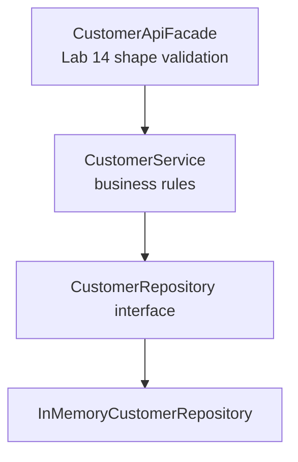
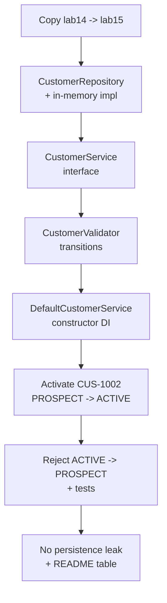

# Lab 15: Service Layer Design — Northstar CRM Business Rules

**Module:** 15 — Business Logic and Service Layer Design  
**Lab folder:** `labs/Week 2 - Backend, AI Tools and Testing/module-15/lab15/`  
**Difficulty:** Intermediate  
**Duration:** 3–4 Hours

**Primary IDE:** IntelliJ IDEA Community Edition · **Optional IDE:** VS Code

| OS | How-to for this lab |
| -- | ------------------- |
| Windows | [LAB-15-WINDOWS.md](LAB-15-WINDOWS.md) |
| macOS | [LAB-15-MACOS.md](LAB-15-MACOS.md) |

> **Environment reminder:** Finish [Lab 0](../../../Week%201%20-%20Java%20and%20JVM%20Foundations/module-00/lab0/LAB-0-GUIDE.md). Use **IntelliJ IDEA Community** (primary; optional VS Code) on your laptop with **JDK 21** and **Maven 3.9+**. Work under `~/java-bootcamp` (Windows: `%USERPROFILE%\java-bootcamp`).

---

## How to follow this lab

1. Open the **Windows** or **macOS** how-to (links above) in a second tab.
2. Create/work only under your `java-bootcamp/examples/…` folder from the steps (not inside this `labs/` git clone unless a step says otherwise).
3. For each **Step N**: read **Why** (if present) → do the actions → confirm **Expected** / **Expected result** → then continue.
4. When stuck, use **Failure Experiments** / troubleshooting in this guide before asking for help.
5. Capture evidence under `notes/screenshots/lab-15/` (workspace root under `java-bootcamp`; redact secrets). Use the **Pass criteria** tables — write **Pass** or **Fail** in your notes. GitHub file view does not support clickable checkboxes.

## Lab Overview

This Module 15 lab extends the **Customer Management Platform** with a deliberate **service layer**: `CustomerService` (interface + implementation), `CustomerValidator` for business rules, and status-transition rules such as `PROSPECT → ACTIVE`—without leaking persistence details through the API.

**Purpose.** Bean Validation (Lab 14) checks *shape*. Business rules check *meaning*: duplicate IDs/emails, who may become ACTIVE, and which transitions are illegal. Those rules belong in one place so Labs 17–18 can unit-test them and Lab 22+ can inject the same constructors with Spring.

**What you build (exercise).** Copy `lab14-crm` → `lab15-crm`; introduce `CustomerRepository` + in-memory impl (Map private); define `CustomerService` / `DefaultCustomerService`; implement `CustomerValidator` transitions; activate `CUS-1002`; reject `ACTIVE → PROSPECT` with `lab-request-001`; prove no Map/SQL leak; document the transition table.

**What success looks like.** Under `~/java-bootcamp/examples/lab15-crm/` Main activates Ravi to ACTIVE, illegal transitions leave Amina ACTIVE, validator tests pass, and grep shows no `HashMap` in the service package.

**Depends on Lab 14.** Need DTO/facade boundary plus `Customer` / `CustomerStatus`. If Lab 14 is incomplete, finish it first.

**CRM connection.** Same fixtures. Lab 16 will expand exceptions; Labs 17–18 test this service with mocks. Persistence stays in-memory; React/Kafka/PostgreSQL remain future.

---

## Learning Objectives

After completing this lab, you will be able to:

* Separate facade, service, validator, and repository responsibilities
* Define a DI-friendly `CustomerService` interface and concrete implementation
* Implement `CustomerValidator` for identity, email uniqueness, and status transitions
* Enforce `PROSPECT → ACTIVE` and reject illegal transitions in one place
* Keep persistence details (`Map`, SQL, file I/O) behind a repository interface
* Wire constructor injection manually as a preview of Spring DI
* Explain what changes under Spring `@Service` later **without** rewriting rules
* Prove failed transitions do not corrupt stored status

---

## Business Scenario

Operations staff activate prospects after KYC. Today that logic is scattered across demos and if-statements. Leadership wants:

* One service method to create customers and one to change status
* Explicit rules: a `PROSPECT` may become `ACTIVE`; an `ACTIVE` customer cannot become `PROSPECT` again without a documented override path (not in this lab)
* Validation of business meaning (not only Bean Validation of shapes) before save
* Constructor injection so unit tests (Labs 17–18) can substitute fakes/mocks

Use these examples consistently:

| ID | Name | Starting status | Email |
| -- | ---- | --------------- | ----- |
| `CUS-1001` | Amina Khan | `ACTIVE` | `amina.khan@example.com` |
| `CUS-1002` | Ravi Singh | `PROSPECT` | `ravi.singh@example.com` |

* Correlation ID: `lab-request-001`
* Timestamps: ISO-8601 / existing entity clock fields

**Security note for evidence.** Sample emails only. No secrets or real PII in logs or Git.

---

## Architecture Context

### NOW (this lab)



### Lab flow (mermaid)



### Architecture NOW vs LATER

| Aspect | Lab 15 (NOW) | Later (Spring / DB) |
| ------ | ------------ | ------------------- |
| Wiring | Manual `new` in Main | `@Service` / `@Autowired` constructors |
| Store | In-memory Map behind interface | JPA repository |
| Rules | `CustomerValidator` | Same rules; maybe domain events |
| Errors | `IllegalStateException` (+ Lab 16 types) | Exception handlers / Problem Details |

**Lab focus:** Service layer design, business rules, DI-friendly interfaces, no persistence leak.

---

## Prerequisites

Complete [SETUP](../../../SETUP-INSTRUCTIONS.md), [Lab 0](../../../Week%201%20-%20Java%20and%20JVM%20Foundations/module-00/lab0/LAB-0-GUIDE.md), and preferably [Lab 14](../../module-14/lab14/LAB-14-GUIDE.md). Confirm:

* JDK 21; Maven; Git
* Lab 14 DTOs, mapper, and facade as starting point (`lab14-crm/` → `lab15-crm/`)
* No secrets committed to Git

### Pre-flight

```bash
java -version
mvn -version
git --version
pwd
ls ~/java-bootcamp/examples
```

Fix environment failures before changing application code.

---

## Suggested Project Files

```text
~/java-bootcamp/examples/lab15-crm/
├── src/
│   ├── main/java/com/northstar/crm/
│   │   ├── Main.java
│   │   ├── dto/ ...
│   │   ├── entity/
│   │   │   ├── Customer.java
│   │   │   └── CustomerStatus.java
│   │   ├── api/CustomerApiFacade.java
│   │   ├── mapper/CustomerMapper.java
│   │   ├── service/
│   │   │   ├── CustomerService.java
│   │   │   ├── DefaultCustomerService.java
│   │   │   └── CustomerValidator.java
│   │   ├── repository/
│   │   │   ├── CustomerRepository.java
│   │   │   └── InMemoryCustomerRepository.java
│   │   └── exception/
│   │       └── BusinessException.java   (thin stub OK; Lab 16 expands)
│   └── test/java/com/northstar/crm/service/
│       └── CustomerValidatorTest.java
├── docs/
│   └── service-layer-notes.md
├── notes/screenshots/
├── pom.xml
├── .gitignore
└── README.md
```

Ignore `target/`, IDE metadata, tokens, and passwords.

---

## Concepts to Discuss

Write 2–3 sentences each in `docs/service-layer-notes.md`:

1. Main data/request flow (facade → service → validator/repository)
2. Trust boundary: Bean Validation (shape) vs `CustomerValidator` (meaning)
3. Success/failure contract for create and `changeStatus`
4. Stable identity (`CUS-1001`) vs mutable status
5. Retry/idempotency for `changeStatus` when already ACTIVE
6. In-memory repository vs future JPA behind the same interface
7. Correlation ID on illegal transitions for support
8. Two JVMs = independent memory (activation races later need DB constraints)
9. Why constructor DI beats service locators for Labs 17–18
10. What Spring will change in wiring but not in transition tables

---

## Implementation Steps

Complete each step in order. Commands assume `~/java-bootcamp/examples/lab15-crm` (Windows: `%USERPROFILE%\java-bootcamp\examples\lab15-crm`) unless noted.

---

### Step 1 — Branch Lab 14 and introduce repository interface

**Why:** Callers must depend on a storage *role*, not `HashMap`. That is the anti-leak rule for this lab.

**Do this:**

```bash
cd ~/java-bootcamp/examples
cp -r lab14-crm lab15-crm
cd lab15-crm
mkdir -p docs
mkdir -p ~/java-bootcamp/notes/screenshots/lab-15
```

```java
package com.northstar.crm.repository;

import com.northstar.crm.entity.Customer;
import java.util.List;
import java.util.Optional;

public interface CustomerRepository {
    Customer save(Customer customer);
    Optional<Customer> findById(String customerId);
    boolean existsById(String customerId);
    boolean existsByEmail(String email);
    List<Customer> findAll();
}
```

Implement `InMemoryCustomerRepository` with a **private** `Map<String, Customer>`. Do not expose getters for the map. Refactor any previous service that held a raw list to use this repository instead.

**Expected result:** Interface + impl compile; facade/service import the interface, not `HashMap`.

**If it fails:** Duplicate class names from old service-owned lists → migrate carefully; keep one source of truth.

---

### Step 2 — Define the `CustomerService` interface

**Why:** Interfaces enable substituting fakes in Labs 17–18 and Spring beans later without rewriting callers.

**Do this:**

```java
package com.northstar.crm.service;

import com.northstar.crm.entity.Customer;
import com.northstar.crm.entity.CustomerStatus;
import java.util.List;
import java.util.Optional;

public interface CustomerService {
    Customer addCustomer(Customer customer);
    Optional<Customer> findById(String customerId);
    List<Customer> listAll();
    Customer changeStatus(String customerId, CustomerStatus newStatus, String correlationId);
}
```

No Jakarta persistence or Spring annotations on the interface. If Lab 14 facade called differently named methods, adapt the facade to this interface (or add adapters and document).

**Expected result:** Use-case methods present; `changeStatus` includes `correlationId`.

**If it fails:** Name clash with old concrete `CustomerService` class → rename old class to `DefaultCustomerService` as in Step 4.

---

### Step 3 — Implement `CustomerValidator` business rules

**Why:** Status graphs and uniqueness are domain policy—not repository I/O and not Bean Validation size limits.

**Do this:**

```java
package com.northstar.crm.service;

import com.northstar.crm.entity.Customer;
import com.northstar.crm.entity.CustomerStatus;
import com.northstar.crm.repository.CustomerRepository;
import java.util.EnumMap;
import java.util.EnumSet;
import java.util.Map;
import java.util.Set;

public class CustomerValidator {
    private static final Map<CustomerStatus, Set<CustomerStatus>> ALLOWED =
        new EnumMap<>(CustomerStatus.class);

    static {
        ALLOWED.put(CustomerStatus.PROSPECT, EnumSet.of(CustomerStatus.ACTIVE, CustomerStatus.CLOSED));
        ALLOWED.put(CustomerStatus.ACTIVE, EnumSet.of(CustomerStatus.SUSPENDED, CustomerStatus.CLOSED));
        ALLOWED.put(CustomerStatus.SUSPENDED, EnumSet.of(CustomerStatus.ACTIVE, CustomerStatus.CLOSED));
        ALLOWED.put(CustomerStatus.CLOSED, EnumSet.noneOf(CustomerStatus.class));
    }

    private final CustomerRepository repository;

    public CustomerValidator(CustomerRepository repository) {
        this.repository = repository;
    }

    public void validateNew(Customer customer) {
        if (customer.getCustomerId() == null || customer.getCustomerId().isBlank()) {
            throw new IllegalArgumentException("customerId is required");
        }
        if (repository.existsById(customer.getCustomerId())) {
            throw new IllegalStateException("duplicate customerId: " + customer.getCustomerId());
        }
        if (repository.existsByEmail(customer.getEmail())) {
            throw new IllegalStateException("duplicate email: " + customer.getEmail());
        }
    }

    public void validateTransition(CustomerStatus from, CustomerStatus to, String correlationId) {
        Set<CustomerStatus> allowed = ALLOWED.getOrDefault(from, Set.of());
        if (!allowed.contains(to)) {
            throw new IllegalStateException(
                "illegal status transition " + from + " -> " + to
                    + " [" + correlationId + "]");
        }
    }
}
```

Adjust enum constants to match Labs 10–14; keep at least `PROSPECT` and `ACTIVE`.

**Expected result:** `PROSPECT → ACTIVE` allowed; `ACTIVE → PROSPECT` throws mentioning correlationId.

**If it fails:** Missing enum values → align `CustomerStatus`. Rules living in repository → move them here.

---

### Step 4 — Implement `DefaultCustomerService` with constructor DI

**Why:** The service orchestrates validator + repository. Constructor parameters are the DI surface Spring will honor later.

**Do this:**

```java
package com.northstar.crm.service;

import com.northstar.crm.entity.Customer;
import com.northstar.crm.entity.CustomerStatus;
import com.northstar.crm.repository.CustomerRepository;
import java.util.List;
import java.util.Optional;

public class DefaultCustomerService implements CustomerService {
    private final CustomerRepository repository;
    private final CustomerValidator validator;

    public DefaultCustomerService(CustomerRepository repository, CustomerValidator validator) {
        this.repository = repository;
        this.validator = validator;
    }

    @Override
    public Customer addCustomer(Customer customer) {
        validator.validateNew(customer);
        return repository.save(customer);
    }

    @Override
    public Optional<Customer> findById(String customerId) {
        return repository.findById(customerId);
    }

    @Override
    public List<Customer> listAll() {
        return List.copyOf(repository.findAll());
    }

    @Override
    public Customer changeStatus(String customerId, CustomerStatus newStatus, String correlationId) {
        Customer existing = repository.findById(customerId)
            .orElseThrow(() -> new IllegalArgumentException(
                "customer not found [" + correlationId + "]: " + customerId));
        validator.validateTransition(existing.getStatus(), newStatus, correlationId);
        existing.setStatus(newStatus);
        // touchUpdatedAt() if your entity supports it; else setUpdatedAt(now)
        return repository.save(existing);
    }
}
```

Wire Main / facade with the **same** repository instance for validator and service:

```java
CustomerRepository repo = new InMemoryCustomerRepository();
CustomerValidator validator = new CustomerValidator(repo);
CustomerService service = new DefaultCustomerService(repo, validator);
```

Update Lab 14 facade to depend on `CustomerService` interface.

**Expected result:** No `new HashMap` inside the service; constructors take roles/interfaces.

**If it fails:** Two different repo instances → uniqueness checks miss existing customers. Fix shared wiring.

---

### Step 5 — Activate Ravi: `PROSPECT → ACTIVE`

**Why:** This is the business happy path leadership asked for—proof the transition table is live.

**Do this:** In `Main`, seed Amina ACTIVE and Ravi PROSPECT, then:

```java
service.addCustomer(amina); // ACTIVE
service.addCustomer(ravi);  // PROSPECT
Customer activated = service.changeStatus(
    "CUS-1002", CustomerStatus.ACTIVE, "lab-request-001");
System.out.printf("activated %s status=%s%n",
    activated.getCustomerId(), activated.getStatus());
```

```bash
mvn -q -DskipTests compile
mvn -q exec:java -Dexec.mainClass=com.northstar.crm.Main
# or: java -cp ... com.northstar.crm.Main
```

**Expected result:** `activated CUS-1002 status=ACTIVE`

**If it fails:** Ravi not PROSPECT at seed → fix seed data. Transition not in ALLOWED → check validator static block.

---

### Step 6 — Force an illegal transition and capture the error

**Why:** Graders require proof that bad transitions fail *and* leave state unchanged.

**Do this:**

```java
try {
    service.changeStatus("CUS-1001", CustomerStatus.PROSPECT, "lab-request-001");
} catch (IllegalStateException ex) {
    System.out.println("expected failure: " + ex.getMessage());
}
System.out.println("CUS-1001 still: " + service.findById("CUS-1001").orElseThrow().getStatus());
```

**Expected result:** Failure message includes `ACTIVE -> PROSPECT` and `[lab-request-001]`; Amina remains ACTIVE.

**If it fails:** Status flipped despite exception → validate **before** `setStatus` (order in Step 4). Soft-catch swallowing exception → rethrow after logging for demos only after printing.

---

### Step 7 — Prove no persistence leak + validator tests

**Why:** Leaking `Map` or JDBC types through the service defeats the layer design.

**Do this:**

1. Search service sources for `HashMap`, `Connection`, `EntityManager`—expect none.
2. Add `CustomerValidatorTest`:

```java
@Test
void allowsProspectToActive() {
    var repo = new InMemoryCustomerRepository();
    var validator = new CustomerValidator(repo);
    assertDoesNotThrow(() ->
        validator.validateTransition(
            CustomerStatus.PROSPECT, CustomerStatus.ACTIVE, "lab-request-001"));
}

@Test
void rejectsActiveToProspect() {
    var validator = new CustomerValidator(new InMemoryCustomerRepository());
    assertThrows(IllegalStateException.class, () ->
        validator.validateTransition(
            CustomerStatus.ACTIVE, CustomerStatus.PROSPECT, "lab-request-001"));
}
```

```bash
mvn -q test -Dtest=CustomerValidatorTest
```

Note why `listAll` returns `List.copyOf` (callers cannot mutate internal storage).

**Expected result:** Tests green; no Map/SQL leakage in service sources.

**If it fails:** Accidental public `getMap()` on repository → remove it.

---

### Step 8 — Document service responsibilities

**Why:** Transition tables must not live only in someone’s head.

**Do this:** Update README / `docs/service-layer-notes.md`:

* Bean Validation (Lab 14) vs `CustomerValidator` (this lab)
* Allowed transition table:

```text
PROSPECT  -> ACTIVE, CLOSED
ACTIVE    -> SUSPENDED, CLOSED
SUSPENDED -> ACTIVE, CLOSED
CLOSED    -> (none)
```

* Manual wiring snippet (Spring DI preview)
* Decision on same-status `changeStatus` (noop vs reject)—pick one and document

**Expected result:** Another student can activate `CUS-1002` from README alone.

**If it fails:** Undocumented table that differs from code → sync them.

---

### Step 9 — Failure experiments + evidence pack

**Why:** Shared-repo wiring bugs and illegal transitions are the classic support tickets.

**Do this:** Complete [Failure Experiments](#failure-experiments). Capture Main + Surefire evidence under `notes/screenshots/lab-15/`.

```bash
mvn -q clean test
git status
```

**Expected result:** ≥3 experiments documented; suite green after restores.

**If it fails:** See Troubleshooting.

---

## Implementation Checkpoints

### Checkpoint A — Repository boundary

_Mark each row **Pass** or **Fail** in your lab notes (GitHub markdown files are not interactive checklists)._

| # | Confirm | Your notes |
| - | ------- | ---------- |
| 1 | `lab15-crm` under `examples/` | Pass / Fail |
| 2 | `CustomerRepository` + private-Map in-memory impl | Pass / Fail |
| 3 | No Map exposed to callers | Pass / Fail |

### Checkpoint B — Service + validator

_Mark each row **Pass** or **Fail** in your lab notes (GitHub markdown files are not interactive checklists)._

| # | Confirm | Your notes |
| - | ------- | ---------- |
| 1 | `CustomerService` interface + `DefaultCustomerService` | Pass / Fail |
| 2 | `CustomerValidator` with ALLOWED transitions | Pass / Fail |
| 3 | Shared repository instance in wiring | Pass / Fail |

### Checkpoint C — Behavior proof

_Mark each row **Pass** or **Fail** in your lab notes (GitHub markdown files are not interactive checklists)._

| # | Confirm | Your notes |
| - | ------- | ---------- |
| 1 | `CUS-1002` activates PROSPECT → ACTIVE | Pass / Fail |
| 2 | `CUS-1001` ACTIVE → PROSPECT rejected; status unchanged | Pass / Fail |
| 3 | Correlation ID present on failure | Pass / Fail |

### Checkpoint D — Tests + docs

_Mark each row **Pass** or **Fail** in your lab notes (GitHub markdown files are not interactive checklists)._

| # | Confirm | Your notes |
| - | ------- | ---------- |
| 1 | `CustomerValidatorTest` green | Pass / Fail |
| 2 | README transition table + wiring | Pass / Fail |
| 3 | Failure experiments recorded; no secrets/`target/` staged | Pass / Fail |

---

## Reference Commands, Configuration, and Code

### Interface excerpt

```java
Customer changeStatus(String customerId, CustomerStatus newStatus, String correlationId);
```

### Allowed transitions

```text
PROSPECT  -> ACTIVE, CLOSED
ACTIVE    -> SUSPENDED, CLOSED
SUSPENDED -> ACTIVE, CLOSED
CLOSED    -> (none)
```

### Commands

```bash
cd ~/java-bootcamp/examples/lab15-crm
mvn -q clean test
mvn -q test -Dtest=CustomerValidatorTest
mvn -q exec:java -Dexec.mainClass=com.northstar.crm.Main
git status
```

### Class map

| Class | Role |
| ----- | ---- |
| `CustomerService` | Use-case API |
| `DefaultCustomerService` | Orchestration + DI constructors |
| `CustomerValidator` | Business meaning rules |
| `CustomerRepository` | Persistence port |
| `InMemoryCustomerRepository` | Adapter (Map hidden) |

---

## Manual Verification

1. Create Amina ACTIVE and Ravi PROSPECT.
2. Activate Ravi → ACTIVE succeeds.
3. Illegal `ACTIVE → PROSPECT` on Amina fails with correlation id.
4. Amina still ACTIVE after failure.
5. Duplicate customerId/email fail with clear messages.
6. Service has no HashMap/SQL imports.
7. `listAll` is unmodifiable from caller’s perspective.
8. Constructor DI graph explicit in Main.
9. Validator tests pass.
10. README transition table matches code.

---

## Failure Experiments

| # | Experiment | Observe | Restore / conclude |
| - | ---------- | ------- | ------------------ |
| 1 | Repository `save` always throws | Service surfaces failure; prior customers intact | Fix stub |
| 2 | `CLOSED → ACTIVE` and `ACTIVE → PROSPECT` | Both fail via validator | Keep rules |
| 3 | `changeStatus` to ACTIVE twice | Document noop vs reject; enforce one | Match README |
| 4 | Wire two different repo instances | Duplicate email not detected | Shared instance |
| 5 | Set status before validateTransition | Corrupt state on failure | Validate first |

---

## Troubleshooting

| Symptom | Likely cause | Fix |
| ------- | ------------ | --- |
| Uniqueness misses | Two repo instances | Share one repo in wiring |
| Wrong status enum | DTO string mismatch | Match `CustomerStatus.name()` |
| Transition always fails | ALLOWED map incomplete | Align static block with enum |
| Status corrupted on error | Mutate before validate | Reorder Step 4 method |
| Facade compile errors | Old concrete service type | Depend on interface |
| Flaky tests | Shared static mutable state | Fresh repo per test |

### Email case policy

Document whether emails are case-sensitive or lowercased before `existsByEmail`.

---

## Security and Production Review

Answer in README:

1. Which inputs are untrusted (all client fields reaching the service)?
2. Where are authn/authz/validation enforced (shape at facade; meaning in validator; auth still absent)?
3. Which values are sensitive, and where stored?
4. What can be retried safely (`findById`; `changeStatus` depending on your noop policy)?
5. What happens after partial failure (no status write if validation fails)?
6. What would an operator monitor (rejected transition counts, correlation IDs)?
7. Which local default is unacceptable in production (in-memory; no auth)?
8. How are transition policies versioned when product changes KYC rules?

---

## Cleanup

```bash
cd ~/java-bootcamp/examples/lab15-crm
mvn -q clean
git status
```

No containers required. **Keep `lab15-crm`**—Lab 16 expands exceptions on these paths.

---

## Expected Deliverables

* `CustomerService` + `DefaultCustomerService`
* `CustomerValidator` with status-transition rules
* `CustomerRepository` + in-memory impl (Map not leaked)
* Evidence: activate `CUS-1002`; failed illegal transition; validator tests
* README / notes with transition table and wiring
* No secrets or `target/` committed

---

## Evaluation Rubric (100 Marks)

| Criteria | Marks |
| -------- | ----: |
| Environment and project structure | 10 |
| Core implementation (service, validator, repository) | 30 |
| Integration/configuration correctness (DI wiring) | 15 |
| Failure handling (illegal transitions, duplicates) | 15 |
| Automated verification | 10 |
| Security and production awareness | 10 |
| Documentation and evidence | 10 |

**Notes:** Shared-repo wiring mistakes and status corruption on failed transitions are major deductions. Spring annotations are not required and should not appear yet.

---

## Reflection Questions

Write 3–6 sentence answers:

1. Which design decision most affected correctness?
2. Which failure was hardest to diagnose?
3. What evidence proves the implementation works?
4. What breaks first at ten times the load (or concurrent activations)?
5. Which concern should move to shared infrastructure?
6. What must change before real customer data is used?
7. How does this lab connect to Labs 14 and 16–18?
8. What metric or log field matters most for rejected transitions?
9. (Forward look) What stays identical when Spring injects `DefaultCustomerService`?

---

## Bonus Challenges

1. Structured correlation + customerId on every business-rule failure object.
2. Extract `StatusTransitionPolicy` interface for swappable rules in tests.
3. Query method `canActivate(customerId)` without mutating state.
4. Counters for successful vs rejected transitions.
5. Document Spring constructor injection mapping for Lab 22+.
6. Enforce email uniqueness case-insensitively with documented policy.

---

## Success Criteria

You are finished when:

* You can demonstrate service + validator + `PROSPECT→ACTIVE`
* Happy path and illegal-transition failure are repeatable
* Failed transitions leave prior status intact
* Another student can follow your README
* Tests/build pass
* No production secret is hard-coded
* You can explain why the service never exposes the repository’s Map

---

## Instructor Notes

* **Live probe:** Reproduce `ACTIVE → PROSPECT` with `lab-request-001` and show `CUS-1001` unchanged. Ask whether validator and repository share one instance—a common wiring mistake.
* **Assess:** Transition table documented vs coded consistency; DI constructors; no Map leak.
* **Continuity:** Prefer `examples/lab15-crm`. Keep sample IDs. Lab 16 should wrap these failures in richer exception types.
* **Common pitfalls:** Two repos; mutating before validate; putting transition rules in the repository; Spring annotations early; undocumented same-status behavior.
* **Timing:** 3–4 hours. Wiring bugs dominate—demo shared vs split repository for five minutes if many students “lose” uniqueness.

---

*End of Lab 15 — Service Layer Design: Northstar CRM Business Rules. Keep `lab15-crm` for Lab 16+ and portfolio evidence.*
