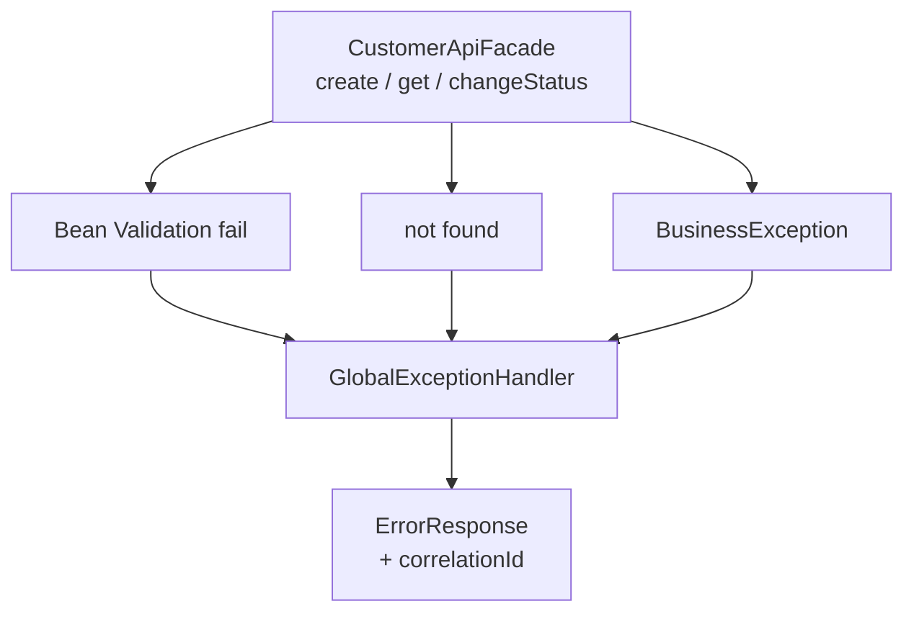
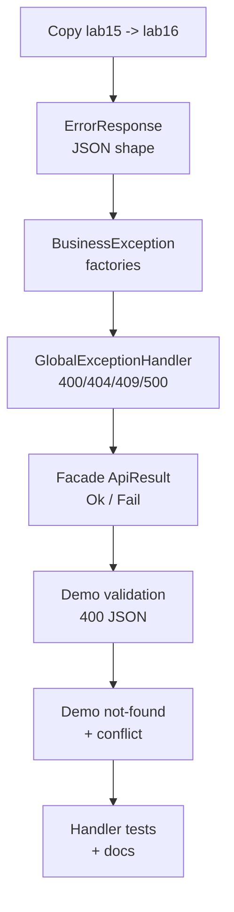

# Lab 16: API Exception Handling — Northstar CRM Error Model

**Module:** 16 — Exception Handling in Distributed APIs  
**Lab folder:** `labs/Week 2 - Backend, AI Tools and Testing/module-16/lab16/`  
**Difficulty:** Intermediate  
**Duration:** 3–4 Hours

**Primary IDE:** IntelliJ IDEA Community Edition · **Optional IDE:** VS Code

| OS | How-to for this lab |
| -- | ------------------- |
| Windows | [LAB-16-WINDOWS.md](LAB-16-WINDOWS.md) |
| macOS | [LAB-16-MACOS.md](LAB-16-MACOS.md) |

> **Environment reminder:** Finish [Lab 0](../../../Week%201%20-%20Java%20and%20JVM%20Foundations/module-00/lab0/LAB-0-GUIDE.md). Use **IntelliJ IDEA Community** (primary; optional VS Code) on your laptop with **JDK 21** and **Maven 3.9+**. Work under `~/java-bootcamp` (Windows: `%USERPROFILE%\java-bootcamp`).

---

## How to follow this lab

1. Open the **Windows** or **macOS** how-to (links above) in a second tab.
2. Create/work only under your `java-bootcamp/examples/…` folder from the steps (not inside this `labs/` git clone unless a step says otherwise).
3. For each **Step N**: read **Why** (if present) → do the actions → confirm **Expected** / **Expected result** → then continue.
4. When stuck, use **Failure Experiments** / troubleshooting in this guide before asking for help.
5. Capture evidence under `notes/screenshots/lab-16/` (workspace root under `java-bootcamp`; redact secrets). Use the **Pass criteria** tables — write **Pass** or **Fail** in your notes. GitHub file view does not support clickable checkboxes.

## Lab Overview

This Module 16 lab extends the **Customer Management Platform** with a consistent **API error model**: `BusinessException`, `ErrorResponse`, and a `GlobalExceptionHandler` that maps validation failures and not-found cases to one payload shape, always carrying a **correlation ID**.

**Purpose.** Support cannot triage CRM failures when every layer throws different unstructured exceptions. A stable error document lets React (later) and SoapUI partners display field errors, distinguish 404 from 409, and paste `lab-request-001` into logs.

**What you build (exercise).** Copy `lab15-crm` → `lab16-crm`; implement `ErrorResponse` + `BusinessException` factories; build `GlobalExceptionHandler`; integrate into `CustomerApiFacade` (`ApiResult`); demo 400 / 404 / 409 JSON with correlation; add `GlobalExceptionHandlerTest`; document status-code choices.

**What success looks like.** Under `~/java-bootcamp/examples/lab16-crm/` every failure path prints the same JSON fields (`timestamp`, `status`, `error`, `message`, `correlationId`, `errors`), never a stack trace to the “API” channel, and tests lock handler mapping.

**Depends on Labs 14–15.** Need Bean Validation at the facade and `BusinessException`-worthy service/validator failures (illegal transitions, not found). Finish Lab 15 if activation/transition rules are missing.

**CRM connection.** Same fixtures (`CUS-1001`, `CUS-1002`, `CUS-9999` for not-found). Lab 29+ maps this handler to Spring MVC advice. No HTTP server required today.

---

## Learning Objectives

After completing this lab, you will be able to:

* Classify validation, not-found, and business-rule failures
* Implement `BusinessException` with an error code and HTTP-like status hint
* Design `ErrorResponse` with timestamp, status, message, errors map, and `correlationId`
* Centralize mapping in `GlobalExceptionHandler`
* Map Bean Validation violations and missing customers to consistent payloads
* Propagate `lab-request-001` from facade entry to error JSON/text
* Avoid leaking stack traces or internal entity details to API consumers
* Explain how this design maps to Spring `@ControllerAdvice` later

---

## Business Scenario

Support engineers cannot triage CRM failures when every layer throws a different exception type with unstructured messages. Product wants a stable error document:

```json
{
  "timestamp": "2026-07-14T17:00:00Z",
  "status": 404,
  "error": "Not Found",
  "message": "Customer not found",
  "correlationId": "lab-request-001",
  "errors": {}
}
```

Validation failures use status `400` and populate `errors` with field messages. Business rule failures (illegal status transition) use `409` or `422`—**pick one and document it** (this guide standardizes on **409**).

Use these examples consistently:

| ID / value | Use |
| ---------- | --- |
| `CUS-1001` | Amina Khan — `ACTIVE` (happy path + illegal transition target) |
| `CUS-1002` | Ravi Singh — `PROSPECT` |
| `CUS-9999` | Not-found demo |
| `lab-request-001` | Correlation on every error |
| ISO-8601 UTC | `timestamp` field |

**Security note for evidence.** Never put stack traces, SQL, or real PII into `ErrorResponse.message`. Log details server-side only.

---

## Architecture Context

### NOW (this lab)



### Lab flow (mermaid)



### Architecture NOW vs LATER

| Aspect | Lab 16 (NOW) | Later (Spring) |
| ------ | ------------ | -------------- |
| Entry | Facade returns `ApiResult` | `@RestController` + advice |
| Handler | Plain `GlobalExceptionHandler` | `@ControllerAdvice` |
| Payload | Same JSON fields | Same contract preferred |
| Logging | stdout / simple logger | SLF4J + correlation MDC |

**Lab focus:** Global exception handling, stable error payloads, correlation IDs for distributed debugging.

---

## Prerequisites

Complete [SETUP](../../../SETUP-INSTRUCTIONS.md), [Lab 0](../../../Week%201%20-%20Java%20and%20JVM%20Foundations/module-00/lab0/LAB-0-GUIDE.md), and Labs [14](../../module-14/lab14/LAB-14-GUIDE.md)–[15](../../module-15/lab15/LAB-15-GUIDE.md). Confirm:

* JDK 21; Maven; Git
* Lab 15 service/validator + Lab 14 validation wired
* No secrets committed to Git

### Pre-flight

```bash
java -version
mvn -version
git --version
pwd
ls ~/java-bootcamp/examples
```

Fix environment failures before changing application code.

---

## Suggested Project Files

```text
~/java-bootcamp/examples/lab16-crm/
├── src/
│   ├── main/java/com/northstar/crm/
│   │   ├── Main.java
│   │   ├── api/CustomerApiFacade.java
│   │   ├── dto/ ...
│   │   ├── service/ ...
│   │   ├── repository/ ...
│   │   └── exception/
│   │       ├── BusinessException.java
│   │       ├── ErrorResponse.java
│   │       └── GlobalExceptionHandler.java
│   └── test/java/com/northstar/crm/exception/
│       └── GlobalExceptionHandlerTest.java
├── docs/
│   └── error-model-notes.md
├── notes/screenshots/
├── pom.xml
├── .gitignore
└── README.md
```

Ignore `target/`, IDE metadata, tokens, and passwords.

---

## Concepts to Discuss

Write 2–3 sentences each in `docs/error-model-notes.md`:

1. Main error flow (throw/fail → handler → `ErrorResponse`)
2. Trust boundary: what clients may see vs what logs may hold
3. Success vs 400 vs 404 vs 409 contracts
4. Stable identity in messages (`CUS-9999`) without dumping entities
5. Retry implications (404/409 often not blindly retried; 500 maybe)
6. Why one JSON shape beats ad-hoc `ex.getMessage()` strings for React
7. Correlation ID as the support join key across services
8. Two instances: correlation still works without shared memory
9. Why 500 messages must be generic
10. What Spring `@ControllerAdvice` will wrap without changing the payload fields

---

## Implementation Steps

Complete each step in order. Commands assume `~/java-bootcamp/examples/lab16-crm` (Windows: `%USERPROFILE%\java-bootcamp\examples\lab16-crm`) unless noted.

---

### Step 1 — Branch Lab 15 and define `ErrorResponse`

**Why:** Clients parse one schema. Missing `correlationId` or inconsistent `errors` breaks support tooling.

**Do this:**

```bash
cd ~/java-bootcamp/examples
cp -r lab15-crm lab16-crm
cd lab16-crm
mkdir -p docs
mkdir -p ~/java-bootcamp/notes/screenshots/lab-16
```

Create `ErrorResponse` as in the overview (immutable maps, `toJson()`, getters). Ensure JSON always includes `errors` (possibly empty `{}`).

**Expected result:** Class compiles; JSON always includes `correlationId` and `errors`.

**If it fails:** Mutable public maps → wrap with `unmodifiableMap`. Manual JSON escaping is fine for demos; avoid inventing a JSON library dependency unless already present.

---

### Step 2 — Implement `BusinessException`

**Why:** Typed codes (`CUSTOMER_NOT_FOUND`) beat parsing English messages in handlers and clients.

**Do this:**

```java
package com.northstar.crm.exception;

public class BusinessException extends RuntimeException {
    private final String code;
    private final int statusHint;
    private final String correlationId;

    public BusinessException(String code, String message, int statusHint, String correlationId) {
        super(message);
        this.code = code;
        this.statusHint = statusHint;
        this.correlationId = correlationId;
    }

    public String getCode() { return code; }
    public int getStatusHint() { return statusHint; }
    public String getCorrelationId() { return correlationId; }

    public static BusinessException notFound(String customerId, String correlationId) {
        return new BusinessException(
            "CUSTOMER_NOT_FOUND",
            "Customer not found: " + customerId,
            404,
            correlationId);
    }

    public static BusinessException conflict(String message, String correlationId) {
        return new BusinessException("BUSINESS_CONFLICT", message, 409, correlationId);
    }
}
```

Refactor Lab 15 `CustomerValidator` / `DefaultCustomerService` so illegal transitions and (optionally) duplicates throw `BusinessException.conflict(...)`, and missing customers use `notFound(...)`, carrying the correlation ID from the service method parameter.

**Expected result:** `notFound("CUS-9999","lab-request-001")` → statusHint 404; illegal transitions → conflict 409.

**If it fails:** Still throwing raw `IllegalStateException` → facade cannot map stably; finish the refactor.

---

### Step 3 — Build `GlobalExceptionHandler`

**Why:** One place owns status/code/message mapping—preview of `@ControllerAdvice`.

**Do this:**

```java
package com.northstar.crm.exception;

import jakarta.validation.ConstraintViolation;
import java.util.LinkedHashMap;
import java.util.Map;
import java.util.Set;

public class GlobalExceptionHandler {

    public ErrorResponse fromBusiness(BusinessException ex) {
        return new ErrorResponse(
            ex.getStatusHint(),
            ex.getCode(),
            ex.getMessage(),
            ex.getCorrelationId(),
            Map.of());
    }

    public ErrorResponse fromValidation(
            Set<? extends ConstraintViolation<?>> violations, String correlationId) {
        Map<String, String> fields = new LinkedHashMap<>();
        for (ConstraintViolation<?> v : violations) {
            fields.put(v.getPropertyPath().toString(), v.getMessage());
        }
        return new ErrorResponse(
            400, "VALIDATION_FAILED", "Validation failed", correlationId, fields);
    }

    public ErrorResponse fromUnexpected(Exception ex, String correlationId) {
        // Log full stack internally; do not put stack or ex.getMessage() if it may leak
        return new ErrorResponse(
            500, "INTERNAL_ERROR", "Unexpected server error", correlationId, Map.of());
    }
}
```

**Expected result:** Three families mapped (business, validation, unexpected); 500 stays generic.

**If it fails:** Putting `ex.toString()` in 500 message → remove it; log instead.

---

### Step 4 — Integrate handler into `CustomerApiFacade`

**Why:** The “API channel” must return Ok DTO or Fail `ErrorResponse`—never an uncaught stack dump in Main demos.

**Do this:** Introduce a result type (sealed interface or classic class hierarchy):

```java
public sealed interface ApiResult {
    record Ok(CustomerResponseDTO body) implements ApiResult {}
    record Fail(ErrorResponse error) implements ApiResult {}
}
```

Wrap create/get/changeStatus:

```java
public ApiResult create(CustomerRequestDTO request, String correlationId) {
    var violations = validator.validate(request);
    if (!violations.isEmpty()) {
        return new ApiResult.Fail(handler.fromValidation(violations, correlationId));
    }
    try {
        var saved = service.addCustomer(CustomerMapper.toEntity(request));
        return new ApiResult.Ok(CustomerMapper.toResponse(saved));
    } catch (BusinessException ex) {
        return new ApiResult.Fail(handler.fromBusiness(ex));
    } catch (Exception ex) {
        return new ApiResult.Fail(handler.fromUnexpected(ex, correlationId));
    }
}

public ApiResult getById(String customerId, String correlationId) {
    try {
        return service.findById(customerId)
            .<ApiResult>map(c -> new ApiResult.Ok(CustomerMapper.toResponse(c)))
            .orElseThrow(() -> BusinessException.notFound(customerId, correlationId));
    } catch (BusinessException ex) {
        return new ApiResult.Fail(handler.fromBusiness(ex));
    }
}
```

Pass correlation into `changeStatus` failures similarly. Require non-blank correlation at facade entry (Main may supply `lab-request-001`).

**Expected result:** Facade never lets `BusinessException` escape unmapped on the demo path; validation Fail → status 400 with field errors.

**If it fails:** Catch order wrong (`Exception` before `BusinessException`) → business becomes 500. Fix catch order.

---

### Step 5 — Demo validation error with correlation ID

**Why:** Proves Lab 14 violations become Lab 16 payloads.

**Do this:** In Main, submit `email=not-an-email` with correlation `lab-request-001`. Print `ErrorResponse.toJson()`.

**Expected result (theme):**

```text
{"timestamp":"...","status":400,"error":"VALIDATION_FAILED",
 "message":"Validation failed","correlationId":"lab-request-001",
 "errors":{"email":"email must be a valid address"}}
```

**If it fails:** Empty `errors` → ensure `fromValidation` runs before service call. Correlation blank → set at facade entry.

---

### Step 6 — Demo not-found error for missing customer

**Why:** Unknown IDs must be 404-shaped, not 500.

**Do this:** `getById("CUS-9999", "lab-request-001")` and print fail JSON.

**Expected result:**

```text
{"timestamp":"...","status":404,"error":"CUSTOMER_NOT_FOUND",
 "message":"Customer not found: CUS-9999",
 "correlationId":"lab-request-001","errors":{}}
```

**If it fails:** Optional empty mapped to null NPE → use `orElseThrow(BusinessException.notFound...)`.

---

### Step 7 — Demo business conflict on illegal transition

**Why:** Distinguishes KYC/policy conflicts from bad field shapes.

**Do this:** Seed `CUS-1001` ACTIVE; attempt `PROSPECT` via facade/service path that maps to `BusinessException.conflict`; print 409 JSON. Confirm status remains ACTIVE (Lab 15 invariant).

**Expected result:**

```text
{"timestamp":"...","status":409,"error":"BUSINESS_CONFLICT",
 "message":"illegal status transition ACTIVE -> PROSPECT",
 "correlationId":"lab-request-001","errors":{}}
```

**If it fails:** Still `IllegalStateException` → Step 2 incomplete. Status changed → validate-before-mutate from Lab 15.

---

### Step 8 — Automated tests for the handler

**Why:** Handler mapping must not require a web server—unit tests are enough and foreshadow advice tests.

**Do this:** `GlobalExceptionHandlerTest`:

```java
@Test
void mapsNotFound() {
    var handler = new GlobalExceptionHandler();
    var err = handler.fromBusiness(
        BusinessException.notFound("CUS-9999", "lab-request-001"));
    assertEquals(404, err.getStatus());
    assertEquals("lab-request-001", err.getCorrelationId());
}

@Test
void mapsValidationEmail() {
    // build DTO with bad email, validate, map via fromValidation
    assertEquals(400, err.getStatus());
    assertTrue(err.getErrors().containsKey("email"));
}

@Test
void mapsConflict() {
    var err = handler.fromBusiness(
        BusinessException.conflict("illegal status transition ACTIVE -> PROSPECT", "lab-request-001"));
    assertEquals(409, err.getStatus());
}
```

```bash
mvn -q test -Dtest=GlobalExceptionHandlerTest
```

**Expected result:** ≥2–3 tests green; `BUILD SUCCESS`.

**If it fails:** Asserting exact timestamp → assert status/correlation/fields instead.

---

### Step 9 — Failure experiments + documentation

**Why:** 500 paths and multi-field validation are where leaks and double-wrapping appear.

**Do this:** Complete [Failure Experiments](#failure-experiments). Document in README/`docs/error-model-notes.md`: status table (400/404/409/500), why 409 vs 422 if you considered both, and Spring advice forward map.

```bash
mvn -q clean test
git status
```

**Expected result:** Experiments recorded; suite green; no stack traces in sample client payloads.

**If it fails:** See Troubleshooting.

---

## Implementation Checkpoints

### Checkpoint A — Model types

_Mark each row **Pass** or **Fail** in your lab notes (GitHub markdown files are not interactive checklists)._

| # | Confirm | Your notes |
| - | ------- | ---------- |
| 1 | `lab16-crm` under `examples/` | Pass / Fail |
| 2 | `ErrorResponse` always includes `correlationId` + `errors` | Pass / Fail |
| 3 | `BusinessException` factories for notFound/conflict | Pass / Fail |

### Checkpoint B — Handler + facade

_Mark each row **Pass** or **Fail** in your lab notes (GitHub markdown files are not interactive checklists)._

| # | Confirm | Your notes |
| - | ------- | ---------- |
| 1 | `GlobalExceptionHandler` maps business/validation/unexpected | Pass / Fail |
| 2 | Facade returns `ApiResult` Ok/Fail | Pass / Fail |
| 3 | Catch order: business before generic | Pass / Fail |

### Checkpoint C — Demo evidence

_Mark each row **Pass** or **Fail** in your lab notes (GitHub markdown files are not interactive checklists)._

| # | Confirm | Your notes |
| - | ------- | ---------- |
| 1 | 400 validation JSON with field errors + `lab-request-001` | Pass / Fail |
| 2 | 404 for `CUS-9999` | Pass / Fail |
| 3 | 409 illegal transition; `CUS-1001` still ACTIVE | Pass / Fail |

### Checkpoint D — Tests + hygiene

_Mark each row **Pass** or **Fail** in your lab notes (GitHub markdown files are not interactive checklists)._

| # | Confirm | Your notes |
| - | ------- | ---------- |
| 1 | `GlobalExceptionHandlerTest` green | Pass / Fail |
| 2 | No stack traces / secrets in client payloads or Git | Pass / Fail |
| 3 | Error-model notes + status choices documented | Pass / Fail |

---

## Reference Commands, Configuration, and Code

### Error shape

```json
{
  "timestamp": "2026-07-14T17:00:00Z",
  "status": 404,
  "error": "CUSTOMER_NOT_FOUND",
  "message": "Customer not found: CUS-9999",
  "correlationId": "lab-request-001",
  "errors": {}
}
```

### Factories

```java
BusinessException.notFound("CUS-9999", "lab-request-001");
BusinessException.conflict("illegal status transition...", "lab-request-001");
```

### Commands

```bash
cd ~/java-bootcamp/examples/lab16-crm
mvn -q clean test
mvn -q test -Dtest=GlobalExceptionHandlerTest
mvn -q exec:java -Dexec.mainClass=com.northstar.crm.Main
git status
```

### Status table (lab standard)

| Case | status | error code |
| ---- | -----: | ---------- |
| Bean Validation | 400 | `VALIDATION_FAILED` |
| Not found | 404 | `CUSTOMER_NOT_FOUND` |
| Illegal transition / duplicate policy | 409 | `BUSINESS_CONFLICT` |
| Unexpected | 500 | `INTERNAL_ERROR` |

### Class map

| Class | Role |
| ----- | ---- |
| `ErrorResponse` | Client payload |
| `BusinessException` | Domain/API failure with hints |
| `GlobalExceptionHandler` | Mapping center |
| `ApiResult` | Facade Ok/Fail channel |

---

## Manual Verification

1. Create/get `CUS-1001` still succeeds (Ok path).
2. Invalid email → 400 with `errors.email` and correlation.
3. `CUS-9999` → 404 payload.
4. Illegal transition → 409 payload; status unchanged.
5. Correlation on every failure.
6. No stack traces in client-facing JSON.
7. Handler unit tests pass.
8. No secrets in Git; `target/` ignored.
9. README documents status choices.
10. You can explain Spring `@ControllerAdvice` mapping in one paragraph.

---

## Failure Experiments

| # | Experiment | Observe | Restore / conclude |
| - | ---------- | ------- | ------------------ |
| 1 | Repository throws bare `RuntimeException` | Generic 500; no internal message in JSON | Keep `fromUnexpected` safe |
| 2 | Blank `fullName` + bad email together | `errors` has both fields | Keep LinkedHashMap aggregation |
| 3 | Not-found twice for `CUS-9999` | Stable 404 shape | Document correlation per-request policy |
| 4 | Catch `Exception` before `BusinessException` | 409 becomes 500 | Fix catch order |
| 5 | Put stack in Fail message briefly | Leak risk | Remove; log only |

---

## Troubleshooting

| Symptom | Likely cause | Fix |
| ------- | ------------ | --- |
| Null/blank correlationId | Facade doesn’t require it | Reject blank; Main supplies demo ID |
| Business shows as 500 | Wrong catch order / still IllegalStateException | Refactor to BusinessException; catch it first |
| Empty validation errors | Validated after map/service | Validate first |
| Double-wrapped errors | Fail mapped again as unexpected | Return Fail once |
| Flaky timestamp asserts | Exact Instant equality | Assert status/fields only |
| JSON broken quotes | Manual escape of messages | Keep messages free of raw quotes or escape |

---

## Security and Production Review

Answer in README:

1. Which inputs are untrusted (all request fields + headers later)?
2. Where are authn/authz/validation enforced (validation/business now; auth still absent)?
3. Which values are sensitive—never in `ErrorResponse`?
4. What can be retried safely (reads; not blind repeat of conflicts)?
5. What happens after partial failure (Fail payload; no silent success)?
6. What would an operator monitor (400/404/409 rates by correlation)?
7. Which local default is unacceptable in production (stack traces to clients; empty correlation)?
8. How are error contracts versioned when field names change?

---

## Cleanup

```bash
cd ~/java-bootcamp/examples/lab16-crm
mvn -q clean
git status
```

No containers required. **Keep `lab16-crm`**—Labs 17–18 test behavior; Week 3 adapts the handler to Spring.

---

## Expected Deliverables

* `ErrorResponse`, `BusinessException`, `GlobalExceptionHandler`
* Facade integration returning consistent Fail payloads
* Evidence JSON for 400, 404, and 409 with `lab-request-001`
* `GlobalExceptionHandlerTest` output
* README / notes on status-code choices
* No secrets, stack traces in client samples, or `target/` committed

---

## Evaluation Rubric (100 Marks)

| Criteria | Marks |
| -------- | ----: |
| Environment and project structure | 10 |
| Core implementation (handler, model, exception) | 30 |
| Integration/configuration correctness (facade mapping) | 15 |
| Failure handling (400/404/409 demos) | 15 |
| Automated verification | 10 |
| Security and production awareness | 10 |
| Documentation and evidence | 10 |

**Notes:** HTML stack traces or entity `toString()` as client body → heavy deductions. Missing correlation on any demo path → incomplete. 422 instead of 409 is acceptable only if documented consistently.

---

## Reflection Questions

Write 3–6 sentence answers:

1. Which design decision most affected correctness?
2. Which failure was hardest to diagnose?
3. What evidence proves the implementation works?
4. What breaks first at ten times the error volume?
5. Which concern should move to shared infrastructure (logging/MDC)?
6. What must change before real customer data is used?
7. How does this lab connect to Labs 14–15 and Spring advice later?
8. What metric or log field matters most when correlating client complaints?
9. (Forward look) Which `ErrorResponse` fields must stay stable when HTTP arrives?

---

## Bonus Challenges

1. ThreadLocal/MDC-style correlation for server logs matching the payload.
2. Counters for 400 vs 404 vs 409 in Main.
3. Map Lab 13 SOAP fault samples to the same codes in a crosswalk table.
4. Document rollback if you rename JSON fields (client coupling).
5. Sketch `@ControllerAdvice` method signatures that call today’s handler.
6. Problem Details (RFC 7807) field alias notes—without breaking this lab’s JSON.

---

## Success Criteria

You are finished when:

* You can demonstrate consistent payloads for validation, not-found, and business conflict
* Happy path and three failure paths are repeatable with `lab-request-001`
* Another student can follow your README
* Tests/build pass
* No production secret or stack trace is exposed to clients
* You can explain how this maps to Spring `@ControllerAdvice` later

---

## Instructor Notes

* **Live probe:** Reproduce 404 for `CUS-9999` with `correlationId=lab-request-001`. Reject stack traces or entity dumps as client body.
* **Assess:** Catch order, BusinessException refactor completeness, empty `errors` object present, status unchanged after 409.
* **Flexibility:** Classic Result class instead of sealed `ApiResult` is fine. 422 instead of 409 only with clear docs.
* **Continuity:** Prefer `examples/lab16-crm`. Keep sample IDs. Week 3 should reuse this JSON shape.
* **Common pitfalls:** Wrapping Fail as 500; blank correlation; leaving IllegalStateException; asserting exact timestamps.
* **Timing:** 3–4 hours. Service refactor to BusinessException often underscoped—check call sites explicitly.

---

*End of Lab 16 — API Exception Handling: Northstar CRM Error Model. Keep `lab16-crm` for Labs 17–18 / Week 3 and portfolio evidence.*
