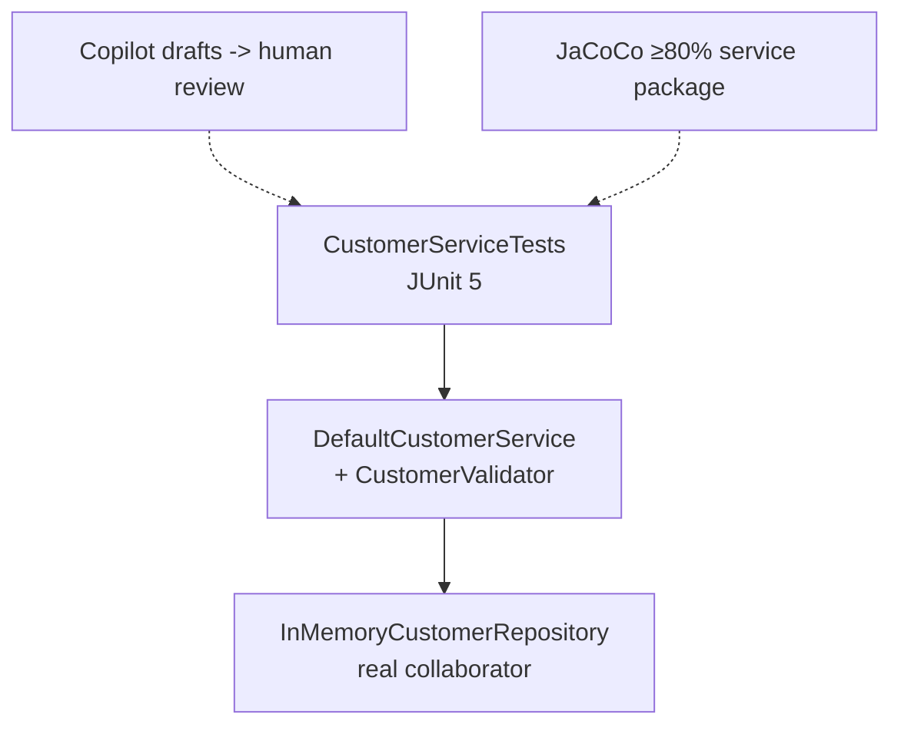
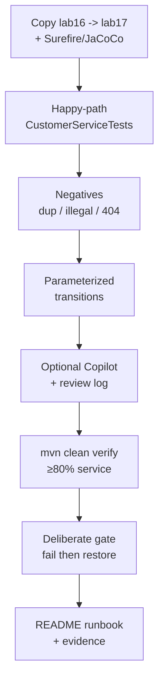

# Lab 17: JUnit Testing with AI Assistance — Northstar CRM Service Tests

**Module:** 17 — JUnit Testing Fundamentals  
**Lab folder:** `labs/Week 2 - Backend, AI Tools and Testing/module-17/lab17/`  
**Difficulty:** Intermediate  
**Duration:** 3–4 Hours

**Primary IDE:** IntelliJ IDEA Community Edition · **Optional IDE:** VS Code

| OS | How-to for this lab |
| -- | ------------------- |
| Windows | [LAB-17-WINDOWS.md](LAB-17-WINDOWS.md) |
| macOS | [LAB-17-MACOS.md](LAB-17-MACOS.md) |

> **Environment reminder:** Finish [Lab 0](../../../Week%201%20-%20Java%20and%20JVM%20Foundations/module-00/lab0/LAB-0-GUIDE.md). Use **IntelliJ IDEA Community** (primary; optional VS Code) on your laptop with **JDK 21** and **Maven 3.9+**. Work under `~/java-bootcamp` (Windows: `%USERPROFILE%\java-bootcamp`).

---

## How to follow this lab

1. Open the **Windows** or **macOS** how-to (links above) in a second tab.
2. Create/work only under your `java-bootcamp/examples/…` folder from the steps (not inside this `labs/` git clone unless a step says otherwise).
3. For each **Step N**: read **Why** (if present) → do the actions → confirm **Expected** / **Expected result** → then continue.
4. When stuck, use **Failure Experiments** / troubleshooting in this guide before asking for help.
5. Capture evidence under `notes/screenshots/lab-17/` (workspace root under `java-bootcamp`; redact secrets). Use the **Pass criteria** tables — write **Pass** or **Fail** in your notes. GitHub file view does not support clickable checkboxes.

## Lab Overview

This Module 17 lab formalizes **JUnit 5** testing for the **Customer Management Platform**. You will build `CustomerServiceTests` (and supporting tests), use **parameterized tests** for status transitions, aim for **≥80% line coverage** on the service layer with JaCoCo, and optionally use **GitHub Copilot** to draft tests—with mandatory human review.

**Purpose.** Leadership freezes a quality gate before Mockito (Lab 18) and Spring: no merge of `DefaultCustomerService` changes without JUnit evidence and ≥80% line coverage on `com.northstar.crm.service`. Coverage without meaningful asserts is not enough—reject false-confidence tests.

**What you build (exercise).** Copy to `lab17-crm`; pin Surefire + JaCoCo check; write happy and negative service tests; add parameterized legal/illegal transitions; optional Copilot draft + review log `lab17-001`; run `mvn clean verify` until the 80% gate passes; deliberately fail then restore the gate; document the runbook.

**What success looks like.** Under `~/java-bootcamp/examples/lab17-crm/` two consecutive `mvn test` runs are green and deterministic, JaCoCo HTML shows service ≥80%, and you can point to the branch that got you over the line.

**Depends on Labs 15–16.** Need `DefaultCustomerService`, `CustomerValidator`, in-memory repo, and preferably `BusinessException`. Finish those labs first if activation/errors are missing.

**CRM connection.** Fixtures `CUS-1001` / `CUS-1002` / `CUS-9999`, correlation `lab-request-001`. Lab 18 swaps the real repository for Mockito mocks—keep collaborators injectable.

---

## Learning Objectives

After completing this lab, you will be able to:

* Structure JUnit 5 tests with `@BeforeEach`, `@Test`, and clear Arrange–Act–Assert
* Write `CustomerServiceTests` covering create, find, duplicate, and status-change paths
* Use `@ParameterizedTest` / `@CsvSource` (and optionally `@EnumSource`) for transitions
* Configure JaCoCo and interpret a coverage report with a ≥80% service-layer goal
* Generate candidate tests with Copilot (optional) and reject false-confidence assertions
* Keep tests deterministic, fast, and free of real PII
* Document gaps honestly when coverage exists but behavior is still under-specified
* Prove the coverage gate can fail and succeed on purpose

---

## Business Scenario

Before week’s end, the CRM service will gain Mockito isolation (Lab 18) and later Spring. Leadership freezes:

**No merge of `DefaultCustomerService` changes without JUnit evidence and ≥80% line coverage on `com.northstar.crm.service`.**

You own that gate for Labs 15–16 behavior: Amina (`CUS-1001` ACTIVE), Ravi (`CUS-1002` PROSPECT→ACTIVE), illegal transitions, duplicates, not-found.

Use these examples consistently:

| ID | Name | Notes |
| -- | ---- | ----- |
| `CUS-1001` | Amina Khan | `ACTIVE` — illegal transition target |
| `CUS-1002` | Ravi Singh | `PROSPECT` → `ACTIVE` |
| `CUS-9999` | — | not-found paths |
| `lab-request-001` | — | correlation on changeStatus failures |
| `lab17-001`, … | — | Copilot review entries if used |

**Security note for evidence.** Use fictional emails only. Never commit `target/site/jacoco` HTML if your repo policy forbids generated sites—paste excerpts/screenshots into notes instead.

---

## Architecture Context

### NOW (this lab)



### Lab flow (mermaid)



### Architecture NOW vs LATER

| Aspect | Lab 17 (NOW) | Lab 18 / Spring |
| ------ | ------------ | --------------- |
| Collaborators | Real in-memory repo | Mockito mocks |
| Gate | JaCoCo on `service` package | Same gate + isolation tests |
| AI | Optional draft + review | Same discipline |

**Lab focus:** JUnit 5 fundamentals, parameterized tests, coverage ≥80%, AI-assisted drafting with review.

---

## Prerequisites

Complete [SETUP](../../../SETUP-INSTRUCTIONS.md), [Lab 0](../../../Week%201%20-%20Java%20and%20JVM%20Foundations/module-00/lab0/LAB-0-GUIDE.md), and Labs [15](../../module-15/lab15/LAB-15-GUIDE.md)–[16](../../module-16/lab16/LAB-16-GUIDE.md). Confirm:

* JDK 21; Maven; Git
* Lab 15–16 service, validator, exceptions (`lab16-crm/` → `lab17-crm/`)
* JUnit 5 via Maven; GitHub Copilot optional
* No secrets committed to Git

### Pre-flight

```bash
java -version
mvn -version
git --version
pwd
ls ~/java-bootcamp/examples
```

If using Copilot: Command Palette → `GitHub Copilot: Check Status` → signed in / active.

---

## Suggested Project Files

```text
~/java-bootcamp/examples/lab17-crm/
├── src/
│   ├── main/java/com/northstar/crm/...
│   └── test/java/com/northstar/crm/
│       ├── service/
│       │   ├── CustomerServiceTests.java
│       │   └── CustomerValidatorParameterizedTest.java
│       └── exception/
│           └── GlobalExceptionHandlerTest.java   (keep/expand from Lab 16)
├── copilot-notes/
│   └── ai-junit-review.md
├── docs/
│   └── coverage-notes.md
├── notes/screenshots/
├── pom.xml                         (Surefire + JaCoCo)
├── .gitignore
└── README.md
```

Ignore `target/`, IDE metadata, tokens, and passwords.

---

## Concepts to Discuss

Write 2–3 sentences each in `docs/coverage-notes.md`:

1. Main flow under test (service use cases, not UI)
2. Trust boundary: what tests prove vs what they assume about the repo
3. Success/failure contracts encoded as asserts
4. Stable fixtures (`CUS-1001`) vs random data
5. Idempotency of `mvn test` (repeatability)
6. Why ≥80% on `service` not 100% whole project
7. Evidence operators/leads need (Surefire + JaCoCo)
8. Two machines: same tests, same fixtures, same gate
9. False-confidence asserts vs AAA with domain outcomes
10. What Lab 18 will change (repo → mock) without rewriting fixture IDs

---

## Implementation Steps

Complete each step in order. Commands assume `~/java-bootcamp/examples/lab17-crm` (Windows: `%USERPROFILE%\java-bootcamp\examples\lab17-crm`) unless noted.

---

### Step 1 — Branch Lab 16 and pin Surefire + JaCoCo

**Why:** The quality gate must be executable by CI and peers via `mvn verify`, not a manual checkbox.

**Do this:**

```bash
cd ~/java-bootcamp/examples
cp -r lab16-crm lab17-crm
cd lab17-crm
mkdir -p copilot-notes docs
mkdir -p ~/java-bootcamp/notes/screenshots/lab-17
```

Add Surefire + JaCoCo with **package** rule for `com.northstar.crm.service` and `minimum` `0.80` (as in the module guide). Ensure `junit-jupiter` is test-scoped.

```bash
mvn -q -DincludeArtifactIds=junit-jupiter dependency:tree
```

**Expected result:** JUnit on test classpath; JaCoCo plugin present with service gate.

**If it fails:** Wrong package include string → must match `com.northstar.crm.service` exactly. Old Surefire → use 3.x for JUnit 5.

---

### Step 2 — Write `CustomerServiceTests` happy path

**Why:** Lock create/find/activate before negatives and coverage chasing create noise.

**Do this:** Create `CustomerServiceTests` with `@BeforeEach` wiring fresh `InMemoryCustomerRepository` + `CustomerValidator` + `DefaultCustomerService`. Cover:

* add/find Amina `CUS-1001`
* activate Ravi `CUS-1002` PROSPECT → ACTIVE with `lab-request-001`

Adapt `Customer` constructors to your entity. Prefer asserting `BusinessException` where Lab 16 types exist.

```bash
mvn -q test -Dtest=CustomerServiceTests
```

**Expected result:** ≥2 tests green; `@BeforeEach` isolation (no static shared service).

**If it fails:** Shared static repo across tests → flake. Constructor mismatch → align with Lab 10–16 entity.

---

### Step 3 — Cover negatives: duplicate, illegal transition, not-found

**Why:** Gates without negatives encourage “coverage of happy lines only.”

**Do this:** Add tests for:

* duplicate customerId (and email if validator enforces it)
* `ACTIVE → PROSPECT` on `CUS-1001` throws; status remains ACTIVE
* `changeStatus("CUS-9999", ...)` not-found / business exception

Prefer `assertThrows(BusinessException.class, ...)` and assert code/message contains correlation when present—stronger than `assertThrows(Exception.class)`.

**Expected result:** Negatives fail for the right reason; Amina still ACTIVE after illegal attempt.

**If it fails:** Wrong exception type after Lab 16 → update expects. Status mutated → production bug from Lab 15; fix production then retest.

---

### Step 4 — Parameterized tests for legal/illegal transitions

**Why:** Transition matrices explode into copy-paste methods; `@CsvSource` keeps the table visible.

**Do this:** `CustomerValidatorParameterizedTest` with legal rows (e.g. PROSPECT→ACTIVE/CLOSED, ACTIVE→SUSPENDED/CLOSED, SUSPENDED→ACTIVE) and illegal rows (ACTIVE→PROSPECT, CLOSED→ACTIVE/PROSPECT). Align rows with Lab 15 ALLOWED map.

```bash
mvn -q test -Dtest=CustomerValidatorParameterizedTest
```

**Expected result:** Multiple parameterized invocations green; illegal rows throw.

**If it fails:** Enum conversion from CSV needs exact names. Align with `CustomerStatus` constants.

---

### Step 5 — Optional Copilot draft + mandatory review

**Why:** AI speed without review recreates Lab 11’s false-confidence problem at formal-gate stakes.

**Do this:** If Copilot is available, prompt for tests covering duplicate email, `listAll`, and correlation on `BusinessException`—fixtures `CUS-1001`/`CUS-1002`, no Spring. Apply checklist:

1. Can every assert fail if production regresses?
2. Shared CRM fixture IDs (not random PII)?
3. No phantom Spring/JPA imports?
4. Independent `@BeforeEach`?
5. `mvn -q test` after edits?

Record `lab17-001` in `copilot-notes/ai-junit-review.md`. If Copilot unavailable, write tests by hand and mark “manual.”

**Expected result:** Dated review entry; at least one weak assertion rejected **or** N/A with rationale.

**If it fails:** Accepted `assertNotNull(service)` only → reject and replace with domain asserts.

---

### Step 6 — Run JaCoCo and read the report

**Why:** The gate is meaningless if you never open the report to see uncovered branches.

**Do this:**

```bash
mvn -q clean verify
```

Open `target/site/jacoco/index.html` (or CSV). Inspect `com.northstar.crm.service`. If below 80%, add focused tests (CLOSED transitions, email duplicate, `listAll`).

**Expected result:** `BUILD SUCCESS`; COVEREDRATIO ≥ 0.80 for service package.

**If it fails:** Forgot `clean` → agent not applied. Package empty of classes → wrong include or tests not exercising service.

---

### Step 7 — Fail the gate deliberately once

**Why:** Trust the gate by watching it fail, then restoring a honest 0.80 config.

**Do this:** Temporarily set `minimum` to `0.99` **or** delete one meaningful test; run `mvn -q verify`; capture violation message; restore passing 0.80 configuration and tests.

**Expected result:** Recorded rule violation, then restored `BUILD SUCCESS`.

**If it fails:** “Cheating” with broad excludes → do not leave excludes in the submitted POM.

---

### Step 8 — Document the runbook

**Why:** The next engineer must reproduce green verify without Slack archaeology.

**Do this:** README / `docs/coverage-notes.md` with:

```bash
mvn -q test
mvn -q clean verify   # includes JaCoCo check
```

List test classes, coverage goal, Copilot review policy, and which branch closed the last coverage gap.

**Expected result:** Peer can reproduce green verify from README alone.

**If it fails:** Missing JaCoCo commands next to “how to run app” → add them.

---

### Step 9 — Failure experiments + evidence pack

**Why:** Flaky patterns and false confidence are the failure modes of this lab’s culture.

**Do this:** Complete [Failure Experiments](#failure-experiments). Capture Surefire + JaCoCo excerpts under `notes/screenshots/lab-17/`. Run `mvn -q test` twice for determinism.

**Expected result:** ≥3 experiments; identical consecutive runs; evidence saved; `git status` clean of `target/`.

**If it fails:** See Troubleshooting.

---

## Implementation Checkpoints

### Checkpoint A — Tooling

_Mark each row **Pass** or **Fail** in your lab notes (GitHub markdown files are not interactive checklists)._

| # | Confirm | Your notes |
| - | ------- | ---------- |
| 1 | `lab17-crm` under `examples/` | Pass / Fail |
| 2 | Surefire 3.x + JaCoCo with service `0.80` rule | Pass / Fail |
| 3 | JUnit 5 on test classpath | Pass / Fail |

### Checkpoint B — Core suite

_Mark each row **Pass** or **Fail** in your lab notes (GitHub markdown files are not interactive checklists)._

| # | Confirm | Your notes |
| - | ------- | ---------- |
| 1 | Happy path: add/find Amina; activate Ravi | Pass / Fail |
| 2 | Negatives: duplicate, illegal transition, not-found | Pass / Fail |
| 3 | Parameterized legal/illegal transitions | Pass / Fail |

### Checkpoint C — Gate + AI discipline

_Mark each row **Pass** or **Fail** in your lab notes (GitHub markdown files are not interactive checklists)._

| # | Confirm | Your notes |
| - | ------- | ---------- |
| 1 | `mvn clean verify` passes ≥80% service coverage | Pass / Fail |
| 2 | Deliberate gate failure recorded then restored | Pass / Fail |
| 3 | Copilot review log or manual equivalent | Pass / Fail |

### Checkpoint D — Hygiene

_Mark each row **Pass** or **Fail** in your lab notes (GitHub markdown files are not interactive checklists)._

| # | Confirm | Your notes |
| - | ------- | ---------- |
| 1 | Two consecutive `mvn test` identical success | Pass / Fail |
| 2 | README runbook complete | Pass / Fail |
| 3 | No secrets / committed jacoco site / `target/` | Pass / Fail |

---

## Reference Commands, Configuration, and Code

### Parameterized excerpt

```java
@ParameterizedTest
@CsvSource({ "PROSPECT, ACTIVE", "ACTIVE, PROSPECT" })
void transition(CustomerStatus from, CustomerStatus to) { ... }
```

### JaCoCo minimum

```xml
<minimum>0.80</minimum>
```

### Commands

```bash
cd ~/java-bootcamp/examples/lab17-crm
mvn -q test
mvn -q clean verify
mvn -q test -Dtest=CustomerServiceTests
mvn -q test -Dtest=CustomerValidatorParameterizedTest
git status
```

### Class map

| Class | Role |
| ----- | ---- |
| `CustomerServiceTests` | Service use-case suite |
| `CustomerValidatorParameterizedTest` | Transition matrix |
| JaCoCo check | Merge gate on `service` package |
| `ai-junit-review.md` | AI acceptance audit |

---

## Manual Verification

1. `CustomerServiceTests` covers add/find/activate/duplicate/illegal/not-found.
2. Parameterized legal and illegal transitions run.
3. JaCoCo service package ≥80% and check passes.
4. Copilot review exists if Copilot was used.
5. Two consecutive `mvn test` runs match.
6. Correlation asserted where exceptions include it.
7. No sensitive values in tests or Git.
8. Deliberate gate-fail evidence then restore.
9. README documents verify command.
10. You can point in JaCoCo HTML to a previously red branch.

---

## Failure Experiments

| # | Experiment | Observe | Restore |
| - | ---------- | ------- | ------- |
| 1 | Break DI wiring in `@BeforeEach` | Tests fail clearly | Fix collaborators |
| 2 | Expect illegal transition to succeed | Red test | Fix expectation |
| 3 | Run `mvn -q test` twice | Identical results | Keep isolation |
| 4 | Add `Thread.sleep` then remove | Documents why sleeps banned | Remove sleep |
| 5 | Raise coverage minimum to 0.99 | JaCoCo rule fails | Restore 0.80 |

---

## Troubleshooting

| Symptom | Likely cause | Fix |
| ------- | ------------ | --- |
| Tests not discovered | Naming/path | `*Test`/`*Tests` under `src/test/java` |
| JaCoCo check skipped | No `clean` / agent | `mvn clean verify` |
| Package ratio 0% | Wrong include / no execution | Fix package name; ensure tests call service |
| Flaky tests | Shared static state | Fresh repo per `@BeforeEach` |
| False confidence | Trivial asserts | Assert IDs, status, exception codes |
| Copilot Spring imports | Underspecified prompt | Reject; restate plain Java |

---

## Security and Production Review

Answer in README:

1. Which inputs are untrusted (production inputs; tests use fixtures only)?
2. Where are authn/authz/validation enforced (still service/facade; tests don’t replace auth)?
3. Which values are sensitive—never in test code beyond samples?
4. What can be retried safely (`mvn test`/`verify`)?
5. What happens after partial failure (red build blocks merge)?
6. What would an operator/lead monitor (CI verify, coverage trend)?
7. Which local default is unacceptable (sleeps, ignored gate, committed secrets)?
8. How are test contracts versioned with DTO/service changes?

---

## Cleanup

```bash
cd ~/java-bootcamp/examples/lab17-crm
mvn -q clean
git status
```

Do not commit `target/site/jacoco` unless your course policy explicitly allows it. Keep notes screenshots/excerpts.

**Keep `lab17-crm`**—Lab 18 introduces Mockito isolation on this suite’s seams.

---

## Expected Deliverables

* `CustomerServiceTests` with happy and negative paths
* Parameterized transition tests
* JaCoCo configuration + evidence of ≥80% on service package
* Copilot review notes with human acceptance **or** manual equivalent
* Deliberate gate-fail evidence + restore
* `mvn clean verify` success log
* README runbook + coverage notes
* No secrets or generated build directories committed

---

## Evaluation Rubric (100 Marks)

| Criteria | Marks |
| -------- | ----: |
| Environment and project structure | 10 |
| Core implementation (`CustomerServiceTests`, parameterized) | 30 |
| Integration/configuration correctness (Surefire, JaCoCo gate) | 15 |
| Failure handling (negatives + deliberate gate fail) | 15 |
| Automated verification | 10 |
| Security and production awareness / AI review discipline | 10 |
| Documentation and evidence | 10 |

**Notes:** Passing verify with empty meaningful asserts → lose AI/quality marks. Excluding service classes to “pass” coverage → honor violation. Lab 11-style preview depth is no longer enough.

---

## Reflection Questions

Write 3–6 sentence answers:

1. Which design decision most affected correctness?
2. Which failure was hardest to diagnose?
3. What evidence proves the implementation works?
4. What breaks first at ten times the suite size?
5. Which concern should move to shared CI infrastructure?
6. What must change before real customer data is used in tests (spoiler: don’t)?
7. How does this lab connect to Labs 11, 15–16, and Lab 18?
8. What metric matters most on the CI dashboard for this gate?
9. (Forward look) Which tests will need rewriting when the repository becomes a mock?

---

## Bonus Challenges

1. Assert `BusinessException` code + correlation on every failure path.
2. Mutation-testing thought experiment: which one-line bug still keeps 80%?
3. Separate coverage notes for `service` vs `exception` packages.
4. Surefire timing: note slowest test and why.
5. Document rollback if someone adds a bad JaCoCo exclude.
6. `@EnumSource` for all `CustomerStatus` values in a “from CLOSED” rejection matrix.

---

## Success Criteria

You are finished when:

* JUnit suite is green with parameterized transitions
* Coverage gate ≥80% on `com.northstar.crm.service` passes
* Happy and failure paths are repeatable
* Another student can follow your verify instructions
* AI-drafted tests (if any) were human-reviewed
* Deliberate gate failure was observed and restored
* No production secret is hard-coded

---

## Instructor Notes

* **Live probe:** Open JaCoCo HTML and have the student point to a branch that was red before their last test. If Copilot was used, ask which suggestion they rejected and why.
* **Assess:** Meaningful negatives, parameterized matrix aligned with Lab 15, honest 80% gate (no cheats), deterministic suite.
* **Continuity:** Prefer `examples/lab17-crm`. Keep fixture IDs. Lab 18 should not require rewriting fixtures—only collaborator substitution.
* **Common pitfalls:** Shared static service; `assertThrows(Exception.class)` only; sleeping tests; JaCoCo without `clean`; package include typos; committing huge jacoco sites.
* **Timing:** 3–4 hours. Coverage last-mile often burns 45 minutes—steer students to uncovered CLOSED/email branches early.

---

*End of Lab 17 — JUnit Testing with AI Assistance: Northstar CRM Service Tests. Keep `lab17-crm` for Lab 18 and portfolio evidence.*
