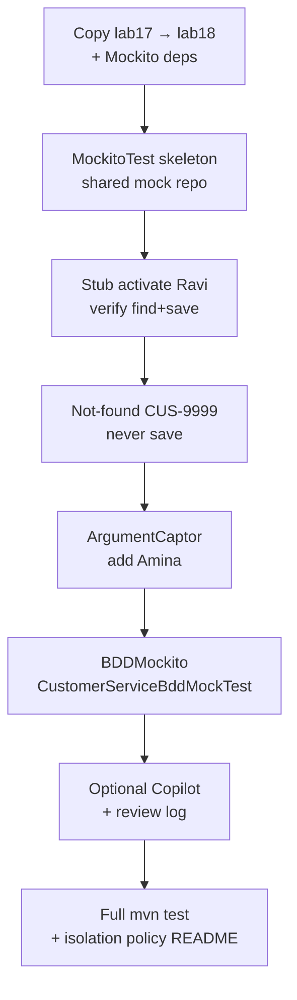

# Lab 18: Mockito and Mocking with AI Assistance — Northstar CRM Isolation Tests

**Module:** 18 — Mockito for Test Isolation  
**Lab folder:** `labs/Week 2 - Backend, AI Tools and Testing/module-18/lab18/`  
**Difficulty:** Intermediate  
**Duration:** 3–4 Hours

**Primary IDE:** IntelliJ IDEA Community Edition · **Optional IDE:** VS Code

| OS | How-to for this lab |
| -- | ------------------- |
| Windows | [LAB-18-WINDOWS.md](LAB-18-WINDOWS.md) |
| macOS | [LAB-18-MACOS.md](LAB-18-MACOS.md) |

> **Environment reminder:** Finish [Lab 0](../../../Week%201%20-%20Java%20and%20JVM%20Foundations/module-00/lab0/LAB-0-GUIDE.md). Use **IntelliJ IDEA Community** (primary; optional VS Code) on your laptop with **JDK 21** and **Maven 3.9+**. Work under `~/java-bootcamp` (Windows: `%USERPROFILE%\java-bootcamp`).

---

## How to follow this lab

1. Open the **Windows** or **macOS** how-to (links above) in a second tab.
2. Create/work only under your `java-bootcamp/examples/…` folder from the steps (not inside this `labs/` git clone unless a step says otherwise).
3. For each **Step N**: read **Why** (if present) → do the actions → confirm **Expected** / **Expected result** → then continue.
4. When stuck, use **Failure Experiments** / troubleshooting in this guide before asking for help.
5. Capture evidence under `notes/screenshots/` (redact secrets). Use the **Pass criteria** tables — write **Pass** or **Fail** in your notes. GitHub file view does not support clickable checkboxes.

## Lab Overview

This Module 18 lab isolates **Customer Management Platform** service unit tests with **Mockito**: mock `CustomerRepository` (and optionally collaborator services), **verify interactions**, and use **ArgumentCaptor** / **BDDMockito** style stubs. You keep JUnit 5 from Lab 17 and stop relying on the real in-memory map for service-layer unit tests.

**Purpose.** Lab 17 proved `DefaultCustomerService` behavior against a real `InMemoryCustomerRepository`. That couples “service rule” failures to HashMap details. Leadership now wants **true unit tests**: stub the repository, verify `find`/`save`/`exists` interactions, and prove not-found and illegal paths never call `save`. Optional Copilot may draft mock setups—every stub and verification must be human-reviewed.

**What you build (exercise).** Copy to `lab18-crm`; add Mockito test-scoped deps; write `CustomerServiceMockitoTest` with stubs, `verify`, `never()`, and `ArgumentCaptor`; add `CustomerServiceBddMockTest` with BDDMockito `given`/`then`/`should`; keep Lab 17 real-repo tests if useful; document the isolation policy; run `mvn clean test` green twice.

**What success looks like.** Under `~/java-bootcamp/examples/lab18-crm/` you can show activate-Ravi with a stubbed repo, prove `CUS-9999` never saves, capture Amina’s entity on add, explain BDD style as syntax not magic, and state which suites use mocks vs real in-memory.

**Depends on Lab 17.** Need `DefaultCustomerService`, `CustomerValidator`, JUnit 5 suite, and preferably JaCoCo still green on the service package. Finish Lab 17 first if coverage/fixtures are missing.

**CRM connection.** Fixtures `CUS-1001` / `CUS-1002` / `CUS-9999`, correlation `lab-request-001`. Lab 19 adds HTTP/UI boundaries—keep service constructors injectable so mocks and Spring can both wire them later.

---

## Learning Objectives

After completing this lab, you will be able to:

* Add Mockito (and `mockito-junit-jupiter`) as test-scoped dependencies
* Create `@Mock` collaborators and wire `DefaultCustomerService` via `@InjectMocks` or, preferably, manual constructor injection sharing one mock repo with `CustomerValidator`
* Stub repository responses with `when(...).thenReturn(...)` or BDD `given(...).willReturn(...)`
* `verify` save/find interactions and argument values for `CUS-1001` / `CUS-1002`
* Use `ArgumentCaptor` to inspect the `Customer` passed to `save`
* Prove not-found and illegal-transition paths with `verify(..., never()).save(...)`
* Explain why mocking the repository isolates the service unit under test
* Avoid common mistakes: over-mocking, unnecessary stubbing, mocking the class under test
* Review optional Copilot mock drafts and reject false-confidence stubs

---

## Business Scenario

Lab 17 tests use a real `InMemoryCustomerRepository`. Fine for early confidence; insufficient for true unit isolation. Your lead freezes:

**Service-layer unit tests must mock `CustomerRepository`. Verifications prove interaction contracts. Failures in repository wiring must not require a database or HashMap.**

You own that isolation for Labs 15–17 behavior: Amina (`CUS-1001` ACTIVE), Ravi (`CUS-1002` PROSPECT→ACTIVE), illegal transitions, duplicates, not-found.

Use these examples consistently:

| ID | Name | Notes |
| -- | ---- | ----- |
| `CUS-1001` | Amina Khan | `ACTIVE` — addCustomer captors; illegal transition target |
| `CUS-1002` | Ravi Singh | `PROSPECT` → `ACTIVE` with stubbed find/save |
| `CUS-9999` | — | not-found; `never().save` |
| `lab-request-001` | — | correlation on changeStatus |
| `lab18-001`, … | — | Copilot review entries if used |

**Policy choice to document.** Validator may stay **real** (rules are the subject) or be **mocked** for pure interaction tests. Prefer real validator + shared mock repo so uniqueness rules that call `existsById` / `existsByEmail` still exercise production validation.

**Security note for evidence.** Use fictional emails only (`amina.khan@example.com`, `ravi.singh@example.com`). Never commit secrets or leave debug `Mockito.mockingDetails` prints in submitted code.

---

## Architecture Context

### NOW (this lab)

```mermaid
flowchart TB
  T1["CustomerServiceMockitoTest"] --> Svc["DefaultCustomerService"]
  T2["CustomerServiceBddMockTest"] --> Svc
  Svc -->|prefer real| Val["CustomerValidator"]
  Svc -->|@Mock| Repo["CustomerRepository<br/>stub find/save/exists"]
  Verify["verify / ArgumentCaptor / never"] -.-> Repo
```

### Lab flow (mermaid)



### Architecture NOW vs LATER

| Aspect | Lab 17 (was) | Lab 18 (NOW) | Lab 19 / Spring |
| ------ | ------------ | ------------ | --------------- |
| Collaborators | Real in-memory repo | Mockito mocks | HTTP/UI + later `@MockBean` |
| Gate focus | JaCoCo ≥80% service | Interaction verify + isolation | Regression IT / Selenium |
| AI | Optional JUnit draft | Optional mock draft + review | Same discipline |

**Lab focus:** Mock repository collaborators, verify interactions, isolate service unit tests (Argue/`argThat`/BDDMockito style OK). Do not mock `DefaultCustomerService` itself.

---

## Prerequisites

Complete [SETUP](../../../SETUP-INSTRUCTIONS.md), [Lab 0](../../../Week%201%20-%20Java%20and%20JVM%20Foundations/module-00/lab0/LAB-0-GUIDE.md), and Labs [15](../../module-15/lab15/LAB-15-GUIDE.md)–[17](../../module-17/lab17/LAB-17-GUIDE.md). Confirm:

* JDK 21; Maven; Git
* Lab 17 suite on `lab17-crm/` → copy to `lab18-crm/`
* JUnit 5 + Mockito via Maven; GitHub Copilot optional
* No secrets committed to Git

### Pre-flight

```bash
java -version
mvn -version
git --version
pwd
ls ~/java-bootcamp/examples
```

If using Copilot: Command Palette → `GitHub Copilot: Check Status` → signed in / active.

---

## Suggested Project Files

```text
~/java-bootcamp/examples/lab18-crm/
├── src/
│   ├── main/java/com/northstar/crm/...
│   └── test/java/com/northstar/crm/
│       ├── service/
│       │   ├── CustomerServiceTests.java           (keep Lab 17; may coexist)
│       │   ├── CustomerServiceMockitoTest.java     (new)
│       │   ├── CustomerServiceBddMockTest.java     (new — BDDMockito)
│       │   └── CustomerValidatorParameterizedTest.java
│       └── exception/
│           └── GlobalExceptionHandlerTest.java
├── copilot-notes/
│   └── ai-mockito-review.md
├── docs/
│   └── isolation-policy.md
├── notes/screenshots/
├── pom.xml                         (Mockito + existing Surefire/JaCoCo)
├── .gitignore
└── README.md
```

Ignore `target/`, IDE metadata, tokens, and passwords.

---

## Concepts to Discuss

Write 2–3 sentences each in `docs/isolation-policy.md`:

1. Main flow under test (service use cases with stubbed repo, not HTTP)
2. Trust boundary: what mocks prove vs what they assume about repository contracts
3. Success/failure contracts encoded as asserts **and** `verify` / `never`
4. Stable fixtures (`CUS-1001`) vs random data in stubs
5. Idempotency of `mvn test` and fresh mocks per `@BeforeEach`
6. Why unit mocks coexist with Lab 17 real in-memory suite
7. Evidence operators/leads need (Surefire + isolation README)
8. Two machines: same stubs, same fixtures, same verify counts
9. False-confidence: unused stubs, mocking the class under test, `Thread.sleep`
10. What Lab 19 will change (HTTP/UI) without rewriting fixture IDs

---

## Implementation Steps

Complete each step in order. Commands assume `~/java-bootcamp/examples/lab18-crm` (Windows: `%USERPROFILE%\java-bootcamp\examples\lab18-crm`) unless noted.

---

### Step 1 — Branch Lab 17 and add Mockito dependencies

**Why:** Isolation tooling must be a reproducible test-scoped classpath, not a local JAR on one laptop.

**Do this:**

```bash
cd ~/java-bootcamp/examples
cp -r lab17-crm lab18-crm
cd lab18-crm
mkdir -p copilot-notes docs notes/screenshots
```

Add to `pom.xml` (test scope):

```xml
<dependency>
  <groupId>org.mockito</groupId>
  <artifactId>mockito-core</artifactId>
  <version>5.14.2</version>
  <scope>test</scope>
</dependency>
<dependency>
  <groupId>org.mockito</groupId>
  <artifactId>mockito-junit-jupiter</artifactId>
  <version>5.14.2</version>
  <scope>test</scope>
</dependency>
```

If Spring Boot parent manages versions, omit explicit version numbers and use BOM-managed Mockito.

```bash
mvn -q -DincludeArtifactIds=mockito-core,mockito-junit-jupiter dependency:tree
```

**Expected result:** `mockito-core` and `mockito-junit-jupiter` on test classpath; existing Lab 17 tests still discoverable.

**If it fails:** Wrong scope (`compile`) → set `test`. Version skew between core and junit-jupiter → align both to the same Mockito 5.x line. Boot BOM conflict → remove hard-coded versions.

---

### Step 2 — Create `CustomerServiceMockitoTest` skeleton

**Why:** Extension wiring and shared mock-repo construction must be correct before stubbing business paths—otherwise failures look like domain bugs.

**Do this:** Create `src/test/java/com/northstar/crm/service/CustomerServiceMockitoTest.java`:

```java
package com.northstar.crm.service;

import com.northstar.crm.entity.Customer;
import com.northstar.crm.entity.CustomerStatus;
import com.northstar.crm.repository.CustomerRepository;
import org.junit.jupiter.api.BeforeEach;
import org.junit.jupiter.api.Test;
import org.junit.jupiter.api.extension.ExtendWith;
import org.mockito.ArgumentCaptor;
import org.mockito.Mock;
import org.mockito.junit.jupiter.MockitoExtension;

import java.util.Optional;

import static org.junit.jupiter.api.Assertions.*;
import static org.mockito.ArgumentMatchers.*;
import static org.mockito.Mockito.*;

@ExtendWith(MockitoExtension.class)
class CustomerServiceMockitoTest {

    @Mock CustomerRepository repository;

    private CustomerValidator validator;
    private DefaultCustomerService service;

    @BeforeEach
    void setUp() {
        // Validator and service MUST share the same mock repository
        validator = new CustomerValidator(repository);
        service = new DefaultCustomerService(repository, validator);
    }

    @Test
    void placeholderCompiles() {
        assertNotNull(repository);
        assertNotNull(service);
    }
}
```

Prefer **manual construction** over `@InjectMocks` alone when the validator also needs the repository for uniqueness rules.

**Expected result:** Class compiles with `MockitoExtension`; `@Mock repository` is non-null; `@BeforeEach` builds a fresh service each test.

**If it fails:** Missing `@ExtendWith(MockitoExtension.class)` → NPE on mocks. Two different mock instances for validator vs service → uniqueness stubs never hit. Adapt package/entity names to your Lab 10–17 model.

---

### Step 3 — Stub find/save and activate `CUS-1002`

**Why:** Happy-path interaction proof is the core of the lab—status change must call find then save with ACTIVE.

**Do this:** Add:

```java
@Test
void activatesProspectUsingStubbedRepository() {
    Customer ravi = new Customer(
        "CUS-1002", "Ravi Singh", "ravi.singh@example.com", CustomerStatus.PROSPECT);

    when(repository.findById("CUS-1002")).thenReturn(Optional.of(ravi));
    when(repository.save(any(Customer.class))).thenAnswer(inv -> inv.getArgument(0));

    Customer result = service.changeStatus(
        "CUS-1002", CustomerStatus.ACTIVE, "lab-request-001");

    assertEquals(CustomerStatus.ACTIVE, result.getStatus());
    verify(repository).findById("CUS-1002");
    verify(repository).save(argThat(c ->
        "CUS-1002".equals(c.getCustomerId()) && c.getStatus() == CustomerStatus.ACTIVE));
    // Prefer explicit verify counts if validator also reads exists*:
    // verify(repository, times(1)).save(...);
}
```

```bash
mvn -q test -Dtest=CustomerServiceMockitoTest#activatesProspectUsingStubbedRepository
```

**Expected result:** One test green; status ACTIVE; find and save verified; no real `Map` involved.

**If it fails:** `Wanted but not invoked: save` → service short-circuits (validator rejects) or find stub wrong ID. `UnnecessaryStubbingException` → remove unused `when`. `thenReturn(null)` on save → use `thenAnswer` when the service returns the saved entity.

---

### Step 4 — Verify not-found does not call save

**Why:** Isolation quality shows up on negatives—`never().save` is stronger evidence than “an exception happened.”

**Do this:**

```java
@Test
void unknownCustomerDoesNotSave() {
    when(repository.findById("CUS-9999")).thenReturn(Optional.empty());

    assertThrows(Exception.class, () ->
        service.changeStatus("CUS-9999", CustomerStatus.ACTIVE, "lab-request-001"));

    verify(repository).findById("CUS-9999");
    verify(repository, never()).save(any());
}
```

Prefer `assertThrows(BusinessException.class, ...)` if Lab 16 types exist, and assert correlation appears in the message/code when your design includes it.

**Expected result:** Exception thrown; `save` never interacted.

**If it fails:** Wrong exception type after Lab 16 → tighten expect. `save` still called → production bug: fix service then retest. Broad `any()` vs typed matchers → keep `never().save(any())` consistent with other verifies.

---

### Step 5 — `ArgumentCaptor` for `addCustomer`

**Why:** Captors beat single-field `argThat` when you need multi-field asserts on the entity that crossed the repository boundary.

**Do this:**

```java
@Test
void addCustomerCapturesSavedEntity() {
    when(repository.existsById("CUS-1001")).thenReturn(false);
    when(repository.existsByEmail("amina.khan@example.com")).thenReturn(false);
    when(repository.save(any(Customer.class))).thenAnswer(inv -> inv.getArgument(0));

    service.addCustomer(new Customer(
        "CUS-1001", "Amina Khan", "amina.khan@example.com", CustomerStatus.ACTIVE));

    ArgumentCaptor<Customer> captor = ArgumentCaptor.forClass(Customer.class);
    verify(repository).save(captor.capture());
    assertEquals("CUS-1001", captor.getValue().getCustomerId());
    assertEquals("Amina Khan", captor.getValue().getFullName());
    assertEquals(CustomerStatus.ACTIVE, captor.getValue().getStatus());
}
```

Align `existsBy*` method names with your Lab 15–16 validator.

**Expected result:** Captor shows Amina / ACTIVE / `CUS-1001`; no real map.

**If it fails:** Unstubbed `existsByEmail` → Mockito returns `false` for boolean by default (often OK) but may diverge if your code uses `Boolean` wrappers. Wrong getter names → match your entity. Stub only what the path calls to avoid unnecessary stubbing.

---

### Step 6 — BDDMockito style test

**Why:** Teams often write specs in given/when/then language; students must see this as style over the same Mockito engine.

**Do this:** Create `CustomerServiceBddMockTest.java`:

```java
package com.northstar.crm.service;

import com.northstar.crm.entity.Customer;
import com.northstar.crm.entity.CustomerStatus;
import com.northstar.crm.repository.CustomerRepository;
import org.junit.jupiter.api.BeforeEach;
import org.junit.jupiter.api.Test;
import org.junit.jupiter.api.extension.ExtendWith;
import org.mockito.Mock;
import org.mockito.junit.jupiter.MockitoExtension;

import java.util.Optional;

import static org.junit.jupiter.api.Assertions.assertEquals;
import static org.mockito.ArgumentMatchers.any;
import static org.mockito.BDDMockito.*;

@ExtendWith(MockitoExtension.class)
class CustomerServiceBddMockTest {

    @Mock CustomerRepository repository;
    DefaultCustomerService service;

    @BeforeEach
    void setUp() {
        service = new DefaultCustomerService(repository, new CustomerValidator(repository));
    }

    @Test
    void activatesRaviInBddStyle() {
        Customer ravi = new Customer(
            "CUS-1002", "Ravi Singh", "ravi.singh@example.com", CustomerStatus.PROSPECT);
        given(repository.findById("CUS-1002")).willReturn(Optional.of(ravi));
        given(repository.save(any(Customer.class))).willAnswer(inv -> inv.getArgument(0));

        Customer updated = service.changeStatus(
            "CUS-1002", CustomerStatus.ACTIVE, "lab-request-001");

        then(repository).should().findById("CUS-1002");
        then(repository).should().save(any(Customer.class));
        assertEquals(CustomerStatus.ACTIVE, updated.getStatus());
    }
}
```

```bash
mvn -q test -Dtest=CustomerServiceBddMockTest
```

**Expected result:** BDD style test green; you can explain `given`/`willReturn` vs `when`/`thenReturn` as style, not magic.

**If it fails:** Mixed static imports from `Mockito` and `BDDMockito` colliding → prefer one style per class. Same wiring pitfalls as Step 2.

---

### Step 7 — Optional Copilot mock draft + review

**Why:** AI speed without review recreates Lab 11 false-confidence at isolation stakes—mocking the class under test is a common AI failure.

**Do this:** If Copilot is available, prompt:

```text
Generate a Mockito test that mocks CustomerRepository for DefaultCustomerService
duplicate-email path. Verify existsByEmail and that save is never called.
Fixtures: CUS-1001 Amina Khan. No Spring annotations.
```

Review checklist:

1. Did it mock the **class under test**? Reject if yes.
2. Are stubs minimal (no unused `when`)?
3. Does verification match the real validator call order?
4. Any `Thread.sleep` or real DB?
5. Run `mvn -q test` after accepting?

Record `lab18-001` in `copilot-notes/ai-mockito-review.md`. If Copilot unavailable, write the duplicate-email mock test by hand and mark “manual.”

**Expected result:** Dated review entry; at least one Copilot risk called out **or** N/A with rationale; suite still green.

**If it fails:** Accepted `@Mock DefaultCustomerService` → reject and rewrite. Accepted sleeps → reject. Unused stubs left behind → `UnnecessaryStubbingException` under strictness—trim stubs.

---

### Step 8 — Full suite, failure experiments, isolation policy

**Why:** Peers and CI need one documented policy: which suites are unit-isolated vs real-repo, and how to choose stub vs verify.

**Do this:**

```bash
mvn -q clean test
mvn -q test -Dtest=CustomerServiceMockitoTest,CustomerServiceBddMockTest
```

Document in README / `docs/isolation-policy.md`:

* Which tests use real in-memory repo (Lab 17 style) vs mocks (Lab 18 unit)
* How to choose stub (`when`/`given`) vs verify (`verify`/`then().should`)
* Correlation ID expectations on exception paths
* Why both styles can coexist

Complete [Failure Experiments](#failure-experiments). Capture Surefire excerpts under `notes/screenshots/`. Run `mvn -q test` twice for determinism.

**Expected result:** All Lab 17 + Lab 18 tests green twice; README states isolation policy; evidence saved; `git status` clean of `target/`.

**If it fails:** Lab 17 broken by POM change → diff Mockito deps only. Flaky verifies → fresh `@BeforeEach` mocks, never share static mocks. See Troubleshooting.

---

## Implementation Checkpoints

### Checkpoint A — Tooling

_Mark each row **Pass** or **Fail** in your lab notes (GitHub markdown files are not interactive checklists)._

| # | Confirm | Your notes |
| - | ------- | ---------- |
| 1 | `lab18-crm` under `~/java-bootcamp/examples/` | Pass / Fail |
| 2 | Mockito core + junit-jupiter test-scoped; tree confirms both | Pass / Fail |
| 3 | `@ExtendWith(MockitoExtension.class)` on mock suites | Pass / Fail |
| 4 | Lab 17 JaCoCo/Surefire still present (unless intentionally deferred and noted) | Pass / Fail |

### Checkpoint B — Core Mockito suite

_Mark each row **Pass** or **Fail** in your lab notes (GitHub markdown files are not interactive checklists)._

| # | Confirm | Your notes |
| - | ------- | ---------- |
| 1 | Shared mock repo wires validator + `DefaultCustomerService` | Pass / Fail |
| 2 | Activate Ravi: stub find/save + verify | Pass / Fail |
| 3 | `CUS-9999` not-found: `never().save` | Pass / Fail |
| 4 | `ArgumentCaptor` on add Amina (`CUS-1001`) | Pass / Fail |

### Checkpoint C — BDD + AI discipline

_Mark each row **Pass** or **Fail** in your lab notes (GitHub markdown files are not interactive checklists)._

| # | Confirm | Your notes |
| - | ------- | ---------- |
| 1 | `CustomerServiceBddMockTest` green with given/then/should | Pass / Fail |
| 2 | Copilot review log or manual equivalent (`lab18-001`) | Pass / Fail |
| 3 | No mocking of the class under test | Pass / Fail |

### Checkpoint D — Hygiene

_Mark each row **Pass** or **Fail** in your lab notes (GitHub markdown files are not interactive checklists)._

| # | Confirm | Your notes |
| - | ------- | ---------- |
| 1 | Two consecutive `mvn test` identical success | Pass / Fail |
| 2 | Isolation policy documented | Pass / Fail |
| 3 | No secrets / `target/` / debug mockingDetails left committed | Pass / Fail |

---

## Reference Commands, Configuration, and Code

### Stub + verify

```java
when(repository.findById("CUS-1002")).thenReturn(Optional.of(ravi));
verify(repository, never()).save(any());
```

### BDDMockito

```java
given(repository.findById("CUS-1002")).willReturn(Optional.of(ravi));
then(repository).should().findById("CUS-1002");
```

### ArgumentCaptor

```java
ArgumentCaptor<Customer> captor = ArgumentCaptor.forClass(Customer.class);
verify(repository).save(captor.capture());
assertEquals("CUS-1001", captor.getValue().getCustomerId());
```

### Commands

```bash
cd ~/java-bootcamp/examples/lab18-crm
mvn -q clean test
mvn -q test -Dtest=CustomerServiceMockitoTest
mvn -q test -Dtest=CustomerServiceBddMockTest
mvn -q test -Dtest=CustomerServiceMockitoTest,CustomerServiceBddMockTest
git status
```

### Class map

| Class | Role |
| ----- | ---- |
| `CustomerServiceMockitoTest` | Classic when/verify/captor suite |
| `CustomerServiceBddMockTest` | BDDMockito style isolation |
| `CustomerServiceTests` | Lab 17 real in-memory (optional coexist) |
| `ai-mockito-review.md` | AI acceptance audit |
| `isolation-policy.md` | Unit vs integration test policy |

---

## Manual Verification

1. `CustomerServiceMockitoTest` isolates `DefaultCustomerService` from the real Map.
2. Activate-Ravi stubs find/save and asserts ACTIVE with `lab-request-001`.
3. Unknown ID verifies `never().save`.
4. ArgumentCaptor asserts Amina’s ID/name/status on save.
5. BDDMockito test demonstrates equivalent semantics.
6. Lab 17 tests still pass (or intentionally migrated with notes).
7. Illegal transition stub path never saves (optional but recommended).
8. No sensitive values in tests or Git.
9. Two consecutive `mvn test` runs match.
10. README documents which suites are mocked vs real-repo.

---

## Failure Experiments

| # | Experiment | Observe | Restore |
| - | ---------- | ------- | ------- |
| 1 | Stub `findById` to throw `RuntimeException` | Service/handler error path; test intentionally red/green | Restore Optional stub |
| 2 | Stub ACTIVE Amina; change to PROSPECT | Exception; `never().save` | Keep as permanent negative test |
| 3 | `verify(times(1)).save` then call service twice without reset | Verification failure | Fresh mocks via `@BeforeEach` |
| 4 | Add unused `when(...).thenReturn(...)` | `UnnecessaryStubbingException` | Remove stub or justify `lenient()` in notes |
| 5 | Reject/temporary accept a Copilot `Thread.sleep` | Documents why sleeps banned | Remove sleep |

---

## Troubleshooting

| Symptom | Likely cause | Fix |
| ------- | ------------ | --- |
| NPE on `@Mock` fields | Missing `MockitoExtension` | Add `@ExtendWith(MockitoExtension.class)` |
| `UnnecessaryStubbingException` | Stub never called | Trim stubs; avoid blanket `lenient()` |
| `Wanted but not invoked: save` | Wrong stub / validator blocked path | Align IDs; stub exists*; read service code |
| WrongInteraction / too many invokes | Validator also hits repo | Explicit `times(n)` / verify exists calls |
| Flaky verifies | Shared static mocks | Recreate in `@BeforeEach` |
| Lab 17 suite broken | Accidental production change | Diff only test POM + mock tests |
| Copilot mocks service | Underspecified prompt | Reject; restate collaborator-only mocks |

---

## Security and Production Review

Answer in README:

1. Which inputs are untrusted (production API inputs; tests use fixtures/stubs only)?
2. Where are authn/authz/validation enforced (still service/validator; mocks don’t replace auth)?
3. Which values are sensitive—never in test code beyond sample emails?
4. What can be retried safely (`mvn test` repeatedly)?
5. What happens after partial failure (red verify blocks merge)?
6. What would an operator/lead monitor (CI test job, isolation policy drift)?
7. Which local default is unacceptable (sleeps, mocking class-under-test, committed secrets)?
8. How are stub contracts versioned when repository method signatures change?

---

## Cleanup

```bash
cd ~/java-bootcamp/examples/lab18-crm
mvn -q clean
git status
```

Do not commit `target/`. Keep review notes and isolation policy.

**Keep `lab18-crm`**—Lab 19 builds integration/UI regression on CRM create/get seams you just isolated.

---

## Expected Deliverables

* `CustomerServiceMockitoTest` with stubbing, verify, and ArgumentCaptor
* `CustomerServiceBddMockTest` (BDDMockito style)
* Evidence that not-found never calls `save`
* Optional Copilot review notes (`lab18-001`) or manual equivalent
* Full `mvn test` success log (two consecutive runs preferred)
* Isolation policy in project README / `docs/isolation-policy.md`
* No secrets or generated build directories committed

---

## Evaluation Rubric (100 Marks)

| Criteria | Marks |
| -------- | ----: |
| Environment and project structure | 10 |
| Core implementation (mocks, stubs, captors, BDD) | 30 |
| Integration/configuration correctness (MockitoExtension, deps) | 15 |
| Failure handling (never save / illegal transition) | 15 |
| Automated verification | 10 |
| Security and production awareness / AI review discipline | 10 |
| Documentation and evidence | 10 |

**Notes:** Mocking `DefaultCustomerService` instead of collaborators → honor violation. Leaving unused stubs “for later” without notes → lose quality marks. Lab 17 fixtures rewritten to random UUIDs → lose continuity marks.

---

## Reflection Questions

Write 3–6 sentence answers:

1. Which design decision most affected correctness (shared mock repo vs `@InjectMocks` alone)?
2. Which failure was hardest to diagnose (`UnnecessaryStubbing`, wrong verify count, …)?
3. What evidence proves the implementation works (captor values, `never().save`)?
4. What breaks first at ten times the suite size (shared static mocks, brittle `verifyNoMoreInteractions`)?
5. Which concern should move to shared CI infrastructure (Mockito version pin, strict stubbing)?
6. What must change before real customer data is used in tests (spoiler: don’t)?
7. How does this lab connect to Labs 15–17 and Lab 19?
8. What metric matters most on the CI dashboard for this isolation gate?
9. (Forward look) How will Spring `@MockBean` differ from these plain Mockito unit tests?

---

## Bonus Challenges

1. Assert `BusinessException` code + correlation on every mocked failure path.
2. Mock a second collaborator (notifier from earlier labs) and verify ordering with `inOrder`.
3. Add a strict stubbing demo that fails on unused stubs, then fix it.
4. Compare test runtime of Lab 17 in-memory suite vs Lab 18 mock suite.
5. Document how Spring `@MockBean` later differs from plain Mockito unit tests.
6. Illegal-transition mock: ACTIVE Amina → PROSPECT, verify status not saved.

---

## Success Criteria

You are finished when:

* Mocked repository unit tests demonstrate stubbing, verify, and captors
* Happy path and not-found / illegal paths prove interaction contracts
* BDDMockito suite shows equivalent style without new semantics
* Another student can follow your isolation policy and `mvn test` instructions
* AI-drafted mocks (if any) were human-reviewed
* Two consecutive green `mvn test` runs
* No production secret is hard-coded

---

## Instructor Notes

* **Live probe:** Break a `verify(repository).save(...)` expectation on purpose and have the student interpret the Mockito failure. Ask why mocking `DefaultCustomerService` would not test production code.
* **Assess:** Shared mock for validator+service, meaningful `never().save`, captor multi-field asserts, BDD as style, isolation policy quality.
* **Continuity:** Prefer `examples/lab18-crm`. Keep fixture IDs. Lab 19 should reuse create/get contracts—not rewrite CRM IDs.
* **Common pitfalls:** `@InjectMocks` with mismatched validator repo; `verifyNoMoreInteractions` ignoring exists* calls; sleeping “waiting for mock”; Copilot inventing Spring annotations; committing `target/`.
* **Timing:** 3–4 hours. Wiring + unnecessary stubbing often burns 40 minutes—steer students to shared mock construction early.

---

*End of Lab 18 — Mockito and Mocking with AI Assistance: Northstar CRM Isolation Tests. Keep `lab18-crm` for Lab 19 and portfolio evidence.*
