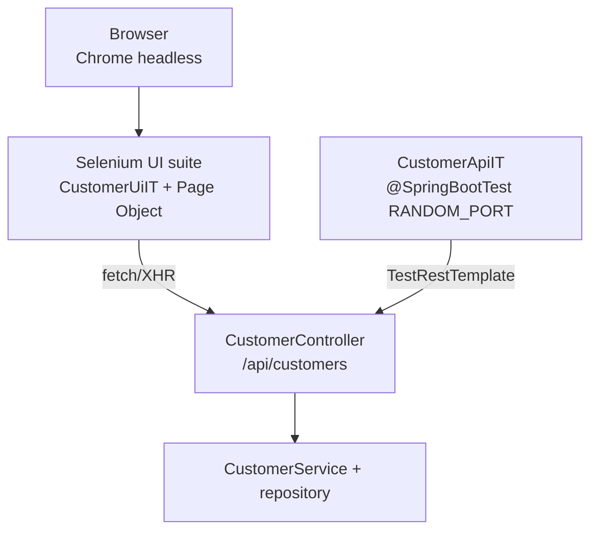
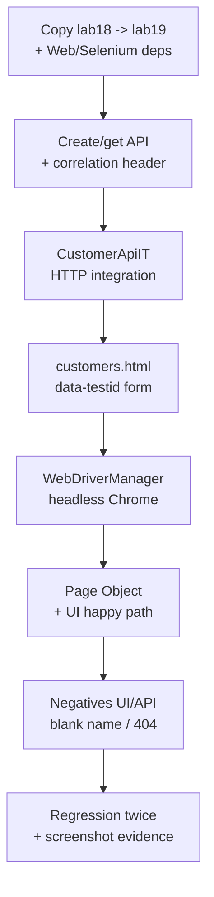

# Lab 19: Integration and UI Testing with Selenium — Northstar CRM Regression Suite

**Module:** 19 — Integration and UI Testing with Selenium  
**Lab folder:** `labs/Week 2 - Backend, AI Tools and Testing/module-19/lab19/`  
**Difficulty:** Intermediate  
**Duration:** 4–5 Hours

**Primary IDE:** IntelliJ IDEA Community Edition · **Optional IDE:** VS Code

| OS | How-to for this lab |
| -- | ------------------- |
| Windows | [LAB-19-WINDOWS.md](LAB-19-WINDOWS.md) |
| macOS | [LAB-19-MACOS.md](LAB-19-MACOS.md) |

> **Environment reminder:** Finish [Lab 0](../../../Week%201%20-%20Java%20and%20JVM%20Foundations/module-00/lab0/LAB-0-GUIDE.md). Use **IntelliJ IDEA Community** (primary; optional VS Code) on your laptop with **JDK 21**, **Maven 3.9+**, and **Chrome/Chromium** for Selenium. Work under `~/java-bootcamp` (Windows: `%USERPROFILE%\java-bootcamp`).

---

## How to follow this lab

1. Open the **Windows** or **macOS** how-to (links above) in a second tab.
2. Create/work only under your `java-bootcamp/examples/…` folder from the steps (not inside this `labs/` git clone unless a step says otherwise).
3. For each **Step N**: read **Why** (if present) → do the actions → confirm **Expected** / **Expected result** → then continue.
4. When stuck, use **Failure Experiments** / troubleshooting in this guide before asking for help.
5. Capture evidence under `notes/screenshots/lab-19/` (workspace root under `java-bootcamp`; redact secrets). Use the **Pass criteria** tables — write **Pass** or **Fail** in your notes. GitHub file view does not support clickable checkboxes.

## Lab Overview

This Module 19 lab extends the **Customer Management Platform** with **HTTP integration tests** for the CRM API and a **Selenium WebDriver** UI automation suite. You treat tests as regression assets: each scenario protects a business path that must keep working after later labs change logging, Actuator, Spring IoC, and Boot.

**Purpose.** Unit isolation (Lab 18) does not prove HTTP headers, status codes, or browser-visible create/get. Leadership freezes a regression mindset: green `CustomerApiIT` + `CustomerUiIT` before and after deliberate non-functional edits; stable fixtures; explicit waits—no blind sleeps; failure screenshots when locators break.

**What you build (exercise).** Copy to `lab19-crm`; add Spring Web + Selenium 4.x + WebDriverManager; expose create/get API with `X-Correlation-Id`; write `CustomerApiIT`; add minimal `customers.html` with `data-testid` hooks; build Page Object `CustomerFormPage` + `CustomerUiIT`; add negative UI/API cases; run regression twice and archive surefire/screenshot evidence.

**What success looks like.** Under `~/java-bootcamp/examples/lab19-crm/` `CustomerApiIT` creates/gets `CUS-1001` with correlation echo, UI suite saves Amina via Page Object, blank-name fails visibly, and you can reproduce a broken-locator screenshot then restore green.

**Depends on Labs 17–18.** Need customer domain, service rules, and preferably injectable constructors. If your prior labs are pure Java without Web yet, scaffold the controller/static UI in this lab on top of the copied module.

**CRM connection.** Fixtures `CUS-1001` / `CUS-1002` / missing IDs, correlation `lab-request-001`. Lab 20 keys structured logs off the same header and IDs—do not invent new fixture schemes.

---

## Learning Objectives

After completing this lab, you will be able to:

* Separate unit, integration, and UI test scopes for a CRM service
* Write Spring/Maven integration tests that hit real HTTP boundaries for customer create and get
* Configure Selenium WebDriver with Chrome/Chromium via WebDriverManager (or an equivalent managed driver)
* Build a small Page Object–style UI suite for CRM customer forms
* Assert stable identifiers, correlation headers, and visible status without sleeping blindly
* Run a regression mindset: green suite before and after a deliberate code change
* Capture failure evidence (screenshots, surefire reports, HTTP bodies)
* Explain flaky UI tests and how to harden waits and isolation
* Document local-versus-CI browser strategy

---

## Business Scenario

The CRM stores customer identity, contact details, lifecycle status, and financial accounts. Its client communicates with Spring Boot; Spring persists (or uses in-memory for the lab), emits events, and protects outbound calls. This lab adds integration and UI verification without bypassing HTTP boundaries.

Leadership freezes:

**Create/get for `CUS-1001` / `CUS-1002` must be proven at HTTP and UI layers with correlation `lab-request-001`. Flaky sleeps are not an acceptable “fix.”**

Use these examples consistently:

| ID | Name | Notes |
| -- | ---- | ----- |
| `CUS-1001` | Amina Khan | `ACTIVE` — API + UI happy path |
| `CUS-1002` | Ravi Singh | `PROSPECT` — UI/API second customer; blank-name negative |
| `CUS-MISSING` / `CUS-9999` | — | not-found 404 |
| `lab-request-001` | — | `X-Correlation-Id` on POST/GET |
| ISO-8601 UTC | — | timestamps in evidence notes |

**Security note for evidence.** Use fictional names/emails only. Do not commit ChromeDriver binaries, browser profiles, or real auth cookies. Prefer screenshots of results regions without secrets.

---

## Architecture Context

### NOW (this lab)



### Lab flow (mermaid)



### Architecture NOW vs LATER

| Aspect | Lab 18 (was) | Lab 19 (NOW) | Lab 20–21 |
| ------ | ------------ | ------------ | --------- |
| Boundary | Service + mock repo | HTTP + browser | Logs + Actuator |
| Evidence | Mockito verify | Surefire + screenshots | MDC / metrics |
| Flake risk | Stub strictness | Waits / locators | Log timing |

**Lab focus:** Integration tests for CRM API/service plus Selenium WebDriver UI suite with a regression mindset. Browser: Chrome/Chromium managed via WebDriverManager or similar.

---

## Prerequisites

Complete [SETUP](../../../SETUP-INSTRUCTIONS.md), [Lab 0](../../../Week%201%20-%20Java%20and%20JVM%20Foundations/module-00/lab0/LAB-0-GUIDE.md), and Labs [17](../../module-17/lab17/LAB-17-GUIDE.md)–[18](../../module-18/lab18/LAB-18-GUIDE.md). Confirm:

* JDK 21; Maven; Git
* Chrome or Chromium installed (or instructor-provided browser)
* Selenium Java bindings + WebDriverManager (or CI-supplied ChromeDriver)
* Free local ports for the CRM app under test (typically 8080; IT uses RANDOM_PORT)
* No secrets committed to Git

### Pre-flight

```bash
java -version
mvn -version
git --version
pwd
ls ~/java-bootcamp/examples
google-chrome --version || chromium --version || echo "Confirm Chrome/Chromium path with instructor"
```

---

## Suggested Project Files

```text
~/java-bootcamp/examples/lab19-crm/
├── src/
│   ├── main/
│   │   ├── java/com/northstar/crm/
│   │   │   ├── api/CustomerController.java
│   │   │   ├── service/...
│   │   │   └── ...
│   │   └── resources/
│   │       ├── application.yml
│   │       └── static/customers.html
│   └── test/
│       ├── java/com/northstar/crm/
│       │   ├── integration/CustomerApiIT.java
│       │   └── ui/
│       │       ├── CustomerUiIT.java
│       │       └── pages/CustomerFormPage.java
│       └── resources/
│           └── application-test.yml
├── docs/
│   └── regression-notes.md
├── notes/screenshots/
├── pom.xml
├── .gitignore
└── README.md
```

Ignore `target/`, `node_modules`, downloaded drivers under home directories, tokens, and passwords.

---

## Concepts to Discuss

Write 2–3 sentences each in `docs/regression-notes.md`:

1. Main request flow: UI/API → controller → service → repository
2. Trust boundary: validation at API/UI edge vs service rules
3. Success/failure contracts (201/200/400/404, visible result text)
4. Stable identities (`CUS-1001`) vs random data in IT
5. Idempotency of repeated create and UI double-submit
6. Local headed Chrome vs CI headless WebDriverManager
7. Evidence: surefire, screenshots, correlation header echo
8. Two instances: port conflicts, shared DB/map contamination
9. Why Page Objects reduce brittle locator duplication
10. What Lab 20 will add (structured logs) without changing fixture IDs

---

## Implementation Steps

Complete each step in order. Commands assume `~/java-bootcamp/examples/lab19-crm` (Windows: `%USERPROFILE%\java-bootcamp\examples\lab19-crm`) unless noted.

---

### Step 1 — Branch Lab 18 and scaffold the testable CRM web module

**Why:** Integration and UI tests need a Web starter and managed Selenium stack that match CI’s browser story.

**Do this:**

```bash
cd ~/java-bootcamp/examples
cp -r lab18-crm lab19-crm
cd lab19-crm
mkdir -p docs
mkdir -p ~/java-bootcamp/notes/screenshots/lab-19 \
  src/main/resources/static \
  src/test/java/com/northstar/crm/integration \
  src/test/java/com/northstar/crm/ui/pages
```

Ensure `pom.xml` includes (adapt if Boot parent manages versions):

```xml
<dependency>
  <groupId>org.springframework.boot</groupId>
  <artifactId>spring-boot-starter-web</artifactId>
</dependency>
<dependency>
  <groupId>org.springframework.boot</groupId>
  <artifactId>spring-boot-starter-test</artifactId>
  <scope>test</scope>
</dependency>
<dependency>
  <groupId>org.seleniumhq.selenium</groupId>
  <artifactId>selenium-java</artifactId>
  <scope>test</scope>
</dependency>
<dependency>
  <groupId>io.github.bonigarcia</groupId>
  <artifactId>webdrivermanager</artifactId>
  <version>5.9.2</version>
  <scope>test</scope>
</dependency>
```

Pin Selenium 4.x. Do not commit a proprietary ChromeDriver binary into the repo.

```bash
mvn -q dependency:resolve
```

**Expected result:** `BUILD SUCCESS`; selenium-java and webdrivermanager on the test classpath.

**If it fails:** Missing Boot parent → add parent or explicit versions. WebDriverManager version unavailable → bump to instructor-approved 5.x. Corporate proxy blocking downloads → use instructor pre-cached driver path (document it).

---

### Step 2 — Implement create/get CRM API under test

**Why:** UI automation without a stable HTTP contract becomes locator theatre; the API is the contract Lab 20–21 will also exercise.

**Do this:** Expose create and get endpoints that accept/return customer IDs and echo a correlation header. Seed or accept `CUS-1001` / `CUS-1002` as stable lab identities.

```java
@RestController
@RequestMapping("/api/customers")
public class CustomerController {
  private final CustomerService customers;

  public CustomerController(CustomerService customers) {
    this.customers = customers;
  }

  @PostMapping
  public ResponseEntity<Customer> create(
      @RequestHeader(value = "X-Correlation-Id", required = false) String correlationId,
      @RequestBody Customer body) {
    var created = customers.create(body, correlationId != null ? correlationId : "lab-request-001");
    return ResponseEntity.status(HttpStatus.CREATED)
        .header("X-Correlation-Id", created.correlationId())
        .body(created);
  }

  @GetMapping("/{id}")
  public ResponseEntity<Customer> get(@PathVariable String id) {
    return customers.findById(id)
        .map(ResponseEntity::ok)
        .orElse(ResponseEntity.notFound().build());
  }
}
```

Adapt method names to your Lab 15–18 service (`addCustomer` / `create`, etc.). Prefer constructor injection (foreshadows Lab 22).

**Expected result:** POST returns 201 with `customerId=CUS-1001`; GET returns 200 Amina ACTIVE; `X-Correlation-Id` echoes `lab-request-001`.

**If it fails:** 404 on mapping → check `@RequestMapping` and context path. Correlation missing → default when header absent. Bean wiring errors → ensure Boot app class / `@SpringBootApplication` exists for this module.

---

### Step 3 — Write HTTP integration tests (`CustomerApiIT`)

**Why:** Proves the network boundary independently of Chrome flakiness—cheap, fast regression before UI.

**Do this:** Create `CustomerApiIT.java` with `@SpringBootTest(webEnvironment = RANDOM_PORT)` and `TestRestTemplate` or `WebTestClient`. Cover create, get, not-found, and invalid body. Prefer deterministic IDs.

```java
@SpringBootTest(webEnvironment = SpringBootTest.WebEnvironment.RANDOM_PORT)
class CustomerApiIT {
  @LocalServerPort int port;
  @Autowired TestRestTemplate rest;

  @Test
  void createAndGetCus1001() {
    var headers = new HttpHeaders();
    headers.set("X-Correlation-Id", "lab-request-001");
    headers.setContentType(MediaType.APPLICATION_JSON);
    var body = """
      {"customerId":"CUS-1001","fullName":"Amina Khan","status":"ACTIVE"}
      """;
    var created = rest.exchange(
        "http://localhost:" + port + "/api/customers",
        HttpMethod.POST, new HttpEntity<>(body, headers), Customer.class);
    assertThat(created.getStatusCode()).isEqualTo(HttpStatus.CREATED);
    assertThat(created.getHeaders().getFirst("X-Correlation-Id")).isEqualTo("lab-request-001");
    var got = rest.getForEntity("/api/customers/CUS-1001", Customer.class);
    assertThat(got.getBody().customerId()).isEqualTo("CUS-1001");
  }
}
```

Add `getMissingReturns404` for an unknown ID.

```bash
mvn -q -Dtest=CustomerApiIT test
```

**Expected result:** create/get and 404 tests PASS; surefire report for `CustomerApiIT` present.

**If it fails:** Port in URL wrong when using relative paths with `TestRestTemplate` root URI—prefer `@SpringBootTest` + `@LocalServerPort` consistently. JSON property names mismatch → align with Jackson/record field names. Shared static store across tests → reset or unique IDs per method if needed.

---

### Step 4 — Add a minimal CRM UI surface

**Why:** Selenium needs stable selectors; a tiny `data-testid` form beats brittle CSS soup on a full SPA for this module.

**Do this:** Create `src/main/resources/static/customers.html` (or wire your existing SPA route):

```html
<form id="customer-form">
  <label>Customer ID <input id="customerId" data-testid="customer-id"/></label>
  <label>Full name <input id="fullName" data-testid="full-name"/></label>
  <label>Status <select id="status" data-testid="status">
    <option>ACTIVE</option><option>PROSPECT</option>
  </select></label>
  <button type="submit" data-testid="submit">Save</button>
</form>
<div id="result" data-testid="result"></div>
```

Wire submit to `POST /api/customers` with header `X-Correlation-Id: lab-request-001`. Show result text including ID and name/status (or an error message for validation).

Manually open `http://localhost:8080/customers.html` after `mvn spring-boot:run` and submit `CUS-1002` / Ravi / PROSPECT once.

**Expected result:** Manual submit shows Ravi / PROSPECT in result; Network tab shows correlation header.

**If it fails:** Static resource 404 → check `src/main/resources/static` path. CORS/fetch errors → same-origin static+API under Boot. Blank result → JS error in browser console—fix before automating.

---

### Step 5 — Configure WebDriverManager Chrome session

**Why:** Matching ChromeDriver to installed Chrome is the #1 environment failure mode; managed setup + headless CI is the lab standard.

**Do this:** In `CustomerUiIT.java`:

```java
@BeforeEach
void setUp() {
  WebDriverManager.chromedriver().setup();
  ChromeOptions options = new ChromeOptions();
  options.addArguments("--headless=new", "--window-size=1280,900");
  driver = new ChromeDriver(options);
  driver.manage().timeouts().implicitlyWait(Duration.ofSeconds(0));
  wait = new WebDriverWait(driver, Duration.ofSeconds(10));
}

@AfterEach
void tearDown() {
  if (driver != null) driver.quit();
}
```

Prefer **explicit** waits; set implicit wait to 0 to avoid stacked wait surprises. Prefer headless for CI; document headed local debugging.

**Expected result:** WebDriverManager resolves chromedriver; Chrome starts headless; `driver.quit()` leaves no orphaned processes after the class finishes.

**If it fails:** “cannot find Chrome binary” → install Chromium or set binary path via options (document). Version mismatch → let WebDriverManager refresh; avoid hard-coded driver paths in Git. Orphan processes → always quit in `@AfterEach` / try-finally.

---

### Step 6 — Build Page Object and happy-path UI test

**Why:** Tests should read like business scripts; locators belong in one Page Object so UI renames do not scatter.

**Do this:** Create `CustomerFormPage.java`:

```java
public class CustomerFormPage {
  private final WebDriver driver;
  private final WebDriverWait wait;
  public CustomerFormPage(WebDriver d, WebDriverWait w) { driver = d; wait = w; }
  public CustomerFormPage open(String baseUrl) {
    driver.get(baseUrl + "/customers.html");
    wait.until(ExpectedConditions.visibilityOfElementLocated(
        By.cssSelector("[data-testid=customer-id]")));
    return this;
  }
  public CustomerFormPage fill(String id, String name, String status) {
    driver.findElement(By.cssSelector("[data-testid=customer-id]")).sendKeys(id);
    driver.findElement(By.cssSelector("[data-testid=full-name]")).sendKeys(name);
    new Select(driver.findElement(By.cssSelector("[data-testid=status]")))
        .selectByVisibleText(status);
    return this;
  }
  public void submit() {
    driver.findElement(By.cssSelector("[data-testid=submit]")).click();
  }
  public String resultText() {
    return wait.until(ExpectedConditions.visibilityOfElementLocated(
        By.cssSelector("[data-testid=result]"))).getText();
  }
}
```

```java
@Test
void createCustomerViaUi() {
  var page = new CustomerFormPage(driver, wait).open(baseUrl);
  page.fill("CUS-1001", "Amina Khan", "ACTIVE").submit();
  assertThat(page.resultText()).contains("CUS-1001").contains("Amina Khan");
}
```

Derive `baseUrl` from `@LocalServerPort` when the UI test starts Boot (preferred), or document a running-app assumption clearly.

```bash
mvn -q -Dtest=CustomerUiIT#createCustomerViaUi test
```

**Expected result:** UI happy path PASS; result contains `CUS-1001` and Amina Khan.

**If it fails:** Timeout on result → JS did not update result / API failed—check API IT first. Element not found → wrong `data-testid` or page URL. Stale element → re-find after navigation; keep waits explicit.

---

### Step 7 — Add negative UI and API regression cases

**Why:** Suites that only green-path CRM create hide validation regressions until production.

**Do this:**

```java
@Test
void blankNameShowsValidationMessage() {
  var page = new CustomerFormPage(driver, wait).open(baseUrl);
  page.fill("CUS-1002", "", "PROSPECT").submit();
  assertThat(page.resultText()).containsIgnoringCase("full name");
}

@Test
void getMissingCustomerReturns404() {
  var response = rest.getForEntity("/api/customers/CUS-MISSING", String.class);
  assertThat(response.getStatusCode()).isEqualTo(HttpStatus.NOT_FOUND);
}
```

Assert visible error text or HTTP 4xx—not only “something happened.”

**Expected result:** Both negatives PASS; suite documents happy and failure contracts.

**If it fails:** Blank name still 201 → validation missing at boundary—add it. Message assert too brittle → assert stable reason code in UI. 404 returns 200 empty → fix controller not-found mapping.

---

### Step 8 — Regression pass, deliberate failure screenshot, documentation

**Why:** Regression assets earn trust only when you watch them fail and restore, with evidence others can read.

**Do this:**

```bash
mvn -q clean verify
# make a tiny non-functional edit (log message rename), then:
mvn -q -Dtest=CustomerApiIT,CustomerUiIT test
ls target/surefire-reports/
```

Optionally fail a locator on purpose, capture a screenshot on failure, then restore:

```java
if (testFailed) {
  Files.write(Path.of("target/ui-failure.png"),
      ((TakesScreenshot) driver).getScreenshotAs(OutputType.BYTES));
}
```

Document in `docs/regression-notes.md`: unit vs IT vs UI scope, headless CI strategy, correlating `lab-request-001`. Run suite twice for determinism.

**Expected result:** BUILD SUCCESS on both runs; surefire contains both IT classes; deliberate broken locator produces screenshot; restore returns green; notes complete.

**If it fails:** See Troubleshooting. Flaky only on second run → shared state in repository—reset store between tests. Orphan chromedriver → quit in teardown.

---

## Implementation Checkpoints

### Checkpoint A — Tooling and API

_Mark each row **Pass** or **Fail** in your lab notes (GitHub markdown files are not interactive checklists)._

| # | Confirm | Your notes |
| - | ------- | ---------- |
| 1 | `lab19-crm` under `~/java-bootcamp/examples/` | Pass / Fail |
| 2 | Web + Selenium + WebDriverManager on classpath | Pass / Fail |
| 3 | Create/get API with correlation header echo | Pass / Fail |

### Checkpoint B — Integration tests

_Mark each row **Pass** or **Fail** in your lab notes (GitHub markdown files are not interactive checklists)._

| # | Confirm | Your notes |
| - | ------- | ---------- |
| 1 | `CustomerApiIT` create/get `CUS-1001` | Pass / Fail |
| 2 | Not-found 404 case | Pass / Fail |
| 3 | Deterministic fixtures (no random PII) | Pass / Fail |

### Checkpoint C — UI suite

_Mark each row **Pass** or **Fail** in your lab notes (GitHub markdown files are not interactive checklists)._

| # | Confirm | Your notes |
| - | ------- | ---------- |
| 1 | `customers.html` with `data-testid` hooks | Pass / Fail |
| 2 | WebDriverManager headless session + quit teardown | Pass / Fail |
| 3 | Page Object + happy-path Amina create | Pass / Fail |
| 4 | Blank-name negative UI assert | Pass / Fail |

### Checkpoint D — Regression hygiene

_Mark each row **Pass** or **Fail** in your lab notes (GitHub markdown files are not interactive checklists)._

| # | Confirm | Your notes |
| - | ------- | ---------- |
| 1 | Two green runs / verify after trivial edit | Pass / Fail |
| 2 | Failure screenshot experiment restored | Pass / Fail |
| 3 | No secrets / drivers / `target/` committed | Pass / Fail |

---

## Reference Commands, Configuration, and Code

### Selenium + WebDriverManager deps

```xml
<dependency>
  <groupId>org.seleniumhq.selenium</groupId>
  <artifactId>selenium-java</artifactId>
  <scope>test</scope>
</dependency>
<dependency>
  <groupId>io.github.bonigarcia</groupId>
  <artifactId>webdrivermanager</artifactId>
  <version>5.9.2</version>
  <scope>test</scope>
</dependency>
```

### Explicit wait sample

```java
wait.until(ExpectedConditions.textToBePresentInElementLocated(
    By.cssSelector("[data-testid=result]"), "CUS-1001"));
```

### Commands

```bash
cd ~/java-bootcamp/examples/lab19-crm
mvn -q -Dtest=CustomerApiIT test
mvn -q -Dtest=CustomerUiIT test
mvn -q clean verify
mvn spring-boot:run
git status
```

### HTTP sample

```http
POST /api/customers HTTP/1.1
X-Correlation-Id: lab-request-001
Content-Type: application/json

{"customerId":"CUS-1001","fullName":"Amina Khan","status":"ACTIVE"}
```

### Class map

| Class | Role |
| ----- | ---- |
| `CustomerApiIT` | HTTP create/get/404 |
| `CustomerUiIT` | Selenium suite |
| `CustomerFormPage` | Page Object locators/actions |
| `customers.html` | Minimal CRM UI surface |
| `regression-notes.md` | Scope + CI browser policy |

---

## Manual Verification

1. `CustomerApiIT` covers create/get for `CUS-1001` with correlation echo.
2. Not-found returns 404 for a missing customer ID.
3. Manual or automated UI creates Amina and shows result text.
4. Page Object encapsulates locators (`data-testid`).
5. Blank-name UI case asserts a validation message.
6. WebDriverManager headless Chrome starts and quits cleanly.
7. No arbitrary `Thread.sleep` required for green suite.
8. Regression run twice (or after trivial edit) stays green.
9. Deliberate broken locator produced a screenshot, then restored.
10. README/docs explain unit vs IT vs UI and CI browser strategy.

---

## Failure Experiments

| # | Experiment | Observe | Restore |
| - | ---------- | ------- | ------- |
| 1 | Point UI at wrong port / stop app mid-suite | Timeout / connection refused; screenshot | Restart app; fix baseUrl |
| 2 | Submit blank full name via UI and API | 400 / visible validation | Keep as permanent negative |
| 3 | Repeat create for `CUS-1001` | Duplicate reject or overwrite—document | Align service rule + asserts |
| 4 | Throttle / delay API; rely on explicit wait | Wait succeeds without sleep | Keep bounded WebDriverWait |
| 5 | Break a `data-testid` locator | Red UI test + `ui-failure.png` | Restore locator; delete temp PNG if policy requires |

---

## Troubleshooting

| Symptom | Likely cause | Fix |
| ------- | ------------ | --- |
| Cannot connect | Wrong host/port | Use `@LocalServerPort`; `localhost` for host processes |
| Chrome/WebDriver mismatch | Stale driver binary | Let WebDriverManager resolve; avoid committed drivers |
| Flaky UI | Implicit+explicit stacked waits / sleeps | Implicit 0; await specific condition |
| Element not found | Brittle XPath / wrong page | Prefer `data-testid`; assert URL loaded |
| Static 404 | Resource path wrong | `src/main/resources/static/customers.html` |
| Duplicate creates | Shared in-memory store | Reset between tests or assert duplicate rule |
| Config ignored | Wrong profile | Check `application-test.yml` and active profile |

---

## Security and Production Review

Answer in README:

1. Which browser, network, or API inputs are untrusted?
2. Where are authentication, authorization, and validation enforced (UI is not enough)?
3. Which values are sensitive—never in screenshots or surefire dumps?
4. What can be retried safely (idempotent GET; careful POST)?
5. What happens after partial failure (red CI blocks merge; screenshot captured)?
6. What would an operator monitor (suite duration, flake rate, 5xx on create)?
7. Which local default is unacceptable (headed-only CI, committed chromedriver, sleeps)?
8. How are API/UI contracts versioned with DTO field renames?

---

## Cleanup

```bash
cd ~/java-bootcamp/examples/lab19-crm
# Stop Spring Boot / CRM UI processes started for this lab
# Kill orphaned chromedriver only if a suite aborted:
# pkill chromedriver                 # Linux/macOS
# taskkill /IM chromedriver.exe /F   # Windows, only if needed
mvn -q clean
git status
```

**Keep `lab19-crm`**—Lab 20 adds structured logging on the same create/get paths.

---

## Expected Deliverables

* Integration test class(es) for CRM create/get (`CustomerApiIT`)
* Selenium UI suite with Page Object(s) (`CustomerUiIT`, `CustomerFormPage`)
* Minimal UI surface with stable selectors
* Automated test output (surefire)
* Successful-path evidence (API + UI) for `CUS-1001` / `CUS-1002`
* Controlled-failure evidence (validation / not found / broken locator screenshot)
* Regression notes (why integration vs UI scope; CI browser strategy)
* Run and cleanup instructions
* No secrets or generated drivers/`target/` committed

---

## Evaluation Rubric (100 Marks)

| Criteria | Marks |
| -------- | ----: |
| Environment and project structure | 10 |
| Core implementation (API IT + Page Object UI) | 30 |
| Integration/configuration correctness (WebDriverManager, Boot IT) | 15 |
| Failure handling (negatives + screenshot) | 15 |
| Automated verification | 10 |
| Security and production awareness | 10 |
| Documentation and evidence | 10 |

**Notes:** Suite that only sleeps until green → heavy deduction. Random UUIDs instead of lab fixtures → continuity violation. Playwright instead of Selenium is acceptable only if outcomes and docs are equivalent and instructor agrees.

---

## Reflection Questions

Write 3–6 sentence answers:

1. Which design decision most affected correctness (Page Object vs inline locators)?
2. Which failure was hardest to diagnose (driver mismatch, wait timeout, API JSON)?
3. What evidence proves the implementation works?
4. What breaks first at ten times the suite size (shared browser session, shared data store)?
5. Which concern should move to shared CI infrastructure (browser image, WebDriver cache)?
6. What must change before real customer data is used in UI tests (spoiler: don’t)?
7. How does this lab connect to Labs 17–18 and Labs 20–21?
8. What metric or UI state matters most on the CI dashboard?
9. (Forward look) How will structured correlation logs (Lab 20) help debug a red UI run?

---

## Bonus Challenges

1. Add structured correlation and customer IDs without sensitive fields in UI failure reports.
2. Add one container-backed integration test (Testcontainers) for the API layer.
3. Gate the UI suite on readiness once Actuator exists (Lab 21 preview).
4. Add latency notes for create/get around the test run.
5. Document rollback and recovery for a failing release detected by this suite.
6. Parallel-safe IT data: per-test unique suffix while keeping Amina/Ravi demos in docs.

---

## Success Criteria

You are finished when:

* You can demonstrate CRM API integration tests and a Chrome/Chromium Selenium suite
* Happy path and at least one failure path are repeatable
* Another student can follow your run instructions
* Tests/build pass without blind sleeps
* Deliberate locator failure evidence was captured and restored
* No production secret is hard-coded
* You can explain local and CI browser trade-offs

---

## Instructor Notes

* **Live probe:** Reproduce one flaky-wait failure and interpret the screenshot, surefire report, or HTTP body. Require stable IDs `CUS-1001`, `CUS-1002`, and correlation `lab-request-001`.
* **Assess:** Separation of IT vs UI, Page Object quality, explicit waits, negative coverage, regression discipline.
* **Continuity:** Prefer `examples/lab19-crm`. Keep fixture IDs for Lab 20 logging traces.
* **Common pitfalls:** Committed ChromeDriver; implicit wait 10s + explicit wait stacking; testing against a different app than IT boots; XPath full of indexes; skipping API IT because “UI is enough.”
* **Timing:** 4–5 hours. Browser environment often burns 45–60 minutes—verify Chrome before deep Page Object work.
* **Equivalents:** Playwright or preinstalled ChromeDriver OK only when outcomes preserved and differences documented.

---

*End of Lab 19 — Integration and UI Testing with Selenium: Northstar CRM Regression Suite. Keep `lab19-crm` for Lab 20 and portfolio evidence.*
