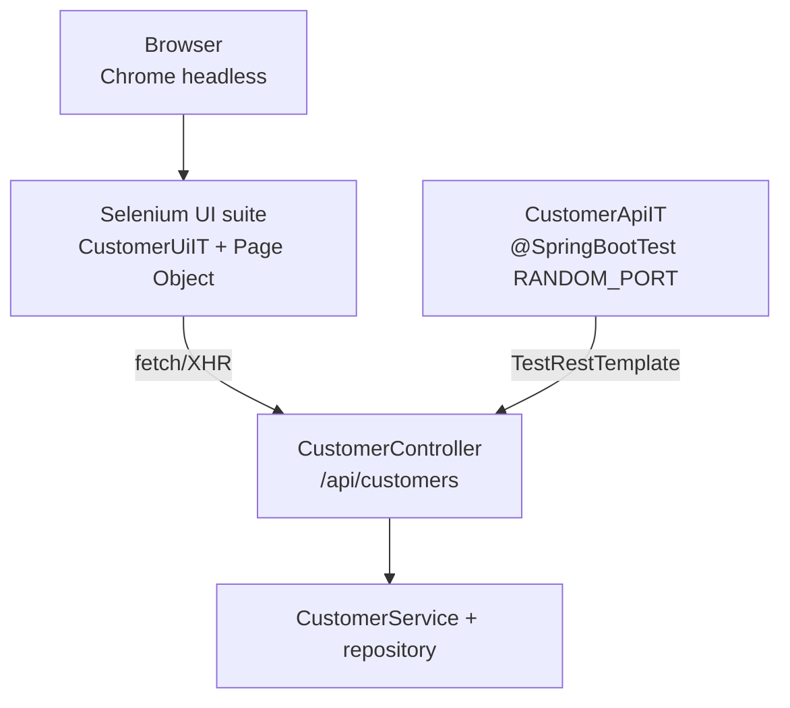

# Lab 19: Integration and UI Testing with Selenium — Northstar CRM Regression Suite

> **Participants:** Module sequence is in [`../README.md`](../README.md). **Do not start this guide until** you have finished Module 19 [pre-lab exercises](../exercises/EXERCISES-INDEX.md) (Pass; classroom order **1 → 2 → 3 → 4 → 6 → 5**). Then open **one** OS how-to ([Windows](LAB-19-WINDOWS.md) · [macOS](LAB-19-MACOS.md)). In class, prefer the **45-minute timed path** with [`starter/`](starter/README.md); the **full path** is every Step below (homework / extended). Skip `solution/` unless your instructor says otherwise. See [Which file do I open?](../../../_PARTICIPANT-FILE-GUIDE.md).

## Activity card

| | |
| --- | --- |
| **Objective** | Ship CustomerApiIT + Selenium Page Object UI IT with correlation and data-testid |
| **Skills practiced** | API IT, WebDriver, Page Objects, explicit waits, regression evidence |
| **Expected outcome** | `mvn -Dtest=CustomerApiIT,CustomerUiIT test` → **Tests run: 4** · correlation echo · regression-notes.md |
| **Estimated time** | Timed path ~45 min · Full path 4–5 hours |
| **Prerequisites** | Lab 0 · Lab 18 preferred · Exercises 1–4, 6, 5 Pass · JDK 21 · Maven · Chrome/Chromium |
| **Expected files** | `examples/lab19-crm/` — controller/static UI, ApiIT, UiIT, notes |
| **Validation checkpoints** | Starter smoke ApiIT + UiIT · GUIDE Implementation Checkpoints |

**Module:** 19 — Integration and UI Testing with Selenium  
**Duration:** ~45 minutes (timed path with starter) · Full path: 4–5 Hours

**Primary IDE:** IntelliJ IDEA Community Edition · **Optional IDE:** VS Code

| OS | How-to for this lab |
| -- | ------------------- |
| Windows | [LAB-19-WINDOWS.md](LAB-19-WINDOWS.md) |
| macOS | [LAB-19-MACOS.md](LAB-19-MACOS.md) |

> **Incremental build:** Pyramid → locators → Page Object → flake/CI → correlation → prep → Lab 19.

> **Classroom pacing:** [`../PACING.md`](../PACING.md) (Checkpoints A–E).

> **Critical scope:** Prefer **data-testid** + Page Objects + explicit waits. Attach **X-Correlation-Id**. Do not replace unit tests with only UI. Actuator is **Lab 21**.

## 45-minute timed path (use starter)

In class, use the starter templates so the **core** objectives fit **~45 minutes**. The full Steps below remain for homework / extended depth.

1. Open [`starter/README.md`](starter/README.md).
2. Copy `starter/` into your `java-bootcamp/examples/lab19-crm/` target (see starter README).
3. Fill every `// TODO` — do **not** wait on a perfect prior lab; the starter includes a baseline.
4. Run the starter smoke test; evidence under `notes/screenshots/lab-19/`.
5. Mark timed-path Pass criteria in the starter README. Continue remaining GUIDE steps as homework if needed.

| Path | Time | Scope |
| ---- | ---- | ----- |
| **Timed (default)** | ~45 min | Starter TODOs + smoke test |
| **Full (extended)** | see Duration | Every Step in this GUIDE |


## What you'll submit (read this first)

Keep this checklist visible while you work.

| # | Deliverable |
| - | ----------- |
| 1 | Integration test class(es) for CRM create/get (`CustomerApiIT`) |
| 2 | Selenium UI suite with Page Object(s) (`CustomerUiIT`, `CustomerFormPage`) |
| 3 | Minimal UI surface with stable selectors |
| 4 | Automated test output (surefire) |
| 5 | Successful-path evidence: API POST `CUS-1901` + UI `CUS-2001` (get Amina `CUS-1001`) |
| 6 | Controlled-failure evidence (validation / not found / broken locator screenshot) |
| 7 | Regression notes (why integration vs UI scope; CI browser strategy) |
| 8 | Run and cleanup instructions |

**Must submit:** the items in the table above (sources + evidence + short notes).

**Do not submit:** `target/`, `node_modules/`, secrets, heap dumps, or a verbatim instructor `solution/`.

## Lab Overview

This Module 19 lab extends the **Customer Management Platform** with **HTTP integration tests** for the CRM API and a **Selenium WebDriver** UI automation suite. You treat tests as regression assets: each scenario protects a business path that must keep working after later labs change logging, Actuator, Spring IoC, and Boot.

## Learning Objectives

After completing this lab, you will be able to:

* Separate unit, integration, and UI test scopes for a CRM service
* Write Spring/Maven integration tests that hit real HTTP boundaries for customer create and get
* Configure Selenium WebDriver with Chrome/Chromium via WebDriverManager (or an equivalent managed driver)
* Build a small Page Object–style UI suite for CRM customer forms
* Assert stable identifiers, correlation headers, and visible status without sleeping blindly

## Business Scenario

The CRM stores customer identity, contact details, lifecycle status, and financial accounts. Its client communicates with Spring Boot; Spring persists (or uses in-memory for the lab), emits events, and protects outbound calls. This lab adds integration and UI verification without bypassing HTTP boundaries.

Leadership freezes:

**HTTP ApiIT proves get Amina `CUS-1001`, create `CUS-1901` with correlation `lab-request-001`, and 404; UI IT creates `CUS-2001`. Flaky sleeps are not an acceptable “fix.”**

Use these examples consistently:

| ID | Name | Notes |
| -- | ---- | ----- |
| `CUS-1001` | Amina Khan | `ACTIVE` — seeded get happy path |
| `CUS-1901` | Lab Nineteen | API POST + correlation echo |
| `CUS-2001` | Ui Customer | UI Page Object create |
| `CUS-1002` | Ravi Singh | `PROSPECT` — optional second customer |
| `CUS-9999` | — | not-found 404 (`missingCustomerReturns404`) |
| `lab-request-001` | — | `X-Correlation-Id` on POST/GET |
| ISO-8601 UTC | — | timestamps in evidence notes |

**Security note for evidence.** Use fictional names/emails only. Do not commit ChromeDriver binaries, browser profiles, or real auth cookies. Prefer screenshots of results regions without secrets.

---

## Architecture Context
### NOW (this lab)


```mermaid
flowchart TB
  Browser["Browser<br/>Chrome headless"] --> UI["Selenium UI suite<br/>CustomerUiIT + Page Object"]
  UI -->|fetch/XHR| Ctrl["CustomerController<br/>/api/customers"]
  Ctrl --> Svc["CustomerService + repository"]
  ApiIT["CustomerApiIT<br/>@SpringBootTest RANDOM_PORT"] -->|TestRestTemplate| Ctrl
```

## Prerequisites

Prior labs: [17](../../module-17/lab17/LAB-17-GUIDE.md) · [18](../../module-18/lab18/LAB-18-GUIDE.md).

Confirm (Lab 0 tools assumed):

* JDK 21; Maven; Git
* Chrome or Chromium installed (or instructor-provided browser)
* Selenium Java bindings + WebDriverManager (or CI-supplied ChromeDriver)
* Free local ports for the CRM app under test (typically 8080; IT uses RANDOM_PORT)
* No secrets committed to Git

### Pre-flight

```bash
java -version
mvn -version
```

## Worked example (read before you code)

Study this pattern once before Step 1. Your job is to apply the same idea in the Steps — do not skip ahead to a full solution.

```java
import org.springframework.boot.test.context.SpringBootTest;

@SpringBootTest(webEnvironment = SpringBootTest.WebEnvironment.RANDOM_PORT)
class CustomerApiIT {
  // Starter methods: getAminaReturns200, createEchoesCorrelationHeader (POST CUS-1901),
  // missingCustomerReturns404 (GET CUS-9999)
}
// UiIT: createCustomerViaUi — fill(id, name, email, status) with CUS-2001;
// testids submit-customer / create-result
```

**What to notice:** Match starter method names, fixtures (`CUS-1901` / `CUS-2001`), and testids — instructors check these.

---

## Implementation Steps

Complete each step in order. Commands assume `~/java-bootcamp/examples/lab19-crm` (Windows: `%USERPROFILE%\java-bootcamp\examples\lab19-crm`) unless noted.

---

### Step 1 — Branch Lab 18 and scaffold the testable CRM web module

**Why:** Integration and UI tests need a Web starter and managed Selenium stack that match CI’s browser story.

**Do this:**

```bash
cd ~/java-bootcamp/examples
cp -r lab18-crm lab19-crm
cd lab19-crm
mkdir -p docs
mkdir -p ~/java-bootcamp/notes/screenshots/lab-19 \
  src/main/resources/static \
  src/test/java/com/northstar/crm/integration \
  src/test/java/com/northstar/crm/ui/pages
```

Ensure `pom.xml` includes (adapt if Boot parent manages versions):

```xml
<dependency>
  <groupId>org.springframework.boot</groupId>
  <artifactId>spring-boot-starter-web</artifactId>
</dependency>
<dependency>
  <groupId>org.springframework.boot</groupId>
  <artifactId>spring-boot-starter-test</artifactId>
  <scope>test</scope>
</dependency>
<dependency>
  <groupId>org.seleniumhq.selenium</groupId>
  <artifactId>selenium-java</artifactId>
  <scope>test</scope>
</dependency>
<dependency>
  <groupId>io.github.bonigarcia</groupId>
  <artifactId>webdrivermanager</artifactId>
  <version>5.9.2</version>
  <scope>test</scope>
</dependency>
```

Pin Selenium 4.x. Do not commit a proprietary ChromeDriver binary into the repo.

```bash
mvn -q dependency:resolve
```

**Expected result:** `BUILD SUCCESS`; selenium-java and webdrivermanager on the test classpath.

**If it fails:** Missing Boot parent → add parent or explicit versions. WebDriverManager version unavailable → bump to instructor-approved 5.x. Corporate proxy blocking downloads → use instructor pre-cached driver path (document it).

---

### Step 2 — Implement create/get CRM API under test

**Why:** UI automation without a stable HTTP contract becomes locator theatre; the API is the contract Lab 20–21 will also exercise.

**Do this:** Expose create and get endpoints that accept/return customer IDs and echo a correlation header. Seed or accept `CUS-1001` / `CUS-1002` as stable lab identities.

```java
import org.springframework.web.bind.annotation.GetMapping;
import org.springframework.web.bind.annotation.PathVariable;
import org.springframework.web.bind.annotation.PostMapping;
import org.springframework.web.bind.annotation.RequestBody;
import org.springframework.web.bind.annotation.RequestHeader;
import org.springframework.web.bind.annotation.RequestMapping;
import org.springframework.web.bind.annotation.RestController;
import org.springframework.http.HttpStatus;
import org.springframework.http.ResponseEntity;

@RestController
@RequestMapping("/api/customers")
public class CustomerController {
  private final CustomerService customers;

  public CustomerController(CustomerService customers) {
    this.customers = customers;
  }

  @PostMapping
  public ResponseEntity<Customer> create(
      @RequestHeader(value = "X-Correlation-Id", required = false) String correlationId,
      @RequestBody Customer body) {
    var created = customers.create(body, correlationId != null ? correlationId : "lab-request-001");
    return ResponseEntity.status(HttpStatus.CREATED)
        .header("X-Correlation-Id", created.correlationId())
        .body(created);
  }

  @GetMapping("/{id}")
  public ResponseEntity<Customer> get(@PathVariable String id) {
    return customers.findById(id)
        .map(ResponseEntity::ok)
        .orElse(ResponseEntity.notFound().build());
  }
}
```

Adapt method names to your Lab 15–18 service (`addCustomer` / `create`, etc.). Prefer constructor injection (foreshadows Lab 22).

**Expected result:** GET `CUS-1001` returns 200 Amina ACTIVE; POST `CUS-1901` returns 201 with `X-Correlation-Id` echo `lab-request-001`.

**If it fails:** 404 on mapping → check `@RequestMapping` and context path. Correlation missing → default when header absent. Bean wiring errors → ensure Boot app class / `@SpringBootApplication` exists for this module.

---

### Step 3 — Write HTTP integration tests (`CustomerApiIT`)

**Why:** Proves the network boundary independently of Chrome flakiness—cheap, fast regression before UI.

**Do this:** Complete starter `CustomerApiIT.java` with `@SpringBootTest(webEnvironment = RANDOM_PORT)` and `TestRestTemplate`. Cover get Amina, create `CUS-1901` + correlation echo, and not-found `CUS-9999`.

```java
import org.springframework.beans.factory.annotation.Autowired;
import org.springframework.boot.test.context.SpringBootTest;
import org.junit.jupiter.api.Test;
import org.springframework.boot.test.web.server.LocalServerPort;
import org.springframework.boot.test.web.client.TestRestTemplate;

@SpringBootTest(webEnvironment = SpringBootTest.WebEnvironment.RANDOM_PORT)
class CustomerApiIT {
  @LocalServerPort int port;
  @Autowired TestRestTemplate rest;

  @Test
  void getAminaReturns200() { /* GET /api/customers/CUS-1001 → 200 */ }

  @Test
  void createEchoesCorrelationHeader() {
    // POST customerId CUS-1901 with X-Correlation-Id lab-request-001 → 201 + header echo
  }

  @Test
  void missingCustomerReturns404() { /* GET CUS-9999 → 404 */ }
}
```

Complete the three starter `CustomerApiIT` methods (`getAminaReturns200`, `createEchoesCorrelationHeader` with **CUS-1901**, `missingCustomerReturns404`).

```bash
mvn -q -Dtest=CustomerApiIT test
```

**Expected result:** **Tests run: 3** for ApiIT; surefire report for `CustomerApiIT` present.

**If it fails:** Port in URL wrong when using relative paths with `TestRestTemplate` root URI—prefer `@SpringBootTest` + `@LocalServerPort` consistently. JSON property names mismatch → align with Jackson/record field names. Shared static store across tests → reset or unique IDs per method if needed.

---

### Step 4 — Add a minimal CRM UI surface

**Why:** Selenium needs stable selectors; a tiny `data-testid` form beats brittle CSS soup on a full SPA for this module.

**Do this:** Create `src/main/resources/static/customers.html` (or wire your existing SPA route):

```html
<form id="customer-form">
  <label>Customer ID <input id="customerId" data-testid="customer-id"/></label>
  <label>Full name <input id="fullName" data-testid="full-name"/></label>
  <label>Email <input id="email" data-testid="email"/></label>
  <label>Status <select id="status" data-testid="status">
    <option>ACTIVE</option><option>PROSPECT</option>
  </select></label>
  <button type="submit" data-testid="submit-customer">Create</button>
</form>
<pre data-testid="create-result" id="result"></pre>
```

Wire submit to `POST /api/customers` with header `X-Correlation-Id: lab-request-001`. Show result text including ID and name/status (or an error message for validation).

Manually open `http://localhost:8080/customers.html` after `mvn spring-boot:run` and submit `CUS-2001` once (UI fixture: name **Ui Customer**, status **PROSPECT**).

**Expected result:** Manual submit shows **Ui Customer** / **PROSPECT** (and `CUS-2001`) in result; Network tab shows correlation header.

**If it fails:** Static resource 404 → check `src/main/resources/static` path. CORS/fetch errors → same-origin static+API under Boot. Blank result → JS error in browser console—fix before automating.

---

### Step 5 — Configure WebDriverManager Chrome session

**Why:** Matching ChromeDriver to installed Chrome is the #1 environment failure mode; managed setup + headless CI is the lab standard.

**Do this:** In `CustomerUiIT.java`:

```java
import java.time.Duration;
import io.github.bonigarcia.wdm.WebDriverManager;
import org.junit.jupiter.api.AfterEach;
import org.junit.jupiter.api.BeforeEach;
import org.openqa.selenium.chrome.ChromeDriver;
import org.openqa.selenium.chrome.ChromeOptions;
import org.openqa.selenium.support.ui.WebDriverWait;

@BeforeEach
void setUp() {
  WebDriverManager.chromedriver().setup();
  ChromeOptions options = new ChromeOptions();
  options.addArguments("--headless=new", "--window-size=1280,900");
  driver = new ChromeDriver(options);
  driver.manage().timeouts().implicitlyWait(Duration.ofSeconds(0));
  wait = new WebDriverWait(driver, Duration.ofSeconds(10));
}

@AfterEach
void tearDown() {
  if (driver != null) driver.quit();
}
```

Prefer **explicit** waits; set implicit wait to 0 to avoid stacked wait surprises. Prefer headless for CI; document headed local debugging.

**Expected result:** WebDriverManager resolves chromedriver; Chrome starts headless; `driver.quit()` leaves no orphaned processes after the class finishes.

**If it fails:** “cannot find Chrome binary” → install Chromium or set binary path via options (document). Version mismatch → let WebDriverManager refresh; avoid hard-coded driver paths in Git. Orphan processes → always quit in `@AfterEach` / try-finally.

---

### Step 6 — Build Page Object and happy-path UI test

**Why:** Tests should read like business scripts; locators belong in one Page Object so UI renames do not scatter.

**Do this:** Create `CustomerFormPage.java`:

```java
import org.openqa.selenium.By;
import org.openqa.selenium.WebDriver;
import org.openqa.selenium.support.ui.ExpectedConditions;
import org.openqa.selenium.support.ui.Select;
import org.openqa.selenium.support.ui.WebDriverWait;

public class CustomerFormPage {
  private final WebDriver driver;
  private final WebDriverWait wait;
  public CustomerFormPage(WebDriver d, WebDriverWait w) { driver = d; wait = w; }
  public CustomerFormPage open(String baseUrl) {
    driver.get(baseUrl + "/customers.html");
    wait.until(ExpectedConditions.visibilityOfElementLocated(
        By.cssSelector("[data-testid=customer-id]")));
    return this;
  }
  public CustomerFormPage fill(String id, String name, String email, String status) {
    driver.findElement(By.cssSelector("[data-testid=customer-id]")).sendKeys(id);
    driver.findElement(By.cssSelector("[data-testid=full-name]")).sendKeys(name);
    driver.findElement(By.cssSelector("[data-testid=email]")).sendKeys(email);
    new Select(driver.findElement(By.cssSelector("[data-testid=status]")))
        .selectByVisibleText(status);
    return this;
  }
  public void submit() {
    driver.findElement(By.cssSelector("[data-testid=submit-customer]")).click();
  }
  public String resultText() {
    return wait.until(ExpectedConditions.visibilityOfElementLocated(
        By.cssSelector("[data-testid=create-result]"))).getText();
  }
}
```

```java
import static org.assertj.core.api.Assertions.assertThat;
import org.junit.jupiter.api.Test;

@Test
void createCustomerViaUi() {
  var page = new CustomerFormPage(driver, wait).open(baseUrl);
  page.fill("CUS-2001", "Ui Customer", "ui.customer@example.com", "PROSPECT").submit();
  assertThat(page.resultText()).contains("CUS-2001");
}
```

Derive `baseUrl` from `@LocalServerPort` when the UI test starts Boot (preferred), or document a running-app assumption clearly.

```bash
mvn -q -Dtest=CustomerUiIT#createCustomerViaUi test
```

**Expected result:** UI happy path PASS; result contains `CUS-2001`.

**If it fails:** Timeout on result → JS did not update result / API failed—check API IT first. Element not found → wrong `data-testid` or page URL. Stale element → re-find after navigation; keep waits explicit.

---

### Step 7 — Confirm API 404 regression (starter)

**Why:** Suites that only green-path CRM create hide not-found regressions until production.

**Do this:** Ensure starter `CustomerApiIT#missingCustomerReturns404` covers `GET /api/customers/CUS-9999` → 404. (Optional full-path stretch: blank-name UI validation — not required on timed starter, which has **one** UiIT method.)

**Expected result:** Timed suite = **ApiIT 3 + UiIT 1 = Tests run: 4**.

**If it fails:** 404 returns 200 empty → fix controller not-found mapping.

---

### Step 8 — Regression pass, deliberate failure screenshot, documentation

**Why:** Regression assets earn trust only when you watch them fail and restore, with evidence others can read.

**Do this:**

```bash
# Surefire only (no Failsafe plugin in starter POM) — pin IT classes:
mvn -q -Dtest=CustomerApiIT,CustomerUiIT test
ls target/surefire-reports/
```

Optionally fail a locator on purpose, capture a screenshot on failure, then restore:

```java
import java.nio.file.Files;
import java.nio.file.Path;
import org.openqa.selenium.OutputType;
import org.openqa.selenium.TakesScreenshot;

if (testFailed) {
  Files.write(Path.of("target/ui-failure.png"),
      ((TakesScreenshot) driver).getScreenshotAs(OutputType.BYTES));
}
```

Document in `docs/regression-notes.md`: unit vs IT vs UI scope, headless CI strategy, correlating `lab-request-001`. Run suite twice for determinism.

**Expected result:** BUILD SUCCESS on both runs; surefire contains both IT classes; deliberate broken locator produces screenshot; restore returns green; notes complete.

**If it fails:** See Troubleshooting. Flaky only on second run → shared state in repository—reset store between tests. Orphan chromedriver → quit in teardown.

---

## Implementation Checkpoints

### Checkpoint A — Tooling and API

_Mark **Pass** or **Fail** in your lab notes._

| # | Confirm | Your notes |
| - | ------- | ---------- |
| 1 | `lab19-crm` under `~/java-bootcamp/examples/` | Pass / Fail |
| 2 | Web + Selenium + WebDriverManager on classpath | Pass / Fail |
| 3 | Create/get API with correlation header echo | Pass / Fail |

### Checkpoint B — Integration tests

_Mark **Pass** or **Fail** in your lab notes._

| # | Confirm | Your notes |
| - | ------- | ---------- |
| 1 | `CustomerApiIT` get `CUS-1001` + create `CUS-1901` + 404 | Pass / Fail |
| 2 | Not-found 404 case | Pass / Fail |
| 3 | Deterministic fixtures (no random PII) | Pass / Fail |

### Checkpoint C — UI suite

_Mark **Pass** or **Fail** in your lab notes._

| # | Confirm | Your notes |
| - | ------- | ---------- |
| 1 | `customers.html` with `data-testid` hooks | Pass / Fail |
| 2 | WebDriverManager headless session + quit teardown | Pass / Fail |
| 3 | Page Object + happy-path Amina create | Pass / Fail |
| 4 | Blank-name negative UI assert | Pass / Fail |

### Checkpoint D — Regression hygiene

_Mark **Pass** or **Fail** in your lab notes._

| # | Confirm | Your notes |
| - | ------- | ---------- |
| 1 | Two green runs / verify after trivial edit | Pass / Fail |
| 2 | Failure screenshot experiment restored | Pass / Fail |
| 3 | No secrets / drivers / `target/` committed | Pass / Fail |

---

## Reference Commands, Configuration, and Code

### Selenium + WebDriverManager deps

```xml
<dependency>
  <groupId>org.seleniumhq.selenium</groupId>
  <artifactId>selenium-java</artifactId>
  <scope>test</scope>
</dependency>
<dependency>
  <groupId>io.github.bonigarcia</groupId>
  <artifactId>webdrivermanager</artifactId>
  <version>5.9.2</version>
  <scope>test</scope>
</dependency>
```

### Commands

```bash
cd ~/java-bootcamp/examples/lab19-crm
mvn -q -Dtest=CustomerApiIT,CustomerUiIT test
# Expected: Tests run: 4 (ApiIT 3 + UiIT 1) — Surefire; no Failsafe
mvn spring-boot:run
git status
```

## Failure Experiments

| # | Experiment | Observe | Restore |
| - | ---------- | ------- | ------- |
| 1 | Point UI at wrong port / stop app mid-suite | Timeout / connection refused; screenshot | Restart app; fix baseUrl |
| 2 | Submit blank full name via UI and API | 400 / visible validation | Keep as permanent negative |
| 3 | Repeat create for `CUS-1001` | Duplicate reject or overwrite—document | Align service rule + asserts |
| 4 | Throttle / delay API; rely on explicit wait | Wait succeeds without sleep | Keep bounded WebDriverWait |
| 5 | Break a `data-testid` locator | Red UI test + `ui-failure.png` | Restore locator; delete temp PNG if policy requires |

---

## Troubleshooting

| Symptom | Likely cause | Fix |
| ------- | ------------ | --- |
| Cannot connect | Wrong host/port | Use `@LocalServerPort`; `localhost` for host processes |
| Chrome/WebDriver mismatch | Stale driver binary | Let WebDriverManager resolve; avoid committed drivers |
| Flaky UI | Implicit+explicit stacked waits / sleeps | Implicit 0; await specific condition |
| Element not found | Brittle XPath / wrong page | Prefer `data-testid`; assert URL loaded |
| Static 404 | Resource path wrong | `src/main/resources/static/customers.html` |
| Duplicate creates | Shared in-memory store | Reset between tests or assert duplicate rule |
| Config ignored | Wrong profile | Check `application-test.yml` and active profile |
| Correlation missing on create | Header not set in IT | Send `X-Correlation-Id: lab-request-001` |

## Security and Production Review

Optional — jot brief notes in your README if useful for your progress check (not a separate essay):

1. Which browser, network, or API inputs are untrusted?
2. Where are authentication, authorization, and validation enforced (UI is not enough)?
3. Which values are sensitive—never in screenshots or surefire dumps?

---


## Cleanup

```bash
cd ~/java-bootcamp/examples/lab19-crm
# Stop Spring Boot / CRM UI processes started for this lab
# Kill orphaned chromedriver only if a suite aborted:
# pkill chromedriver                 # Linux/macOS
# taskkill /IM chromedriver.exe /F   # Windows, only if needed
mvn -q clean
git status
```

**Keep `lab19-crm`**—Lab 20 adds structured logging on the same create/get paths.


## Reflection Questions

Write **1–3 sentence** answers (not essays):

1. Which design decision most affected correctness (Page Object vs inline locators)?
2. What evidence proves the implementation works?
3. Which failure was hardest to diagnose (driver mismatch, wait timeout, API JSON)?

---


