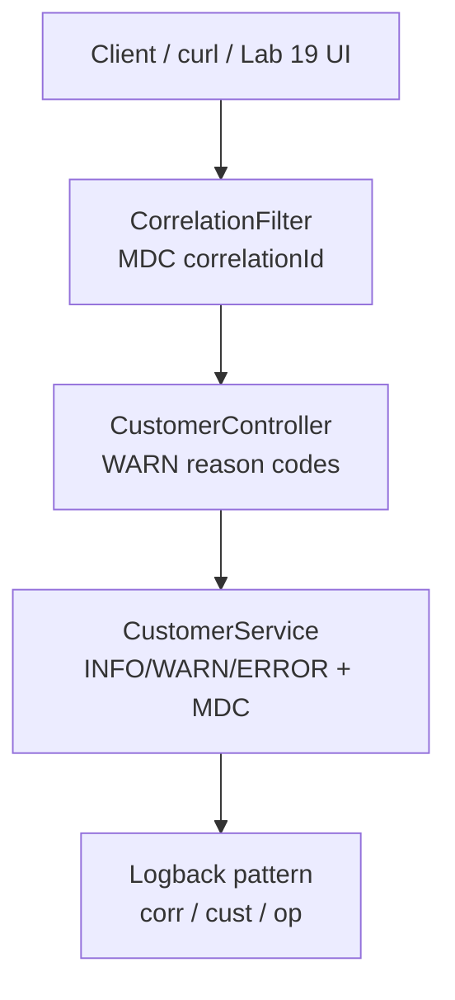
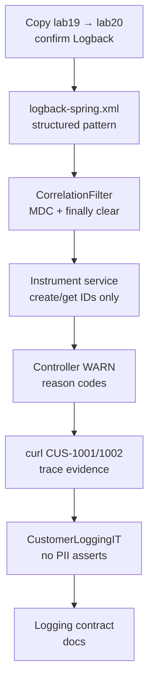

# Lab 20: Structured Logging — Northstar CRM Traceable Operations

**Module:** 20 — Structured Logging  
**Lab folder:** `labs/Week 2 - Backend, AI Tools and Testing/module-20/lab20/`  
**Difficulty:** Intermediate  
**Duration:** 3–4 Hours

**Primary IDE:** IntelliJ IDEA Community Edition · **Optional IDE:** VS Code

| OS | How-to for this lab |
| -- | ------------------- |
| Windows | [LAB-20-WINDOWS.md](LAB-20-WINDOWS.md) |
| macOS | [LAB-20-MACOS.md](LAB-20-MACOS.md) |

> **Environment reminder:** Finish [Lab 0](../../../Week%201%20-%20Java%20and%20JVM%20Foundations/module-00/lab0/LAB-0-GUIDE.md). Use **IntelliJ IDEA Community** (primary; optional VS Code) on your laptop with **JDK 21** and **Maven 3.9+**. Work under `~/java-bootcamp` (Windows: `%USERPROFILE%\java-bootcamp`).

---

## How to follow this lab

1. Open the **Windows** or **macOS** how-to (links above) in a second tab.
2. Create/work only under your `java-bootcamp/examples/…` folder from the steps (not inside this `labs/` git clone unless a step says otherwise).
3. For each **Step N**: read **Why** (if present) → do the actions → confirm **Expected** / **Expected result** → then continue.
4. When stuck, use **Failure Experiments** / troubleshooting in this guide before asking for help.
5. Capture evidence under `notes/screenshots/` (redact secrets). Use the **Pass criteria** tables — write **Pass** or **Fail** in your notes. GitHub file view does not support clickable checkboxes.

## Lab Overview

This Module 20 lab extends the **Customer Management Platform** with **SLF4J** and **Logback** structured logging for customer operations. You introduce correlation IDs, consistent message patterns, and safe field selection so support can trace create/get flows without logging personally identifiable information (PII).

**Purpose.** Labs 17–19 prove behavior with tests; operators still cannot search “what happened to request X” without structure. Leadership freezes: every CRM request carries `X-Correlation-Id` into MDC; logs include `customerId` and `op` where known; **never** full name, email, phone, address, or account numbers in log messages or MDC.

**What you build (exercise).** Copy to `lab20-crm`; confirm Logback binding; configure `logback-spring.xml` structured pattern; add `CorrelationFilter` with MDC clear in `finally`; instrument `CustomerService` create/get; WARN at controller validation without dumping payloads; exercise Amina/Ravi traces; assert with `CustomerLoggingIT`; document the logging contract.

**What success looks like.** Under `~/java-bootcamp/examples/lab20-crm/` a create of `CUS-1001` with `lab-request-001` produces console lines with `corr=` / `cust=` / `op=` and **zero** occurrences of “Amina” or emails; automated IT enforces that; forbidden-field list matches samples.

**Depends on Lab 19.** Need create/get HTTP endpoints (or equivalent runnable CRM paths). Lab 18 Mockito suites may remain; logging instrumentation is production code plus IT.

**CRM connection.** Fixtures `CUS-1001` / `CUS-1002`, correlation `lab-request-001`. Lab 21 metrics correlate with these logs (IDs in logs; aggregates in metrics—do not tag metrics with customer names).

---

## Learning Objectives

After completing this lab, you will be able to:

* Add SLF4J API usage and Logback as the binding in a Maven CRM module
* Configure console (and optional file) appenders with a structured pattern layout
* Propagate correlation IDs via MDC across controller and service calls
* Log customer operations using stable IDs (`CUS-1001`) without names, emails, or phones
* Distinguish INFO vs WARN vs ERROR for CRM create/get and validation failures
* Verify log lines for a request carrying `lab-request-001`
* Explain what must never appear in logs in production
* Clear MDC in `finally` to prevent cross-request leakage
* Connect logging evidence to Observability (Lab 21) and Actuator work

---

## Business Scenario

The CRM stores customer identity, contact details, lifecycle status, and financial accounts. Support escalations fail when logs say “error creating customer” with no correlation and when “helpful” logs dump Amina’s email into Splunk.

Leadership freezes:

**Structured logs with MDC correlation and customer IDs. No PII in logs. Clear MDC after every request.**

Use these examples consistently:

| ID | Name | Notes |
| -- | ---- | ----- |
| `CUS-1001` | Amina Khan | `ACTIVE` — create/get INFO traces (ID only in logs) |
| `CUS-1002` | Ravi Singh | `PROSPECT` — second customer + validation WARN demos |
| `lab-request-001` | — | `X-Correlation-Id` / MDC `correlationId` |
| ISO-8601 UTC | — | prefer ISO timestamps in pattern |

**PII rule for this lab.** You may store full names in the domain model for CRM functionality, but **never** write full name, email, phone, address, passwords, tokens, or PAN into log messages or MDC.

**Security note for evidence.** Sanitize pasted log excerpts. Prefer committing patterns and contracts—not production dumps.

---

## Architecture Context

### NOW (this lab)



### Lab flow (mermaid)



### Architecture NOW vs LATER

| Aspect | Lab 19 (was) | Lab 20 (NOW) | Lab 21 |
| ------ | ------------ | ------------ | ------ |
| Evidence | Surefire / screenshots | Structured console + IT | Actuator metrics |
| Correlation | HTTP header | Header → MDC → logs | Logs + aggregates |
| PII | Avoid in tests | Forbidden in logs | Still forbidden; never as metric tags |

**Lab focus:** SLF4J + Logback; correlation IDs; structured patterns for customer operations; no PII in logs.

---

## Prerequisites

Complete [SETUP](../../../SETUP-INSTRUCTIONS.md), [Lab 0](../../../Week%201%20-%20Java%20and%20JVM%20Foundations/module-00/lab0/LAB-0-GUIDE.md), and Labs [18](../../module-18/lab18/LAB-18-GUIDE.md)–[19](../../module-19/lab19/LAB-19-GUIDE.md). Confirm:

* JDK 21; Maven; Git
* Existing CRM customer create/get endpoints from Lab 19
* SLF4J/Logback via Spring Boot starters or explicit dependencies
* No secrets committed to Git

### Pre-flight

```bash
java -version
mvn -version
git --version
pwd
ls ~/java-bootcamp/examples
```

---

## Suggested Project Files

```text
~/java-bootcamp/examples/lab20-crm/
├── src/
│   ├── main/
│   │   ├── java/com/northstar/crm/
│   │   │   ├── api/CustomerController.java
│   │   │   ├── logging/CorrelationFilter.java
│   │   │   ├── service/CustomerService.java
│   │   │   └── ...
│   │   └── resources/
│   │       ├── application.yml
│   │       └── logback-spring.xml
│   └── test/
│       └── java/com/northstar/crm/
│           └── logging/CustomerLoggingIT.java
├── docs/
│   └── logging.md
├── notes/screenshots/
├── pom.xml
├── .gitignore
└── README.md
```

Ignore rotated log files with real payloads, tokens, and passwords. Prefer committing patterns—not dump files.

---

## Concepts to Discuss

Write 2–3 sentences each in `docs/logging.md`:

1. Main flow: request → filter MDC → controller → service → appender
2. Trust boundary: what is safe to log vs PII
3. Success/failure contracts at INFO vs WARN vs ERROR
4. Stable identity (`customerId`, correlation) vs free-text names
5. Idempotent create logging (duplicate WARN without payload dump)
6. Local console DEBUG vs production INFO + central shipping
7. Evidence operators need (search by `lab-request-001`)
8. Two instances: MDC must not leak across threads/requests
9. Why `%X{...}` patterns beat ad-hoc string concatenation
10. What Lab 21 will add (metrics) without putting IDs in metric tags

---

## Implementation Steps

Complete each step in order. Commands assume `~/java-bootcamp/examples/lab20-crm` (Windows: `%USERPROFILE%\java-bootcamp\examples\lab20-crm`) unless noted.

---

### Step 1 — Branch Lab 19 and confirm SLF4J / Logback

**Why:** Competing logging frameworks and leftover `System.out` make “structure” impossible to enforce.

**Do this:**

```bash
cd ~/java-bootcamp/examples
cp -r lab19-crm lab20-crm
cd lab20-crm
mkdir -p docs notes/screenshots \
  src/main/java/com/northstar/crm/logging \
  src/test/java/com/northstar/crm/logging
```

`spring-boot-starter-web` already brings Logback; keep one binding. In code, import only `org.slf4j.Logger` / `LoggerFactory`—not `java.util.logging` for CRM services.

```bash
mvn -q dependency:tree | grep -iE "logback|slf4j" || mvn -q dependency:tree | findstr /i "logback slf4j"
```

**Expected result:** `logback-classic` and `slf4j-api` present; `BUILD SUCCESS`.

**If it fails:** Hard `log4j` / JUL bridge conflict → exclude competing bindings; follow Boot logging docs. Pure non-Boot module → add `spring-boot-starter` or explicit Logback deps.

---

### Step 2 — Configure a structured Logback pattern

**Why:** Without a shared pattern, MDC keys exist in code but never appear in operator-visible lines.

**Do this:** Create `src/main/resources/logback-spring.xml`:

```xml
<configuration>
  <appender name="CONSOLE" class="ch.qos.logback.core.ConsoleAppender">
    <encoder>
      <pattern>%d{ISO8601} %-5level [%thread] %logger{36} corr=%X{correlationId} cust=%X{customerId} op=%X{op} - %msg%n</pattern>
    </encoder>
  </appender>
  <logger name="com.northstar.crm" level="INFO"/>
  <root level="INFO">
    <appender-ref ref="CONSOLE"/>
  </root>
</configuration>
```

JSON encoding is optional bonus; key=value / `%X{...}` is enough for this lab. Avoid committing a conflicting plain `logback.xml` that overrides Boot’s Spring-aware config accidentally.

**Expected result:** App starts; CRM logger lines include `corr=` / `cust=` / `op=` placeholders when MDC is empty or filled.

**If it fails:** Pattern ignored → check for competing `logback.xml`. No MDC keys ever → filter not registered yet (Step 3). Too noisy third-party DEBUG → keep root INFO; raise only `com.northstar.crm` as needed.

---

### Step 3 — Add `CorrelationFilter` / interceptor

**Why:** Correlation must enter MDC once per request and always leave—leaks across Tomcat threads corrupt the next tenant’s traces.

**Do this:** Create `CorrelationFilter.java`:

```java
@Component
public class CorrelationFilter extends OncePerRequestFilter {
  public static final String HEADER = "X-Correlation-Id";
  public static final String MDC_KEY = "correlationId";

  @Override
  protected void doFilterInternal(HttpServletRequest req, HttpServletResponse res,
                                  FilterChain chain) throws ServletException, IOException {
    String cid = req.getHeader(HEADER);
    if (cid == null || cid.isBlank()) cid = "lab-request-001";
    MDC.put(MDC_KEY, cid);
    res.setHeader(HEADER, cid);
    try {
      chain.doFilter(req, res);
    } finally {
      MDC.clear();
    }
  }
}
```

Never put Authorization headers or raw request bodies into MDC.

**Expected result:**

```bash
curl -H "X-Correlation-Id: lab-request-001" http://localhost:8080/api/customers/CUS-1001
```

Response header echoes correlation; log lines show `corr=lab-request-001` for that request.

**If it fails:** Filter not invoked → ensure `@Component` under component scan / Boot app package. MDC empty in service → clear happening too early, or async thread without context copy. Header never returned → set on response before/during filter as shown.

---

### Step 4 — Instrument `CustomerService` create/get

**Why:** Service-layer ops are what support searches; logs must carry IDs and outcomes—not Amina’s phone.

**Do this:** Replace `System.out` with SLF4J. Set MDC `customerId` and `op` around the operation:

```java
private static final Logger log = LoggerFactory.getLogger(CustomerService.class);

public Customer create(Customer input) {
  MDC.put("customerId", input.customerId());
  MDC.put("op", "customer.create");
  try {
    log.info("Creating customer");
    Customer saved = repository.save(input);
    log.info("Customer created status={}", saved.status());
    return saved;
  } catch (DuplicateCustomerException e) {
    log.warn("Create rejected reason=duplicate");
    throw e;
  } catch (Exception e) {
    log.error("Create failed", e);
    throw e;
  } finally {
    MDC.remove("customerId");
    MDC.remove("op");
  }
}

public Optional<Customer> findById(String id) {
  MDC.put("customerId", id);
  MDC.put("op", "customer.get");
  try {
    log.info("Loading customer");
    return repository.findById(id);
  } finally {
    MDC.remove("customerId");
    MDC.remove("op");
  }
}
```

Adapt to your method names. Prefer removing op/customerId keys rather than calling `MDC.clear()` in the service if the filter owns full clear—either way, document ownership so keys do not leak *and* correlation is not wiped mid-request incorrectly. Common pattern: filter clears all in `finally`; service only puts/removes op-scoped keys.

**Expected result:** Creating `CUS-1001` yields lines with `corr=lab-request-001 cust=CUS-1001 op=customer.create` and **no** “Amina” or email.

**If it fails:** PII still appears → search for string concat of `fullName`/`email` and delete. `op` blank → MDC put after early return. Stack traces with payloads → avoid logging request bodies in ERROR helpers.

---

### Step 5 — Log controller validation boundaries

**Why:** Rejecting bad input without a WARN reason code forces operators into HTTP-only forensics.

**Do this:** At the API edge, log rejection at WARN with reason codes (`missing_status`, `invalid_id`, `missing_full_name`), not the full invalid payload if it might contain free-text PII:

```java
if (body.fullName() == null || body.fullName().isBlank()) {
  log.warn("Rejecting create reason=missing_full_name customerId={}", body.customerId());
  return ResponseEntity.badRequest().build();
}
```

Logging `customerId` is allowed; logging `fullName` is not for this CRM lab standard.

**Expected result:** POST with blank name → 400; WARN line includes `reason=missing_full_name` and correlation; request body not echoed into logs.

**If it fails:** 400 without WARN → add log before return. WARN includes name → remove it. Controller logs every successful body → too chatty/PII-risky; keep INFO thin.

---

### Step 6 — Exercise `CUS-1001` and `CUS-1002` traces

**Why:** Pattern configuration without exercised paths does not prove searchability for support.

**Do this:** Run the app and issue create/get for both lab customers. Save a sanitized excerpt into `notes/`:

```bash
mvn spring-boot:run

curl -s -D - -H "X-Correlation-Id: lab-request-001" \
  -H "Content-Type: application/json" \
  -d '{"customerId":"CUS-1001","fullName":"Amina Khan","status":"ACTIVE"}' \
  http://localhost:8080/api/customers

curl -s -H "X-Correlation-Id: lab-request-001" \
  http://localhost:8080/api/customers/CUS-1001

curl -s -H "X-Correlation-Id: lab-request-001" \
  -H "Content-Type: application/json" \
  -d '{"customerId":"CUS-1002","fullName":"Ravi Singh","status":"PROSPECT"}' \
  http://localhost:8080/api/customers
```

**Expected result:** Requests succeed (or duplicate create is explained); logs show `corr=lab-request-001` for both; ops `customer.create` / `customer.get` with `cust=CUS-1001` and `cust=CUS-1002`.

**If it fails:** Correlation missing on get-only → filter not applied to that path. Duplicate unexplained → add WARN `reason=duplicate`. Accidental PII in excerpt → scrub before committing notes.

---

### Step 7 — Automated logging assertion test

**Why:** PII rules that exist only in README regress silently; IT makes “no Amina in logs” enforceable.

**Do this:** Create `CustomerLoggingIT.java` using Logback `ListAppender` or Spring’s `OutputCaptureExtension`:

```java
@SpringBootTest(webEnvironment = RANDOM_PORT)
@ExtendWith(OutputCaptureExtension.class)
class CustomerLoggingIT {
  @Test
  void createLogsIdsNotPii(CapturedOutput output) {
    // POST CUS-1001 with X-Correlation-Id: lab-request-001
    assertThat(output.getOut()).contains("CUS-1001");
    assertThat(output.getOut()).contains("lab-request-001");
    assertThat(output.getOut()).contains("customer.create");
    assertThat(output.getOut()).doesNotContain("Amina");
  }
}
```

Also assert no `@example.com` email if your create would otherwise log it.

```bash
mvn -q -Dtest=CustomerLoggingIT test
```

**Expected result:** `createLogsIdsNotPii` PASS; BUILD SUCCESS.

**If it fails:** Output capture empty → logging goes to a file appender only; assert against console or attach ListAppender to `com.northstar.crm`. “Amina” found → remove message inclusions; check exception messages. Flaky → isolate MDC and avoid parallel pollution.

---

### Step 8 — Document logging contract + failure experiments

**Why:** The next engineer and Lab 21 need an explicit contract, not archaeology of patterns.

**Do this:** Write `docs/logging.md`:

```markdown
## Logging contract
- Required MDC: correlationId, customerId (when known), op
- Allowed: customerId, status, reason codes, durations, HTTP status
- Forbidden: fullName, email, phone, address, passwords, tokens, PAN
- Correlation header: X-Correlation-Id (example lab-request-001)
- Levels: INFO success path; WARN business reject; ERROR unexpected
- Production: ship to central store; never embed secrets in patterns
```

Complete [Failure Experiments](#failure-experiments). Capture sanitized excerpts. Run `mvn -q test` twice.

**Expected result:** Docs match observed console; forbidden list reviewed against Step 4–6 samples; experiments recorded; suite deterministic.

**If it fails:** Docs claim JSON but only pattern layout exists → fix docs. Forbidden list incomplete vs actual WARN lines → update either code or docs until they match.

---

## Implementation Checkpoints

### Checkpoint A — Tooling and pattern

_Mark each row **Pass** or **Fail** in your lab notes (GitHub markdown files are not interactive checklists)._

| # | Confirm | Your notes |
| - | ------- | ---------- |
| 1 | `lab20-crm` under `~/java-bootcamp/examples/` | Pass / Fail |
| 2 | SLF4J + Logback on classpath (single binding) | Pass / Fail |
| 3 | `logback-spring.xml` includes corr/cust/op | Pass / Fail |

### Checkpoint B — Correlation and service logs

_Mark each row **Pass** or **Fail** in your lab notes (GitHub markdown files are not interactive checklists)._

| # | Confirm | Your notes |
| - | ------- | ---------- |
| 1 | `CorrelationFilter` sets MDC and clears in `finally` | Pass / Fail |
| 2 | Service create/get use SLF4J with ID/op MDC | Pass / Fail |
| 3 | No PII in sampled INFO lines | Pass / Fail |

### Checkpoint C — Validation + automated proof

_Mark each row **Pass** or **Fail** in your lab notes (GitHub markdown files are not interactive checklists)._

| # | Confirm | Your notes |
| - | ------- | ---------- |
| 1 | Controller WARN reason codes without payload dump | Pass / Fail |
| 2 | Manual traces for `CUS-1001` / `CUS-1002` | Pass / Fail |
| 3 | `CustomerLoggingIT` asserts IDs present and “Amina” absent | Pass / Fail |

### Checkpoint D — Hygiene

_Mark each row **Pass** or **Fail** in your lab notes (GitHub markdown files are not interactive checklists)._

| # | Confirm | Your notes |
| - | ------- | ---------- |
| 1 | `docs/logging.md` contract complete | Pass / Fail |
| 2 | Two consecutive green test runs | Pass / Fail |
| 3 | No secrets / raw PII dumps committed | Pass / Fail |

---

## Reference Commands, Configuration, and Code

### Logback pattern

```xml
<pattern>%d{ISO8601} %-5level [%thread] %logger{36} corr=%X{correlationId} cust=%X{customerId} op=%X{op} - %msg%n</pattern>
```

### MDC sample

```java
MDC.put("correlationId", "lab-request-001");
MDC.put("customerId", "CUS-1001");
MDC.put("op", "customer.get");
try { log.info("Loading customer"); } finally { MDC.clear(); }
```

### Commands

```bash
cd ~/java-bootcamp/examples/lab20-crm
mvn spring-boot:run
curl -H "X-Correlation-Id: lab-request-001" http://localhost:8080/api/customers/CUS-1001
mvn -q -Dtest=CustomerLoggingIT test
mvn -q clean verify
git status
```

### Safe log line sample

```text
2026-07-14T13:00:00.000Z INFO  [...] CustomerService corr=lab-request-001 cust=CUS-1001 op=customer.create - Customer created status=ACTIVE
```

### Class map

| Class | Role |
| ----- | ---- |
| `CorrelationFilter` | Header → MDC; clear in finally |
| `CustomerService` | Structured create/get logs |
| `CustomerController` | WARN reason codes |
| `logback-spring.xml` | Pattern with MDC keys |
| `CustomerLoggingIT` | Automated no-PII proof |
| `logging.md` | Operator contract |

### CorrelationFilter checklist (review)

Before marking Step 3 done, confirm aloud:

1. Header name matches Lab 19 client/UI (`X-Correlation-Id`).
2. Default when missing is exactly `lab-request-001` (document if you choose UUID defaults instead).
3. Response echoes the same correlation value used in MDC.
4. `finally { MDC.clear(); }` runs on success **and** exception paths.
5. No Authorization / Cookie / body content enters MDC.

### Forbidden-field grep (local hygiene)

After exercising create/get, run a quick local search over your sanitized evidence file (adjust path):

```bash
# Prefer failing the lab evidence if these match:
grep -nE "Amina|Ravi|@example\\.com|password|Bearer " notes/log-excerpt.txt || echo "PII grep clean"
```

Do **not** commit unsanitized consoles. If grep hits, scrub the excerpt and fix the logger call sites.

### Level selection cheat sheet

| Situation | Level | Message shape |
| --------- | ----- | ------------- |
| Create/get started or succeeded | INFO | op + IDs via MDC; status code/outcome in msg |
| Business reject (validation, duplicate) | WARN | `reason=...` codes; customerId OK |
| Unexpected dependency failure | ERROR | short message + exception; no entity dump |
| Local deep tracing only | DEBUG | still no PII; disable in prod defaults |

---

## Manual Verification

1. Logback pattern includes `corr`, `cust`, and `op` MDC keys.
2. Filter defaults missing correlation to `lab-request-001` and clears MDC.
3. Create `CUS-1001` logs contain customer ID and correlation, not “Amina”.
4. Get path logs `op=customer.get` with `cust=CUS-1001`.
5. Blank-name create produces WARN reason without body dump.
6. Duplicate create (if applicable) WARNs with `reason=duplicate`.
7. `CustomerLoggingIT` passes with doesNotContain(“Amina”).
8. No emails/phones in committed evidence excerpts.
9. Two consecutive `mvn test` / verify runs match.
10. `docs/logging.md` forbidden-field list matches practice.

---

## Failure Experiments

| # | Experiment | Observe | Restore |
| - | ---------- | ------- | ------- |
| 1 | Break repository so create throws | ERROR log; status; stack has no secrets | Restore repo |
| 2 | POST missing full name | WARN reason code; no PII | Keep as permanent path |
| 3 | Repeat create `CUS-1001` | Duplicate logging; new correlation per request | Document uniqueness |
| 4 | Add duration log at INFO/DEBUG | Duration present; payload absent | Keep duration field |
| 5 | Omit `MDC.clear()` temporarily | Next request shows leaked corr/cust | Restore finally clear |

---

## Troubleshooting

| Symptom | Likely cause | Fix |
| ------- | ------------ | --- |
| Pattern ignored | Competing `logback.xml` | Prefer `logback-spring.xml`; remove conflict |
| MDC empty | Filter not scanned | Check package under `@SpringBootApplication` |
| MDC leak | Missing finally clear | Always clear; no static correlation fields |
| PII in ERROR | Logging exception with entity toString | Log IDs/reason only |
| IT sees no output | File-only appender | Assert console or ListAppender |
| Too verbose | Root DEBUG | Root INFO; package INFO |
| Cannot connect | App down / port | Check `spring-boot:run` and 8080 |

---

## Security and Production Review

Answer in README:

1. Which browser, network, or API inputs are untrusted?
2. Where are authn/authz/validation enforced (logs do not replace them)?
3. Which values are sensitive—forbidden in logs/MDC?
4. What can be retried safely (read paths; careful create)?
5. What happens after partial failure (ERROR + correlation for search)?
6. What would an operator monitor (error rate by op; search by correlation)?
7. Which local default is unacceptable (DEBUG with payloads, PII in MDC)?
8. How are logging contracts versioned when ops rename?

---

## Cleanup

```bash
cd ~/java-bootcamp/examples/lab20-crm
# Stop Spring Boot
# Delete local ./logs if you added a file appender
mvn -q clean
git status
```

**Keep `lab20-crm`**—Lab 21 adds Actuator/Micrometer beside these structured logs.

Preserve Lab 19 IT/UI suites when practical; logging changes should not require fixture ID rewrites.

---

## Expected Deliverables

* `logback-spring.xml` (or equivalent) structured pattern
* `CorrelationFilter` with MDC lifecycle
* CustomerService/controller logging without PII
* Automated `CustomerLoggingIT` output
* Successful-path evidence (`CUS-1001` / `CUS-1002` / `lab-request-001`)
* Controlled-failure evidence (WARN/ERROR samples)
* `docs/logging.md` contract
* Run and cleanup instructions
* No secrets or PII dumps committed

---

## Evaluation Rubric (100 Marks)

| Criteria | Marks |
| -------- | ----: |
| Environment and project structure | 10 |
| Core implementation (filter, MDC, service logs) | 30 |
| Integration/configuration correctness (Logback pattern) | 15 |
| Failure handling (WARN/ERROR without PII) | 15 |
| Automated verification | 10 |
| Security and production awareness (no PII) | 10 |
| Documentation and evidence | 10 |

**Notes:** Any committed log sample containing full names, emails, phones, or tokens → heavy security deduction. MDC without finally clear → failure-handling deduction. Log4j2 equivalent OK only if outcomes/docs match.

---

## Reflection Questions

Write 3–6 sentence answers:

1. Which design decision most affected correctness (filter-owned MDC vs service-owned)?
2. Which failure was hardest to diagnose?
3. What evidence proves support can search a request?
4. What breaks first at ten times the log volume?
5. Which concern should move to shared infrastructure (shipping, retention, redaction)?
6. What must change before real customer data is used (still: never log PII)?
7. How does this lab connect to Labs 19 and 21?
8. What log field matters most on the ops dashboard?
9. (Forward look) Why must customer IDs stay in logs but not become Micrometer tags?

---

## Bonus Challenges

1. Emit JSON logs (Logstash encoder / Jackson) while still omitting PII.
2. Add a container-backed IT that scrapes logs for `lab-request-001`.
3. Log probe outcomes at DEBUG only once Actuator readiness exists.
4. Add latency fields alongside structured logs (preview Lab 21).
5. Document rollback/recovery using correlation-ID search runbooks.
6. Async listener MDC propagation demo (copy context; prove leak without it).

---

## Success Criteria

You are finished when:

* You can demonstrate SLF4J/Logback structured logs with correlation and customer IDs
* Happy path and at least one failure path are repeatable and PII-free
* `CustomerLoggingIT` enforces no-name logs
* Another student can follow your run instructions and contract
* Tests/build pass
* No production secret or PII is hard-coded into logs
* You can explain local console logging versus production log shipping

---

## Instructor Notes

* **Live probe:** Reproduce one failed create and interpret WARN/ERROR lines keyed by `lab-request-001` and `CUS-1001`. Grep evidence for “Amina” / `@` — expect zero.
* **Assess:** Filter finally clear, pattern keys, service instrumentation quality, IT asserts, contract honesty.
* **Continuity:** Prefer `examples/lab20-crm`. Keep fixture IDs for Lab 21 metric demos.
* **Common pitfalls:** Logging `customer.toString()`; MDC leak; competing logback files; OutputCapture empty because logging to file; DEBUG dumping bodies “just for the lab.”
* **Timing:** 3–4 hours. PII audit of existing println leftovers often burns 30 minutes—search early.
* **Equivalents:** Log4j2 acceptable only when structured MDC + no-PII outcomes preserved and documented.
* **Exit interview:** Ask the student to paste one create log line and one WARN line, then explain how support would search Splunk/ELK using only `lab-request-001` and `CUS-1001`.

---

*End of Lab 20 — Structured Logging: Northstar CRM Traceable Operations. Keep `lab20-crm` for Lab 21 and portfolio evidence.*
