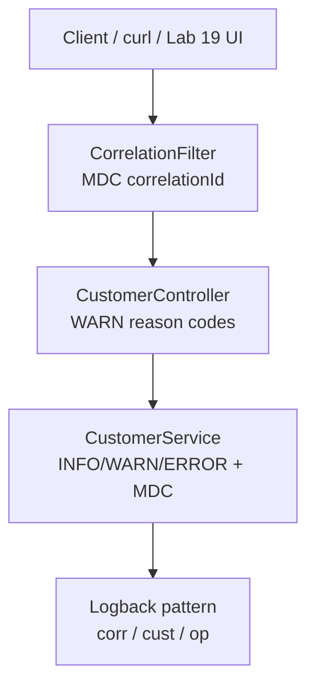

# Lab 20: Structured Logging — Northstar CRM Traceable Operations

> **Participants:** Module sequence is in [`../README.md`](../README.md). **Do not start this guide until** you have finished Module 20 [pre-lab exercises 1–6](../exercises/EXERCISES-INDEX.md) (Pass in your notes; order **1 → 2 → 3 → 4 → 5 → 6**). Then open **one** OS how-to ([Windows](LAB-20-WINDOWS.md) · [macOS](LAB-20-MACOS.md)). In class, prefer the **45-minute timed path** with [`starter/`](starter/README.md); the **full path** is every Step below (homework / extended). Skip `solution/` unless your instructor says otherwise. See [Which file do I open?](../../../_PARTICIPANT-FILE-GUIDE.md).

## Activity card

| | |
| --- | --- |
| **Objective** | Ship Logback structured pattern + CorrelationFilter MDC + PII-free service logs |
| **Skills practiced** | SLF4J/Logback, MDC put/clear, safe INFO lines, logging IT asserts |
| **Expected outcome** | Green `CustomerLoggingIT` · corr/cust/op in logs · no Amina/email PII |
| **Estimated time** | Timed path ~45 min · Full path 3–4 hours |
| **Prerequisites** | Lab 0 · Lab 19 preferred · Exercises 1–6 Pass · JDK 21 · Maven 3.9+ |
| **Expected files** | `examples/lab20-crm/` — logback-spring.xml, filter, service logs, IT, docs |
| **Validation checkpoints** | Starter smoke `CustomerLoggingIT` · GUIDE Implementation Checkpoints |

**Module:** 20 — Structured Logging  
**Duration:** ~45 minutes (timed path with starter) · Full path: 3–4 Hours

**Primary IDE:** IntelliJ IDEA Community Edition · **Optional IDE:** VS Code

| OS | How-to for this lab |
| -- | ------------------- |
| Windows | [LAB-20-WINDOWS.md](LAB-20-WINDOWS.md) |
| macOS | [LAB-20-MACOS.md](LAB-20-MACOS.md) |

> **Incremental build:** Levels → safe logs → MDC lifecycle/clear → PII checklist → Lab 20.

> **Classroom pacing:** [`../PACING.md`](../PACING.md) (Checkpoints A–E).

> **Critical scope:** MDC **clear in finally**. Never log **fullName/email**. Pattern includes **%X{corr}/%X{cust}/%X{op}**. Actuator/metrics are **Lab 21**.

## 45-minute timed path (use starter)

In class, use the starter templates so the **core** objectives fit **~45 minutes**. The full Steps below remain for homework / extended depth.

1. Open [`starter/README.md`](starter/README.md).
2. Copy `starter/` into your `java-bootcamp/examples/lab20-crm/` target (see starter README).
3. Fill every `// TODO` — do **not** wait on a perfect prior lab; the starter includes a baseline.
4. Run the starter smoke test; evidence under `notes/screenshots/lab-20/`.
5. Mark timed-path Pass criteria in the starter README. Continue remaining GUIDE steps as homework if needed.

| Path | Time | Scope |
| ---- | ---- | ----- |
| **Timed (default)** | ~45 min | Starter TODOs + smoke test |
| **Full (extended)** | see Duration | Every Step in this GUIDE |


## What you'll submit (read this first)

Keep this checklist visible while you work.

| # | Deliverable |
| - | ----------- |
| 1 | `logback-spring.xml` (or equivalent) structured pattern |
| 2 | `CorrelationFilter` with MDC lifecycle |
| 3 | CustomerService/controller logging without PII |
| 4 | Automated `CustomerLoggingIT` output |
| 5 | Successful-path evidence (`CUS-1001` / `CUS-1002` / `lab-request-001`) |
| 6 | Controlled-failure evidence (WARN/ERROR samples) |
| 7 | `docs/logging.md` contract |
| 8 | Run and cleanup instructions |

**Must submit:** the items in the table above (sources + evidence + short notes).

**Do not submit:** `target/`, `node_modules/`, secrets, heap dumps, or a verbatim instructor `solution/`.

## Lab Overview

This Module 20 lab extends the **Customer Management Platform** with **SLF4J** and **Logback** structured logging for customer operations. You introduce correlation IDs, consistent message patterns, and safe field selection so support can trace create/get flows without logging personally identifiable information (PII).

## Learning Objectives

After completing this lab, you will be able to:

* Add SLF4J API usage and Logback as the binding in a Maven CRM module
* Configure console (and optional file) appenders with a structured pattern layout
* Propagate correlation IDs via MDC across controller and service calls
* Log customer operations using stable IDs (`CUS-1001`) without names, emails, or phones
* Distinguish INFO vs WARN vs ERROR for CRM create/get and validation failures

## Business Scenario

The CRM stores customer identity, contact details, lifecycle status, and financial accounts. Support escalations fail when logs say “error creating customer” with no correlation and when “helpful” logs dump Amina’s email into Splunk.

Leadership freezes:

**Structured logs with MDC correlation and customer IDs. No PII in logs. Clear MDC after every request.**

Use these examples consistently:

| ID | Name | Notes |
| -- | ---- | ----- |
| `CUS-1001` | Amina Khan | `ACTIVE` — create/get INFO traces (ID only in logs) |
| `CUS-1002` | Ravi Singh | `PROSPECT` — second customer + validation WARN demos |
| `lab-request-001` | — | `X-Correlation-Id` / MDC `correlationId` |
| ISO-8601 UTC | — | prefer ISO timestamps in pattern |

**PII rule for this lab.** You may store full names in the domain model for CRM functionality, but **never** write full name, email, phone, address, passwords, tokens, or PAN into log messages or MDC.

**Security note for evidence.** Sanitize pasted log excerpts. Prefer committing patterns and contracts—not production dumps.

---

## Architecture Context
### NOW (this lab)


```mermaid
flowchart TB
  Client["Client / curl / Lab 19 UI"] --> CF["CorrelationFilter<br/>MDC correlationId"]
  CF --> Ctrl["CustomerController<br/>WARN reason codes"]
  Ctrl --> Svc["CustomerService<br/>INFO/WARN/ERROR + MDC"]
  Svc --> Log["Logback pattern<br/>corr / cust / op"]
```

## Prerequisites

Prior labs: [18](../../module-18/lab18/LAB-18-GUIDE.md) · [19](../../module-19/lab19/LAB-19-GUIDE.md).

Confirm (Lab 0 tools assumed):

* JDK 21; Maven; Git
* Existing CRM customer create/get endpoints from Lab 19
* SLF4J/Logback via Spring Boot starters or explicit dependencies
* No secrets committed to Git

### Pre-flight

```bash
java -version
mvn -version
```

## Worked example (read before you code)

Study this pattern once before Step 1. Your job is to apply the same idea in the Steps — do not skip ahead to a full solution.

```bash
mvn spring-boot:run

curl -s -D - -H "X-Correlation-Id: lab-request-001" \
  -H "Content-Type: application/json" \
  -d '{"customerId":"CUS-1001","fullName":"Amina Khan","status":"ACTIVE"}' \
  http://localhost:8080/api/customers

curl -s -H "X-Correlation-Id: lab-request-001" \
  http://localhost:8080/api/customers/CUS-1001

curl -s -H "X-Correlation-Id: lab-request-001" \
  -H "Content-Type: application/json" \
  -d '{"customerId":"CUS-1002","fullName":"Ravi Singh","status":"PROSPECT"}' \
  http://localhost:8080/api/customers
```

**What to notice:** Match names, IDs, and failure behavior from the scenario — graders check these.

---

## Implementation Steps

Complete each step in order. Commands assume `~/java-bootcamp/examples/lab20-crm` (Windows: `%USERPROFILE%\java-bootcamp\examples\lab20-crm`) unless noted.

---

### Step 1 — Branch Lab 19 and confirm SLF4J / Logback

**Why:** Competing logging frameworks and leftover `System.out` make “structure” impossible to enforce.

**Do this:**

```bash
cd ~/java-bootcamp/examples
cp -r lab19-crm lab20-crm
cd lab20-crm
mkdir -p docs
mkdir -p ~/java-bootcamp/notes/screenshots/lab-20 \
  src/main/java/com/northstar/crm/logging \
  src/test/java/com/northstar/crm/logging
```

`spring-boot-starter-web` already brings Logback; keep one binding. In code, import only `org.slf4j.Logger` / `LoggerFactory`—not `java.util.logging` for CRM services.

```bash
mvn -q dependency:tree | grep -iE "logback|slf4j" || mvn -q dependency:tree | findstr /i "logback slf4j"
```

**Expected result:** `logback-classic` and `slf4j-api` present; `BUILD SUCCESS`.

**If it fails:** Hard `log4j` / JUL bridge conflict → exclude competing bindings; follow Boot logging docs. Pure non-Boot module → add `spring-boot-starter` or explicit Logback deps.

---

### Step 2 — Configure a structured Logback pattern

**Why:** Without a shared pattern, MDC keys exist in code but never appear in operator-visible lines.

**Do this:** Create `src/main/resources/logback-spring.xml`:

```xml
<configuration>
  <appender name="CONSOLE" class="ch.qos.logback.core.ConsoleAppender">
    <encoder>
      <pattern>%d{ISO8601} %-5level [%thread] %logger{36} corr=%X{correlationId} cust=%X{customerId} op=%X{op} - %msg%n</pattern>
    </encoder>
  </appender>
  <logger name="com.northstar.crm" level="INFO"/>
  <root level="INFO">
    <appender-ref ref="CONSOLE"/>
  </root>
</configuration>
```

JSON encoding is optional bonus; key=value / `%X{...}` is enough for this lab. Avoid committing a conflicting plain `logback.xml` that overrides Boot’s Spring-aware config accidentally.

**Expected result:** App starts; CRM logger lines include `corr=` / `cust=` / `op=` placeholders when MDC is empty or filled.

**If it fails:** Pattern ignored → check for competing `logback.xml`. No MDC keys ever → filter not registered yet (Step 3). Too noisy third-party DEBUG → keep root INFO; raise only `com.northstar.crm` as needed.

---

### Step 3 — Add `CorrelationFilter` / interceptor

**Why:** Correlation must enter MDC once per request and always leave—leaks across Tomcat threads corrupt the next tenant’s traces.

**Do this:** Create `CorrelationFilter.java`:

```java
@Component
public class CorrelationFilter extends OncePerRequestFilter {
  public static final String HEADER = "X-Correlation-Id";
  public static final String MDC_KEY = "correlationId";

  @Override
  protected void doFilterInternal(HttpServletRequest req, HttpServletResponse res,
                                  FilterChain chain) throws ServletException, IOException {
    String cid = req.getHeader(HEADER);
    if (cid == null || cid.isBlank()) cid = "lab-request-001";
    MDC.put(MDC_KEY, cid);
    res.setHeader(HEADER, cid);
    try {
      chain.doFilter(req, res);
    } finally {
      MDC.clear();
    }
  }
}
```

Never put Authorization headers or raw request bodies into MDC.

**Expected result:**

```bash
curl -H "X-Correlation-Id: lab-request-001" http://localhost:8080/api/customers/CUS-1001
```

Response header echoes correlation; log lines show `corr=lab-request-001` for that request.

**If it fails:** Filter not invoked → ensure `@Component` under component scan / Boot app package. MDC empty in service → clear happening too early, or async thread without context copy. Header never returned → set on response before/during filter as shown.

---

### Step 4 — Instrument `CustomerService` create/get

**Why:** Service-layer ops are what support searches; logs must carry IDs and outcomes—not Amina’s phone.

**Do this:** Replace `System.out` with SLF4J. Set MDC `customerId` and `op` around the operation:

```java
private static final Logger log = LoggerFactory.getLogger(CustomerService.class);

public Customer create(Customer input) {
  MDC.put("customerId", input.customerId());
  MDC.put("op", "customer.create");
  try {
    log.info("Creating customer");
    Customer saved = repository.save(input);
    log.info("Customer created status={}", saved.status());
    return saved;
  } catch (DuplicateCustomerException e) {
    log.warn("Create rejected reason=duplicate");
    throw e;
  } catch (Exception e) {
    log.error("Create failed", e);
    throw e;
  } finally {
    MDC.remove("customerId");
    MDC.remove("op");
  }
}

public Optional<Customer> findById(String id) {
  MDC.put("customerId", id);
  MDC.put("op", "customer.get");
  try {
    log.info("Loading customer");
    return repository.findById(id);
  } finally {
    MDC.remove("customerId");
    MDC.remove("op");
  }
}
```

Adapt to your method names. Prefer removing op/customerId keys rather than calling `MDC.clear()` in the service if the filter owns full clear—either way, document ownership so keys do not leak *and* correlation is not wiped mid-request incorrectly. Common pattern: filter clears all in `finally`; service only puts/removes op-scoped keys.

**Expected result:** Creating `CUS-1001` yields lines with `corr=lab-request-001 cust=CUS-1001 op=customer.create` and **no** “Amina” or email.

**If it fails:** PII still appears → search for string concat of `fullName`/`email` and delete. `op` blank → MDC put after early return. Stack traces with payloads → avoid logging request bodies in ERROR helpers.

---

### Step 5 — Log controller validation boundaries

**Why:** Rejecting bad input without a WARN reason code forces operators into HTTP-only forensics.

**Do this:** At the API edge, log rejection at WARN with reason codes (`missing_status`, `invalid_id`, `missing_full_name`), not the full invalid payload if it might contain free-text PII:

```java
if (body.fullName() == null || body.fullName().isBlank()) {
  log.warn("Rejecting create reason=missing_full_name customerId={}", body.customerId());
  return ResponseEntity.badRequest().build();
}
```

Logging `customerId` is allowed; logging `fullName` is not for this CRM lab standard.

**Expected result:** POST with blank name → 400; WARN line includes `reason=missing_full_name` and correlation; request body not echoed into logs.

**If it fails:** 400 without WARN → add log before return. WARN includes name → remove it. Controller logs every successful body → too chatty/PII-risky; keep INFO thin.

---

### Step 6 — Exercise `CUS-1001` and `CUS-1002` traces

**Why:** Pattern configuration without exercised paths does not prove searchability for support.

**Do this:** Run the app and issue create/get for both lab customers. Save a sanitized excerpt into `notes/`:

```bash
mvn spring-boot:run

curl -s -D - -H "X-Correlation-Id: lab-request-001" \
  -H "Content-Type: application/json" \
  -d '{"customerId":"CUS-1001","fullName":"Amina Khan","status":"ACTIVE"}' \
  http://localhost:8080/api/customers

curl -s -H "X-Correlation-Id: lab-request-001" \
  http://localhost:8080/api/customers/CUS-1001

curl -s -H "X-Correlation-Id: lab-request-001" \
  -H "Content-Type: application/json" \
  -d '{"customerId":"CUS-1002","fullName":"Ravi Singh","status":"PROSPECT"}' \
  http://localhost:8080/api/customers
```

**Expected result:** Requests succeed (or duplicate create is explained); logs show `corr=lab-request-001` for both; ops `customer.create` / `customer.get` with `cust=CUS-1001` and `cust=CUS-1002`.

**If it fails:** Correlation missing on get-only → filter not applied to that path. Duplicate unexplained → add WARN `reason=duplicate`. Accidental PII in excerpt → scrub before committing notes.

---

### Step 7 — Automated logging assertion test

**Why:** PII rules that exist only in README regress silently; IT makes “no Amina in logs” enforceable.

**Do this:** Create `CustomerLoggingIT.java` using Logback `ListAppender` or Spring’s `OutputCaptureExtension`:

```java
@SpringBootTest(webEnvironment = RANDOM_PORT)
@ExtendWith(OutputCaptureExtension.class)
class CustomerLoggingIT {
  @Test
  void createLogsIdsNotPii(CapturedOutput output) {
    // POST CUS-1001 with X-Correlation-Id: lab-request-001
    assertThat(output.getOut()).contains("CUS-1001");
    assertThat(output.getOut()).contains("lab-request-001");
    assertThat(output.getOut()).contains("customer.create");
    assertThat(output.getOut()).doesNotContain("Amina");
  }
}
```

Also assert no `@example.com` email if your create would otherwise log it.

```bash
mvn -q -Dtest=CustomerLoggingIT test
```

**Expected result:** `createLogsIdsNotPii` PASS; BUILD SUCCESS.

**If it fails:** Output capture empty → logging goes to a file appender only; assert against console or attach ListAppender to `com.northstar.crm`. “Amina” found → remove message inclusions; check exception messages. Flaky → isolate MDC and avoid parallel pollution.

---

### Step 8 — Document logging contract + failure experiments

**Why:** The next engineer and Lab 21 need an explicit contract, not archaeology of patterns.

**Do this:** Write `docs/logging.md`:

```markdown
## Logging contract

- Required MDC: correlationId, customerId (when known), op
- Allowed: customerId, status, reason codes, durations, HTTP status
- Forbidden: fullName, email, phone, address, passwords, tokens, PAN
- Correlation header: X-Correlation-Id (example lab-request-001)
- Levels: INFO success path; WARN business reject; ERROR unexpected
- Production: ship to central store; never embed secrets in patterns
```

Complete Failure Experiments. Capture sanitized excerpts. Run `mvn -q test` twice.

**Expected result:** Docs match observed console; forbidden list reviewed against Step 4–6 samples; experiments recorded; suite deterministic.

**If it fails:** Docs claim JSON but only pattern layout exists → fix docs. Forbidden list incomplete vs actual WARN lines → update either code or docs until they match.

---

## Implementation Checkpoints

### Checkpoint A — Tooling and pattern

_Mark **Pass** or **Fail** in your lab notes._

| # | Confirm | Your notes |
| - | ------- | ---------- |
| 1 | `lab20-crm` under `~/java-bootcamp/examples/` | Pass / Fail |
| 2 | SLF4J + Logback on classpath (single binding) | Pass / Fail |
| 3 | `logback-spring.xml` includes corr/cust/op | Pass / Fail |

### Checkpoint B — Correlation and service logs

_Mark **Pass** or **Fail** in your lab notes._

| # | Confirm | Your notes |
| - | ------- | ---------- |
| 1 | `CorrelationFilter` sets MDC and clears in `finally` | Pass / Fail |
| 2 | Service create/get use SLF4J with ID/op MDC | Pass / Fail |
| 3 | No PII in sampled INFO lines | Pass / Fail |

### Checkpoint C — Validation + automated proof

_Mark **Pass** or **Fail** in your lab notes._

| # | Confirm | Your notes |
| - | ------- | ---------- |
| 1 | Controller WARN reason codes without payload dump | Pass / Fail |
| 2 | Manual traces for `CUS-1001` / `CUS-1002` | Pass / Fail |
| 3 | `CustomerLoggingIT` asserts IDs present and “Amina” absent | Pass / Fail |

### Checkpoint D — Hygiene

_Mark **Pass** or **Fail** in your lab notes._

| # | Confirm | Your notes |
| - | ------- | ---------- |
| 1 | `docs/logging.md` contract complete | Pass / Fail |
| 2 | Two consecutive green test runs | Pass / Fail |
| 3 | No secrets / raw PII dumps committed | Pass / Fail |

---

## Reference Commands, Configuration, and Code

### Logback pattern

```xml
<pattern>%d{ISO8601} %-5level [%thread] %logger{36} corr=%X{correlationId} cust=%X{customerId} op=%X{op} - %msg%n</pattern>
```

### Commands

```bash
cd ~/java-bootcamp/examples/lab20-crm
mvn spring-boot:run
curl -H "X-Correlation-Id: lab-request-001" http://localhost:8080/api/customers/CUS-1001
mvn -q -Dtest=CustomerLoggingIT test
mvn -q clean verify
git status
```

### Safe log line sample

```text
2026-07-14T13:00:00.000Z INFO  [...] CustomerService corr=lab-request-001 cust=CUS-1001 op=customer.create - Customer created status=ACTIVE
```

### Forbidden-field grep (local hygiene)

After exercising create/get, run a quick local search over your sanitized evidence file (adjust path):

```bash
# Prefer failing the lab evidence if these match:
grep -nE "Amina|Ravi|@example\\.com|password|Bearer " notes/log-excerpt.txt || echo "PII grep clean"
```

Do **not** commit unsanitized consoles. If grep hits, scrub the excerpt and fix the logger call sites.

## Failure Experiments

| # | Experiment | Observe | Restore |
| - | ---------- | ------- | ------- |
| 1 | Break repository so create throws | ERROR log; status; stack has no secrets | Restore repo |
| 2 | POST missing full name | WARN reason code; no PII | Keep as permanent path |
| 3 | Repeat create `CUS-1001` | Duplicate logging; new correlation per request | Document uniqueness |
| 4 | Add duration log at INFO/DEBUG | Duration present; payload absent | Keep duration field |
| 5 | Omit `MDC.clear()` temporarily | Next request shows leaked corr/cust | Restore finally clear |

---

## Troubleshooting

| Symptom | Likely cause | Fix |
| ------- | ------------ | --- |
| Pattern ignored | Competing `logback.xml` | Prefer `logback-spring.xml`; remove conflict |
| MDC empty | Filter not scanned | Check package under `@SpringBootApplication` |
| MDC leak | Missing finally clear | Always clear; no static correlation fields |
| PII in ERROR | Logging exception with entity toString | Log IDs/reason only |
| IT sees no output | File-only appender | Assert console or ListAppender |
| Too verbose | Root DEBUG | Root INFO; package INFO |
| Cannot connect | App down / port | Check `spring-boot:run` and 8080 |
| “Amina” or email in IT output | Unsafe log still present | Rewrite to customerId only; re-run IT |

## Security and Production Review

Optional — jot brief notes in your README if useful for the rubric (not a separate essay):

1. Which browser, network, or API inputs are untrusted?
2. Where are authn/authz/validation enforced (logs do not replace them)?
3. Which values are sensitive—forbidden in logs/MDC?

---


## Cleanup

```bash
cd ~/java-bootcamp/examples/lab20-crm
# Stop Spring Boot
# Delete local ./logs if you added a file appender
mvn -q clean
git status
```

**Keep `lab20-crm`**—Lab 21 adds Actuator/Micrometer beside these structured logs.

Preserve Lab 19 IT/UI suites when practical; logging changes should not require fixture ID rewrites.

---

## Evaluation Rubric (100 Marks)

| Criteria | Marks |
| -------- | ----: |
| Environment and project structure | 10 |
| Core implementation (filter, MDC, service logs) | 30 |
| Integration/configuration correctness (Logback pattern) | 15 |
| Failure handling (WARN/ERROR without PII) | 15 |
| Automated verification | 10 |
| Security and production awareness (no PII) | 10 |
| Documentation and evidence | 10 |

**Notes:** Any committed log sample containing full names, emails, phones, or tokens → heavy security deduction. MDC without finally clear → failure-handling deduction. Log4j2 equivalent OK only if outcomes/docs match.

---

## Reflection Questions

Write **1–3 sentence** answers (not essays):

1. Which design decision most affected correctness (filter-owned MDC vs service-owned)?
2. What evidence proves support can search a request?
3. Which failure was hardest to diagnose?

---


