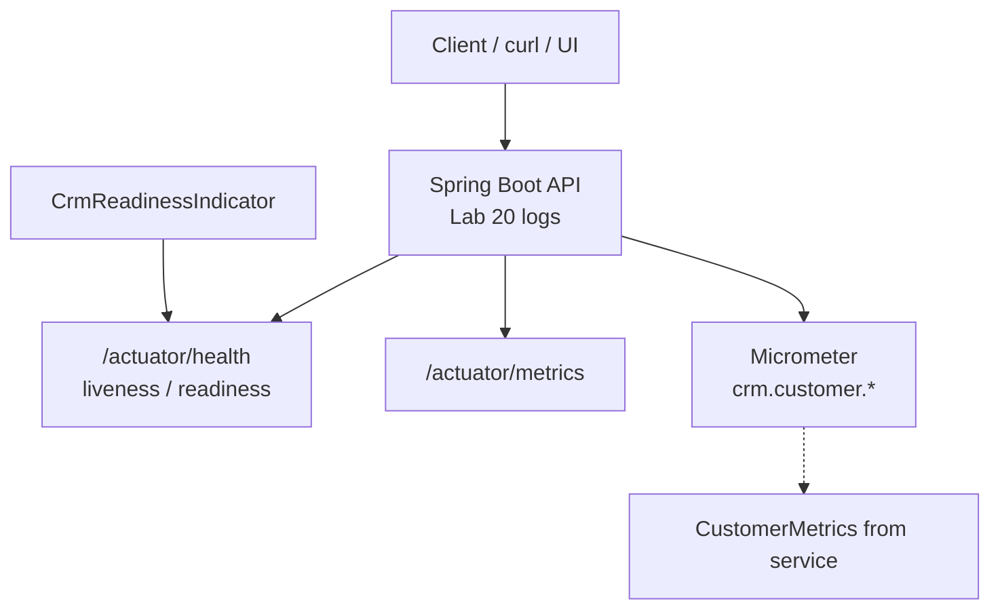
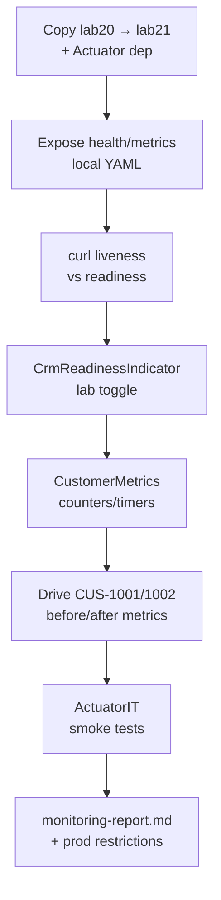

# Lab 21: Observability and Monitoring — Northstar CRM Actuator & Metrics

**Module:** 21 — Observability and Monitoring  
**Lab folder:** `labs/Week 2 - Backend, AI Tools and Testing/module-21/lab21/`  
**Difficulty:** Intermediate  
**Duration:** 3–4 Hours

**Primary IDE:** IntelliJ IDEA Community Edition · **Optional IDE:** VS Code

| OS | How-to for this lab |
| -- | ------------------- |
| Windows | [LAB-21-WINDOWS.md](LAB-21-WINDOWS.md) |
| macOS | [LAB-21-MACOS.md](LAB-21-MACOS.md) |

> **Environment reminder:** Finish [Lab 0](../../../Week%201%20-%20Java%20and%20JVM%20Foundations/module-00/lab0/LAB-0-GUIDE.md). Use **IntelliJ IDEA Community** (primary; optional VS Code) on your laptop with **JDK 21** and **Maven 3.9+**. Work under `~/java-bootcamp` (Windows: `%USERPROFILE%\java-bootcamp`).

---

## How to follow this lab

1. Open the **Windows** or **macOS** how-to (links above) in a second tab.
2. Create/work only under your `java-bootcamp/examples/…` folder from the steps (not inside this `labs/` git clone unless a step says otherwise).
3. For each **Step N**: read **Why** (if present) → do the actions → confirm **Expected** / **Expected result** → then continue.
4. When stuck, use **Failure Experiments** / troubleshooting in this guide before asking for help.
5. Capture evidence under `notes/screenshots/lab-21/` (workspace root under `java-bootcamp`; redact secrets). Use the **Pass criteria** tables — write **Pass** or **Fail** in your notes. GitHub file view does not support clickable checkboxes.

## Lab Overview

This Module 21 lab extends the **Customer Management Platform** with **Spring Boot Actuator** health and **Micrometer** metrics. You expose health endpoints, separate **readiness** from **liveness**, and add counters/timers for CRM create/get so operators can see whether the service is alive, ready for traffic, and processing customer operations.

**Purpose.** Structured logs (Lab 20) explain individual requests; operators also need aggregates and probe semantics. Leadership freezes: liveness ≠ readiness; create/get metrics move when `CUS-1001` / `CUS-1002` traffic runs; **never** tag metrics with customer names or correlation IDs (cardinality); local Actuator exposure is **not** a production recommendation.

**What you build (exercise).** Copy to `lab21-crm`; add Actuator; configure health/metrics exposure for local lab; curl liveness/readiness; add `CrmReadinessIndicator` with a lab-only toggle; register `CustomerMetrics`; drive traffic with `lab-request-001`; automate `ActuatorIT`; write `docs/monitoring-report.md`.

**What success looks like.** Under `~/java-bootcamp/examples/lab21-crm/` readiness can go OUT_OF_SERVICE while liveness stays UP; create success counters increase after POST; monitoring report lists metrics, alert idea, and production exposure restrictions.

**Depends on Lab 20.** Structured logging strongly recommended so the same traffic shows `corr=lab-request-001` in logs while metrics stay aggregate-only. Create/get API from Lab 19 required.

**CRM connection.** Fixtures `CUS-1001` / `CUS-1002`, correlation `lab-request-001` in HTTP/logs. Metrics use operation/result tags only. Lab 22 will rewire collaborators via Spring IoC—keep metric hooks injectable.

---

## Learning Objectives

After completing this lab, you will be able to:

* Add `spring-boot-starter-actuator` to a CRM Spring Boot application
* Expose and verify `/actuator/health` (and related endpoints) locally
* Explain readiness versus liveness and when each should fail
* Configure health groups or indicators relevant to CRM dependencies
* Register Micrometer counters/timers for customer create and get
* Observe metric changes after CRM API calls with correlation `lab-request-001`
* Avoid high-cardinality tags (`customerId`, names, correlation) on metrics
* Produce a short monitoring report for support handoff
* Identify which Actuator endpoints must not be public in production

---

## Business Scenario

The CRM stores customer identity, contact details, lifecycle status, and financial accounts. Without probes, orchestrators restart healthy-but-warming instances incorrectly—or keep routing traffic to instances that cannot reach persistence.

Leadership freezes:

**Actuator health with distinct readiness and liveness. Micrometer create/get metrics with low-cardinality tags. Unrestricted public Actuator is unacceptable for production narratives.**

Use these examples consistently:

| ID | Name | Notes |
| -- | ---- | ----- |
| `CUS-1001` | Amina Khan | `ACTIVE` — traffic that moves create/get metrics |
| `CUS-1002` | Ravi Singh | `PROSPECT` — second create; failure-counter demos |
| `lab-request-001` | — | correlation in HTTP/logs (not metric tags) |
| ISO-8601 UTC | — | evidence timestamps |

**Security note for evidence.** Local lab may expose `health,info,metrics`. Document production hardening (auth, firewall, allow-list). Never expose secrets via `/actuator/env` in submitted configs.

---

## Architecture Context

### NOW (this lab)



### Lab flow (mermaid)



### Architecture NOW vs LATER

| Aspect | Lab 20 (was) | Lab 21 (NOW) | Lab 22 / prod |
| ------ | ------------ | ------------ | ------------- |
| Signal | Per-request logs | Probes + aggregates | Bean graph + tighter Actuator security |
| Correlation | MDC / header | Logs only (not tags) | Same discipline |
| Failure mode | WARN/ERROR lines | Readiness DOWN vs process dead | LB drain vs restart |

**Lab focus:** Spring Boot Actuator health/metrics; readiness ≠ liveness; sample metrics for CRM create/get.

---

## Prerequisites

Complete [SETUP](../../../SETUP-INSTRUCTIONS.md), [Lab 0](../../../Week%201%20-%20Java%20and%20JVM%20Foundations/module-00/lab0/LAB-0-GUIDE.md), and Labs [19](../../module-19/lab19/LAB-19-GUIDE.md)–[20](../../module-20/lab20/LAB-20-GUIDE.md). Confirm:

* JDK 21; Maven; Git
* Spring Boot 3.x CRM module with customer create/get
* Structured logging from Lab 20 strongly recommended
* No secrets committed to Git

### Pre-flight

```bash
java -version
mvn -version
git --version
pwd
ls ~/java-bootcamp/examples
```

---

## Suggested Project Files

```text
~/java-bootcamp/examples/lab21-crm/
├── src/
│   ├── main/
│   │   ├── java/com/northstar/crm/
│   │   │   ├── api/CustomerController.java
│   │   │   ├── service/CustomerService.java
│   │   │   ├── metrics/CustomerMetrics.java
│   │   │   └── health/CrmReadinessIndicator.java
│   │   └── resources/
│   │       ├── application.yml
│   │       └── logback-spring.xml
│   └── test/
│       └── java/com/northstar/crm/
│           └── actuator/ActuatorIT.java
├── docs/
│   └── monitoring-report.md
├── notes/screenshots/
├── pom.xml
├── .gitignore
└── README.md
```

Ignore build output, tokens, and passwords.

---

## Concepts to Discuss

Write 2–3 sentences each in `docs/monitoring-report.md` (concepts subsection):

1. Main flow: traffic → service → metrics registry → Actuator scrape
2. Trust boundary: which Actuator endpoints are sensitive
3. Success/failure contracts: UP vs OUT_OF_SERVICE vs DOWN
4. Stable aggregate tags (`operation`, `result`) vs high-cardinality IDs
5. Idempotent GET vs create counter growth semantics
6. Local exposure vs production allow-list / auth
7. Evidence: before/after metric JSON + log correlation
8. Two instances: each has its own counters; LB uses readiness
9. Why readiness down should not always restart the process
10. What Lab 22 changes (DI wiring) without renaming metric names

---

## Implementation Steps

Complete each step in order. Commands assume `~/java-bootcamp/examples/lab21-crm` (Windows: `%USERPROFILE%\java-bootcamp\examples\lab21-crm`) unless noted.

---

### Step 1 — Branch Lab 20 and add Actuator

**Why:** Health and metrics must come from the Boot-managed Actuator stack, not ad-hoc `/health` controllers that diverge from ops standards.

**Do this:**

```bash
cd ~/java-bootcamp/examples
cp -r lab20-crm lab21-crm
cd lab21-crm
mkdir -p docs
mkdir -p ~/java-bootcamp/notes/screenshots/lab-21 \
  src/main/java/com/northstar/crm/metrics \
  src/main/java/com/northstar/crm/health \
  src/test/java/com/northstar/crm/actuator
```

Add (BOM-managed version via Boot parent—do not invent mismatched versions):

```xml
<dependency>
  <groupId>org.springframework.boot</groupId>
  <artifactId>spring-boot-starter-actuator</artifactId>
</dependency>
```

```bash
mvn -q dependency:tree | grep -i actuator || mvn -q dependency:tree | findstr /i actuator
```

**Expected result:** `spring-boot-actuator-autoconfigure` present; BUILD SUCCESS.

**If it fails:** Parent mismatch → align Boot parent version. Optional Prometheus registry missing until you add `micrometer-registry-prometheus` (bonus).

---

### Step 2 — Configure health and metrics exposure (local lab)

**Why:** Default exposure is conservative; students must deliberately configure local visibility **and** document that production must tighten it.

**Do this:** Update `application.yml`:

```yaml
management:
  endpoints:
    web:
      exposure:
        include: health,info,metrics,prometheus
  endpoint:
    health:
      show-details: always
      probes:
        enabled: true
  metrics:
    tags:
      application: northstar-crm

server:
  port: 8080
```

Separate management port is optional; if used, record it in README. Mark unrestricted exposure as **lab-only**.

**Expected result:** App starts on 8080; `/actuator` discovery (if enabled) lists health and metrics.

**If it fails:** YAML indentation wrong → endpoints stay closed. Spelling `exposure.include` → fix exactly. Restart required after YAML changes.

---

### Step 3 — Verify liveness and readiness semantics

**Why:** Confusing “process up” with “safe for traffic” causes wrong orchestrator actions—restart vs remove-from-LB.

**Do this:**

```bash
mvn spring-boot:run

curl -s http://localhost:8080/actuator/health
curl -s http://localhost:8080/actuator/health/liveness
curl -s http://localhost:8080/actuator/health/readiness
```

Write two or three sentences in `docs/monitoring-report.md` distinguishing: a live-but-not-ready app (schema migration still running) versus a dead process.

**Expected result:** Overall health UP (or UP with components); `/liveness` UP; `/readiness` UP when app accepts CRM traffic; notes explain LB vs restart behavior.

**If it fails:** 404 on probe paths → enable `management.endpoint.health.probes.enabled=true` (Boot 2.3+/3.x). Older Boot → use health groups; document equivalent.

---

### Step 4 — Add `CrmReadinessIndicator` (readiness ≠ liveness)

**Why:** Students must prove readiness can fail independently—otherwise “readiness” is vocabulary only.

**Do this:** Create `CrmReadinessIndicator.java`:

```java
@Component
public class CrmReadinessIndicator implements HealthIndicator {
  private final AtomicBoolean ready = new AtomicBoolean(true);

  public void setReady(boolean value) { ready.set(value); }

  @Override
  public Health health() {
    if (!ready.get()) {
      return Health.outOfService()
          .withDetail("crm", "not-ready")
          .withDetail("reason", "dependency-unavailable")
          .build();
    }
    return Health.up().withDetail("crm", "ready").build();
  }
}
```

Expose a **lab-only** toggle endpoint or test hook to flip readiness; mark it clearly as non-production. Prefer registering this indicator into the readiness group if your Boot version separates contributors.

**Expected result:** `ready=true` → readiness UP; `ready=false` → readiness DOWN/OUT_OF_SERVICE while liveness remains UP.

**If it fails:** Toggling flips liveness too → indicator attached to wrong group; dig into Boot health groups docs. Always UP → bean not scanned or not part of readiness aggregation.

---

### Step 5 — Register create/get Micrometer metrics

**Why:** Counters/timers without wiring never move; high-cardinality tags destroy metric backends—keep tags low-cardinality.

**Do this:** Create `CustomerMetrics.java`:

```java
@Component
public class CustomerMetrics {
  private final Counter createSuccess;
  private final Counter createFailure;
  private final Counter getSuccess;
  private final Timer createTimer;
  private final Timer getTimer;

  public CustomerMetrics(MeterRegistry registry) {
    createSuccess = registry.counter("crm.customer.create", "result", "success");
    createFailure = registry.counter("crm.customer.create", "result", "failure");
    getSuccess = registry.counter("crm.customer.get", "result", "success");
    createTimer = registry.timer("crm.customer.create.latency");
    getTimer = registry.timer("crm.customer.get.latency");
  }

  public Customer timedCreate(Supplier<Customer> action) {
    return createTimer.record(() -> {
      try {
        Customer c = action.get();
        createSuccess.increment();
        return c;
      } catch (RuntimeException e) {
        createFailure.increment();
        throw e;
      }
    });
  }
}
```

Wire from `CustomerService` for create/get. Tag by `operation`/`result` only—**do not** tag with customer names or correlation IDs. Customer IDs belong in logs (Lab 20).

**Expected result:** Metric names appear under `/actuator/metrics`; `crm.customer.create` and latency timers listed.

**If it fails:** Metrics missing → bean not constructed / service not calling wrappers. Name typo in curl path → names are exact. Ultra-high-cardinality tags if student “improves” with customerId—reject in review.

---

### Step 6 — Drive metrics with CRM traffic

**Why:** Before/after payloads are the proof operators trust—not “we registered a counter.”

**Do this:** Record baseline, then traffic with correlation header, then re-read:

```bash
curl -s http://localhost:8080/actuator/metrics/crm.customer.create

curl -s -H "X-Correlation-Id: lab-request-001" -H "Content-Type: application/json" \
  -d '{"customerId":"CUS-1001","fullName":"Amina Khan","status":"ACTIVE"}' \
  http://localhost:8080/api/customers

curl -s -H "X-Correlation-Id: lab-request-001" \
  http://localhost:8080/api/customers/CUS-1001

curl -s http://localhost:8080/actuator/metrics/crm.customer.create
curl -s http://localhost:8080/actuator/metrics/crm.customer.get.latency
```

**Expected result:** Create success count increases after POST; get latency count ≥ 1; Lab 20 logs still show `corr=lab-request-001 cust=CUS-1001`.

**If it fails:** Counter flat → wire path not hit (duplicate fail before increment placement). Latency missing → timer not recorded on get. Logs missing correlation → Lab 20 filter regression—fix logging first.

---

### Step 7 — Automate Actuator smoke tests

**Why:** Probe and metric regressions should fail CI without manual curl archaeology.

**Do this:** Create `ActuatorIT.java`:

```java
@SpringBootTest(webEnvironment = RANDOM_PORT)
class ActuatorIT {
  @Autowired TestRestTemplate rest;
  @LocalServerPort int port;

  @Test
  void healthIsUp() {
    var res = rest.getForEntity("http://localhost:" + port + "/actuator/health", Map.class);
    assertThat(res.getStatusCode().is2xxSuccessful()).isTrue();
    assertThat(res.getBody().get("status")).isEqualTo("UP");
  }

  @Test
  void createIncrementsMetric() {
    // read counter, POST CUS-1002, read again, assert delta >= 1
  }

  @Test
  void readinessCanFailIndependently() {
    // flip lab toggle / indicator; assert readiness not UP; liveness still UP; restore
  }
}
```

```bash
mvn -q -Dtest=ActuatorIT test
```

**Expected result:** health UP; createIncrementsMetric PASS; optional readiness independence test PASS; BUILD SUCCESS.

**If it fails:** Random port vs hard-coded 8080 in assertions → use `@LocalServerPort`. Metric JSON structure differs by Boot version → parse `measurements` carefully.

---

### Step 8 — Monitoring report + failure experiments

**Why:** Handoff to support needs a one-page contract for probes, metrics, alerts, and exposure.

**Do this:** Complete `docs/monitoring-report.md`:

```markdown
# CRM Monitoring Report (Lab 21)
- Health: /actuator/health, /liveness, /readiness
- Metrics: crm.customer.create{result}, crm.customer.get.latency
- Example traffic: CUS-1001, CUS-1002, corr=lab-request-001
- Alert idea: create failure ratio > 5% for 5 minutes
- Production: do not expose unrestricted Actuator on the public internet
- Cards: IDs in logs (Lab 20); aggregates in metrics (this lab)
```

Complete [Failure Experiments](#failure-experiments). Capture before/after JSON. Run tests twice.

**Expected result:** Report committed with readiness discussion + alert idea + production restrictions; experiments recorded; suite deterministic.

**If it fails:** Report recommends public Actuator “for simplicity” → rewrite as anti-pattern. Missing readiness ≠ liveness proof → repeat Step 4 evidence.

---

## Implementation Checkpoints

### Checkpoint A — Actuator tooling

_Mark each row **Pass** or **Fail** in your lab notes (GitHub markdown files are not interactive checklists)._

| # | Confirm | Your notes |
| - | ------- | ---------- |
| 1 | `lab21-crm` under `~/java-bootcamp/examples/` | Pass / Fail |
| 2 | Actuator dependency present | Pass / Fail |
| 3 | Local exposure configured with production hardening notes | Pass / Fail |

### Checkpoint B — Probes

_Mark each row **Pass** or **Fail** in your lab notes (GitHub markdown files are not interactive checklists)._

| # | Confirm | Your notes |
| - | ------- | ---------- |
| 1 | Liveness and readiness curls documented | Pass / Fail |
| 2 | `CrmReadinessIndicator` can fail readiness independently | Pass / Fail |
| 3 | Written distinction: LB drain vs process restart | Pass / Fail |

### Checkpoint C — Metrics + IT

_Mark each row **Pass** or **Fail** in your lab notes (GitHub markdown files are not interactive checklists)._

| # | Confirm | Your notes |
| - | ------- | ---------- |
| 1 | `CustomerMetrics` counters/timers wired | Pass / Fail |
| 2 | Before/after create/get evidence with `CUS-1001` | Pass / Fail |
| 3 | `ActuatorIT` green (health + increment) | Pass / Fail |

### Checkpoint D — Hygiene

_Mark each row **Pass** or **Fail** in your lab notes (GitHub markdown files are not interactive checklists)._

| # | Confirm | Your notes |
| - | ------- | ---------- |
| 1 | `monitoring-report.md` complete | Pass / Fail |
| 2 | No high-cardinality tags; no secrets in Actuator config | Pass / Fail |
| 3 | Lab-only readiness toggle marked non-production | Pass / Fail |

---

## Reference Commands, Configuration, and Code

### Management excerpt

```yaml
management:
  endpoints:
    web:
      exposure:
        include: health,info,metrics
  endpoint:
    health:
      probes:
        enabled: true
```

### Metric registration

```java
registry.counter("crm.customer.create", "result", "success").increment();
registry.timer("crm.customer.get.latency").record(duration);
```

### Commands

```bash
cd ~/java-bootcamp/examples/lab21-crm
curl -s http://localhost:8080/actuator/health
curl -s http://localhost:8080/actuator/health/liveness
curl -s http://localhost:8080/actuator/health/readiness
curl -s http://localhost:8080/actuator/metrics/crm.customer.create
mvn -q -Dtest=ActuatorIT test
mvn -q clean verify
git status
```

### Class map

| Class | Role |
| ----- | ---- |
| `CrmReadinessIndicator` | Custom readiness contribution |
| `CustomerMetrics` | Micrometer counters/timers |
| `ActuatorIT` | Health + metric smoke tests |
| `application.yml` | Exposure + probes (lab) |
| `monitoring-report.md` | Operator handoff |

### Probe decision matrix (commit to report)

| Signal | Meaning | Typical operator action |
| ------ | ------- | ----------------------- |
| Liveness DOWN | Process unhealthy / stuck | Restart pod/process |
| Readiness DOWN, liveness UP | Not safe for traffic yet | Remove from load balancer; do **not** thrash-restart |
| Both UP | Accept traffic | Keep in rotation |
| Create failure ratio rising | Business/dependency degradation | Alert; correlate with Lab 20 `corr=` logs |

### Cardinality rules (non-negotiable)

Allowed tag keys (examples): `application`, `result` (`success`/`failure`), `operation` (`create`/`get`).

Forbidden tag keys for this CRM lab: `customerId`, `fullName`, `email`, `correlationId`, free-text reason messages.

IDs and correlation stay in **logs** (Lab 20). Metrics stay **aggregates** (this lab). Mixing them “to make dashboards nicer” will fail review.

### Sample alert sketch (documentation only)

```text
Alert: CRMCreateFailureRatioHigh
Expr:  rate(crm_customer_create_failure[5m])
       / rate(crm_customer_create_total[5m]) > 0.05
For:   5m
Action: page on-call; search logs for op=customer.create level=ERROR|WARN
```

Metric name spelling in Prometheus may differ from Actuator JSON (`crm.customer.create` → `crm_customer_create_*`). Document the scrape mapping if you enable Prometheus.

---

## Manual Verification

1. Actuator dependency resolves on the classpath.
2. `/actuator/health` returns UP when the app is healthy.
3. `/liveness` and `/readiness` are reachable with probes enabled.
4. Readiness can fail while liveness stays UP (controlled experiment).
5. `crm.customer.create` appears under `/actuator/metrics`.
6. POST `CUS-1001` increases create success (or documented failure increment).
7. GET increments get latency/success metrics.
8. Logs still carry `lab-request-001` without putting it in metric tags.
9. `ActuatorIT` passes.
10. Monitoring report forbids unrestricted public Actuator in production.

---

## Failure Experiments

| # | Experiment | Observe | Restore |
| - | ---------- | ------- | ------- |
| 1 | Flip readiness off / stop DB | Readiness not UP; liveness UP; LB should drain | Restore ready flag |
| 2 | Invalid create (blank name) | Failure counter ++; logs PII-safe | Keep as permanent path |
| 3 | Repeat create/get `CUS-1001` | Counter growth vs business idempotency | Document both |
| 4 | Induce latency | Timer total/count moves | Remove artificial delay |
| 5 | Temporarily tag metric with `customerId` | Cardinality risk discussion | Remove tag before submit |

---

## Troubleshooting

| Symptom | Likely cause | Fix |
| ------- | ------------ | --- |
| 404 `/actuator/**` | Not exposed | Fix `exposure.include`; restart |
| Probes 404 | Probes disabled | `endpoint.health.probes.enabled: true` |
| Metrics missing | Bean unused / name typo | Wire service; exact metric name |
| Readiness always UP | Indicator not in group | Register health contributor correctly |
| Config ignored | Wrong profile / YAML indent | Validate YAML; active profile |
| High cardinality | ID/name tags | Use result/operation tags only |
| Cannot connect | Port / process down | Check 8080 and health first |

---

## Security and Production Review

Answer in README:

1. Which browser, network, or Actuator inputs are untrusted?
2. Where are authn/authz enforced for management endpoints in production?
3. Which values are sensitive (`/env`, secrets, PII)—never as metric tags or open Actuator fields?
4. What can be retried safely (GET health/metrics scrapes)?
5. What happens after partial failure (failure counters; readiness drain)?
6. What would an operator monitor (create failure ratio, readiness flaps)?
7. Which local default is unacceptable (public unrestricted Actuator, lab toggle left on)?
8. How are metric names versioned when services rename ops?

---

## Cleanup

```bash
cd ~/java-bootcamp/examples/lab21-crm
# Stop Spring Boot
# Remove lab-only readiness toggle endpoints before any shared deployment
mvn -q clean
git status
```

**Keep `lab21-crm`**—Lab 22 replaces remaining `new` wiring with Spring IoC across the CRM graph.

---

## Expected Deliverables

* Actuator health (liveness/readiness) evidence
* Micrometer metrics for CRM create/get
* Automated `ActuatorIT` output
* Successful-path evidence with `CUS-1001` / `CUS-1002`
* Controlled-failure evidence (readiness down / create failure counter)
* `docs/monitoring-report.md`
* Production exposure restrictions documented
* No secrets or generated build directories committed

---

## Evaluation Rubric (100 Marks)

| Criteria | Marks |
| -------- | ----: |
| Environment and project structure | 10 |
| Core implementation (indicator + metrics wiring) | 30 |
| Integration/configuration correctness (Actuator YAML) | 15 |
| Failure handling (readiness ≠ liveness; failure counters) | 15 |
| Automated verification | 10 |
| Security and production awareness (exposure) | 10 |
| Documentation and evidence | 10 |

**Notes:** Presenting unrestricted public Actuator as production-ready → honor violation. Metric tags with customer names/IDs → security/production deduction. Missing readiness independence proof → incomplete.

---

## Reflection Questions

Write 3–6 sentence answers:

1. Which design decision most affected correctness (readiness group vs single health blob)?
2. Which failure was hardest to diagnose?
3. What evidence proves create traffic is observable?
4. What breaks first at ten times the scrape rate or traffic?
5. Which concern should move to shared infrastructure (Prometheus, alertmanager, auth gateway)?
6. What must change before real customer data appears in telemetry (still no PII tags)?
7. How does this lab connect to Labs 19–20 and Lab 22?
8. What metric matters most on the ops dashboard for CRM create?
9. (Forward look) How should constructor DI (Lab 22) change how `CustomerMetrics` is wired?

---

## Bonus Challenges

1. Keep Lab 20 correlation logs aligned with metric-generating traffic.
2. IT that waits on readiness before exercising create.
3. Real `DataSource` health check contributing to readiness.
4. Prometheus scrape format + sample alert rule document.
5. Rollback/runbook when create failure rate spikes.
6. Management port separation with documented firewall story.

---

## Success Criteria

You are finished when:

* You can demonstrate Actuator health/metrics and CRM create/get counters/timers
* Readiness can fail independently of liveness in a controlled experiment
* Happy path and at least one failure path are repeatable
* Another student can follow your run and monitoring report
* Tests/build pass
* No production secret is hard-coded
* You can explain readiness vs liveness and local vs production Actuator exposure

---

## Instructor Notes

* **Live probe:** Make readiness fail while liveness stays UP; ask which operator action each implies. Require metric names for create/get and evidence tied to `CUS-1001` with correlation in companion logs.
* **Assess:** Probe semantics, low-cardinality metrics, IT quality, monitoring report honesty about exposure.
* **Continuity:** Prefer `examples/lab21-crm`. Keep fixture IDs. Lab 22 should inject `CustomerMetrics` via constructors—not static lookups.
* **Common pitfalls:** Tagging `customerId`; claiming public Actuator is fine; liveness/readiness identical forever; curling wrong metric names; leaving lab toggles undocumented.
* **Timing:** 3–4 hours. Probe group wiring often burns 30–40 minutes—demo readiness toggle early.
* **Exit interview:** Student must state in one sentence: “Readiness DOWN means remove from LB; liveness DOWN means restart,” and show the JSON bodies that proved the split.

---

*End of Lab 21 — Observability and Monitoring: Northstar CRM Actuator & Metrics. Keep `lab21-crm` for Lab 22 and portfolio evidence.*
