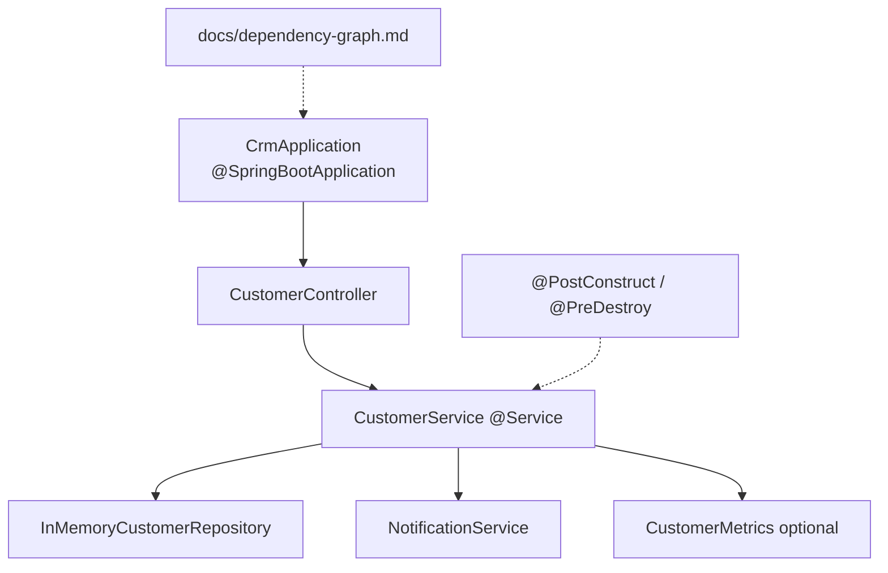
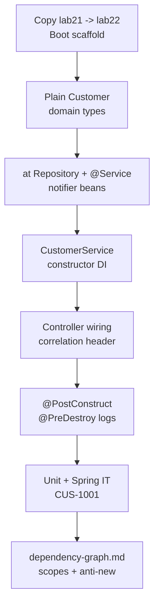

# Lab 22: Spring IoC and Dependency Injection — Northstar CRM Bean Graph

**Module:** 22 — Spring IoC and Dependency Injection  
**Lab folder:** `labs/Week 3 - Spring Framework and Enterprise Patterns/module-22/lab22/`  
**Difficulty:** Intermediate  
**Duration:** 4–5 Hours

**Primary IDE:** IntelliJ IDEA Community Edition · **Optional IDE:** VS Code

| OS | How-to for this lab |
| -- | ------------------- |
| Windows | [LAB-22-WINDOWS.md](LAB-22-WINDOWS.md) |
| macOS | [LAB-22-MACOS.md](LAB-22-MACOS.md) |

> **Environment reminder:** Finish [Lab 0](../../../Week%201%20-%20Java%20and%20JVM%20Foundations/module-00/lab0/LAB-0-GUIDE.md). Use **IntelliJ IDEA Community** (primary; optional VS Code) on your laptop with **JDK 21** and **Maven 3.9+** (Spring Boot 3.x via Maven). Work under `~/java-bootcamp` (Windows: `%USERPROFILE%\java-bootcamp`).

---

## How to follow this lab

1. Open the **Windows** or **macOS** how-to (links above) in a second tab.
2. Create/work only under your `java-bootcamp/examples/…` folder from the steps (not inside this `labs/` git clone unless a step says otherwise).
3. For each **Step N**: read **Why** (if present) → do the actions → confirm **Expected** / **Expected result** → then continue.
4. When stuck, use **Failure Experiments** / troubleshooting in this guide before asking for help.
5. Capture evidence under `notes/screenshots/lab-22/` (workspace root under `java-bootcamp`; redact secrets). Use the **Pass criteria** tables — write **Pass** or **Fail** in your notes. GitHub file view does not support clickable checkboxes.

## Lab Overview

This Module 22 lab extends the **Customer Management Platform** by replacing manual `new` wiring with **Spring Inversion of Control (IoC)** and **dependency injection**. You model CRM collaborators as Spring beans, prefer **constructor injection**, apply stereotype annotations, observe bean lifecycle callbacks on `CustomerService`, and document `docs/dependency-graph.md`.

**Purpose.** Prior labs may still construct repositories/services with `new` in places. Leadership freezes: application components are Spring beans; `CustomerService` receives collaborators through a single constructor with `final` fields; no field-`@Autowired` as primary pattern; no `new` of Spring-managed collaborators inside services; graph documented for review.

**What you build (exercise).** Copy to `lab22-crm`; ensure Boot scaffold/`CrmApplication`; keep domain types plain; declare `@Repository` / `@Service` beans; refactor `CustomerService` to constructor DI; wire `@RestController`; add `@PostConstruct`/`@PreDestroy`; prove unit test with fakes **and** `@SpringBootTest` IT; write dependency graph.

**What success looks like.** Under `~/java-bootcamp/examples/lab22-crm/` the app starts without missing-bean errors; POST/GET `CUS-1001` works with correlation `lab-request-001`; pure unit test constructs service without Spring; `dependency-graph.md` matches constructors; init/destroy logs appear once per context.

**Depends on Lab 21.** Prefer keeping Actuator/logging; IoC should inject `CustomerMetrics` / services rather than static access. Create/get API from earlier labs required.

**CRM connection.** Fixtures `CUS-1001` / `CUS-1002`, correlation `lab-request-001`. Graph documentation must name these IDs in examples so Labs 19–21 evidence stays continuous.

---

## Learning Objectives

After completing this lab, you will be able to:

* Explain IoC versus dependency lookup and why CRM services should not call `new` on collaborators
* Create a Spring application context that scans CRM packages
* Declare `@Component`, `@Service`, and `@Repository` beans for the customer domain
* Prefer constructor injection for `CustomerService` dependencies
* Replace field/`new` coupling with injected `CustomerRepository` and `NotificationService`
* Observe bean lifecycle (`@PostConstruct` / `@PreDestroy`) for CRM startup/shutdown notes
* Draw and export a simple dependency graph for review (`dependency-graph.md`)
* Test beans with Spring’s test context **and** pure unit tests using constructor injection
* Explain singleton scope implications for mutable instance state

---

## Business Scenario

The CRM stores customer identity, contact details, lifecycle status, and financial accounts. Manual `new InMemoryCustomerRepository()` inside services blocks swapping persistence, metrics, and notifiers for tests and production.

Leadership freezes:

**Spring owns the CRM object graph. Constructor injection preferred. Stereotypes on application components. Documented dependency graph. Domain records stay free of Spring unless necessary.**

Use these examples consistently:

| ID | Name | Notes |
| -- | ---- | ----- |
| `CUS-1001` | Amina Khan | `ACTIVE` — create/get + unit/IT fixtures |
| `CUS-1002` | Ravi Singh | `PROSPECT` — lifecycle/traffic demos |
| `lab-request-001` | — | `X-Correlation-Id` default / notification corr |
| ISO-8601 UTC | — | evidence timestamps |

**Security note for evidence.** Notification and lifecycle logs must remain PII-free (Lab 20 rules). Optional Actuator `beans` endpoint is **local-only**—do not leave it open in production narratives without auth.

---

## Architecture Context

### NOW (this lab)



### Lab flow (mermaid)



### Architecture NOW vs LATER

| Aspect | Lab 21 (was) | Lab 22 (NOW) | Later Boot/JPA |
| ------ | ------------ | ------------ | -------------- |
| Wiring | Possible manual `new` leftovers | Spring stereotypes + constructor DI | Swap `@Repository` impl |
| Testability | Metrics IT | Pure unit + Spring IT | `@DataJpaTest` etc. |
| Ops | Actuator probes | Same + bean graph clarity | Profile-specific beans |

**Lab focus:** Replace `new` with Spring beans; constructor injection preferred; `@Component` / `@Service` / `@Repository`; bean lifecycle notes for CRM `CustomerService`; document the graph.

---

## Prerequisites

Complete [SETUP](../../../SETUP-INSTRUCTIONS.md), [Lab 0](../../../Week%201%20-%20Java%20and%20JVM%20Foundations/module-00/lab0/LAB-0-GUIDE.md), and Labs [20](../../../Week%202%20-%20Backend,%20AI%20Tools%20and%20Testing/module-20/lab20/LAB-20-GUIDE.md)–[21](../../../Week%202%20-%20Backend,%20AI%20Tools%20and%20Testing/module-21/lab21/LAB-21-GUIDE.md). Confirm:

* JDK 21; Maven; Git
* Spring Boot Maven scaffold (or instructor-approved pure Spring context)
* Prior CRM create/get behavior (in-memory OK for this lab)
* No secrets committed to Git

### Pre-flight

```bash
java -version
mvn -version
git --version
pwd
ls ~/java-bootcamp/examples
```

---

## Suggested Project Files

```text
~/java-bootcamp/examples/lab22-crm/
├── src/
│   ├── main/
│   │   ├── java/com/northstar/crm/
│   │   │   ├── CrmApplication.java
│   │   │   ├── api/CustomerController.java
│   │   │   ├── service/CustomerService.java
│   │   │   ├── service/NotificationService.java
│   │   │   ├── repository/CustomerRepository.java
│   │   │   ├── repository/InMemoryCustomerRepository.java
│   │   │   ├── metrics/CustomerMetrics.java      (keep if Lab 21 present)
│   │   │   └── model/Customer.java
│   │   └── resources/
│   │       ├── application.yml
│   │       └── logback-spring.xml
│   └── test/
│       └── java/com/northstar/crm/
│           ├── CustomerServiceTest.java
│           └── CustomerServiceSpringIT.java
├── docs/
│   └── dependency-graph.md
├── notes/screenshots/
├── pom.xml
├── .gitignore
└── README.md
```

Ignore build output, tokens, and passwords.

---

## Concepts to Discuss

Write 2–3 sentences each in `docs/dependency-graph.md` (concepts subsection):

1. Main flow: HTTP → controller bean → service bean → repository bean
2. Trust boundary: validation still at edges; DI does not replace auth
3. Success/failure contracts unchanged from Labs 19–21
4. Stable bean identities (types/names) vs request fixture IDs
5. Idempotent context refresh vs request-level create idempotency
6. Local in-memory `@Repository` vs production JDBC/JPA bean
7. Evidence: startup logs, graph doc, unit+IT surefire
8. Two instances: each JVM has its own singleton graph
9. Why constructor injection beats field injection for tests
10. What breaks if someone reintroduces `new` inside `CustomerService`

---

## Implementation Steps

Complete each step in order. Commands assume `~/java-bootcamp/examples/lab22-crm` (Windows: `%USERPROFILE%\java-bootcamp\examples\lab22-crm`) unless noted.

---

### Step 1 — Branch Lab 21 and confirm Spring project scaffold

**Why:** IoC requires a single entry point that starts a scanned application context—without it stereotypes never become beans.

**Do this:**

```bash
cd ~/java-bootcamp/examples
cp -r lab21-crm lab22-crm
cd lab22-crm
mkdir -p docs
mkdir -p ~/java-bootcamp/notes/screenshots/lab-22
```

Ensure `CrmApplication` (or equivalent) exists:

```java
@SpringBootApplication
public class CrmApplication {
  public static void main(String[] args) {
    SpringApplication.run(CrmApplication.class, args);
  }
}
```

Parent/deps (align version with course Boot line if different):

```xml
<parent>
  <groupId>org.springframework.boot</groupId>
  <artifactId>spring-boot-starter-parent</artifactId>
  <version>3.3.5</version>
</parent>
<dependencies>
  <dependency>
    <groupId>org.springframework.boot</groupId>
    <artifactId>spring-boot-starter-web</artifactId>
  </dependency>
  <dependency>
    <groupId>org.springframework.boot</groupId>
    <artifactId>spring-boot-starter-test</artifactId>
    <scope>test</scope>
  </dependency>
</dependencies>
```

```bash
mvn -q -DskipTests package
mvn spring-boot:run
```

**Expected result:** BUILD SUCCESS; log shows `Started CrmApplication`.

**If it fails:** Wrong Java version → JDK 21. Component scan misses packages → move app class to `com.northstar.crm` root. Port conflict → stop prior lab process.

---

### Step 2 — Model CRM domain types without Spring

**Why:** Stereotypes belong on application components; DTOs/records bloated with Spring annotations confuse the graph.

**Do this:** Keep `Customer` as a plain type (adapt to your existing entity if already present):

```java
public record Customer(String customerId, String fullName, String status) {
  public static Customer amina() {
    return new Customer("CUS-1001", "Amina Khan", "ACTIVE");
  }
  public static Customer ravi() {
    return new Customer("CUS-1002", "Ravi Singh", "PROSPECT");
  }
}
```

If you already have a richer Lab 10–16 entity, keep it—do **not** force a rewrite; add factory helpers if useful for tests.

**Expected result:** Domain compiles independently of Spring annotations; `CUS-1001` / `CUS-1002` helpers available for tests and seed data.

**If it fails:** Accidental `@Component` on DTO → remove. Record vs class mismatch with Jackson → align JSON bindings separately.

---

### Step 3 — Declare repository and notification beans

**Why:** Collaborators must exist as beans before constructor injection can satisfy `CustomerService`.

**Do this:** Prefer interfaces + annotated implementations. **Do not** instantiate them with `new` from the service.

```java
public interface CustomerRepository {
  Customer save(Customer customer);
  Optional<Customer> findById(String id);
}

@Repository
public class InMemoryCustomerRepository implements CustomerRepository {
  private final Map<String, Customer> store = new ConcurrentHashMap<>();
  @Override public Customer save(Customer c) { store.put(c.customerId(), c); return c; }
  @Override public Optional<Customer> findById(String id) {
    return Optional.ofNullable(store.get(id));
  }
}

@Service
public class NotificationService {
  private static final Logger log = LoggerFactory.getLogger(NotificationService.class);
  public void customerCreated(String customerId, String correlationId) {
    log.info("Notify create customerId={} corr={}", customerId, correlationId);
  }
}
```

Keep Lab 20 PII rules: notify with IDs/correlation only.

**Expected result:** Context starts; beans of these types exist; create path can notify without `System.out`.

**If it fails:** `NoSuchBeanDefinitionException` → stereotype missing or package outside scan. Duplicate bean types → qualify/`@Primary` deliberately or rename.

---

### Step 4 — Refactor `CustomerService` to constructor injection

**Why:** Constructor DI makes dependencies required, final, and unit-testable without Spring—field injection hides them.

**Do this:**

```java
@Service
public class CustomerService {
  private final CustomerRepository repository;
  private final NotificationService notifications;

  public CustomerService(CustomerRepository repository, NotificationService notifications) {
    this.repository = repository;
    this.notifications = notifications;
  }

  public Customer create(Customer input, String correlationId) {
    Customer saved = repository.save(input);
    notifications.customerCreated(saved.customerId(), correlationId);
    return saved;
  }

  public Optional<Customer> findById(String id) {
    return repository.findById(id);
  }
}
```

Remove field injection and `new InMemoryCustomerRepository()` if present. Inject `CustomerMetrics` the same way if Lab 21 remains. Prefer injecting the **interface** type `CustomerRepository`.

**Expected result:** Application starts without “parameter 0 of constructor required a bean” errors; `CustomerService` is singleton by default; unit tests can `new CustomerService(fakeRepo, fakeNotify)`.

**If it fails:** Missing bean for parameter → Step 3. Circular dependency → redesign (constructor cycles) rather than field-inject hacks. Still using `@Autowired` on fields as primary pattern → convert for the lab.

---

### Step 5 — Wire the controller as a Spring MVC bean

**Why:** The HTTP boundary must join the same graph; controller `new CustomerService()` would bypass IoC and tests.

**Do this:**

```java
@RestController
@RequestMapping("/api/customers")
public class CustomerController {
  private final CustomerService customers;

  public CustomerController(CustomerService customers) {
    this.customers = customers;
  }

  @PostMapping
  public ResponseEntity<Customer> create(
      @RequestHeader(value = "X-Correlation-Id", defaultValue = "lab-request-001") String cid,
      @RequestBody Customer body) {
    return ResponseEntity.status(HttpStatus.CREATED).body(customers.create(body, cid));
  }

  @GetMapping("/{id}")
  public ResponseEntity<Customer> get(@PathVariable String id) {
    return customers.findById(id).map(ResponseEntity::ok)
        .orElse(ResponseEntity.notFound().build());
  }
}
```

Adapt to existing method names from Labs 19–21.

**Expected result:** POST `CUS-1001` → 201; GET → 200 Amina ACTIVE; notification log shows `customerId=CUS-1001 corr=lab-request-001`.

**If it fails:** 404 mapping → request path/context path. Bean not found for controller ctor → service not annotated/scanned. Validation differences → keep Lab 19 behavior.

---

### Step 6 — Demonstrate bean lifecycle on `CustomerService`

**Why:** Singleton lifecycle is easy to misunderstand—students must see one init per context and graceful destroy.

**Do this:**

```java
@PostConstruct
void init() {
  log.info("CustomerService initialized scope=singleton");
}

@PreDestroy
void shutdown() {
  log.info("CustomerService shutting down");
}
```

Start the app, create `CUS-1002`, then stop the process (Ctrl+C) and capture destroy log if graceful shutdown runs. Explain: one singleton instance shared across requests—mutable instance fields need care.

**Expected result:** Startup includes init log once; graceful stop includes shutdown; only one init line per context refresh.

**If it fails:** No destroy log → non-graceful kill; document SIGTERM/`spring-boot:run` stop. Multiple inits → multiple contexts or prototype scope by mistake.

---

### Step 7 — Prove testability with and without the container

**Why:** Constructor DI’s payoff is fast unit tests without Boot; IT still proves the real graph.

**Do this:**

1. Pure unit test: `new CustomerService(fakeRepo, fakeNotify)` — no Spring.
2. Spring IT: `@SpringBootTest` loads real beans and creates `CUS-1001`.

```java
class CustomerServiceTest {
  @Test
  void createUsesRepositoryAndNotifies() {
    var repo = new InMemoryCustomerRepository();
    var notify = mock(NotificationService.class);
    var service = new CustomerService(repo, notify);
    service.create(Customer.amina(), "lab-request-001");
    assertThat(repo.findById("CUS-1001")).isPresent();
    verify(notify).customerCreated("CUS-1001", "lab-request-001");
  }
}
```

```bash
mvn -q test
```

**Expected result:** Unit test and `CustomerServiceSpringIT` PASS; BUILD SUCCESS.

**If it fails:** Unit test needs Spring → constructor still pulls container APIs incorrectly. IT missing bean → same scan issues as Step 1. Mockito unused → ensure test deps (Boot starter-test includes Mockito).

---

### Step 8 — Document `dependency-graph.md` + failure experiments

**Why:** Reviewers must explain the graph without reading every Java file; anti-`new` policy must be explicit.

**Do this:** Write `docs/dependency-graph.md`:

```markdown
# Lab 22 Dependency Graph
CustomerController → CustomerService → CustomerRepository (InMemoryCustomerRepository)
                                   ↘ NotificationService
                                   ↘ CustomerMetrics (if present)
All default singleton.
Correlation: X-Correlation-Id / lab-request-001
Lab IDs: CUS-1001, CUS-1002
Anti-pattern: new InMemoryCustomerRepository() inside CustomerService
```

Optional: enable Actuator `beans` endpoint **locally** for a screenshot—do not leave unrestricted exposure as a production recommendation (Lab 21 lesson).

Complete [Failure Experiments](#failure-experiments). Run `mvn test` twice.

**Expected result:** Graph matches constructor signatures; reviewer can explain wiring; experiments recorded; suite deterministic.

**If it fails:** Graph omits a constructor collaborator → update. Claims field injection preferred → rewrite to match course policy.

---

## Implementation Checkpoints

### Checkpoint A — Scaffold and domain

_Mark each row **Pass** or **Fail** in your lab notes (GitHub markdown files are not interactive checklists)._

| # | Confirm | Your notes |
| - | ------- | ---------- |
| 1 | `lab22-crm` under `~/java-bootcamp/examples/` | Pass / Fail |
| 2 | `CrmApplication` starts successfully | Pass / Fail |
| 3 | Domain `Customer` free of unnecessary Spring annotations | Pass / Fail |

### Checkpoint B — Bean graph

_Mark each row **Pass** or **Fail** in your lab notes (GitHub markdown files are not interactive checklists)._

| # | Confirm | Your notes |
| - | ------- | ---------- |
| 1 | `@Repository` / `@Service` (and controller) stereotypes present | Pass / Fail |
| 2 | `CustomerService` constructor injection with `final` fields | Pass / Fail |
| 3 | No `new` of Spring-managed collaborators inside the service | Pass / Fail |

### Checkpoint C — Lifecycle + tests

_Mark each row **Pass** or **Fail** in your lab notes (GitHub markdown files are not interactive checklists)._

| # | Confirm | Your notes |
| - | ------- | ---------- |
| 1 | `@PostConstruct` / `@PreDestroy` evidence | Pass / Fail |
| 2 | Pure unit test without Spring | Pass / Fail |
| 3 | `@SpringBootTest` IT creates/gets `CUS-1001` | Pass / Fail |

### Checkpoint D — Documentation hygiene

_Mark each row **Pass** or **Fail** in your lab notes (GitHub markdown files are not interactive checklists)._

| # | Confirm | Your notes |
| - | ------- | ---------- |
| 1 | `docs/dependency-graph.md` matches reality | Pass / Fail |
| 2 | Correlation + fixture IDs documented | Pass / Fail |
| 3 | No secrets; lab-only beans endpoint (if used) not sold as prod | Pass / Fail |

---

## Reference Commands, Configuration, and Code

### Constructor injection pattern

```java
@Service
public class CustomerService {
  private final CustomerRepository repository;
  private final NotificationService notifications;
  public CustomerService(CustomerRepository repository, NotificationService notifications) {
    this.repository = repository;
    this.notifications = notifications;
  }
}
```

### Stereotype map

```text
@RestController — web
@Service — business
@Repository — persistence
@Component — general
```

### Commands

```bash
cd ~/java-bootcamp/examples/lab22-crm
mvn spring-boot:run
curl -H "X-Correlation-Id: lab-request-001" -H "Content-Type: application/json" \
  -d '{"customerId":"CUS-1001","fullName":"Amina Khan","status":"ACTIVE"}' \
  http://localhost:8080/api/customers
mvn -q test
mvn -q clean verify
git status
```

### Class map

| Class | Role |
| ----- | ---- |
| `CrmApplication` | Context entry / component scan root |
| `CustomerController` | MVC bean |
| `CustomerService` | Business bean + lifecycle |
| `InMemoryCustomerRepository` | Persistence bean |
| `NotificationService` | Side-effect collaborator bean |
| `CustomerServiceTest` | Pure unit DI proof |
| `CustomerServiceSpringIT` | Container IT |
| `dependency-graph.md` | Review artifact |

---

## Manual Verification

1. Application starts with Spring-managed CRM beans.
2. Controller and service use constructor injection (no primary field `@Autowired` pattern).
3. Repository and notification services are stereotype beans—not `new`’d in the service.
4. POST/GET `CUS-1001` works with `lab-request-001`.
5. Notification logs include customer ID + correlation without PII names if required by Lab 20.
6. `@PostConstruct` runs once per context; `@PreDestroy` on graceful stop.
7. Pure unit test constructs `CustomerService` with fakes/mocks.
8. Spring IT proves the real graph.
9. `dependency-graph.md` matches constructors.
10. No Spring-managed collaborator is instantiated with `new` inside `CustomerService`.

---

## Failure Experiments

| # | Experiment | Observe | Restore |
| - | ---------- | ------- | ------- |
| 1 | Comment out `@Repository` | Startup `NoSuchBeanDefinitionException` | Restore annotation |
| 2 | Invalid create payload | Validation still at boundary | Keep permanent negative |
| 3 | Repeat create `CUS-1001` | Overwrite vs duplicate rule under singleton map | Document behavior |
| 4 | Delay `NotificationService` | Request latency grows | Discuss async for production |
| 5 | Temporarily `new` repo inside service | Breaks IT mocking / dual stores | Remove `new`; restore injection |

---

## Troubleshooting

| Symptom | Likely cause | Fix |
| ------- | ------------ | --- |
| `NoSuchBeanDefinitionException` | Scan/stereotype miss | Move under `com.northstar.crm`; add stereotype |
| Constructor parameter bean missing | Interface vs impl mismatch | Inject interface; ensure one impl |
| Config ignored | App class package wrong | `@SpringBootApplication` at root package |
| Field `@Autowired` still present | Incomplete refactor | Convert to constructor |
| Circular dependency | A↔B constructors | Break cycle; avoid field-inject “fix” |
| Flaky IT | Shared in-memory map | Reset or isolate test data |
| Cannot connect | Port in use | Stop prior Boot process |

---

## Security and Production Review

Answer in README:

1. Which browser, network, or API inputs are untrusted?
2. Where are authn/authz/validation enforced (DI does not replace them)?
3. Which values are sensitive in notification/lifecycle logs?
4. What can be retried safely (GET; careful create)?
5. What happens after partial failure (create saved but notify fails—document)?
6. What would an operator monitor (startup failures, missing beans, Actuator)?
7. Which local default is unacceptable (field injection as standard; open `beans` endpoint publicly)?
8. How are bean/API contracts versioned when constructors change?

---

## Cleanup

```bash
cd ~/java-bootcamp/examples/lab22-crm
# Stop Spring Boot (Ctrl+C) and confirm @PreDestroy logs if expected
mvn -q clean
git status
```

**Keep `lab22-crm`**—this bean graph becomes the base for later Boot/JPA labs and portfolio Spring evidence.

---

## Expected Deliverables

* `CustomerService`, `CustomerRepository`, `NotificationService` as Spring beans
* Constructor injection throughout the CRM graph
* Lifecycle evidence for `CustomerService`
* Unit + Spring tests
* `docs/dependency-graph.md`
* Successful-path evidence (`CUS-1001`, `CUS-1002`, `lab-request-001`)
* Controlled-failure evidence (missing bean / validation)
* Run and cleanup instructions
* No secrets or generated build directories committed

---

## Evaluation Rubric (100 Marks)

| Criteria | Marks |
| -------- | ----: |
| Environment and project structure | 10 |
| Core implementation (stereotypes + constructor DI) | 30 |
| Integration/configuration correctness (scan, Boot start) | 15 |
| Failure handling (missing bean experiment + validation) | 15 |
| Automated verification (unit + IT) | 10 |
| Security and production awareness | 10 |
| Documentation and evidence (`dependency-graph.md`) | 10 |

**Notes:** Field `@Autowired` as the primary pattern → deduction. `new` of collaborators inside services → honor violation. XML bean config instead of annotations is acceptable only if constructor injection still wins and differences are documented.

---

## Reflection Questions

Write 3–6 sentence answers:

1. Which design decision most affected correctness (constructor vs field injection)?
2. Which failure was hardest to diagnose (scan issues, missing beans)?
3. What evidence proves the graph works (unit + IT + curls)?
4. What breaks first at ten times the bean count or request rate?
5. Which concern should move to shared infrastructure (shared Boot starters, component scan conventions)?
6. What must change before real customer data is used (persistence bean swap; still no PII logs)?
7. How does this lab connect to Labs 18–21 (mocks, HTTP, logs, metrics)?
8. What metric or bean health signal matters most after DI is complete?
9. (Forward look) Which bean would you replace first for JDBC/JPA production persistence?

---

## Bonus Challenges

1. Keep structured correlation and customer IDs in notification logs without PII names.
2. Container-backed IT for a future JDBC repository bean.
3. Wire readiness/liveness from Lab 21 into the same constructor-injected graph.
4. Inject `CustomerMetrics` and time create after DI is complete.
5. Document rollback when a bad bean configuration ships.
6. Profile-specific `@Repository` (`inmemory` vs `jpa`) with identical service constructor.

---

## Success Criteria

You are finished when:

* You can demonstrate Spring IoC with constructor-injected CRM beans and lifecycle notes
* Happy path and at least one failure path are repeatable
* Pure unit tests and Spring IT both pass
* Another student can follow your run instructions and graph doc
* No production secret is hard-coded
* You can explain local in-memory repositories versus production persistence beans
* No `new` of Spring-managed collaborators remains inside `CustomerService`

---

## Instructor Notes

* **Live probe:** Break bean scanning on purpose and have the student interpret the startup error, then restore. Ask why field `@Autowired` is discouraged as the primary pattern.
* **Assess:** Constructor DI quality, stereotypes, anti-`new` discipline, unit-without-Spring proof, `dependency-graph.md` fidelity.
* **Continuity:** Prefer `examples/lab22-crm`. Keep fixture IDs from Labs 19–21. Preserve Actuator/logging when present via injection.
* **Common pitfalls:** App class not at root package; injecting concrete class only; circular deps “fixed” with field injection; stereotyping DTOs; leaving `new` repos “for simplicity.”
* **Timing:** 4–5 hours. Scan/package mistakes often burn 30 minutes—verify `Started CrmApplication` before deep graph work.
* **Equivalents:** XML bean definitions OK if constructor injection still wins and student documents differences.

---

*End of Lab 22 — Spring IoC and Dependency Injection: Northstar CRM Bean Graph. Keep `lab22-crm` for later persistence labs and portfolio evidence.*
