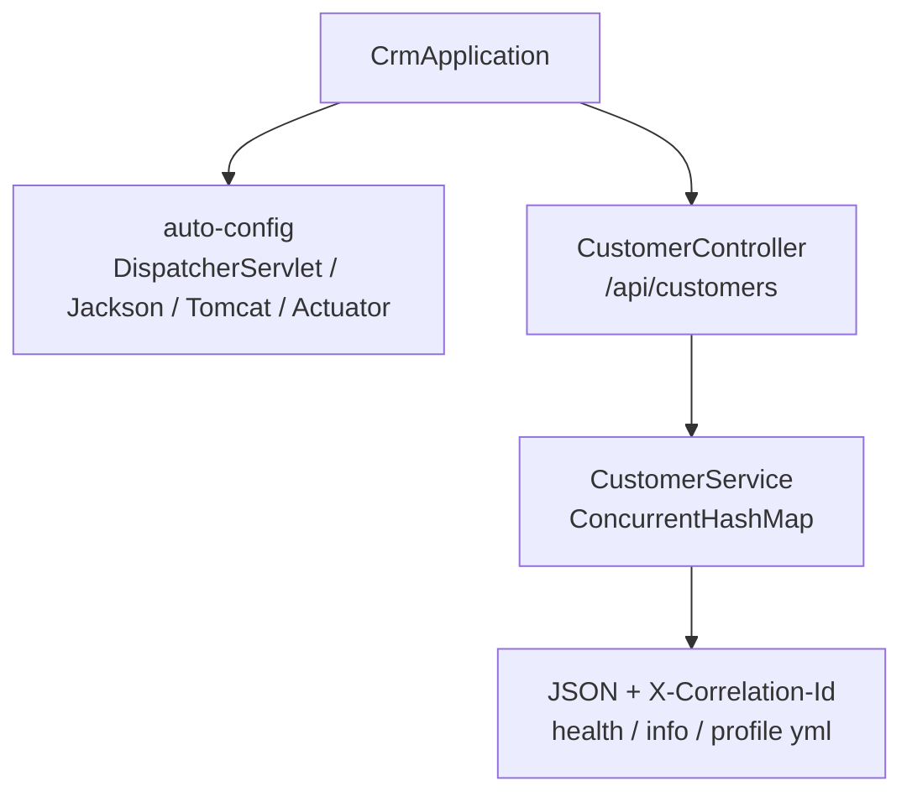
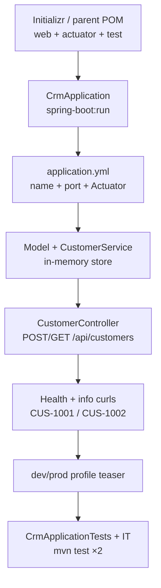

# Lab 23: Spring Boot Setup and Auto-Configuration — Northstar CRM First Boot App

**Module:** 23 — Spring Boot Setup and Auto-Configuration  
**Lab folder:** `labs/Week 3 - Spring Framework and Enterprise Patterns/module-23/lab23/`  
**Difficulty:** Intermediate  
**Duration:** ~45 minutes (timed path with starter) · Full path: 4–5 Hours

**Primary IDE:** IntelliJ IDEA Community Edition · **Optional IDE:** VS Code

| OS | How-to for this lab |
| -- | ------------------- |
| Windows | [LAB-23-WINDOWS.md](LAB-23-WINDOWS.md) |
| macOS | [LAB-23-MACOS.md](LAB-23-MACOS.md) |

> **Environment reminder:** Finish [Lab 0](../../../Week%201%20-%20Java%20and%20JVM%20Foundations/module-00/lab0/LAB-0-GUIDE.md). Use **IntelliJ IDEA Community** (primary; optional VS Code) on your laptop with **JDK 21** and **Maven 3.9+** (Spring Boot 3.x via Maven). Work under `~/java-bootcamp` (Windows: `%USERPROFILE%\java-bootcamp`).

---

## 45-minute timed path (use starter)

In class, use the starter templates so the **core** objectives fit **~45 minutes**. The full Steps below remain for homework / extended depth.

1. Open [`starter/README.md`](starter/README.md).
2. Copy `starter/` into your `java-bootcamp/examples/…` target (see starter README).
3. Fill every `// TODO` — do **not** wait on a perfect prior lab; the starter includes a baseline.
4. Run the starter smoke test; evidence under `notes/screenshots/lab-23/`.
5. Mark timed-path Pass criteria in the starter README. Continue remaining GUIDE steps as homework if needed.

| Path | Time | Scope |
| ---- | ---- | ----- |
| **Timed (default)** | ~45 min | Starter TODOs + smoke test |
| **Full (extended)** | see Duration | Every Step in this GUIDE |

---

## How to follow this lab

1. **In class (timed path):** prefer [`starter/README.md`](starter/README.md) — copy starter → `java-bootcamp/examples/lab23-crm`, fill `// TODO`, run smoke test (~45 min).
2. Open the **Windows** or **macOS** how-to (links above) in a second tab for OS-specific commands.
3. Create/work only under your `java-bootcamp/examples/…` folder from the steps (not inside this `labs/` git clone unless a step says otherwise).
4. For each **Step N** (full path / homework): read **Why** (if present) → do the actions → confirm **Expected** / **Expected result** → then continue.
5. When stuck, use **Failure Experiments** / troubleshooting in this guide before asking for help.
6. Capture evidence under `notes/screenshots/lab-23/` (workspace root under `java-bootcamp`; redact secrets). Use the **Pass criteria** tables — write **Pass** or **Fail** in your notes. GitHub file view does not support clickable checkboxes.


## What you'll submit (read this first)

Keep this checklist visible while you work. Full detail is under [Expected Deliverables](#expected-deliverables) at the end.

| # | Deliverable |
| - | ----------- |
| 1 | Initializr-style `pom.xml` with web + actuator + test |
| 2 | `CrmApplication` + `application.yml` + profile teasers |
| 3 | `/api/customers` evidence for `CUS-1001` / `CUS-1002` / `lab-request-001` |
| 4 | Actuator health verification |
| 5 | Automated context-load and API IT; dual `mvn test` green |
| 6 | Autoconfig vs ownership notes |
| 7 | Controlled-failure evidence |
| 8 | README runbook + cleanup |


## Lab Overview

This Module 23 lab builds the first **Customer Management Platform** Spring Boot application in the Initializr style: starters, `application.yml`, an embedded server, REST `/api/customers`, Actuator health, and a `CrmApplication` entry point. You see how auto-configuration reduces boilerplate while you still own domain rules, validation, and exposure policy.

**Purpose.** Leadership needs a single Boot process that peers can start with `mvn spring-boot:run`, hit create/get for Amina and Ravi, and smoke-check with `/actuator/health`. Profiles appear only as a teaser; Lab 26 deepens environment-specific config and secrets.

**What you build (exercise).** Scaffold `lab23-crm` (Initializr or hand-authored parent); pin `web` + `actuator` + `test`; write `CrmApplication` and YAML; implement in-memory customer create/get with correlation `lab-request-001`; verify health; add `dev`/`prod` profile teasers; automate context-load and HTTP IT; document what Boot auto-configured versus what you still design.

**What success looks like.** Under `~/java-bootcamp/examples/lab23-crm/` the app starts on 8080, `POST`/`GET` work for `CUS-1001`/`CUS-1002`, health returns `UP`, `mvn test` is green twice, and you can name three auto-config gifts and three ownership items.

**Depends on Labs 0, 22 (+ domain from earlier CRM labs).** Need JDK/Maven fluency and constructor-injection discipline. Finish Lab 22 first if `new` wiring is still your only DI story.

**CRM connection.** Fixtures `CUS-1001` / `CUS-1002` / `CUS-MISSING`, correlation `lab-request-001`. Lab 24 adds SOAP beside this REST slice; Lab 25 hardens Controller → Service → Repository.

---

## Learning Objectives

After completing this lab, you will be able to:

* Create a Spring Boot 3.x project (Initializr UI/CLI or equivalent Maven parent setup)
* Select and explain starters (`web`, `actuator`, `test`, optional validation)
* Configure `application.yml` for server port, application name, and basic logging
* Implement a first REST API for customers using Boot auto-configured MVC
* Run the embedded Tomcat (or chosen) server via `spring-boot:run`
* Verify Actuator health as a smoke check for a live process
* Introduce `dev` / `prod` profiles as a teaser without over-building config
* Explain what auto-configuration did for you and what you still own
* Keep fictional CRM fixtures and correlation IDs consistent for peer review

---

## Business Scenario

Northstar freezes a deliverable for Module 23:

**Ship a runnable Spring Boot CRM slice: starters, YAML, `/api/customers`, Actuator health, and an honest note on auto-config versus ownership.**

You own that slice for Amina (`CUS-1001` ACTIVE) and Ravi (`CUS-1002` PROSPECT), plus 404 for missing IDs and correlation on create.

Use these examples consistently:

| ID | Name | Notes |
| -- | ---- | ----- |
| `CUS-1001` | Amina Khan | `ACTIVE` — primary create/get |
| `CUS-1002` | Ravi Singh | `PROSPECT` — second create/get |
| `CUS-MISSING` | — | not-found / 404 path |
| `lab-request-001` | — | default `X-Correlation-Id` |
| `lab23-001`, … | — | optional evidence / notes IDs |

**Security note for evidence.** Use fictional emails only. Unrestricted Actuator on a public host is lab-only — document that in README. Never commit secrets or real production URLs.

---

## Architecture Context

### NOW (this lab)



### Lab flow (mermaid)



### Architecture NOW vs LATER

| Aspect | Lab 23 (NOW) | Lab 24–26 (LATER) |
| ------ | ------------ | ----------------- |
| Protocol | REST JSON only | SOAP Spring-WS beside REST |
| Layers | Thin service + map | Explicit Controller → Service → Repository |
| Config | YAML + profile teaser | Full `dev`/`test`/`prod` + `@ConfigurationProperties` |
| Persistence | In-memory | Still in-memory until JPA/transactions (Lab 27) |

**Lab focus:** Initializr-style Boot app; starters; `application.yml`; first REST endpoint; Actuator; profiles teaser; auto-config literacy.

---

## Prerequisites

Complete [SETUP](../../../SETUP-INSTRUCTIONS.md), [Lab 0](../../../Week%201%20-%20Java%20and%20JVM%20Foundations/module-00/lab0/LAB-0-GUIDE.md), and preferably [Lab 22](../../module-22/lab22/LAB-22-GUIDE.md). Confirm:

* JDK 21; Maven; Git
* Network access to start.spring.io **or** ability to hand-author `spring-boot-starter-parent` 3.3.x
* Free local port (default 8080)
* No secrets committed to Git

### Pre-flight

```bash
java -version
mvn -version
git --version
pwd
ls ~/java-bootcamp/examples
```

Confirm port 8080 is free (or choose another port in YAML before starting).

---

## Suggested Project Files

```text
~/java-bootcamp/examples/lab23-crm/
├── src/
│   ├── main/
│   │   ├── java/com/northstar/crm/
│   │   │   ├── CrmApplication.java
│   │   │   ├── api/CustomerController.java
│   │   │   ├── service/CustomerService.java
│   │   │   └── model/Customer.java
│   │   └── resources/
│   │       ├── application.yml
│   │       ├── application-dev.yml
│   │       └── application-prod.yml
│   └── test/
│       └── java/com/northstar/crm/
│           ├── CrmApplicationTests.java
│           └── api/CustomerControllerIT.java
├── docs/
│   └── autoconfig-notes.md
├── notes/screenshots/
├── pom.xml
├── .gitignore
└── README.md
```

Ignore `target/`, IDE metadata, tokens, and passwords.

---

## Concepts to Discuss

Write 2–3 sentences each in `docs/autoconfig-notes.md`:

1. Main flow: HTTP → Boot MVC → service map → JSON response
2. Trust boundary: `@Valid` / `@NotBlank` at the controller before store put
3. Success/failure contracts: 201/200 vs 404; correlation echoed on create
4. Stable fixtures (`CUS-1001`) vs random IDs in demos
5. Idempotency: GET safe; POST create may overwrite map key today — document honesty
6. Why embedded Tomcat is a local shortcut vs reverse-proxy + hardened Actuator in prod
7. Evidence operators need: startup banner, health JSON, curl transcripts
8. Two instances: in-memory state does not share — Lab 25/27 implications
9. What auto-config provided (server, Jackson, DispatcherServlet) vs what you own
10. What Lab 24 adds (SOAP) without abandoning this REST contract

---

## Implementation Steps

Complete each step in order. Commands assume `~/java-bootcamp/examples/lab23-crm` (Windows: `%USERPROFILE%\java-bootcamp\examples\lab23-crm`) unless noted.

---

### Step 1 — Create the Initializr-style project

**Why:** Peers and CI must share one Boot parent, Java 21, and the same starters — not a mystery classpath.

**Do this:**

```bash
cd ~/java-bootcamp/examples
mkdir -p lab23-crm
cd lab23-crm
mkdir -p docs
mkdir -p ~/java-bootcamp/notes/screenshots/lab-23
# stay in lab23-crm for Initializr / next steps — if the next command already cds, remove the extra cd below
cd ~/java-bootcamp/examples/lab23-crm
```

Generate (UI/CLI) or hand-author:

* Group: `com.northstar` · Artifact: `crm` · Java: 21  
* Dependencies: Spring Web, Spring Boot Actuator, Validation (optional), Spring Boot Test  

Parent: `spring-boot-starter-parent` 3.3.x with starters `web`, `actuator`, `validation`, and `test` (test scope).

```bash
mvn -q -DskipTests package
```

**Expected result:** `BUILD SUCCESS`; project imports cleanly in the IDE.

**If it fails:** Wrong Java release in POM → set `<java.version>21</java.version>`. Missing parent → add `spring-boot-starter-parent`. Network blocked for Initializr → hand-author POM from course materials.

---

### Step 2 — Add `CrmApplication` and prove Boot starts

**Why:** Auto-config only fires when a `@SpringBootApplication` entry point exists and the web starter is on the classpath.

**Do this:** Create `src/main/java/com/northstar/crm/CrmApplication.java`:

```java
package com.northstar.crm;

import org.springframework.boot.SpringApplication;
import org.springframework.boot.autoconfigure.SpringBootApplication;

@SpringBootApplication
public class CrmApplication {
  public static void main(String[] args) {
    SpringApplication.run(CrmApplication.class, args);
  }
}
```

```bash
mvn spring-boot:run
```

**Expected result:** Log lines show Tomcat on port 8080 and `Started CrmApplication`.

**If it fails:** Package outside `com.northstar.crm` scan → move main class. Port in use → change `server.port` or stop the other process. No web starter → add `spring-boot-starter-web`.

---

### Step 3 — Configure `application.yml` basics

**Why:** Port, app name, and Actuator exposure must be declarative so peers do not guess flags.

**Do this:** Create `src/main/resources/application.yml`:

```yaml
spring:
  application:
    name: northstar-crm

server:
  port: 8080

management:
  endpoints:
    web:
      exposure:
        include: health,info
  endpoint:
    health:
      show-details: when_authorized

logging:
  level:
    com.northstar.crm: INFO
```

Restart and curl health once config is live.

**Expected result:** App name `northstar-crm`; `/actuator/health` responds; details policy as configured.

**If it fails:** YAML indentation breaks binding → validate structure. Actuator 404 → confirm `spring-boot-starter-actuator` and exposure `include`. Forgot restart → Boot does not hot-reload YAML by default in this lab path.

---

### Step 4 — Implement customer model and in-memory service

**Why:** Controllers need a domain type and a service bean before REST exists; keep Lab 22 constructor-injection habits even for a map.

**Do this:** Add `Customer` (record or class with `@NotBlank` fields) and `@Service CustomerService` backed by `ConcurrentHashMap`. Seed nothing mandatory — create via API in Step 5.

```java
public record Customer(
    @NotBlank String customerId,
    @NotBlank String fullName,
    @NotBlank String status) {}

@Service
public class CustomerService {
  private final Map<String, Customer> store = new ConcurrentHashMap<>();

  public Customer create(Customer c) {
    store.put(c.customerId(), c);
    return c;
  }

  public Optional<Customer> findById(String id) {
    return Optional.ofNullable(store.get(id));
  }
}
```

```bash
mvn -q -DskipTests compile
```

**Expected result:** Classes compile; service is a Boot bean after component scan.

**If it fails:** Missing validation dependency for `@NotBlank` → add starter-validation. Service not scanned → package must be under `com.northstar.crm`.

---

### Step 5 — Expose `/api/customers` create and get

**Why:** Leadership’s acceptance proof is HTTP evidence for Amina and Ravi with correlation, not a compiled JAR alone.

**Do this:** Implement `CustomerController` with constructor injection; echo `X-Correlation-Id` (default `lab-request-001`); return 201/200/404.

```java
@RestController
@RequestMapping("/api/customers")
@Validated
public class CustomerController {
  private final CustomerService customers;

  public CustomerController(CustomerService customers) {
    this.customers = customers;
  }

  @PostMapping
  public ResponseEntity<Customer> create(
      @RequestHeader(value = "X-Correlation-Id", defaultValue = "lab-request-001") String cid,
      @Valid @RequestBody Customer body) {
    Customer saved = customers.create(body);
    return ResponseEntity.status(HttpStatus.CREATED)
        .header("X-Correlation-Id", cid)
        .body(saved);
  }

  @GetMapping("/{id}")
  public ResponseEntity<Customer> get(@PathVariable String id) {
    return customers.findById(id)
        .map(ResponseEntity::ok)
        .orElse(ResponseEntity.notFound().build());
  }
}
```

```bash
curl -H "X-Correlation-Id: lab-request-001" -H "Content-Type: application/json" \
  -d "{\"customerId\":\"CUS-1001\",\"fullName\":\"Amina Khan\",\"status\":\"ACTIVE\"}" \
  http://localhost:8080/api/customers

curl -H "X-Correlation-Id: lab-request-001" -H "Content-Type: application/json" \
  -d "{\"customerId\":\"CUS-1002\",\"fullName\":\"Ravi Singh\",\"status\":\"PROSPECT\"}" \
  http://localhost:8080/api/customers

curl -s http://localhost:8080/api/customers/CUS-1001
curl -s -o /dev/null -w "%{http_code}\n" http://localhost:8080/api/customers/CUS-MISSING
```

**Expected result:** 201 for creates; 200 for `CUS-1001`; 404 for missing; correlation header present on create response.

**If it fails:** 415 → set `Content-Type: application/json`. Always 404 → confirm path `/api/customers/{id}` and that create succeeded first. Validation 400 → fix blank fields.
---

### Step 6 — Verify Actuator health and info

**Why:** Process smoke checks must not depend on crafting a customer payload; health is the first operator signal.

**Do this:**

```bash
curl -s http://localhost:8080/actuator/health
curl -s http://localhost:8080/actuator/info
```

Optionally set `info.app.name` / `description` in YAML. In `docs/autoconfig-notes.md`, state that broad Actuator exposure is lab-only.

**Expected result:** `{"status":"UP"}` (or equivalent); info includes app name when configured; README marks prod exposure tightening for Lab 26.

**If it fails:** 404 on health → exposure/include missing. Empty info → add `info.*` properties. Details always visible in “prod” teaser later → keep `prod` conservative in Step 7.

---

### Step 7 — Add profiles teaser (`dev` vs `prod`)

**Why:** Students must see that environment changes configuration without code edits — full secrets work is Lab 26.

**Do this:** Add profile files:

```yaml
# application-dev.yml
server:
  port: 8080
logging:
  level:
    com.northstar.crm: DEBUG
management:
  endpoint:
    health:
      show-details: always

# application-prod.yml
logging:
  level:
    com.northstar.crm: INFO
management:
  endpoints:
    web:
      exposure:
        include: health
  endpoint:
    health:
      show-details: never
```

```bash
mvn spring-boot:run -Dspring-boot.run.profiles=dev
# or after package:
java -jar target/crm-0.0.1-SNAPSHOT.jar --spring.profiles.active=dev
```

Document which profile you would use on a shared training server. Note in `docs/autoconfig-notes.md` that Lab 26 will split secrets correctly — do not invent prod passwords here.

**Expected result:** Startup shows `The following profiles are active: dev`; DEBUG from `com.northstar.crm` appears; prod file exists and is clearly tighter.

**If it fails:** Profile ignored → check filename `application-dev.yml` and activation property. Conflicting ports in profile files → keep one port unless intentional.

---

### Step 8 — Automate Boot smoke tests

**Why:** Manual curls alone are not a gate; context-load + one HTTP IT prove the slice is peer-reproducible.

**Do this:** Keep `@SpringBootTest` contextLoads; add `CustomerControllerIT` with `RANDOM_PORT` and create/get for `CUS-1001` + correlation header.

```java
@SpringBootTest
class CrmApplicationTests {
  @Test void contextLoads() {}
}

@SpringBootTest(webEnvironment = SpringBootTest.WebEnvironment.RANDOM_PORT)
class CustomerControllerIT {
  @LocalServerPort int port;
  @Autowired TestRestTemplate rest;

  @Test
  void createAndGetCus1001() {
    var headers = new HttpHeaders();
    headers.set("X-Correlation-Id", "lab-request-001");
    headers.setContentType(MediaType.APPLICATION_JSON);
    var body = "{\"customerId\":\"CUS-1001\",\"fullName\":\"Amina Khan\",\"status\":\"ACTIVE\"}";
    var created = rest.postForEntity(
        "http://localhost:" + port + "/api/customers",
        new HttpEntity<>(body, headers),
        Customer.class);
    assertThat(created.getStatusCode()).isEqualTo(HttpStatus.CREATED);
    assertThat(rest.getForEntity("/api/customers/CUS-1001", Customer.class)
        .getBody().customerId()).isEqualTo("CUS-1001");
  }
}
```

```bash
mvn -q test
mvn -q test
```

**Expected result:** Both runs green and identical; IT asserts 201 and body `customerId=CUS-1001`.

**If it fails:** Fixed port conflicts in parallel Surefire → use `RANDOM_PORT`. Flaky map state across tests → isolate or use unique IDs per test. Context fails → missing main class or broken YAML.
---

### Step 9 — Failure experiments + evidence pack

**Why:** Auto-config literacy includes knowing how Boot fails and how 404/validation appear.

**Do this:** Complete [Failure Experiments](#failure-experiments). Capture startup, health, and curl excerpts under `notes/screenshots/lab-23/`. Finish `docs/autoconfig-notes.md` (three auto-config items, three ownership items). Ensure `git status` clean of `target/`.

**Expected result:** ≥3 experiments recorded; dual green `mvn test`; evidence saved; no secrets staged.

**If it fails:** See Troubleshooting.

---

## Implementation Checkpoints

### Checkpoint A — Tooling

_Mark each row **Pass** or **Fail** in your lab notes (GitHub markdown files are not interactive checklists)._

| # | Confirm | Your notes |
| - | ------- | ---------- |
| 1 | `lab23-crm` under `~/java-bootcamp/examples/` | Pass / Fail |
| 2 | Boot parent + `web` + `actuator` + `test` | Pass / Fail |
| 3 | `CrmApplication` starts with embedded server | Pass / Fail |

### Checkpoint B — Core API

_Mark each row **Pass** or **Fail** in your lab notes (GitHub markdown files are not interactive checklists)._

| # | Confirm | Your notes |
| - | ------- | ---------- |
| 1 | `application.yml` sets name, port, Actuator | Pass / Fail |
| 2 | Create/get for `CUS-1001` and `CUS-1002` with `lab-request-001` | Pass / Fail |
| 3 | Missing ID returns 404 | Pass / Fail |

### Checkpoint C — Ops + profiles

_Mark each row **Pass** or **Fail** in your lab notes (GitHub markdown files are not interactive checklists)._

| # | Confirm | Your notes |
| - | ------- | ---------- |
| 1 | `/actuator/health` is `UP` | Pass / Fail |
| 2 | `dev`/`prod` profile teasers present and explained | Pass / Fail |
| 3 | Autoconfig vs ownership notes written | Pass / Fail |

### Checkpoint D — Hygiene

_Mark each row **Pass** or **Fail** in your lab notes (GitHub markdown files are not interactive checklists)._

| # | Confirm | Your notes |
| - | ------- | ---------- |
| 1 | Two consecutive `mvn test` identical success | Pass / Fail |
| 2 | README runbook complete | Pass / Fail |
| 3 | No secrets / `target/` committed | Pass / Fail |

---

## Reference Commands, Configuration, and Code

### Optional Initializr CLI shape

```bash
# Conceptual: start.spring.io with bootVersion=3.3.x, javaVersion=21,
# packageName=com.northstar.crm, dependencies=web,actuator,validation
# Prefer downloading into ~/java-bootcamp/examples/lab23-crm and aligning artifact id.
```

### YAML excerpt (`application.yml`)

```yaml
spring:
  application:
    name: northstar-crm
server:
  port: 8080
management:
  endpoints:
    web:
      exposure:
        include: health,info
  endpoint:
    health:
      show-details: when_authorized
logging:
  level:
    com.northstar.crm: INFO
info:
  app:
    name: northstar-crm
    description: Lab 23 Spring Boot CRM slice
```

### POM starters (excerpt)

```xml
<parent>
  <groupId>org.springframework.boot</groupId>
  <artifactId>spring-boot-starter-parent</artifactId>
  <version>3.3.x</version>
</parent>
<dependencies>
  <dependency>
    <groupId>org.springframework.boot</groupId>
    <artifactId>spring-boot-starter-web</artifactId>
  </dependency>
  <dependency>
    <groupId>org.springframework.boot</groupId>
    <artifactId>spring-boot-starter-actuator</artifactId>
  </dependency>
  <dependency>
    <groupId>org.springframework.boot</groupId>
    <artifactId>spring-boot-starter-validation</artifactId>
  </dependency>
  <dependency>
    <groupId>org.springframework.boot</groupId>
    <artifactId>spring-boot-starter-test</artifactId>
    <scope>test</scope>
  </dependency>
</dependencies>
```

### Auto-config reminder

```text
Auto-config: web → embedded server + MVC + Jackson; actuator → management endpoints.
You still own: domain rules, validation, secrets strategy, exposure policy.
Lab 24 adds SOAP beside REST; Lab 25 hardens Controller → Service → Repository;
Lab 26 owns real profile/secrets discipline — this lab only teasers profiles.
```

### Commands

```bash
cd ~/java-bootcamp/examples/lab23-crm
mvn -q -DskipTests package
mvn spring-boot:run -Dspring-boot.run.profiles=dev
curl -s http://localhost:8080/actuator/health
curl -s http://localhost:8080/actuator/info
curl -H "X-Correlation-Id: lab-request-001" -H "Content-Type: application/json" \
  -d "{\"customerId\":\"CUS-1002\",\"fullName\":\"Ravi Singh\",\"status\":\"PROSPECT\"}" \
  http://localhost:8080/api/customers
curl -s http://localhost:8080/api/customers/CUS-1001
curl -s -o /dev/null -w "%{http_code}\n" http://localhost:8080/api/customers/CUS-MISSING
mvn -q test
mvn -q test
git status
```

### Evidence checklist (paste into notes)

```text
[ ] Startup banner: Started CrmApplication / port 8080
[ ] POST CUS-1001 201 + correlation lab-request-001
[ ] POST CUS-1002 201
[ ] GET CUS-1001 200 ACTIVE
[ ] GET CUS-MISSING 404
[ ] /actuator/health UP
[ ] Profile banner shows (dev) when activated
[ ] mvn test twice identical
[ ] Autoconfig vs ownership three + three written
```

### Class map

| Class | Role |
| ----- | ---- |
| `CrmApplication` | Boot entry / auto-config trigger |
| `CustomerController` | REST `/api/customers` |
| `CustomerService` | In-memory create/find |
| `Customer` | Request/response model (record OK) |
| `CrmApplicationTests` | Context-load smoke |
| `CustomerControllerIT` | HTTP create/get gate |
| `application.yml` | Shared port/name/Actuator |
| `application-dev.yml` / `application-prod.yml` | Profile teasers |
---

## Manual Verification

1. `mvn spring-boot:run` prints `Started CrmApplication` on 8080.
2. POST create returns 201 for `CUS-1001` and `CUS-1002` with correlation.
3. GET `/api/customers/CUS-1001` returns Amina / ACTIVE.
4. GET missing ID returns 404.
5. Invalid/blank body is rejected (400) when validation is enabled.
6. `/actuator/health` is UP; info optional but documented.
7. `dev` profile changes log/detail behavior versus `prod` file intent.
8. Two consecutive `mvn test` runs match.
9. README documents run/cleanup and auto-config ownership notes.
10. No sensitive values in YAML or Git.

---

## Failure Experiments

| # | Experiment | Observe | Restore |
| - | ---------- | ------- | ------- |
| 1 | Remove web starter temporarily | Context/start fails or no embedded server | Restore starter |
| 2 | POST blank `fullName` with validation | 400-level rejection | Fix payload |
| 3 | Create `CUS-1001` twice | Document overwrite vs future uniqueness | Keep map honest |
| 4 | Bind port already in use | BindException / start fail | Free port or change YAML |
| 5 | Hit health while app stopped | Connection refused | Start app |

---

## Troubleshooting

| Symptom | Likely cause | Fix |
| ------- | ------------ | --- |
| Port already in use | Another Boot/process on 8080 | Change `server.port` or kill process |
| Actuator 404 | Not on classpath / not exposed | Add actuator; set `exposure.include` |
| Tests flaky on 8080 | Fixed port collision | `webEnvironment = RANDOM_PORT` |
| YAML ignored | Indent/typo / no restart | Fix YAML; restart |
| Bean not found | Wrong package scan | Keep types under `com.northstar.crm` |
| Validation never fires | Missing starter-validation | Add dependency; `@Valid` on body |

---

## Security and Production Review

Answer in README:

1. Which inputs are untrusted (JSON body, headers)?
2. Where are authn/authz/validation enforced (validation now; full security later)?
3. Which values are sensitive — never commit API keys or real DB passwords?
4. What can be retried safely (`GET`, health; careful with duplicate `POST` create)?
5. What happens after partial failure (in-memory put is atomic per key; no multi-row TX yet)?
6. What would an operator monitor (health, startup errors, HTTP 4xx/5xx)?
7. Which local default is unacceptable in production (open Actuator, debug everywhere)?
8. How are API contracts versioned when Lab 24 adds SOAP?

---

## Cleanup

```bash
cd ~/java-bootcamp/examples/lab23-crm
# Ctrl+C spring-boot:run
mvn -q clean
git status
```

Do not commit `target/`. Keep curl transcripts and notes.

**Keep `lab23-crm`**—Lab 24 copies it into `lab24-crm` for Spring-WS.

---

## Expected Deliverables

Same checklist as [What you'll submit](#what-youll-submit-read-this-first) above.

* Initializr-style `pom.xml` with web + actuator + test
* `CrmApplication` + `application.yml` + profile teasers
* `/api/customers` evidence for `CUS-1001` / `CUS-1002` / `lab-request-001`
* Actuator health verification
* Automated context-load and API IT; dual `mvn test` green
* Autoconfig vs ownership notes
* Controlled-failure evidence
* README runbook + cleanup
* No secrets or generated build directories committed

---

## Evaluation Rubric (100 Marks)

| Criteria | Marks |
| -------- | ----: |
| Environment and project structure | 10 |
| Core implementation (`CrmApplication`, YAML, `/api/customers`) | 30 |
| Integration/configuration correctness (starters, Actuator, profiles teaser) | 15 |
| Failure handling (404, validation, start failures) | 15 |
| Automated verification | 10 |
| Security and production awareness (Actuator exposure honesty) | 10 |
| Documentation and evidence | 10 |

**Notes:** A green package without HTTP evidence for fixtures → lose core marks. Claiming “Boot does everything” without ownership notes → lose awareness marks. Committing secrets → honor violation.

---

## Reflection Questions

Write 3–6 sentence answers:

1. Which design decision most affected correctness?
2. Which failure was hardest to diagnose?
3. What evidence proves the implementation works?
4. What breaks first at ten times the request rate with an in-memory map?
5. Which concern should move to shared infrastructure (Actuator policy, reverse proxy)?
6. What must change before real customer data is used?
7. How does this lab connect to Labs 22 and 24–26?
8. What metric or log field matters most on first Boot smoke?
9. (Forward look) What must stay stable when Lab 24 adds SOAP beside REST?

---

## Bonus Challenges

1. Structured logging of `customerId` + correlation without PII.
2. Separate readiness vs liveness notes on top of basic health.
3. Metrics counter for create/get success/failure.
4. Document rollback if a bad `prod` teaser were deployed.
5. Optional container-backed smoke plan for a future DB profile.
6. Initializr CLI one-liner captured in README for peer recreate.

---

## Success Criteria

You are finished when:

* Boot app runs with starters, YAML, customers REST API, and Actuator health
* Happy path and at least one failure path are repeatable
* Another student can follow your run instructions
* Tests/build pass twice
* No production secret is hard-coded
* You can explain auto-configuration benefits and Actuator/profile trade-offs
* Evidence covers `CUS-1001`, `CUS-1002`, and `lab-request-001`

---

## Instructor Notes

* **Live probe:** Ask the student to name three things Boot auto-configured and three things they still own, then curl health and GET `CUS-1001`.
* **Assess:** Real HTTP evidence for both fixtures + correlation; honest Actuator warning; green IT with `RANDOM_PORT`.
* **Continuity:** Prefer `examples/lab23-crm`. Keep fixture IDs. Lab 24 copies this tree — do not invent a second domain model.
* **Common pitfalls:** fixed-port test flakes; over-building full prod secrets (save for Lab 26); forgetting validation starter.
* **Timing:** Timed path ~45 minutes with starter; full path remains 4–5 hours. Keep starter TODOs as the in-class core; remaining GUIDE steps are homework/extended depth.

---

*End of Lab 23 — Spring Boot Setup and Auto-Configuration: Northstar CRM First Boot App. Keep `lab23-crm` for Lab 24 and portfolio evidence.*
