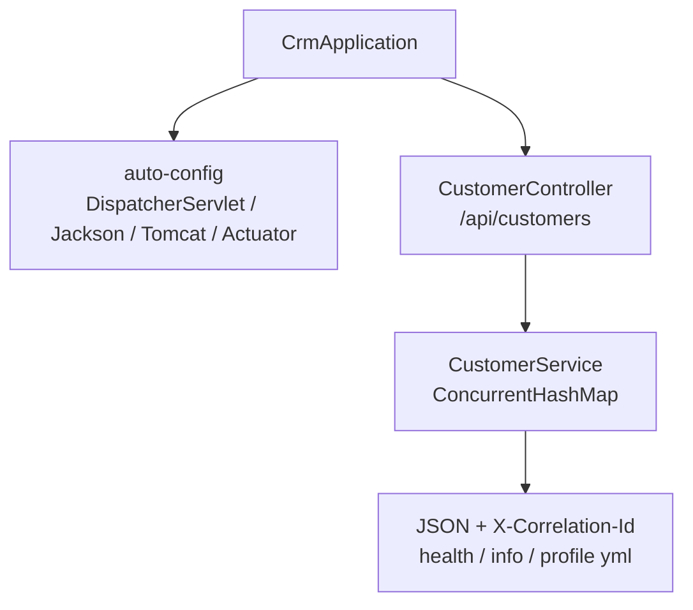

# Lab 23: Spring Boot Setup and Auto-Configuration — Northstar CRM First Boot App

> **Participants:** Module sequence is in [`../README.md`](../README.md). **Do not start this guide until** you have finished Module 23 [pre-lab exercises 1–6](../exercises/EXERCISES-INDEX.md) (Pass in your notes; order **1 → 2 → 3 → 4 → 5 → 6**). Then open **one** OS how-to ([Windows](LAB-23-WINDOWS.md) · [macOS](LAB-23-MACOS.md)). In class, prefer the **45-minute timed path** with [`starter/`](starter/README.md); the **full path** is every Step below (homework / extended). Skip `solution/` unless your instructor says otherwise. See [Which file do I open?](../../../_PARTICIPANT-FILE-GUIDE.md).

## Activity card

| | |
| --- | --- |
| **Objective** | Ship an Initializr-style Boot CRM app with REST customers + Actuator health |
| **Skills practiced** | Starters, CrmApplication, application.yml, embedded server, health smoke |
| **Expected outcome** | App on 8080 · health UP · CUS-1001/CUS-1002 evidence · autoconfig notes |
| **Estimated time** | Timed path ~45 min · Full path 4–5 hours |
| **Prerequisites** | Lab 0 · Lab 22 preferred · Exercises 1–6 Pass · JDK 21 · Maven 3.9+ |
| **Expected files** | `examples/lab23-crm/` — pom, YAML, API, tests, ownership notes |
| **Validation checkpoints** | Starter smoke · GUIDE Implementation Checkpoints |

**Module:** 23 — Spring Boot Setup and Auto-Configuration  
**Duration:** ~45 minutes (timed path with starter) · Full path: 4–5 Hours

**Primary IDE:** IntelliJ IDEA Community Edition · **Optional IDE:** VS Code

| OS | How-to for this lab |
| -- | ------------------- |
| Windows | [LAB-23-WINDOWS.md](LAB-23-WINDOWS.md) |
| macOS | [LAB-23-MACOS.md](LAB-23-MACOS.md) |

> **Incremental build:** Ownership → starters → CrmApplication stub → YAML → smoke plan → Lab 23.

> **Classroom pacing:** [`../PACING.md`](../PACING.md) (Checkpoints A–E).

> **Critical scope:** Starters **web + actuator + test**. Document **auto-config gifts vs ownership**. Profiles = **teaser** (Lab 26). Health smoke — do not rebuild Lab 21 metrics. SOAP/Security later.

## 45-minute timed path (use starter)

In class, use the starter templates so the **core** objectives fit **~45 minutes**. The full Steps below remain for homework / extended depth.

1. Open [`starter/README.md`](starter/README.md).
2. Copy `starter/` into your `java-bootcamp/examples/…` target (see starter README).
3. Fill every `// TODO` — do **not** wait on a perfect prior lab; the starter includes a baseline.
4. Run the starter smoke test; evidence under `notes/screenshots/lab-23/`.
5. Mark timed-path Pass criteria in the starter README. Continue remaining GUIDE steps as homework if needed.

| Path | Time | Scope |
| ---- | ---- | ----- |
| **Timed (default)** | ~45 min | Starter TODOs + smoke test |
| **Full (extended)** | see Duration | Every Step in this GUIDE |

---

## What you'll submit (read this first)

Keep this checklist visible while you work.

| # | Deliverable |
| - | ----------- |
| 1 | Initializr-style `pom.xml` with web + actuator + test |
| 2 | `CrmApplication` + `application.yml` + profile teasers |
| 3 | `/api/customers` evidence for `CUS-1001` / `CUS-1002` / `lab-request-001` |
| 4 | Actuator health verification |
| 5 | Automated context-load and API IT; dual `mvn test` green |
| 6 | Autoconfig vs ownership notes |
| 7 | Controlled-failure evidence |
| 8 | README runbook + cleanup |

**Must submit:** the items in the table above (sources + evidence + short notes).

**Do not submit:** `target/`, `node_modules/`, secrets, heap dumps, or a verbatim instructor `solution/`.

## Lab Overview

This Module 23 lab builds the first **Customer Management Platform** Spring Boot application in the Initializr style: starters, `application.yml`, an embedded server, REST `/api/customers`, Actuator health, and a `CrmApplication` entry point. You see how auto-configuration reduces boilerplate while you still own domain rules, validation, and exposure policy.

## Learning Objectives

After completing this lab, you will be able to:

* Create a Spring Boot 3.x project (Initializr UI/CLI or equivalent Maven parent setup)
* Select and explain starters (`web`, `actuator`, `test`, optional validation)
* Configure `application.yml` for server port, application name, and basic logging
* Implement a first REST API for customers using Boot auto-configured MVC
* Run the embedded Tomcat (or chosen) server via `spring-boot:run`

## Business Scenario

Northstar freezes a deliverable for Module 23:

**Ship a runnable Spring Boot CRM slice: starters, YAML, `/api/customers`, Actuator health, and an honest note on auto-config versus ownership.**

You own that slice for Amina (`CUS-1001` ACTIVE) and Ravi (`CUS-1002` PROSPECT), plus 404 for missing IDs and correlation on create.

Use these examples consistently:

| ID | Name | Notes |
| -- | ---- | ----- |
| `CUS-1001` | Amina Khan | `ACTIVE` — primary create/get |
| `CUS-1002` | Ravi Singh | `PROSPECT` — second create/get |
| `CUS-MISSING` | — | not-found / 404 path |
| `lab-request-001` | — | default `X-Correlation-Id` |
| `lab23-001`, … | — | optional evidence / notes IDs |

**Security note for evidence.** Use fictional emails only. Unrestricted Actuator on a public host is lab-only — document that in README. Never commit secrets or real production URLs.

---

## Architecture Context
### NOW (this lab)


```mermaid
flowchart TB
  App["CrmApplication"] --> Auto["auto-config<br/>DispatcherServlet / Jackson / Tomcat / Actuator"]
  App --> Ctrl["CustomerController<br/>/api/customers"]
  Ctrl --> Svc["CustomerService<br/>ConcurrentHashMap"]
  Svc --> Features["JSON + X-Correlation-Id<br/>health / info / profile yml"]
```

## Prerequisites

Prior labs: [Lab 22](../../module-22/lab22/LAB-22-GUIDE.md).

Confirm (Lab 0 tools assumed):

* JDK 21; Maven; Git
* Network access to start.spring.io **or** ability to hand-author `spring-boot-starter-parent` 3.3.x
* Free local port (default 8080)
* No secrets committed to Git

### Pre-flight

```bash
java -version
mvn -version
```

## Worked example (read before you code)

Study this pattern once before Step 1. Your job is to apply the same idea in the Steps — do not skip ahead to a full solution.

```java
@SpringBootTest
class CrmApplicationTests {
  @Test void contextLoads() {}
}

@SpringBootTest(webEnvironment = SpringBootTest.WebEnvironment.RANDOM_PORT)
class CustomerControllerHttpTest {
  @LocalServerPort int port;
  @Autowired TestRestTemplate rest;

  @Test
  void createAndGetCus1001() {
    var headers = new HttpHeaders();
    headers.set("X-Correlation-Id", "lab-request-001");
    headers.setContentType(MediaType.APPLICATION_JSON);
    var body = "{\"id\":\"CUS-1001\",\"name\":\"Amina Khan\",\"email\":\"amina.khan@example.com\",\"status\":\"ACTIVE\"}";
    var created = rest.postForEntity(
        "http://localhost:" + port + "/api/customers",
        new HttpEntity<>(body, headers),
        Customer.class);
    assertThat(created.getStatusCode()).isEqualTo(HttpStatus.CREATED);
    assertThat(rest.getForEntity("/api/customers/CUS-1001", Customer.class)
        .getBody().getId()).isEqualTo("CUS-1001");
  }
}
```

**What to notice:** Match names, IDs, and failure behavior from the scenario — instructors check these.

---

## Implementation Steps

Complete each step in order. Commands assume `~/java-bootcamp/examples/lab23-crm` (Windows: `%USERPROFILE%\java-bootcamp\examples\lab23-crm`) unless noted.

---

### Step 1 — Create the Initializr-style project

**Why:** Peers and CI must share one Boot parent, Java 21, and the same starters — not a mystery classpath.

**Do this:**

```bash
cd ~/java-bootcamp/examples
mkdir -p lab23-crm
cd lab23-crm
mkdir -p docs
mkdir -p ~/java-bootcamp/notes/screenshots/lab-23
# stay in lab23-crm for Initializr / next steps — if the next command already cds, remove the extra cd below
cd ~/java-bootcamp/examples/lab23-crm
```

Generate (UI/CLI) or hand-author:

* Group: `com.northstar` · Artifact: `crm` · Java: 21  
* Dependencies: Spring Web, Spring Boot Actuator, Validation (optional), Spring Boot Test  

Parent: `spring-boot-starter-parent` 3.3.x with starters `web`, `actuator`, `validation`, and `test` (test scope).

```bash
mvn -q -DskipTests package
```

**Expected result:** `BUILD SUCCESS`; project imports cleanly in the IDE.

**If it fails:** Wrong Java release in POM → set `<java.version>21</java.version>`. Missing parent → add `spring-boot-starter-parent`. Network blocked for Initializr → hand-author POM from course materials.

---

### Step 2 — Add `CrmApplication` and prove Boot starts

**Why:** Auto-config only fires when a `@SpringBootApplication` entry point exists and the web starter is on the classpath.

**Do this:** Create `src/main/java/com/northstar/crm/CrmApplication.java`:

```java
package com.northstar.crm;

import org.springframework.boot.SpringApplication;
import org.springframework.boot.autoconfigure.SpringBootApplication;

@SpringBootApplication
public class CrmApplication {
  public static void main(String[] args) {
    SpringApplication.run(CrmApplication.class, args);
  }
}
```

```bash
mvn spring-boot:run
```

**Expected result:** Log lines show Tomcat on port 8080 and `Started CrmApplication`.

**If it fails:** Package outside `com.northstar.crm` scan → move main class. Port in use → change `server.port` or stop the other process. No web starter → add `spring-boot-starter-web`.

---

### Step 3 — Configure `application.yml` basics

**Why:** Port, app name, and Actuator exposure must be declarative so peers do not guess flags.

**Do this:** Create `src/main/resources/application.yml`:

```yaml
spring:
  application:
    name: northstar-crm

server:
  port: 8080

management:
  endpoints:
    web:
      exposure:
        include: health,info
  endpoint:
    health:
      show-details: when_authorized

logging:
  level:
    com.northstar.crm: INFO
```

Restart and curl health once config is live.

**Expected result:** App name `northstar-crm`; `/actuator/health` responds; details policy as configured.

**If it fails:** YAML indentation breaks binding → validate structure. Actuator 404 → confirm `spring-boot-starter-actuator` and exposure `include`. Forgot restart → Boot does not hot-reload YAML by default in this lab path.

---

### Step 4 — Implement customer model and in-memory service

**Why:** Controllers need a domain type and a service bean before REST exists; keep Lab 22 constructor-injection habits even for a map.

**Do this:** Keep starter JavaBean `Customer` (`id`/`name`/`email`/`status` + getters). `@Service CustomerService` is backed by `ConcurrentHashMap` and **already seeds** `CUS-1001` / `CUS-1002`. Timed path does **not** require `@NotBlank` / validation starter (`@Valid` = optional full-path).

```java
@Service
public class CustomerService {
  private final Map<String, Customer> store = new ConcurrentHashMap<>();

  public CustomerService() {
    store.put("CUS-1001", Customer.amina());
    store.put("CUS-1002", Customer.ravi());
  }

  public Customer create(Customer customer, String correlationId) {
    store.put(customer.getId(), customer);
    return customer;
  }

  public Customer get(String id) {
    Customer found = store.get(id);
    if (found == null) {
      throw new IllegalArgumentException("Customer not found: " + id);
    }
    return found;
  }
}
```

```bash
mvn -q -DskipTests compile
```

**Expected result:** Classes compile; service is a Boot bean after component scan; seeds visible via GET after Step 5.

**If it fails:** Service not scanned → package must be under `com.northstar.crm`. Optional full-path validation → add starter-validation + `@Valid` separately.

---

### Step 5 — Expose `/api/customers` create and get

**Why:** Leadership’s acceptance proof is HTTP evidence for Amina and Ravi with correlation, not a compiled JAR alone.

**Do this:** Implement `CustomerController` with constructor injection; echo `X-Correlation-Id` (default `lab-request-001`); return 201/200/404.

```java
@RestController
@RequestMapping("/api/customers")
public class CustomerController {
  private final CustomerService customerService;

  public CustomerController(CustomerService customerService) {
    this.customerService = customerService;
  }

  @PostMapping
  @ResponseStatus(HttpStatus.CREATED)
  public Customer create(
      @RequestBody Customer customer,
      @RequestHeader(value = "X-Correlation-Id", defaultValue = "lab-request-001") String correlationId) {
    return customerService.create(customer, correlationId);
  }

  @GetMapping("/{id}")
  public Customer get(@PathVariable String id) {
    return customerService.get(id);
  }
}
```

```bash
curl -H "X-Correlation-Id: lab-request-001" -H "Content-Type: application/json" \
  -d "{\"id\":\"CUS-1001\",\"name\":\"Amina Khan\",\"email\":\"amina.khan@example.com\",\"status\":\"ACTIVE\"}" \
  http://localhost:8080/api/customers

curl -H "X-Correlation-Id: lab-request-001" -H "Content-Type: application/json" \
  -d "{\"id\":\"CUS-1002\",\"name\":\"Ravi Singh\",\"email\":\"ravi.singh@example.com\",\"status\":\"PROSPECT\"}" \
  http://localhost:8080/api/customers

curl -s http://localhost:8080/api/customers/CUS-1001
curl -s -o /dev/null -w "%{http_code}\n" http://localhost:8080/api/customers/CUS-MISSING
```

**Expected result:** 201 for creates; 200 for `CUS-1001`; 404 for missing; correlation header present on create response.

**If it fails:** 415 → set `Content-Type: application/json`. Always 404 → confirm path `/api/customers/{id}` and that create succeeded first. Validation 400 → fix blank fields.
---

### Step 6 — Verify Actuator health and info

**Why:** Process smoke checks must not depend on crafting a customer payload; health is the first operator signal.

**Do this:**

```bash
curl -s http://localhost:8080/actuator/health
curl -s http://localhost:8080/actuator/info
```

Optionally set `info.app.name` / `description` in YAML. In `docs/autoconfig-notes.md`, state that broad Actuator exposure is lab-only.

**Expected result:** `{"status":"UP"}` (or equivalent); info includes app name when configured; README marks prod exposure tightening for Lab 26.

**If it fails:** 404 on health → exposure/include missing. Empty info → add `info.*` properties. Details always visible in “prod” teaser later → keep `prod` conservative in Step 7.

---

### Step 7 — Add profiles teaser (`dev` vs `prod`)

**Why:** Students must see that environment changes configuration without code edits — full secrets work is Lab 26.

**Do this:** Add profile files:

```yaml
# application-dev.yml
server:
  port: 8080
logging:
  level:
    com.northstar.crm: DEBUG
management:
  endpoint:
    health:
      show-details: always

# application-prod.yml
logging:
  level:
    com.northstar.crm: INFO
management:
  endpoints:
    web:
      exposure:
        include: health
  endpoint:
    health:
      show-details: never
```

```bash
mvn spring-boot:run -Dspring-boot.run.profiles=dev
# or after package:
java -jar target/crm-0.0.1-SNAPSHOT.jar --spring.profiles.active=dev
```

Document which profile you would use on a shared training server. Note in `docs/autoconfig-notes.md` that Lab 26 will split secrets correctly — do not invent prod passwords here.

**Expected result:** Startup shows `The following profiles are active: dev`; DEBUG from `com.northstar.crm` appears; prod file exists and is clearly tighter.

**If it fails:** Profile ignored → check filename `application-dev.yml` and activation property. Conflicting ports in profile files → keep one port unless intentional.

---

### Step 8 — Automate Boot smoke tests

**Why:** Manual curls alone are not a gate; context-load + one HTTP IT prove the slice is peer-reproducible.

**Do this:** Keep `@SpringBootTest` contextLoads; add `CustomerControllerHttpTest` with `RANDOM_PORT` and create/get for `CUS-1001` + correlation header.

```java
@SpringBootTest
class CrmApplicationTests {
  @Test void contextLoads() {}
}

@SpringBootTest(webEnvironment = SpringBootTest.WebEnvironment.RANDOM_PORT)
class CustomerControllerHttpTest {
  @LocalServerPort int port;
  @Autowired TestRestTemplate rest;

  @Test
  void createAndGetCus1001() {
    var headers = new HttpHeaders();
    headers.set("X-Correlation-Id", "lab-request-001");
    headers.setContentType(MediaType.APPLICATION_JSON);
    var body = "{\"id\":\"CUS-1001\",\"name\":\"Amina Khan\",\"email\":\"amina.khan@example.com\",\"status\":\"ACTIVE\"}";
    var created = rest.postForEntity(
        "http://localhost:" + port + "/api/customers",
        new HttpEntity<>(body, headers),
        Customer.class);
    assertThat(created.getStatusCode()).isEqualTo(HttpStatus.CREATED);
    assertThat(rest.getForEntity("/api/customers/CUS-1001", Customer.class)
        .getBody().getId()).isEqualTo("CUS-1001");
  }
}
```

```bash
mvn -q test
mvn -q test
```

**Expected result:** Both runs green and identical; IT asserts 201 and body `id=CUS-1001` (via `getId()`).

**If it fails:** Fixed port conflicts in parallel Surefire → use `RANDOM_PORT`. Flaky map state across tests → isolate or use unique IDs per test. Context fails → missing main class or broken YAML.
---

### Step 9 — Failure experiments + evidence pack

**Why:** Auto-config literacy includes knowing how Boot fails and how 404/validation appear.

**Do this:** Complete Failure Experiments. Capture startup, health, and curl excerpts under `notes/screenshots/lab-23/`. Finish `docs/autoconfig-notes.md` (three auto-config items, three ownership items). Ensure `git status` clean of `target/`.

**Expected result:** ≥3 experiments recorded; dual green `mvn test`; evidence saved; no secrets staged.

**If it fails:** See Troubleshooting.

---

## Implementation Checkpoints

### Checkpoint A — Tooling

_Mark **Pass** or **Fail** in your lab notes._

| # | Confirm | Your notes |
| - | ------- | ---------- |
| 1 | `lab23-crm` under `~/java-bootcamp/examples/` | Pass / Fail |
| 2 | Boot parent + `web` + `actuator` + `test` | Pass / Fail |
| 3 | `CrmApplication` starts with embedded server | Pass / Fail |

### Checkpoint B — Core API

_Mark **Pass** or **Fail** in your lab notes._

| # | Confirm | Your notes |
| - | ------- | ---------- |
| 1 | `application.yml` sets name, port, Actuator | Pass / Fail |
| 2 | Create/get for `CUS-1001` and `CUS-1002` with `lab-request-001` | Pass / Fail |
| 3 | Missing ID returns 404 | Pass / Fail |

### Checkpoint C — Ops + profiles

_Mark **Pass** or **Fail** in your lab notes._

| # | Confirm | Your notes |
| - | ------- | ---------- |
| 1 | `/actuator/health` is `UP` | Pass / Fail |
| 2 | `dev`/`prod` profile teasers present and explained | Pass / Fail |
| 3 | Autoconfig vs ownership notes written | Pass / Fail |

### Checkpoint D — Hygiene

_Mark **Pass** or **Fail** in your lab notes._

| # | Confirm | Your notes |
| - | ------- | ---------- |
| 1 | Two consecutive `mvn test` identical success | Pass / Fail |
| 2 | README runbook complete | Pass / Fail |
| 3 | No secrets / `target/` committed | Pass / Fail |

---

## Reference Commands, Configuration, and Code

### YAML excerpt (`application.yml`)

```yaml
spring:
  application:
    name: northstar-crm
server:
  port: 8080
management:
  endpoints:
    web:
      exposure:
        include: health,info
  endpoint:
    health:
      show-details: when_authorized
logging:
  level:
    com.northstar.crm: INFO
info:
  app:
    name: northstar-crm
    description: Lab 23 Spring Boot CRM slice
```

### Auto-config reminder

```text
Auto-config: web → embedded server + MVC + Jackson; actuator → management endpoints.
You still own: domain rules, validation, secrets strategy, exposure policy.
Lab 24 adds SOAP beside REST; Lab 25 hardens Controller → Service → Repository;
Lab 26 owns real profile/secrets discipline — this lab only teasers profiles.
```

### Commands

```bash
cd ~/java-bootcamp/examples/lab23-crm
mvn -q -DskipTests package
mvn spring-boot:run -Dspring-boot.run.profiles=dev
curl -s http://localhost:8080/actuator/health
curl -s http://localhost:8080/actuator/info
curl -H "X-Correlation-Id: lab-request-001" -H "Content-Type: application/json" \
  -d "{\"id\":\"CUS-1002\",\"name\":\"Ravi Singh\",\"email\":\"ravi.singh@example.com\",\"status\":\"PROSPECT\"}" \
  http://localhost:8080/api/customers
curl -s http://localhost:8080/api/customers/CUS-1001
curl -s -o /dev/null -w "%{http_code}\n" http://localhost:8080/api/customers/CUS-MISSING
mvn -q test
mvn -q test
git status
```

## Failure Experiments

| # | Experiment | Observe | Restore |
| - | ---------- | ------- | ------- |
| 1 | Remove web starter temporarily | Context/start fails or no embedded server | Restore starter |
| 2 | POST blank `name` (optional `@Valid` / validation starter = full-path) | 400-level rejection if validation enabled | Fix payload |
| 3 | Create `CUS-1001` twice | Document overwrite vs future uniqueness | Keep map honest |
| 4 | Bind port already in use | BindException / start fail | Free port or change YAML |
| 5 | Hit health while app stopped | Connection refused | Start app |

---

## Troubleshooting

| Symptom | Likely cause | Fix |
| ------- | ------------ | --- |
| Port already in use | Another Boot/process on 8080 | Change `server.port` or kill process |
| Actuator 404 | Not on classpath / not exposed | Add actuator; set `exposure.include` |
| Tests flaky on 8080 | Fixed port collision | `webEnvironment = RANDOM_PORT` |
| YAML ignored | Indent/typo / no restart | Fix YAML; restart |
| Bean not found | Wrong package scan | Keep types under `com.northstar.crm` |
| Validation never fires | Timed path has no `@Valid` | Optional full-path: add starter-validation + `@Valid` |
| Working in `module-23-exercises` for the lab | Wrong project | Lab lives in `examples/lab23-crm` |
| App starts but no REST mapping | Missing `@RestController` / wrong path | Confirm `/api/customers` mapping |

## Security and Production Review

Optional — jot brief notes in your README if useful for your progress check (not a separate essay):

1. Which inputs are untrusted (JSON body, headers)?
2. Where are authn/authz/validation enforced (validation now; full security later)?
3. Which values are sensitive — never commit API keys or real DB passwords?

---


## Cleanup

```bash
cd ~/java-bootcamp/examples/lab23-crm
# Ctrl+C spring-boot:run
mvn -q clean
git status
```

Do not commit `target/`. Keep curl transcripts and notes.

**Keep `lab23-crm`**—Lab 24 copies it into `lab24-crm` for Spring-WS.


## Reflection Questions

Write **1–3 sentence** answers (not essays):

1. Which design decision most affected correctness?
2. What evidence proves the implementation works?
3. Which failure was hardest to diagnose?

---


