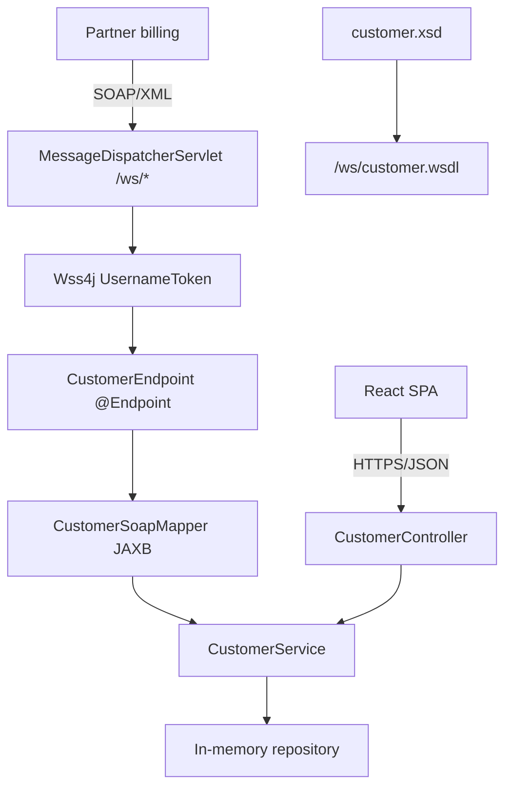
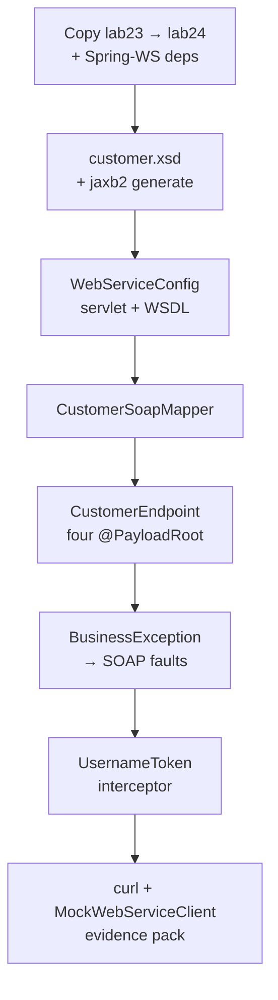

# Lab 24: SOAP Web Service Endpoints — Northstar CRM Spring-WS

**Module:** 24 — SOAP Web Services with Spring WS  
**Lab folder:** `labs/Week 3 - Spring Framework and Enterprise Patterns/module-24/lab24/`  
**Difficulty:** Advanced  
**Duration:** 4–5 Hours

**Primary IDE:** IntelliJ IDEA Community Edition · **Optional IDE:** VS Code

| OS | How-to for this lab |
| -- | ------------------- |
| Windows | [LAB-24-WINDOWS.md](LAB-24-WINDOWS.md) |
| macOS | [LAB-24-MACOS.md](LAB-24-MACOS.md) |

> **Environment reminder:** Finish [Lab 0](../../../Week%201%20-%20Java%20and%20JVM%20Foundations/module-00/lab0/LAB-0-GUIDE.md). Use **IntelliJ IDEA Community** (primary; optional VS Code) on your laptop with **JDK 21** and **Maven 3.9+** (Spring Boot 3.x via Maven). Work under `~/java-bootcamp` (Windows: `%USERPROFILE%\java-bootcamp`).

---

## How to follow this lab

1. Open the **Windows** or **macOS** how-to (links above) in a second tab.
2. Create/work only under your `java-bootcamp/examples/…` folder from the steps (not inside this `labs/` git clone unless a step says otherwise).
3. For each **Step N**: read **Why** (if present) → do the actions → confirm **Expected** / **Expected result** → then continue.
4. When stuck, use **Failure Experiments** / troubleshooting in this guide before asking for help.
5. Capture evidence under `notes/screenshots/lab-24/` (workspace root under `java-bootcamp`; redact secrets). Use the **Pass criteria** tables — write **Pass** or **Fail** in your notes. GitHub file view does not support clickable checkboxes.

## Lab Overview

This Module 24 lab extends the **Northstar Customer Service Platform** with a contract-first **Spring Web Services** SOAP endpoint beside the Lab 23 REST API. You author `customer.xsd`, generate JAXB types, implement `CustomerEndpoint`, serve a live WSDL, map business faults, and add a minimal WS-Security **UsernameToken** — all while delegating to the same `CustomerService` so protocol never forks business rules.

**Purpose.** A partner billing platform still speaks SOAP. Leadership freezes: expose Lab 13’s customer contract over Spring-WS, backed by Lab 23’s service layer, with inspectable WSDL and message-level UsernameToken — without duplicating validation inside the endpoint.

**What you build (exercise).** Copy to `lab24-crm`; add Spring-WS + jaxb2 plugin; author XSD; configure `MessageDispatcherServlet` + `DefaultWsdl11Definition`; map JAXB ↔ domain; implement `@Endpoint` / `@PayloadRoot`; SOAP fault mapping; UsernameToken interceptor; raw XML `curl` + `MockWebServiceClient` tests; evidence with correlation `lab24-001`.

**What success looks like.** Under `~/java-bootcamp/examples/lab24-crm/` WSDL lists four operations, secured get of `CUS-1001` succeeds, missing security and not-found faults are distinct, REST still works against the same service, and `mvn test` is green twice.

**Depends on Lab 23 (+ Lab 13 contract / Lab 16 exceptions preferred).** Need runnable Boot + `CustomerService`. If Lab 13 WSDL is missing, use this lab’s XSD (same namespace/operations). If Lab 16 exceptions are missing, add the hierarchy in Step 6.

**CRM connection.** Fixtures `CUS-1001` / `CUS-1002` / `CUS-9999`, correlation `lab24-001` (SOAP evidence; also accept `lab-request-001` on the shared REST path). Lab 25 refactors repository layering without changing endpoint method signatures.

---

## Learning Objectives

After completing this lab, you will be able to:

* Explain contract-first SOAP and why the XSD—not Java—is the source of truth
* Author an XSD and let Spring-WS generate WSDL dynamically from it
* Generate JAXB request/response classes with `jaxb2-maven-plugin`
* Implement `@Endpoint` with `@PayloadRoot` / `@RequestPayload` / `@ResponsePayload`
* Configure `MessageDispatcherServlet` and `DefaultWsdl11Definition`
* Delegate SOAP logic to existing `CustomerService` without duplicating rules
* Translate `BusinessException` subtypes into structured SOAP faults
* Configure a minimal WS-Security UsernameToken interceptor and explain message-level security
* Test with raw XML `curl` and `spring-ws-test`
* Keep fictional CRM fixtures consistent for partner-style evidence

---

## Business Scenario

Northstar CRM already serves REST from `lab23-crm/`. A regional billing partner only integrates via SOAP/XML and must create, get, update status, and list customers using the Lab 13 contract. Protocol may differ; business rules must not.

Leadership freezes:

**Ship Spring-WS beside REST: live WSDL from XSD, four operations, CLIENT faults for not-found/duplicate, UsernameToken required, same `CustomerService` as REST.**

Use these examples consistently:

| ID | Name | Notes |
| -- | ---- | ----- |
| `CUS-1001` | Amina Khan | `ACTIVE` — primary getCustomer |
| `CUS-1002` | Ravi Singh | `PROSPECT` — status updates / list |
| `CUS-9999` | — | not-found SOAP fault |
| `lab24-001` | — | SOAP correlation / log evidence |
| `lab-request-001` | — | REST-path continuity (same platform) |
| `crm-partner` / `lab24-shared-secret` | — | **lab-only** UsernameToken (never real prod) |

**Security note for evidence.** Plaintext PasswordText UsernameToken is lab-only. Production needs TLS + PasswordDigest (or better) and rotated secrets — never commit real partner passwords.

---

## Architecture Context

### NOW (this lab)



### Lab flow (mermaid)



### Architecture NOW vs LATER

| Aspect | Lab 24 (NOW) | Lab 25–28 (LATER) |
| ------ | ------------ | ----------------- |
| Persistence | In-memory behind service | Repository interface → JPA later |
| Security | Lab UsernameToken | Broader Spring Security (Lab 28) |
| Config | Single YAML | Profiles + secrets (Lab 26) |
| Endpoint | Stable `@PayloadRoot` signatures | Should not rewrite when repo changes |

**Lab focus:** Contract-first XSD/WSDL, `@Endpoint` mapping, SOAP faults, WS-Security basics, shared service with REST.

---

## Prerequisites

Complete [SETUP](../../../SETUP-INSTRUCTIONS.md), [Lab 0](../../../Week%201%20-%20Java%20and%20JVM%20Foundations/module-00/lab0/LAB-0-GUIDE.md), and [Lab 23](../../module-23/lab23/LAB-23-GUIDE.md). Confirm:

* JDK 21; Maven; Git
* Working `lab23-crm` (Boot 3, web, actuator, `CustomerService`)
* Lab 13 contract preferred; else use Step 2 XSD (namespace `http://northstar.com/crm/customer`)
* Lab 16 `BusinessException` hierarchy preferred
* Client that can POST raw XML (`curl`)
* No secrets committed to Git

### Pre-flight

```bash
java -version
mvn -version
git --version
pwd
ls ~/java-bootcamp/examples
```

---

## Suggested Project Files

```text
~/java-bootcamp/examples/lab24-crm/
├── src/
│   ├── main/
│   │   ├── java/com/northstar/crm/
│   │   │   ├── CrmApplication.java
│   │   │   ├── config/WebServiceConfig.java
│   │   │   ├── endpoint/
│   │   │   │   ├── CustomerEndpoint.java
│   │   │   │   ├── CustomerSoapMapper.java
│   │   │   │   └── CustomerEndpointExceptionConfig.java
│   │   │   ├── api/CustomerController.java
│   │   │   ├── service/CustomerService.java
│   │   │   ├── repository/...
│   │   │   ├── entity/...
│   │   │   └── exception/...
│   │   └── resources/
│   │       ├── customer.xsd
│   │       └── application.yml
│   └── test/java/com/northstar/crm/endpoint/
│       └── CustomerEndpointTest.java
├── requests/
│   ├── create-customer.xml
│   ├── get-customer.xml
│   ├── get-customer-secured.xml
│   ├── update-customer-status.xml
│   └── get-customer-not-found.xml
├── docs/
│   └── soap-notes.md
├── notes/screenshots/
├── pom.xml
├── .gitignore
└── README.md
```

Ignore `target/` (including generated XJC sources unless course policy says otherwise), tokens, and passwords.

---

## Concepts to Discuss

Write 2–3 sentences each in `docs/soap-notes.md`:

1. Why contract-first beats contract-last for partner SOAP
2. `@PayloadRoot` vs REST `@RequestMapping`
3. Why endpoint must not re-implement lifecycle rules
4. What SOAP fault communicates vs REST `ErrorResponse`
5. Idempotency: `getCustomer` vs `createCustomer` retries
6. HTTPS (transport) vs WS-Security (message) and why both matter
7. Partner evidence pack: WSDL, sample XML, fault XML
8. Two Boot instances: in-memory state does not share
9. What must never appear in fault strings (stack traces, secrets)
10. What Lab 25 changes (repo) without rewriting `@PayloadRoot` methods

---

## Implementation Steps

Complete each step in order. Commands assume `~/java-bootcamp/examples/lab24-crm` (Windows: `%USERPROFILE%\java-bootcamp\examples\lab24-crm`) unless noted.

---

### Step 1 — Branch Lab 23 and add Spring-WS dependencies

**Why:** SOAP support is opt-in; the parent BOM must bring WS, WSDL, security, and test jars before XSD work starts.

**Do this:**

```bash
cd ~/java-bootcamp/examples
cp -r lab23-crm lab24-crm
cd lab24-crm
mkdir -p requests docs
mkdir -p ~/java-bootcamp/notes/screenshots/lab-24
```

Add `spring-boot-starter-web-services`, `wsdl4j`, `spring-ws-security`, `spring-ws-test` (test), and `jaxb2-maven-plugin` sourcing `customer.xsd` into package `com.northstar.crm.endpoint.jaxb`.

```bash
mvn -q -Dincludes=org.springframework.ws dependency:tree
```

**Expected result:** Spring-WS artifacts on the tree; `BUILD SUCCESS`.

**If it fails:** Version fight with Boot parent → drop explicit WS core version when starter manages it. Plugin not running → confirm `<executions>` with goal `xjc` after XSD exists (Step 2).

---

### Step 2 — Author `customer.xsd` and generate JAXB

**Why:** The XSD is the partner contract; generated Java must follow it, not the other way around.

**Do this:** Place `src/main/resources/customer.xsd` with namespace `http://northstar.com/crm/customer`. Minimum shape (align with Lab 13):

```xml
<?xml version="1.0" encoding="UTF-8"?>
<xs:schema xmlns:xs="http://www.w3.org/2001/XMLSchema"
           xmlns:tns="http://northstar.com/crm/customer"
           targetNamespace="http://northstar.com/crm/customer"
           elementFormDefault="qualified">
  <xs:simpleType name="CustomerStatus">
    <xs:restriction base="xs:string">
      <xs:enumeration value="PROSPECT"/>
      <xs:enumeration value="ACTIVE"/>
      <xs:enumeration value="SUSPENDED"/>
      <xs:enumeration value="CLOSED"/>
    </xs:restriction>
  </xs:simpleType>
  <xs:complexType name="CustomerType">
    <xs:sequence>
      <xs:element name="customerId" type="xs:string"/>
      <xs:element name="fullName" type="xs:string"/>
      <xs:element name="email" type="xs:string"/>
      <xs:element name="phone" type="xs:string" minOccurs="0"/>
      <xs:element name="status" type="tns:CustomerStatus"/>
      <xs:element name="createdAt" type="xs:dateTime"/>
    </xs:sequence>
  </xs:complexType>
  <!-- request/response pairs: createCustomer, getCustomer,
       updateCustomerStatus, listCustomers (see module materials) -->
</xs:schema>
```

Complete all four request/response element pairs as in Lab 13 (or the full schema in course samples). Then:

```bash
mvn -q generate-sources
```

**Expected result:** Types under `target/generated-sources/xjc/.../GetCustomerRequest.java` etc.; generate success.

**If it fails:** XML schema errors → validate XSD. Empty output → plugin `sources` path wrong. IDE missing generated sources → add generated-sources folder to IDE or rely on Maven compile.

---

### Step 3 — Configure dispatcher servlet and live WSDL

**Why:** Partners need a stable `/ws/customer.wsdl` that cannot drift from the XSD bean.

**Do this:** `@EnableWs` `WebServiceConfig` with servlet + WSDL definition:

```java
@Bean
ServletRegistrationBean<MessageDispatcherServlet> messageDispatcherServlet(
    ApplicationContext context) {
  MessageDispatcherServlet servlet = new MessageDispatcherServlet();
  servlet.setApplicationContext(context);
  servlet.setTransformWsdlLocations(true);
  return new ServletRegistrationBean<>(servlet, "/ws/*");
}

@Bean(name = "customer")
DefaultWsdl11Definition defaultWsdl11Definition(XsdSchema customerSchema) {
  DefaultWsdl11Definition definition = new DefaultWsdl11Definition();
  definition.setPortTypeName("CustomerServicePort");
  definition.setLocationUri("/ws");
  definition.setTargetNamespace("http://northstar.com/crm/customer");
  definition.setSchema(customerSchema);
  return definition;
}

@Bean
XsdSchema customerSchema() {
  return new SimpleXsdSchema(new ClassPathResource("customer.xsd"));
}
```

```bash
mvn spring-boot:run
curl -s http://localhost:8080/ws/customer.wsdl | head -20
```

**Expected result:** WSDL definitions with targetNamespace; operations visible via `grep wsdl:operation`.

**If it fails:** 404 on WSDL → bean name must be `customer` for `/ws/customer.wsdl`. XSD not found → file under `src/main/resources`. Servlet not mapped → check `/ws/*` registration.
---

### Step 4 — Map JAXB types and implement `CustomerEndpoint`

**Why:** Keep JAXB out of the service layer; route payloads to Lab 23 business methods only.

**Do this:** Implement `CustomerSoapMapper.toSoap(Customer)` (status + UTC `createdAt`). Implement `@Endpoint CustomerEndpoint` with four `@PayloadRoot` methods for create/get/updateStatus/list, constructing JAXB responses after service calls.

Seed or create Amina/Ravi so get works (REST create from Lab 23 or SOAP create).

**Expected result:** Secured/unsecured wiring still pending; unsecured POST get for `CUS-1001` returns Amina once data exists (may temporarily work before Step 6 interceptor). Mapper unused by REST controller.

**If it fails:** Namespace / localPart mismatch → DEBUG `org.springframework.ws`. Domain getters differ → adapt mapper to your Lab 23 entity. Service method names differ → call your actual Lab 23 API without reinventing rules.

---

### Step 5 — Share exceptions and map SOAP faults

**Why:** SOAP and REST must report the same business errors; faults must not leak stacks.

**Do this:** Reuse or add `BusinessException` / `CustomerNotFoundException` / `DuplicateCustomerException`. Register `SoapFaultMappingExceptionResolver` mapping not-found and duplicate to `CLIENT` faults; default `SERVER` with generic string.

```bash
curl -s -X POST http://localhost:8080/ws \
  -H "Content-Type: text/xml; charset=utf-8" \
  --data @requests/get-customer-not-found.xml
```

**Expected result:** Faultcode Client (or SOAP-ENV:Client); faultstring like `Customer not found`; no stack in body.

**If it fails:** Always “Unexpected server error” → FQCN keys in mappings must match thrown type (wrapping hides mappings). HTTP 500 with empty body → check resolver bean registration/order.

---

### Step 6 — UsernameToken interceptor (WS-Security)

**Why:** Message-level identity proves the sender beyond open HTTP; partners often require it even behind TLS.

**Do this:** `Wss4jSecurityInterceptor` with `ValidationActions=UsernameToken` and `SimplePasswordValidationCallbackHandler` users map `crm-partner` → `lab24-shared-secret` (lab-only). Implement `WsConfigurer.addInterceptors`. Author `requests/get-customer-secured.xml` with `wsse:Security` / UsernameToken PasswordText.

```bash
# expect reject:
curl -s -X POST http://localhost:8080/ws -H "Content-Type: text/xml; charset=utf-8" \
  --data @requests/get-customer.xml

# expect getCustomerResponse for CUS-1001:
curl -s -X POST http://localhost:8080/ws -H "Content-Type: text/xml; charset=utf-8" \
  --data @requests/get-customer-secured.xml
```

Log correlation `lab24-001` on service path where practical.

**Expected result:** Unsecured request faults on security header; secured get returns `CUS-1001` / Amina.

**If it fails:** Namespace typo in `wsse` → WSS4J reject. Wrong Content-Type → parser rejects. Password map mismatch → case-sensitive fix. Forgot to register interceptor → requests still succeed unsecured (fail the lab intent).

---

### Step 7 — Prove REST and SOAP share rules

**Why:** Leadership’s acceptance is “one service, two protocols,” not a second domain fork.

**Do this:** Create/update via SOAP; GET same customer via REST (or reverse). Show `CUS-1002` status change visible on both. Document in `docs/soap-notes.md`.

**Expected result:** Same `customerId`/status on both protocols after one write path.

**If it fails:** Two stores → endpoint not using injected Lab 23 service. Different ID schemes → align fixtures.

---

### Step 8 — Automate with `MockWebServiceClient` + runbook

**Why:** Partner regressions must fail in Surefire without requiring a full manual SoapUI session every time.

**Do this:** `CustomerEndpointTest` with `MockWebServiceClient.createClient(applicationContext)`; assert get payload for `CUS-1001`. Save request XML files under `requests/`. README: WSDL URL, secured curl, not-found fault, UsernameToken lab caveat.

```bash
mvn -q test
mvn -q test
```

**Expected result:** Dual green tests; request files and WSDL curl evidence saved.

**If it fails:** Context missing WS beans → `@SpringBootTest` on Boot app. Payload namespace mismatch → fix StringSource XML. Security interceptor blocks Mock client → configure test to send token or exclude interceptor in test profile and document trade-off.

---

### Step 9 — Failure experiments + evidence pack

**Why:** Integration teams learn more from fault taxonomy than from green paths alone.

**Do this:** Complete [Failure Experiments](#failure-experiments). Capture WSDL snippet, secured response, not-found fault, missing-token fault under `notes/screenshots/lab-24/`. `git status` clean of `target/` and real secrets.

**Expected result:** ≥3 experiments; evidence pack complete; no plaintext prod secrets in Git.

**If it fails:** See Troubleshooting.

---

## Implementation Checkpoints

### Checkpoint A — Tooling

_Mark each row **Pass** or **Fail** in your lab notes (GitHub markdown files are not interactive checklists)._

| # | Confirm | Your notes |
| - | ------- | ---------- |
| 1 | `lab24-crm` copied from Lab 23 under `examples/` | Pass / Fail |
| 2 | Spring-WS + jaxb2 + security dependencies present | Pass / Fail |
| 3 | `customer.xsd` generates JAXB types | Pass / Fail |

### Checkpoint B — Contract + endpoint

_Mark each row **Pass** or **Fail** in your lab notes (GitHub markdown files are not interactive checklists)._

| # | Confirm | Your notes |
| - | ------- | ---------- |
| 1 | Live `/ws/customer.wsdl` lists four operations | Pass / Fail |
| 2 | `CustomerEndpoint` delegates to `CustomerService` | Pass / Fail |
| 3 | Mapper keeps JAXB out of service/REST layers | Pass / Fail |

### Checkpoint C — Faults + security

_Mark each row **Pass** or **Fail** in your lab notes (GitHub markdown files are not interactive checklists)._

| # | Confirm | Your notes |
| - | ------- | ---------- |
| 1 | Not-found yields CLIENT fault | Pass / Fail |
| 2 | Missing UsernameToken rejected | Pass / Fail |
| 3 | Secured get of `CUS-1001` succeeds (`lab24-001` evidenced) | Pass / Fail |

### Checkpoint D — Hygiene

_Mark each row **Pass** or **Fail** in your lab notes (GitHub markdown files are not interactive checklists)._

| # | Confirm | Your notes |
| - | ------- | ---------- |
| 1 | Two consecutive `mvn test` identical success | Pass / Fail |
| 2 | REST and SOAP share one service proof | Pass / Fail |
| 3 | No secrets / `target/` committed; UsernameToken marked lab-only | Pass / Fail |

---

## Reference Commands, Configuration, and Code

### POM dependencies (excerpt)

```xml
<dependency>
  <groupId>org.springframework.boot</groupId>
  <artifactId>spring-boot-starter-web-services</artifactId>
</dependency>
<dependency>
  <groupId>wsdl4j</groupId>
  <artifactId>wsdl4j</artifactId>
</dependency>
<dependency>
  <groupId>org.springframework.ws</groupId>
  <artifactId>spring-ws-security</artifactId>
</dependency>
<dependency>
  <groupId>org.springframework.ws</groupId>
  <artifactId>spring-ws-test</artifactId>
  <scope>test</scope>
</dependency>
```

### `application.yml`

```yaml
spring:
  application:
    name: customer-service
server:
  port: 8080
logging:
  level:
    org.springframework.ws: INFO
    com.northstar.crm: INFO
```

### `requests/get-customer.xml` (unsecured — expect WSS fault after Step 6)

```xml
<?xml version="1.0" encoding="UTF-8"?>
<soapenv:Envelope xmlns:soapenv="http://schemas.xmlsoap.org/soap/envelope/"
                   xmlns:cust="http://northstar.com/crm/customer">
  <soapenv:Header/>
  <soapenv:Body>
    <cust:getCustomerRequest>
      <cust:customerId>CUS-1001</cust:customerId>
    </cust:getCustomerRequest>
  </soapenv:Body>
</soapenv:Envelope>
```

### `requests/get-customer-secured.xml`

```xml
<?xml version="1.0" encoding="UTF-8"?>
<soapenv:Envelope xmlns:soapenv="http://schemas.xmlsoap.org/soap/envelope/"
                   xmlns:wsse="http://docs.oasis-open.org/wss/2004/01/oasis-200401-wss-wssecurity-secext-1.0.xsd"
                   xmlns:cust="http://northstar.com/crm/customer">
  <soapenv:Header>
    <wsse:Security>
      <wsse:UsernameToken>
        <wsse:Username>crm-partner</wsse:Username>
        <wsse:Password Type="http://docs.oasis-open.org/wss/2004/01/oasis-200401-wss-wssecurity-username-token-profile-1.0#PasswordText">lab24-shared-secret</wsse:Password>
      </wsse:UsernameToken>
    </wsse:Security>
  </soapenv:Header>
  <soapenv:Body>
    <cust:getCustomerRequest>
      <cust:customerId>CUS-1001</cust:customerId>
    </cust:getCustomerRequest>
  </soapenv:Body>
</soapenv:Envelope>
```

### WSDL / curl

```bash
cd ~/java-bootcamp/examples/lab24-crm
mvn -q generate-sources
mvn spring-boot:run
curl -s http://localhost:8080/ws/customer.wsdl | grep "wsdl:operation"
curl -s -X POST http://localhost:8080/ws \
  -H "Content-Type: text/xml; charset=utf-8" \
  --data @requests/get-customer.xml
curl -s -X POST http://localhost:8080/ws \
  -H "Content-Type: text/xml; charset=utf-8" \
  --data @requests/get-customer-secured.xml
curl -s -X POST http://localhost:8080/ws \
  -H "Content-Type: text/xml; charset=utf-8" \
  --data @requests/get-customer-not-found.xml
# REST still works against same service:
curl -s http://localhost:8080/api/customers/CUS-1001
mvn -q test
mvn -q test
```

### Evidence checklist

```text
[ ] /ws/customer.wsdl lists create/get/updateStatus/list
[ ] Secured get CUS-1001 → Amina ACTIVE
[ ] Unsecured get → security fault
[ ] CUS-9999 → CLIENT not-found fault (no stack)
[ ] REST GET same customer matches SOAP status
[ ] lab24-001 correlation in logs (if instrumented)
[ ] mvn test twice identical
[ ] UsernameToken labeled lab-only in README
```

### Class map

| Class | Role |
| ----- | ---- |
| `customer.xsd` | Contract source of truth |
| `WebServiceConfig` | Servlet, WSDL, security interceptor |
| `CustomerEndpoint` | `@PayloadRoot` operations |
| `CustomerSoapMapper` | JAXB ↔ domain |
| `CustomerEndpointExceptionConfig` | SOAP fault mappings |
| `CustomerEndpointTest` | `MockWebServiceClient` gate |
| `requests/*.xml` | Partner-style samples |
---

## Manual Verification

1. WSDL served and lists all four operations.
2. Secured `getCustomer` for `CUS-1001` returns Amina / ACTIVE.
3. `createCustomer` returns a customer payload with new or assigned id.
4. `updateCustomerStatus` change visible via REST too.
5. `CUS-9999` yields CLIENT not-found fault (not a stack dump).
6. Request without UsernameToken is rejected before business logic.
7. Correlation `lab24-001` appears in logs where instrumented.
8. Two consecutive `mvn test` runs match.
9. UsernameToken secret documented as lab-only.
10. No real partner passwords or `target/` in Git.

---

## Failure Experiments

| # | Experiment | Observe | Restore |
| - | ---------- | ------- | ------- |
| 1 | App stopped; POST SOAP | Connection refused | Start app; discuss partner backoff |
| 2 | get `CUS-9999` | CLIENT fault | Keep mapping |
| 3 | Malformed XML (cut tag) | Parse/fault failure | Fix file |
| 4 | Double createCustomer | Non-idempotent duplicates | Document partner guidance |
| 5 | get-customer.xml without security | Security fault; no business hit | Use secured file |

---

## Troubleshooting

| Symptom | Likely cause | Fix |
| ------- | ------------ | --- |
| WSDL 404 | Bean name ≠ `customer` | Rename WSDL definition bean |
| `@PayloadRoot` never matches | Namespace/localPart drift | Exact URI + element name; enable WS DEBUG |
| Generic SERVER fault | Unmapped / wrapped exception | Map FQCN; avoid wrapping |
| WSS rejects valid-looking XML | Wrong wsse URI / password / Content-Type | Copy secured sample exactly |
| XJC empty | Plugin source path | Point at `src/main/resources/customer.xsd` |
| REST/SOAP diverge | Two services/stores | One injected `CustomerService` |

---

## Security and Production Review

Answer in README:

1. Which SOAP fields are untrusted and where validated?
2. Is UsernameToken enough without HTTPS?
3. Is plaintext PasswordText acceptable outside the lab? What replaces it?
4. Which operations are safe to retry?
5. What happens if create succeeds but response is lost in transit?
6. What should operators monitor (fault rates, WSS rejects, latency)?
7. Which local defaults are unacceptable in prod (in-memory, plaintext secret, clear HTTP)?
8. How do you version `customer.xsd` without breaking the partner?

---

## Cleanup

```bash
cd ~/java-bootcamp/examples/lab24-crm
# Ctrl+C spring-boot:run
mvn -q clean
git status
```

Do not commit `target/` or real secrets. Keep `requests/` samples with **lab** credentials only if course policy allows — never production passwords.

**Keep `lab24-crm`**—Lab 25 refactors layering under the same service contract.

---

## Expected Deliverables

* `CustomerEndpoint` with four SOAP operations
* `customer.xsd` + live-generated WSDL
* JAXB generation + `CustomerSoapMapper`
* SOAP fault mapping to business exceptions
* Working UsernameToken interceptor (lab secret)
* `requests/` sample XML + fault cases
* `CustomerEndpointTest` green twice
* Evidence that REST and SOAP share `CustomerService`
* README runbook; no secrets/`target/` committed

---

## Evaluation Rubric (100 Marks)

| Criteria | Marks |
| -------- | ----: |
| Environment and project structure | 10 |
| Core implementation (XSD, WSDL, endpoint, mapper) | 30 |
| Integration/configuration correctness (servlet, jaxb2) | 15 |
| Failure handling (SOAP faults + missing token) | 15 |
| Automated verification | 10 |
| Security and production awareness (UsernameToken honesty) | 10 |
| Documentation and evidence | 10 |

**Notes:** Duplicating business rules inside the endpoint → lose core marks. Leaving WS-Security off for “convenience” → lose security marks. Committing real passwords → honor violation.

---

## Reflection Questions

Write 3–6 sentence answers:

1. Which design decision most affected correctness (contract-first)?
2. Which failure was hardest to diagnose (payload root vs WSS)?
3. What evidence proves SOAP and REST share rules?
4. What breaks first at ten concurrent partners on in-memory storage?
5. Which concern should move to shared platform (WSDL hosting, credential rotation)?
6. What must change before real partner traffic?
7. How does this lab connect to Labs 13, 16, 23, and 25?
8. Which fault code or WSDL element matters most when a partner says “it doesn’t work”?
9. (Forward look) What must remain stable when Lab 25 swaps repository implementation?

---

## Bonus Challenges

1. Add `closeCustomer` / `deleteCustomer` to XSD + endpoint + tests.
2. `PayloadValidatingInterceptor` for schema validation before the method.
3. PasswordDigest instead of PasswordText.
4. Full HTTP SOAP IT with `TestRestTemplate` / `RestClient`.
5. SoapUI/Postman collection for partner onboarding.
6. Correlation header/header block echoed into SOAP logs as `lab24-001`.

---

## Success Criteria

You are finished when:

* You demonstrate XSD/WSDL, `@Endpoint` mapping, faults, and UsernameToken
* Happy path and failure paths (not-found, missing token) are repeatable
* Another student can follow secured curl instructions
* Tests/build pass twice
* No production secret is hard-coded
* You can explain transport vs message security trade-offs
* REST and SOAP share one service proof

---

## Instructor Notes

* **Live probe:** Have the student open WSDL, run secured get for `CUS-1001`, then missing-token and not-found faults — interpret each XML line.
* **Assess:** No business rules inside `CustomerEndpoint`; mapper isolation; lab-only secret labeled; dual green tests.
* **Continuity:** Prefer `examples/lab24-crm` from Lab 23. Keep fixture IDs. Lab 25 must not force endpoint signature rewrites.
* **Common pitfalls:** Namespace trailing slash; WSDL bean name mismatch; interceptor never registered; contract-last “quick” JAX-WS without explaining trade-off.
* **Timing:** 4–5 hours. WSS + payload mismatches often burn 60 minutes — keep golden secured XML ready.

---

*End of Lab 24 — SOAP Web Service Endpoints: Northstar CRM Spring-WS. Keep `lab24-crm` for Lab 25 and portfolio evidence.*
