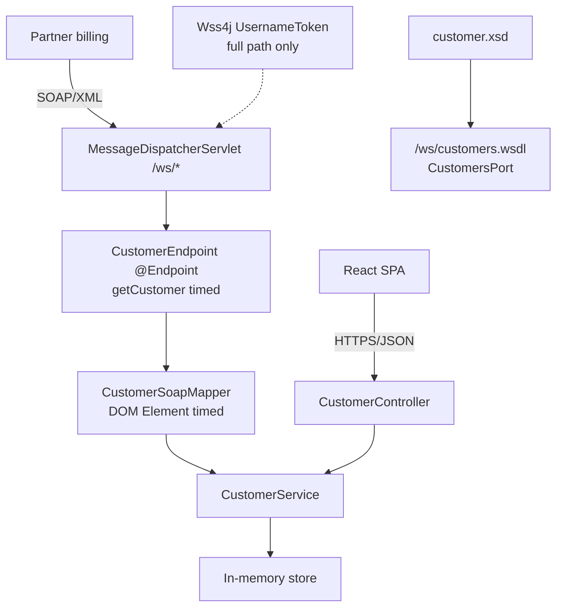

# Lab 24: SOAP Web Service Endpoints — Northstar CRM Spring-WS

> **Participants:** Module sequence is in [`../README.md`](../README.md). **Do not start this guide until** you have finished Module 24 [pre-lab exercises 1–6](../exercises/EXERCISES-INDEX.md) (Pass in your notes; order **1 → 2 → 3 → 4 → 5 → 6**). Then open **one** OS how-to ([Windows](LAB-24-WINDOWS.md) · [macOS](LAB-24-MACOS.md)). In class, prefer the **45-minute timed path** with [`starter/`](starter/README.md); the **full path** is every Step below (homework / extended). Skip `solution/` unless your instructor says otherwise. See [Which file do I open?](../../../_PARTICIPANT-FILE-GUIDE.md).

## Activity card

| | |
| --- | --- |
| **Objective** | Ship contract-first Spring-WS SOAP beside REST, sharing CustomerService |
| **Skills practiced** | Timed: XSD/WSDL, @Endpoint/@PayloadRoot, DOM mapper, getCustomer · Full: JAXB, 4 ops, faults, UsernameToken |
| **Expected outcome** | Timed: WSDL live · getCustomer · REST still works · Full: faults/security evidence |
| **Estimated time** | Timed path ~45 min · Full path 4–5 hours |
| **Prerequisites** | Lab 0 · Lab 23 preferred · Lab 13 contract preferred · Exercises 1–6 Pass · JDK 21 · Maven 3.9+ |
| **Expected files** | `examples/lab24-crm/` — XSD, endpoint, mapper, requests/, tests |
| **Validation checkpoints** | Starter smoke · GUIDE Implementation Checkpoints |

**Module:** 24 — SOAP Web Services with Spring WS  
**Duration:** ~45 minutes (timed path with starter) · Full path: 4–5 Hours

**Primary IDE:** IntelliJ IDEA Community Edition · **Optional IDE:** VS Code

| OS | How-to for this lab |
| -- | ------------------- |
| Windows | [LAB-24-WINDOWS.md](LAB-24-WINDOWS.md) |
| macOS | [LAB-24-MACOS.md](LAB-24-MACOS.md) |

> **Incremental build:** Contract-first → getCustomer PayloadRoot → WSDL → REST share → (full) four ops / JAXB / faults / UsernameToken → Lab 24.

> **Classroom pacing:** [`../PACING.md`](../PACING.md) (Checkpoints A–E).

> **Critical scope (timed):** **Contract-first** XSD with **getCustomer only**. Port type **`CustomersPort`**. **DOM `Element` mapper** (not JAXB/XJC). Thin `@Endpoint` delegates to **one** `CustomerService`. **Keep REST**. **UsernameToken is not wired** in starter/solution timed path.

> **Full path / stretch:** four SOAP operations, JAXB/XJC, `SoapFaultMappingExceptionResolver`, Wss4j UsernameToken — homework only.

## 45-minute timed path (use starter)

In class, use the starter templates so the **core** objectives fit **~45 minutes**. The full Steps below remain for homework / extended depth.

1. Open [`starter/README.md`](starter/README.md).
2. Copy `starter/` into your `java-bootcamp/examples/…` target (see starter README).
3. Fill every `// TODO` — do **not** wait on a perfect prior lab; the starter includes a baseline.
4. Smoke: WSDL + unsecured `requests/get-customer.xml` + REST GET `CUS-1001`. Starter ships **0 tests** until Step 8 (then add tests → **Tests run: 2**).
5. Mark timed-path Pass criteria in the starter README. Continue remaining GUIDE steps as homework if needed.

| Path | Time | Scope |
| ---- | ---- | ----- |
| **Timed (default)** | ~45 min | `WebServiceConfig` + DOM mapper + **getCustomer only** + WSDL/`CustomersPort` + REST still works |
| **Full (extended)** | see Duration | Four ops + JAXB + fault resolver + UsernameToken + Step 8 tests |

---

## What you'll submit (read this first)

Keep this checklist visible while you work.

| # | Deliverable |
| - | ----------- |
| 1 | Timed: `CustomerEndpoint` **getCustomer** only (DOM `Element`) |
| 2 | `customer.xsd` (getCustomer pair) + live WSDL · port type **`CustomersPort`** |
| 3 | Timed: `CustomerSoapMapper` DOM methods · Full: JAXB/XJC optional |
| 4 | Full path: SOAP fault mapping (`SoapFaultMappingExceptionResolver`) |
| 5 | UsernameToken interceptor — **full path only**; timed stays unsecured (not wired) |
| 6 | `requests/get-customer.xml` (+ full-path secured/not-found samples) |
| 7 | Step 8: add `CustomerEndpointTest` + `CrmApplicationTests` (**Tests run: 2**; starter starts at 0) |
| 8 | Evidence that REST and SOAP share `CustomerService` |

**Must submit:** the items in the table above (sources + evidence + short notes).

**Do not submit:** `target/`, `node_modules/`, secrets, heap dumps, or a verbatim instructor `solution/`.

## Lab Overview

This Module 24 lab extends the **Northstar Customer Service Platform** with a contract-first **Spring Web Services** SOAP endpoint beside the Lab 23 REST API. **Timed path:** author/use `customer.xsd` for **getCustomer**, wire `WebServiceConfig` (`CustomersPort`, `/ws/customers.wsdl`), implement `@Endpoint` + DOM `Element` mapper, keep REST on the same `CustomerService`. **UsernameToken is not wired** in starter/solution. **Full path / stretch:** four operations, JAXB/XJC, SOAP fault resolver, and lab-only UsernameToken.

## Learning Objectives

After completing this lab, you will be able to:

* Explain contract-first SOAP and why the XSD—not Java—is the source of truth
* Author a getCustomer XSD and let Spring-WS generate WSDL dynamically from it
* Configure `MessageDispatcherServlet` and `DefaultWsdl11Definition` with port type **`CustomersPort`**
* Implement `@Endpoint` with `@PayloadRoot` / `@RequestPayload` / `@ResponsePayload` for **getCustomer**
* Map SOAP payloads with a **DOM `Element` mapper** (timed) — JAXB/XJC is full-path stretch
* (Full path) Add four ops, fault mapping, and UsernameToken — knowing timed path stays unsecured

## Business Scenario

Northstar CRM already serves REST from `lab23-crm/`. A regional billing partner only integrates via SOAP/XML. Protocol may differ; business rules must not.

Leadership freezes:

**Ship Spring-WS beside REST: live WSDL from XSD, timed path = getCustomer only with DOM mapper (unsecured, `CustomersPort`), same `CustomerService` as REST. Four ops + JAXB + UsernameToken + fault resolver = full path.**

Use these examples consistently:

| ID | Name | Notes |
| -- | ---- | ----- |
| `CUS-1001` | Amina Khan | `ACTIVE` — primary getCustomer |
| `CUS-1002` | Ravi Singh | `PROSPECT` — status updates / list |
| `CUS-9999` | — | not-found SOAP fault |
| `lab24-001` | — | SOAP correlation / log evidence |
| `lab-request-001` | — | REST-path continuity (same platform) |
| `crm-partner` / `lab24-shared-secret` | — | **lab-only** UsernameToken (never real prod) |

**Security note for evidence.** Plaintext PasswordText UsernameToken is lab-only. Production needs TLS + PasswordDigest (or better) and rotated secrets — never commit real partner passwords.

---

## Architecture Context
### NOW (this lab)


```mermaid
flowchart TB
  Partner["Partner billing"] -->|SOAP/XML| MDS["MessageDispatcherServlet /ws/*"]
  MDS --> EP["CustomerEndpoint @Endpoint<br/>getCustomer timed"]
  EP --> Map["CustomerSoapMapper<br/>DOM Element timed"]
  Map --> Svc["CustomerService"]
  Svc --> Repo["In-memory store"]
  UI["React SPA"] -->|HTTPS/JSON| REST["CustomerController"]
  REST --> Svc
  XSD["customer.xsd"] --> WSDL["/ws/customers.wsdl<br/>CustomersPort"]
  WSS["Wss4j UsernameToken<br/>full path only"] -.-> MDS
```

## Prerequisites

Prior labs: [Lab 23](../../module-23/lab23/LAB-23-GUIDE.md).

Confirm (Lab 0 tools assumed):

* JDK 21; Maven; Git
* Working `lab23-crm` (Boot 3, web, actuator, `CustomerService`)
* Lab 13 contract preferred; else use Step 2 XSD (namespace `http://northstar.com/crm/customers`)
* Lab 16 `BusinessException` hierarchy preferred
* Client that can POST raw XML (`curl`)
* No secrets committed to Git

### Pre-flight

```bash
java -version
mvn -version
```

## Worked example (read before you code)

Study this pattern once before Step 1. Your job is to apply the same idea in the Steps — do not skip ahead to a full solution.

```java
import org.springframework.ws.server.endpoint.annotation.PayloadRoot;
import org.springframework.ws.server.endpoint.annotation.RequestPayload;
import org.springframework.ws.server.endpoint.annotation.ResponsePayload;
import org.w3c.dom.Element;

@PayloadRoot(namespace = NAMESPACE, localPart = "GetCustomerRequest")
@ResponsePayload
public Element getCustomer(@RequestPayload Element request) {
  String customerId = mapper.customerIdFromGetRequest(request);
  Customer customer = customerService.get(customerId);
  return mapper.toGetCustomerResponse(customer);
}
```

**What to notice (timed):** DOM `Element` in/out; one operation; port type `CustomersPort`; UsernameToken not wired. Four ops / JAXB / WSS = full path.

---

## Implementation Steps

Complete each step in order. Commands assume `~/java-bootcamp/examples/lab24-crm` (Windows: `%USERPROFILE%\java-bootcamp\examples\lab24-crm`) unless noted.

---

### Step 1 — Branch Lab 23 and confirm Spring-WS dependencies

**Why:** SOAP support is opt-in; the parent BOM must bring WS and WSDL jars before XSD work starts.

**Do this:** Prefer copying the course **starter** (recommended). Or branch Lab 23:

```bash
cd ~/java-bootcamp/examples
cp -r lab23-crm lab24-crm
cd lab24-crm
mkdir -p requests docs
mkdir -p ~/java-bootcamp/notes/screenshots/lab-24
```

Starter already includes `spring-boot-starter-web-services`, `wsdl4j`, and (for full-path stretch) `spring-ws-security` / `spring-ws-test`. **Timed path does not require `jaxb2-maven-plugin` / XJC** — the mapper uses DOM `Element`.

```bash
mvn -q -Dincludes=org.springframework.ws dependency:tree
```

**Expected result:** Spring-WS artifacts on the tree; `BUILD SUCCESS`.

**If it fails:** Version fight with Boot parent → drop explicit WS core version when starter manages it.

---

### Step 2 — Confirm timed `customer.xsd` (getCustomer only)

**Why:** The XSD is the partner contract; WSDL is generated from it.

**Timed path — already in starter:** `src/main/resources/customer.xsd` with namespace `http://northstar.com/crm/customers` and **only** `GetCustomerRequest` / `GetCustomerResponse` (fields: `customerId`, `name`, `email`, `status`). Confirm it; do **not** require JAXB generation.

```xml
<!-- Timed shape (starter) — getCustomer only -->
<xs:element name="GetCustomerRequest">…customerId…</xs:element>
<xs:element name="GetCustomerResponse">…customerId, name, email, status…</xs:element>
<!-- TODO (full path): add CreateCustomer / UpdateStatus / List operations -->
```

**Full path / stretch:** expand XSD to four operations and optionally run XJC (`jaxb2-maven-plugin`) into `com.northstar.crm.endpoint.jaxb`. Timed path stays on DOM.

```bash
# Timed: no generate-sources required
mvn -q -DskipTests compile
# Full path only (if you added XJC plugin + four-op XSD):
# mvn -q generate-sources
```

**Expected result (timed):** XSD compiles with project; getCustomer elements present; **no** XJC output required.  
**Expected result (full path):** optional generated types under `target/generated-sources/xjc/...` if you added the plugin.

**If it fails:** XML schema errors → validate XSD. (Full path) Empty XJC output → plugin `sources` path wrong.

---

### Step 3 — Configure dispatcher servlet and live WSDL

**Why:** Partners need a stable `/ws/customers.wsdl` that cannot drift from the XSD bean.

**Do this:** Complete starter TODOs in `@EnableWs` `WebServiceConfig` — servlet `/ws/*` + WSDL bean name `customers`. Port type must be **`CustomersPort`** (not `CustomerServicePort`).

```java
import org.springframework.boot.web.servlet.ServletRegistrationBean;
import org.springframework.context.ApplicationContext;
import org.springframework.context.annotation.Bean;
import org.springframework.ws.transport.http.MessageDispatcherServlet;
import org.springframework.ws.wsdl.wsdl11.DefaultWsdl11Definition;
import org.springframework.xml.xsd.XsdSchema;

@Bean
ServletRegistrationBean<MessageDispatcherServlet> messageDispatcherServlet(
    ApplicationContext context) {
  MessageDispatcherServlet servlet = new MessageDispatcherServlet();
  servlet.setApplicationContext(context);
  servlet.setTransformWsdlLocations(true);
  return new ServletRegistrationBean<>(servlet, "/ws/*");
}

@Bean(name = "customers")
DefaultWsdl11Definition defaultWsdl11Definition(XsdSchema customersSchema) {
  DefaultWsdl11Definition definition = new DefaultWsdl11Definition();
  definition.setPortTypeName("CustomersPort");
  definition.setLocationUri("/ws");
  definition.setTargetNamespace("http://northstar.com/crm/customers");
  definition.setSchema(customersSchema);
  return definition;
}

@Bean
XsdSchema customersSchema() {
  return new SimpleXsdSchema(new ClassPathResource("customer.xsd"));
}
```

```bash
mvn spring-boot:run
curl -s http://localhost:8080/ws/customers.wsdl | head -20
```

**Expected result:** WSDL with targetNamespace; timed path shows **getCustomer** operation and port type **CustomersPort**.

**If it fails:** 404 on WSDL → bean name must be `customers` for `/ws/customers.wsdl`. XSD not found → file under `src/main/resources`. Servlet not mapped → check `/ws/*` registration.
---

### Step 4 — Implement DOM mapper + `CustomerEndpoint` (getCustomer)

**Why:** Keep XML mapping out of the service layer; route payloads to the shared `CustomerService` only.

**Timed path:** Implement starter TODOs in `CustomerSoapMapper` (`customerIdFromGetRequest` / `toGetCustomerResponse` using DOM `Element`) and `@Endpoint CustomerEndpoint` with **one** `@PayloadRoot` for `GetCustomerRequest` → `customerService.get(id)`. Seeds (`CUS-1001` / `CUS-1002`) come from the shared service (same as REST).

**Full path / stretch:** add create/updateStatus/list `@PayloadRoot` methods and/or switch mapper to JAXB types from XJC.

```bash
curl -s -X POST http://localhost:8080/ws \
  -H "Content-Type: text/xml; charset=utf-8" \
  --data @requests/get-customer.xml
curl -s http://localhost:8080/api/customers/CUS-1001
```

**Expected result:** Unsecured POST get for `CUS-1001` returns Amina; REST GET still works; mapper unused by REST controller. **UsernameToken is not wired** — unsecured XML succeeds on timed path.

**If it fails:** Namespace / localPart mismatch → DEBUG `org.springframework.ws`. Domain getters differ → adapt mapper to `id`/`name`/`email`/`status`.

---

### Step 5 — SOAP fault mapping — **full path / stretch**

**Why:** SOAP and REST should report the same business errors; faults must not leak stacks.

**Timed path:** skip — missing ID may surface as a server fault / exception from `IllegalArgumentException`; documenting that is enough for class.

**Full path:** Register `SoapFaultMappingExceptionResolver` mapping not-found/duplicate to `CLIENT` faults; author `requests/get-customer-not-found.xml`.

```bash
# full path only
curl -s -X POST http://localhost:8080/ws \
  -H "Content-Type: text/xml; charset=utf-8" \
  --data @requests/get-customer-not-found.xml
```

**Expected result (full path):** Faultcode Client; faultstring like `Customer not found`; no stack in body.

**If it fails:** Always “Unexpected server error” → FQCN keys in mappings must match thrown type.

---

### Step 6 — UsernameToken interceptor (WS-Security) — **full path only**

**Why:** Message-level identity proves the sender beyond open HTTP; partners often require it even behind TLS.

**Timed path / starter / solution:** UsernameToken is **not wired**. Unsecured `requests/get-customer.xml` is the class smoke. Do **not** fail the timed path for missing WSS.

**Full path homework:** `Wss4jSecurityInterceptor` with `ValidationActions=UsernameToken` and `SimplePasswordValidationCallbackHandler` users map `crm-partner` → `lab24-shared-secret` (lab-only). Author `requests/get-customer-secured.xml`.

```bash
# full path only — expect reject without token after interceptor is registered:
curl -s -X POST http://localhost:8080/ws -H "Content-Type: text/xml; charset=utf-8" \
  --data @requests/get-customer.xml
# expect getCustomerResponse for CUS-1001:
curl -s -X POST http://localhost:8080/ws -H "Content-Type: text/xml; charset=utf-8" \
  --data @requests/get-customer-secured.xml
```

**Expected result (full path):** Unsecured request faults on security header; secured get returns `CUS-1001` / Amina.  
**Expected result (timed):** N/A — leave interceptor unregistered.

**If it fails:** Namespace typo in `wsse` → WSS4J reject. Wrong Content-Type → parser rejects. Password map mismatch → case-sensitive fix.

---

### Step 7 — Prove REST and SOAP share rules

**Why:** Leadership’s acceptance is “one service, two protocols,” not a second domain fork.

**Do this (timed):** SOAP get `CUS-1001` then REST GET same id (or reverse). Document in `docs/soap-notes.md`. Full path may also create/update via SOAP and show status on both.

**Expected result:** Same customer data on both protocols from one `CustomerService`.

**If it fails:** Two stores → endpoint not using injected service. Different ID schemes → align fixtures.

---

### Step 8 — Add tests (`CustomerEndpointTest` + `CrmApplicationTests`)

**Why:** Partner regressions must fail in Surefire without a full manual SoapUI session every time.

**Note:** Starter ships **2** failing TODO stubs (`CrmApplicationTests`, `CustomerEndpointTest`). Replace stubs in this Step → **Tests run: 2** PASS. Solution has **2** tests after this Step.

**Do this:** Add:

1. `CustomerEndpointTest` with `MockWebServiceClient` — method `getCustomerReturnsCus1001`
2. `CrmApplicationTests` — method `contextLoadsAndRestSeedVisible` (seeded `CUS-1001` via service)

Keep `requests/get-customer.xml`. Document WSDL URL; note UsernameToken is full-path only / not wired on timed path.

```bash
mvn -B test
mvn -B test
```

**Expected result (after Step 8):** **Tests run: 2** · dual green; WSDL + get-customer evidence saved.

**If it fails:** Context missing WS beans → `@SpringBootTest` on Boot app. Payload namespace mismatch → fix StringSource XML.

---

### Step 9 — Failure experiments + evidence pack

**Why:** Integration teams learn more from fault taxonomy than from green paths alone.

**Do this:** Complete Failure Experiments appropriate to your path. Timed: WSDL snippet, unsecured get response, REST still works. Full path: also secured response, not-found fault, missing-token fault. `git status` clean of `target/` and real secrets.

**Expected result:** ≥3 experiments; evidence pack complete; no plaintext prod secrets in Git.

**If it fails:** See Troubleshooting.
---

## Implementation Checkpoints

### Checkpoint A — Tooling (timed)

_Mark **Pass** or **Fail** in your lab notes._

| # | Confirm | Your notes |
| - | ------- | ---------- |
| 1 | `lab24-crm` under `examples/` (starter copy preferred) | Pass / Fail |
| 2 | Spring-WS + `wsdl4j` present (JAXB/XJC **not** required timed) | Pass / Fail |
| 3 | Timed `customer.xsd` has getCustomer request/response only | Pass / Fail |

### Checkpoint B — Contract + endpoint (timed)

_Mark **Pass** or **Fail** in your lab notes._

| # | Confirm | Your notes |
| - | ------- | ---------- |
| 1 | Live `/ws/customers.wsdl` with port type **`CustomersPort`** + getCustomer | Pass / Fail |
| 2 | `CustomerEndpoint` getCustomer delegates to `CustomerService` | Pass / Fail |
| 3 | DOM `CustomerSoapMapper` keeps XML out of service/REST layers | Pass / Fail |

### Checkpoint C — Faults + security

_Mark **Pass** or **Fail** in your lab notes._

| # | Confirm | Your notes |
| - | ------- | ---------- |
| 1 | Fault resolver / CLIENT not-found — **full path** | Pass / Fail / N/A timed |
| 2 | Missing UsernameToken rejected — **full path only** (not wired timed) | Pass / Fail / N/A timed |
| 3 | Timed: unsecured get `CUS-1001` works · Full: secured get succeeds | Pass / Fail |

### Checkpoint D — Hygiene

_Mark **Pass** or **Fail** in your lab notes._

| # | Confirm | Your notes |
| - | ------- | ---------- |
| 1 | After Step 8: two consecutive `mvn test` → **Tests run: 2** (before Step 8 may be 0) | Pass / Fail |
| 2 | REST and SOAP share one service proof | Pass / Fail |
| 3 | No secrets / `target/` committed; UsernameToken marked lab-only / not wired timed | Pass / Fail |
---

## Reference Commands, Configuration, and Code

### POM dependencies (excerpt)

```xml
<dependency>
  <groupId>org.springframework.boot</groupId>
  <artifactId>spring-boot-starter-web-services</artifactId>
</dependency>
<dependency>
  <groupId>wsdl4j</groupId>
  <artifactId>wsdl4j</artifactId>
</dependency>
<dependency>
  <groupId>org.springframework.ws</groupId>
  <artifactId>spring-ws-security</artifactId>
</dependency>
<dependency>
  <groupId>org.springframework.ws</groupId>
  <artifactId>spring-ws-test</artifactId>
  <scope>test</scope>
</dependency>
```

### WSDL / curl

```bash
cd ~/java-bootcamp/examples/lab24-crm
# Timed: no generate-sources / XJC required
mvn spring-boot:run
curl -s http://localhost:8080/ws/customers.wsdl | grep "wsdl:operation"
curl -s -X POST http://localhost:8080/ws \
  -H "Content-Type: text/xml; charset=utf-8" \
  --data @requests/get-customer.xml
# REST still works against same service:
curl -s http://localhost:8080/api/customers/CUS-1001
# After Step 8 (replace starter TODO stubs):
mvn -B test
# Full path only:
# curl … --data @requests/get-customer-secured.xml
# curl … --data @requests/get-customer-not-found.xml
```

## Failure Experiments

| # | Experiment | Observe | Restore |
| - | ---------- | ------- | ------- |
| 1 | App stopped; POST SOAP | Connection refused | Start app; discuss partner backoff |
| 2 | get `CUS-9999` | Timed: exception/fault · Full: CLIENT fault if resolver added | Keep mapping |
| 3 | Malformed XML (cut tag) | Parse/fault failure | Fix file |
| 4 | Double createCustomer | Full path only | Document partner guidance |
| 5 | get-customer.xml without security | Timed: **succeeds** (UsernameToken not wired) · Full: security fault | Document path |

---

## Troubleshooting

| Symptom | Likely cause | Fix |
| ------- | ------------ | --- |
| WSDL 404 | Bean name ≠ `customers` | Rename WSDL definition bean |
| `@PayloadRoot` never matches | Namespace/localPart drift | Exact URI + element name; enable WS DEBUG |
| Generic SERVER fault | Unmapped / wrapped exception | Map FQCN; avoid wrapping |
| WSS rejects valid-looking XML | Wrong wsse URI / password / Content-Type | Copy secured sample exactly |
| Expecting JAXB/XJC on timed path | Wrong scope | Use DOM `Element` mapper |
| Port type `CustomerServicePort` | Starter/solution use **`CustomersPort`** | Fix `setPortTypeName` |
| REST/SOAP diverge | Two services/stores | One injected `CustomerService` |
| TODO stub failures before Step 8 | Starter ships fail("TODO") stubs | Replace stubs → Tests run: 2 PASS |
| Working in `module-24-exercises` for the lab | Wrong project | Lab lives in `examples/lab24-crm` |
| Deleted REST controller “to focus on SOAP” | Scope misunderstanding | Keep both protocols |
| Failing timed path for missing UsernameToken | Not wired in starter/solution | Full-path homework only |

## Security and Production Review

Optional — jot brief notes in your README if useful for your progress check (not a separate essay):

1. Which SOAP fields are untrusted and where validated?
2. Is UsernameToken enough without HTTPS?
3. Is plaintext PasswordText acceptable outside the lab? What replaces it?

---


## Cleanup

```bash
cd ~/java-bootcamp/examples/lab24-crm
# Ctrl+C spring-boot:run
mvn -q clean
git status
```

Do not commit `target/` or real secrets. Keep `requests/` samples with **lab** credentials only if course policy allows — never production passwords.

**Keep `lab24-crm`**—Lab 25 refactors layering under the same service contract.


## Reflection Questions

Write **1–3 sentence** answers (not essays):

1. Which design decision most affected correctness (contract-first)?
2. What evidence proves SOAP and REST share rules?
3. Which failure was hardest to diagnose (payload root vs WSS)?

---


