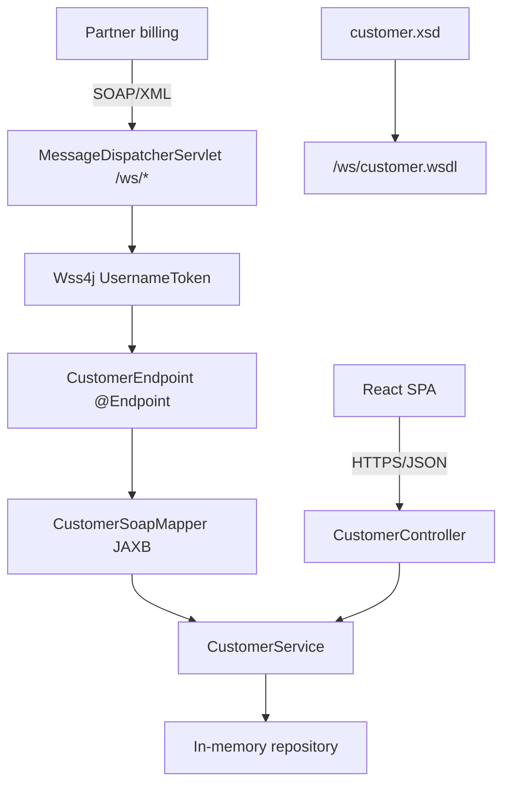

# Lab 24: SOAP Web Service Endpoints — Northstar CRM Spring-WS

> **Participants:** Module sequence is in [`../README.md`](../README.md). **Do not start this guide until** you have finished Module 24 [pre-lab exercises 1–6](../exercises/EXERCISES-INDEX.md) (Pass in your notes; order **1 → 2 → 3 → 4 → 5 → 6**). Then open **one** OS how-to ([Windows](LAB-24-WINDOWS.md) · [macOS](LAB-24-MACOS.md)). In class, prefer the **45-minute timed path** with [`starter/`](starter/README.md); the **full path** is every Step below (homework / extended). Skip `solution/` unless your instructor says otherwise. See [Which file do I open?](../../../_PARTICIPANT-FILE-GUIDE.md).

## Activity card

| | |
| --- | --- |
| **Objective** | Ship contract-first Spring-WS SOAP beside REST, sharing CustomerService |
| **Skills practiced** | XSD/WSDL, @Endpoint/@PayloadRoot, mapper, SOAP faults, UsernameToken |
| **Expected outcome** | WSDL live · getCustomer works · REST still works · faults/security evidence |
| **Estimated time** | Timed path ~45 min · Full path 4–5 hours |
| **Prerequisites** | Lab 0 · Lab 23 preferred · Lab 13 contract preferred · Exercises 1–6 Pass · JDK 21 · Maven 3.9+ |
| **Expected files** | `examples/lab24-crm/` — XSD, endpoint, mapper, requests/, tests |
| **Validation checkpoints** | Starter smoke · GUIDE Implementation Checkpoints |

**Module:** 24 — SOAP Web Services with Spring WS  
**Duration:** ~45 minutes (timed path with starter) · Full path: 4–5 Hours

**Primary IDE:** IntelliJ IDEA Community Edition · **Optional IDE:** VS Code

| OS | How-to for this lab |
| -- | ------------------- |
| Windows | [LAB-24-WINDOWS.md](LAB-24-WINDOWS.md) |
| macOS | [LAB-24-MACOS.md](LAB-24-MACOS.md) |

> **Incremental build:** Contract-first → ops map → PayloadRoot → fault vs REST → UsernameToken → Lab 24.

> **Classroom pacing:** [`../PACING.md`](../PACING.md) (Checkpoints A–E).

> **Critical scope:** **Contract-first** XSD. **Keep REST**. Thin `@Endpoint` delegates to **one** `CustomerService`. **UsernameToken** lab security only — not JWT (Lab 28) or full WS-Security suite.

## 45-minute timed path (use starter)

In class, use the starter templates so the **core** objectives fit **~45 minutes**. The full Steps below remain for homework / extended depth.

1. Open [`starter/README.md`](starter/README.md).
2. Copy `starter/` into your `java-bootcamp/examples/…` target (see starter README).
3. Fill every `// TODO` — do **not** wait on a perfect prior lab; the starter includes a baseline.
4. Run the starter smoke test; evidence under `notes/screenshots/lab-24/`.
5. Mark timed-path Pass criteria in the starter README. Continue remaining GUIDE steps as homework if needed.

| Path | Time | Scope |
| ---- | ---- | ----- |
| **Timed (default)** | ~45 min | Starter TODOs + smoke test |
| **Full (extended)** | see Duration | Every Step in this GUIDE |

---

## What you'll submit (read this first)

Keep this checklist visible while you work.

| # | Deliverable |
| - | ----------- |
| 1 | `CustomerEndpoint` with four SOAP operations |
| 2 | `customer.xsd` + live-generated WSDL |
| 3 | JAXB generation + `CustomerSoapMapper` |
| 4 | SOAP fault mapping to business exceptions |
| 5 | Working UsernameToken interceptor (lab secret) |
| 6 | `requests/` sample XML + fault cases |
| 7 | `CustomerEndpointTest` green twice |
| 8 | Evidence that REST and SOAP share `CustomerService` |

**Must submit:** the items in the table above (sources + evidence + short notes).

**Do not submit:** `target/`, `node_modules/`, secrets, heap dumps, or a verbatim instructor `solution/`.

## Lab Overview

This Module 24 lab extends the **Northstar Customer Service Platform** with a contract-first **Spring Web Services** SOAP endpoint beside the Lab 23 REST API. You author `customer.xsd`, generate JAXB types, implement `CustomerEndpoint`, serve a live WSDL, map business faults, and add a minimal WS-Security **UsernameToken** — all while delegating to the same `CustomerService` so protocol never forks business rules.

## Learning Objectives

After completing this lab, you will be able to:

* Explain contract-first SOAP and why the XSD—not Java—is the source of truth
* Author an XSD and let Spring-WS generate WSDL dynamically from it
* Generate JAXB request/response classes with `jaxb2-maven-plugin`
* Implement `@Endpoint` with `@PayloadRoot` / `@RequestPayload` / `@ResponsePayload`
* Configure `MessageDispatcherServlet` and `DefaultWsdl11Definition`

## Business Scenario

Northstar CRM already serves REST from `lab23-crm/`. A regional billing partner only integrates via SOAP/XML and must create, get, update status, and list customers using the Lab 13 contract. Protocol may differ; business rules must not.

Leadership freezes:

**Ship Spring-WS beside REST: live WSDL from XSD, four operations, CLIENT faults for not-found/duplicate, UsernameToken required, same `CustomerService` as REST.**

Use these examples consistently:

| ID | Name | Notes |
| -- | ---- | ----- |
| `CUS-1001` | Amina Khan | `ACTIVE` — primary getCustomer |
| `CUS-1002` | Ravi Singh | `PROSPECT` — status updates / list |
| `CUS-9999` | — | not-found SOAP fault |
| `lab24-001` | — | SOAP correlation / log evidence |
| `lab-request-001` | — | REST-path continuity (same platform) |
| `crm-partner` / `lab24-shared-secret` | — | **lab-only** UsernameToken (never real prod) |

**Security note for evidence.** Plaintext PasswordText UsernameToken is lab-only. Production needs TLS + PasswordDigest (or better) and rotated secrets — never commit real partner passwords.

---

## Architecture Context
### NOW (this lab)


```mermaid
flowchart TB
  Partner["Partner billing"] -->|SOAP/XML| MDS["MessageDispatcherServlet /ws/*"]
  MDS --> WSS["Wss4j UsernameToken"]
  WSS --> EP["CustomerEndpoint @Endpoint"]
  EP --> Map["CustomerSoapMapper JAXB"]
  Map --> Svc["CustomerService"]
  Svc --> Repo["In-memory repository"]
  UI["React SPA"] -->|HTTPS/JSON| REST["CustomerController"]
  REST --> Svc
  XSD["customer.xsd"] --> WSDL["/ws/customer.wsdl"]
```

## Prerequisites

Prior labs: [Lab 23](../../module-23/lab23/LAB-23-GUIDE.md).

Confirm (Lab 0 tools assumed):

* JDK 21; Maven; Git
* Working `lab23-crm` (Boot 3, web, actuator, `CustomerService`)
* Lab 13 contract preferred; else use Step 2 XSD (namespace `http://northstar.com/crm/customer`)
* Lab 16 `BusinessException` hierarchy preferred
* Client that can POST raw XML (`curl`)
* No secrets committed to Git

### Pre-flight

```bash
java -version
mvn -version
```

## Worked example (read before you code)

Study this pattern once before Step 1. Your job is to apply the same idea in the Steps — do not skip ahead to a full solution.

```xml
<?xml version="1.0" encoding="UTF-8"?>
<xs:schema xmlns:xs="http://www.w3.org/2001/XMLSchema"
           xmlns:tns="http://northstar.com/crm/customer"
           targetNamespace="http://northstar.com/crm/customer"
           elementFormDefault="qualified">
  <xs:simpleType name="CustomerStatus">
    <xs:restriction base="xs:string">
      <xs:enumeration value="PROSPECT"/>
      <xs:enumeration value="ACTIVE"/>
      <xs:enumeration value="SUSPENDED"/>
      <xs:enumeration value="CLOSED"/>
    </xs:restriction>
  </xs:simpleType>
  <xs:complexType name="CustomerType">
    <xs:sequence>
      <xs:element name="customerId" type="xs:string"/>
      <xs:element name="fullName" type="xs:string"/>
      <xs:element name="email" type="xs:string"/>
      <xs:element name="phone" type="xs:string" minOccurs="0"/>
      <xs:element name="status" type="tns:CustomerStatus"/>
      <xs:element name="createdAt" type="xs:dateTime"/>
    </xs:sequence>
  </xs:complexType>
  <!-- request/response pairs: createCustomer, getCustomer,
       updateCustomerStatus, listCustomers (see module materials) -->
</xs:schema>
```

**What to notice:** Match names, IDs, and failure behavior from the scenario — instructors check these.

---

## Implementation Steps

Complete each step in order. Commands assume `~/java-bootcamp/examples/lab24-crm` (Windows: `%USERPROFILE%\java-bootcamp\examples\lab24-crm`) unless noted.

---

### Step 1 — Branch Lab 23 and add Spring-WS dependencies

**Why:** SOAP support is opt-in; the parent BOM must bring WS, WSDL, security, and test jars before XSD work starts.

**Do this:**

```bash
cd ~/java-bootcamp/examples
cp -r lab23-crm lab24-crm
cd lab24-crm
mkdir -p requests docs
mkdir -p ~/java-bootcamp/notes/screenshots/lab-24
```

Add `spring-boot-starter-web-services`, `wsdl4j`, `spring-ws-security`, `spring-ws-test` (test), and `jaxb2-maven-plugin` sourcing `customer.xsd` into package `com.northstar.crm.endpoint.jaxb`.

```bash
mvn -q -Dincludes=org.springframework.ws dependency:tree
```

**Expected result:** Spring-WS artifacts on the tree; `BUILD SUCCESS`.

**If it fails:** Version fight with Boot parent → drop explicit WS core version when starter manages it. Plugin not running → confirm `<executions>` with goal `xjc` after XSD exists (Step 2).

---

### Step 2 — Author `customer.xsd` and generate JAXB

**Why:** The XSD is the partner contract; generated Java must follow it, not the other way around.

**Do this:** Place `src/main/resources/customer.xsd` with namespace `http://northstar.com/crm/customer`. Minimum shape (align with Lab 13):

```xml
<?xml version="1.0" encoding="UTF-8"?>
<xs:schema xmlns:xs="http://www.w3.org/2001/XMLSchema"
           xmlns:tns="http://northstar.com/crm/customer"
           targetNamespace="http://northstar.com/crm/customer"
           elementFormDefault="qualified">
  <xs:simpleType name="CustomerStatus">
    <xs:restriction base="xs:string">
      <xs:enumeration value="PROSPECT"/>
      <xs:enumeration value="ACTIVE"/>
      <xs:enumeration value="SUSPENDED"/>
      <xs:enumeration value="CLOSED"/>
    </xs:restriction>
  </xs:simpleType>
  <xs:complexType name="CustomerType">
    <xs:sequence>
      <xs:element name="customerId" type="xs:string"/>
      <xs:element name="fullName" type="xs:string"/>
      <xs:element name="email" type="xs:string"/>
      <xs:element name="phone" type="xs:string" minOccurs="0"/>
      <xs:element name="status" type="tns:CustomerStatus"/>
      <xs:element name="createdAt" type="xs:dateTime"/>
    </xs:sequence>
  </xs:complexType>
  <!-- request/response pairs: createCustomer, getCustomer,
       updateCustomerStatus, listCustomers (see module materials) -->
</xs:schema>
```

Complete all four request/response element pairs as in Lab 13 (or the full schema in course samples). Then:

```bash
mvn -q generate-sources
```

**Expected result:** Types under `target/generated-sources/xjc/.../GetCustomerRequest.java` etc.; generate success.

**If it fails:** XML schema errors → validate XSD. Empty output → plugin `sources` path wrong. IDE missing generated sources → add generated-sources folder to IDE or rely on Maven compile.

---

### Step 3 — Configure dispatcher servlet and live WSDL

**Why:** Partners need a stable `/ws/customer.wsdl` that cannot drift from the XSD bean.

**Do this:** `@EnableWs` `WebServiceConfig` with servlet + WSDL definition:

```java
@Bean
ServletRegistrationBean<MessageDispatcherServlet> messageDispatcherServlet(
    ApplicationContext context) {
  MessageDispatcherServlet servlet = new MessageDispatcherServlet();
  servlet.setApplicationContext(context);
  servlet.setTransformWsdlLocations(true);
  return new ServletRegistrationBean<>(servlet, "/ws/*");
}

@Bean(name = "customer")
DefaultWsdl11Definition defaultWsdl11Definition(XsdSchema customerSchema) {
  DefaultWsdl11Definition definition = new DefaultWsdl11Definition();
  definition.setPortTypeName("CustomerServicePort");
  definition.setLocationUri("/ws");
  definition.setTargetNamespace("http://northstar.com/crm/customer");
  definition.setSchema(customerSchema);
  return definition;
}

@Bean
XsdSchema customerSchema() {
  return new SimpleXsdSchema(new ClassPathResource("customer.xsd"));
}
```

```bash
mvn spring-boot:run
curl -s http://localhost:8080/ws/customer.wsdl | head -20
```

**Expected result:** WSDL definitions with targetNamespace; operations visible via `grep wsdl:operation`.

**If it fails:** 404 on WSDL → bean name must be `customer` for `/ws/customer.wsdl`. XSD not found → file under `src/main/resources`. Servlet not mapped → check `/ws/*` registration.
---

### Step 4 — Map JAXB types and implement `CustomerEndpoint`

**Why:** Keep JAXB out of the service layer; route payloads to Lab 23 business methods only.

**Do this:** Implement `CustomerSoapMapper.toSoap(Customer)` (status + UTC `createdAt`). Implement `@Endpoint CustomerEndpoint` with four `@PayloadRoot` methods for create/get/updateStatus/list, constructing JAXB responses after service calls.

Seed or create Amina/Ravi so get works (REST create from Lab 23 or SOAP create).

**Expected result:** Secured/unsecured wiring still pending; unsecured POST get for `CUS-1001` returns Amina once data exists (may temporarily work before Step 6 interceptor). Mapper unused by REST controller.

**If it fails:** Namespace / localPart mismatch → DEBUG `org.springframework.ws`. Domain getters differ → adapt mapper to your Lab 23 entity. Service method names differ → call your actual Lab 23 API without reinventing rules.

---

### Step 5 — Share exceptions and map SOAP faults

**Why:** SOAP and REST must report the same business errors; faults must not leak stacks.

**Do this:** Reuse or add `BusinessException` / `CustomerNotFoundException` / `DuplicateCustomerException`. Register `SoapFaultMappingExceptionResolver` mapping not-found and duplicate to `CLIENT` faults; default `SERVER` with generic string.

```bash
curl -s -X POST http://localhost:8080/ws \
  -H "Content-Type: text/xml; charset=utf-8" \
  --data @requests/get-customer-not-found.xml
```

**Expected result:** Faultcode Client (or SOAP-ENV:Client); faultstring like `Customer not found`; no stack in body.

**If it fails:** Always “Unexpected server error” → FQCN keys in mappings must match thrown type (wrapping hides mappings). HTTP 500 with empty body → check resolver bean registration/order.

---

### Step 6 — UsernameToken interceptor (WS-Security)

**Why:** Message-level identity proves the sender beyond open HTTP; partners often require it even behind TLS.

**Do this:** `Wss4jSecurityInterceptor` with `ValidationActions=UsernameToken` and `SimplePasswordValidationCallbackHandler` users map `crm-partner` → `lab24-shared-secret` (lab-only). Implement `WsConfigurer.addInterceptors`. Author `requests/get-customer-secured.xml` with `wsse:Security` / UsernameToken PasswordText.

```bash
# expect reject:
curl -s -X POST http://localhost:8080/ws -H "Content-Type: text/xml; charset=utf-8" \
  --data @requests/get-customer.xml

# expect getCustomerResponse for CUS-1001:
curl -s -X POST http://localhost:8080/ws -H "Content-Type: text/xml; charset=utf-8" \
  --data @requests/get-customer-secured.xml
```

Log correlation `lab24-001` on service path where practical.

**Expected result:** Unsecured request faults on security header; secured get returns `CUS-1001` / Amina.

**If it fails:** Namespace typo in `wsse` → WSS4J reject. Wrong Content-Type → parser rejects. Password map mismatch → case-sensitive fix. Forgot to register interceptor → requests still succeed unsecured (fail the lab intent).

---

### Step 7 — Prove REST and SOAP share rules

**Why:** Leadership’s acceptance is “one service, two protocols,” not a second domain fork.

**Do this:** Create/update via SOAP; GET same customer via REST (or reverse). Show `CUS-1002` status change visible on both. Document in `docs/soap-notes.md`.

**Expected result:** Same `customerId`/status on both protocols after one write path.

**If it fails:** Two stores → endpoint not using injected Lab 23 service. Different ID schemes → align fixtures.

---

### Step 8 — Automate with `MockWebServiceClient` + runbook

**Why:** Partner regressions must fail in Surefire without requiring a full manual SoapUI session every time.

**Do this:** `CustomerEndpointTest` with `MockWebServiceClient.createClient(applicationContext)`; assert get payload for `CUS-1001`. Save request XML files under `requests/`. README: WSDL URL, secured curl, not-found fault, UsernameToken lab caveat.

```bash
mvn -q test
mvn -q test
```

**Expected result:** Dual green tests; request files and WSDL curl evidence saved.

**If it fails:** Context missing WS beans → `@SpringBootTest` on Boot app. Payload namespace mismatch → fix StringSource XML. Security interceptor blocks Mock client → configure test to send token or exclude interceptor in test profile and document trade-off.

---

### Step 9 — Failure experiments + evidence pack

**Why:** Integration teams learn more from fault taxonomy than from green paths alone.

**Do this:** Complete Failure Experiments. Capture WSDL snippet, secured response, not-found fault, missing-token fault under `notes/screenshots/lab-24/`. `git status` clean of `target/` and real secrets.

**Expected result:** ≥3 experiments; evidence pack complete; no plaintext prod secrets in Git.

**If it fails:** See Troubleshooting.

---

## Implementation Checkpoints

### Checkpoint A — Tooling

_Mark **Pass** or **Fail** in your lab notes._

| # | Confirm | Your notes |
| - | ------- | ---------- |
| 1 | `lab24-crm` copied from Lab 23 under `examples/` | Pass / Fail |
| 2 | Spring-WS + jaxb2 + security dependencies present | Pass / Fail |
| 3 | `customer.xsd` generates JAXB types | Pass / Fail |

### Checkpoint B — Contract + endpoint

_Mark **Pass** or **Fail** in your lab notes._

| # | Confirm | Your notes |
| - | ------- | ---------- |
| 1 | Live `/ws/customer.wsdl` lists four operations | Pass / Fail |
| 2 | `CustomerEndpoint` delegates to `CustomerService` | Pass / Fail |
| 3 | Mapper keeps JAXB out of service/REST layers | Pass / Fail |

### Checkpoint C — Faults + security

_Mark **Pass** or **Fail** in your lab notes._

| # | Confirm | Your notes |
| - | ------- | ---------- |
| 1 | Not-found yields CLIENT fault | Pass / Fail |
| 2 | Missing UsernameToken rejected | Pass / Fail |
| 3 | Secured get of `CUS-1001` succeeds (`lab24-001` evidenced) | Pass / Fail |

### Checkpoint D — Hygiene

_Mark **Pass** or **Fail** in your lab notes._

| # | Confirm | Your notes |
| - | ------- | ---------- |
| 1 | Two consecutive `mvn test` identical success | Pass / Fail |
| 2 | REST and SOAP share one service proof | Pass / Fail |
| 3 | No secrets / `target/` committed; UsernameToken marked lab-only | Pass / Fail |

---

## Reference Commands, Configuration, and Code

### POM dependencies (excerpt)

```xml
<dependency>
  <groupId>org.springframework.boot</groupId>
  <artifactId>spring-boot-starter-web-services</artifactId>
</dependency>
<dependency>
  <groupId>wsdl4j</groupId>
  <artifactId>wsdl4j</artifactId>
</dependency>
<dependency>
  <groupId>org.springframework.ws</groupId>
  <artifactId>spring-ws-security</artifactId>
</dependency>
<dependency>
  <groupId>org.springframework.ws</groupId>
  <artifactId>spring-ws-test</artifactId>
  <scope>test</scope>
</dependency>
```

### WSDL / curl

```bash
cd ~/java-bootcamp/examples/lab24-crm
mvn -q generate-sources
mvn spring-boot:run
curl -s http://localhost:8080/ws/customer.wsdl | grep "wsdl:operation"
curl -s -X POST http://localhost:8080/ws \
  -H "Content-Type: text/xml; charset=utf-8" \
  --data @requests/get-customer.xml
curl -s -X POST http://localhost:8080/ws \
  -H "Content-Type: text/xml; charset=utf-8" \
  --data @requests/get-customer-secured.xml
curl -s -X POST http://localhost:8080/ws \
  -H "Content-Type: text/xml; charset=utf-8" \
  --data @requests/get-customer-not-found.xml
# REST still works against same service:
curl -s http://localhost:8080/api/customers/CUS-1001
mvn -q test
mvn -q test
```

## Failure Experiments

| # | Experiment | Observe | Restore |
| - | ---------- | ------- | ------- |
| 1 | App stopped; POST SOAP | Connection refused | Start app; discuss partner backoff |
| 2 | get `CUS-9999` | CLIENT fault | Keep mapping |
| 3 | Malformed XML (cut tag) | Parse/fault failure | Fix file |
| 4 | Double createCustomer | Non-idempotent duplicates | Document partner guidance |
| 5 | get-customer.xml without security | Security fault; no business hit | Use secured file |

---

## Troubleshooting

| Symptom | Likely cause | Fix |
| ------- | ------------ | --- |
| WSDL 404 | Bean name ≠ `customer` | Rename WSDL definition bean |
| `@PayloadRoot` never matches | Namespace/localPart drift | Exact URI + element name; enable WS DEBUG |
| Generic SERVER fault | Unmapped / wrapped exception | Map FQCN; avoid wrapping |
| WSS rejects valid-looking XML | Wrong wsse URI / password / Content-Type | Copy secured sample exactly |
| XJC empty | Plugin source path | Point at `src/main/resources/customer.xsd` |
| REST/SOAP diverge | Two services/stores | One injected `CustomerService` |
| Working in `module-24-exercises` for the lab | Wrong project | Lab lives in `examples/lab24-crm` |
| Deleted REST controller “to focus on SOAP” | Scope misunderstanding | Keep both protocols |

## Security and Production Review

Optional — jot brief notes in your README if useful for your progress check (not a separate essay):

1. Which SOAP fields are untrusted and where validated?
2. Is UsernameToken enough without HTTPS?
3. Is plaintext PasswordText acceptable outside the lab? What replaces it?

---


## Cleanup

```bash
cd ~/java-bootcamp/examples/lab24-crm
# Ctrl+C spring-boot:run
mvn -q clean
git status
```

Do not commit `target/` or real secrets. Keep `requests/` samples with **lab** credentials only if course policy allows — never production passwords.

**Keep `lab24-crm`**—Lab 25 refactors layering under the same service contract.


## Reflection Questions

Write **1–3 sentence** answers (not essays):

1. Which design decision most affected correctness (contract-first)?
2. What evidence proves SOAP and REST share rules?
3. Which failure was hardest to diagnose (payload root vs WSS)?

---


