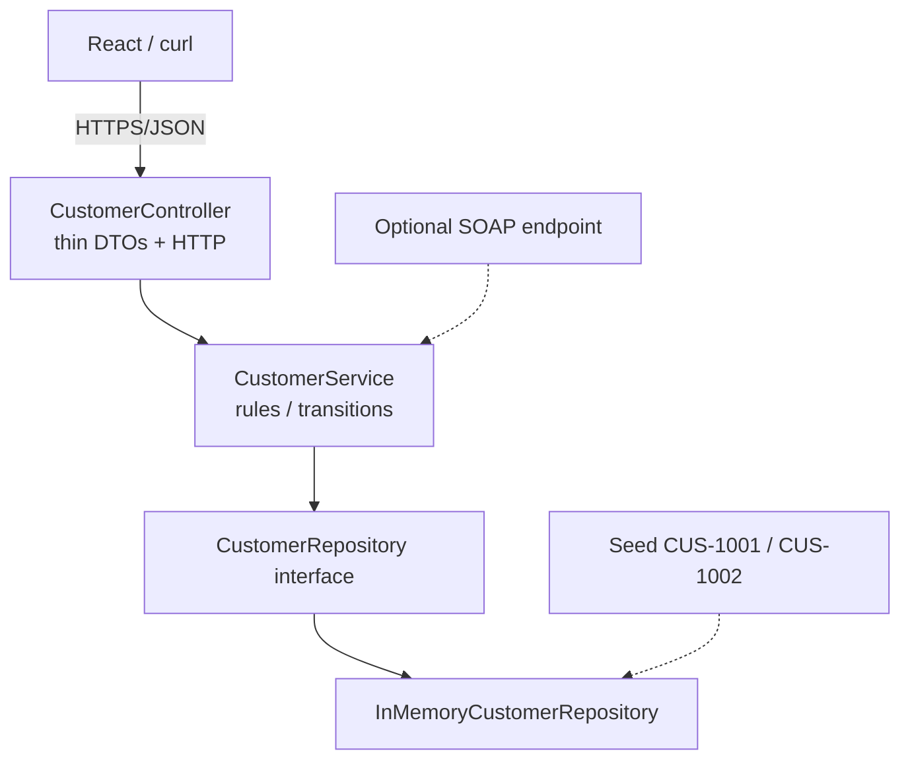
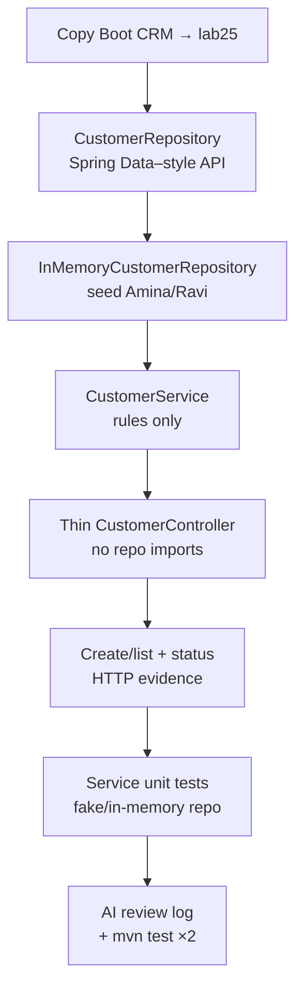

# Lab 25: Service and Repository Layers with AI Assistance — Northstar CRM Layering

**Module:** 25 — Service and Repository Layers with AI Assistance  
**Lab folder:** `labs/Week 3 - Spring Framework and Enterprise Patterns/module-25/lab25/`  
**Difficulty:** Intermediate  
**Duration:** 4–5 Hours

**Primary IDE:** IntelliJ IDEA Community Edition · **Optional IDE:** VS Code

| OS | How-to for this lab |
| -- | ------------------- |
| Windows | [LAB-25-WINDOWS.md](LAB-25-WINDOWS.md) |
| macOS | [LAB-25-MACOS.md](LAB-25-MACOS.md) |

> **Environment reminder:** Finish [Lab 0](../../../Week%201%20-%20Java%20and%20JVM%20Foundations/module-00/lab0/LAB-0-GUIDE.md). Use **IntelliJ IDEA Community** (primary; optional VS Code) on your laptop with **JDK 21** and **Maven 3.9+** (Spring Boot 3.x via Maven). Work under `~/java-bootcamp` (Windows: `%USERPROFILE%\java-bootcamp`).

---

## How to follow this lab

1. Open the **Windows** or **macOS** how-to (links above) in a second tab.
2. Create/work only under your `java-bootcamp/examples/…` folder from the steps (not inside this `labs/` git clone unless a step says otherwise).
3. For each **Step N**: read **Why** (if present) → do the actions → confirm **Expected** / **Expected result** → then continue.
4. When stuck, use **Failure Experiments** / troubleshooting in this guide before asking for help.
5. Capture evidence under `notes/screenshots/lab-25/` (workspace root under `java-bootcamp`; redact secrets). Use the **Pass criteria** tables — write **Pass** or **Fail** in your notes. GitHub file view does not support clickable checkboxes.

## Lab Overview

This Module 25 lab formalizes **Controller → Service → Repository** for Customer in the CRM Boot app. Controllers stay thin HTTP adapters; services own lifecycle and uniqueness rules; repositories own persistence access. An in-memory Spring Data–style repository is acceptable now; later labs swap persistence without rewriting the service contract. Optional Copilot drafts are welcome only with mandatory human review.

**Purpose.** Leadership freezes package seams before transactions (Lab 27), profiles/secrets (Lab 26), and security (Lab 28): no controller may import or call a map/store directly, and AI suggestions that place `ResponseEntity` or HTTP types in the service are rejected.

**What you build (exercise).** Copy prior Boot CRM to `lab25-crm`; define `CustomerRepository`; implement `InMemoryCustomerRepository` seeded with `CUS-1001`/`CUS-1002`; put rules in `CustomerService`; thin `CustomerController`; create/list paths; service unit tests with fake/real in-memory repo; AI review log `lab25-001`; dual green `mvn test`.

**What success looks like.** Under `~/java-bootcamp/examples/lab25-crm/` GET Amina/Ravi works, duplicates/not-found fail in the service, controller has **zero** repository imports, AI review notes exist (or manual N/A), and tests pass twice.

**Depends on Labs 23–24 (Boot + optional SOAP).** Need a runnable Boot CRM. If SOAP exists, keep endpoint signatures; refactor behind `CustomerService` only.

**CRM connection.** Fixtures `CUS-1001` / `CUS-1002` / `CUS-9999`, correlation `lab-request-001`. Lab 26 externalizes config; Lab 27 adds `@Transactional` transfers on related account entities.

---

## Learning Objectives

After completing this lab, you will be able to:

* Separate Controller, Service, and Repository responsibilities for Customer CRUD and status updates
* Define a Spring Data–style `CustomerRepository` and an in-memory implementation
* Keep HTTP mapping and JSON serialization out of the service layer
* Enforce lifecycle rules (for example `PROSPECT` → `ACTIVE`) in the service, not the controller
* Use Copilot (or similar) productively while reviewing suggestions for correctness and security
* Seed and retrieve `CUS-1001` / `CUS-1002` through the layered API
* Write focused unit tests for the service with a fake or in-memory repository
* Explain what must change when the repository later becomes JPA against PostgreSQL
* Document accepted vs rejected AI suggestions honestly

---

## Business Scenario

Controllers talking to storage create tangled Boot apps that cannot grow transactions, security, or persistence swaps cleanly. Your lead freezes:

**Every Customer write/read path is Controller → Service → Repository. In-memory is fine for now. Controllers never import repositories. AI drafts require a dated review log.**

You own that gate for Amina (`CUS-1001` ACTIVE), Ravi (`CUS-1002` PROSPECT→ACTIVE), duplicates, and not-found.

Use these examples consistently:

| ID | Name | Notes |
| -- | ---- | ----- |
| `CUS-1001` | Amina Khan | `ACTIVE` — seeded / GET |
| `CUS-1002` | Ravi Singh | `PROSPECT` — activate path |
| `CUS-1003` | Maya Chen | optional create sample |
| `CUS-9999` | — | not-found |
| `lab-request-001` | — | `X-Correlation-Id` |
| `lab25-001`, … | — | Copilot / AI review entries |

**Security note for evidence.** Fictional emails only (`amina.khan@example.com`, etc.). Never commit real PII dumps or tokens.

---

## Architecture Context

### NOW (this lab)



### Lab flow (mermaid)



### Architecture NOW vs LATER

| Aspect | Lab 25 (NOW) | Lab 26–28 (LATER) |
| ------ | ------------ | ----------------- |
| Persistence | In-memory map behind interface | Profiles + JPA/TX (27) |
| Config | Simple YAML | `application-{dev,test,prod}.yml` |
| Security | Correlation + validation | Spring Security (28) |
| AI | Optional draft + review | Same discipline |

**Lab focus:** Thin controller; service rules; repository interface; seeded in-memory impl; mandatory AI review if used.

---

## Prerequisites

Complete [SETUP](../../../SETUP-INSTRUCTIONS.md), [Lab 0](../../../Week%201%20-%20Java%20and%20JVM%20Foundations/module-00/lab0/LAB-0-GUIDE.md), and [Lab 23](../../module-23/lab23/LAB-23-GUIDE.md) (and Lab 24 if SOAP is in play). Confirm:

* JDK 21; Maven; Spring Boot 3.x web
* Domain types `Customer` / `CustomerStatus` (recreate if needed)
* Copilot / Cursor optional
* No secrets committed to Git

### Pre-flight

```bash
java -version
mvn -version
git --version
pwd
ls ~/java-bootcamp/examples
```

---

## Suggested Project Files

```text
~/java-bootcamp/examples/lab25-crm/
├── src/
│   ├── main/
│   │   ├── java/com/northstar/crm/
│   │   │   ├── CrmApplication.java
│   │   │   ├── controller/CustomerController.java
│   │   │   ├── service/CustomerService.java
│   │   │   ├── repository/
│   │   │   │   ├── CustomerRepository.java
│   │   │   │   └── InMemoryCustomerRepository.java
│   │   │   ├── entity/Customer.java
│   │   │   ├── entity/CustomerStatus.java
│   │   │   ├── dto/CustomerRequest.java
│   │   │   ├── dto/CustomerResponse.java
│   │   │   └── exception/...
│   │   └── resources/
│   │       └── application.yml
│   └── test/java/com/northstar/crm/service/
│       └── CustomerServiceTest.java
├── copilot-notes/
│   └── ai-layering-review.md
├── docs/
│   └── layering-notes.md
├── notes/screenshots/
├── pom.xml
├── .gitignore
└── README.md
```

Ignore `target/`, IDE metadata, tokens, and passwords.

---

## Concepts to Discuss

Write 2–3 sentences each in `docs/layering-notes.md`:

1. Main flow: HTTP → controller → service → repository
2. Trust boundary: JSON → DTO validation → domain
3. Success/failure contracts for create/get/list/status
4. Stable business IDs (`CUS-1001`) vs generated DB keys later
5. Idempotency: GET vs POST create
6. In-memory shortcut vs JPA + PostgreSQL production design
7. Correlation `lab-request-001` as support evidence
8. Two instances: maps do not share
9. False-confidence AI: `ResponseEntity` in service, repo using Servlet types
10. What Lab 27 adds (transactions) without rewriting controller routes

---

## Implementation Steps

Complete each step in order. Commands assume `~/java-bootcamp/examples/lab25-crm` (Windows: `%USERPROFILE%\java-bootcamp\examples\lab25-crm`) unless noted.

---

### Step 1 — Branch prior Boot CRM and confirm domain types

**Why:** Layering refactors on a known Boot entry point and entity — not a greenfield rewrite.

**Do this:**

```bash
cd ~/java-bootcamp/examples
cp -r lab24-crm lab25-crm   # or lab23-crm if you skipped SOAP
cd lab25-crm
mkdir -p copilot-notes docs
mkdir -p ~/java-bootcamp/notes/screenshots/lab-25
```

Ensure `Customer` / `CustomerStatus` (`PROSPECT`, `ACTIVE`, `SUSPENDED`, `CLOSED`) compile under `com.northstar.crm`.

```bash
mvn -q -DskipTests package
```

**Expected result:** `BUILD SUCCESS`; `CrmApplication` resolves.

**If it fails:** Missing web starter → restore Lab 23 POM. Package drift → keep `com.northstar.crm`.

---

### Step 2 — Define Spring Data–style `CustomerRepository`

**Why:** The interface is the seam Lab 27+ will swap; method names stay persistence-oriented, not HTTP-oriented.

**Do this:**

```java
public interface CustomerRepository {
  Customer save(Customer customer);
  Optional<Customer> findByCustomerId(String customerId);
  List<Customer> findAll();
  boolean existsByCustomerId(String customerId);
  void deleteByCustomerId(String customerId);
}
```

Optional Copilot prompt: “Spring Data style CustomerRepository for CRM customerId String PK, no JPA annotations yet.” Review every line.

**Expected result:** Interface compiles; no `HttpServletRequest` / Web types.

**If it fails:** AI adds JPA annotations prematurely → reject or park for later. Vague method names like `get` → prefer `findByCustomerId`.

---

### Step 3 — Implement seeded `InMemoryCustomerRepository`

**Why:** Fixed seeds make peer review and tests deterministic without PostgreSQL.

**Do this:** `@Repository` class implementing the interface with `ConcurrentHashMap`. Seed on construction or `@PostConstruct`:

```java
@Repository
public class InMemoryCustomerRepository implements CustomerRepository {
  private final Map<String, Customer> store = new ConcurrentHashMap<>();

  public InMemoryCustomerRepository() {
    store.put("CUS-1001", new Customer(
        "CUS-1001", "Amina Khan", "amina.khan@example.com", CustomerStatus.ACTIVE));
    store.put("CUS-1002", new Customer(
        "CUS-1002", "Ravi Singh", "ravi.singh@example.com", CustomerStatus.PROSPECT));
  }

  @Override
  public Customer save(Customer customer) {
    store.put(customer.getCustomerId(), customer);
    return customer;
  }

  @Override
  public Optional<Customer> findByCustomerId(String customerId) {
    return Optional.ofNullable(store.get(customerId));
  }

  @Override
  public List<Customer> findAll() {
    return List.copyOf(store.values());
  }

  @Override
  public boolean existsByCustomerId(String customerId) {
    return store.containsKey(customerId);
  }

  @Override
  public void deleteByCustomerId(String customerId) {
    store.remove(customerId);
  }
}
```

**Expected result:** Context starts; `findByCustomerId("CUS-1001")` returns Amina ACTIVE.

**If it fails:** Bean not created → missing `@Repository` or scan package. Seeds missing → check constructor/`@PostConstruct`. Overwriting seeds in tests → fresh repo per test later.

---

### Step 4 — Implement `CustomerService` with business rules
**Why:** Duplicate checks, not-found, and illegal transitions belong in one place both REST and SOAP can call.

**Do this:** Constructor-inject `CustomerRepository`. Implement `getRequired`, `create` (reject duplicate id), `updateStatus` (reject illegal transitions), `list`. **No** Spring Web imports.

```java
@Service
public class CustomerService {
  private final CustomerRepository customers;

  public CustomerService(CustomerRepository customers) {
    this.customers = customers;
  }

  public Customer getRequired(String customerId) {
    return customers.findByCustomerId(customerId)
        .orElseThrow(() -> new CustomerNotFoundException(customerId));
  }

  public Customer create(Customer customer) {
    if (customers.existsByCustomerId(customer.getCustomerId())) {
      throw new DuplicateCustomerException(customer.getCustomerId());
    }
    return customers.save(customer);
  }

  public Customer updateStatus(String customerId, CustomerStatus next) {
    Customer c = getRequired(customerId);
    // reject CLOSED -> ACTIVE, ACTIVE -> PROSPECT, etc. per Lab 15 table
    c.setStatus(next);
    return customers.save(c);
  }

  public List<Customer> list() {
    return customers.findAll();
  }
}
```

Reject AI suggestions that return `ResponseEntity` from the service. Record rejects in `lab25-001`.

**Expected result:** `getRequired("CUS-9999")` throws not-found; `updateStatus("CUS-1002", ACTIVE)` succeeds; service has zero Web imports.

**If it fails:** Controller still owns rules → move logic down. Service depends on concrete map → depend on interface only.

---

### Step 5 — Thin `CustomerController` (prove no repository imports)

**Why:** The layering gate is enforceable by import review and instructor probe.

**Do this:** Map GET/PATCH (and POST/list in Step 6). Convert DTOs; propagate `X-Correlation-Id: lab-request-001`. Controllers call **only** `CustomerService`.

```java
@RestController
@RequestMapping("/api/customers")
public class CustomerController {
  private final CustomerService service;

  public CustomerController(CustomerService service) {
    this.service = service;
  }

  @GetMapping("/{customerId}")
  public CustomerResponse get(
      @PathVariable String customerId,
      @RequestHeader(value = "X-Correlation-Id", defaultValue = "lab-request-001")
      String correlationId) {
    return CustomerResponse.from(service.getRequired(customerId));
  }

  @PatchMapping("/{customerId}/status")
  public CustomerResponse status(
      @PathVariable String customerId,
      @RequestBody StatusUpdateRequest body) {
    return CustomerResponse.from(service.updateStatus(customerId, body.status()));
  }
}
```

```bash
curl -s -H "X-Correlation-Id: lab-request-001" \
  http://localhost:8080/api/customers/CUS-1001
curl -s -H "X-Correlation-Id: lab-request-001" \
  http://localhost:8080/api/customers/CUS-1002
```

**Expected result:** JSON for Amina ACTIVE and Ravi PROSPECT; controller source has no `repository` imports.

**If it fails:** 404 on seeded data → bean not wired / wrong path. Controller injects repository → refactor immediately.

---

### Step 6 — Create, list, and duplicate rejection through layers
**Why:** Write paths prove uniqueness rules live in the service even if the map could silently overwrite.

**Do this:** POST create for `CUS-1003` Maya; GET list; POST duplicate `CUS-1001` expecting 4xx / duplicate exception path.

```bash
curl -s -X POST http://localhost:8080/api/customers \
  -H "Content-Type: application/json" \
  -H "X-Correlation-Id: lab-request-001" \
  -d '{"customerId":"CUS-1003","fullName":"Maya Chen","email":"maya@example.com","status":"PROSPECT"}'
```

**Expected result:** 201 for Maya; list includes seeded + new; duplicate `CUS-1001` rejected by service rule.

**If it fails:** Silent overwrite → add `existsByCustomerId` check before save. Exception becomes 500 → add/adjust exception handler from Lab 16 patterns.

---

### Step 7 — Unit-test the service (no full MVC required)

**Why:** Layer honesty means service rules can green without `@SpringBootTest` for every assertion.

**Do this:** `CustomerServiceTest` constructing `CustomerService` with `InMemoryCustomerRepository` (or Mockito mock). Cover activate Ravi, not-found, duplicate.

```java
@Test
void updateStatus_movesProspectToActive() {
  var repo = new InMemoryCustomerRepository();
  var service = new CustomerService(repo);
  var updated = service.updateStatus("CUS-1002", CustomerStatus.ACTIVE);
  assertEquals(CustomerStatus.ACTIVE, updated.getStatus());
  assertEquals("Ravi Singh", updated.getFullName());
}

@Test
void getRequired_throws_whenMissing() {
  var service = new CustomerService(new InMemoryCustomerRepository());
  assertThrows(CustomerNotFoundException.class,
      () -> service.getRequired("CUS-9999"));
}
```

```bash
mvn -q test -Dtest=CustomerServiceTest
```

**Expected result:** Focused tests green; asserts on status/IDs/exception types — not only `assertNotNull(service)`.

**If it fails:** Shared static store across tests → new repo per `@BeforeEach`. Flaky order → stop depending on other tests’ HTTP creates.

---

### Step 8 — AI review log + JPA readiness note
**Why:** This lab’s AI outcome is review discipline, not raw autocomplete volume.

**Do this:** In `copilot-notes/ai-layering-review.md` record entry `lab25-001`: files aided, accepted suggestions, **rejected** suggestions (with why). Document how `CustomerRepository` becomes `extends JpaRepository<Customer, String>` later without changing controller routes. If no AI used, mark “manual” with rationale.

**Expected result:** Dated review; at least one rejection **or** N/A with reason; README points to JPA swap plan.

**If it fails:** Empty “used Copilot” claim without rejects → incomplete. Accepted service returning `ResponseEntity` → reverse that design.

---

### Step 9 — Failure experiments + evidence pack

**Why:** Layering failures must be distinguishable (not-found vs duplicate vs illegal transition).

**Do this:** Complete [Failure Experiments](#failure-experiments). Capture curls + Surefire under `notes/screenshots/lab-25/`. Run `mvn -q test` twice. Confirm `git status` clean of `target/`.

**Expected result:** ≥3 experiments; dual green verify/test; layering diagram/notes present.

**If it fails:** See Troubleshooting.

---

## Implementation Checkpoints

### Checkpoint A — Tooling

_Mark each row **Pass** or **Fail** in your lab notes (GitHub markdown files are not interactive checklists)._

| # | Confirm | Your notes |
| - | ------- | ---------- |
| 1 | `lab25-crm` under `examples/` | Pass / Fail |
| 2 | Boot app packages successfully | Pass / Fail |
| 3 | Packages for controller/service/repository present | Pass / Fail |

### Checkpoint B — Layering core

_Mark each row **Pass** or **Fail** in your lab notes (GitHub markdown files are not interactive checklists)._

| # | Confirm | Your notes |
| - | ------- | ---------- |
| 1 | `CustomerRepository` + seeded `InMemoryCustomerRepository` | Pass / Fail |
| 2 | `CustomerService` owns rules; no Web imports | Pass / Fail |
| 3 | Controller has **zero** repository imports; GET Amina/Ravi works | Pass / Fail |

### Checkpoint C — Writes + tests + AI

_Mark each row **Pass** or **Fail** in your lab notes (GitHub markdown files are not interactive checklists)._

| # | Confirm | Your notes |
| - | ------- | ---------- |
| 1 | Create/list + duplicate rejection evidenced | Pass / Fail |
| 2 | `CustomerServiceTest` green | Pass / Fail |
| 3 | AI review `lab25-001` or manual N/A | Pass / Fail |

### Checkpoint D — Hygiene

_Mark each row **Pass** or **Fail** in your lab notes (GitHub markdown files are not interactive checklists)._

| # | Confirm | Your notes |
| - | ------- | ---------- |
| 1 | Two consecutive `mvn test` identical success | Pass / Fail |
| 2 | README / layering notes complete | Pass / Fail |
| 3 | No secrets / `target/` committed | Pass / Fail |

---

## Reference Commands, Configuration, and Code

### `pom.xml` (excerpt)

```xml
<dependency>
  <groupId>org.springframework.boot</groupId>
  <artifactId>spring-boot-starter-web</artifactId>
</dependency>
<dependency>
  <groupId>org.springframework.boot</groupId>
  <artifactId>spring-boot-starter-validation</artifactId>
</dependency>
<dependency>
  <groupId>org.springframework.boot</groupId>
  <artifactId>spring-boot-starter-test</artifactId>
  <scope>test</scope>
</dependency>
```

### `CustomerRepository.java`

```java
public interface CustomerRepository {
  Customer save(Customer customer);
  Optional<Customer> findByCustomerId(String customerId);
  List<Customer> findAll();
  boolean existsByCustomerId(String customerId);
  void deleteByCustomerId(String customerId);
}
```

### Seed excerpt (`InMemoryCustomerRepository`)

```java
store.put("CUS-1001", new Customer(
    "CUS-1001", "Amina Khan", "amina.khan@example.com", CustomerStatus.ACTIVE));
store.put("CUS-1002", new Customer(
    "CUS-1002", "Ravi Singh", "ravi.singh@example.com", CustomerStatus.PROSPECT));
```

### Service test excerpt

```java
@Test
void updateStatus_movesProspectToActive() {
  var repo = new InMemoryCustomerRepository();
  var service = new CustomerService(repo);
  var updated = service.updateStatus("CUS-1002", CustomerStatus.ACTIVE);
  assertEquals(CustomerStatus.ACTIVE, updated.getStatus());
  assertEquals("Ravi Singh", updated.getFullName());
}
```

### Commands

```bash
cd ~/java-bootcamp/examples/lab25-crm
mvn spring-boot:run
curl -s -H "X-Correlation-Id: lab-request-001" \
  http://localhost:8080/api/customers/CUS-1001
curl -s -H "X-Correlation-Id: lab-request-001" \
  http://localhost:8080/api/customers/CUS-1002
curl -s -X POST http://localhost:8080/api/customers \
  -H "Content-Type: application/json" \
  -H "X-Correlation-Id: lab-request-001" \
  -d '{"customerId":"CUS-1003","fullName":"Maya Chen","email":"maya@example.com","status":"PROSPECT"}'
curl -s http://localhost:8080/api/customers
mvn -q test -Dtest=CustomerServiceTest
mvn -q test
mvn -q test
git status
```

### Evidence checklist

```text
[ ] Controller has zero repository imports (instructor probe)
[ ] Service has zero Spring Web imports
[ ] GET CUS-1001 ACTIVE / GET CUS-1002 PROSPECT
[ ] Duplicate CUS-1001 create → 4xx
[ ] CUS-9999 → not-found
[ ] CustomerServiceTest green
[ ] lab25-001 AI review or manual N/A
[ ] JPA readiness note written
[ ] mvn test twice identical
```

### Class map

| Class | Role |
| ----- | ---- |
| `CustomerController` | HTTP + DTO only |
| `CustomerService` | Business rules |
| `CustomerRepository` | Persistence contract |
| `InMemoryCustomerRepository` | Lab persistence + seeds |
| `CustomerServiceTest` | Service unit gate |
| `ai-layering-review.md` | AI acceptance audit |
---

## Manual Verification

1. GET `CUS-1001` returns Amina ACTIVE.
2. GET `CUS-1002` returns Ravi PROSPECT.
3. Activate Ravi PROSPECT→ACTIVE via service/API.
4. GET `CUS-9999` is explicit not-found.
5. Duplicate create of `CUS-1001` fails in service.
6. Controller source has no repository imports.
7. Service source has no Spring Web imports.
8. AI review exists if Copilot/Cursor was used.
9. Two consecutive `mvn test` runs match.
10. JPA readiness note exists; no secrets in Git.

---

## Failure Experiments

| # | Experiment | Observe | Restore |
| - | ---------- | ------- | ------- |
| 1 | Repo stub throws on `save` | Create fails explicitly | Restore real bean |
| 2 | Illegal status transition | Service rejects; status unchanged | Keep rule |
| 3 | Repeat GET `CUS-1001` | Idempotent 200 | Keep |
| 4 | Repeat POST create same id | Duplicate path | Keep rejection |
| 5 | Accept AI `ResponseEntity` in service then revert | Documents reject reason | Restore layering |

---

## Troubleshooting

| Symptom | Likely cause | Fix |
| ------- | ------------ | --- |
| Seeded GET 404 | Bean not used / wrong id | Confirm `@Repository` + seeds |
| Controller talks to map | Missing service seam | Inject service only |
| Flaky tests | Shared singleton store | Fresh repo per `@BeforeEach` |
| Always 500 on duplicate | No exception mapping | Map to 4xx |
| Component scan miss | Wrong package | Stay under `com.northstar.crm` |
| AI invented JPA APIs | Underspecified prompt | Reject; restating interface-only |

---

## Security and Production Review

Answer in README:

1. Which inputs are untrusted (JSON bodies, path IDs)?
2. Where are authn/authz/validation enforced (Lab 28 deepens auth)?
3. Which values are sensitive — never log emails/phones as PII dumps?
4. What can be retried safely (GET vs POST create)?
5. What happens after partial failure (create saved, response lost)?
6. What would an operator monitor (not-found rate, create rate)?
7. Which local default is unacceptable in production (in-memory as sole store)?
8. How are API contracts versioned when repository becomes JPA?

---

## Cleanup

```bash
cd ~/java-bootcamp/examples/lab25-crm
# Ctrl+C spring-boot:run
mvn -q clean
git status
```

**Keep `lab25-crm`**—Lab 26 adds profiles/config on this layering.

---

## Expected Deliverables

* Layered Controller → Service → Repository source
* Seeded in-memory repo with `CUS-1001` / `CUS-1002`
* HTTP evidence + duplicate/not-found failures
* `CustomerServiceTest` output
* AI review notes (`lab25-001`) or manual equivalent
* Layering / JPA readiness notes
* Dual green `mvn test`
* No secrets or `target/` committed

---

## Evaluation Rubric (100 Marks)

| Criteria | Marks |
| -------- | ----: |
| Environment and project structure | 10 |
| Core implementation (layers + seeds + rules) | 30 |
| Integration/configuration correctness (DI wiring) | 15 |
| Failure handling (duplicate / not-found / illegal transition) | 15 |
| Automated verification | 10 |
| Security and production awareness / AI review discipline | 10 |
| Documentation and evidence | 10 |

**Notes:** Controllers importing repositories → lose core marks. Passing tests with only `assertNotNull` → lose verification/AI marks. Undocumented Copilot paste → lose AI marks.

---

## Reflection Questions

Write 3–6 sentence answers:

1. Which design decision most affected correctness (where rules live)?
2. Which failure was hardest to diagnose?
3. What evidence proves layering works?
4. What breaks first at ten times load with an in-memory map?
5. Which concern should move to shared infrastructure (DB, migrations)?
6. What must change before real customer data is used?
7. How does this lab connect to Labs 23–24 and 26–28?
8. What metric or log field matters most for layered CRM APIs?
9. (Forward look) Which files should stay untouched when JPA arrives?

---

## Bonus Challenges

1. MDC correlation + `customerId` without PII.
2. `@DataJpaTest` plan doc even before JPA wiring.
3. Actuator readiness reflecting repository health (document-only OK).
4. Metrics around service create/status calls.
5. Operator rollback note for a failed status update.
6. Prove SOAP Lab 24 still compiles against the same service interface.

---

## Success Criteria

You are finished when:

* Controller → Service → Repository is demonstrable for Customer
* Happy path and failure paths are repeatable
* Another student can follow your run instructions
* Tests/build pass twice
* No production secret is hard-coded
* You can explain in-memory vs JPA trade-offs
* AI-assisted code (if any) was human-reviewed and logged

---

## Instructor Notes

* **Live probe:** Open `CustomerController` and confirm zero repository imports; reproduce not-found; ask which AI suggestion was rejected (or why manual).
* **Assess:** Service owns transitions/duplicates; seeds present; meaningful asserts; honest AI log.
* **Continuity:** Prefer `examples/lab25-crm`. Keep fixture IDs. Lab 26/27 should extend, not rewrite package layout.
* **Common pitfalls:** Fat controllers; AI placing Web types in service; shared static map in tests; inventing a second domain for “clean layering.”
* **Timing:** 4–5 hours. Seed + DI mismatches often burn 30–45 minutes early.

---

*End of Lab 25 — Service and Repository Layers with AI Assistance: Northstar CRM Layering. Keep `lab25-crm` for Lab 26 and portfolio evidence.*
