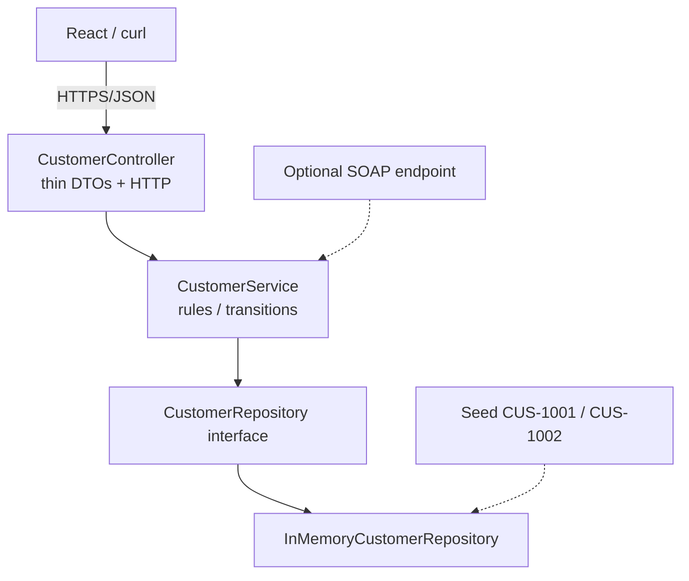

# Lab 25: Service and Repository Layers with AI Assistance — Northstar CRM Layering

> **Participants:** Module sequence is in [`../README.md`](../README.md). **Do not start this guide until** you have finished Module 25 [pre-lab exercises 1–6](../exercises/EXERCISES-INDEX.md) (Pass in your notes; order **1 → 2 → 3 → 4 → 5 → 6**). Then open **one** OS how-to ([Windows](LAB-25-WINDOWS.md) · [macOS](LAB-25-MACOS.md)). In class, prefer the **45-minute timed path** with [`starter/`](starter/README.md); the **full path** is every Step below (homework / extended). Skip `solution/` unless your instructor says otherwise. See [Which file do I open?](../../../_PARTICIPANT-FILE-GUIDE.md).

## Activity card

| | |
| --- | --- |
| **Objective** | Formalize Controller → Service → Repository with seeded CRM fixtures and service tests |
| **Skills practiced** | Layer seams, in-memory repository, service rules, AI review notes |
| **Expected outcome** | Thin controller · service-owned rules · seeded GET · CustomerServiceTest · lab25-001 notes |
| **Estimated time** | Timed path ~45 min · Full path 4–5 hours |
| **Prerequisites** | Lab 0 · Labs 23–24 preferred · Exercises 1–6 Pass · JDK 21 · Maven 3.9+ |
| **Expected files** | `examples/lab25-crm/` — layers, tests, docs/lab25-001.md |
| **Validation checkpoints** | Starter smoke · GUIDE Implementation Checkpoints |

**Module:** 25 — Service and Repository Layers with AI Assistance  
**Duration:** ~45 minutes (timed path with starter) · Full path: 4–5 Hours

**Primary IDE:** IntelliJ IDEA Community Edition · **Optional IDE:** VS Code

| OS | How-to for this lab |
| -- | ------------------- |
| Windows | [LAB-25-WINDOWS.md](LAB-25-WINDOWS.md) |
| macOS | [LAB-25-MACOS.md](LAB-25-MACOS.md) |

> **Incremental build:** Boundaries → packages → service TODOs → AI policy → test plan → Lab 25.

> **Classroom pacing:** [`../PACING.md`](../PACING.md) (Checkpoints A–D).

> **Critical scope:** **No** controller→repository imports. **No** HTTP types in the service. In-memory repo only. AI drafts need **human review** (`lab25-001`). JPA / `@Transactional` / profiles → later.

## 45-minute timed path (use starter)

In class, use the starter templates so the **core** objectives fit **~45 minutes**. The full Steps below remain for homework / extended depth.

1. Open [`starter/README.md`](starter/README.md).
2. Copy `starter/` into your `java-bootcamp/examples/…` target (see starter README).
3. Fill every `// TODO` — do **not** wait on a perfect prior lab; the starter includes a baseline.
4. Run the starter smoke test; evidence under `notes/screenshots/lab-25/`.
5. Mark timed-path Pass criteria in the starter README. Continue remaining GUIDE steps as homework if needed.

| Path | Time | Scope |
| ---- | ---- | ----- |
| **Timed (default)** | ~45 min | Starter TODOs + smoke test |
| **Full (extended)** | see Duration | Every Step in this GUIDE |

---

## What you'll submit (read this first)

Keep this checklist visible while you work.

| # | Deliverable |
| - | ----------- |
| 1 | Layered Controller → Service → Repository source |
| 2 | Seeded in-memory repo with `CUS-1001` / `CUS-1002` |
| 3 | HTTP evidence + duplicate/not-found failures |
| 4 | `CustomerServiceTest` output |
| 5 | AI review notes (`lab25-001`) or manual equivalent |
| 6 | Layering / JPA readiness notes |
| 7 | Dual green `mvn test` |
| 8 | No secrets or `target/` committed |

**Must submit:** the items in the table above (sources + evidence + short notes).

**Do not submit:** `target/`, `node_modules/`, secrets, heap dumps, or a verbatim instructor `solution/`.

## Lab Overview

This Module 25 lab formalizes **Controller → Service → Repository** for Customer in the CRM Boot app. Controllers stay thin HTTP adapters; services own lifecycle and uniqueness rules; repositories own persistence access. An in-memory Spring Data–style repository is acceptable now; later labs swap persistence without rewriting the service contract. Optional Copilot drafts are welcome only with mandatory human review.

## Learning Objectives

After completing this lab, you will be able to:

* Separate Controller, Service, and Repository responsibilities for Customer CRUD and status updates
* Define a Spring Data–style `CustomerRepository` and an in-memory implementation
* Keep HTTP mapping and JSON serialization out of the service layer
* Enforce lifecycle rules (for example `PROSPECT` → `ACTIVE`) in the service, not the controller
* Use Copilot (or similar) productively while reviewing suggestions for correctness and security

## Business Scenario

Controllers talking to storage create tangled Boot apps that cannot grow transactions, security, or persistence swaps cleanly. Your lead freezes:

**Every Customer write/read path is Controller → Service → Repository. In-memory is fine for now. Controllers never import repositories. AI drafts require a dated review log.**

You own that gate for Amina (`CUS-1001` ACTIVE), Ravi (`CUS-1002` PROSPECT→ACTIVE), duplicates, and not-found.

Use these examples consistently:

| ID | Name | Notes |
| -- | ---- | ----- |
| `CUS-1001` | Amina Khan | `ACTIVE` — seeded / GET |
| `CUS-1002` | Ravi Singh | `PROSPECT` — activate path |
| `CUS-1003` | Maya Chen | optional create sample |
| `CUS-9999` | — | not-found |
| `lab-request-001` | — | `X-Correlation-Id` |
| `lab25-001`, … | — | Copilot / AI review entries |

**Security note for evidence.** Fictional emails only (`amina.khan@example.com`, etc.). Never commit real PII dumps or tokens.

---

## Architecture Context
### NOW (this lab)


```mermaid
flowchart TB
  UI["React / curl"] -->|HTTPS/JSON| Ctrl["CustomerController<br/>thin DTOs + HTTP"]
  Ctrl --> Svc["CustomerService<br/>rules / transitions"]
  Svc --> RepoI["CustomerRepository interface"]
  RepoI --> Mem["InMemoryCustomerRepository"]
  Seed["Seed CUS-1001 / CUS-1002"] -.-> Mem
  SOAP["Optional SOAP endpoint"] -.-> Svc
```

## Prerequisites

Prior labs: [Lab 23](../../module-23/lab23/LAB-23-GUIDE.md).

Confirm (Lab 0 tools assumed):

* JDK 21; Maven; Spring Boot 3.x web
* Domain types `Customer` / `CustomerStatus` (recreate if needed)
* Copilot / Cursor optional
* No secrets committed to Git

### Pre-flight

```bash
java -version
mvn -version
```

## Worked example (read before you code)

Study this pattern once before Step 1. Your job is to apply the same idea in the Steps — do not skip ahead to a full solution.

```java
@Test
void updateStatus_movesProspectToActive() {
  var repo = new InMemoryCustomerRepository();
  var service = new CustomerService(repo);
  var updated = service.updateStatus("CUS-1002", CustomerStatus.ACTIVE);
  assertEquals(CustomerStatus.ACTIVE, updated.getStatus());
  assertEquals("Ravi Singh", updated.getFullName());
}

@Test
void getRequired_throws_whenMissing() {
  var service = new CustomerService(new InMemoryCustomerRepository());
  assertThrows(CustomerNotFoundException.class,
      () -> service.getRequired("CUS-9999"));
}
```

**What to notice:** Match names, IDs, and failure behavior from the scenario — instructors check these.

---

## Implementation Steps

Complete each step in order. Commands assume `~/java-bootcamp/examples/lab25-crm` (Windows: `%USERPROFILE%\java-bootcamp\examples\lab25-crm`) unless noted.

---

### Step 1 — Branch prior Boot CRM and confirm domain types

**Why:** Layering refactors on a known Boot entry point and entity — not a greenfield rewrite.

**Do this:**

```bash
cd ~/java-bootcamp/examples
cp -r lab24-crm lab25-crm   # or lab23-crm if you skipped SOAP
cd lab25-crm
mkdir -p copilot-notes docs
mkdir -p ~/java-bootcamp/notes/screenshots/lab-25
```

Ensure `Customer` / `CustomerStatus` (`PROSPECT`, `ACTIVE`, `SUSPENDED`, `CLOSED`) compile under `com.northstar.crm`.

```bash
mvn -q -DskipTests package
```

**Expected result:** `BUILD SUCCESS`; `CrmApplication` resolves.

**If it fails:** Missing web starter → restore Lab 23 POM. Package drift → keep `com.northstar.crm`.

---

### Step 2 — Define Spring Data–style `CustomerRepository`

**Why:** The interface is the seam Lab 27+ will swap; method names stay persistence-oriented, not HTTP-oriented.

**Do this:**

```java
public interface CustomerRepository {
  Customer save(Customer customer);
  Optional<Customer> findByCustomerId(String customerId);
  List<Customer> findAll();
  boolean existsByCustomerId(String customerId);
  void deleteByCustomerId(String customerId);
}
```

Optional Copilot prompt: “Spring Data style CustomerRepository for CRM customerId String PK, no JPA annotations yet.” Review every line.

**Expected result:** Interface compiles; no `HttpServletRequest` / Web types.

**If it fails:** AI adds JPA annotations prematurely → reject or park for later. Vague method names like `get` → prefer `findByCustomerId`.

---

### Step 3 — Implement seeded `InMemoryCustomerRepository`

**Why:** Fixed seeds make peer review and tests deterministic without PostgreSQL.

**Do this:** `@Repository` class implementing the interface with `ConcurrentHashMap`. Seed on construction or `@PostConstruct`:

```java
@Repository
public class InMemoryCustomerRepository implements CustomerRepository {
  private final Map<String, Customer> store = new ConcurrentHashMap<>();

  public InMemoryCustomerRepository() {
    store.put("CUS-1001", new Customer(
        "CUS-1001", "Amina Khan", "amina.khan@example.com", CustomerStatus.ACTIVE));
    store.put("CUS-1002", new Customer(
        "CUS-1002", "Ravi Singh", "ravi.singh@example.com", CustomerStatus.PROSPECT));
  }

  @Override
  public Customer save(Customer customer) {
    store.put(customer.getCustomerId(), customer);
    return customer;
  }

  @Override
  public Optional<Customer> findByCustomerId(String customerId) {
    return Optional.ofNullable(store.get(customerId));
  }

  @Override
  public List<Customer> findAll() {
    return List.copyOf(store.values());
  }

  @Override
  public boolean existsByCustomerId(String customerId) {
    return store.containsKey(customerId);
  }

  @Override
  public void deleteByCustomerId(String customerId) {
    store.remove(customerId);
  }
}
```

**Expected result:** Context starts; `findByCustomerId("CUS-1001")` returns Amina ACTIVE.

**If it fails:** Bean not created → missing `@Repository` or scan package. Seeds missing → check constructor/`@PostConstruct`. Overwriting seeds in tests → fresh repo per test later.

---

### Step 4 — Implement `CustomerService` with business rules
**Why:** Duplicate checks, not-found, and illegal transitions belong in one place both REST and SOAP can call.

**Do this:** Constructor-inject `CustomerRepository`. Implement `getRequired`, `create` (reject duplicate id), `updateStatus` (reject illegal transitions), `list`. **No** Spring Web imports.

```java
@Service
public class CustomerService {
  private final CustomerRepository customers;

  public CustomerService(CustomerRepository customers) {
    this.customers = customers;
  }

  public Customer getRequired(String customerId) {
    return customers.findByCustomerId(customerId)
        .orElseThrow(() -> new CustomerNotFoundException(customerId));
  }

  public Customer create(Customer customer) {
    if (customers.existsByCustomerId(customer.getCustomerId())) {
      throw new DuplicateCustomerException(customer.getCustomerId());
    }
    return customers.save(customer);
  }

  public Customer updateStatus(String customerId, CustomerStatus next) {
    Customer c = getRequired(customerId);
    // reject CLOSED -> ACTIVE, ACTIVE -> PROSPECT, etc. per Lab 15 table
    c.setStatus(next);
    return customers.save(c);
  }

  public List<Customer> list() {
    return customers.findAll();
  }
}
```

Reject AI suggestions that return `ResponseEntity` from the service. Record rejects in `lab25-001`.

**Expected result:** `getRequired("CUS-9999")` throws not-found; `updateStatus("CUS-1002", ACTIVE)` succeeds; service has zero Web imports.

**If it fails:** Controller still owns rules → move logic down. Service depends on concrete map → depend on interface only.

---

### Step 5 — Thin `CustomerController` (prove no repository imports)

**Why:** The layering gate is enforceable by import review and instructor probe.

**Do this:** Map GET/PATCH (and POST/list in Step 6). Convert DTOs; propagate `X-Correlation-Id: lab-request-001`. Controllers call **only** `CustomerService`.

```java
@RestController
@RequestMapping("/api/customers")
public class CustomerController {
  private final CustomerService service;

  public CustomerController(CustomerService service) {
    this.service = service;
  }

  @GetMapping("/{customerId}")
  public CustomerResponse get(
      @PathVariable String customerId,
      @RequestHeader(value = "X-Correlation-Id", defaultValue = "lab-request-001")
      String correlationId) {
    return CustomerResponse.from(service.getRequired(customerId));
  }

  @PatchMapping("/{customerId}/status")
  public CustomerResponse status(
      @PathVariable String customerId,
      @RequestBody StatusUpdateRequest body) {
    return CustomerResponse.from(service.updateStatus(customerId, body.status()));
  }
}
```

```bash
curl -s -H "X-Correlation-Id: lab-request-001" \
  http://localhost:8080/api/customers/CUS-1001
curl -s -H "X-Correlation-Id: lab-request-001" \
  http://localhost:8080/api/customers/CUS-1002
```

**Expected result:** JSON for Amina ACTIVE and Ravi PROSPECT; controller source has no `repository` imports.

**If it fails:** 404 on seeded data → bean not wired / wrong path. Controller injects repository → refactor immediately.

---

### Step 6 — Create, list, and duplicate rejection through layers
**Why:** Write paths prove uniqueness rules live in the service even if the map could silently overwrite.

**Do this:** POST create for `CUS-1003` Maya; GET list; POST duplicate `CUS-1001` expecting 4xx / duplicate exception path.

```bash
curl -s -X POST http://localhost:8080/api/customers \
  -H "Content-Type: application/json" \
  -H "X-Correlation-Id: lab-request-001" \
  -d '{"customerId":"CUS-1003","fullName":"Maya Chen","email":"maya@example.com","status":"PROSPECT"}'
```

**Expected result:** 201 for Maya; list includes seeded + new; duplicate `CUS-1001` rejected by service rule.

**If it fails:** Silent overwrite → add `existsByCustomerId` check before save. Exception becomes 500 → add/adjust exception handler from Lab 16 patterns.

---

### Step 7 — Unit-test the service (no full MVC required)

**Why:** Layer honesty means service rules can green without `@SpringBootTest` for every assertion.

**Do this:** `CustomerServiceTest` constructing `CustomerService` with `InMemoryCustomerRepository` (or Mockito mock). Cover activate Ravi, not-found, duplicate.

```java
@Test
void updateStatus_movesProspectToActive() {
  var repo = new InMemoryCustomerRepository();
  var service = new CustomerService(repo);
  var updated = service.updateStatus("CUS-1002", CustomerStatus.ACTIVE);
  assertEquals(CustomerStatus.ACTIVE, updated.getStatus());
  assertEquals("Ravi Singh", updated.getFullName());
}

@Test
void getRequired_throws_whenMissing() {
  var service = new CustomerService(new InMemoryCustomerRepository());
  assertThrows(CustomerNotFoundException.class,
      () -> service.getRequired("CUS-9999"));
}
```

```bash
mvn -q test -Dtest=CustomerServiceTest
```

**Expected result:** Focused tests green; asserts on status/IDs/exception types — not only `assertNotNull(service)`.

**If it fails:** Shared static store across tests → new repo per `@BeforeEach`. Flaky order → stop depending on other tests’ HTTP creates.

---

### Step 8 — AI review log + JPA readiness note
**Why:** This lab’s AI outcome is review discipline, not raw autocomplete volume.

**Do this:** In `copilot-notes/ai-layering-review.md` record entry `lab25-001`: files aided, accepted suggestions, **rejected** suggestions (with why). Document how `CustomerRepository` becomes `extends JpaRepository<Customer, String>` later without changing controller routes. If no AI used, mark “manual” with rationale.

**Expected result:** Dated review; at least one rejection **or** N/A with reason; README points to JPA swap plan.

**If it fails:** Empty “used Copilot” claim without rejects → incomplete. Accepted service returning `ResponseEntity` → reverse that design.

---

### Step 9 — Failure experiments + evidence pack

**Why:** Layering failures must be distinguishable (not-found vs duplicate vs illegal transition).

**Do this:** Complete Failure Experiments. Capture curls + Surefire under `notes/screenshots/lab-25/`. Run `mvn -q test` twice. Confirm `git status` clean of `target/`.

**Expected result:** ≥3 experiments; dual green verify/test; layering diagram/notes present.

**If it fails:** See Troubleshooting.

---

## Implementation Checkpoints

### Checkpoint A — Tooling

_Mark **Pass** or **Fail** in your lab notes._

| # | Confirm | Your notes |
| - | ------- | ---------- |
| 1 | `lab25-crm` under `examples/` | Pass / Fail |
| 2 | Boot app packages successfully | Pass / Fail |
| 3 | Packages for controller/service/repository present | Pass / Fail |

### Checkpoint B — Layering core

_Mark **Pass** or **Fail** in your lab notes._

| # | Confirm | Your notes |
| - | ------- | ---------- |
| 1 | `CustomerRepository` + seeded `InMemoryCustomerRepository` | Pass / Fail |
| 2 | `CustomerService` owns rules; no Web imports | Pass / Fail |
| 3 | Controller has **zero** repository imports; GET Amina/Ravi works | Pass / Fail |

### Checkpoint C — Writes + tests + AI

_Mark **Pass** or **Fail** in your lab notes._

| # | Confirm | Your notes |
| - | ------- | ---------- |
| 1 | Create/list + duplicate rejection evidenced | Pass / Fail |
| 2 | `CustomerServiceTest` green | Pass / Fail |
| 3 | AI review `lab25-001` or manual N/A | Pass / Fail |

### Checkpoint D — Hygiene

_Mark **Pass** or **Fail** in your lab notes._

| # | Confirm | Your notes |
| - | ------- | ---------- |
| 1 | Two consecutive `mvn test` identical success | Pass / Fail |
| 2 | README / layering notes complete | Pass / Fail |
| 3 | No secrets / `target/` committed | Pass / Fail |

---

## Reference Commands, Configuration, and Code

### `pom.xml` (excerpt)

```xml
<dependency>
  <groupId>org.springframework.boot</groupId>
  <artifactId>spring-boot-starter-web</artifactId>
</dependency>
<dependency>
  <groupId>org.springframework.boot</groupId>
  <artifactId>spring-boot-starter-validation</artifactId>
</dependency>
<dependency>
  <groupId>org.springframework.boot</groupId>
  <artifactId>spring-boot-starter-test</artifactId>
  <scope>test</scope>
</dependency>
```

### Commands

```bash
cd ~/java-bootcamp/examples/lab25-crm
mvn spring-boot:run
curl -s -H "X-Correlation-Id: lab-request-001" \
  http://localhost:8080/api/customers/CUS-1001
curl -s -H "X-Correlation-Id: lab-request-001" \
  http://localhost:8080/api/customers/CUS-1002
curl -s -X POST http://localhost:8080/api/customers \
  -H "Content-Type: application/json" \
  -H "X-Correlation-Id: lab-request-001" \
  -d '{"customerId":"CUS-1003","fullName":"Maya Chen","email":"maya@example.com","status":"PROSPECT"}'
curl -s http://localhost:8080/api/customers
mvn -q test -Dtest=CustomerServiceTest
mvn -q test
mvn -q test
git status
```

## Failure Experiments

| # | Experiment | Observe | Restore |
| - | ---------- | ------- | ------- |
| 1 | Repo stub throws on `save` | Create fails explicitly | Restore real bean |
| 2 | Illegal status transition | Service rejects; status unchanged | Keep rule |
| 3 | Repeat GET `CUS-1001` | Idempotent 200 | Keep |
| 4 | Repeat POST create same id | Duplicate path | Keep rejection |
| 5 | Accept AI `ResponseEntity` in service then revert | Documents reject reason | Restore layering |

---

## Troubleshooting

| Symptom | Likely cause | Fix |
| ------- | ------------ | --- |
| Seeded GET 404 | Bean not used / wrong id | Confirm `@Repository` + seeds |
| Controller talks to map | Missing service seam | Inject service only |
| Flaky tests | Shared singleton store | Fresh repo per `@BeforeEach` |
| Always 500 on duplicate | No exception mapping | Map to 4xx |
| Component scan miss | Wrong package | Stay under `com.northstar.crm` |
| AI invented JPA APIs | Underspecified prompt | Reject; restating interface-only |
| Working in `module-25-exercises` for the lab | Wrong project | Lab lives in `examples/lab25-crm` |
| ResponseEntity inside CustomerService | Layer leak / bad AI draft | Move HTTP mapping to controller |

## Security and Production Review

Optional — jot brief notes in your README if useful for your progress check (not a separate essay):

1. Which inputs are untrusted (JSON bodies, path IDs)?
2. Where are authn/authz/validation enforced (Lab 28 deepens auth)?
3. Which values are sensitive — never log emails/phones as PII dumps?

---


## Cleanup

```bash
cd ~/java-bootcamp/examples/lab25-crm
# Ctrl+C spring-boot:run
mvn -q clean
git status
```

**Keep `lab25-crm`**—Lab 26 adds profiles/config on this layering.


## Reflection Questions

Write **1–3 sentence** answers (not essays):

1. Which design decision most affected correctness (where rules live)?
2. What evidence proves layering works?
3. Which failure was hardest to diagnose?

---


