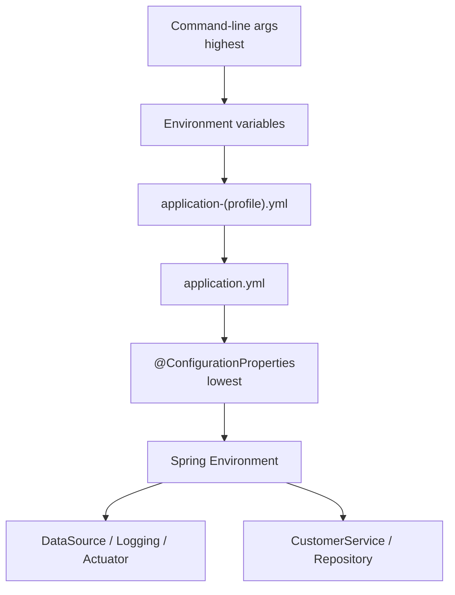
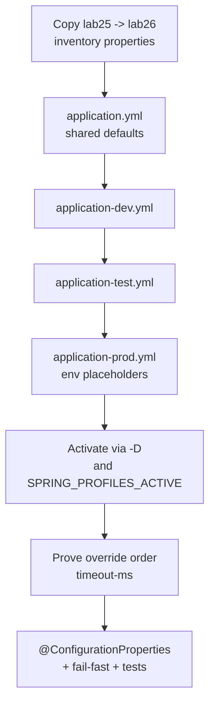

# Lab 26: Spring Profiles and Configuration — Northstar CRM Environments

**Module:** 26 — Spring Configuration, Profiles and Environments  
**Lab folder:** `labs/Week 3 - Spring Framework and Enterprise Patterns/module-26/lab26/`  
**Difficulty:** Intermediate  
**Duration:** ~45 minutes (timed path with starter) · Full path: 3–4 Hours

**Primary IDE:** IntelliJ IDEA Community Edition · **Optional IDE:** VS Code

| OS | How-to for this lab |
| -- | ------------------- |
| Windows | [LAB-26-WINDOWS.md](LAB-26-WINDOWS.md) |
| macOS | [LAB-26-MACOS.md](LAB-26-MACOS.md) |

> **Environment reminder:** Finish [Lab 0](../../../Week%201%20-%20Java%20and%20JVM%20Foundations/module-00/lab0/LAB-0-GUIDE.md). Use **IntelliJ IDEA Community** (primary; optional VS Code) on your laptop with **JDK 21** and **Maven 3.9+** (Spring Boot 3.x via Maven). Work under `~/java-bootcamp` (Windows: `%USERPROFILE%\java-bootcamp`).

---

## 45-minute timed path (use starter)

In class, use the starter templates so the **core** objectives fit **~45 minutes**. The full Steps below remain for homework / extended depth.

1. Open [`starter/README.md`](starter/README.md).
2. Copy `starter/` into your `java-bootcamp/examples/…` target (see starter README).
3. Fill every `// TODO` — do **not** wait on a perfect prior lab; the starter includes a baseline.
4. Run the starter smoke test; evidence under `notes/screenshots/lab-26/`.
5. Mark timed-path Pass criteria in the starter README. Continue remaining GUIDE steps as homework if needed.

| Path | Time | Scope |
| ---- | ---- | ----- |
| **Timed (default)** | ~45 min | Starter TODOs + smoke test |
| **Full (extended)** | see Duration | Every Step in this GUIDE |

---

## How to follow this lab

1. **In class (timed path):** prefer [`starter/README.md`](starter/README.md) — copy starter → `java-bootcamp/examples/lab26-crm`, fill `// TODO`, run smoke test (~45 min).
2. Open the **Windows** or **macOS** how-to (links above) in a second tab for OS-specific commands.
3. Create/work only under your `java-bootcamp/examples/…` folder from the steps (not inside this `labs/` git clone unless a step says otherwise).
4. For each **Step N** (full path / homework): read **Why** (if present) → do the actions → confirm **Expected** / **Expected result** → then continue.
5. When stuck, use **Failure Experiments** / troubleshooting in this guide before asking for help.
6. Capture evidence under `notes/screenshots/lab-26/` (workspace root under `java-bootcamp`; redact secrets). Use the **Pass criteria** tables — write **Pass** or **Fail** in your notes. GitHub file view does not support clickable checkboxes.


## What you'll submit (read this first)

Keep this checklist visible while you work. Full detail is under [Expected Deliverables](#expected-deliverables) at the end.

| # | Deliverable |
| - | ----------- |
| 1 | `application.yml` + `dev`/`test`/`prod` profile files |
| 2 | `NorthstarIntegrationProperties` + enable config |
| 3 | `.env.example` placeholders only |
| 4 | Evidence of `-D` and env profile activation |
| 5 | Fail-fast prod startup evidence |
| 6 | Override-order notes with measurements |
| 7 | Dual green tests under `test` |
| 8 | CRM smoke under `dev` for fixtures |


## Lab Overview

This Module 26 lab externalizes **environment-aware configuration** for the Customer Management Platform. You convert shared defaults to `application.yml`, split `application-dev.yml` / `application-test.yml` / `application-prod.yml`, activate profiles two ways, prove property-source override order, bind settings with `@ConfigurationProperties`, and keep real secrets out of Git.

**Purpose.** Incidents from `dev` settings leaking into production (H2 console open, blank DB password in YAML, verbose SQL in prod) are unacceptable. Leadership freezes: running config depends on *where* the app is deployed; `prod` credentials arrive only via environment variables; missing required prod properties **fail fast** at startup.

**What you build (exercise).** Copy to `lab26-crm`; inventory then replace properties with YAML; author three profile files; activate via `-D` and `SPRING_PROFILES_ACTIVE`; demonstrate CLI > env > profile YAML > base YAML precedence; add `NorthstarIntegrationProperties`; `.env.example` only; evidence with fixtures still callable under `dev`; dual green tests under `test`.

**What success looks like.** Under `~/java-bootcamp/examples/lab26-crm/` `dev` starts with H2-friendly settings, `prod` refuses to start without `DB_USERNAME`/`DB_PASSWORD`/`NORTHSTAR_API_KEY`, override-order evidence is recorded, no real secrets are staged, and `CUS-1001` still works under `dev`.

**Depends on Lab 25.** Need layered Boot CRM. SOAP from Lab 24 may remain; do not bury secrets in SOAP config either.

**CRM connection.** Fixtures `CUS-1001` / `CUS-1002`, correlation `lab26-001` (or `lab-request-001`). Lab 27 uses profile-friendly datasource settings for transactional demos; Labs 43/45 reuse env-var secret injection patterns.

---

## Learning Objectives

After completing this lab, you will be able to:

* Explain Spring property-source override order (CLI > env > `application-{profile}.yml` > `application.yml` > code defaults)
* Convert `application.properties` to `application.yml` and know when each format helps
* Create and structure `application-dev.yml`, `application-test.yml`, and `application-prod.yml`
* Activate a profile with `-Dspring.profiles.active` / `spring-boot.run.profiles` and with `SPRING_PROFILES_ACTIVE`
* Bind externalized configuration with `@ConfigurationProperties` instead of scattered `@Value`
* Fail fast when a required production property is missing
* Apply secrets-handling practices: never commit real credentials; use env vars / future secrets managers
* Explain how env vars foreshadow Lab 43 (CI variables) and Lab 45 (IaC secrets)
* Keep CRM fixtures working under the `dev` profile

---

## Business Scenario

Northstar’s CRM must run in three places: laptop/laptop sandbox (`dev`), CI (`test`), and shared production with an PostgreSQL-style database (`prod`). The team keeps shipping incidents caused by developer settings in shared files.

Leadership freezes:

**No profile-specific file may contain a real secret. Production credentials must come from environment variables. Missing required prod placeholders fail startup — never connect with blank passwords.**

Use these examples consistently:

| ID | Name | Notes |
| -- | ---- | ----- |
| `CUS-1001` | Amina Khan | `ACTIVE` — smoke under `dev` |
| `CUS-1002` | Ravi Singh | `PROSPECT` — smoke under `dev` |
| `lab26-001` | — | correlation / evidence id |
| `DB_USERNAME` / `DB_PASSWORD` / `NORTHSTAR_API_KEY` | — | **env only** for prod — never real values in Git |
| `.env.example` | — | placeholders only |

**Security note for evidence.** Commit `.env.example` with `changeme` placeholders. Never commit `.env`, real PostgreSQL passwords, or live API keys. Restrict `/actuator/env` in prod.

---

## Architecture Context

### NOW (this lab)



### Lab flow (mermaid)



### Architecture NOW vs LATER

| Aspect | Lab 26 (NOW) | Lab 27 / 43 / 45 (LATER) |
| ------ | ------------ | ------------------------ |
| Secrets | Env vars + `.env.example` | CI variables / Ansible / Vault patterns |
| DB | H2 in dev/test; PostgreSQL placeholders in prod | Real TX demos (27); managed infra later |
| Actuator | Broader in dev; tightened in prod YAML | Security hardening (28) |
| Binding | `@ConfigurationProperties` | Same style for new feature toggles |

**Lab focus:** Override order, YAML profiles, activation two ways, typed binding, secrets out of Git.

---

## Prerequisites

Complete [SETUP](../../../SETUP-INSTRUCTIONS.md), [Lab 0](../../../Week%201%20-%20Java%20and%20JVM%20Foundations/module-00/lab0/LAB-0-GUIDE.md), and [Lab 25](../../module-25/lab25/LAB-25-GUIDE.md). Confirm:

* JDK 21; Maven; Spring Boot 3
* Working `lab25-crm` with Customer layers on port 8080
* Ability to set JVM system properties and OS environment variables (Bash or PowerShell)
* No secrets committed to Git

### Pre-flight

```bash
java -version
mvn -version
git --version
pwd
ls ~/java-bootcamp/examples
```

---

## Suggested Project Files

```text
~/java-bootcamp/examples/lab26-crm/
├── src/
│   ├── main/
│   │   ├── java/com/northstar/crm/
│   │   │   ├── config/
│   │   │   │   ├── NorthstarIntegrationProperties.java
│   │   │   │   └── IntegrationConfig.java
│   │   │   ├── controller/...
│   │   │   ├── service/...
│   │   │   ├── repository/...
│   │   │   └── ...
│   │   └── resources/
│   │       ├── application.yml
│   │       ├── application-dev.yml
│   │       ├── application-test.yml
│   │       └── application-prod.yml
│   └── test/java/com/northstar/crm/config/
│       └── ConfigurationPrecedenceTest.java
├── docs/
│   └── config-notes.md
├── notes/screenshots/
├── .env.example
├── .gitignore
├── pom.xml
└── README.md
```

Ignore `target/`, `.env`, IDE metadata, and any file holding a real password.

---

## Concepts to Discuss

Write 2–3 sentences each in `docs/config-notes.md`:

1. Why CLI beats env, and env beats profile YAML
2. When `.properties` vs YAML nesting pays off
3. What “active profile” means if two profiles set the same key
4. Why prod passwords must never default in YAML
5. `@Value` vs `@ConfigurationProperties` for `northstar.integration`
6. Why missing required props fail startup instead of silent nulls
7. Evidence: startup banner, `/actuator/env`, exit codes
8. Link to Labs 43/45 secrets injection
9. Why `/actuator/env` exposure differs in `prod`
10. What Lab 27 needs from your datasource profile split

---

## Implementation Steps

Complete each step in order. Commands assume `~/java-bootcamp/examples/lab26-crm` (Windows: `%USERPROFILE%\java-bootcamp\examples\lab26-crm`) unless noted.

---

### Step 1 — Branch Lab 25 and inventory existing properties

**Why:** Conversion without inventory silently drops keys and causes “mystery” regressions.

**Do this:**

```bash
cd ~/java-bootcamp/examples
cp -r lab25-crm lab26-crm
cd lab26-crm
mkdir -p docs
mkdir -p ~/java-bootcamp/notes/screenshots/lab-26
```

List every key in `application.properties` (or existing YAML) on paper/notes before deleting anything: app name, port, datasource, JPA, H2 console, logging.

**Expected result:** Complete inventory in `docs/config-notes.md`; no key forgotten between Step 1 and Step 2.

**If it fails:** Project only has inline defaults → still document intended keys before authoring YAML.

---

### Step 2 — Convert shared defaults to `application.yml`

**Why:** Shared settings must be profile-agnostic so environment files only carry deltas.

**Do this:** Create `application.yml` with application name, default profile `dev`, port, management health/info (lab baseline), logging pattern with correlation placeholder, and `northstar.integration` **placeholder** values for local-only. Delete `application.properties` after compile succeeds.

```bash
mvn -q clean compile
```

**Expected result:** Only YAML remains for app config; compile success.

**If it fails:** Indentation errors → fix YAML structure. Both `.properties` and `.yml` conflicting → remove properties after migration.

---

### Step 3 — Author `application-dev.yml` and `application-test.yml`

**Why:** Developers need loud SQL and H2 console; CI needs quiet logs and isolated schema — never the same file.

**Do this:**

```yaml
# application-dev.yml
spring:
  datasource:
    url: jdbc:h2:mem:crmdev;DB_CLOSE_DELAY=-1
    driver-class-name: org.h2.Driver
    username: sa
    password: ""
  h2:
    console:
      enabled: true
      path: /h2-console
  jpa:
    hibernate:
      ddl-auto: update
    show-sql: true
logging:
  level:
    com.northstar.crm: DEBUG
    org.hibernate.SQL: DEBUG
northstar:
  integration:
    api-key: "dev-local-key-not-secret"
    timeout-ms: 3000

# application-test.yml
spring:
  datasource:
    url: jdbc:h2:mem:crmtest;DB_CLOSE_DELAY=-1
    driver-class-name: org.h2.Driver
    username: sa
    password: ""
  h2:
    console:
      enabled: false
  jpa:
    hibernate:
      ddl-auto: create-drop
    show-sql: false
logging:
  level:
    root: WARN
    com.northstar.crm: INFO
northstar:
  integration:
    api-key: "test-fixture-key"
    timeout-ms: 500
```

```bash
mvn spring-boot:run -Dspring-boot.run.profiles=dev
```

**Expected result:** Banner shows `dev`; H2 console path available in logs/docs; CRM GET `CUS-1001` still works if seeds present.

**If it fails:** Profile not active → check activation and filename. Seeds missing after profile change → confirm datasource URL still in-memory / seeder still runs.

---

### Step 4 — Author `application-prod.yml` with env-only secrets

**Why:** Fail-fast missing credentials beat silent empty-password connects.

**Do this:**

```yaml
# application-prod.yml
spring:
  datasource:
    url: jdbc:postgresql://${DB_HOST:prod-db.northstar.internal}:${DB_PORT:5432}/${DB_SERVICE:CRMPROD}
    driver-class-name: org.postgresql.Driver
    username: ${DB_USERNAME}
    password: ${DB_PASSWORD}
    hikari:
      maximum-pool-size: 10
  jpa:
    hibernate:
      ddl-auto: validate
    show-sql: false
  h2:
    console:
      enabled: false
logging:
  level:
    root: WARN
    com.northstar.crm: INFO
management:
  endpoints:
    web:
      exposure:
        include: health
northstar:
  integration:
    api-key: ${NORTHSTAR_API_KEY}
    timeout-ms: 3000
```

```bash
mvn spring-boot:run -Dspring-boot.run.profiles=prod
```

**Expected result:** `APPLICATION FAILED TO START` / unresolved placeholder for missing env vars.

**If it fails:** App starts with blanks → you added defaults like `${DB_PASSWORD:}` — remove defaults for secrets. Wrong driver on classpath → acceptable for this lab if fail is still placeholder resolution; document PostgreSQL driver note.
---

### Step 5 — Activate profiles two ways

**Why:** Ops and CI activate profiles differently; students must know both dials.

**Do this:**

```bash
mvn spring-boot:run -Dspring-boot.run.profiles=dev
# packaged form (after package):
# java -Dspring.profiles.active=dev -jar target/*.jar
```

Then (Bash):

```bash
export SPRING_PROFILES_ACTIVE=test
mvn spring-boot:run
unset SPRING_PROFILES_ACTIVE
```

PowerShell equivalent: `$env:SPRING_PROFILES_ACTIVE="test"` then clear.

**Expected result:** Evidence of both activation styles in notes (banner lines).

**If it fails:** Env var ignored in same shell where `-D` also set → document which wins next step. Maven fork not inheriting env → export in same terminal session.

---

### Step 6 — Prove override order with `timeout-ms`

**Why:** Trust the precedence table by watching the same key change winners.

**Do this:** Under `test` profile (YAML value e.g. `500`), then set `NORTHSTAR_INTEGRATION_TIMEOUT_MS=9999`, then `-Dnorthstar.integration.timeout-ms=1234`. Record effective value via `/actuator/env/...` (dev/test only) or a small `@ConfigurationProperties` log/test.

| Layer | Source | Expected timeout-ms |
| ----- | ------ | ------------------- |
| Profile YAML | `application-test.yml` | 500 |
| Env var | `NORTHSTAR_INTEGRATION_TIMEOUT_MS` | 9999 |
| CLI `-D` | system property | 1234 |

**Expected result:** Recorded three measurements matching the table; CLI wins over env.

**If it fails:** Relaxed binding confusion (`timeout-ms` vs `timeoutMs`) → use Boot’s relaxed rules consistently. Actuator env not exposed → use a unit `ApplicationContextRunner` / test instead and document.

---

### Step 7 — Bind `@ConfigurationProperties` and `.env.example`

**Why:** Typed, validated binding fails with named fields instead of late NPEs.

**Do this:** `NorthstarIntegrationProperties` record with `@Validated`, `@NotBlank apiKey`, `@Positive timeoutMs`, prefix `northstar.integration`. Enable via `@EnableConfigurationProperties`. Add `.env.example` with `DB_*` and `NORTHSTAR_API_KEY=changeme`. Ensure `.gitignore` ignores `.env`.

```bash
mvn spring-boot:run -Dspring-boot.run.profiles=prod
```

**Expected result:** Fail-fast on missing/blank prod binding fields; `.env.example` committed; `.env` not.

**If it fails:** Properties not bound → enable config props + correct prefix. Validation not running → add validation starter / `@Validated`.

---

### Step 8 — Tests under `test` profile + CRM smoke under `dev`

**Why:** Config work must not break Lab 25 fixtures or CI quietness.

**Do this:** Run tests with `spring.profiles.active=test`. Under `dev`, curl `CUS-1001`/`CUS-1002` with `X-Correlation-Id: lab26-001`. Optional `ConfigurationPrecedenceTest` documenting one precedence assertion.

```bash
mvn -q test -Dspring.profiles.active=test
mvn -q test -Dspring.profiles.active=test
```

**Expected result:** Dual green tests; `dev` smoke curls succeed; notes include override evidence.

**If it fails:** Tests picking `dev` loud SQL → force `test` profile in `src/test/resources` or Surefire. Seeds fail under test H2 name → confirm seeder/schema init for test URL.

---

### Step 9 — Failure experiments + secrets hygiene pack

**Why:** The lab’s culture win is catching secrets before commit, not only green `dev`.

**Do this:** Complete [Failure Experiments](#failure-experiments) including staged fake secret detection. `git status --short` shows no `.env`, no real passwords. Capture fail-fast prod startup excerpt.

**Expected result:** ≥3 experiments; secrets hygiene clean; evidence saved.

**If it fails:** See Troubleshooting.

---

## Implementation Checkpoints

### Checkpoint A — Tooling / structure

_Mark each row **Pass** or **Fail** in your lab notes (GitHub markdown files are not interactive checklists)._

| # | Confirm | Your notes |
| - | ------- | ---------- |
| 1 | `lab26-crm` under `examples/` | Pass / Fail |
| 2 | Inventory complete; shared `application.yml` present | Pass / Fail |
| 3 | `.gitignore` covers `.env` / secrets | Pass / Fail |

### Checkpoint B — Profile files

_Mark each row **Pass** or **Fail** in your lab notes (GitHub markdown files are not interactive checklists)._

| # | Confirm | Your notes |
| - | ------- | ---------- |
| 1 | `application-dev.yml` / `-test.yml` / `-prod.yml` exist | Pass / Fail |
| 2 | `prod` has no default secrets | Pass / Fail |
| 3 | `dev` CRM smoke for `CUS-1001` works | Pass / Fail |

### Checkpoint C — Activation + binding

_Mark each row **Pass** or **Fail** in your lab notes (GitHub markdown files are not interactive checklists)._

| # | Confirm | Your notes |
| - | ------- | ---------- |
| 1 | Activation via `-D` and via env evidenced | Pass / Fail |
| 2 | Override-order table measured | Pass / Fail |
| 3 | `@ConfigurationProperties` + fail-fast on prod | Pass / Fail |

### Checkpoint D — Hygiene

_Mark each row **Pass** or **Fail** in your lab notes (GitHub markdown files are not interactive checklists)._

| # | Confirm | Your notes |
| - | ------- | ---------- |
| 1 | Two consecutive `mvn test` under `test` green | Pass / Fail |
| 2 | `.env.example` only; no secrets staged | Pass / Fail |
| 3 | README runbook complete | Pass / Fail |

---

## Reference Commands, Configuration, and Code

### Override order

```text
1. Command-line arguments        (-Dspring.profiles.active=dev, -Dkey=value)
2. Environment variables         (SPRING_PROFILES_ACTIVE, DB_PASSWORD, ...)
3. application-{profile}.yml     (application-dev.yml, application-prod.yml, ...)
4. application.yml               (shared base defaults)
5. @ConfigurationProperties / @Value defaults baked into code
```

### `application.yml` (base)

```yaml
spring:
  application:
    name: customer-service
  profiles:
    default: dev
  jackson:
    default-property-inclusion: non_null
server:
  port: 8080
management:
  endpoints:
    web:
      exposure:
        include: health,info
logging:
  pattern:
    console: "%d{yyyy-MM-dd'T'HH:mm:ss.SSSXXX} %-5level [%X{correlationId}] %logger{36} - %msg%n"
  level:
    root: INFO
    com.northstar.crm: INFO
northstar:
  integration:
    api-key: "local-dev-placeholder"
    timeout-ms: 3000
```

### `@ConfigurationProperties`

```java
@Validated
@ConfigurationProperties(prefix = "northstar.integration")
public record NorthstarIntegrationProperties(
        @NotBlank String apiKey,
        @Positive long timeoutMs) {
}
```

### `.env.example`

```text
# copy to .env locally — NEVER commit .env
DB_HOST=prod-db.northstar.internal
DB_PORT=5432
DB_SERVICE=CRMPROD
DB_USERNAME=changeme
DB_PASSWORD=changeme
NORTHSTAR_API_KEY=changeme
```

### Commands

```bash
cd ~/java-bootcamp/examples/lab26-crm
mvn spring-boot:run -Dspring-boot.run.profiles=dev
curl -s -H "X-Correlation-Id: lab26-001" http://localhost:8080/api/customers/CUS-1001
mvn test -Dspring.profiles.active=test
mvn test -Dspring.profiles.active=test
# expect fail without env:
mvn spring-boot:run -Dspring-boot.run.profiles=prod

# PowerShell profile via env:
# $env:SPRING_PROFILES_ACTIVE="test"
# mvn spring-boot:run
# Remove-Item Env:SPRING_PROFILES_ACTIVE

# Override order demo (illustrative):
# export SPRING_PROFILES_ACTIVE=test
# export NORTHSTAR_INTEGRATION_TIMEOUT_MS=9999
# mvn spring-boot:run -Dnorthstar.integration.timeout-ms=1234

git status --short
```

### Evidence checklist

```text
[ ] Inventory of old properties completed before delete
[ ] Only YAML remains (no application.properties)
[ ] dev / test / prod files present
[ ] prod fails without DB_USERNAME / DB_PASSWORD / NORTHSTAR_API_KEY
[ ] -D activation evidenced
[ ] SPRING_PROFILES_ACTIVE evidenced
[ ] Override-order timeout measurements recorded
[ ] .env.example committed; .env not staged
[ ] CUS-1001 smoke under dev
[ ] mvn test under test twice identical
```

### Class map

| Artifact | Role |
| -------- | ---- |
| `application.yml` | Shared defaults |
| `application-*.yml` | Environment deltas |
| `NorthstarIntegrationProperties` | Typed binding |
| `.env.example` | Placeholder contract |
| `ConfigurationPrecedenceTest` | Optional precedence gate |
---

## Manual Verification

1. `dev` starts; active profile banner shows `dev`.
2. `test` profile runs Quiet/CI-friendly tests.
3. `prod` without env vars fails startup (no blank-password connect).
4. With env vars supplied (fake lab values), prod start either connects or fails for driver/network — **not** for missing placeholders.
5. CLI `-D` overrides env for the same key (evidence recorded).
6. `application.properties` gone (YAML only).
7. GET `CUS-1001` under `dev` with correlation works.
8. `/actuator/env` exposure is tighter in prod YAML intent.
9. Two consecutive tests under `test` match.
10. `git status` shows no secrets / `.env`.

---

## Failure Experiments

| # | Experiment | Observe | Restore |
| - | ---------- | ------- | ------- |
| 1 | `prod` without `DB_PASSWORD` | Fail-fast startup | Unset experiment vars |
| 2 | Env `test` + CLI `dev` | Document which wins | Unset |
| 3 | Rename key only in YAML (binding mismatch) | Bind fail or fallback | Fix name |
| 4 | Temporarily put `DB_PASSWORD=hunter2` in prod YAML | Catch via `git status`/`diff` | Revert immediately |
| 5 | Leave `SPRING_PROFILES_ACTIVE` unset where default is `dev` | Confirm default path | Document blast radius for real prod |

---

## Troubleshooting

| Symptom | Likely cause | Fix |
| ------- | ------------ | --- |
| Profile ignored | Wrong filename / not activated | `application-{name}.yml` + active profile |
| Env not picked up | Not exported in same shell / need restart | Restart after env change |
| Tests use `dev` | No test profile force | Surefire/`src/test/resources` |
| Prod starts empty password | Default `${VAR:}` used | Remove secret defaults |
| Binding null | Prefix/enable missing | `@EnableConfigurationProperties` |
| CRM seeds gone | Datasource URL changed | Align seeder with profile DB |

---

## Security and Production Review

Answer in README:

1. Which config values are sensitive per profile, and where stored?
2. Why must `application-prod.yml` avoid defaults for DB username/password?
3. What if a real PostgreSQL password is committed — detect, rotate, scrub history policy?
4. Which local-only settings are unacceptable in prod (H2 console, `ddl-auto: update`, verbose SQL)?
5. How do Labs 43/45 relate to these env vars?
6. What does `/actuator/env` expose and why restrict in prod?
7. How do you rotate `NORTHSTAR_API_KEY` without rebuild?
8. Blast radius if `SPRING_PROFILES_ACTIVE` unset in real deployment?

---

## Cleanup

```bash
cd ~/java-bootcamp/examples/lab26-crm
# Ctrl+C any spring-boot:run
unset SPRING_PROFILES_ACTIVE NORTHSTAR_INTEGRATION_TIMEOUT_MS DB_USERNAME DB_PASSWORD NORTHSTAR_API_KEY
mvn -q clean
git status --short
```

**Keep `lab26-crm`**—Lab 27 builds transactional services on this config discipline.

---

## Expected Deliverables

Same checklist as [What you'll submit](#what-youll-submit-read-this-first) above.

* `application.yml` + `dev`/`test`/`prod` profile files
* `NorthstarIntegrationProperties` + enable config
* `.env.example` placeholders only
* Evidence of `-D` and env profile activation
* Fail-fast prod startup evidence
* Override-order notes with measurements
* Dual green tests under `test`
* CRM smoke under `dev` for fixtures
* No secrets or `target/` committed

---

## Evaluation Rubric (100 Marks)

| Criteria | Marks |
| -------- | ----: |
| Environment and project structure | 10 |
| Core implementation (YAML + profile files) | 30 |
| Profile activation and override-order evidence | 15 |
| Externalized configuration and fail-fast behavior | 15 |
| Failure handling | 10 |
| Security and secrets-handling awareness | 10 |
| Documentation and evidence | 10 |

**Notes:** Real secrets in Git → honor violation. Prod YAML with default passwords → lose security/fail-fast marks. No override evidence → lose activation marks.

---

## Reflection Questions

Write 3–6 sentence answers:

1. Which design decision most affected correctness — YAML split or typed binding?
2. Which failure was hardest (missing prop, wrong profile, override confusion)?
3. What evidence proves `prod` cannot start with blank credentials?
4. What breaks first if `dev` settings leak into `prod`?
5. Which concern should move to a shared secrets manager?
6. What must change before real customer data touches `prod`?
7. How does this lab connect to Labs 25 and 27 (and 43/45)?
8. Which `/actuator/env` or log field matters most for misconfig diagnosis?
9. (Forward look) Which keys should Lab 27 refuse to hard-code?

---

## Bonus Challenges

1. Fourth profile `staging` mirroring prod with disposable DB.
2. Duration converter for timeout instead of raw ms.
3. `ApplicationContextRunner` test asserting prod fails without `DB_PASSWORD`.
4. Optional local `.env` import with documented risk.
5. Document Vault / AWS Secrets Manager alternative to raw env vars.
6. Assert Actuator exposure differs between `dev` and `prod` in a test.

---

## Success Criteria

You are finished when:

* Override order, YAML profiles, and two activation methods are demonstrated
* Happy path (`dev`) and fail-fast (`prod` without credentials) are repeatable
* Another student can follow your run instructions
* Tests pass under `test` twice
* No production secret is hard-coded
* You can explain local vs production trade-offs per profile
* CRM fixtures still smoke under `dev`

---

## Instructor Notes

* **Live probe:** Reproduce missing-`DB_PASSWORD` failure; ask which source won in the timeout experiment; confirm `.env` not staged.
* **Assess:** Honest prod placeholders; override evidence; typed properties; no secret defaults.
* **Continuity:** Prefer `examples/lab26-crm` from Lab 25. Keep fixture IDs. Lab 27 should consume profile datasource settings, not invent a second config tree.
* **Common pitfalls:** `${PASSWORD:}` empty defaults; committing `.env`; assuming env changes apply without restart; testing only `dev`.
* **Timing:** Timed path ~45 minutes with starter; full path remains 3–4 hours. Keep starter TODOs as the in-class core; remaining GUIDE steps are homework/extended depth.

---

*End of Lab 26 — Spring Profiles and Configuration: Northstar CRM Environments. Keep `lab26-crm` for Lab 27 and portfolio evidence.*
