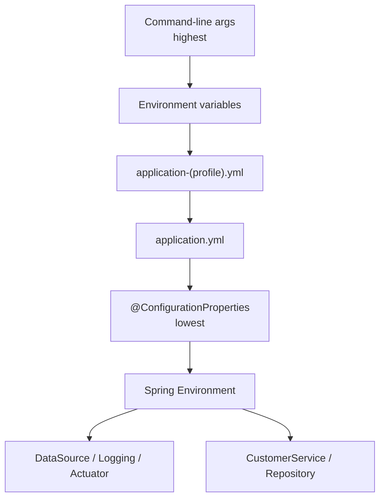

# Lab 26: Spring Profiles and Configuration — Northstar CRM Environments

> **Participants:** Module sequence is in [`../README.md`](../README.md). **Do not start this guide until** you have finished Module 26 [pre-lab exercises 1–6](../exercises/EXERCISES-INDEX.md) (Pass in your notes; order **1 → 2 → 3 → 4 → 5 → 6**). Then open **one** OS how-to ([Windows](LAB-26-WINDOWS.md) · [macOS](LAB-26-MACOS.md)). In class, prefer the **45-minute timed path** with [`starter/`](starter/README.md); the **full path** is every Step below (homework / extended). Skip `solution/` unless your instructor says otherwise. See [Which file do I open?](../../../_PARTICIPANT-FILE-GUIDE.md).

## Activity card

| | |
| --- | --- |
| **Objective** | Externalize CRM config with dev/test/prod profiles, typed properties, and secret hygiene |
| **Skills practiced** | Profile YAML, activation (-D + env), override order, @ConfigurationProperties |
| **Expected outcome** | Profile files · ConfigProperties · activation evidence · prod fail-fast · no secrets in Git |
| **Estimated time** | Timed path ~45 min · Full path 3–4 hours |
| **Prerequisites** | Lab 0 · Lab 25 preferred · Exercises 1–6 Pass · JDK 21 · Maven 3.9+ |
| **Expected files** | `examples/lab26-crm/` — YAML profiles, properties class, .env.example, notes |
| **Validation checkpoints** | Starter smoke · GUIDE Implementation Checkpoints |

**Module:** 26 — Spring Configuration, Profiles and Environments  
**Duration:** ~45 minutes (timed path with starter) · Full path: 3–4 Hours

**Primary IDE:** IntelliJ IDEA Community Edition · **Optional IDE:** VS Code

| OS | How-to for this lab |
| -- | ------------------- |
| Windows | [LAB-26-WINDOWS.md](LAB-26-WINDOWS.md) |
| macOS | [LAB-26-MACOS.md](LAB-26-MACOS.md) |

> **Incremental build:** Profile purposes → YAML TODOs → ConfigProperties → override order → activation → Lab 26.

> **Classroom pacing:** [`../PACING.md`](../PACING.md) (Checkpoints A–D).

> **Critical scope:** **Never commit real secrets**. `.env.example` placeholders only. Prove **`-D` and env** activation. **prod fail-fast** without required env vars. Vault/JWT/`@Transactional` → later.

## 45-minute timed path (use starter)

In class, use the starter templates so the **core** objectives fit **~45 minutes**. The full Steps below remain for homework / extended depth.

1. Open [`starter/README.md`](starter/README.md).
2. Copy `starter/` into your `java-bootcamp/examples/…` target (see starter README).
3. Fill every `// TODO` — do **not** wait on a perfect prior lab; the starter includes a baseline.
4. Run the starter smoke test; evidence under `notes/screenshots/lab-26/`.
5. Mark timed-path Pass criteria in the starter README. Continue remaining GUIDE steps as homework if needed.

| Path | Time | Scope |
| ---- | ---- | ----- |
| **Timed (default)** | ~45 min | Starter TODOs + smoke test |
| **Full (extended)** | see Duration | Every Step in this GUIDE |

---

## What you'll submit (read this first)

Keep this checklist visible while you work.

| # | Deliverable |
| - | ----------- |
| 1 | `application.yml` + `dev`/`test`/`prod` profile files |
| 2 | `NorthstarIntegrationProperties` + enable config |
| 3 | `.env.example` placeholders only |
| 4 | Evidence of `-D` and env profile activation |
| 5 | Fail-fast prod startup evidence |
| 6 | Override-order notes with measurements |
| 7 | Dual green tests under `test` |
| 8 | CRM smoke under `dev` for fixtures |

**Must submit:** the items in the table above (sources + evidence + short notes).

**Do not submit:** `target/`, `node_modules/`, secrets, heap dumps, or a verbatim instructor `solution/`.

## Lab Overview

This Module 26 lab externalizes **environment-aware configuration** for the Customer Management Platform. You convert shared defaults to `application.yml`, split `application-dev.yml` / `application-test.yml` / `application-prod.yml`, activate profiles two ways, prove property-source override order, bind settings with `@ConfigurationProperties`, and keep real secrets out of Git.

## Learning Objectives

After completing this lab, you will be able to:

* Explain Spring property-source override order (CLI > env > `application-{profile}.yml` > `application.yml` > code defaults)
* Convert `application.properties` to `application.yml` and know when each format helps
* Create and structure `application-dev.yml`, `application-test.yml`, and `application-prod.yml`
* Activate a profile with `-Dspring.profiles.active` / `spring-boot.run.profiles` and with `SPRING_PROFILES_ACTIVE`
* Bind externalized configuration with `@ConfigurationProperties` instead of scattered `@Value`

## Business Scenario

Northstar’s CRM must run in three places: laptop/laptop sandbox (`dev`), CI (`test`), and shared production with an PostgreSQL-style database (`prod`). The team keeps shipping incidents caused by developer settings in shared files.

Leadership freezes:

**No profile-specific file may contain a real secret. Production credentials must come from environment variables. Missing required prod placeholders fail startup — never connect with blank passwords.**

Use these examples consistently:

| ID | Name | Notes |
| -- | ---- | ----- |
| `CUS-1001` | Amina Khan | `ACTIVE` — smoke under `dev` |
| `CUS-1002` | Ravi Singh | `PROSPECT` — smoke under `dev` |
| `lab-request-001` | — | correlation / evidence id |
| `DB_USERNAME` / `DB_PASSWORD` / `NORTHSTAR_API_KEY` | — | **env only** for prod — never real values in Git |
| `.env.example` | — | placeholders only |

**Security note for evidence.** Commit `.env.example` with `changeme` placeholders. Never commit `.env`, real PostgreSQL passwords, or live API keys. Restrict `/actuator/env` in prod.

---

## Architecture Context
### NOW (this lab)


```mermaid
flowchart TB
  CLI["Command-line args<br/>highest"] --> Env["Environment variables"]
  Env --> Prof["application-(profile).yml"]
  Prof --> Base["application.yml"]
  Base --> Props["@ConfigurationProperties<br/>lowest"]
  Props --> Spring["Spring Environment"]
  Spring --> DS["DataSource / Logging / Actuator"]
  Spring --> Svc["CustomerService / Repository"]
```

## Prerequisites

Prior labs: [Lab 25](../../module-25/lab25/LAB-25-GUIDE.md).

Confirm (Lab 0 tools assumed):

* JDK 21; Maven; Spring Boot 3
* Working `lab25-crm` with Customer layers on port 8080
* Ability to set JVM system properties and OS environment variables (Bash or PowerShell)
* No secrets committed to Git

### Pre-flight

```bash
java -version
mvn -version
```

## Worked example (read before you code)

Study this pattern once before Step 1. Your job is to apply the same idea in the Steps — do not skip ahead to a full solution.

```yaml
# application-dev.yml
spring:
  datasource:
    url: jdbc:h2:mem:crmdev;DB_CLOSE_DELAY=-1
    driver-class-name: org.h2.Driver
    username: sa
    password: ""
  h2:
    console:
      enabled: true
      path: /h2-console
  jpa:
    hibernate:
      ddl-auto: update
    show-sql: true
logging:
  level:
    com.northstar.crm: DEBUG
    org.hibernate.SQL: DEBUG
northstar:
  integration:
    api-key: "dev-local-key-not-secret"
    connect-timeout-ms: 3000

# application-test.yml
spring:
  datasource:
    url: jdbc:h2:mem:crmtest;DB_CLOSE_DELAY=-1
    driver-class-name: org.h2.Driver
    username: sa
    password: ""
  h2:
    console:
      enabled: false
  jpa:
    hibernate:
      ddl-auto: create-drop
    show-sql: false
logging:
  level:
// ... truncated — see full sample in the Steps
```

**What to notice:** Match names, IDs, and failure behavior from the scenario — instructors check these.

---

## Implementation Steps

Complete each step in order. Commands assume `~/java-bootcamp/examples/lab26-crm` (Windows: `%USERPROFILE%\java-bootcamp\examples\lab26-crm`) unless noted.

---

### Step 1 — Branch Lab 25 and inventory existing properties

**Why:** Conversion without inventory silently drops keys and causes “mystery” regressions.

**Do this:**

```bash
cd ~/java-bootcamp/examples
cp -r lab25-crm lab26-crm
cd lab26-crm
mkdir -p docs
mkdir -p ~/java-bootcamp/notes/screenshots/lab-26
```

List every key in `application.properties` (or existing YAML) on paper/notes before deleting anything: app name, port, datasource, JPA, H2 console, logging.

**Expected result:** Complete inventory in `docs/config-notes.md`; no key forgotten between Step 1 and Step 2.

**If it fails:** Project only has inline defaults → still document intended keys before authoring YAML.

---

### Step 2 — Convert shared defaults to `application.yml`

**Why:** Shared settings must be profile-agnostic so environment files only carry deltas.

**Do this:** Create `application.yml` with application name, default profile `dev`, port, management health/info (lab baseline), logging pattern with correlation placeholder, and `northstar.integration` **placeholder** values for local-only. Delete `application.properties` after compile succeeds.

```bash
mvn -q clean compile
```

**Expected result:** Only YAML remains for app config; compile success.

**If it fails:** Indentation errors → fix YAML structure. Both `.properties` and `.yml` conflicting → remove properties after migration.

---

### Step 3 — Author `application-dev.yml` and `application-test.yml`

**Why:** Developers need loud SQL and H2 console; CI needs quiet logs and isolated schema — never the same file.

**Do this:**

```yaml
# application-dev.yml
spring:
  datasource:
    url: jdbc:h2:mem:crmdev;DB_CLOSE_DELAY=-1
    driver-class-name: org.h2.Driver
    username: sa
    password: ""
  h2:
    console:
      enabled: true
      path: /h2-console
  jpa:
    hibernate:
      ddl-auto: update
    show-sql: true
logging:
  level:
    com.northstar.crm: DEBUG
    org.hibernate.SQL: DEBUG
northstar:
  integration:
    api-key: "dev-local-key-not-secret"
    connect-timeout-ms: 3000

# application-test.yml
spring:
  datasource:
    url: jdbc:h2:mem:crmtest;DB_CLOSE_DELAY=-1
    driver-class-name: org.h2.Driver
    username: sa
    password: ""
  h2:
    console:
      enabled: false
  jpa:
    hibernate:
      ddl-auto: create-drop
    show-sql: false
logging:
  level:
    root: WARN
    com.northstar.crm: INFO
northstar:
  integration:
    api-key: "test-fixture-key"
    connect-timeout-ms: 100
```

```bash
mvn spring-boot:run -Dspring-boot.run.profiles=dev
```

**Expected result:** Banner shows `dev`; H2 console path available in logs/docs; CRM GET `CUS-1001` still works if seeds present.

**If it fails:** Profile not active → check activation and filename. Seeds missing after profile change → confirm datasource URL still in-memory / seeder still runs.

---

### Step 4 — Author `application-prod.yml` with env-only secrets

**Why:** Fail-fast missing credentials beat silent empty-password connects.

**Do this:**

```yaml
# application-prod.yml
spring:
  datasource:
    url: jdbc:postgresql://${DB_HOST:prod-db.northstar.internal}:${DB_PORT:5432}/${DB_SERVICE:CRMPROD}
    driver-class-name: org.postgresql.Driver
    username: ${DB_USERNAME}
    password: ${DB_PASSWORD}
    hikari:
      maximum-pool-size: 10
  jpa:
    hibernate:
      ddl-auto: validate
    show-sql: false
  h2:
    console:
      enabled: false
logging:
  level:
    root: WARN
    com.northstar.crm: INFO
management:
  endpoints:
    web:
      exposure:
        include: health
northstar:
  integration:
    api-key: ${NORTHSTAR_API_KEY}
    connect-timeout-ms: 3000
```

```bash
mvn spring-boot:run -Dspring-boot.run.profiles=prod
```

**Expected result:** `APPLICATION FAILED TO START` / unresolved placeholder for missing env vars.

**If it fails:** App starts with blanks → you added defaults like `${DB_PASSWORD:}` — remove defaults for secrets. Wrong driver on classpath → acceptable for this lab if fail is still placeholder resolution; document PostgreSQL driver note.
---

### Step 5 — Activate profiles two ways

**Why:** Ops and CI activate profiles differently; students must know both dials.

**Do this:**

```bash
mvn spring-boot:run -Dspring-boot.run.profiles=dev
# packaged form (after package):
# java -Dspring.profiles.active=dev -jar target/*.jar
```

Then (Bash):

```bash
export SPRING_PROFILES_ACTIVE=test
mvn spring-boot:run
unset SPRING_PROFILES_ACTIVE
```

PowerShell equivalent: `$env:SPRING_PROFILES_ACTIVE="test"` then clear.

**Expected result:** Evidence of both activation styles in notes (banner lines).

**If it fails:** Env var ignored in same shell where `-D` also set → document which wins next step. Maven fork not inheriting env → export in same terminal session.

---

### Step 6 — Prove override order with `connect-timeout-ms`

**Why:** Trust the precedence table by watching the same key change winners.

**Do this:** Under `test` profile (YAML value `100` in starter `application-test.yml`), then set `NORTHSTAR_INTEGRATION_CONNECT_TIMEOUT_MS=9999`, then `-Dnorthstar.integration.connect-timeout-ms=1234`. Record effective value via `/actuator/env/...` (dev/test only) or a small `@ConfigurationProperties` log/test.

| Layer | Source | Expected connect-timeout-ms |
| ----- | ------ | ------------------- |
| Profile YAML | `application-test.yml` | 100 |
| Env var | `NORTHSTAR_INTEGRATION_CONNECT_TIMEOUT_MS` | 9999 |
| CLI `-D` | system property | 1234 |

**Expected result:** Recorded three measurements matching the table; CLI wins over env.

**If it fails:** Relaxed binding confusion (`connect-timeout-ms` vs `connectTimeoutMs`) → use Boot’s relaxed rules consistently. Actuator env not exposed → use a unit `ApplicationContextRunner` / test instead and document.

---

### Step 7 — Bind `@ConfigurationProperties` and `.env.example`

**Why:** Typed, validated binding fails with named fields instead of late NPEs.

**Do this:** `NorthstarIntegrationProperties` record with `@Validated`, `@NotBlank apiKey`, `@Positive connectTimeoutMs`, prefix `northstar.integration`. Enable via `@EnableConfigurationProperties`. Add `.env.example` with `DB_*` and `NORTHSTAR_API_KEY=changeme`. Ensure `.gitignore` ignores `.env`.

```bash
mvn spring-boot:run -Dspring-boot.run.profiles=prod
```

**Expected result:** Fail-fast on missing/blank prod binding fields; `.env.example` committed; `.env` not.

**If it fails:** Properties not bound → enable config props + correct prefix. Validation not running → add validation starter / `@Validated`.

---

### Step 8 — Tests under `test` profile + CRM smoke under `dev`

**Why:** Config work must not break Lab 25 fixtures or CI quietness.

**Do this:** Run tests with `spring.profiles.active=test`. Under `dev`, curl `CUS-1001`/`CUS-1002` with `X-Correlation-Id: lab-request-001`. Optional `ConfigurationPrecedenceTest` documenting one precedence assertion.

```bash
mvn -q test -Dspring.profiles.active=test
mvn -q test -Dspring.profiles.active=test
```

**Expected result:** Dual green tests; `dev` smoke curls succeed; notes include override evidence.

**If it fails:** Tests picking `dev` loud SQL → force `test` profile in `src/test/resources` or Surefire. Seeds fail under test H2 name → confirm seeder/schema init for test URL.

---

### Step 9 — Failure experiments + secrets hygiene pack

**Why:** The lab’s culture win is catching secrets before commit, not only green `dev`.

**Do this:** Complete Failure Experiments including staged fake secret detection. `git status --short` shows no `.env`, no real passwords. Capture fail-fast prod startup excerpt.

**Expected result:** ≥3 experiments; secrets hygiene clean; evidence saved.

**If it fails:** See Troubleshooting.

---

## Implementation Checkpoints

### Checkpoint A — Tooling / structure

_Mark **Pass** or **Fail** in your lab notes._

| # | Confirm | Your notes |
| - | ------- | ---------- |
| 1 | `lab26-crm` under `examples/` | Pass / Fail |
| 2 | Inventory complete; shared `application.yml` present | Pass / Fail |
| 3 | `.gitignore` covers `.env` / secrets | Pass / Fail |

### Checkpoint B — Profile files

_Mark **Pass** or **Fail** in your lab notes._

| # | Confirm | Your notes |
| - | ------- | ---------- |
| 1 | `application-dev.yml` / `-test.yml` / `-prod.yml` exist | Pass / Fail |
| 2 | `prod` has no default secrets | Pass / Fail |
| 3 | `dev` CRM smoke for `CUS-1001` works | Pass / Fail |

### Checkpoint C — Activation + binding

_Mark **Pass** or **Fail** in your lab notes._

| # | Confirm | Your notes |
| - | ------- | ---------- |
| 1 | Activation via `-D` and via env evidenced | Pass / Fail |
| 2 | Override-order table measured | Pass / Fail |
| 3 | `@ConfigurationProperties` + fail-fast on prod | Pass / Fail |

### Checkpoint D — Hygiene

_Mark **Pass** or **Fail** in your lab notes._

| # | Confirm | Your notes |
| - | ------- | ---------- |
| 1 | Two consecutive `mvn test` under `test` green | Pass / Fail |
| 2 | `.env.example` only; no secrets staged | Pass / Fail |
| 3 | README runbook complete | Pass / Fail |

---

## Reference Commands, Configuration, and Code

### Override order

```text
1. Command-line arguments        (-Dspring.profiles.active=dev, -Dkey=value)
2. Environment variables         (SPRING_PROFILES_ACTIVE, DB_PASSWORD, ...)
3. application-{profile}.yml     (application-dev.yml, application-prod.yml, ...)
4. application.yml               (shared base defaults)
5. @ConfigurationProperties / @Value defaults baked into code
```

### `application.yml` (base)

```yaml
spring:
  application:
    name: customer-service
  profiles:
    default: dev
  jackson:
    default-property-inclusion: non_null
server:
  port: 8080
management:
  endpoints:
    web:
      exposure:
        include: health,info
logging:
  pattern:
    console: "%d{yyyy-MM-dd'T'HH:mm:ss.SSSXXX} %-5level [%X{correlationId}] %logger{36} - %msg%n"
  level:
    root: INFO
    com.northstar.crm: INFO
northstar:
  integration:
    api-key: "local-dev-placeholder"
    connect-timeout-ms: 3000
```

### `.env.example`

```text
# copy to .env locally — NEVER commit .env
DB_HOST=prod-db.northstar.internal
DB_PORT=5432
DB_SERVICE=CRMPROD
DB_USERNAME=changeme
DB_PASSWORD=changeme
NORTHSTAR_API_KEY=changeme
```

### Commands

```bash
cd ~/java-bootcamp/examples/lab26-crm
mvn spring-boot:run -Dspring-boot.run.profiles=dev
curl -s -H "X-Correlation-Id: lab-request-001" http://localhost:8080/api/customers/CUS-1001
mvn test -Dspring.profiles.active=test
mvn test -Dspring.profiles.active=test
# expect fail without env:
mvn spring-boot:run -Dspring-boot.run.profiles=prod

# PowerShell profile via env:
# $env:SPRING_PROFILES_ACTIVE="test"
# mvn spring-boot:run
# Remove-Item Env:SPRING_PROFILES_ACTIVE

# Override order demo (illustrative):
# export SPRING_PROFILES_ACTIVE=test
# export NORTHSTAR_INTEGRATION_CONNECT_TIMEOUT_MS=9999
# mvn spring-boot:run -Dnorthstar.integration.connect-timeout-ms=1234

git status --short
```

## Failure Experiments

| # | Experiment | Observe | Restore |
| - | ---------- | ------- | ------- |
| 1 | `prod` without `DB_PASSWORD` | Fail-fast startup | Unset experiment vars |
| 2 | Env `test` + CLI `dev` | Document which wins | Unset |
| 3 | Rename key only in YAML (binding mismatch) | Bind fail or fallback | Fix name |
| 4 | Temporarily put `DB_PASSWORD=hunter2` in prod YAML | Catch via `git status`/`diff` | Revert immediately |
| 5 | Leave `SPRING_PROFILES_ACTIVE` unset where default is `dev` | Confirm default path | Document blast radius for real prod |

---

## Troubleshooting

| Symptom | Likely cause | Fix |
| ------- | ------------ | --- |
| Profile ignored | Wrong filename / not activated | `application-{name}.yml` + active profile |
| Env not picked up | Not exported in same shell / need restart | Restart after env change |
| Tests use `dev` | No test profile force | Surefire/`src/test/resources` |
| Prod starts empty password | Default `${VAR:}` used | Remove secret defaults |
| Binding null | Prefix/enable missing | `@EnableConfigurationProperties` |
| CRM seeds gone | Datasource URL changed | Align seeder with profile DB |
| Working in `module-26-exercises` for the lab | Wrong project | Lab lives in `examples/lab26-crm` |
| Real password committed | Secret hygiene failure | Remove, rotate, use `.env.example` only |

## Security and Production Review

Optional — jot brief notes in your README if useful for your progress check (not a separate essay):

1. Which config values are sensitive per profile, and where stored?
2. Why must `application-prod.yml` avoid defaults for DB username/password?
3. What if a real PostgreSQL password is committed — detect, rotate, scrub history policy?

---


## Cleanup

```bash
cd ~/java-bootcamp/examples/lab26-crm
# Ctrl+C any spring-boot:run
unset SPRING_PROFILES_ACTIVE NORTHSTAR_INTEGRATION_CONNECT_TIMEOUT_MS DB_USERNAME DB_PASSWORD NORTHSTAR_API_KEY
mvn -q clean
git status --short
```

**Keep `lab26-crm`**—Lab 27 builds transactional services on this config discipline.


## Reflection Questions

Write **1–3 sentence** answers (not essays):

1. Which design decision most affected correctness — YAML split or typed binding?
2. What evidence proves `prod` cannot start with blank credentials?
3. Which failure was hardest (missing prop, wrong profile, override confusion)?

---


