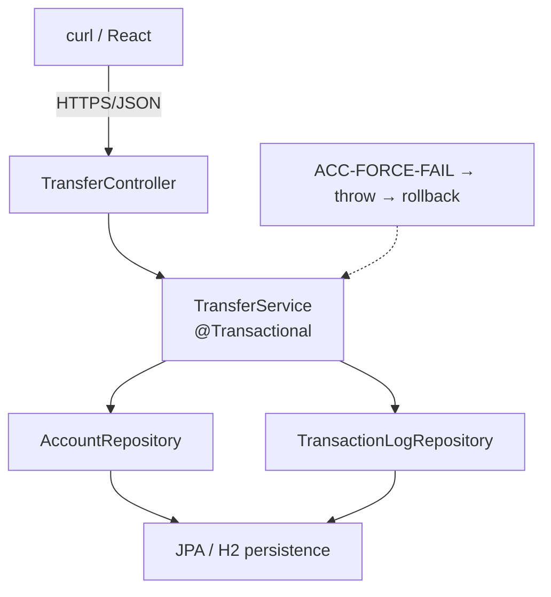
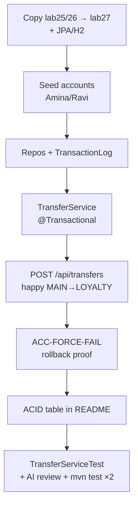

# Lab 27: Transaction Management with AI Assistance — Northstar CRM Transfers

**Module:** 27 — Transaction Management with AI Assistance  
**Lab folder:** `labs/Week 3 - Spring Framework and Enterprise Patterns/module-27/lab27/`  
**Difficulty:** Intermediate  
**Duration:** 4–5 Hours

**Primary IDE:** IntelliJ IDEA Community Edition · **Optional IDE:** VS Code

| OS | How-to for this lab |
| -- | ------------------- |
| Windows | [LAB-27-WINDOWS.md](LAB-27-WINDOWS.md) |
| macOS | [LAB-27-MACOS.md](LAB-27-MACOS.md) |

> **Environment reminder:** Finish [Lab 0](../../../Week%201%20-%20Java%20and%20JVM%20Foundations/module-00/lab0/LAB-0-GUIDE.md). Use **IntelliJ IDEA Community** (primary; optional VS Code) on your laptop with **JDK 21** and **Maven 3.9+** (Spring Boot 3.x via Maven). Work under `~/java-bootcamp` (Windows: `%USERPROFILE%\java-bootcamp`).

---

## How to follow this lab

1. Open the **Windows** or **macOS** how-to (links above) in a second tab.
2. Create/work only under your `java-bootcamp/examples/…` folder from the steps (not inside this `labs/` git clone unless a step says otherwise).
3. For each **Step N**: read **Why** (if present) → do the actions → confirm **Expected** / **Expected result** → then continue.
4. When stuck, use **Failure Experiments** / troubleshooting in this guide before asking for help.
5. Capture evidence under `notes/screenshots/` (redact secrets). Use the **Pass criteria** tables — write **Pass** or **Fail** in your notes. GitHub file view does not support clickable checkboxes.

## Lab Overview

This Module 27 lab adds Spring **`@Transactional`** boundaries for CRM financial-account updates that must succeed or fail together. You implement a **`TransferService`** (debit + credit + log), prove automatic **rollback** with destination `ACC-FORCE-FAIL`, and map observations to **ACID** guarantees used in production ledger updates. Optional Copilot drafts require review for unsafe propagation, swallowed exceptions, and transaction-on-controller anti-patterns.

**Purpose.** Partial money movement destroys finance trust. Leadership freezes: multi-account updates run inside one service transaction; forced mid-transfer failure leaves balances unchanged and writes no success log; students explain ACID with curl/SQL evidence — not slogans.

**What you build (exercise).** Copy forward to `lab27-crm`; add JPA + H2 (preferred); seed Amina/Ravi accounts; implement repositories + `TransactionLog`; `@Transactional TransferService`; HTTP transfer endpoint; rollback demo via `ACC-FORCE-FAIL`; ACID README table; automated rollback tests; AI review notes; dual green `mvn test`.

**What success looks like.** Under `~/java-bootcamp/examples/lab27-crm/` happy transfer MAIN→LOYALTY updates both balances + log; forced fail leaves MAIN unchanged and no log row; tests assert balances after failure; ACID table cites evidence; no secrets in Git.

**Depends on Labs 25–26.** Need Service/Repository layering and sane config. Prefer Lab 26 profile habits (H2 under `dev`/`test`).

**CRM connection.** Customers `CUS-1001` / `CUS-1002`; accounts `ACC-1001-MAIN`, `ACC-1001-LOYALTY`, `ACC-1002-MAIN`; force id `ACC-FORCE-FAIL`; correlation `lab-request-001`. Lab 28 adds security around these money paths.

---

## Learning Objectives

After completing this lab, you will be able to:

* Place `@Transactional` on service methods that span multiple account updates
* Explain Spring proxy-based transaction demarcation and why self-invocation skips it
* Implement a transfer (debit + credit + transaction log) for CRM accounts
* Force a mid-operation failure with `ACC-FORCE-FAIL` and prove both sides roll back
* Map Atomicity, Consistency, Isolation, and Durability to observable CRM behavior
* Choose sensible `rollbackFor` / exception types for domain failures
* Use Copilot productively while rejecting unsafe transaction advice
* Document local (H2 mem) versus production (PostgreSQL) transaction differences
* Keep fixtures and correlation IDs stable for peer review

---

## Business Scenario

Agents move funds between sub-accounts (for example MAIN → LOYALTY) or adjust related accounts as one business operation. A debit without a credit is an incident.

Leadership freezes:

**All multi-account money movement goes through `@Transactional TransferService`. Demonstrate rollback with `ACC-FORCE-FAIL`. Document ACID with before/after balances. Controllers must not own transaction boundaries.**

Use these examples consistently:

| ID | Name / role | Notes |
| -- | ----------- | ----- |
| `CUS-1001` | Amina Khan | `ACTIVE` — owns MAIN + LOYALTY |
| `CUS-1002` | Ravi Singh | `PROSPECT` — owns MAIN |
| `ACC-1001-MAIN` | Amina main | seed balance `1000.00` |
| `ACC-1001-LOYALTY` | Amina loyalty | seed balance `100.00` |
| `ACC-1002-MAIN` | Ravi main | seed balance `250.00` |
| `ACC-FORCE-FAIL` | synthetic sink | triggers rollback demo |
| `lab-request-001` | correlation | transfer log + header |

**Security note for evidence.** Fictional balances only. Never commit real ledger dumps or DB passwords. H2 blank password is lab-only.

---

## Architecture Context

### NOW (this lab)



### Lab flow (mermaid)



### Architecture NOW vs LATER

| Aspect | Lab 27 (NOW) | Lab 28+ (LATER) |
| ------ | ------------ | --------------- |
| Authn/Authz | Correlation header only | Spring Security on transfers |
| Durability | H2 mem caveat honest | PostgreSQL + backups |
| Idempotency | Document double-submit risk | Transfer request ID unique constraint |
| Isolation | Default + discussion | Explicit isolation tuning with DBA |

**Lab focus:** `@Transactional` transfer; `ACC-FORCE-FAIL` rollback; ACID with evidence; AI review of TX advice.

---

## Prerequisites

Complete [SETUP](../../../SETUP-INSTRUCTIONS.md), [Lab 0](../../../Week%201%20-%20Java%20and%20JVM%20Foundations/module-00/lab0/LAB-0-GUIDE.md), and Labs [25](../../module-25/lab25/LAB-25-GUIDE.md)–[26](../../module-26/lab26/LAB-26-GUIDE.md). Confirm:

* JDK 21; Maven; Spring Boot 3.x
* Layered service/repository skills from Lab 25
* `spring-boot-starter-data-jpa` + H2 preferred for real rollback
* If you simulate transactions in-memory, document that Atomicity is **not** fully proven
* Copilot optional; review required
* No secrets committed to Git

### Pre-flight

```bash
java -version
mvn -version
git --version
pwd
ls ~/java-bootcamp/examples
```

---

## Suggested Project Files

```text
~/java-bootcamp/examples/lab27-crm/
├── src/
│   ├── main/
│   │   ├── java/com/northstar/crm/
│   │   │   ├── CrmApplication.java
│   │   │   ├── controller/TransferController.java
│   │   │   ├── service/TransferService.java
│   │   │   ├── repository/
│   │   │   │   ├── AccountRepository.java
│   │   │   │   └── TransactionLogRepository.java
│   │   │   ├── entity/
│   │   │   │   ├── Customer.java
│   │   │   │   ├── Account.java
│   │   │   │   └── TransactionLog.java
│   │   │   └── exception/
│   │   │       ├── InsufficientFundsException.java
│   │   │       └── AccountNotFoundException.java
│   │   └── resources/
│   │       ├── application.yml
│   │       ├── application-dev.yml   (if continuing Lab 26)
│   │       └── data.sql             (optional seed)
│   └── test/java/com/northstar/crm/service/
│       └── TransferServiceTest.java
├── copilot-notes/
│   └── ai-tx-review.md
├── docs/
│   └── acid-notes.md
├── notes/screenshots/
├── pom.xml
├── .gitignore
└── README.md
```

Ignore `target/`, local env files, DB volumes, tokens, and passwords.

---

## Concepts to Discuss

Write 2–3 sentences each in `docs/acid-notes.md`:

1. Transfer flow: HTTP → transactional service → two account updates + log
2. Trust boundary: amounts, account ownership, correlation ID
3. Success/failure contracts (HTTP + ledger appearance after failure)
4. Stable account IDs vs transfer idempotency keys
5. Retry risks after network timeout (double spend)
6. H2 local shortcut vs PostgreSQL production isolation/durability
7. Evidence operators need (`lab-request-001`, balances, rollback logs)
8. Two app instances: DB transactions vs in-process locks
9. Why `@Transactional` on controller is the wrong seam
10. Self-invocation (`this.transfer`) skipping the proxy

---

## Implementation Steps

Complete each step in order. Commands assume `~/java-bootcamp/examples/lab27-crm` (Windows: `%USERPROFILE%\java-bootcamp\examples\lab27-crm`) unless noted.

---

### Step 1 — Branch prior CRM and add JPA/H2 persistence

**Why:** Rollback is only convincing when a real unit of work commits or rolls back in a datastore.

**Do this:**

```bash
cd ~/java-bootcamp/examples
cp -r lab26-crm lab27-crm   # or lab25-crm
cd lab27-crm
mkdir -p copilot-notes docs notes/screenshots
```

Add `spring-boot-starter-data-jpa` + H2. Configure datasource (Lab 26 `dev` profile OK):

```yaml
spring:
  datasource:
    url: jdbc:h2:mem:crm;DB_CLOSE_DELAY=-1
    username: sa
    password:
  jpa:
    hibernate:
      ddl-auto: update
    show-sql: true
```

Create `@Entity Account` with `accountId`, `customerId`, `balance`, `status`.

```bash
mvn -q -DskipTests package
```

**Expected result:** `BUILD SUCCESS`; schema creation visible for ACCOUNT.

**If it fails:** Missing H2 dependency → add it. DDL off → check `ddl-auto`. Profile hides datasource → activate `dev`.

---

### Step 2 — Seed Amina and Ravi accounts

**Why:** Fixed balances make rollback diffs reproducible for peers and graders.

**Do this:** `data.sql` or `CommandLineRunner` / `@PostConstruct`:

```sql
INSERT INTO ACCOUNT (ACCOUNT_ID, CUSTOMER_ID, BALANCE, STATUS) VALUES
 ('ACC-1001-MAIN', 'CUS-1001', 1000.00, 'ACTIVE'),
 ('ACC-1001-LOYALTY', 'CUS-1001', 100.00, 'ACTIVE'),
 ('ACC-1002-MAIN', 'CUS-1002', 250.00, 'ACTIVE');
```

If using `data.sql` with Hibernate, set `spring.jpa.defer-datasource-initialization=true` as needed for Boot 3.

**Expected result:** Query/API dump shows MAIN 1000, LOYALTY 100, Ravi MAIN 250.

**If it fails:** Seeds not loading → defer init / use runner. Duplicate seed on restart → use `ddl-auto` + clear strategy appropriate for mem DB.

---

### Step 3 — Repositories and `TransactionLog` entity

**Why:** The success log must commit in the **same** transaction as the money movement — or roll back with it.

**Do this:**

```java
public interface AccountRepository extends JpaRepository<Account, String> {
  List<Account> findByCustomerId(String customerId);
}

@Entity
public class TransactionLog {
  @Id private String transferId;
  private String correlationId;
  private String fromAccountId;
  private String toAccountId;
  private BigDecimal amount;
  private Instant completedAt;
}
```

Add `TransactionLogRepository`.

**Expected result:** `findByCustomerId("CUS-1001")` returns MAIN and LOYALTY; log repo is a Spring bean.

**If it fails:** Entity scan miss → package under `com.northstar.crm`. ID type mismatch → keep String ids as fixtures.

---

### Step 4 — Implement `@Transactional TransferService`

**Why:** Proxy-applied boundaries on **public service methods** are the Boot-standard unit of work for this CRM path.

**Do this:** Inject repos. Public method annotated `@Transactional`:

```java
@Service
public class TransferService {
  private final AccountRepository accounts;
  private final TransactionLogRepository logs;

  public TransferService(AccountRepository accounts, TransactionLogRepository logs) {
    this.accounts = accounts;
    this.logs = logs;
  }

  @Transactional
  public TransactionLog transfer(String fromId, String toId,
                                 BigDecimal amount, String correlationId) {
    Account from = accounts.findById(fromId)
        .orElseThrow(() -> new AccountNotFoundException(fromId));
    Account to = accounts.findById(toId)
        .orElseThrow(() -> new AccountNotFoundException(toId));
    if (from.getBalance().compareTo(amount) < 0) {
      throw new InsufficientFundsException(fromId);
    }
    from.setBalance(from.getBalance().subtract(amount));
    to.setBalance(to.getBalance().add(amount));
    accounts.save(from);
    accounts.save(to);
    if ("ACC-FORCE-FAIL".equals(toId)) {
      throw new IllegalStateException("Forced failure for rollback demo");
    }
    return logs.save(new TransactionLog(
        /* transferId */, correlationId, fromId, toId, amount, Instant.now()));
  }
}
```

Optional Copilot prompt: “Spring Boot TransferService with @Transactional debit/credit and TransactionLog.” Reject placing `@Transactional` only on the controller; reject swallowed catches around debit/credit.

**Expected result:** Compiles; method public; no broad catch that prevents rollback.

**If it fails:** Checked exceptions without `rollbackFor` → prefer unchecked or set `rollbackFor`. Self-invocation → move calls through injected proxy/another bean.

---

### Step 5 — Expose `POST /api/transfers` and prove happy path

**Why:** Leadership acceptance is ledger + log evidence, not only a green compile.

**Do this:** Thin `TransferController`:

```java
@PostMapping("/api/transfers")
public TransactionLog transfer(
    @RequestBody TransferRequest req,
    @RequestHeader(value = "X-Correlation-Id", defaultValue = "lab-request-001")
    String correlationId) {
  return transferService.transfer(
      req.fromAccountId(), req.toAccountId(), req.amount(), correlationId);
}
```

```bash
curl -s -X POST http://localhost:8080/api/transfers \
  -H "Content-Type: application/json" \
  -H "X-Correlation-Id: lab-request-001" \
  -d '{"fromAccountId":"ACC-1001-MAIN","toAccountId":"ACC-1001-LOYALTY","amount":50.00}'
```

Re-read balances (repository query, H2 console, or GET account endpoint if you add one).

**Expected result:** MAIN `950.00`; LOYALTY `150.00`; log row with correlation `lab-request-001`; HTTP 200.

**If it fails:** 404 accounts → seeds. TX not committing → check exception paths / bean proxy. Controller annotated `@Transactional` instead of service → move annotation down.
---

### Step 6 — Rollback demo with `ACC-FORCE-FAIL`

**Why:** Atomicity is proven only when a failure leaves both balances and log as they were.

**Do this:** Record MAIN balance before call. Transfer to `ACC-FORCE-FAIL` for amount `10.00`. Re-read MAIN and count log rows for that attempt.

```bash
curl -s -X POST http://localhost:8080/api/transfers \
  -H "Content-Type: application/json" \
  -H "X-Correlation-Id: lab-request-001" \
  -d '{"fromAccountId":"ACC-1001-MAIN","toAccountId":"ACC-FORCE-FAIL","amount":10.00}'
```

**Expected result:** Error response; MAIN unchanged vs pre-call; no success `TransactionLog` for the failed attempt; JPA/SQL may show rollback.

**If it fails:** MAIN decreased → not rolling back (self-invocation, wrong exception, or non-TX repo calls). Log row present → log saved in separate transaction (`REQUIRES_NEW` accidental) — remove it.

---

### Step 7 — Document ACID with lab evidence

**Why:** Naming ACID without pointing to curls/balances fails the lab’s communication goal.

**Do this:** In README / `docs/acid-notes.md`:

| Property | CRM observation in this lab |
| -------- | --------------------------- |
| Atomicity | Failed `ACC-FORCE-FAIL` leaves MAIN unchanged; no log |
| Consistency | No negative balances; account status rules still hold |
| Isolation | State expectation for concurrent transfers (discuss; bonus to demo) |
| Durability | After success, restart caveats for H2 mem vs file/PostgreSQL |

State H2 in-memory durability limits honestly.

**Expected result:** Evidence-linked ACID section; durability caveat explicit.

**If it fails:** Slogan-only table → add curl/balance citations.

---

### Step 8 — Automated tests + AI review notes

**Why:** Rollback asserts on balances beat “exception was thrown” alone; AI mistakes often delete rollback by catching exceptions.

**Do this:** `TransferServiceTest` ( `@DataJpaTest` or `@SpringBootTest` + H2 ): happy path; insufficient funds; missing destination; `ACC-FORCE-FAIL` leaves MAIN at seed/pre value. Record `lab27-001` in `copilot-notes/ai-tx-review.md` for accepted/rejected TX advice (e.g. reject private `@Transactional` helpers without proxy, reject controller TX).

```bash
mvn -q test
mvn -q test
```

**Expected result:** Dual green; tests assert post-failure balances; AI log or manual N/A present.

**If it fails:** Tests share dirty balances → reset/`@BeforeEach` or rollback test TX carefully. Force-fail not covered → add it.

---

### Step 9 — Failure experiments + evidence pack

**Why:** Ledger support needs insufficient-funds and double-submit stories, not only the force flag.

**Do this:** Complete [Failure Experiments](#failure-experiments). Capture before/after balances and Surefire under `notes/screenshots/`. Ensure `git status` clean of `target/` and secrets.

**Expected result:** ≥3 experiments; dual green tests; ACID + rollback evidence packaged.

**If it fails:** See Troubleshooting.

---

## Implementation Checkpoints

### Checkpoint A — Tooling

_Mark each row **Pass** or **Fail** in your lab notes (GitHub markdown files are not interactive checklists)._

| # | Confirm | Your notes |
| - | ------- | ---------- |
| 1 | `lab27-crm` under `examples/` | Pass / Fail |
| 2 | JPA + H2 (or documented simulation limit) | Pass / Fail |
| 3 | Account entity packages cleanly | Pass / Fail |

### Checkpoint B — Transfer core

_Mark each row **Pass** or **Fail** in your lab notes (GitHub markdown files are not interactive checklists)._

| # | Confirm | Your notes |
| - | ------- | ---------- |
| 1 | Seeds for Amina/Ravi accounts present | Pass / Fail |
| 2 | `@Transactional TransferService` + log entity | Pass / Fail |
| 3 | Happy MAIN→LOYALTY evidenced with `lab-request-001` | Pass / Fail |

### Checkpoint C — Rollback + ACID + AI

_Mark each row **Pass** or **Fail** in your lab notes (GitHub markdown files are not interactive checklists)._

| # | Confirm | Your notes |
| - | ------- | ---------- |
| 1 | `ACC-FORCE-FAIL` leaves balances unchanged; no success log | Pass / Fail |
| 2 | ACID table cites observations | Pass / Fail |
| 3 | Tests assert balances after failure; AI review logged | Pass / Fail |

### Checkpoint D — Hygiene

_Mark each row **Pass** or **Fail** in your lab notes (GitHub markdown files are not interactive checklists)._

| # | Confirm | Your notes |
| - | ------- | ---------- |
| 1 | Two consecutive `mvn test` identical success | Pass / Fail |
| 2 | README runbook complete | Pass / Fail |
| 3 | No secrets / `target/` committed | Pass / Fail |

---

## Reference Commands, Configuration, and Code

### `application.yml` (H2 lab baseline)

```yaml
spring:
  datasource:
    url: jdbc:h2:mem:crm;DB_CLOSE_DELAY=-1
    username: sa
    password:
  jpa:
    hibernate:
      ddl-auto: update
    show-sql: true
    defer-datasource-initialization: true
  sql:
    init:
      mode: always
logging:
  level:
    org.springframework.orm.jpa: DEBUG
    com.northstar.crm: INFO
```

### Seed (`data.sql`)

```sql
INSERT INTO ACCOUNT (ACCOUNT_ID, CUSTOMER_ID, BALANCE, STATUS) VALUES
 ('ACC-1001-MAIN', 'CUS-1001', 1000.00, 'ACTIVE'),
 ('ACC-1001-LOYALTY', 'CUS-1001', 100.00, 'ACTIVE'),
 ('ACC-1002-MAIN', 'CUS-1002', 250.00, 'ACTIVE');
```

### Transfer core

```java
@Transactional
public TransactionLog transfer(String fromId, String toId,
                               BigDecimal amount, String correlationId) {
  // debit, credit, log — throw on ACC-FORCE-FAIL / business failure → rollback
}
```

### Rollback test excerpt

```java
@Test
void transfer_rollsBack_whenForceFail() {
  BigDecimal before = accounts.findById("ACC-1001-MAIN").orElseThrow().getBalance();
  assertThrows(IllegalStateException.class,
      () -> transferService.transfer(
          "ACC-1001-MAIN", "ACC-FORCE-FAIL",
          new BigDecimal("10.00"), "lab-request-001"));
  assertEquals(0, before.compareTo(
      accounts.findById("ACC-1001-MAIN").orElseThrow().getBalance()));
}
```

### Commands

```bash
cd ~/java-bootcamp/examples/lab27-crm
mvn spring-boot:run
curl -s -H "X-Correlation-Id: lab-request-001" \
  -H "Content-Type: application/json" \
  -d '{"fromAccountId":"ACC-1001-MAIN","toAccountId":"ACC-1001-LOYALTY","amount":50.00}' \
  http://localhost:8080/api/transfers
curl -s -H "X-Correlation-Id: lab-request-001" \
  -H "Content-Type: application/json" \
  -d '{"fromAccountId":"ACC-1001-MAIN","toAccountId":"ACC-FORCE-FAIL","amount":10.00}' \
  http://localhost:8080/api/transfers
mvn -q test
mvn -q test
git status
```

### Evidence checklist

```text
[ ] Seeds: MAIN 1000 / LOYALTY 100 / Ravi 250 (pre-demo or reset)
[ ] Happy transfer → MAIN 950 / LOYALTY 150 + log with lab-request-001
[ ] ACC-FORCE-FAIL → MAIN unchanged + no success log
[ ] Insufficient funds leaves destination unchanged
[ ] @Transactional on TransferService (not controller)
[ ] ACID table cites curls/balances + H2 durability caveat
[ ] Tests assert post-failure balances
[ ] lab27-001 AI TX review or manual N/A
[ ] mvn test twice identical
```

### Class map

| Class | Role |
| ----- | ---- |
| `TransferService` | `@Transactional` unit of work |
| `TransferController` | HTTP adapter only |
| `AccountRepository` | Account persistence |
| `TransactionLogRepository` | Transfer audit row |
| `TransferServiceTest` | Happy + rollback gate |
| `ai-tx-review.md` | AI TX advice audit |
---

## Manual Verification

1. Seeds show MAIN 1000 / LOYALTY 100 / Ravi 250 before demos (or known reset).
2. Happy transfer MAIN→LOYALTY updates both balances.
3. `TransactionLog` stores `lab-request-001`.
4. `ACC-FORCE-FAIL` returns error and leaves MAIN unchanged.
5. No success log row for forced failure.
6. Insufficient funds leaves destination unchanged.
7. `@Transactional` lives on service, not controller.
8. ACID section cites lab evidence + H2 durability caveat.
9. Two consecutive `mvn test` runs match.
10. AI review exists if Copilot was used; no secrets in Git.

---

## Failure Experiments

| # | Experiment | Observe | Restore |
| - | ---------- | ------- | ------- |
| 1 | Wrong JDBC URL | Start/transfer failure | Fix URL |
| 2 | Transfer more than MAIN holds | Rollback; LOYALTY unchanged | Keep rule |
| 3 | Repeat successful transfer without idempotency key | Double movement risk | Document transferRequestId fix |
| 4 | Artificial sleep inside TX | Long lock discussion | Remove sleep |
| 5 | Self-invoke `this.transfer` from non-TX method | Rollback may not apply | Call via Spring bean |

---

## Troubleshooting

| Symptom | Likely cause | Fix |
| ------- | ------------ | --- |
| No rollback | Self-invocation / caught exception | Proxy call; rethrow unchecked |
| Rollback but log committed | Separate TX / `REQUIRES_NEW` | Same TX as debit/credit |
| Flaky balances in tests | Shared DB state | Reset seeds per test |
| Seeds missing | `data.sql` timing | Defer datasource init / runner |
| `@Transactional` ignored | Not public / wrong bean | Public method on Spring bean |
| Controllers “own” TX | Misplaced annotation | Move to service |

---

## Security and Production Review

Answer in README:

1. Which inputs are untrusted (amount, account IDs, headers)?
2. Where are authn/authz/validation enforced (Lab 28 deepens)?
3. Which values are sensitive (balances), and where stored?
4. What can be retried safely (reads vs transfers)?
5. What happens after partial failure before commit?
6. What would an operator monitor (rollback rate, transfer latency)?
7. Which local default is unacceptable in production (blank H2 password, mem DB as ledger)?
8. How are schema/API contracts versioned for transfer payloads?

---

## Cleanup

```bash
cd ~/java-bootcamp/examples/lab27-crm
# Ctrl+C spring-boot:run
mvn -q clean
git status
# If Dockerized DB was added:
# docker compose down
```

**Keep `lab27-crm`**—Lab 28 secures transfer and customer APIs.

---

## Expected Deliverables

* `@Transactional TransferService` + controller
* Seeded accounts + transaction log entity
* Happy-path evidence (MAIN→LOYALTY + correlation)
* `ACC-FORCE-FAIL` rollback evidence (balances + no log)
* ACID explanation tied to observations
* Automated tests proving rollback balances
* AI review notes or manual equivalent
* README runbook; no secrets/`target/` committed

---

## Evaluation Rubric (100 Marks)

| Criteria | Marks |
| -------- | ----: |
| Environment and project structure | 10 |
| Core implementation (`TransferService`, accounts, log) | 30 |
| Integration/configuration correctness (JPA/H2/TX proxy) | 15 |
| Failure handling (`ACC-FORCE-FAIL` + insufficient funds) | 15 |
| Automated verification | 10 |
| Security and production awareness / AI TX review | 10 |
| Documentation and evidence (ACID) | 10 |

**Notes:** Exception thrown but balance decreased → fail atomicity marks. `@Transactional` only on controller → lose core marks. ACID slogans without evidence → lose documentation marks. Simulated in-memory TX without caveats → lose honesty marks.

---

## Reflection Questions

Write 3–6 sentence answers:

1. Which design decision most affected correctness (transaction boundary size)?
2. Which failure was hardest (proxy / self-invocation / exception type)?
3. What evidence proves rollback works?
4. What breaks first at ten times the transfer rate?
5. Which concern should move to shared infrastructure (DBA isolation standards)?
6. What must change before real customer money is moved?
7. How does this lab connect to Labs 25–26 and Lab 28?
8. What metric or log field matters most for ledger support?
9. (Forward look) How would an idempotency key change the retry story?

---

## Bonus Challenges

1. Unique `transferRequestId` constraint + conflict response.
2. Structured correlation logging without PII.
3. Readiness vs liveness including DB health.
4. Metrics for transfer success/failure/latency.
5. Operator runbook paragraph for rollback incidents.
6. Concurrent transfer isolation experiment with evidence.

---

## Success Criteria

You are finished when:

* You can demonstrate a `@Transactional` transfer and `ACC-FORCE-FAIL` rollback with unchanged balances
* Happy path and failure paths are repeatable
* Another student can follow your run instructions
* Tests/build pass twice with balance asserts after rollback
* No production secret is hard-coded
* You can explain ACID with CRM-specific evidence and H2 vs PostgreSQL trade-offs
* AI TX advice (if any) was reviewed and logged

---

## Instructor Notes

* **Live probe:** Show before/after balances for happy path and `ACC-FORCE-FAIL`; ask where `@Transactional` lives; ask which AI TX suggestion was rejected.
* **Assess:** Real rollback (not just exception); log absence on failure; ACID evidence; service-layer boundary.
* **Continuity:** Prefer `examples/lab27-crm`. Keep account and customer fixtures. Lab 28 should wrap security without rewriting transfer math.
* **Common pitfalls:** Self-invocation; catching Exception and returning null; `@Transactional` on controller; H2 mem durability oversold; force-fail destination accidentally persisted as a real account row without throw.
* **Timing:** 4–5 hours. First successful TX proxy debugging often burns 45–60 minutes — watch for non-public methods and test-class `new TransferService(...)`.

---

*End of Lab 27 — Transaction Management with AI Assistance: Northstar CRM Transfers. Keep `lab27-crm` for Lab 28 and portfolio evidence.*
