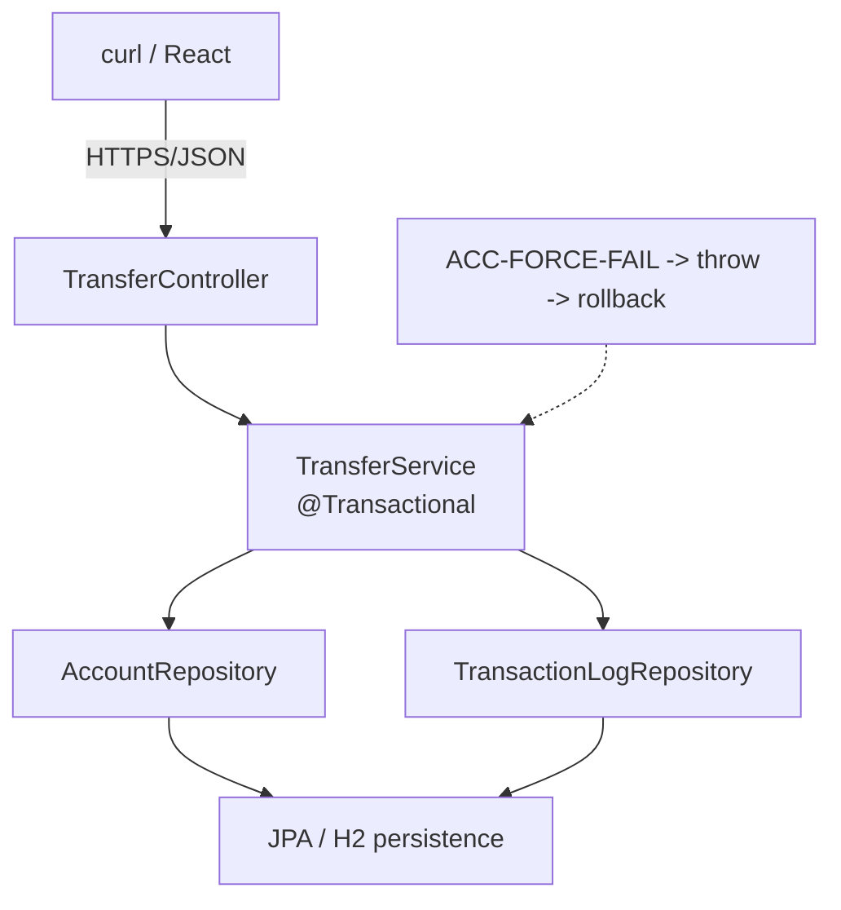

# Lab 27: Transaction Management with AI Assistance — Northstar CRM Transfers

> **Participants:** Module sequence is in [`../README.md`](../README.md). **Do not start this guide until** you have finished Module 27 [pre-lab exercises 1–6](../exercises/EXERCISES-INDEX.md) (Pass in your notes; order **1 → 2 → 3 → 4 → 5 → 6**). Then open **one** OS how-to ([Windows](LAB-27-WINDOWS.md) · [macOS](LAB-27-MACOS.md)). In class, prefer the **45-minute timed path** with [`starter/`](starter/README.md); the **full path** is every Step below (homework / extended). Skip `solution/` unless your instructor says otherwise. See [Which file do I open?](../../../_PARTICIPANT-FILE-GUIDE.md).

## Activity card

| | |
| --- | --- |
| **Objective** | Implement atomic TransferService (debit + credit + log) with proven rollback |
| **Skills practiced** | @Transactional, ACID evidence, ACC-FORCE-FAIL, AI TX review |
| **Expected outcome** | Happy MAIN→LOYALTY · forced-fail rollback · ACID notes · tests green |
| **Estimated time** | Timed path ~45 min · Full path 4–5 hours |
| **Prerequisites** | Lab 0 · Labs 25–26 preferred · Exercises 1–6 Pass · JDK 21 · Maven 3.9+ |
| **Expected files** | `examples/lab27-crm/` — TransferService, accounts, log, acid-notes, tests |
| **Validation checkpoints** | Starter smoke · GUIDE Implementation Checkpoints |

**Module:** 27 — Transaction Management with AI Assistance  
**Duration:** ~45 minutes (timed path with starter) · Full path: 4–5 Hours

**Primary IDE:** IntelliJ IDEA Community Edition · **Optional IDE:** VS Code

| OS | How-to for this lab |
| -- | ------------------- |
| Windows | [LAB-27-WINDOWS.md](LAB-27-WINDOWS.md) |
| macOS | [LAB-27-MACOS.md](LAB-27-MACOS.md) |

> **Incremental build:** ACID → TX boundary → rollback plan → pseudocode → propagation warnings → Lab 27.

> **Classroom pacing:** [`../PACING.md`](../PACING.md) (Checkpoints A–D).

> **Critical scope:** `@Transactional` on **service** only. Prove **`ACC-FORCE-FAIL`**. ACID notes cite **evidence**. Reject AI drafts that swallow exceptions or split commits. JWT / XA → later.

## 45-minute timed path (use starter)

In class, use the starter templates so the **core** objectives fit **~45 minutes**. The full Steps below remain for homework / extended depth.

1. Open [`starter/README.md`](starter/README.md).
2. Copy `starter/` into your `java-bootcamp/examples/…` target (see starter README).
3. Fill every `// TODO` — do **not** wait on a perfect prior lab; the starter includes a baseline.
4. Run the starter smoke test; evidence under `notes/screenshots/lab-27/`.
5. Mark timed-path Pass criteria in the starter README. Continue remaining GUIDE steps as homework if needed.

| Path | Time | Scope |
| ---- | ---- | ----- |
| **Timed (default)** | ~45 min | Starter TODOs + smoke test |
| **Full (extended)** | see Duration | Every Step in this GUIDE |

---

## What you'll submit (read this first)

Keep this checklist visible while you work.

| # | Deliverable |
| - | ----------- |
| 1 | `@Transactional TransferService` + controller |
| 2 | Seeded accounts + transaction log entity |
| 3 | Happy-path evidence (MAIN→LOYALTY balances) |
| 4 | `ACC-FORCE-FAIL` rollback evidence (balances + no log) |
| 5 | ACID explanation tied to observations |
| 6 | Automated tests proving rollback balances |
| 7 | AI review notes or manual equivalent |
| 8 | README runbook; no secrets/`target/` committed |

**Must submit:** the items in the table above (sources + evidence + short notes).

**Do not submit:** `target/`, `node_modules/`, secrets, heap dumps, or a verbatim instructor `solution/`.

## Lab Overview

This Module 27 lab adds Spring **`@Transactional`** boundaries for CRM financial-account updates that must succeed or fail together. You implement a **`TransferService`** (debit + credit + log), prove automatic **rollback** with destination `ACC-FORCE-FAIL`, and map observations to **ACID** guarantees used in production ledger updates. Optional Copilot drafts require review for unsafe propagation, swallowed exceptions, and transaction-on-controller anti-patterns.

## Learning Objectives

After completing this lab, you will be able to:

* Place `@Transactional` on service methods that span multiple account updates
* Explain Spring proxy-based transaction demarcation and why self-invocation skips it
* Implement a transfer (debit + credit + transaction log) for CRM accounts
* Force a mid-operation failure with `ACC-FORCE-FAIL` and prove both sides roll back
* Map Atomicity, Consistency, Isolation, and Durability to observable CRM behavior

## Business Scenario

Agents move funds between sub-accounts (for example MAIN → LOYALTY) or adjust related accounts as one business operation. A debit without a credit is an incident.

Leadership freezes:

**All multi-account money movement goes through `@Transactional TransferService`. Demonstrate rollback with `ACC-FORCE-FAIL`. Document ACID with before/after balances. Controllers must not own transaction boundaries.**

Use these examples consistently:

| ID | Name / role | Notes |
| -- | ----------- | ----- |
| `CUS-1001` | Amina Khan | `ACTIVE` — owns MAIN + LOYALTY |
| `CUS-1002` | Ravi Singh | `PROSPECT` — owns MAIN |
| `ACC-MAIN-1001` | Amina main | seed balance `1000.00` |
| `ACC-LOYALTY-1001` | Amina loyalty | seed balance `50.00` |
| `ACC-1002-MAIN` | Ravi main | seed balance `250.00` |
| `ACC-FORCE-FAIL` | synthetic sink | triggers rollback demo |
| `lab-request-001` | correlation | transfer log + header |

**Security note for evidence.** Fictional balances only. Never commit real ledger dumps or DB passwords. H2 blank password is lab-only.

---

## Architecture Context
### NOW (this lab)


```mermaid
flowchart TB
  Client["curl / React"] -->|HTTPS/JSON| TC["TransferController"]
  TC --> TS["TransferService<br/>@Transactional"]
  TS --> AR["AccountRepository"]
  TS --> LR["TransactionLogRepository"]
  AR --> JPA["JPA / H2 persistence"]
  LR --> JPA
  Fail["ACC-FORCE-FAIL -> throw -> rollback"] -.-> TS
```

## Prerequisites

Prior labs: [25](../../module-25/lab25/LAB-25-GUIDE.md) · [26](../../module-26/lab26/LAB-26-GUIDE.md).

Confirm (Lab 0 tools assumed):

* JDK 21; Maven; Spring Boot 3.x
* Layered service/repository skills from Lab 25
* `spring-boot-starter-data-jpa` + H2 preferred for real rollback
* If you simulate transactions in-memory, document that Atomicity is **not** fully proven
* Copilot optional; review required
* No secrets committed to Git

### Pre-flight

```bash
java -version
mvn -version
```

## Worked example (read before you code)

Study this pattern once before Step 1. Your job is to apply the same idea in the Steps — do not skip ahead to a full solution.

```java
@Service
public class TransferService {
  private final AccountRepository accounts;
  private final TransactionLogRepository logs;

  public TransferService(AccountRepository accounts, TransactionLogRepository logs) {
    this.accounts = accounts;
    this.logs = logs;
  }

  @Transactional
  public void transfer(String fromAccountId, String toAccountId, BigDecimal amount) {
    Account from = accounts.findById(fromAccountId)
        .orElseThrow(() -> new IllegalArgumentException("Unknown from account"));
    if ("ACC-FORCE-FAIL".equals(toAccountId)) {
      throw new IllegalStateException("Forced failure for rollback demo");
    }
    Account to = accounts.findById(toAccountId)
        .orElseThrow(() -> new IllegalArgumentException("Unknown to account"));
    if (from.getBalance().compareTo(amount) < 0) {
      throw new IllegalStateException("Insufficient funds");
    }
    from.setBalance(from.getBalance().subtract(amount));
    to.setBalance(to.getBalance().add(amount));
    accounts.save(from);
    accounts.save(to);
    logs.save(new TransactionLog(fromAccountId, toAccountId, amount));
  }
}
```

**What to notice:** Match names, IDs, and failure behavior from the scenario — instructors check these.

---

## Implementation Steps

Complete each step in order. Commands assume `~/java-bootcamp/examples/lab27-crm` (Windows: `%USERPROFILE%\java-bootcamp\examples\lab27-crm`) unless noted.

---

### Step 1 — Branch prior CRM and add JPA/H2 persistence

**Why:** Rollback is only convincing when a real unit of work commits or rolls back in a datastore.

**Do this:**

```bash
cd ~/java-bootcamp/examples
cp -r lab26-crm lab27-crm   # or lab25-crm
cd lab27-crm
mkdir -p copilot-notes docs
mkdir -p ~/java-bootcamp/notes/screenshots/lab-27
```

Add `spring-boot-starter-data-jpa` + H2. Configure datasource (Lab 26 `dev` profile OK):

```yaml
spring:
  datasource:
    url: jdbc:h2:mem:crm;DB_CLOSE_DELAY=-1
    username: sa
    password:
  jpa:
    hibernate:
      ddl-auto: update
    show-sql: true
```

Create `@Entity Account` with `accountId`, `customerId`, `balance`, `status`.

```bash
mvn -q -DskipTests package
```

**Expected result:** `BUILD SUCCESS`; schema creation visible for ACCOUNT.

**If it fails:** Missing H2 dependency → add it. DDL off → check `ddl-auto`. Profile hides datasource → activate `dev`.

---

### Step 2 — Seed Amina and Ravi accounts

**Why:** Fixed balances make rollback diffs reproducible for peers and instructors.

**Do this:** `data.sql` or `CommandLineRunner` / `@PostConstruct`:

```sql
-- Starter AccountSeed (preferred timed path):
-- ACC-MAIN-1001 @ 1000.00, ACC-LOYALTY-1001 @ 50.00
INSERT INTO ACCOUNT (ACCOUNT_ID, CUSTOMER_ID, BALANCE, STATUS) VALUES
 ('ACC-MAIN-1001', 'CUS-1001', 1000.00, 'ACTIVE'),
 ('ACC-LOYALTY-1001', 'CUS-1001', 50.00, 'ACTIVE');
```

If using `data.sql` with Hibernate, set `spring.jpa.defer-datasource-initialization=true` as needed for Boot 3.

**Expected result:** Query/API dump shows MAIN 1000, LOYALTY 50 (starter `AccountSeed`).

**If it fails:** Seeds not loading → defer init / use runner. Duplicate seed on restart → use `ddl-auto` + clear strategy appropriate for mem DB.

---

### Step 3 — Repositories and `TransactionLog` entity

**Why:** The success log must commit in the **same** transaction as the money movement — or roll back with it.

**Do this:**

```java
public interface AccountRepository extends JpaRepository<Account, String> {
  List<Account> findByCustomerId(String customerId);
}

@Entity
public class TransactionLog {
  @Id private String transferId;
  private String correlationId;
  private String fromAccountId;
  private String toAccountId;
  private BigDecimal amount;
  private Instant completedAt;
}
```

Add `TransactionLogRepository`.

**Expected result:** `findByCustomerId("CUS-1001")` returns MAIN and LOYALTY; log repo is a Spring bean.

**If it fails:** Entity scan miss → package under `com.northstar.crm`. ID type mismatch → keep String ids as fixtures.

---

### Step 4 — Implement `@Transactional TransferService`

**Why:** Proxy-applied boundaries on **public service methods** are the Boot-standard unit of work for this CRM path.

**Do this:** Inject repos. Public method annotated `@Transactional`:

```java
@Service
public class TransferService {
  private final AccountRepository accounts;
  private final TransactionLogRepository logs;

  public TransferService(AccountRepository accounts, TransactionLogRepository logs) {
    this.accounts = accounts;
    this.logs = logs;
  }

  @Transactional
  public void transfer(String fromAccountId, String toAccountId, BigDecimal amount) {
    Account from = accounts.findById(fromAccountId)
        .orElseThrow(() -> new IllegalArgumentException("Unknown from account"));
    if ("ACC-FORCE-FAIL".equals(toAccountId)) {
      throw new IllegalStateException("Forced failure for rollback demo");
    }
    Account to = accounts.findById(toAccountId)
        .orElseThrow(() -> new IllegalArgumentException("Unknown to account"));
    if (from.getBalance().compareTo(amount) < 0) {
      throw new IllegalStateException("Insufficient funds");
    }
    from.setBalance(from.getBalance().subtract(amount));
    to.setBalance(to.getBalance().add(amount));
    accounts.save(from);
    accounts.save(to);
    logs.save(new TransactionLog(fromAccountId, toAccountId, amount));
  }
}
```

Optional Copilot prompt: “Spring Boot TransferService with @Transactional debit/credit and TransactionLog.” Reject placing `@Transactional` only on the controller; reject swallowed catches around debit/credit.

**Expected result:** Compiles; method public; no broad catch that prevents rollback.

**If it fails:** Checked exceptions without `rollbackFor` → prefer unchecked or set `rollbackFor`. Self-invocation → move calls through injected proxy/another bean.

---

### Step 5 — Expose `POST /api/transfers` and prove happy path

**Why:** Leadership acceptance is ledger + log evidence, not only a green compile.

**Do this:** Thin `TransferController`:

```java
@PostMapping("/api/transfers")
@ResponseStatus(HttpStatus.NO_CONTENT)
public void transfer(@RequestBody TransferRequest req) {
  transferService.transfer(req.fromAccountId(), req.toAccountId(), req.amount());
}
```

```bash
curl -s -X POST http://localhost:8080/api/transfers \
  -H "Content-Type: application/json" \
  -H "X-Correlation-Id: lab-request-001" \
  -d '{"fromAccountId":"ACC-MAIN-1001","toAccountId":"ACC-LOYALTY-1001","amount":50.00}'
```

Re-read balances (repository query, H2 console, or GET account endpoint if you add one).

**Expected result:** MAIN `950.00`; LOYALTY `100.00` (seed was `50.00` + transfer `50.00`); HTTP 200.

**If it fails:** 404 accounts → seeds. TX not committing → check exception paths / bean proxy. Controller annotated `@Transactional` instead of service → move annotation down.
---

### Step 6 — Rollback demo with `ACC-FORCE-FAIL`

**Why:** Atomicity is proven only when a failure leaves both balances and log as they were.

**Do this:** Record MAIN balance before call. Transfer to `ACC-FORCE-FAIL` for amount `10.00`. Re-read MAIN and count log rows for that attempt.

```bash
curl -s -X POST http://localhost:8080/api/transfers \
  -H "Content-Type: application/json" \
  -H "X-Correlation-Id: lab-request-001" \
  -d '{"fromAccountId":"ACC-MAIN-1001","toAccountId":"ACC-FORCE-FAIL","amount":10.00}'
```

**Expected result:** Error response; MAIN unchanged vs pre-call; no success `TransactionLog` for the failed attempt; JPA/SQL may show rollback.

**If it fails:** MAIN decreased → not rolling back (self-invocation, wrong exception, or non-TX repo calls). Log row present → log saved in separate transaction (`REQUIRES_NEW` accidental) — remove it.

---

### Step 7 — Document ACID with lab evidence

**Why:** Naming ACID without pointing to curls/balances fails the lab’s communication goal.

**Do this:** In README / `docs/acid-notes.md`:

| Property | CRM observation in this lab |
| -------- | --------------------------- |
| Atomicity | Failed `ACC-FORCE-FAIL` leaves MAIN unchanged; no log |
| Consistency | No negative balances; account status rules still hold |
| Isolation | State expectation for concurrent transfers (discuss; bonus to demo) |
| Durability | After success, restart caveats for H2 mem vs file/PostgreSQL |

State H2 in-memory durability limits honestly.

**Expected result:** Evidence-linked ACID section; durability caveat explicit.

**If it fails:** Slogan-only table → add curl/balance citations.

---

### Step 8 — Automated tests + AI review notes

**Why:** Rollback asserts on balances beat “exception was thrown” alone; AI mistakes often delete rollback by catching exceptions.

**Do this:** `TransferServiceTest` ( `@DataJpaTest` or `@SpringBootTest` + H2 ): happy path; insufficient funds; missing destination; `ACC-FORCE-FAIL` leaves MAIN at seed/pre value. Record `lab27-001` in `copilot-notes/ai-tx-review.md` for accepted/rejected TX advice (e.g. reject private `@Transactional` helpers without proxy, reject controller TX).

```bash
mvn -q test
mvn -q test
```

**Expected result:** Dual green; tests assert post-failure balances; AI log or manual N/A present.

**If it fails:** Tests share dirty balances → reset/`@BeforeEach` or rollback test TX carefully. Force-fail not covered → add it.

---

### Step 9 — Failure experiments + evidence pack

**Why:** Ledger support needs insufficient-funds and double-submit stories, not only the force flag.

**Do this:** Complete Failure Experiments. Capture before/after balances and Surefire under `notes/screenshots/lab-27/`. Ensure `git status` clean of `target/` and secrets.

**Expected result:** ≥3 experiments; dual green tests; ACID + rollback evidence packaged.

**If it fails:** See Troubleshooting.

---

## Implementation Checkpoints

### Checkpoint A — Tooling

_Mark **Pass** or **Fail** in your lab notes._

| # | Confirm | Your notes |
| - | ------- | ---------- |
| 1 | `lab27-crm` under `examples/` | Pass / Fail |
| 2 | JPA + H2 (or documented simulation limit) | Pass / Fail |
| 3 | Account entity packages cleanly | Pass / Fail |

### Checkpoint B — Transfer core

_Mark **Pass** or **Fail** in your lab notes._

| # | Confirm | Your notes |
| - | ------- | ---------- |
| 1 | Seeds for Amina/Ravi accounts present | Pass / Fail |
| 2 | `@Transactional TransferService` + log entity | Pass / Fail |
| 3 | Happy MAIN→LOYALTY evidenced with `lab-request-001` | Pass / Fail |

### Checkpoint C — Rollback + ACID + AI

_Mark **Pass** or **Fail** in your lab notes._

| # | Confirm | Your notes |
| - | ------- | ---------- |
| 1 | `ACC-FORCE-FAIL` leaves balances unchanged; no success log | Pass / Fail |
| 2 | ACID table cites observations | Pass / Fail |
| 3 | Tests assert balances after failure; AI review logged | Pass / Fail |

### Checkpoint D — Hygiene

_Mark **Pass** or **Fail** in your lab notes._

| # | Confirm | Your notes |
| - | ------- | ---------- |
| 1 | Two consecutive `mvn test` identical success | Pass / Fail |
| 2 | README runbook complete | Pass / Fail |
| 3 | No secrets / `target/` committed | Pass / Fail |

---

## Reference Commands, Configuration, and Code

### `application.yml` (H2 lab baseline)

```yaml
spring:
  datasource:
    url: jdbc:h2:mem:crm;DB_CLOSE_DELAY=-1
    username: sa
    password:
  jpa:
    hibernate:
      ddl-auto: update
    show-sql: true
    defer-datasource-initialization: true
  sql:
    init:
      mode: always
logging:
  level:
    org.springframework.orm.jpa: DEBUG
    com.northstar.crm: INFO
```

### Commands

```bash
cd ~/java-bootcamp/examples/lab27-crm
mvn spring-boot:run
curl -s -H "X-Correlation-Id: lab-request-001" \
  -H "Content-Type: application/json" \
  -d '{"fromAccountId":"ACC-MAIN-1001","toAccountId":"ACC-LOYALTY-1001","amount":50.00}' \
  http://localhost:8080/api/transfers
curl -s -H "X-Correlation-Id: lab-request-001" \
  -H "Content-Type: application/json" \
  -d '{"fromAccountId":"ACC-MAIN-1001","toAccountId":"ACC-FORCE-FAIL","amount":10.00}' \
  http://localhost:8080/api/transfers
mvn -q test
mvn -q test
git status
```

## Failure Experiments

| # | Experiment | Observe | Restore |
| - | ---------- | ------- | ------- |
| 1 | Wrong JDBC URL | Start/transfer failure | Fix URL |
| 2 | Transfer more than MAIN holds | Rollback; LOYALTY unchanged | Keep rule |
| 3 | Repeat successful transfer without idempotency key | Double movement risk | Document transferRequestId fix |
| 4 | Artificial sleep inside TX | Long lock discussion | Remove sleep |
| 5 | Self-invoke `this.transfer` from non-TX method | Rollback may not apply | Call via Spring bean |

---

## Troubleshooting

| Symptom | Likely cause | Fix |
| ------- | ------------ | --- |
| No rollback | Self-invocation / caught exception | Proxy call; rethrow unchecked |
| Rollback but log committed | Separate TX / `REQUIRES_NEW` | Same TX as debit/credit |
| Flaky balances in tests | Shared DB state | Reset seeds per test |
| Seeds missing | `data.sql` timing | Defer datasource init / runner |
| `@Transactional` ignored | Not public / wrong bean | Public method on Spring bean |
| Controllers “own” TX | Misplaced annotation | Move to service |
| Working in `module-27-exercises` for the lab | Wrong project | Lab lives in `examples/lab27-crm` |
| AI draft catches Exception and returns null | Swallowed failure | Rethrow unchecked; keep rollback |

## Security and Production Review

Optional — jot brief notes in your README if useful for your progress check (not a separate essay):

1. Which inputs are untrusted (amount, account IDs, headers)?
2. Where are authn/authz/validation enforced (Lab 28 deepens)?
3. Which values are sensitive (balances), and where stored?

---


## Cleanup

```bash
cd ~/java-bootcamp/examples/lab27-crm
# Ctrl+C spring-boot:run
mvn -q clean
git status
# If Dockerized DB was added:
# docker compose down
```

**Keep `lab27-crm`**—Lab 28 secures transfer and customer APIs.


## Reflection Questions

Write **1–3 sentence** answers (not essays):

1. Which design decision most affected correctness (transaction boundary size)?
2. What evidence proves rollback works?
3. Which failure was hardest (proxy / self-invocation / exception type)?

---


