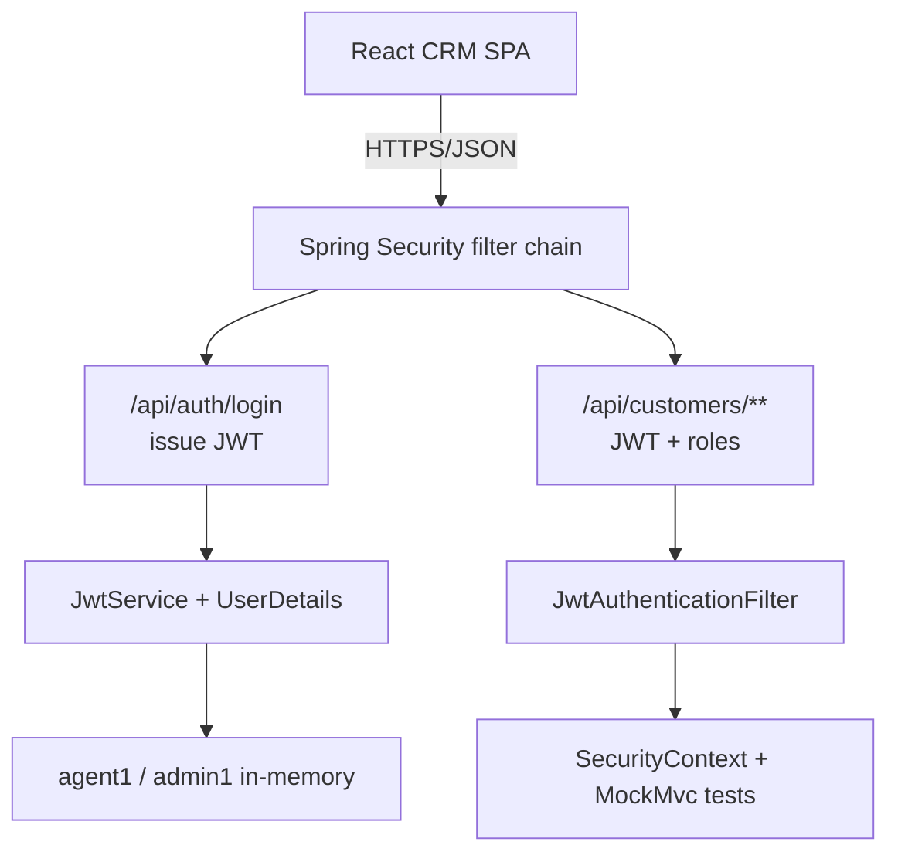
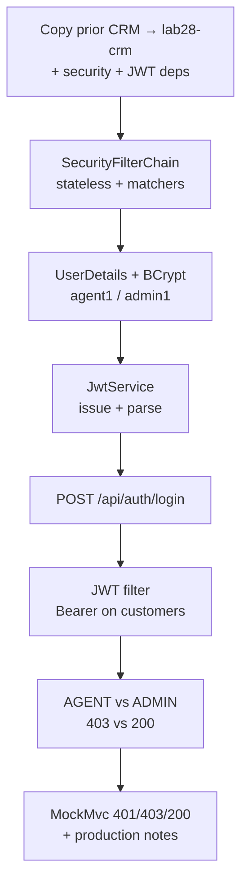

# Lab 28: Spring Security Basics — Northstar CRM JWT and Roles

**Module:** 28 — Spring Security Basics  
**Lab folder:** `labs/Week 3 - Spring Framework and Enterprise Patterns/module-28/lab28/`  
**Difficulty:** Intermediate  
**Duration:** 4–5 Hours

**Primary IDE:** IntelliJ IDEA Community Edition · **Optional IDE:** VS Code

| OS | How-to for this lab |
| -- | ------------------- |
| Windows | [LAB-28-WINDOWS.md](LAB-28-WINDOWS.md) |
| macOS | [LAB-28-MACOS.md](LAB-28-MACOS.md) |

> **Environment reminder:** Finish [Lab 0](../../../Week%201%20-%20Java%20and%20JVM%20Foundations/module-00/lab0/LAB-0-GUIDE.md). Use **IntelliJ IDEA Community** (primary; optional VS Code) on your laptop with **JDK 21** and **Maven 3.9+** (Spring Boot 3.x via Maven). Work under `~/java-bootcamp` (Windows: `%USERPROFILE%\java-bootcamp`).

---

## How to follow this lab

1. Open the **Windows** or **macOS** how-to (links above) in a second tab.
2. Create/work only under your `java-bootcamp/examples/…` folder from the steps (not inside this `labs/` git clone unless a step says otherwise).
3. For each **Step N**: read **Why** (if present) → do the actions → confirm **Expected** / **Expected result** → then continue.
4. When stuck, use **Failure Experiments** / troubleshooting in this guide before asking for help.
5. Capture evidence under `notes/screenshots/` (redact secrets). Use the **Pass criteria** tables — write **Pass** or **Fail** in your notes. GitHub file view does not support clickable checkboxes.

## Lab Overview

This Module 28 lab adds **Spring Security** to the **Customer Management Platform**: JWT-based login, a `SecurityFilterChain` that protects APIs by default, CRM roles `AGENT` and `ADMIN`, and **MockMvc** (or WebTestClient) proofs for **401** and **403**.

**Purpose.** Leadership will not expose customer APIs on the open network. Unauthenticated callers must be rejected; agents may work Amina/Ravi records within policy; admins may perform elevated operations you define (for example admin listing or forced status overrides). Authn/authz must be automated so new routes do not silently ship open.

**What you build (exercise).** Copy forward into `lab28-crm`; add `spring-boot-starter-security` and a JWT library; configure a stateless `SecurityFilterChain`; implement `JwtService`, filter, in-memory lab users, and `/api/auth/login`; protect `/api/customers/**` for `AGENT`/`ADMIN` and `/api/admin/**` for `ADMIN` only; prove login + Bearer access to `CUS-1001`; write MockMvc 401/403/200 matrix tests; document IdP / key-rotation production notes.

**What success looks like.** Under `~/java-bootcamp/examples/lab28-crm/` the app starts, login issues a JWT, missing/bad tokens return **401**, agent on admin routes returns **403**, agent/admin customer reads succeed for fixtures, and `mvn test` stays green twice in a row.

**Depends on Labs 25–27 (API + layering).** Need a runnable Customer REST API. Finish those labs first if create/get/status endpoints are missing. Lab 29 will layer validation/`ErrorResponse` on this secured surface.

**CRM connection.** Fixtures `CUS-1001` Amina / `CUS-1002` Ravi / correlation `lab-request-001`. Lab users: `agent1` (`AGENT`), `admin1` (`ADMIN`). Correlation headers are operational metadata — never confuse them with authentication.

---

## Learning Objectives

After completing this lab, you will be able to:

* Add Spring Security to a Spring Boot 3 CRM API
* Implement a login endpoint that authenticates credentials and returns a JWT
* Validate JWTs on subsequent requests with a filter (or resource-server pattern as taught)
* Protect `/api/customers/**` (and related) routes by default
* Enforce roles `AGENT` and `ADMIN` with request matchers and/or `@PreAuthorize`
* Keep CSRF strategy appropriate for a JWT API (typically stateless, CSRF disabled)
* Explain trust boundaries between login, token issuance, and authorization
* Prove the 401/403/200 matrix with MockMvc and document local demo users versus production IdP / secret management
* Keep tokens, secrets, and passwords out of Git and out of logs

---

## Business Scenario

The CRM stores customer identity, contact details, lifecycle status, and financial accounts. Its React client communicates with Spring Boot over HTTPS/JSON. Without authentication, anyone who can reach the network can read or mutate customer data — unacceptable for Northstar. Agents need day-to-day access to Amina Khan and Ravi Singh records; admins need elevated control for support and configuration.

Use these examples consistently:

| ID | Name | Notes |
| -- | ---- | ----- |
| `CUS-1001` | Amina Khan | `ACTIVE` — primary secured GET target |
| `CUS-1002` | Ravi Singh | `PROSPECT` — readable by AGENT and ADMIN |
| `CUS-9999` | — | optional not-found path under auth |
| `lab-request-001` | — | correlation header (not a credential) |
| `agent1` | — | role `AGENT` (lab-only password) |
| `admin1` | — | role `ADMIN` (lab-only password) |

**Security note for evidence.** Use fictional emails and lab-only passwords. Redact JWTs in screenshots if policy requires. Never commit `CRM_JWT_SECRET` values or `.env` files.

---

## Architecture Context

### NOW (this lab)



### Lab flow (mermaid)



### Architecture NOW vs LATER

| Aspect | Lab 28 (NOW) | Lab 29 / production |
| ------ | ------------ | ------------------- |
| Authn | Login + HS256 JWT, in-memory users | IdP, RSA/ECDSA, rotating keys |
| Authz | Matcher / `@PreAuthorize` AGENT/ADMIN | Same roles + finer policies |
| Errors | Default Spring Security status codes | Unified `ErrorResponse` (Lab 29) |
| Sessions | Stateless JWT | Same model; no sticky sessions |

**Lab focus:** JWT login, `SecurityFilterChain`, roles `AGENT` / `ADMIN`, MockMvc 401/403 proofs for CRM.

---

## Prerequisites

Complete [SETUP](../../../SETUP-INSTRUCTIONS.md), [Lab 0](../../../Week%201%20-%20Java%20and%20JVM%20Foundations/module-00/lab0/LAB-0-GUIDE.md), and a working Customer API from Labs [25](../../module-25/lab25/LAB-25-GUIDE.md)–[27](../../module-27/lab27/LAB-27-GUIDE.md). Confirm:

* JDK 21; Maven; Git; Spring Boot 3.x CRM REST API
* `spring-boot-starter-security` and a JWT library (`jjwt` or Spring Authorization/Resource Server patterns as taught)
* HTTP client capable of sending `Authorization: Bearer ...`
* No secrets (keys, tokens, passwords) committed to Git — use `.env.example` only

### Pre-flight

```bash
java -version
mvn -version
git --version
pwd
ls ~/java-bootcamp/examples
```

Fix environment failures before changing application code. Record tool versions in your evidence if the lab asks for screenshots.

---

## Suggested Project Files

```text
~/java-bootcamp/examples/lab28-crm/
├── src/
│   ├── main/
│   │   ├── java/com/northstar/crm/
│   │   │   ├── CrmApplication.java
│   │   │   ├── config/
│   │   │   │   └── SecurityConfig.java
│   │   │   ├── security/
│   │   │   │   ├── JwtService.java
│   │   │   │   ├── JwtAuthenticationFilter.java
│   │   │   │   └── CrmUserDetailsService.java
│   │   │   ├── controller/
│   │   │   │   ├── AuthController.java
│   │   │   │   ├── CustomerController.java
│   │   │   │   └── AdminController.java
│   │   │   ├── service/
│   │   │   │   └── CustomerService.java
│   │   │   └── dto/
│   │   │       ├── LoginRequest.java
│   │   │       ├── LoginResponse.java
│   │   │       ├── CustomerRequest.java
│   │   │       └── CustomerResponse.java
│   │   └── resources/
│   │       └── application.yml
│   └── test/
│       └── java/com/northstar/crm/security/
│           └── SecurityIntegrationTest.java
├── docs/
│   └── security-notes.md
├── notes/screenshots/
├── .env.example
├── .gitignore
├── pom.xml
└── README.md
```

Ignore `target/`, IDE metadata, `.env`, tokens, and passwords.

---

## Concepts to Discuss

Write 2–3 sentences each in `docs/security-notes.md`:

1. Main request flow for login versus an authenticated customer read
2. Trust boundary: credentials at login, signature/expiry on every Bearer request
3. Success/failure contracts: 401 vs 403 vs 200
4. Stable identity (`sub` / username) versus customer IDs (`CUS-1001`)
5. Idempotency: login vs `GET` with a bearer token; why refresh tokens are a production topic
6. Local shortcut (in-memory users, HS256 shared secret) versus production (IdP, JWKS, rotation)
7. Evidence operators need (failed-login rate, 401/403) without logging raw tokens or passwords
8. Two app instances: shared JWT secret / JWKS so both accept the same tokens
9. Why CSRF disable is acceptable for a pure Bearer API and when it would not be
10. What Lab 29 will change (error bodies) without rewriting role names or fixture IDs

---

## Implementation Steps

Complete each step in order. Commands assume `~/java-bootcamp/examples/lab28-crm` (Windows: `%USERPROFILE%\java-bootcamp\examples\lab28-crm`) unless noted.

---

### Step 1 — Branch prior CRM and pin Security + JWT deps

**Why:** Secret handling and dependencies must be executable via Maven before any filter logic exists.

**Do this:**

```bash
cd ~/java-bootcamp/examples
cp -r lab27-crm lab28-crm   # or lab25-crm / latest CRM API copy
cd lab28-crm
mkdir -p docs notes/screenshots
```

Add `spring-boot-starter-security`, test support, and your JWT library. Define configuration placeholders — never hard-code a production key.

```yaml
crm:
  security:
    jwt-secret: ${CRM_JWT_SECRET:lab-only-change-me-use-long-random}
    jwt-expiration-minutes: 60
```

```text
# .env.example
CRM_JWT_SECRET=replace-with-long-random-lab-secret
```

```bash
mvn -q -DskipTests package
git status
```

**Expected result:** `BUILD SUCCESS`; `.env.example` exists; no real secret in staged files.

**If it fails:** Parent BOM missing → keep Spring Boot parent managing versions. `.env` staged → add to `.gitignore` before continuing.

---

### Step 2 — Configure the security filter chain

**Why:** APIs must deny by default; only login and health should be anonymous.

**Do this:** In `config/SecurityConfig.java`, disable session state for a JWT API. Permit login and health; authenticate everything else. Wire CSRF appropriately for stateless APIs. Register the JWT filter before `UsernamePasswordAuthenticationFilter`.

```java
@Bean
SecurityFilterChain filterChain(HttpSecurity http) throws Exception {
  http.csrf(csrf -> csrf.disable())
      .sessionManagement(sm ->
          sm.sessionCreationPolicy(SessionCreationPolicy.STATELESS))
      .authorizeHttpRequests(auth -> auth
          .requestMatchers("/api/auth/login", "/actuator/health").permitAll()
          .requestMatchers("/api/admin/**").hasRole("ADMIN")
          .requestMatchers("/api/customers/**").hasAnyRole("AGENT", "ADMIN")
          .anyRequest().authenticated())
      .addFilterBefore(jwtFilter, UsernamePasswordAuthenticationFilter.class);
  return http.build();
}
```

Start the app and call customers without a token.

**Expected result:** Application starts; unauthenticated `GET /api/customers/CUS-1001` returns **401**; health remains reachable if exposed.

**If it fails:** Browser form login redirects → disable formLogin/httpBasic for API-style responses. Filter not registered → 401 persists even with valid tokens later.

---

### Step 3 — Implement UserDetails and password encoding

**Why:** Roles and encoded passwords are the source of truth for login; plaintext passwords fail security review.

**Do this:** Provide in-memory lab users. Roles must become `ROLE_AGENT` / `ROLE_ADMIN` in Spring's model.

```java
@Bean
UserDetailsService users(PasswordEncoder encoder) {
  return new InMemoryUserDetailsManager(
      User.withUsername("agent1").password(encoder.encode("agent-pass"))
          .roles("AGENT").build(),
      User.withUsername("admin1").password(encoder.encode("admin-pass"))
          .roles("ADMIN").build());
}
```

Document lab passwords only in README for students — do not commit a production password file. Prefer `BCryptPasswordEncoder`.

**Expected result:** `PasswordEncoder` bean is BCrypt (or equivalent); `UserDetailsService` loads `agent1` and `admin1`.

**If it fails:** `{noop}agent-pass` left in production notes as “fine” → reject for anything beyond local demo. Wrong role string → later 403 flakiness.

---

### Step 4 — Implement JwtService (issue and parse)

**Why:** Signature verification is the trust boundary for bearer tokens after login.

**Do this:** Issue tokens that include subject (username), roles, issued-at, and expiry. Validate signature and expiry on parse.

```java
public String issueToken(UserDetails user) {
  // HS256 with crm.security.jwt-secret
  // claims: sub, roles, iat, exp
}

public Jws<Claims> parse(String token) {
  // verify signature and expiration
}
```

Include `lab-request-001` only as a separate header/correlation practice — do not put auth inside correlation IDs.

**Expected result:** `issueToken(agent1)` returns a three-part JWT; parse rejects tampered payloads and expired tokens.

**If it fails:** Secret too short for HS256 library → lengthen lab secret. Clock skew in tests → use generous expiry or fixed clocks in tests.

---

### Step 5 — Build AuthController login

**Why:** Credentials must be verified before any token is issued.

**Do this:**

```java
@PostMapping("/api/auth/login")
public LoginResponse login(@RequestBody LoginRequest req) {
  authenticationManager.authenticate(
      new UsernamePasswordAuthenticationToken(req.username(), req.password()));
  UserDetails user = userDetailsService.loadUserByUsername(req.username());
  return new LoginResponse(jwtService.issueToken(user), user.getUsername());
}
```

```bash
curl -s -X POST http://localhost:8080/api/auth/login \
  -H "Content-Type: application/json" \
  -H "X-Correlation-Id: lab-request-001" \
  -d '{"username":"agent1","password":"agent-pass"}'
```

Also try a bad password and confirm **401** without leaking which field was wrong.

**Expected result:** `{"accessToken":"eyJ...","username":"agent1"}`; bad password returns 401.

**If it fails:** Login also requires JWT → matcher missed `/api/auth/login`. 403 on bad password → check AuthenticationEntryPoint vs AccessDeniedHandler wiring.

---

### Step 6 — JWT filter and authenticated customer access

**Why:** Login alone is not enough; every request must present a valid JWT (defense in depth).

**Do this:** Read `Authorization: Bearer`, parse JWT, set `SecurityContext`, continue the filter chain.

```bash
TOKEN=$(curl -s -X POST http://localhost:8080/api/auth/login \
  -H "Content-Type: application/json" \
  -d '{"username":"agent1","password":"agent-pass"}' | jq -r .accessToken)

curl -s http://localhost:8080/api/customers/CUS-1001 \
  -H "Authorization: Bearer $TOKEN" \
  -H "X-Correlation-Id: lab-request-001"
```

Ensure Amina (`ACTIVE`) is seeded from prior labs or a data seeder.

**Expected result:** JSON for Amina Khan / `ACTIVE`; request without `Authorization` still returns **401**.

**If it fails:** Filter does not set `SecurityContext` → still 401 with valid token. Seed missing `CUS-1001` → 404 under auth (separate from security; fix seed).

---

### Step 7 — Role separation AGENT vs ADMIN

**Why:** Authenticated does not mean authorized — students must prove **403** vs **401**.

**Do this:** Expose an admin-only endpoint (list support data or forced override). Agents must receive 403.

```java
@GetMapping("/api/admin/customers")
@PreAuthorize("hasRole('ADMIN')")
public List<CustomerResponse> adminList() { ... }
```

Enable method security if using `@PreAuthorize`. Exercise:

```bash
# agent token -> 403 on /api/admin/customers
# admin token -> 200
curl -s http://localhost:8080/api/customers/CUS-1002 \
  -H "Authorization: Bearer $AGENT_TOKEN"   # allowed for AGENT
```

**Expected result:** `agent1`: customers OK, admin route **403**; `admin1`: customers OK, admin route **200**; `CUS-1002` (Ravi / PROSPECT) readable by both under customer API policy.

**If it fails:** `hasRole("ADMIN")` but authorities missing `ROLE_` prefix → unexpected 403 for admin. Matcher and annotation disagree → pick one clear policy and document it.

---

### Step 8 — Automated MockMvc matrix and production notes

**Why:** Automated 401/403 checks prevent regressions when routes are added.

**Do this:** Use MockMvc or WebTestClient for the status matrix. Document that production must replace in-memory users and shared HS256 secrets with an IdP and rotating keys.

```java
@Test
void customers_requireAuthentication() throws Exception {
  mockMvc.perform(get("/api/customers/CUS-1001"))
      .andExpect(status().isUnauthorized());
}

@Test
void admin_forbidden_for_agent() throws Exception {
  // obtain or forge agent JWT under test secret → expect 403 on /api/admin/**
}
```

```bash
mvn -q test
mvn -q test   # second run for determinism
```

Record production checklist in `docs/security-notes.md` (IdP, key vault, no plaintext passwords, token TTL, refresh design notes).

**Expected result:** Surefire green twice; README/docs list IdP / secret rotation checklist items.

**If it fails:** Tests depend on a live server clock for expiry → use fixed expiry in tests. Security context leaks across tests → reset between cases.

---

### Step 9 — Document auth runbook and production IdP checklist

**Why:** Peers must reproduce login → Bearer → role checks without Slack archaeology.

**Do this:** In project README and `docs/security-notes.md`, list:

```bash
export CRM_JWT_SECRET='lab-only-long-random'   # never commit the real value
mvn -q spring-boot:run
# login → capture token (redact in notes) → GET CUS-1001 / admin matrix
mvn -q test
```

Include: demo users (`agent1`/`admin1`), matcher table (login permitAll, customers AGENT|ADMIN, admin ADMIN), token TTL, and production checklist (IdP, JWKS, secret rotation, rate-limit failed logins, never log Bearer tokens).

**Expected result:** Peer can reproduce green auth demos and tests from README alone.

**If it fails:** Runbook lists only `spring-boot:run` with no 401/403 checks → add the matrix commands.

---

### Step 10 — Failure experiments + evidence pack

**Why:** Misconfigured secrets, role mistakes, and token logging are the failure modes of this lab’s culture.

**Do this:** Complete [Failure Experiments](#failure-experiments). Capture redacted curl and Surefire excerpts under `notes/screenshots/`. Confirm `git status` is clean of secrets and `target/`. Run `mvn -q test` twice for determinism.

**Expected result:** ≥3 experiments documented; identical consecutive test runs; evidence saved; no JWT/password in Git.

**If it fails:** See Troubleshooting.

---

## Seed and fixture checklist (before demos)

Ensure the CRM repository still contains:

| Fixture | Seed requirement |
| ------- | ---------------- |
| `CUS-1001` | Amina Khan, `ACTIVE`, fictional email |
| `CUS-1002` | Ravi Singh, `PROSPECT`, fictional email |
| Correlation | Clients send `X-Correlation-Id: lab-request-001` |

If your Lab 25/27 copy has empty data, add a `CommandLineRunner` or `data.sql` before claiming Security “works” — a 404 under a valid JWT is a data issue, not an auth issue.

---

## Implementation Checkpoints

### Checkpoint A — Tooling and secret hygiene

_Mark each row **Pass** or **Fail** in your lab notes (GitHub markdown files are not interactive checklists)._

| # | Confirm | Your notes |
| - | ------- | ---------- |
| 1 | `lab28-crm` under `~/java-bootcamp/examples/` | Pass / Fail |
| 2 | Security + JWT dependencies resolve | Pass / Fail |
| 3 | `.env.example` present; real `.env` / secrets not staged | Pass / Fail |

### Checkpoint B — Filter chain and JWT login

_Mark each row **Pass** or **Fail** in your lab notes (GitHub markdown files are not interactive checklists)._

| # | Confirm | Your notes |
| - | ------- | ---------- |
| 1 | Stateless `SecurityFilterChain` with permitAll login/health | Pass / Fail |
| 2 | `agent1` / `admin1` with BCrypt (or equivalent) | Pass / Fail |
| 3 | Login issues JWT; parse rejects tampered tokens | Pass / Fail |

### Checkpoint C — Roles and API access

_Mark each row **Pass** or **Fail** in your lab notes (GitHub markdown files are not interactive checklists)._

| # | Confirm | Your notes |
| - | ------- | ---------- |
| 1 | Bearer access to `CUS-1001` / `CUS-1002` as AGENT | Pass / Fail |
| 2 | Missing/invalid JWT → 401 | Pass / Fail |
| 3 | AGENT on admin route → 403; ADMIN → 200 | Pass / Fail |

### Checkpoint D — Tests and hygiene

_Mark each row **Pass** or **Fail** in your lab notes (GitHub markdown files are not interactive checklists)._

| # | Confirm | Your notes |
| - | ------- | ---------- |
| 1 | MockMvc (or WebTestClient) 401/403/200 matrix green | Pass / Fail |
| 2 | Two consecutive `mvn test` identical success | Pass / Fail |
| 3 | Production IdP / rotation notes; no tokens in logs or Git | Pass / Fail |

---

## Reference Commands, Configuration, and Code

### SecurityFilterChain (pattern)

```java
http.csrf(csrf -> csrf.disable())
    .sessionManagement(sm ->
        sm.sessionCreationPolicy(SessionCreationPolicy.STATELESS))
    .authorizeHttpRequests(auth -> auth
        .requestMatchers("/api/auth/login").permitAll()
        .requestMatchers("/api/admin/**").hasRole("ADMIN")
        .requestMatchers("/api/customers/**").hasAnyRole("AGENT", "ADMIN")
        .anyRequest().authenticated());
```

### Login request / response shape

```json
{"username":"agent1","password":"agent-pass"}
{"accessToken":"<jwt>","username":"agent1"}
```

### MockMvc excerpt

```java
mockMvc.perform(get("/api/customers/CUS-1001"))
    .andExpect(status().isUnauthorized());
```

### Commands

```bash
cd ~/java-bootcamp/examples/lab28-crm
mvn -q -DskipTests package
mvn -q spring-boot:run
curl -s -X POST http://localhost:8080/api/auth/login \
  -H "Content-Type: application/json" \
  -H "X-Correlation-Id: lab-request-001" \
  -d '{"username":"admin1","password":"admin-pass"}'
curl -s http://localhost:8080/api/customers/CUS-1002 \
  -H "Authorization: Bearer <token>" \
  -H "X-Correlation-Id: lab-request-001"
mvn -q test
git status
```

### Class map

| Class | Role |
| ----- | ---- |
| `SecurityConfig` | Filter chain + matchers |
| `JwtService` | Issue / parse / verify JWT |
| `JwtAuthenticationFilter` | Bearer → SecurityContext |
| `AuthController` | Login endpoint |
| `SecurityIntegrationTest` | MockMvc 401/403/200 matrix |
| `security-notes.md` | Local vs IdP production checklist |

---

## Manual Verification

1. Login as `agent1` returns an access token.
2. `GET /api/customers/CUS-1001` with Bearer succeeds (Amina / ACTIVE).
3. `GET /api/customers/CUS-1002` with AGENT token succeeds (Ravi / PROSPECT).
4. Missing or malformed Authorization → **401**.
5. Wrong password on login → **401** without verbose credential hints.
6. AGENT on `/api/admin/**` → **403**; ADMIN → **200**.
7. Correlation `lab-request-001` appears in logs without bearer tokens.
8. MockMvc suite covers authenticated and forbidden paths.
9. Two consecutive `mvn test` runs match.
10. No JWT secret, password, or `.env` committed.

---

## Failure Experiments

| # | Experiment | Observe | Restore |
| - | ---------- | ------- | ------- |
| 1 | Mismatch JWT secret between issuer and filter | 401 on customers with “valid-looking” token | Align secret / env |
| 2 | Login with wrong password; malformed Bearer | 401; no secret leakage in body/logs | Keep safe error path |
| 3 | Call admin API as `agent1` | 403 | Confirm matcher / `@PreAuthorize` |
| 4 | Reuse expired token | 401; explain refresh as production concern | Relogin for new token |
| 5 | Optional: slow AuthenticationProvider | Client timeout honest; no password in debug logs | Remove artificial delay |

---

## Troubleshooting

| Symptom | Likely cause | Fix |
| ------- | ------------ | --- |
| HTML login redirect | Form login still enabled | Disable formLogin; return 401 for APIs |
| Valid token still 401 | Filter order / SecurityContext not set | Register filter before UsernamePasswordAuthenticationFilter |
| Admin always 403 | Role naming (`ROLE_` prefix) | Use `roles("ADMIN")` or `hasAuthority("ROLE_ADMIN")` consistently |
| Tests flaky on expiry | Real clock skew | Fixed TTL or Clock bean in tests |
| Double auth errors | Duplicate filter registration | Register once; keep login `permitAll` |
| Secret change ignored | Env not reloaded | Restart JVM after changing `CRM_JWT_SECRET` |

---

## Security and Production Review

Answer in README / `docs/security-notes.md`:

1. Which inputs are untrusted (credentials, Authorization header, customer IDs)?
2. Where are authn/authz enforced (filter chain, method security)?
3. Which values are sensitive (JWT secret, passwords, bearer tokens) and where stored?
4. What can be retried safely (GET with token; login rate-limits)?
5. What happens after partial failure (login succeeded, client lost token)?
6. What would an operator monitor (failed logins, 401/403 rates)?
7. Which local default is unacceptable in production (in-memory users, shared HS256 lab secret)?
8. How are token claim contracts versioned when roles or claim names change?

---

## Cleanup

```bash
cd ~/java-bootcamp/examples/lab28-crm
# Stop spring-boot:run (Ctrl+C)
# Unset CRM_JWT_SECRET from the shell if exported
mvn -q clean
git status
```

Do not commit `.env`, tokens, or `target/`. Keep redacted screenshots under `notes/screenshots/`.

**Keep `lab28-crm`**—Lab 29 layers Bean Validation and `ErrorResponse` on this secured API.

---

## Expected Deliverables

* `lab28-crm` with SecurityFilterChain, JWT login, AGENT/ADMIN roles
* MockMvc (or WebTestClient) evidence for 401/403/200
* Successful-path evidence (login + `CUS-1001` with AGENT)
* Controlled-failure evidence (401/403)
* Auth-flow notes or diagram in `docs/security-notes.md`
* Production IdP / secret-rotation checklist
* Run and cleanup instructions
* No secrets or generated build directories committed

---

## Evaluation Rubric (100 Marks)

| Criteria | Marks |
| -------- | ----: |
| Environment and project structure | 10 |
| Core implementation (JWT, filter chain, roles) | 30 |
| Integration/configuration correctness (stateless, matchers, encoder) | 15 |
| Failure handling (401 vs 403 proofs) | 15 |
| Automated verification (MockMvc matrix) | 10 |
| Security and production awareness | 10 |
| Documentation and evidence | 10 |

**Notes:** Shipping open `/api/customers/**` → honor violation. Logging raw JWTs or committing secrets → security marks lost. Cannot distinguish 401 from 403 → incomplete.

---

## Reflection Questions

Write 3–6 sentence answers:

1. Which design decision most affected correctness (stateless JWT vs session)?
2. Which failure was hardest to diagnose (401 vs 403 vs filter order)?
3. What evidence proves role separation works?
4. What breaks first at ten times the login rate?
5. Which concern should move to shared infrastructure (IdP, key vault)?
6. What must change before real customer data is used?
7. How does this lab connect to Lab 25 APIs and Lab 29 error bodies?
8. What metric or log field matters most for auth support?
9. (Forward look) How will Lab 29 keep validation errors as JSON under Security?

---

## Bonus Challenges

1. Structured correlation IDs without logging tokens or passwords.
2. Refresh-token design notes (even if not fully implemented).
3. Readiness separate from liveness under Security.
4. Latency, failure, and success metrics for login.
5. Document rollback and recovery for secret rotation.
6. Short-lived tokens + forced relogin experiment with MockMvc.

---

## Success Criteria

You are finished when:

* You can demonstrate JWT login, protected endpoints, and AGENT/ADMIN role checks
* Happy path and 401/403 failure paths are repeatable
* Another student can follow your run instructions
* MockMvc/build pass; two consecutive `mvn test` runs match
* No production secret is hard-coded
* You can explain local and production auth trade-offs

---

## Instructor Notes

* **Live probe:** Ask the student to call an admin route as `agent1`, interpret the **403**, then show the matching security matcher or `@PreAuthorize` rule. Next ask for a missing-token **401** and how the entry point differs from access denied.
* **Assess:** Distinguishes 401 from 403; tokens/secrets stay out of Git; MockMvc matrix exists; filter order understood.
* **Continuity:** Prefer `examples/lab28-crm`. Keep fixture IDs `CUS-1001` / `CUS-1002` and `lab-request-001`. Lab 29 must not require inventing new roles.
* **Common pitfalls:** Form-login redirects for API clients; `hasRole` vs authority mismatch; filter after UsernamePasswordAuthenticationFilter; committing lab secrets; treating correlation ID as auth.
* **Timing:** 4–5 hours. JWT library wiring and MockMvc security context often burn 45–60 minutes—steer students to a working unauthenticated 401 before polishing claims.

---

*End of Lab 28 — Spring Security Basics: Northstar CRM JWT and Roles. Keep `lab28-crm` for Lab 29 and portfolio evidence.*
