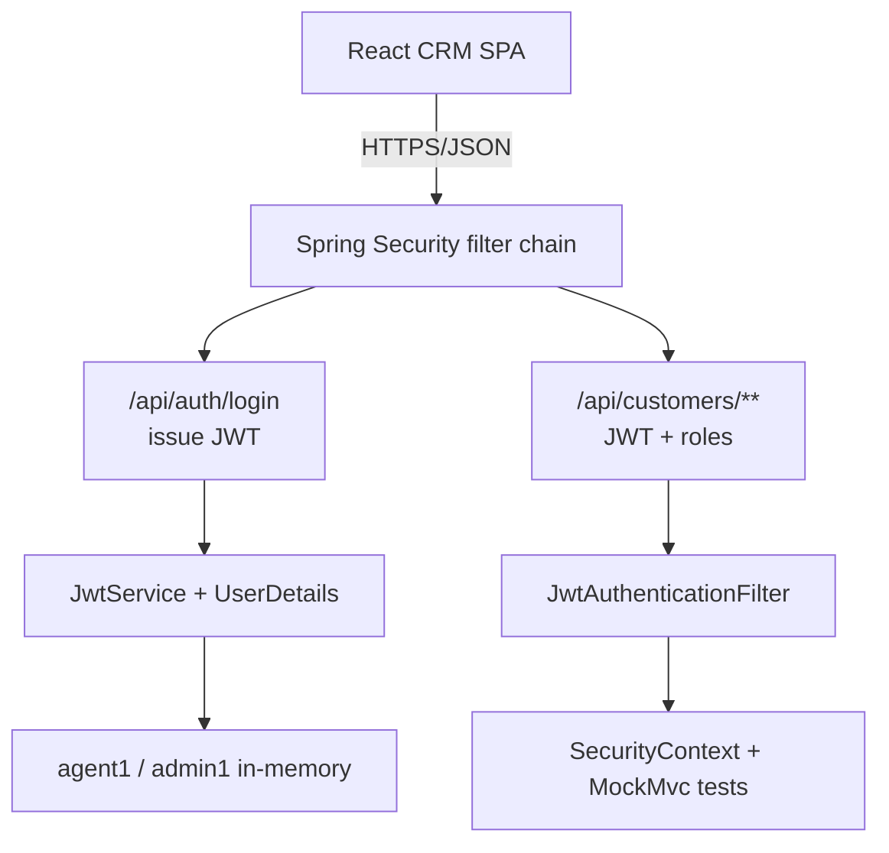

# Lab 28: Spring Security Basics — Northstar CRM JWT and Roles

> **Participants:** Module sequence is in [`../README.md`](../README.md). **Do not start this guide until** you have finished Module 28 [pre-lab exercises 1–6](../exercises/EXERCISES-INDEX.md) (Pass in your notes; order **1 → 2 → 3 → 4 → 5 → 6**). Then open **one** OS how-to ([Windows](LAB-28-WINDOWS.md) · [macOS](LAB-28-MACOS.md)). In class, prefer the **45-minute timed path** with [`starter/`](starter/README.md); the **full path** is every Step below (homework / extended). Skip `solution/` unless your instructor says otherwise. See [Which file do I open?](../../../_PARTICIPANT-FILE-GUIDE.md).

## Activity card

| | |
| --- | --- |
| **Objective** | Add JWT login + SecurityFilterChain with AGENT/ADMIN protection and 401/403 proofs |
| **Skills practiced** | SecurityFilterChain, JwtService, roles, MockMvc security matrix |
| **Expected outcome** | Login token · Bearer GET CUS-1001 · 401/403 evidence · security-notes · no secrets in Git |
| **Estimated time** | Timed path ~45 min · Full path 4–5 hours |
| **Prerequisites** | Lab 0 · Labs 25–27 preferred · Exercises 1–6 Pass · JDK 21 · Maven 3.9+ |
| **Expected files** | `examples/lab28-crm/` — security config, JWT, tests, docs/security-notes.md |
| **Validation checkpoints** | Starter smoke · GUIDE Implementation Checkpoints |

**Module:** 28 — Spring Security Basics  
**Duration:** ~45 minutes (timed path with starter) · Full path: 4–5 Hours

**Primary IDE:** IntelliJ IDEA Community Edition · **Optional IDE:** VS Code

| OS | How-to for this lab |
| -- | ------------------- |
| Windows | [LAB-28-WINDOWS.md](LAB-28-WINDOWS.md) |
| macOS | [LAB-28-MACOS.md](LAB-28-MACOS.md) |

> **Incremental build:** Authn/authz → filter chain → JWT login → MockMvc matrix → IdP checklist → Lab 28.

> **Classroom pacing:** [`../PACING.md`](../PACING.md) (Checkpoints A–E).

> **Critical scope:** Distinguish **401 vs 403**. Roles **AGENT** / **ADMIN**. **Never commit JWT secrets**. Full OAuth2 Authorization Server / React token UI → later. Lab 29 adds validation polish.

## 45-minute timed path (use starter)

In class, use the starter templates so the **core** objectives fit **~45 minutes**. The full Steps below remain for homework / extended depth.

1. Open [`starter/README.md`](starter/README.md).
2. Copy `starter/` into your `java-bootcamp/examples/…` target (see starter README).
3. Fill every `// TODO` — do **not** wait on a perfect prior lab; the starter includes a baseline.
4. Run the starter smoke test; evidence under `notes/screenshots/lab-28/`.
5. Mark timed-path Pass criteria in the starter README. Continue remaining GUIDE steps as homework if needed.

| Path | Time | Scope |
| ---- | ---- | ----- |
| **Timed (default)** | ~45 min | Starter TODOs + smoke test |
| **Full (extended)** | see Duration | Every Step in this GUIDE |

---

## What you'll submit (read this first)

Keep this checklist visible while you work.

| # | Deliverable |
| - | ----------- |
| 1 | `lab28-crm` with SecurityFilterChain, JWT login, AGENT/ADMIN roles |
| 2 | MockMvc (or WebTestClient) evidence for 401/403/200 |
| 3 | Successful-path evidence (login + `CUS-1001` with AGENT) |
| 4 | Controlled-failure evidence (401/403) |
| 5 | Auth-flow notes or diagram in `docs/security-notes.md` |
| 6 | Production IdP / secret-rotation checklist |
| 7 | Run and cleanup instructions |
| 8 | No secrets or generated build directories committed |

**Must submit:** the items in the table above (sources + evidence + short notes).

**Do not submit:** `target/`, `node_modules/`, secrets, heap dumps, or a verbatim instructor `solution/`.

## Lab Overview

This Module 28 lab adds **Spring Security** to the **Customer Management Platform**: JWT-based login, a `SecurityFilterChain` that protects APIs by default, CRM roles `AGENT` and `ADMIN`, and **MockMvc** (or WebTestClient) proofs for **401** and **403**.

## Learning Objectives

After completing this lab, you will be able to:

* Add Spring Security to a Spring Boot 3 CRM API
* Implement a login endpoint that authenticates credentials and returns a JWT
* Validate JWTs on subsequent requests with a filter (or resource-server pattern as taught)
* Protect `/api/customers/**` (and related) routes by default
* Enforce roles `AGENT` and `ADMIN` with request matchers and/or `@PreAuthorize`

## Business Scenario

The CRM stores customer identity, contact details, lifecycle status, and financial accounts. Its React client communicates with Spring Boot over HTTPS/JSON. Without authentication, anyone who can reach the network can read or mutate customer data — unacceptable for Northstar. Agents need day-to-day access to Amina Khan and Ravi Singh records; admins need elevated control for support and configuration.

Use these examples consistently:

| ID | Name | Notes |
| -- | ---- | ----- |
| `CUS-1001` | Amina Khan | `ACTIVE` — primary secured GET target |
| `CUS-1002` | Ravi Singh | `PROSPECT` — readable by AGENT and ADMIN |
| `CUS-9999` | — | optional not-found path under auth |
| `lab-request-001` | — | correlation header (not a credential) |
| `agent1` | — | role `AGENT` (lab-only password) |
| `admin1` | — | role `ADMIN` (lab-only password) |

**Security note for evidence.** Use fictional emails and lab-only passwords. Redact JWTs in screenshots if policy requires. Never commit `CRM_JWT_SECRET` values or `.env` files.

---

## Architecture Context
### NOW (this lab)


```mermaid
flowchart TB
  UI["React CRM SPA"] -->|HTTPS/JSON| Sec["Spring Security filter chain"]
  Sec --> Login["/api/auth/login<br/>issue JWT"]
  Sec --> API["/api/customers/**<br/>JWT + roles"]
  Login --> Jwt["JwtService + UserDetails"]
  API --> Filt["JwtAuthenticationFilter"]
  Jwt --> Users["agent1 / admin1 in-memory"]
  Filt --> Ctx["SecurityContext + MockMvc tests"]
```

## Prerequisites

Prior labs: [25](../../module-25/lab25/LAB-25-GUIDE.md) · [27](../../module-27/lab27/LAB-27-GUIDE.md).

Confirm (Lab 0 tools assumed):

* JDK 21; Maven; Git; Spring Boot 3.x CRM REST API
* `spring-boot-starter-security` and a JWT library (`jjwt` or Spring Authorization/Resource Server patterns as taught)
* HTTP client capable of sending `Authorization: Bearer ...`
* No secrets (keys, tokens, passwords) committed to Git — use `.env.example` only

### Pre-flight

```bash
java -version
mvn -version
```

## Worked example (read before you code)

Study this pattern once before Step 1. Your job is to apply the same idea in the Steps — do not skip ahead to a full solution.

```bash
TOKEN=$(curl -s -X POST http://localhost:8080/api/auth/login \
  -H "Content-Type: application/json" \
  -d '{"username":"agent1","password":"agent-pass"}' | jq -r .accessToken)

curl -s http://localhost:8080/api/customers/CUS-1001 \
  -H "Authorization: Bearer $TOKEN" \
  -H "X-Correlation-Id: lab-request-001"
```

**What to notice:** Match names, IDs, and failure behavior from the scenario — instructors check these.

---

## Implementation Steps

Complete each step in order. Commands assume `~/java-bootcamp/examples/lab28-crm` (Windows: `%USERPROFILE%\java-bootcamp\examples\lab28-crm`) unless noted.

---

### Step 1 — Branch prior CRM and pin Security + JWT deps

**Why:** Secret handling and dependencies must be executable via Maven before any filter logic exists.

**Do this:**

```bash
cd ~/java-bootcamp/examples
cp -r lab27-crm lab28-crm   # or lab25-crm / latest CRM API copy
cd lab28-crm
mkdir -p docs
mkdir -p ~/java-bootcamp/notes/screenshots/lab-28
```

Add `spring-boot-starter-security`, test support, and your JWT library. Define configuration placeholders — never hard-code a production key.

```yaml
crm:
  security:
    jwt-secret: ${CRM_JWT_SECRET:lab-only-change-me-use-long-random}
    jwt-expiration-minutes: 60
```

```text
# .env.example
CRM_JWT_SECRET=replace-with-long-random-lab-secret
```

```bash
mvn -q -DskipTests package
git status
```

**Expected result:** `BUILD SUCCESS`; `.env.example` exists; no real secret in staged files.

**If it fails:** Parent BOM missing → keep Spring Boot parent managing versions. `.env` staged → add to `.gitignore` before continuing.

---

### Step 2 — Configure the security filter chain

**Why:** APIs must deny by default; only login and health should be anonymous.

**Do this:** In `config/SecurityConfig.java`, disable session state for a JWT API. Permit login and health; authenticate everything else. Wire CSRF appropriately for stateless APIs. Register the JWT filter before `UsernamePasswordAuthenticationFilter`.

```java
@Bean
SecurityFilterChain filterChain(HttpSecurity http) throws Exception {
  http.csrf(csrf -> csrf.disable())
      .sessionManagement(sm ->
          sm.sessionCreationPolicy(SessionCreationPolicy.STATELESS))
      .authorizeHttpRequests(auth -> auth
          .requestMatchers("/api/auth/login", "/actuator/health").permitAll()
          .requestMatchers("/api/admin/**").hasRole("ADMIN")
          .requestMatchers("/api/customers/**").hasAnyRole("AGENT", "ADMIN")
          .anyRequest().authenticated())
      .addFilterBefore(jwtFilter, UsernamePasswordAuthenticationFilter.class);
  return http.build();
}
```

Start the app and call customers without a token.

**Expected result:** Application starts; unauthenticated `GET /api/customers/CUS-1001` returns **401**; health remains reachable if exposed.

**If it fails:** Browser form login redirects → disable formLogin/httpBasic for API-style responses. Filter not registered → 401 persists even with valid tokens later. Agent on admin returns **401** instead of **403** on live Tomcat → add `/error` to `permitAll()` (Boot `sendError(403)` dispatches to `/error`; if that path requires auth, the client status becomes 401). MockMvc may still show 403 without this fix — always verify with `spring-boot:run`.

---

### Step 3 — Implement UserDetails and password encoding

**Why:** Roles and encoded passwords are the source of truth for login; plaintext passwords fail security review.

**Do this:** Provide in-memory lab users. Roles must become `ROLE_AGENT` / `ROLE_ADMIN` in Spring's model.

```java
@Bean
UserDetailsService users(PasswordEncoder encoder) {
  return new InMemoryUserDetailsManager(
      User.withUsername("agent1").password(encoder.encode("agent-pass"))
          .roles("AGENT").build(),
      User.withUsername("admin1").password(encoder.encode("admin-pass"))
          .roles("ADMIN").build());
}
```

Document lab passwords only in README for students — do not commit a production password file. Prefer `BCryptPasswordEncoder`.

**Expected result:** `PasswordEncoder` bean is BCrypt (or equivalent); `UserDetailsService` loads `agent1` and `admin1`.

**If it fails:** `{noop}agent-pass` left in production notes as “fine” → reject for anything beyond local demo. Wrong role string → later 403 flakiness.

---

### Step 4 — Implement JwtService (issue and parse)

**Why:** Signature verification is the trust boundary for bearer tokens after login.

**Do this:** Issue tokens that include subject (username), roles, issued-at, and expiry. Validate signature and expiry on parse.

```java
public String issueToken(UserDetails user) {
  // HS256 with crm.security.jwt-secret
  // claims: sub, roles, iat, exp
}

public Jws<Claims> parse(String token) {
  // verify signature and expiration
}
```

Include `lab-request-001` only as a separate header/correlation practice — do not put auth inside correlation IDs.

**Expected result:** `issueToken(agent1)` returns a three-part JWT; parse rejects tampered payloads and expired tokens.

**If it fails:** Secret too short for HS256 library → lengthen lab secret. Clock skew in tests → use generous expiry or fixed clocks in tests.

---

### Step 5 — Build AuthController login

**Why:** Credentials must be verified before any token is issued.

**Do this:**

```java
@PostMapping("/api/auth/login")
public LoginResponse login(@RequestBody LoginRequest req) {
  authenticationManager.authenticate(
      new UsernamePasswordAuthenticationToken(req.username(), req.password()));
  UserDetails user = userDetailsService.loadUserByUsername(req.username());
  return new LoginResponse(jwtService.issueToken(user), user.getUsername());
}
```

```bash
curl -s -X POST http://localhost:8080/api/auth/login \
  -H "Content-Type: application/json" \
  -H "X-Correlation-Id: lab-request-001" \
  -d '{"username":"agent1","password":"agent-pass"}'
```

Also try a bad password and confirm **401** without leaking which field was wrong.

**Expected result:** `{"accessToken":"eyJ...","username":"agent1"}`; bad password returns 401.

**If it fails:** Login also requires JWT → matcher missed `/api/auth/login`. 403 on bad password → check AuthenticationEntryPoint vs AccessDeniedHandler wiring.

---

### Step 6 — JWT filter and authenticated customer access

**Why:** Login alone is not enough; every request must present a valid JWT (defense in depth).

**Do this:** Read `Authorization: Bearer`, parse JWT, set `SecurityContext`, continue the filter chain.

```bash
TOKEN=$(curl -s -X POST http://localhost:8080/api/auth/login \
  -H "Content-Type: application/json" \
  -d '{"username":"agent1","password":"agent-pass"}' | jq -r .accessToken)

curl -s http://localhost:8080/api/customers/CUS-1001 \
  -H "Authorization: Bearer $TOKEN" \
  -H "X-Correlation-Id: lab-request-001"
```

Ensure Amina (`ACTIVE`) is seeded from prior labs or a data seeder.

**Expected result:** JSON for Amina Khan / `ACTIVE`; request without `Authorization` still returns **401**.

**If it fails:** Filter does not set `SecurityContext` → still 401 with valid token. Seed missing `CUS-1001` → 404 under auth (separate from security; fix seed).

---

### Step 7 — Role separation AGENT vs ADMIN

**Why:** Authenticated does not mean authorized — students must prove **403** vs **401**.

**Do this:** Expose an admin-only endpoint (list support data or forced override). Agents must receive 403.

```java
@GetMapping("/api/admin/customers")
@PreAuthorize("hasRole('ADMIN')")
public List<CustomerResponse> adminList() { ... }
```

Enable method security if using `@PreAuthorize`. Exercise:

```bash
# agent token -> 403 on /api/admin/customers
# admin token -> 200
curl -s http://localhost:8080/api/customers/CUS-1002 \
  -H "Authorization: Bearer $AGENT_TOKEN"   # allowed for AGENT
```

**Expected result:** `agent1`: customers OK, admin route **403**; `admin1`: customers OK, admin route **200**; `CUS-1002` (Ravi / PROSPECT) readable by both under customer API policy.

**If it fails:** `hasRole("ADMIN")` but authorities missing `ROLE_` prefix → unexpected 403 for admin. Matcher and annotation disagree → pick one clear policy and document it.

---

### Step 8 — Automated MockMvc matrix and production notes

**Why:** Automated 401/403 checks prevent regressions when routes are added.

**Do this:** Use MockMvc or WebTestClient for the status matrix. Document that production must replace in-memory users and shared HS256 secrets with an IdP and rotating keys.

```java
@Test
void customers_requireAuthentication() throws Exception {
  mockMvc.perform(get("/api/customers/CUS-1001"))
      .andExpect(status().isUnauthorized());
}

@Test
void admin_forbidden_for_agent() throws Exception {
  // obtain or forge agent JWT under test secret → expect 403 on /api/admin/**
}
```

```bash
mvn -q test
mvn -q test   # second run for determinism
```

Record production checklist in `docs/security-notes.md` (IdP, key vault, no plaintext passwords, token TTL, refresh design notes).

**Expected result:** Surefire green twice; README/docs list IdP / secret rotation checklist items.

**If it fails:** Tests depend on a live server clock for expiry → use fixed expiry in tests. Security context leaks across tests → reset between cases.

---

### Step 9 — Document auth runbook and production IdP checklist

**Why:** Peers must reproduce login → Bearer → role checks without Slack archaeology.

**Do this:** In project README and `docs/security-notes.md`, list:

```bash
export CRM_JWT_SECRET='lab-only-long-random'   # never commit the real value
mvn -q spring-boot:run
# login → capture token (redact in notes) → GET CUS-1001 / admin matrix
mvn -q test
```

Include: demo users (`agent1`/`admin1`), matcher table (login permitAll, customers AGENT|ADMIN, admin ADMIN), token TTL, and production checklist (IdP, JWKS, secret rotation, rate-limit failed logins, never log Bearer tokens).

**Expected result:** Peer can reproduce green auth demos and tests from README alone.

**If it fails:** Runbook lists only `spring-boot:run` with no 401/403 checks → add the matrix commands.

---

### Step 10 — Failure experiments + evidence pack

**Why:** Misconfigured secrets, role mistakes, and token logging are the failure modes of this lab’s culture.

**Do this:** Complete Failure Experiments. Capture redacted curl and Surefire excerpts under `notes/screenshots/lab-28/`. Confirm `git status` is clean of secrets and `target/`. Run `mvn -q test` twice for determinism.

**Expected result:** ≥3 experiments documented; identical consecutive test runs; evidence saved; no JWT/password in Git.

**If it fails:** See Troubleshooting.

---

## Seed and fixture checklist (before demos)

Ensure the CRM repository still contains:

| Fixture | Seed requirement |
| ------- | ---------------- |
| `CUS-1001` | Amina Khan, `ACTIVE`, fictional email |
| `CUS-1002` | Ravi Singh, `PROSPECT`, fictional email |
| Correlation | Clients send `X-Correlation-Id: lab-request-001` |

If your Lab 25/27 copy has empty data, add a `CommandLineRunner` or `data.sql` before claiming Security “works” — a 404 under a valid JWT is a data issue, not an auth issue.

---

## Implementation Checkpoints

### Checkpoint A — Tooling and secret hygiene

_Mark **Pass** or **Fail** in your lab notes._

| # | Confirm | Your notes |
| - | ------- | ---------- |
| 1 | `lab28-crm` under `~/java-bootcamp/examples/` | Pass / Fail |
| 2 | Security + JWT dependencies resolve | Pass / Fail |
| 3 | `.env.example` present; real `.env` / secrets not staged | Pass / Fail |

### Checkpoint B — Filter chain and JWT login

_Mark **Pass** or **Fail** in your lab notes._

| # | Confirm | Your notes |
| - | ------- | ---------- |
| 1 | Stateless `SecurityFilterChain` with permitAll login/health | Pass / Fail |
| 2 | `agent1` / `admin1` with BCrypt (or equivalent) | Pass / Fail |
| 3 | Login issues JWT; parse rejects tampered tokens | Pass / Fail |

### Checkpoint C — Roles and API access

_Mark **Pass** or **Fail** in your lab notes._

| # | Confirm | Your notes |
| - | ------- | ---------- |
| 1 | Bearer access to `CUS-1001` / `CUS-1002` as AGENT | Pass / Fail |
| 2 | Missing/invalid JWT → 401 | Pass / Fail |
| 3 | AGENT on admin route → 403; ADMIN → 200 | Pass / Fail |

### Checkpoint D — Tests and hygiene

_Mark **Pass** or **Fail** in your lab notes._

| # | Confirm | Your notes |
| - | ------- | ---------- |
| 1 | MockMvc (or WebTestClient) 401/403/200 matrix green | Pass / Fail |
| 2 | Two consecutive `mvn test` identical success | Pass / Fail |
| 3 | Production IdP / rotation notes; no tokens in logs or Git | Pass / Fail |

---

## Reference Commands, Configuration, and Code

### SecurityFilterChain (pattern)

```java
http.csrf(csrf -> csrf.disable())
    .sessionManagement(sm ->
        sm.sessionCreationPolicy(SessionCreationPolicy.STATELESS))
    .authorizeHttpRequests(auth -> auth
        .requestMatchers("/api/auth/login").permitAll()
        .requestMatchers("/api/admin/**").hasRole("ADMIN")
        .requestMatchers("/api/customers/**").hasAnyRole("AGENT", "ADMIN")
        .anyRequest().authenticated());
```

### Commands

```bash
cd ~/java-bootcamp/examples/lab28-crm
mvn -q -DskipTests package
mvn -q spring-boot:run
curl -s -X POST http://localhost:8080/api/auth/login \
  -H "Content-Type: application/json" \
  -H "X-Correlation-Id: lab-request-001" \
  -d '{"username":"admin1","password":"admin-pass"}'
curl -s http://localhost:8080/api/customers/CUS-1002 \
  -H "Authorization: Bearer <token>" \
  -H "X-Correlation-Id: lab-request-001"
mvn -q test
git status
```

## Failure Experiments

| # | Experiment | Observe | Restore |
| - | ---------- | ------- | ------- |
| 1 | Mismatch JWT secret between issuer and filter | 401 on customers with “valid-looking” token | Align secret / env |
| 2 | Login with wrong password; malformed Bearer | 401; no secret leakage in body/logs | Keep safe error path |
| 3 | Call admin API as `agent1` | 403 | Confirm matcher / `@PreAuthorize` |
| 4 | Reuse expired token | 401; explain refresh as production concern | Relogin for new token |
| 5 | Optional: slow AuthenticationProvider | Client timeout honest; no password in debug logs | Remove artificial delay |

---

## Troubleshooting

| Symptom | Likely cause | Fix |
| ------- | ------------ | --- |
| HTML login redirect | Form login still enabled | Disable formLogin; return 401 for APIs |
| Valid token still 401 | Filter order / SecurityContext not set | Register filter before UsernamePasswordAuthenticationFilter |
| Admin always 403 | Role naming (`ROLE_` prefix) | Use `roles("ADMIN")` or `hasAuthority("ROLE_ADMIN")` consistently |
| Tests flaky on expiry | Real clock skew | Fixed TTL or Clock bean in tests |
| Double auth errors | Duplicate filter registration | Register once; keep login `permitAll` |
| Secret change ignored | Env not reloaded | Restart JVM after changing `CRM_JWT_SECRET` |
| Working in `module-28-exercises` for the lab | Wrong project | Lab lives in `examples/lab28-crm` |
| Real JWT secret committed | Secret hygiene failure | Remove, rotate, use `.env.example` only |

## Security and Production Review

Optional — jot brief notes in your README if useful for your progress check (not a separate essay):

1. Which inputs are untrusted (credentials, Authorization header, customer IDs)?
2. Where are authn/authz enforced (filter chain, method security)?
3. Which values are sensitive (JWT secret, passwords, bearer tokens) and where stored?

---


## Cleanup

```bash
cd ~/java-bootcamp/examples/lab28-crm
# Stop spring-boot:run (Ctrl+C)
# Unset CRM_JWT_SECRET from the shell if exported
mvn -q clean
git status
```

Do not commit `.env`, tokens, or `target/`. Keep redacted screenshots under `notes/screenshots/lab-28/`.

**Keep `lab28-crm`**—Lab 29 layers Bean Validation and `ErrorResponse` on this secured API.


## Reflection Questions

Write **1–3 sentence** answers (not essays):

1. Which design decision most affected correctness (stateless JWT vs session)?
2. What evidence proves role separation works?
3. Which failure was hardest to diagnose (401 vs 403 vs filter order)?

---


