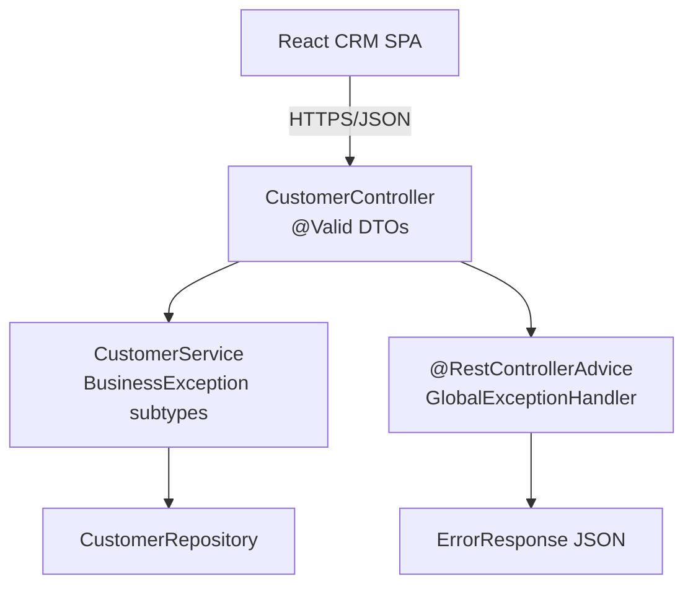
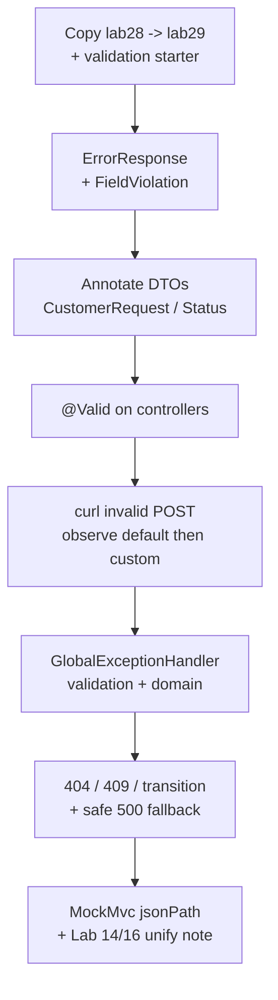

# Lab 29: Validation and Exception Handling — Northstar CRM Error Contracts

**Module:** 29 — Validation and Exception Handling  
**Lab folder:** `labs/Week 3 - Spring Framework and Enterprise Patterns/module-29/lab29/`  
**Difficulty:** Intermediate  
**Duration:** ~45 minutes (timed path with starter) · Full path: 4–5 Hours

**Primary IDE:** IntelliJ IDEA Community Edition · **Optional IDE:** VS Code

| OS | How-to for this lab |
| -- | ------------------- |
| Windows | [LAB-29-WINDOWS.md](LAB-29-WINDOWS.md) |
| macOS | [LAB-29-MACOS.md](LAB-29-MACOS.md) |

> **Environment reminder:** Finish [Lab 0](../../../Week%201%20-%20Java%20and%20JVM%20Foundations/module-00/lab0/LAB-0-GUIDE.md). Use **IntelliJ IDEA Community** (primary; optional VS Code) on your laptop with **JDK 21** and **Maven 3.9+** (Spring Boot 3.x via Maven). Work under `~/java-bootcamp` (Windows: `%USERPROFILE%\java-bootcamp`).

---

## 45-minute timed path (use starter)

In class, use the starter templates so the **core** objectives fit **~45 minutes**. The full Steps below remain for homework / extended depth.

1. Open [`starter/README.md`](starter/README.md).
2. Copy `starter/` into your `java-bootcamp/examples/…` target (see starter README).
3. Fill every `// TODO` — do **not** wait on a perfect prior lab; the starter includes a baseline.
4. Run the starter smoke test; evidence under `notes/screenshots/lab-29/`.
5. Mark timed-path Pass criteria in the starter README. Continue remaining GUIDE steps as homework if needed.

| Path | Time | Scope |
| ---- | ---- | ----- |
| **Timed (default)** | ~45 min | Starter TODOs + smoke test |
| **Full (extended)** | see Duration | Every Step in this GUIDE |

---

## How to follow this lab

1. **In class (timed path):** prefer [`starter/README.md`](starter/README.md) — copy starter → `java-bootcamp/examples/lab29-crm`, fill `// TODO`, run smoke test (~45 min).
2. Open the **Windows** or **macOS** how-to (links above) in a second tab for OS-specific commands.
3. Create/work only under your `java-bootcamp/examples/…` folder from the steps (not inside this `labs/` git clone unless a step says otherwise).
4. For each **Step N** (full path / homework): read **Why** (if present) → do the actions → confirm **Expected** / **Expected result** → then continue.
5. When stuck, use **Failure Experiments** / troubleshooting in this guide before asking for help.
6. Capture evidence under `notes/screenshots/lab-29/` (workspace root under `java-bootcamp`; redact secrets). Use the **Pass criteria** tables — write **Pass** or **Fail** in your notes. GitHub file view does not support clickable checkboxes.


## What you'll submit (read this first)

Keep this checklist visible while you work. Full detail is under [Expected Deliverables](#expected-deliverables) at the end.

| # | Deliverable |
| - | ----------- |
| 1 | `lab29-crm` with Bean Validation + `GlobalExceptionHandler` + `ErrorResponse` |
| 2 | Automated tests for validation and not-found envelopes |
| 3 | Successful-path evidence (`CUS-1001`, `CUS-1002`) |
| 4 | Controlled-failure evidence (400/404/409 + envelope) |
| 5 | Lab 14/16 unify note (and optional SOAP alignment) |
| 6 | Run and cleanup instructions |
| 7 | No secrets or generated build directories committed |


## Lab Overview

This Module 29 lab unifies **Bean Validation** on request DTOs with a global `@RestControllerAdvice` that returns a consistent **`ErrorResponse`** for REST failures. Patterns from Lab 14 (DTO/validation concepts) and Lab 16 (exception hierarchy / handler ideas) become the Spring Boot contract every client — React SPA, integration test, or partner — relies on.

**Purpose.** Invalid payloads must fail at the API boundary with clear messages — never as stack-trace HTML. Missing customers such as a typo of `CUS-1001` must return a not-found envelope React can render. Duplicate creates and illegal lifecycle transitions use domain exceptions handled globally with predictable HTTP statuses.

**What you build (exercise).** Copy to `lab29-crm`; add `spring-boot-starter-validation`; define `ErrorResponse` (+ field violations); annotate `CustomerRequest` / `StatusUpdateRequest`; enable `@Valid` on controllers; implement `GlobalExceptionHandler` for validation, not-found, duplicate, illegal transition, and safe 500 fallback; prove with curl using `lab-request-001`; write MockMvc tests asserting status **and** body shape; optionally note SOAP/WS fault alignment.

**What success looks like.** Under `~/java-bootcamp/examples/lab29-crm/` invalid POSTs return 400 with violations, `CUS-9999` returns 404 envelopes, duplicate `CUS-1001` returns 409, happy GETs for Amina/Ravi still 200, and `mvn test` stays green twice.

**Depends on Labs 14, 16, 25–28.** Recreate Lab 14/16 ideas here if those labs were stubs. Prefer Lab 28 so Security and validation coexist.

**CRM connection.** Fixtures `CUS-1001` Amina / `CUS-1002` Ravi / `CUS-9999` not-found / correlation `lab-request-001` on every error envelope.

---

## Learning Objectives

After completing this lab, you will be able to:

* Annotate CRM request DTOs with Bean Validation constraints
* Trigger validation with `@Valid` / `@Validated` on controller methods
* Map field and object-level violations into a stable `ErrorResponse`
* Centralize exception handling with `@RestControllerAdvice` / `@ExceptionHandler`
* Align HTTP status codes with business exceptions (404, 409, 400/422)
* Preserve correlation IDs such as `lab-request-001` in error responses
* Unify Lab 14 and Lab 16 patterns inside Boot (and optionally SOAP fault mapping notes)
* Write tests that assert both status and error body shape
* Keep 500 fallbacks safe for clients while logging detail server-side

---

## Business Scenario

The CRM stores customer identity, contact details, lifecycle status, and financial accounts. Agents and integrations will send bad JSON. Leadership freezes:

**No API error path may return framework-default HTML stack traces or ad-hoc `Map` bodies to React.**

You own the contract for Amina (`CUS-1001` ACTIVE), Ravi (`CUS-1002` PROSPECT), unknown IDs, duplicates, and illegal transitions.

Use these examples consistently:

| ID | Name | Notes |
| -- | ---- | ----- |
| `CUS-1001` | Amina Khan | `ACTIVE` — happy GET; duplicate create → 409 |
| `CUS-1002` | Ravi Singh | `PROSPECT` — happy GET / status update source |
| `CUS-9999` | — | not-found → 404 `ErrorResponse` |
| `lab-request-001` | — | `ErrorResponse.correlationId` / `X-Correlation-Id` |
| `CUS-1003` | Maya Chen (tests) | valid shape for validation-only tests |

**Security note for evidence.** Never echo passwords or JWTs in `rejectedValue`. Fictional emails only.

---

## Architecture Context

### NOW (this lab)



### Lab flow (mermaid)



### Architecture NOW vs LATER

| Aspect | Lab 29 (NOW) | Later / production |
| ------ | ------------ | ------------------ |
| Validation | Bean Validation on request DTOs | Same + shared problem+json profile |
| Errors | Custom `ErrorResponse` | Optional RFC 7807 `ProblemDetail` |
| Domain | Lab 16-style exception types in Boot | Same codes across REST and SOAP |
| Security coexistence | JSON errors under JWT (Lab 28) | Same |

**Lab focus:** enterprise validation + `@ControllerAdvice` `ErrorResponse`; unify Lab 14/16 patterns in Boot (and WS context notes).

---

## Prerequisites

Complete [SETUP](../../../SETUP-INSTRUCTIONS.md), [Lab 0](../../../Week%201%20-%20Java%20and%20JVM%20Foundations/module-00/lab0/LAB-0-GUIDE.md), and Labs [14](../../../Week%202%20-%20Backend,%20AI%20Tools%20and%20Testing/module-14/lab14/LAB-14-GUIDE.md), [16](../../../Week%202%20-%20Backend,%20AI%20Tools%20and%20Testing/module-16/lab16/LAB-16-GUIDE.md), [25](../../module-25/lab25/LAB-25-GUIDE.md)–[28](../../module-28/lab28/LAB-28-GUIDE.md) as available. Confirm:

* JDK 21; Maven; Spring Boot 3.x web app with Customer API
* `spring-boot-starter-validation` on the classpath
* Familiarity with Lab 14 DTO ideas and Lab 16 exception-handler ideas
* Optional: Lab 28 Security — validation must still return JSON for API clients
* No secrets committed to Git

### Pre-flight

```bash
java -version
mvn -version
git --version
pwd
ls ~/java-bootcamp/examples
```

If Lab 28 is active, confirm you can obtain a lab JWT before curling protected endpoints.

---

## Suggested Project Files

```text
~/java-bootcamp/examples/lab29-crm/
├── src/
│   ├── main/
│   │   ├── java/com/northstar/crm/
│   │   │   ├── CrmApplication.java
│   │   │   ├── controller/
│   │   │   │   └── CustomerController.java
│   │   │   ├── dto/
│   │   │   │   ├── CustomerRequest.java
│   │   │   │   ├── StatusUpdateRequest.java
│   │   │   │   ├── CustomerResponse.java
│   │   │   │   └── ErrorResponse.java
│   │   │   ├── service/
│   │   │   │   └── CustomerService.java
│   │   │   ├── repository/
│   │   │   │   └── CustomerRepository.java
│   │   │   ├── exception/
│   │   │   │   ├── BusinessException.java
│   │   │   │   ├── CustomerNotFoundException.java
│   │   │   │   ├── DuplicateCustomerException.java
│   │   │   │   ├── InvalidStatusTransitionException.java
│   │   │   │   └── GlobalExceptionHandler.java
│   │   │   └── entity/
│   │   │       ├── Customer.java
│   │   │       └── CustomerStatus.java
│   │   └── resources/
│   │       └── application.yml
│   └── test/
│       └── java/com/northstar/crm/
│           ├── controller/CustomerValidationTest.java
│           └── exception/GlobalExceptionHandlerTest.java
├── docs/
│   └── error-contract-notes.md
├── notes/screenshots/
├── pom.xml
├── .gitignore
└── README.md
```

Ignore `target/`, IDE metadata, tokens, and passwords.

---

## Concepts to Discuss

Write 2–3 sentences each in `docs/error-contract-notes.md`:

1. Main flow when validation fails versus when a domain exception is thrown
2. Trust boundary: DTO vs service vs database constraints
3. Success/failure contracts (`ErrorResponse` fields and HTTP statuses)
4. Stable identity (`CUS-1001`) in error payloads for support
5. Retry implications for 400/404/409 vs transient 500/503
6. Local shortcut versus production (localization, problem+json)
7. Evidence operators need (`lab-request-001`, timestamp, path)
8. Two app instances: stateless error mapping (same envelope everywhere)
9. Why forgetting `@Valid` is a production foot-gun
10. How Lab 14/16 ideas map onto Boot without divergent SOAP/REST semantics

---

## Implementation Steps

Complete each step in order. Commands assume `~/java-bootcamp/examples/lab29-crm` (Windows: `%USERPROFILE%\java-bootcamp\examples\lab29-crm`) unless noted.

---

### Step 1 — Branch Lab 28 and pin validation + ErrorResponse

**Why:** A single error envelope beats ad-hoc `Map` bodies for every client.

**Do this:**

```bash
cd ~/java-bootcamp/examples
cp -r lab28-crm lab29-crm   # or latest CRM API if Lab 28 skipped
cd lab29-crm
mkdir -p docs
mkdir -p ~/java-bootcamp/notes/screenshots/lab-29
```

```xml
<dependency>
  <groupId>org.springframework.boot</groupId>
  <artifactId>spring-boot-starter-validation</artifactId>
</dependency>
```

```java
public record ErrorResponse(
    Instant timestamp,
    int status,
    String error,
    String message,
    String path,
    String correlationId,
    List<FieldViolation> violations
) {
  public record FieldViolation(String field, String message, Object rejectedValue) {}
}
```

Keep `rejectedValue` free of secrets.

```bash
mvn -q -DskipTests package
```

**Expected result:** `BUILD SUCCESS`; `ErrorResponse` compiles; validation starter on classpath.

**If it fails:** Boot 3 missing validation starter → add dependency explicitly. Record refuses Instant → check imports (`java.time.Instant`).

---

### Step 2 — Annotate CustomerRequest and StatusUpdateRequest

**Why:** Validation belongs on the request DTO, not only inside undocumented service `if` checks.

**Do this:** Unify Lab 14-style constraints on API contracts:

```java
public record CustomerRequest(
    @NotBlank @Pattern(regexp = "CUS-\\d{4}") String customerId,
    @NotBlank @Size(max = 120) String fullName,
    @NotBlank @Email String email,
    @NotNull CustomerStatus status
) {}

public record StatusUpdateRequest(
    @NotNull CustomerStatus status
) {}
```

Creating `CUS-1001` Amina Khan `ACTIVE` and `CUS-1002` Ravi Singh `PROSPECT` must satisfy these rules.

**Expected result:** DTOs compile with `jakarta.validation` annotations; illegal emails and blank names are expressible as constraint violations.

**If it fails:** `javax.validation` imports on Boot 3 → switch to `jakarta.validation`. Pattern rejects valid IDs → align regex with your ID scheme.

---

### Step 3 — Enable @Valid on controller methods

**Why:** Constraints do nothing without `@Valid`; forgetting it is a common production bug.

**Do this:**

```java
@PostMapping
public ResponseEntity<CustomerResponse> create(
    @Valid @RequestBody CustomerRequest request,
    @RequestHeader(value = "X-Correlation-Id", defaultValue = "lab-request-001")
    String correlationId) {
  // delegate to service
}

@PatchMapping("/{customerId}/status")
public CustomerResponse updateStatus(
    @PathVariable String customerId,
    @Valid @RequestBody StatusUpdateRequest request) {
  return CustomerResponse.from(service.updateStatus(customerId, request.status()));
}
```

If Lab 28 Security is on, call with a Bearer token for manual curls.

**Expected result:** Valid create for a new customer returns 201; methods reference `@Valid`.

**If it fails:** Security returns 401 before validation → obtain JWT or use `@WithMockUser` in tests. Missing `@Valid` → bad emails reach the service (prove then restore).

---

### Step 4 — Prove validation failures with curl (before/after)

**Why:** Capture the trust-boundary rejection and compare framework-default vs custom envelope.

**Do this:**

```bash
curl -s -i -X POST http://localhost:8080/api/customers \
  -H "Content-Type: application/json" \
  -H "X-Correlation-Id: lab-request-001" \
  -H "Authorization: Bearer $TOKEN" \
  -d '{"customerId":"BAD","fullName":"","email":"not-an-email","status":"ACTIVE"}'
```

Before the global handler exists, Spring may return its default 400 structure. Note it — Step 5 replaces it with your envelope.

**Expected result:** HTTP 400 (or 422 if configured later); body indicates validation problems; no stack-trace HTML.

**If it fails:** Wrong Content-Type → validation may not run as expected. Security HTML login → fix Lab 28 API entry point first.

---

### Step 5 — Implement GlobalExceptionHandler for validation

**Why:** Stable client contracts beat framework-default JSON shapes that drift across Boot versions.

**Do this:** Unify Lab 16-style central handling:

```java
@RestControllerAdvice
public class GlobalExceptionHandler {

  @ExceptionHandler(MethodArgumentNotValidException.class)
  public ResponseEntity<ErrorResponse> handleValidation(
      MethodArgumentNotValidException ex, HttpServletRequest req) {
    var violations = ex.getBindingResult().getFieldErrors().stream()
        .map(fe -> new ErrorResponse.FieldViolation(
            fe.getField(), fe.getDefaultMessage(), fe.getRejectedValue()))
        .toList();
    var body = new ErrorResponse(
        Instant.now(), 400, "Bad Request", "Validation failed",
        req.getRequestURI(), correlationId(req), violations);
    return ResponseEntity.badRequest().body(body);
  }
}
```

Read `X-Correlation-Id` from the request (default `lab-request-001` only when demos need it).

**Expected result:** Re-run invalid POST; JSON matches `ErrorResponse`; violations include email/fullName/customerId; `correlationId` reflects `lab-request-001` when header sent.

**If it fails:** Advice not scanned → wrong package. Violations empty → handler type mismatch (use `MethodArgumentNotValidException`).

---

### Step 6 — Domain exceptions: not found, duplicate, illegal transition

**Why:** Domain exceptions must not leak as generic 500s.

**Do this:**

```java
public class CustomerNotFoundException extends BusinessException { ... }
public class DuplicateCustomerException extends BusinessException { ... }
public class InvalidStatusTransitionException extends BusinessException { ... }

@ExceptionHandler(CustomerNotFoundException.class)
public ResponseEntity<ErrorResponse> notFound(...) {
  return ResponseEntity.status(404).body(...);
}

@ExceptionHandler(DuplicateCustomerException.class)
public ResponseEntity<ErrorResponse> conflict(...) {
  return ResponseEntity.status(409).body(...);
}
```

Exercise:

```bash
curl -s -i http://localhost:8080/api/customers/CUS-9999 \
  -H "X-Correlation-Id: lab-request-001" \
  -H "Authorization: Bearer $TOKEN"
# After seeding CUS-1001, POST create again for CUS-1001 -> 409
# Illegal ACTIVE → PROSPECT (or your Lab 15 rules) -> 400/422
```

**Expected result:** `CUS-9999` → 404 envelope; duplicate `CUS-1001` → 409; happy GET `CUS-1001` / `CUS-1002` still 200 (Amina ACTIVE / Ravi PROSPECT).

**If it fails:** Duplicate returns 500 → exception not mapped. Transition mutates status then throws → fix service atomicity from Lab 15/27 patterns.

---

### Step 7 — Fallback handler and SOAP/WS notes

**Why:** Client bodies must stay safe while logs remain actionable.

**Do this:**

```java
@ExceptionHandler(Exception.class)
public ResponseEntity<ErrorResponse> fallback(Exception ex, HttpServletRequest req) {
  log.error("Unhandled correlationId={}", correlationId(req), ex);
  return ResponseEntity.status(500).body(new ErrorResponse(
      Instant.now(), 500, "Internal Server Error",
      "Unexpected error", req.getRequestURI(), correlationId(req), List.of()));
}
```

In `docs/error-contract-notes.md`, add a short “SOAP / Spring-WS alignment” note: the same `BusinessException` types should map to SOAP faults (as in Lab 24) so REST and SOAP do not invent divergent semantics. Implementing faults is optional unless assigned.

Optional stretch: sketch how SOAP clients, REST, services, repositories, transactions (Lab 27), and security (Lab 28) fit one Customer Service Platform backend — keep out of the critical path unless your instructor assigns it.

**Expected result:** Forced `RuntimeException` in a test returns 500 `ErrorResponse`; server logs include stack; client body does not; README/docs contain SOAP alignment paragraph.

**If it fails:** Fallback shadows more specific handlers → order handlers carefully / prefer specific types first.

---

### Step 8 — Automated tests for validation and handler

**Why:** Asserting `jsonPath` on `ErrorResponse` prevents silent contract drift.

**Do this:**

```java
@Test
void create_rejectsInvalidEmail() throws Exception {
  mockMvc.perform(post("/api/customers")
          .contentType(MediaType.APPLICATION_JSON)
          .header("X-Correlation-Id", "lab-request-001")
          .content("""
              {"customerId":"CUS-1003","fullName":"Maya Chen",
               "email":"bad","status":"PROSPECT"}
              """))
      .andExpect(status().isBadRequest())
      .andExpect(jsonPath("$.correlationId").value("lab-request-001"))
      .andExpect(jsonPath("$.violations[0].field").exists());
}

@Test
void get_unknownCustomer_returns404Envelope() throws Exception {
  mockMvc.perform(get("/api/customers/CUS-9999")
          .header("X-Correlation-Id", "lab-request-001"))
      .andExpect(status().isNotFound())
      .andExpect(jsonPath("$.status").value(404));
}
```

If Lab 28 security is active, use a test JWT or `@WithMockUser`.

```bash
mvn -q test
mvn -q test
```

**Expected result:** Surefire green twice; assertions cover correlation and violations.

**If it fails:** Violation list order flake → sort in handler or assert with Hamcrest `hasItem`. Security blocks MockMvc → add security test helpers.

---

### Step 9 — Failure experiments + Lab 14/16 unify note

**Why:** Document that Boot is the unification point for earlier course patterns.

**Do this:** Complete [Failure Experiments](#failure-experiments). Write a short paragraph in `docs/error-contract-notes.md` stating how Lab 14 DTO constraints and Lab 16 handlers are now one Boot contract. Capture before/after curl bodies under `notes/screenshots/lab-29/`.

**Expected result:** ≥3 experiments; unify note present; evidence saved; `git status` clean of `target/`.

**If it fails:** See Troubleshooting.

---

## Implementation Checkpoints

### Checkpoint A — Tooling and envelope

_Mark each row **Pass** or **Fail** in your lab notes (GitHub markdown files are not interactive checklists)._

| # | Confirm | Your notes |
| - | ------- | ---------- |
| 1 | `lab29-crm` under `~/java-bootcamp/examples/` | Pass / Fail |
| 2 | Validation starter present | Pass / Fail |
| 3 | `ErrorResponse` + `FieldViolation` compile | Pass / Fail |

### Checkpoint B — DTO and controller validation

_Mark each row **Pass** or **Fail** in your lab notes (GitHub markdown files are not interactive checklists)._

| # | Confirm | Your notes |
| - | ------- | ---------- |
| 1 | Annotated `CustomerRequest` / `StatusUpdateRequest` | Pass / Fail |
| 2 | `@Valid` on create and status update | Pass / Fail |
| 3 | Invalid POST rejected at boundary (no HTML stack) | Pass / Fail |

### Checkpoint C — Global handler and domain mapping

_Mark each row **Pass** or **Fail** in your lab notes (GitHub markdown files are not interactive checklists)._

| # | Confirm | Your notes |
| - | ------- | ---------- |
| 1 | Validation → 400 custom envelope with `lab-request-001` | Pass / Fail |
| 2 | Not-found 404, duplicate 409, illegal transition mapped | Pass / Fail |
| 3 | Safe 500 fallback; SOAP/Lab 14–16 notes documented | Pass / Fail |

### Checkpoint D — Tests and hygiene

_Mark each row **Pass** or **Fail** in your lab notes (GitHub markdown files are not interactive checklists)._

| # | Confirm | Your notes |
| - | ------- | ---------- |
| 1 | MockMvc asserts status + `jsonPath` body | Pass / Fail |
| 2 | Two consecutive `mvn test` identical success | Pass / Fail |
| 3 | No secrets / stack traces / `target/` committed | Pass / Fail |

---

## Reference Commands, Configuration, and Code

### ErrorResponse shape

```json
{
  "timestamp": "2026-07-14T12:00:00Z",
  "status": 400,
  "error": "Bad Request",
  "message": "Validation failed",
  "path": "/api/customers",
  "correlationId": "lab-request-001",
  "violations": [
    {"field": "email", "message": "must be a well-formed email address", "rejectedValue": "bad"}
  ]
}
```

### GlobalExceptionHandler (pattern)

```java
@RestControllerAdvice
public class GlobalExceptionHandler {
  @ExceptionHandler(MethodArgumentNotValidException.class)
  public ResponseEntity<ErrorResponse> handleValidation(...) { ... }

  @ExceptionHandler(CustomerNotFoundException.class)
  public ResponseEntity<ErrorResponse> notFound(...) { ... }
}
```

### Commands

```bash
cd ~/java-bootcamp/examples/lab29-crm
mvn -q spring-boot:run
curl -s -i -X POST http://localhost:8080/api/customers \
  -H "Content-Type: application/json" \
  -H "X-Correlation-Id: lab-request-001" \
  -H "Authorization: Bearer <token>" \
  -d '{"customerId":"BAD","fullName":"","email":"x","status":"ACTIVE"}'
curl -s -i http://localhost:8080/api/customers/CUS-1001 \
  -H "X-Correlation-Id: lab-request-001" \
  -H "Authorization: Bearer <token>"
mvn -q test
git status
```

### Class map

| Class | Role |
| ----- | ---- |
| `CustomerRequest` | Bean Validation contract |
| `ErrorResponse` | Stable client error envelope |
| `GlobalExceptionHandler` | Status + body mapping |
| `CustomerValidationTest` | MockMvc validation proofs |
| `error-contract-notes.md` | Lab 14/16 unify + SOAP note |

---

## Manual Verification

1. Valid GET Amina (`CUS-1001`) / Ravi (`CUS-1002`) still succeed.
2. Invalid create returns 400 `ErrorResponse` with violations.
3. `CUS-9999` returns 404 envelope with correlation ID.
4. Duplicate `CUS-1001` returns 409.
5. Illegal status transition returns mapped 400/422 (not 500).
6. Fallback 500 does not leak stack traces to clients.
7. Correlation `lab-request-001` present on error bodies when header sent.
8. MockMvc covers validation and not-found.
9. Two consecutive `mvn test` runs match.
10. Lab 14/16 unify note documented; no secrets committed.

---

## Failure Experiments

| # | Experiment | Observe | Restore |
| - | ---------- | ------- | ------- |
| 1 | Omit `@Valid` temporarily | Bad email reaches service | Restore `@Valid` |
| 2 | Blank name / bad email / bad ID pattern | 400 + violations | Keep constraints |
| 3 | Unknown `CUS-9999`; duplicate `CUS-1001` | 404 / 409 envelopes | Keep mappings |
| 4 | Force unhandled exception | Safe 500 body; stack in logs only | Keep fallback |
| 5 | Repeat invalid POST twice | Identical failure contract | Keep handler deterministic |

---

## Troubleshooting

| Symptom | Likely cause | Fix |
| ------- | ------------ | --- |
| Constraints ignored | Missing `@Valid` or validation starter | Add both |
| Advice never runs | Not component-scanned | Place under `com.northstar.crm` |
| HTML login on bad JSON | Lab 28 form login | Return JSON 401; obtain JWT for curls |
| Violation order flake | Unsorted field errors | Sort in handler or loosen asserts |
| Duplicate returns 200 | Unique check missing / after side effects | Enforce after validation, before persist |
| 500 for not-found | Exception type not handled | Map `CustomerNotFoundException` → 404 |

---

## Security and Production Review

Answer in README / `docs/error-contract-notes.md`:

1. Which inputs are untrusted (JSON bodies, path IDs, headers)?
2. Where are authn (Lab 28), authz, and validation enforced?
3. Which values are sensitive — never in `rejectedValue` or client 500 bodies?
4. What can be retried safely (which statuses)?
5. What happens after partial failure (client retries after 409)?
6. What would an operator monitor (validation failure rate, 404 rate)?
7. Which local default is unacceptable (leaky 500 messages, default correlation always `lab-request-001` in prod)?
8. How is the `ErrorResponse` contract versioned when fields change?

---

## Cleanup

```bash
cd ~/java-bootcamp/examples/lab29-crm
# Stop spring-boot:run (Ctrl+C)
mvn -q clean
git status
```

Keep screenshots/excerpts. Do not commit `target/`.

**Keep `lab29-crm`**—Labs 30–31 add Kafka on a CRM that already speaks a stable error contract.

---

## Expected Deliverables

Same checklist as [What you'll submit](#what-youll-submit-read-this-first) above.

* `lab29-crm` with Bean Validation + `GlobalExceptionHandler` + `ErrorResponse`
* Automated tests for validation and not-found envelopes
* Successful-path evidence (`CUS-1001`, `CUS-1002`)
* Controlled-failure evidence (400/404/409 + envelope)
* Lab 14/16 unify note (and optional SOAP alignment)
* Run and cleanup instructions
* No secrets or generated build directories committed

---

## Evaluation Rubric (100 Marks)

| Criteria | Marks |
| -------- | ----: |
| Environment and project structure | 10 |
| Core implementation (`@Valid`, handler, envelope) | 30 |
| Integration/configuration correctness (statuses, correlation) | 15 |
| Failure handling (404/409/500 safety) | 15 |
| Automated verification | 10 |
| Security and production awareness | 10 |
| Documentation and evidence (Lab 14/16 unify) | 10 |

**Notes:** Happy path only without envelope tests → incomplete. Leaking stacks to clients → security/production marks lost. Equivalent `ProblemDetail` OK if field equivalence and React impact are documented.

---

## Reflection Questions

Write 3–6 sentence answers:

1. Which design decision most affected correctness (where validation runs)?
2. Which failure was hardest to diagnose (missing `@Valid`, advice not scanned)?
3. What evidence proves the error contract is stable?
4. What breaks first at ten times the invalid-request rate?
5. Which concern should move to shared infrastructure (problem+json standards)?
6. What must change before real customer data is used (PII in violations)?
7. How does this lab connect to Labs 14, 16, 25, 27, and 28?
8. What metric or log field matters most for API support?
9. (Forward look) How should Kafka consumers (Labs 30–31) emit correlated errors without HTML?

---

## Bonus Challenges

1. RFC 7807 `application/problem+json` while keeping field violations.
2. Container-backed integration test for the error envelope.
3. Readiness separate from liveness.
4. Metrics including validation failure counts.
5. Document rollback if a bad deploy breaks `ErrorResponse` shape.
6. Object-level custom constraint (e.g., status + email domain rule).

---

## Success Criteria

You are finished when:

* You can demonstrate Bean Validation + `@ControllerAdvice` `ErrorResponse` for the CRM API
* Happy path and failure paths (400/404/409) are repeatable
* Another student can follow your run instructions
* Tests/build pass twice consecutively
* No production secret is hard-coded
* Lab 14/16 patterns are explicitly unified in Boot (with optional WS notes)

---

## Instructor Notes

* **Live probe:** Ask the student to omit `@Valid` temporarily, show that bad emails pass into the service, then restore `@Valid` and reinterpret the handler output.
* **Assess:** Error contract and status-code mapping, not annotations alone. Correlation ID on bodies. Safe 500. Lab 14/16 unify note present.
* **Continuity:** Prefer `examples/lab29-crm`. Keep fixtures. Labs 30+ should not invent a second error dialect for HTTP.
* **Common pitfalls:** Missing validation starter; forgetting `@Valid`; advice outside scan base; Security HTML; unsorted violation asserts; leaking SQL text in 500 bodies.
* **Timing:** Timed path ~45 minutes with starter; full path remains 4–5 hours. Keep starter TODOs as the in-class core; remaining GUIDE steps are homework/extended depth.

---

*End of Lab 29 — Validation and Exception Handling: Northstar CRM Error Contracts. Keep `lab29-crm` for Lab 30 and portfolio evidence.*
