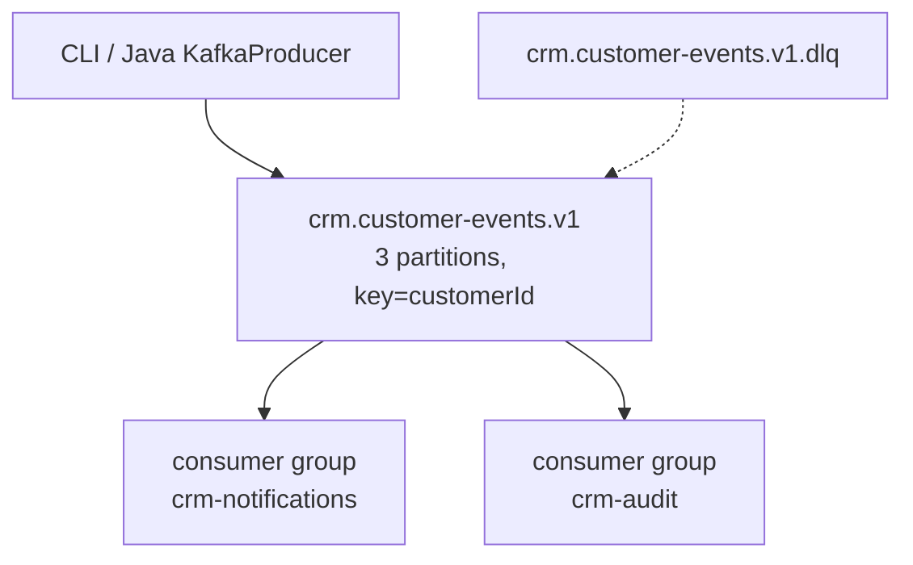
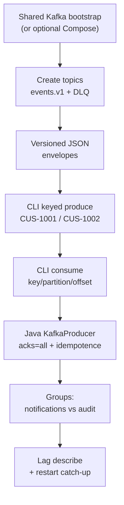

# Lab 30: Event-Driven Architecture with Kafka — Northstar CRM Topics

**Module:** 30 — Event-Driven Architecture with Kafka  
**Lab folder:** `labs/Week 4 - Kafka, React, PostgreSQL and Resilience/module-30/lab30/`  
**Difficulty:** Intermediate  
**Duration:** ~45 minutes (timed path with starter) · Full path: 4–5 Hours

**Primary IDE:** IntelliJ IDEA Community Edition · **Optional IDE:** VS Code

| OS | How-to for this lab |
| -- | ------------------- |
| Windows | [LAB-30-WINDOWS.md](LAB-30-WINDOWS.md) |
| macOS | [LAB-30-MACOS.md](LAB-30-MACOS.md) |

> **Environment reminder:** Finish [Lab 0](../../../Week%201%20-%20Java%20and%20JVM%20Foundations/module-00/lab0/LAB-0-GUIDE.md). Use **IntelliJ IDEA Community** (primary; optional VS Code) on your laptop with **JDK 21**, **Maven 3.9+**, and instructor **shared Kafka** bootstrap servers. Work under `~/java-bootcamp` (Windows: `%USERPROFILE%\java-bootcamp`).

---

## 45-minute timed path (use starter)

In class, use the starter templates so the **core** objectives fit **~45 minutes**. The full Steps below remain for homework / extended depth.

1. Open [`starter/README.md`](starter/README.md).
2. Copy `starter/` into your `java-bootcamp/examples/…` target (see starter README).
3. Fill every `// TODO` / `TODO` — do **not** wait on a perfect prior lab; the starter includes a baseline.
4. Run the starter smoke test; evidence under `notes/screenshots/lab-30/`.
5. Mark timed-path Pass criteria in the starter README. Continue remaining GUIDE steps as homework if needed.

| Path | Time | Scope |
| ---- | ---- | ----- |
| **Timed (default)** | ~45 min | Starter TODOs + smoke test |
| **Full (extended)** | see Duration | Every Step in this GUIDE |

---

## How to follow this lab

1. **In class (timed path):** prefer [`starter/README.md`](starter/README.md) — copy starter → `java-bootcamp/examples/lab30-crm`, fill TODOs, run smoke test (~45 min).
2. Open the **Windows** or **macOS** how-to (links above) in a second tab for OS-specific commands.
3. Create/work only under your `java-bootcamp/examples/…` folder from the steps (not inside this `labs/` git clone unless a step says otherwise).
4. For each **Step N** (full path / homework): read **Why** (if present) → do the actions → confirm **Expected** / **Expected result** → then continue.
5. When stuck, use **Failure Experiments** / troubleshooting in this guide before asking for help.
6. Capture evidence under `notes/screenshots/lab-30/` (workspace root under `java-bootcamp`; redact secrets). Use the **Pass criteria** tables — write **Pass** or **Fail** in your notes. GitHub file view does not support clickable checkboxes.

## What you'll submit (read this first)

Keep this checklist visible while you work. Full detail is under [Expected Deliverables](#expected-deliverables) at the end.

| # | Deliverable |
| - | ----------- |
| 1 | `compose.yaml` KRaft broker definition |
| 2 | Topics created (events + DLQ) with describe evidence |
| 3 | Versioned event JSON samples (Amina/Ravi) |
| 4 | CLI produce/consume evidence with keys/partitions/offsets |
| 5 | Java producer with acks=all + idempotence |
| 6 | Competing vs independent group evidence + lag describe |
| 7 | `docs/kafka-notes.md` runbook + production checklist |
| 8 | No secrets or generated junk committed |


## Lab Overview

This Module 30 lab introduces **event-driven architecture** for the **Customer Management Platform** using a local **Kafka KRaft** broker: versioned topics, partitions, keyed CRM events, producers, consumers, offsets, consumer groups, lag, and a DLQ topic for Lab 31 recovery practice.

**Purpose.** After HTTP APIs (Labs 25–29), Northstar needs asynchronous fan-out for notifications and audit without coupling every consumer to the Customer service JVM. Leadership freezes topic names and keying strategy before Spring Kafka wiring (Lab 31).

**What you build (exercise).** Create `lab30-crm` with Compose KRaft broker; create `crm.customer-events.v1` (3 partitions) and `crm.customer-events.v1.dlq`; write versioned `CustomerCreated` / `CustomerStatusChanged` envelopes for Amina/Ravi; publish and consume keyed records via CLI; write a Java `KafkaProducer` with acks=all / idempotence; compare competing vs independent consumer groups; inspect lag and restart recovery; document replay/idempotency notes.

**What success looks like.** Under `~/java-bootcamp/examples/lab30-crm/` the broker is up, both topics exist, keyed events for `CUS-1001`/`CUS-1002` round-trip with visible partitions/offsets, group `crm-notifications` shares partitions while `crm-audit` gets all records, and lag returns to 0 after catch-up.

**Depends on Lab 0 + Docker.** Familiarity with CRM fixtures from Labs 25–29 helps. Lab 31 will wrap these topics with Spring Kafka.

**CRM connection.** Fixtures `CUS-1001` Amina / `CUS-1002` Ravi / correlation `lab-request-001` (also `lab30-001` in sample JSON is fine if documented). Event keys **must** be customer IDs.

---

## Learning Objectives

After completing this lab, you will be able to:

* Create a local single-node Kafka broker with Docker Compose (KRaft)
* Create partitioned CRM event and dead-letter topics explicitly
* Design versioned `CustomerCreated` and `CustomerStatusChanged` event envelopes
* Publish customer-keyed records from Kafka CLI and Java
* Consume records while displaying keys, partitions, offsets, and timestamps
* Configure consumer groups and compare competing versus independent consumers
* Inspect committed offsets and consumer lag
* Explain ordering-per-key, at-least-once delivery, idempotency, and replay
* Document why Lab 31 needs the same topic names and keying rules

---

## Business Scenario

The CRM stores customer identity, contact details, lifecycle status, and financial accounts. Its React client talks to Spring Boot; Spring persists and (soon) emits Kafka events for notification and audit consumers. This lab builds the **broker and topic foundation** without requiring PostgreSQL or Resilience4j yet.

Leadership freezes:

**Customer lifecycle facts are published as versioned events on `crm.customer-events.v1`, keyed by `customerId`, with a sibling DLQ topic for poison messages.**

Use these examples consistently:

| ID | Name | Notes |
| -- | ---- | ----- |
| `CUS-1001` | Amina Khan | `ACTIVE` — `CustomerCreated` (+ optional status change) |
| `CUS-1002` | Ravi Singh | `PROSPECT` — second partition key |
| `lab-request-001` | — | correlation in event envelope / headers |
| `crm.customer-events.v1` | — | primary topic (3 partitions) |
| `crm.customer-events.v1.dlq` | — | dead-letter topic (1 partition) |
| `crm-notifications` / `crm-audit` | — | competing vs independent groups |

**Security note for evidence.** Use fictional PII only. Do not put secrets in event payloads. Prefer PLAINTEXT only on the lab Docker network — document that production needs TLS/SASL.

---

## Architecture Context

### NOW (this lab)



### Lab flow (mermaid)



### Architecture NOW vs LATER

| Aspect | Lab 30 (NOW) | Lab 31 / production |
| ------ | ------------ | ------------------- |
| Client | CLI + plain Java producer | Spring `KafkaTemplate` / `@KafkaListener` |
| Broker | Single-node KRaft Docker | Cluster, RF≥3, TLS/SASL |
| Failure | DLQ topic exists | Retry classification + DLT recoverer |
| Schema | Hand-written JSON samples | Schema Registry / stricter contracts |

**Lab focus:** Kafka topics, partitions, keyed CRM events, producers, consumers, offsets, and consumer groups.

---

## Prerequisites

Complete [SETUP](../../../SETUP-INSTRUCTIONS.md) and [Lab 0](../../../Week%201%20-%20Java%20and%20JVM%20Foundations/module-00/lab0/LAB-0-GUIDE.md). Confirm:

* JDK 21; Maven; Git
* **Docker** + Compose for local Kafka
* Free local port 9092
* Disk space for broker image/volumes
* No secrets committed to Git

### Pre-flight

```bash
java -version
mvn -version
docker --version
docker compose version
git --version
pwd
ls ~/java-bootcamp/examples
```

Fix Docker/daemon failures before creating topics. Record versions in evidence if asked.

---

## Suggested Project Files

```text
~/java-bootcamp/examples/lab30-crm/
├── src/
│   └── main/java/com/northstar/crm/event/
│       └── CustomerEventProducer.java
├── events/
│   ├── customer-created-amina.json
│   ├── customer-created-ravi.json
│   └── customer-status-changed-amina.json
├── docs/
│   └── kafka-notes.md
├── notes/screenshots/
├── compose.yaml
├── .env.example
├── .gitignore
├── pom.xml
└── README.md
```

Ignore `target/`, Docker volume junk if policy forbids it, IDE metadata, tokens, and passwords.

---

## Concepts to Discuss

Write 2–3 sentences each in `docs/kafka-notes.md`:

1. Main produce → broker → consume flow for a customer event
2. Trust boundary: who may publish; why payloads stay free of secrets
3. Success/failure contracts: ack, offset commit, DLQ purpose
4. Stable identity: key=`customerId` for ordering of one customer’s events
5. Retry and idempotency under at-least-once delivery
6. Local KRaft PLAINTEXT vs production cluster security/RF
7. Evidence operators need (lag, partition assignment, correlation ID)
8. Two consumer instances in one group vs two groups
9. Why topics are created explicitly (no silent auto-create in prod habits)
10. What Lab 31 changes (Spring APIs) without renaming topics/fixtures

---

## Implementation Steps

Complete each step in order. Commands assume `~/java-bootcamp/examples/lab30-crm` (Windows: `%USERPROFILE%\java-bootcamp\examples\lab30-crm`) unless noted.

---

### Step 1 — Scaffold lab30-crm and start Kafka in KRaft mode

**Why:** A reproducible broker is the shared dependency for every later Kafka lab.

**Do this:**

```bash
mkdir -p ~/java-bootcamp/examples/lab30-crm/events ~/java-bootcamp/examples/lab30-crm/docs ~/java-bootcamp/notes/screenshots/lab-30
cd ~/java-bootcamp/examples/lab30-crm
```

If your instructor allows a **local** broker for practice, create `compose.yaml`. Otherwise skip Compose and use the shared bootstrap servers from the connection sheet:

Optional `compose.yaml` (local practice only):

```yaml
services:
  kafka:
    image: apache/kafka:3.9.1
    container_name: crm-kafka
    ports: ["9092:9092"]
    environment:
      KAFKA_NODE_ID: 1
      KAFKA_PROCESS_ROLES: broker,controller
      KAFKA_LISTENERS: PLAINTEXT://:9092,CONTROLLER://:9093
      KAFKA_ADVERTISED_LISTENERS: PLAINTEXT://localhost:9092
      KAFKA_CONTROLLER_LISTENER_NAMES: CONTROLLER
      KAFKA_CONTROLLER_QUORUM_VOTERS: 1@kafka:9093
      KAFKA_OFFSETS_TOPIC_REPLICATION_FACTOR: 1
```

```bash
docker compose up -d
docker compose ps
```

**Expected result:** Container `crm-kafka` Up; `0.0.0.0:9092->9092/tcp`.

**If it fails:** Port in use → stop conflicting broker or change host port (and document). Image pull blocked → check Docker network/proxy on your laptop.

---

### Step 2 — Create CRM topics (events + DLQ)

**Why:** Explicit create prevents a spelling mistake from silently inventing a new production stream.

**Do this:**

```bash
docker exec crm-kafka /opt/kafka/bin/kafka-topics.sh \
  --bootstrap-server localhost:9092 --create \
  --topic crm.customer-events.v1 --partitions 3 --replication-factor 1

docker exec crm-kafka /opt/kafka/bin/kafka-topics.sh \
  --bootstrap-server localhost:9092 --create \
  --topic crm.customer-events.v1.dlq --partitions 1 --replication-factor 1

docker exec crm-kafka /opt/kafka/bin/kafka-topics.sh \
  --bootstrap-server localhost:9092 --describe \
  --topic crm.customer-events.v1
```

**Expected result:** Both topics created; primary topic `PartitionCount: 3`, RF 1.

**If it fails:** Broker not ready → wait and retry. Topic exists → `--if-not-exists` or describe only; do not create divergent names.

---

### Step 3 — Write versioned CRM event envelopes

**Why:** Event names describe facts that already happened; versions protect consumers.

**Do this:** Create JSON files under `events/`:

```json
{
  "eventId": "e4b5f53d-7f18-4cf4-81ce-7cab6ec98491",
  "eventType": "CustomerCreated",
  "eventVersion": 1,
  "occurredAt": "2026-07-13T06:00:00Z",
  "customerId": "CUS-1001",
  "correlationId": "lab-request-001",
  "source": "customer-service",
  "data": { "fullName": "Amina Khan", "status": "ACTIVE" }
}
```

Add a Ravi `CustomerCreated` (`CUS-1002`, `PROSPECT`) and an Amina `CustomerStatusChanged` sample. Prefer ISO-8601 UTC.

**Expected result:** JSON parses; `eventVersion=1`; fixtures and correlation present.

**If it fails:** Invalid JSON → fix quotes/commas. Missing `customerId` → reject the envelope before publishing.

---

### Step 4 — Publish keyed events with the console producer

**Why:** Keys control partition affinity; same customer’s events stay ordered within a partition.

**Do this:** Open a producer that parses text before the first colon as the key. Send ≥2 events for `CUS-1001` and ≥1 for `CUS-1002`.

```bash
docker exec -it crm-kafka /opt/kafka/bin/kafka-console-producer.sh \
  --bootstrap-server localhost:9092 --topic crm.customer-events.v1 \
  --property parse.key=true --property key.separator=:
```

Example lines:

```text
CUS-1001:{"eventType":"CustomerCreated","eventVersion":1,"customerId":"CUS-1001","correlationId":"lab-request-001","data":{"fullName":"Amina Khan","status":"ACTIVE"}}
CUS-1001:{"eventType":"CustomerStatusChanged","eventVersion":1,"customerId":"CUS-1001","correlationId":"lab-request-001","data":{"status":"ACTIVE"}}
CUS-1002:{"eventType":"CustomerCreated","eventVersion":1,"customerId":"CUS-1002","correlationId":"lab-request-001","data":{"fullName":"Ravi Singh","status":"PROSPECT"}}
```

**Expected result:** No serialization/timeout errors; records accepted.

**If it fails:** Forgot `parse.key` → key null; partition distribution random per record. Wrong topic name → fix before Lab 31.

---

### Step 5 — Consume keys, partitions, offsets, timestamps

**Why:** Operators reason about ordering with metadata, not only payload text.

**Do this:**

```bash
docker exec crm-kafka /opt/kafka/bin/kafka-console-consumer.sh \
  --bootstrap-server localhost:9092 --topic crm.customer-events.v1 \
  --from-beginning --property print.key=true \
  --property print.partition=true --property print.offset=true \
  --property print.timestamp=true --max-messages 3
```

Capture output showing `CUS-1001` events sharing a partition with increasing offsets, and `CUS-1002` on its partition.

**Expected result:** Key/partition/offset/timestamp printed; Amina events ordered on the same partition.

**If it fails:** Empty output → wrong topic or nothing published. Different partitions for same key → key parsing failed in Step 4.

---

### Step 6 — Create a Java producer (acks=all, idempotent)

**Why:** CLI proves the broker; Java proves the course toolchain for Lab 31 migration.

**Do this:** Add Kafka clients via Maven. Implement `CustomerEventProducer`:

```java
props.put(ProducerConfig.BOOTSTRAP_SERVERS_CONFIG, "localhost:9092");
props.put(ProducerConfig.ACKS_CONFIG, "all");
props.put(ProducerConfig.ENABLE_IDEMPOTENCE_CONFIG, true);
props.put(ProducerConfig.KEY_SERIALIZER_CLASS_CONFIG, StringSerializer.class.getName());
props.put(ProducerConfig.VALUE_SERIALIZER_CLASS_CONFIG, StringSerializer.class.getName());

try (var producer = new KafkaProducer<String, String>(props)) {
  var record = new ProducerRecord<>(TOPIC, customerId, json);
  var m = producer.send(record).get();
  System.out.printf("topic=%s partition=%d offset=%d%n",
      m.topic(), m.partition(), m.offset());
}
```

Publish at least one Amina event keyed by `CUS-1001`.

```bash
mvn -q -DskipTests package
# run your main / exec plugin as documented in project README
```

**Expected result:** Print `topic=crm.customer-events.v1 partition=… offset=…`; customer ID is the record key, not only a JSON field.

**If it fails:** Connection refused → Compose down or advertised listener wrong (`localhost:9092` for host processes). Blocking `.get()` hangs → broker unhealthy; check `docker compose logs`.

---

### Step 7 — Competing vs independent consumer groups

**Why:** Notifications scale by partitioning; audit needs a full independent stream.

**Do this:** Start two terminals with group `crm-notifications`; start a third with `crm-audit`. Publish six more records.

```bash
# terminals A and B (competing)
docker exec -it crm-kafka /opt/kafka/bin/kafka-console-consumer.sh \
  --bootstrap-server localhost:9092 \
  --topic crm.customer-events.v1 --group crm-notifications

# terminal C (independent)
docker exec -it crm-kafka /opt/kafka/bin/kafka-console-consumer.sh \
  --bootstrap-server localhost:9092 \
  --topic crm.customer-events.v1 --group crm-audit
```

**Expected result:** `crm-notifications` members split the three partitions (no duplicate assignment of the same partition to two members); `crm-audit` independently receives newly published records.

**If it fails:** Both “groups” use same group id by mistake → fix IDs. No messages → consumers started after publish without `--from-beginning` for old data; publish new records while listening.

---

### Step 8 — Inspect lag and replay readiness

**Why:** Lag is the operator’s signal that consumers fell behind; restart must catch up.

**Do this:** Stop one notifications consumer, publish records, describe the group, restart, describe again.

```bash
docker exec crm-kafka /opt/kafka/bin/kafka-consumer-groups.sh \
  --bootstrap-server localhost:9092 \
  --describe --group crm-notifications
```

Document that replay/`--from-beginning` is a learning tool; production replay needs a policy and idempotent consumers (Lab 31).

**Expected result:** Non-zero LAG while stopped; after restart LAG returns toward 0; table shows TOPIC / PARTITION / CURRENT-OFFSET / LOG-END-OFFSET / LAG.

**If it fails:** Empty describe → group never joined. Always-zero lag → consumer still running and catching up instantly; stop it longer.

---

### Step 9 — Document Kafka runbook for Lab 31 hand-off

**Why:** Lab 31 will fail mysteriously if topic names, keys, or Compose ports drift.

**Do this:** In `docs/kafka-notes.md`, freeze:

| Item | Lab value |
| ---- | --------- |
| Bootstrap (host) | `localhost:9092` |
| Primary topic | `crm.customer-events.v1` (3 partitions) |
| DLQ topic | `crm.customer-events.v1.dlq` (1 partition) |
| Record key | `customerId` (`CUS-1001`, `CUS-1002`) |
| Sample correlation | `lab-request-001` |
| Demo groups | `crm-notifications` (competing), `crm-audit` (independent) |

List the exact `docker compose up -d`, topic create, produce, consume, and lag describe commands a peer must run. Note PLAINTEXT and RF=1 are **lab-only**.

**Expected result:** Lab 31 student can reuse broker/topics without renaming.

**If it fails:** Notes use `customer-events` without `.v1` → fix to the frozen name before continuing.

---

### Step 10 — Failure experiments + evidence pack

**Why:** Wrong keys, wrong topics, and silent auto-create habits become production incidents.

**Do this:** Complete [Failure Experiments](#failure-experiments). Save `docker compose ps`, topic describe, consume metadata, and lag describe excerpts under `notes/screenshots/lab-30/`. Confirm sample JSON stays fictional PII only.

**Expected result:** ≥3 experiments; runbook listed; broker still healthy or cleaned up intentionally; evidence under `notes/screenshots/lab-30/`.

**If it fails:** See Troubleshooting.

---

## Ordering and delivery semantics (read before Lab 31)

Write a short paragraph in `docs/kafka-notes.md` covering:

1. **Per-key ordering:** Same `customerId` key → same partition → relative order preserved for that customer.
2. **No global order:** Events for `CUS-1001` and `CUS-1002` may interleave arbitrarily across partitions.
3. **At-least-once:** Consumers may see duplicates after rebalance/retry — Lab 31 must be idempotent on `eventId`.
4. **DLQ purpose:** Poison or repeatedly failing records move aside so the main group progress is not blocked (wired in Lab 31).

---

## Implementation Checkpoints

### Checkpoint A — Broker and topics

_Mark each row **Pass** or **Fail** in your lab notes (GitHub markdown files are not interactive checklists)._

| # | Confirm | Your notes |
| - | ------- | ---------- |
| 1 | `lab30-crm` under `~/java-bootcamp/examples/` | Pass / Fail |
| 2 | KRaft Kafka Up on 9092 | Pass / Fail |
| 3 | `crm.customer-events.v1` (3p) and `.dlq` (1p) exist | Pass / Fail |

### Checkpoint B — Envelopes and produce/consume

_Mark each row **Pass** or **Fail** in your lab notes (GitHub markdown files are not interactive checklists)._

| # | Confirm | Your notes |
| - | ------- | ---------- |
| 1 | Versioned JSON for Amina/Ravi with `lab-request-001` | Pass / Fail |
| 2 | CLI keyed produce + consume with key/partition/offset | Pass / Fail |
| 3 | Same-key ordering visible for `CUS-1001` | Pass / Fail |

### Checkpoint C — Java producer and groups

_Mark each row **Pass** or **Fail** in your lab notes (GitHub markdown files are not interactive checklists)._

| # | Confirm | Your notes |
| - | ------- | ---------- |
| 1 | Java producer acks=all + idempotence | Pass / Fail |
| 2 | Competing `crm-notifications` vs independent `crm-audit` | Pass / Fail |
| 3 | Lag inspected; catch-up observed | Pass / Fail |

### Checkpoint D — Hygiene and notes

_Mark each row **Pass** or **Fail** in your lab notes (GitHub markdown files are not interactive checklists)._

| # | Confirm | Your notes |
| - | ------- | ---------- |
| 1 | DLQ topic created for Lab 31 | Pass / Fail |
| 2 | Local vs production notes (TLS/RF/auto-create) | Pass / Fail |
| 3 | No secrets / PII dumps / needless volumes committed | Pass / Fail |

---

## Reference Commands, Configuration, and Code

### compose.yaml (excerpt)

```yaml
services:
  kafka:
    image: apache/kafka:3.9.1
    ports: ["9092:9092"]
    environment:
      KAFKA_NODE_ID: 1
      KAFKA_PROCESS_ROLES: broker,controller
      KAFKA_LISTENERS: PLAINTEXT://:9092,CONTROLLER://:9093
      KAFKA_ADVERTISED_LISTENERS: PLAINTEXT://localhost:9092
      KAFKA_CONTROLLER_LISTENER_NAMES: CONTROLLER
      KAFKA_CONTROLLER_QUORUM_VOTERS: 1@kafka:9093
      KAFKA_OFFSETS_TOPIC_REPLICATION_FACTOR: 1
```

### Event envelope (excerpt)

```json
{
  "eventId": "99f4b885-2f62-44f7-a252-b32d673864b2",
  "eventType": "CustomerCreated",
  "eventVersion": 1,
  "occurredAt": "2026-07-13T05:30:00Z",
  "customerId": "CUS-1001",
  "correlationId": "lab-request-001",
  "source": "customer-service",
  "data": { "fullName": "Amina Khan", "status": "ACTIVE" }
}
```

### Commands

```bash
cd ~/java-bootcamp/examples/lab30-crm
docker compose up -d
docker exec crm-kafka /opt/kafka/bin/kafka-topics.sh \
  --bootstrap-server localhost:9092 --create \
  --topic crm.customer-events.v1 --partitions 3 --replication-factor 1
docker exec crm-kafka /opt/kafka/bin/kafka-topics.sh \
  --bootstrap-server localhost:9092 --create \
  --topic crm.customer-events.v1.dlq --partitions 1 --replication-factor 1
docker exec crm-kafka /opt/kafka/bin/kafka-consumer-groups.sh \
  --bootstrap-server localhost:9092 --describe --group crm-notifications
docker compose ps
git status
```

### Class / artifact map

| Artifact | Role |
| -------- | ---- |
| `compose.yaml` | KRaft broker |
| `events/*.json` | Versioned CRM envelopes |
| `CustomerEventProducer` | Java keyed publish |
| `crm.customer-events.v1` | Primary topic |
| `crm.customer-events.v1.dlq` | DLQ for Lab 31 |
| `kafka-notes.md` | Ordering, lag, prod checklist |

### Sample produce lines (copy/paste)

```text
CUS-1001:{"eventId":"e4b5f53d-7f18-4cf4-81ce-7cab6ec98491","eventType":"CustomerCreated","eventVersion":1,"customerId":"CUS-1001","correlationId":"lab-request-001","data":{"fullName":"Amina Khan","status":"ACTIVE"}}
CUS-1002:{"eventId":"a1c2e3f4-1111-2222-3333-444455556666","eventType":"CustomerCreated","eventVersion":1,"customerId":"CUS-1002","correlationId":"lab-request-001","data":{"fullName":"Ravi Singh","status":"PROSPECT"}}
```

Prefer full envelopes from `events/` when demonstrating version fields to Lab 31 students.

Keep `eventVersion: 1` until a formal v2 consumer migration is designed.
Do not invent parallel topic names for the same stream.

---

## Manual Verification

1. `docker compose ps` shows Kafka healthy/up.
2. Topics `crm.customer-events.v1` and `.dlq` exist with expected partitions.
3. Console produce/consume shows keys `CUS-1001` / `CUS-1002`.
4. Amina events share a partition with increasing offsets.
5. Java producer prints partition and offset.
6. Competing group splits partitions; audit group is independent.
7. Lag rises when consumer stopped, falls after restart.
8. Correlation IDs present in sample envelopes.
9. Runbook commands listed for a peer.
10. No secrets committed; PLAINTEXT called out as lab-only.

---

## Failure Experiments

| # | Experiment | Observe | Restore |
| - | ---------- | ------- | ------- |
| 1 | Stop Kafka (`docker compose stop`) then produce | Timeout / connection errors | `docker compose start` |
| 2 | Publish with wrong key or null key | Partition random; ordering broken | Use `customerId` as key |
| 3 | Replay with `--from-beginning` | Duplicates delivered | Document idempotency need for Lab 31 |
| 4 | Stop consumer, publish, describe lag | LAG > 0 | Restart consumer; LAG→0 |
| 5 | Typo topic name on produce | Event not on primary topic | Produce to correct frozen name |

---

## Troubleshooting

| Symptom | Likely cause | Fix |
| ------- | ------------ | --- |
| Cannot connect from host | Advertised listener / port | Use `localhost:9092`; check `compose ps` |
| Cannot connect from another container | Wrong hostname | Use Compose service name `kafka:9092` |
| Empty consume | Wrong topic / no data / already read | `--from-beginning` or publish new |
| Rebalance storms | Start/stop consumers rapidly | Stabilize membership; wait |
| Topic missing | Create step skipped | Create explicitly; avoid silent auto-create habit |
| Java producer hangs | Broker down / wrong bootstrap | Logs + `docker compose logs kafka` |

---

## Security and Production Review

Answer in README / `docs/kafka-notes.md`:

1. Which event inputs are untrusted (payload fields, keys)?
2. Where will authn/authz for publish/consume be enforced in production?
3. Which values are sensitive — never in event `data`?
4. What can be retried safely (consumer redelivery)?
5. What happens after partial failure (produced but consumer crashed mid-handle)?
6. What would an operator monitor (lag, ISR, failed produce rate)?
7. Which local default is unacceptable (PLAINTEXT, RF=1, auto-create)?
8. How are event contracts versioned (`eventVersion`, topic `.v1`)?

---

## Cleanup

```bash
cd ~/java-bootcamp/examples/lab30-crm
# Capture evidence first
docker compose down
# Use `docker compose down -v` only to intentionally delete lab data
git status
```

**Keep `lab30-crm` (and preferably the same topic names)**—Lab 31 Spring Kafka expects `crm.customer-events.v1` and DLQ/DLT conventions.

---

## Expected Deliverables

Same checklist as [What you'll submit](#what-youll-submit-read-this-first) above.

* `compose.yaml` KRaft broker definition
* Topics created (events + DLQ) with describe evidence
* Versioned event JSON samples (Amina/Ravi)
* CLI produce/consume evidence with keys/partitions/offsets
* Java producer with acks=all + idempotence
* Competing vs independent group evidence + lag describe
* `docs/kafka-notes.md` runbook + production checklist
* No secrets or generated junk committed

---

## Evaluation Rubric (100 Marks)

| Criteria | Marks |
| -------- | ----: |
| Environment and project structure | 10 |
| Core implementation (topics, keyed events, groups) | 30 |
| Integration/configuration correctness (Compose/KRaft) | 15 |
| Failure handling (lag, reconnect, bad key lessons) | 15 |
| Automated/scripted verification (Java produce + commands) | 10 |
| Security and production awareness | 10 |
| Documentation and evidence | 10 |

**Notes:** Random keys that break per-customer ordering → incomplete. Inventing topic names that Lab 31 cannot reuse → continuity failure.

---

## Reflection Questions

Write 3–6 sentence answers:

1. Which design decision most affected correctness (keying by customerId)?
2. Which failure was hardest to diagnose (lag, rebalance, advertised listeners)?
3. What evidence proves produce/consume works end-to-end?
4. What breaks first at ten times the event rate?
5. Which concern should move to shared infrastructure (managed Kafka, ACLs)?
6. What must change before real customer data is used in payloads?
7. How does this lab connect to Labs 25–29 and Lab 31?
8. What metric matters most on the ops dashboard for consumers?
9. (Forward look) Why does Lab 31 still need idempotent handlers?

---

## Bonus Challenges

1. Structured correlation + customer IDs without sensitive fields.
2. Small script that creates topics idempotently.
3. Document readiness vs liveness for the broker in Compose.
4. Note produce success/fail metrics you would add in Spring.
5. Document rollback if the wrong topic name ships.
6. Experiment: same key always hashes to same partition — record partition IDs.

---

## Success Criteria

You are finished when:

* You can demonstrate topics, partitions, keyed CRM events, produce/consume, offsets, and groups
* Happy path and at least one failure path (lag or broker down) are repeatable
* Another student can follow your run instructions
* Java producer builds and publishes
* No production secret is hard-coded
* You can explain local KRaft vs production trade-offs

---

## Instructor Notes

* **Live probe:** Ask the student to show two `CUS-1001` events on the same partition with increasing offsets, then explain what would happen if the key were missing.
* **Assess:** Explicit topic create; keying; competing vs independent groups; lag literacy; DLQ topic present for Lab 31.
* **Continuity:** Prefer `examples/lab30-crm`. Freeze topic names. Fixtures Amina/Ravi/`lab-request-001`.
* **Common pitfalls:** Advertised listeners; forgetting key parse; using one group for “audit”; RF>1 on single node; auto-create left enabled mentally for prod.
* **Timing:** Timed path ~45 minutes with starter; full path remains 4–5 hours. Docker pull + first consume metadata often burn 30–45 minutes on restricted networks.

---

*End of Lab 30 — Event-Driven Architecture with Kafka: Northstar CRM Topics. Keep `lab30-crm` and topic names for Lab 31.*
