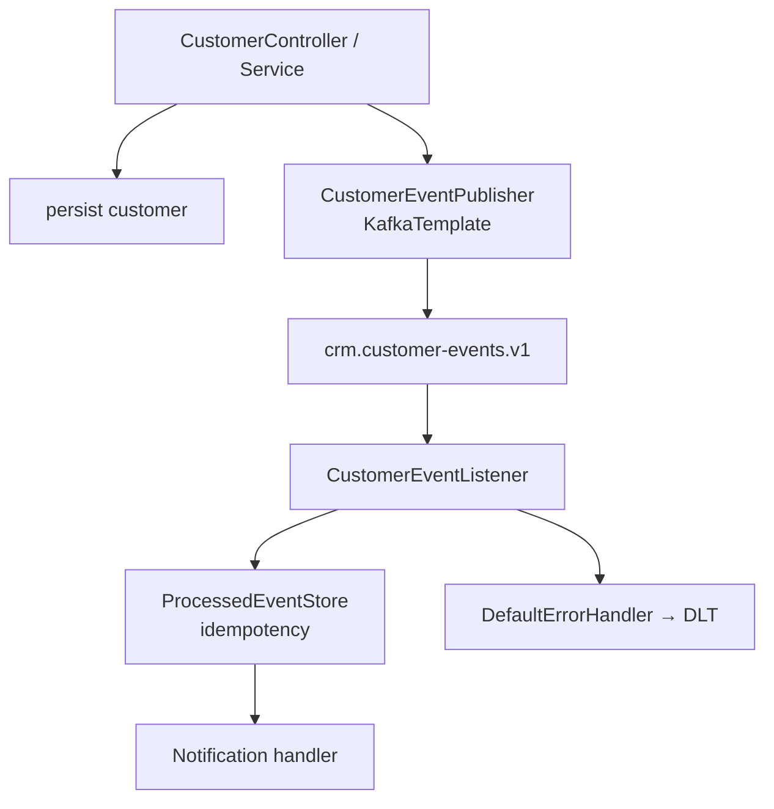
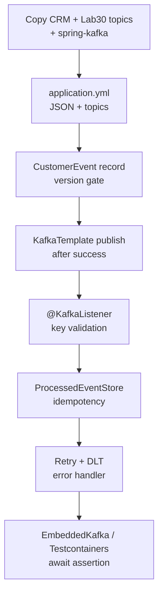

# Lab 31: Spring Boot Integration with Kafka — Northstar CRM Listeners

**Module:** 31 — Spring Boot Integration with Kafka  
**Lab folder:** `labs/Week 4 - Kafka, React, PostgreSQL and Resilience/module-31/lab31/`  
**Difficulty:** Intermediate  
**Duration:** 4–5 Hours

**Primary IDE:** IntelliJ IDEA Community Edition · **Optional IDE:** VS Code

| OS | How-to for this lab |
| -- | ------------------- |
| Windows | [LAB-31-WINDOWS.md](LAB-31-WINDOWS.md) |
| macOS | [LAB-31-MACOS.md](LAB-31-MACOS.md) |

> **Environment reminder:** Finish [Lab 0](../../../Week%201%20-%20Java%20and%20JVM%20Foundations/module-00/lab0/LAB-0-GUIDE.md). Use **IntelliJ IDEA Community** (primary; optional VS Code) on your laptop with **JDK 21**, **Maven 3.9+**, and instructor **shared Kafka** bootstrap servers. Work under `~/java-bootcamp` (Windows: `%USERPROFILE%\java-bootcamp`).

---

## How to follow this lab

1. Open the **Windows** or **macOS** how-to (links above) in a second tab.
2. Create/work only under your `java-bootcamp/examples/…` folder from the steps (not inside this `labs/` git clone unless a step says otherwise).
3. For each **Step N**: read **Why** (if present) → do the actions → confirm **Expected** / **Expected result** → then continue.
4. When stuck, use **Failure Experiments** / troubleshooting in this guide before asking for help.
5. Capture evidence under `notes/screenshots/` (redact secrets). Use the **Pass criteria** tables — write **Pass** or **Fail** in your notes. GitHub file view does not support clickable checkboxes.

## Lab Overview

This Module 31 lab integrates **Spring Kafka** into the **Customer Management Platform**: `KafkaTemplate` publish after customer operations, typed `@KafkaListener` consumers, JSON configuration, **idempotent** processing, retry classification, and **dead-letter (DLT)** recovery — verified with Embedded Kafka or Testcontainers.

**Purpose.** Lab 30 proved the broker. Leadership now requires the CRM service itself to emit and consume versioned customer events without losing notifications on poison messages or double-processing replays.

**What you build (exercise).** Copy to `lab31-crm`; add `spring-kafka` (+ test); externalize bootstrap/topic names and trusted packages; define immutable `CustomerEvent`; publish with `KafkaTemplate` keyed by `customerId`; write `@KafkaListener` validating key↔payload; add `ProcessedEventStore` idempotency; configure `DefaultErrorHandler` + `DeadLetterPublishingRecoverer` with non-retryable contract errors; write an integration test that awaits a handled event.

**What success looks like.** Under `~/java-bootcamp/examples/lab31-crm/` creating/updating Amina publishes to `crm.customer-events.v1`, the listener handles once, replays are ignored, poison messages land on DLT after bounded retries, and `mvn test` is green twice.

**Depends on Lab 30 (+ CRM API).** Need broker/topics and preferred REST create path. Lab 32 adds Resilience4j for outbound HTTP — keep Kafka concerns separate.

**CRM connection.** Fixtures `CUS-1001` Amina / `CUS-1002` Ravi / correlation `lab-request-001`. Topic `crm.customer-events.v1`; DLT naming per Spring defaults or Lab 30 `.dlq` — document which you use.

---

## Learning Objectives

After completing this lab, you will be able to:

* Add Spring Kafka dependencies to the CRM service
* Configure JSON producers and consumers with externalized topic names
* Publish typed customer events with `KafkaTemplate`
* Write `@KafkaListener` handlers for CRM events
* Validate message keys, event versions, and required metadata
* Configure bounded retries and dead-letter publishing
* Write idempotent event-processing logic
* Test Kafka flows with Embedded Kafka or Testcontainers
* Explain at-least-once delivery vs exactly-once *business* effects via idempotency

---

## Business Scenario

When an agent creates Amina (`CUS-1001`) or activates Ravi (`CUS-1002`), notification and audit processes must learn asynchronously. Duplicate delivery (rebalance, retry, replay) must not send duplicate SMS/email side effects. Invalid contracts must not infinite-retry.

Leadership freezes:

**Publish keyed `CustomerEvent` v1 after successful customer writes; consume idempotently; recover poison messages to DLT after bounded retry.**

Use these examples consistently:

| ID | Name | Notes |
| -- | ---- | ----- |
| `CUS-1001` | Amina Khan | `ACTIVE` — primary publish/consume fixture |
| `CUS-1002` | Ravi Singh | `PROSPECT` — second key |
| `lab-request-001` | — | `correlationId` on events and logs |
| `crm.customer-events.v1` | — | primary topic (from Lab 30) |
| DLT / `.dlq` | — | dead-letter destination after retries |
| `crm-notifications` | — | default consumer group |

**Security note for evidence.** Restrict JSON trusted packages. Never log full PII payloads. No secrets in event bodies.

---

## Architecture Context

### NOW (this lab)



### Lab flow (mermaid)



### Architecture NOW vs LATER

| Aspect | Lab 31 (NOW) | Production / Lab 32 |
| ------ | ------------ | ------------------- |
| Broker | Lab 30 Docker or EmbeddedKafka tests | Managed cluster |
| Idempotency | In-memory set OK for lab | DB unique key / outbox |
| DLT | Spring DLT recoverer | Ops playbooks + alerting |
| Outbound HTTP | Not this lab | Resilience4j (Lab 32) |

**Lab focus:** Spring Kafka templates, typed listeners, JSON configuration, retry classification, and dead-letter recovery.

---

## Prerequisites

Complete [SETUP](../../../SETUP-INSTRUCTIONS.md), [Lab 0](../../../Week%201%20-%20Java%20and%20JVM%20Foundations/module-00/lab0/LAB-0-GUIDE.md), and [Lab 30](../../module-30/lab30/LAB-30-GUIDE.md). Prefer Labs [28](../../../Week%203%20-%20Spring%20Framework%20and%20Enterprise%20Patterns/module-28/lab28/LAB-28-GUIDE.md)–[29](../../../Week%203%20-%20Spring%20Framework%20and%20Enterprise%20Patterns/module-29/lab29/LAB-29-GUIDE.md) CRM API. Confirm:

* JDK 21; Maven; Spring Boot 3
* Docker + Kafka from Lab 30 (for manual demos)
* No secrets committed to Git

### Pre-flight

```bash
java -version
mvn -version
docker --version
docker compose version
pwd
ls ~/java-bootcamp/examples
# optional: docker compose -f ../lab30-crm/compose.yaml ps
```

---

## Suggested Project Files

```text
~/java-bootcamp/examples/lab31-crm/
├── src/
│   ├── main/
│   │   ├── java/com/northstar/crm/
│   │   │   ├── CrmApplication.java
│   │   │   ├── config/
│   │   │   │   └── KafkaErrorConfig.java
│   │   │   ├── event/
│   │   │   │   ├── CustomerEvent.java
│   │   │   │   ├── CustomerData.java
│   │   │   │   ├── CustomerEventPublisher.java
│   │   │   │   ├── CustomerEventListener.java
│   │   │   │   ├── ProcessedEventStore.java
│   │   │   │   └── NotificationHandler.java
│   │   │   ├── exception/
│   │   │   │   ├── InvalidCustomerEventException.java
│   │   │   │   └── UnsupportedEventVersionException.java
│   │   │   └── ... (controller/service from prior labs)
│   │   └── resources/
│   │       └── application.yml
│   └── test/
│       └── java/com/northstar/crm/event/
│           └── CustomerEventIntegrationTest.java
├── docs/
│   └── spring-kafka-notes.md
├── notes/screenshots/
├── compose.yaml          (optional copy from Lab 30)
├── .env.example
├── .gitignore
├── pom.xml
└── README.md
```

Ignore `target/`, IDE metadata, tokens, and passwords.

---

## Concepts to Discuss

Write 2–3 sentences each in `docs/spring-kafka-notes.md`:

1. Main flow: HTTP success → publish → listen → notify
2. Trust boundary: key/payload validation before side effects
3. Success/failure: publish callback vs DLT recoverer
4. Stable identity: `eventId` for idempotency; `customerId` for keying
5. Retry vs non-retryable exceptions
6. Local EmbeddedKafka vs Docker broker vs production cluster
7. Evidence: partition/offset logs, DLT headers, correlation ID
8. Two app instances: shared consumer group competition
9. Why trusted packages matter for JSON deserialization
10. What Lab 32 adds without changing Kafka contracts

---

## Implementation Steps

Complete each step in order. Commands assume `~/java-bootcamp/examples/lab31-crm` (Windows: `%USERPROFILE%\java-bootcamp\examples\lab31-crm`) unless noted.

---

### Step 1 — Branch CRM and add Spring Kafka

**Why:** Boot-managed dependency versions keep producer/consumer aligned.

**Do this:**

```bash
cd ~/java-bootcamp/examples
cp -r lab29-crm lab31-crm   # or lab28-crm / latest; bring Lab 30 compose if needed
cd lab31-crm
mkdir -p docs notes/screenshots
```

```xml
<dependency>
  <groupId>org.springframework.kafka</groupId>
  <artifactId>spring-kafka</artifactId>
</dependency>
<dependency>
  <groupId>org.springframework.kafka</groupId>
  <artifactId>spring-kafka-test</artifactId>
  <scope>test</scope>
</dependency>
```

```bash
mvn -q dependency:tree -Dincludes=org.springframework.kafka
```

**Expected result:** `spring-kafka` on compile classpath; test jar on test scope; `BUILD SUCCESS`.

**If it fails:** Version conflict → rely on Spring Boot parent BOM; do not hard-pin randomly.

---

### Step 2 — Configure JSON messaging and topic names

**Why:** Hard-coded topic strings and open deserialization are production incidents waiting to happen.

**Do this:** In `application.yml`:

```yaml
spring:
  kafka:
    bootstrap-servers: ${KAFKA_BOOTSTRAP_SERVERS:localhost:9092}
    consumer:
      group-id: crm-notifications
      auto-offset-reset: earliest
      enable-auto-commit: false
      properties:
        spring.json.trusted.packages: com.northstar.crm.event
    producer:
      properties:
        enable.idempotence: true
crm:
  kafka:
    customer-topic: crm.customer-events.v1
```

Configure `JsonSerializer` / `JsonDeserializer` (or Boot defaults) as taught in class.

**Expected result:** App starts against Lab 30 broker; partitions assigned to `crm.customer-events.v1-*` without unknown-host or deserialization warnings.

**If it fails:** Trusted packages typo → deserialization fails. Broker down → start Lab 30 Compose first for manual demos.

---

### Step 3 — Define the CustomerEvent contract

**Why:** Transport metadata stays outside business payload; version gates protect consumers.

**Do this:**

```java
public record CustomerEvent(
    UUID eventId, String eventType, int eventVersion,
    Instant occurredAt, String customerId, String correlationId,
    CustomerData data) {
  public CustomerEvent {
    Objects.requireNonNull(eventId);
    Objects.requireNonNull(customerId);
    if (eventVersion != 1) throw new UnsupportedEventVersionException();
  }
}
```

Reject missing `eventId` before publishing. Support types such as `CustomerCreated` and `CustomerStatusChanged`.

**Expected result:** Serializes with `eventVersion=1`; missing `eventId` rejected; version 2 throws.

**If it fails:** Mutable JavaBean without null checks → add validation before send. Record compact constructor not firing → check construction path.

---

### Step 4 — Publish with KafkaTemplate after successful writes

**Why:** Events must reflect facts that already happened in the CRM store (not speculative publishes).

**Do this:**

```java
return kafkaTemplate.send(topic, event.customerId(), event)
  .whenComplete((result, error) -> {
    if (error != null)
      log.error("customer_event_publish_failed id={}", event.eventId(), error);
    else
      log.info("customer_event_published id={} partition={} offset={}",
        event.eventId(),
        result.getRecordMetadata().partition(),
        result.getRecordMetadata().offset());
  });
```

Wire into create/status-change service methods for Amina/Ravi fixtures. Do not log private payload dumps.

```bash
# with broker up
mvn -q spring-boot:run
# create/update CUS-1001 via API (JWT if Lab 28 present)
```

**Expected result:** Log `customer_event_published …`; console consumer shows key `CUS-1001`; HTTP create remains 201.

**If it fails:** Publish before DB success → document ordering risk; prefer after commit (or transactional outbox as bonus). Template bean missing → check auto-config / bootstrap servers.

---

### Step 5 — Write a typed @KafkaListener

**Why:** Key and payload identity mismatches indicate producer bugs or hop-layer corruption.

**Do this:**

```java
@KafkaListener(topics = "${crm.kafka.customer-topic}")
void receive(CustomerEvent event,
    @Header(KafkaHeaders.RECEIVED_KEY) String key) {
  if (!key.equals(event.customerId()))
    throw new InvalidCustomerEventException("key mismatch");
  handler.handle(event);
}
```

Log `customer_event_received` with `eventId` + `customerId` + `correlationId` (`lab-request-001`).

**Expected result:** Listener processes Amina events; thread remains alive for later records; key mismatch throws (non-retryable later).

**If it fails:** Listener not invoked → group offset already at end; use new group or publish new events. Type mismatch → fix deserializer / trusted packages.

---

### Step 6 — Make processing idempotent

**Why:** At-least-once delivery will replay; business side effects must run once.

**Do this:**

```java
public boolean markIfNew(UUID eventId) {
  return processedIds.add(eventId); // lab: ConcurrentHashMap.newKeySet()
}

if (!store.markIfNew(event.eventId())) {
  log.info("duplicate_event_ignored id={}", event.eventId());
  return;
}
notificationService.notify(event);
```

Document that production must use a durable unique key (database) shared across instances.

**Expected result:** First delivery queues notification; replay logs `duplicate_event_ignored`; notification count remains 1.

**If it fails:** Mark after side effect → duplicates on crash; mark before. In-memory store resets on restart → expected for lab; note the limit.

---

### Step 7 — Configure retry and DLT

**Why:** Temporary failures deserve bounded retry; invalid contracts must not spin forever.

**Do this:** In `KafkaErrorConfig`:

```java
var recoverer = new DeadLetterPublishingRecoverer(template);
var handler = new DefaultErrorHandler(recoverer, new FixedBackOff(1000, 2));
handler.addNotRetryableExceptions(
    InvalidCustomerEventException.class,
    UnsupportedEventVersionException.class);
return handler;
```

Wire as Common Error Handler for the listener container factory. Align destination with Lab 30 `.dlq` **or** Spring’s `.DLT` suffix — **document the choice**.

Publish a poison message (key mismatch or bad version) and a transient-failure simulation if you have one.

**Expected result:** Backoff logs; dead-letter publication; DLT headers identify original topic, partition, offset, and exception.

**If it fails:** Everything goes to DLT immediately → backoff misconfigured or all exceptions marked non-retryable. DLT topic missing → create it (Lab 30) or allow auto-create only in lab with a note.

---

### Step 8 — Integration test the complete flow

**Why:** Sleeps are banned; await a specific handled `eventId`.

**Do this:** Use `@EmbeddedKafka` or Kafka Testcontainers:

```java
@Test
void publishesAndConsumesCustomerCreated() {
  publisher.publish(createdEvent); // CUS-1001 / lab-request-001
  await().atMost(Duration.ofSeconds(10)).untilAsserted(() ->
    assertThat(handler.events()).extracting(CustomerEvent::eventId)
      .contains(createdEvent.eventId()));
}
```

Add a second test for duplicate ignore and optionally one for DLT/non-retryable path.

```bash
mvn -q test
mvn -q test
```

**Expected result:** Integration tests PASSED; Failures 0; consecutive runs deterministic.

**If it fails:** Flaky await → increase bound slightly or fix listener wiring; do not add `Thread.sleep` without condition. Port conflicts with real broker → isolate EmbeddedKafka ports.

---

### Step 9 — Document Spring Kafka runbook + DLT naming

**Why:** Peers and Lab 32 combined demos need one place for broker, topics, and recoverer destination.

**Do this:** In `docs/spring-kafka-notes.md`, document:

```bash
# Broker (Lab 30)
docker compose -f ../lab30-crm/compose.yaml up -d   # or local compose copy

cd ~/java-bootcamp/examples/lab31-crm
mvn -q test
mvn -q spring-boot:run
# Create CUS-1001 / update CUS-1002 via API (JWT if Lab 28)
# Observe: customer_event_published / customer_event_received / duplicate_event_ignored
```

State explicitly whether dead letters use Spring’s `.DLT` suffix or Lab 30’s `crm.customer-events.v1.dlq`, and how headers identify original topic/partition/offset/exception.

**Expected result:** Peer reproduces publish/consume/idempotency/DLT from notes alone.

**If it fails:** DLT destination undocumented → Lab 30 `.dlq` consumers look “empty” while Spring writes elsewhere.

---

### Step 10 — Failure experiments + evidence pack

**Why:** DLT without headers and listeners without idempotency are incomplete.

**Do this:** Complete [Failure Experiments](#failure-experiments). Capture publish logs, duplicate ignore, and DLT evidence under `notes/screenshots/`. Run the integration suite twice.

**Expected result:** ≥3 experiments; green tests twice; documented DLT topic naming; no PII dumps in Git.

**If it fails:** See Troubleshooting.

---

## Publish timing note (DB vs Kafka)

Add to `docs/spring-kafka-notes.md`:

* **Publish-after-success (this lab):** Simple; risk is DB committed while Kafka publish fails — consumer never notified.
* **Transactional outbox (bonus/production):** Write event row in the same DB transaction; a relay publishes to Kafka — preferred for critical notifications.
* Do not pretend Lab 31 alone gives dual-write atomicity unless you implemented outbox/transactions end-to-end.

---

## Implementation Checkpoints

### Checkpoint A — Dependencies and config

_Mark each row **Pass** or **Fail** in your lab notes (GitHub markdown files are not interactive checklists)._

| # | Confirm | Your notes |
| - | ------- | ---------- |
| 1 | `lab31-crm` under `examples/` | Pass / Fail |
| 2 | `spring-kafka` (+ test) present | Pass / Fail |
| 3 | Bootstrap, group, trusted packages, topic property externalized | Pass / Fail |

### Checkpoint B — Publish and listen

_Mark each row **Pass** or **Fail** in your lab notes (GitHub markdown files are not interactive checklists)._

| # | Confirm | Your notes |
| - | ------- | ---------- |
| 1 | `CustomerEvent` v1 with null/version guards | Pass / Fail |
| 2 | `KafkaTemplate` publish keyed by `CUS-1001` / `CUS-1002` | Pass / Fail |
| 3 | `@KafkaListener` validates key ↔ `customerId` | Pass / Fail |

### Checkpoint C — Idempotency and DLT

_Mark each row **Pass** or **Fail** in your lab notes (GitHub markdown files are not interactive checklists)._

| # | Confirm | Your notes |
| - | ------- | ---------- |
| 1 | `ProcessedEventStore` ignores duplicate `eventId` | Pass / Fail |
| 2 | Retry backoff + non-retryable exceptions | Pass / Fail |
| 3 | Dead-letter publication observed | Pass / Fail |

### Checkpoint D — Tests and hygiene

_Mark each row **Pass** or **Fail** in your lab notes (GitHub markdown files are not interactive checklists)._

| # | Confirm | Your notes |
| - | ------- | ---------- |
| 1 | EmbeddedKafka/Testcontainers flow test green twice | Pass / Fail |
| 2 | Correlation IDs in logs/events; no PII dumps | Pass / Fail |
| 3 | Runbook + DLT naming documented | Pass / Fail |

---

## Reference Commands, Configuration, and Code

### application.yml (excerpt)

```yaml
spring:
  kafka:
    bootstrap-servers: ${KAFKA_BOOTSTRAP_SERVERS:localhost:9092}
    consumer:
      group-id: crm-notifications
      auto-offset-reset: earliest
      enable-auto-commit: false
      properties:
        spring.json.trusted.packages: com.northstar.crm.event
    producer:
      properties:
        enable.idempotence: true
crm.kafka.customer-topic: crm.customer-events.v1
```

### Publisher / listener (pattern)

```java
template.send("crm.customer-events.v1", event.customerId(), event);

@KafkaListener(topics = "${crm.kafka.customer-topic}")
void receive(CustomerEvent event,
 @Header(KafkaHeaders.RECEIVED_KEY) String key) {
  if (!key.equals(event.customerId())) throw new InvalidCustomerEventException("key mismatch");
  handler.handleOnce(event.eventId(), event);
}
```

### Error handler (pattern)

```java
var recoverer = new DeadLetterPublishingRecoverer(template);
var handler = new DefaultErrorHandler(recoverer, new FixedBackOff(1000, 2));
handler.addNotRetryableExceptions(InvalidCustomerEventException.class,
    UnsupportedEventVersionException.class);
return handler;
```

### Commands

```bash
cd ~/java-bootcamp/examples/lab31-crm
# start Lab 30 broker if doing manual demo
mvn -q test
mvn -q spring-boot:run
git status
```

### Class map

| Class | Role |
| ----- | ---- |
| `CustomerEvent` | Versioned envelope |
| `CustomerEventPublisher` | `KafkaTemplate` send |
| `CustomerEventListener` | Typed consume + key check |
| `ProcessedEventStore` | Idempotency |
| `KafkaErrorConfig` | Retry + DLT |
| `CustomerEventIntegrationTest` | Awaited E2E proof |

---

## Manual Verification

1. Create/update Amina publishes an event with key `CUS-1001`.
2. Listener logs received event with `lab-request-001`.
3. Replay/duplicate `eventId` does not double-notify.
4. Key mismatch or bad version goes to DLT without infinite retry.
5. Transient retries show bounded backoff then recover or DLT.
6. Integration test awaits specific `eventId` (no bare sleep).
7. Two consecutive `mvn test` runs match.
8. Trusted packages restricted to `com.northstar.crm.event`.
9. Ravi (`CUS-1002`) publish/consume path works.
10. No secrets or full PII payloads in Git/logs.

---

## Failure Experiments

| # | Experiment | Observe | Restore |
| - | ---------- | ------- | ------- |
| 1 | Stop broker; attempt publish | Publish callback error | Restart broker |
| 2 | Publish key ≠ `customerId` | Non-retryable → DLT | Fix producer key |
| 3 | Re-deliver same `eventId` | `duplicate_event_ignored` | Keep store |
| 4 | Throw retryable once then succeed | Backoff then success | Keep handler |
| 5 | Restrict trusted packages too tightly | Deserialization failure | Fix package list |

---

## Troubleshooting

| Symptom | Likely cause | Fix |
| ------- | ------------ | --- |
| Listener silent | Offsets at end / wrong group/topic | New group or publish new events |
| Deserialization errors | Trusted packages / type headers | Align packages and type info |
| Flaky tests | Arbitrary sleeps | Awaitility on specific condition |
| Infinite retries | Missing non-retryable list | Add contract exceptions |
| DLT empty | Recoverer not wired | Register `DefaultErrorHandler` on factory |
| Duplicate notifications | Mark-after-side-effect | Mark before notify |

---

## Security and Production Review

Answer in README / `docs/spring-kafka-notes.md`:

1. Which event/network inputs are untrusted?
2. Where are validation and authz enforced (HTTP Lab 28/29 vs Kafka ACLs later)?
3. Which values are sensitive in payloads/logs?
4. What can be retried safely vs must go to DLT?
5. What happens after partial failure (DB committed, publish failed)?
6. What would an operator monitor (lag, DLT depth, error rate)?
7. Which local default is unacceptable (open trusted packages, in-memory idempotency alone)?
8. How are event contracts versioned (`eventVersion`, topic `.v1`)?

---

## Cleanup

```bash
cd ~/java-bootcamp/examples/lab31-crm
# Stop spring-boot:run
mvn -q clean
# Leave Lab 30 broker up if Lab 32 demos need it; else docker compose down
git status
```

**Keep `lab31-crm`**—Lab 32 adds Resilience4j for outbound account-profile calls alongside this event backbone.

---

## Expected Deliverables

* Spring Kafka publisher + listener for CRM events
* Idempotent processing evidence
* Retry + DLT configuration with proof
* Integration test output (EmbeddedKafka or Testcontainers)
* Successful Amina/Ravi path evidence
* Controlled poison-message / duplicate evidence
* Runbook + DLT naming notes
* No secrets committed

---

## Evaluation Rubric (100 Marks)

| Criteria | Marks |
| -------- | ----: |
| Environment and project structure | 10 |
| Core implementation (template, listener, contract) | 30 |
| Integration/configuration correctness (JSON, topics) | 15 |
| Failure handling (idempotency, retry, DLT) | 15 |
| Automated verification | 10 |
| Security and production awareness | 10 |
| Documentation and evidence | 10 |

**Notes:** Listener without idempotency → incomplete. Infinite retry on bad contracts → honor issue. Sleep-only tests → quality marks lost.

---

## Reflection Questions

Write 3–6 sentence answers:

1. Which design decision most affected correctness (publish-after-success vs outbox)?
2. Which failure was hardest (deserialization, DLT wiring, flaky await)?
3. What evidence proves once-only business side effects?
4. What breaks first at ten times the event rate?
5. Which concern should move to shared infrastructure (Schema Registry, ACLs)?
6. What must change before real customer data is used in events?
7. How does this lab connect to Labs 30 and 32?
8. What metric or log field matters most for consumer ops?
9. (Forward look) How would transactional outbox change Step 4?

---

## Bonus Challenges

1. Durable idempotency table with unique `event_id`.
2. Testcontainers Kafka instead of EmbeddedKafka.
3. Align DLT explicitly to Lab 30 `.dlq` topic name.
4. Metrics for publish success/fail and DLT counts.
5. Document rollback if consumer poison loop ships.
6. Transactional messaging / outbox sketch for DB+Kafka atomicity.

---

## Success Criteria

You are finished when:

* You can demonstrate `KafkaTemplate`, typed listeners, JSON config, retry classification, and DLT recovery
* Happy path and duplicate/poison paths are repeatable
* Another student can follow your run instructions
* Tests/build pass twice
* No production secret is hard-coded
* You can explain at-least-once delivery vs idempotent handling

---

## Instructor Notes

* **Live probe:** Ask for a duplicate `eventId` demonstration showing a single notification, then a poison message’s DLT headers (original topic/partition/offset).
* **Assess:** Key validation, idempotency before side effects, non-retryable classification, awaited tests (no sleeps), topic-name continuity with Lab 30.
* **Continuity:** Prefer `examples/lab31-crm`. Keep fixtures and `crm.customer-events.v1`.
* **Common pitfalls:** Trusted packages; publish-before-persist; mark-after-notify; EmbeddedKafka port clashes; confusing `.DLT` vs `.dlq` without docs.
* **Timing:** 4–5 hours. Error-handler wiring and deterministic tests often burn 60 minutes.

---

*End of Lab 31 — Spring Boot Integration with Kafka: Northstar CRM Listeners. Keep `lab31-crm` for Lab 32 and portfolio evidence.*
