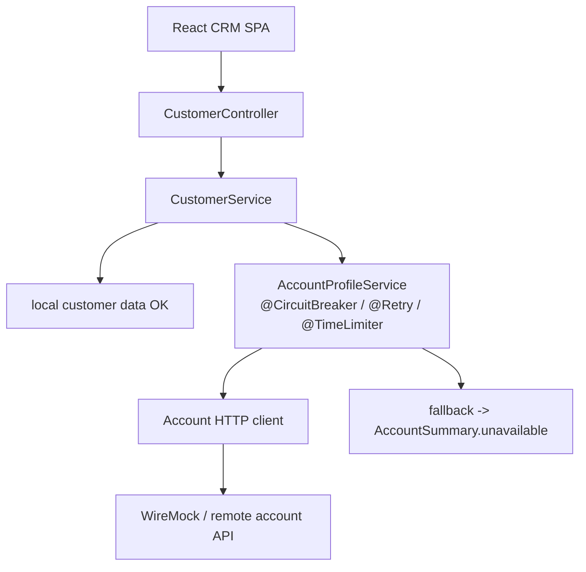
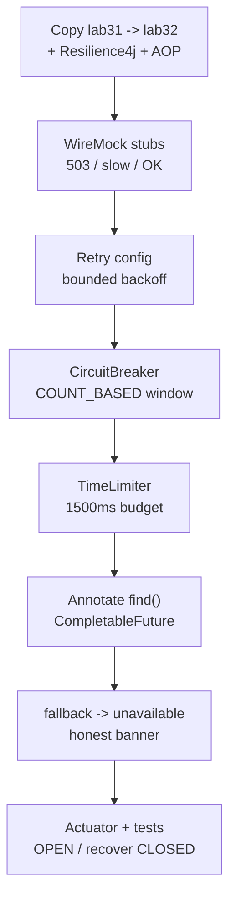

# Lab 32: Resilience4j for CRM Outbound Calls — Northstar Account Profile

**Module:** 32 — Resilience4j for CRM Outbound Calls  
**Lab folder:** `labs/Week 4 - Kafka, React, PostgreSQL and Resilience/module-32/lab32/`  
**Difficulty:** Intermediate  
**Duration:** 4–5 Hours

**Primary IDE:** IntelliJ IDEA Community Edition · **Optional IDE:** VS Code

| OS | How-to for this lab |
| -- | ------------------- |
| Windows | [LAB-32-WINDOWS.md](LAB-32-WINDOWS.md) |
| macOS | [LAB-32-MACOS.md](LAB-32-MACOS.md) |

> **Environment reminder:** Finish [Lab 0](../../../Week%201%20-%20Java%20and%20JVM%20Foundations/module-00/lab0/LAB-0-GUIDE.md). Use **IntelliJ IDEA Community** (primary; optional VS Code) on your laptop with **JDK 21**, **Maven 3.9+**, and instructor **shared Kafka** bootstrap servers. Work under `~/java-bootcamp` (Windows: `%USERPROFILE%\java-bootcamp`).

---

## How to follow this lab

1. Open the **Windows** or **macOS** how-to (links above) in a second tab.
2. Create/work only under your `java-bootcamp/examples/…` folder from the steps (not inside this `labs/` git clone unless a step says otherwise).
3. For each **Step N**: read **Why** (if present) → do the actions → confirm **Expected** / **Expected result** → then continue.
4. When stuck, use **Failure Experiments** / troubleshooting in this guide before asking for help.
5. Capture evidence under `notes/screenshots/lab-32/` (workspace root under `java-bootcamp`; redact secrets). Use the **Pass criteria** tables — write **Pass** or **Fail** in your notes. GitHub file view does not support clickable checkboxes.

## Lab Overview

This Module 32 lab protects **outbound** CRM calls to an account-profile dependency with **Resilience4j**: **Retry**, **CircuitBreaker**, **TimeLimiter**, truthful degraded read fallbacks (`AccountSummary.unavailable`), Actuator observation, and **deterministic WireMock** tests.

**Purpose.** Customer pages that enrich Amina/Ravi with account summaries must not hang the CRM when the account service is slow or failing — and must never pretend a failed write succeeded. Leadership freezes a latency budget and an honest degradation contract for React.

**What you build (exercise).** Copy to `lab32-crm`; add Resilience4j Boot 3 + AOP + Actuator + WireMock test deps; stub success/503/slow Account API for `CUS-1001`; configure retry, circuit breaker, and time limiter instances named `accountProfile`; annotate `AccountProfileService.find` with CB+Retry+TimeLimiter returning `CompletableFuture`; implement `fallback` → `AccountSummary.unavailable(customerId)`; expose health/metrics/events; write `AccountProfileResilienceTest` proving OPEN (no WireMock traffic), timeout, recovery to CLOSED, and truthful fallback JSON.

**What success looks like.** Under `~/java-bootcamp/examples/lab32-crm/` healthy calls return `available=true`, failures degrade to `available=false` without false success on writes, OPEN fails fast under ~20ms without hitting WireMock, timeouts fire near 1500ms, recovery reaches CLOSED, and tests pass twice.

**Depends on Labs 25–31 CRM API.** Prefer Lab 31 so Kafka and resilience coexist. Lab 28 JWT may be needed for manual HTTP demos.

**CRM connection.** Fixtures `CUS-1001` Amina / `CUS-1002` Ravi / correlation `lab-request-001` on outbound headers/logs where applicable.

---

## Learning Objectives

After completing this lab, you will be able to:

* Reproduce fast, slow, and failing account-service responses with WireMock
* Configure Resilience4j Retry for transient, safe GET requests
* Configure a CircuitBreaker and observe CLOSED, OPEN, and HALF_OPEN states
* Apply a TimeLimiter that enforces the CRM latency budget
* Write explicit degraded read fallbacks (`AccountSummary.unavailable`)
* Prevent unsafe retries and false-success fallbacks for writes
* Expose circuit-breaker health, metrics, and events via Actuator
* Write deterministic WireMock resilience tests without flaky sleeps
* Explain local lab thresholds vs production tuning

---

## Business Scenario

Agents opening Amina Khan (`CUS-1001`) see account summaries from a separate Account Profile service. When that service flaps, the CRM still must show customer identity/status and a clear “accounts temporarily unavailable” banner — not a spinning tab or a lie that balances updated.

Leadership freezes:

**Outbound account reads are wrapped with Retry + CircuitBreaker + TimeLimiter; degraded reads return `AccountSummary.unavailable`; writes are not silently marked successful.**

Use these examples consistently:

| ID | Name | Notes |
| -- | ---- | ----- |
| `CUS-1001` | Amina Khan | Primary WireMock stub `/accounts/CUS-1001` |
| `CUS-1002` | Ravi Singh | Optional second stub / happy path |
| `lab-request-001` | — | Correlation on CRM request / outbound header |
| `accountProfile` | — | Resilience4j instance name |
| `AccountSummary.unavailable` | — | Truthful degraded read contract |

**Security note for evidence.** Do not retry non-idempotent writes. Do not put tokens into WireMock journals committed to Git.

---

## Architecture Context

### NOW (this lab)



### Lab flow (mermaid)



### Architecture NOW vs LATER

| Aspect | Lab 32 (NOW) | Production |
| ------ | ------------ | ---------- |
| Dependency | WireMock stubs | Real account service + SLA |
| Thresholds | Small windows for demo | Tuned from metrics/SLOs |
| Fallback | `unavailable` for reads | Same honesty; maybe cached stale reads with TTL |
| Isolation | Single instance name | Bulkheads / separate pools per dependency |

**Lab focus:** Retry, CircuitBreaker, TimeLimiter, bounded latency, safe fallbacks, and observable failure states.

---

## Prerequisites

Complete [SETUP](../../../SETUP-INSTRUCTIONS.md), [Lab 0](../../../Week%201%20-%20Java%20and%20JVM%20Foundations/module-00/lab0/LAB-0-GUIDE.md), and Labs [29](../../../Week%203%20-%20Spring%20Framework%20and%20Enterprise%20Patterns/module-29/lab29/LAB-29-GUIDE.md)–[31](../../module-31/lab31/LAB-31-GUIDE.md) as available. Confirm:

* JDK 21; Maven; Spring Boot 3
* Ability to add Resilience4j and WireMock via Maven
* No secrets committed to Git

### Pre-flight

```bash
java -version
mvn -version
git --version
pwd
ls ~/java-bootcamp/examples
```

---

## Suggested Project Files

```text
~/java-bootcamp/examples/lab32-crm/
├── src/
│   ├── main/
│   │   ├── java/com/northstar/crm/
│   │   │   ├── CrmApplication.java
│   │   │   ├── account/
│   │   │   │   ├── AccountProfileService.java
│   │   │   │   ├── AccountClient.java
│   │   │   │   ├── AccountSummary.java
│   │   │   │   └── TemporaryAccountException.java
│   │   │   └── ... (prior CRM packages)
│   │   └── resources/
│   │       └── application.yml
│   └── test/
│       └── java/com/northstar/crm/account/
│           ├── AccountServiceStub.java
│           └── AccountProfileResilienceTest.java
├── docs/
│   └── resilience-notes.md
├── notes/screenshots/
├── .env.example
├── .gitignore
├── pom.xml
└── README.md
```

Ignore `target/`, IDE metadata, tokens, and passwords.

---

## Concepts to Discuss

Write 2–3 sentences each in `docs/resilience-notes.md`:

1. Main flow for an account-enriched customer read
2. Trust boundary: CRM vs remote account service responses
3. Success vs degraded contracts (`available` flag)
4. Stable identity (`CUS-1001`) across CRM and account stubs
5. Why GET retries can be safe and write retries are not by default
6. Local aggressive thresholds vs production tuning
7. Evidence: WireMock journal, CB events, correlation ID
8. Two CRM instances: independent CB state unless shared — implications
9. Ordering of Resilience4j aspects with `CompletableFuture` / TimeLimiter
10. What must never appear in a fallback (false write success)

---

## Implementation Steps

Complete each step in order. Commands assume `~/java-bootcamp/examples/lab32-crm` (Windows: `%USERPROFILE%\java-bootcamp\examples\lab32-crm`) unless noted.

---

### Step 1 — Branch CRM and add resilience dependencies

**Why:** AOP + Actuator are required for annotation-driven Resilience4j and observable state.

**Do this:**

```bash
cd ~/java-bootcamp/examples
cp -r lab31-crm lab32-crm   # or lab29-crm if Kafka skipped
cd lab32-crm
mkdir -p docs
mkdir -p ~/java-bootcamp/notes/screenshots/lab-32
```

```xml
<dependency>
  <groupId>io.github.resilience4j</groupId>
  <artifactId>resilience4j-spring-boot3</artifactId>
</dependency>
<dependency>
  <groupId>org.springframework.boot</groupId>
  <artifactId>spring-boot-starter-aop</artifactId>
</dependency>
<dependency>
  <groupId>org.springframework.boot</groupId>
  <artifactId>spring-boot-starter-actuator</artifactId>
</dependency>
<!-- WireMock test dependency as taught in class -->
```

Expose Actuator endpoints needed for health/metrics/events in lab profile (tighten for production notes).

```bash
mvn -q dependency:tree -Dincludes=io.github.resilience4j
```

**Expected result:** `resilience4j-spring-boot3` on classpath; `BUILD SUCCESS`.

**If it fails:** Wrong artifact for Boot 2 vs 3 → use `resilience4j-spring-boot3`. AOP missing → annotations silently ineffective.

---

### Step 2 — Create deterministic WireMock failures

**Why:** Every resilience state must be reproducible in tests without a flaky network.

**Do this:** Stub success, temporary 503, and slow responses for Amina:

```java
stubFor(get("/accounts/CUS-1001")
  .inScenario("recovery").whenScenarioStateIs(STARTED)
  .willReturn(aResponse().withStatus(503))
  .willSetStateTo("available"));
stubFor(get("/accounts/CUS-1001")
  .inScenario("recovery").whenScenarioStateIs("available")
  .willReturn(okJson("{\"accounts\":[]}")));
```

Also prepare a 3000ms delayed stub for TimeLimiter tests and a permanent-503 scenario for OPEN.

**Expected result:** First request 503; second 200; WireMock journal shows expected call counts.

**If it fails:** Scenario state not advancing → fix `willSetStateTo` / `whenScenarioStateIs`. Wrong path → align client base URL + `/accounts/CUS-1001`.

---

### Step 3 — Configure bounded retry

**Why:** Transient GETs deserve bounded exponential backoff — not infinite hammering.

**Do this:** In `application.yml`:

```yaml
resilience4j.retry.instances.accountProfile:
  max-attempts: 3
  wait-duration: 250ms
  enable-exponential-backoff: true
  exponential-backoff-multiplier: 2
  retry-exceptions:
    - java.io.IOException
    - com.northstar.crm.account.TemporaryAccountException
```

Map HTTP 503 to `TemporaryAccountException` in the client. Do **not** list business validation errors as retryable.

**Expected result:** Logs show attempt delays 250ms then 500ms then success for recovery scenario; `account_profile_loaded customerId=CUS-1001`.

**If it fails:** Retries not happening → exception type not listed / wrong instance name. Retries on 400 → remove from retry list.

---

### Step 4 — Configure the circuit breaker

**Why:** After enough failures, fail fast and protect the account dependency from a retry storm.

**Do this:** Use a small count window so transitions are visible quickly in the lab:

```yaml
resilience4j.circuitbreaker.instances.accountProfile:
  sliding-window-type: COUNT_BASED
  sliding-window-size: 10
  minimum-number-of-calls: 5
  failure-rate-threshold: 50
  wait-duration-in-open-state: 10s
  permitted-number-of-calls-in-half-open-state: 2
```

Drive enough failing calls to cross the threshold.

**Expected result:** `CLOSED_TO_OPEN` transition; next call fails fast (`CallNotPermittedException`) in under ~20ms; WireMock count does **not** increase while OPEN.

**If it fails:** Never opens → window too large / not enough calls / failures not recorded. Opens too early → intended for lab; document production tuning separately.

---

### Step 5 — Enforce a TimeLimiter budget

**Why:** Slow dependencies must not consume servlet threads forever; CRM has a latency budget.

**Do this:**

```yaml
resilience4j.timelimiter.instances.accountProfile:
  timeout-duration: 1500ms
  cancel-running-future: true
```

Run the client asynchronously (`CompletableFuture`) so TimeLimiter can interrupt/cancel.

Stub WireMock with 3000ms delay for `CUS-1001`.

**Expected result:** Observed response time ≈ 1500ms; cause `TimeoutException` (then fallback); not a 3s hang on the CRM thread pool for the caller path.

**If it fails:** TimeLimiter ignored → method returns sync value instead of `CompletableFuture`. Delay too small → raise stub delay clearly above budget.

---

### Step 6 — Compose annotations deliberately

**Why:** Aspect order and return types determine whether timeout/retry/CB actually apply.

**Do this:** In `AccountProfileService`:

```java
@CircuitBreaker(name = "accountProfile", fallbackMethod = "fallback")
@Retry(name = "accountProfile")
@TimeLimiter(name = "accountProfile")
public CompletableFuture<AccountSummary> find(String customerId) {
  return CompletableFuture.supplyAsync(() -> client.fetch(customerId), executor);
}
```

Pass `X-Correlation-Id: lab-request-001` from the web layer into client headers where practical. Keep fallback signature compatible: same args + `Throwable`.

**Expected result:** Healthy dependency: `available=true` with accounts; slow/failing dependency eventually invokes fallback; logs include `customerId`, pattern name, exception type.

**If it fails:** Fallback signature mismatch → `NoSuchMethod` style errors at runtime. Self-invocation bypasses proxies → call through Spring bean, not `this`.

---

### Step 7 — Write a truthful AccountSummary.unavailable fallback

**Why:** Degraded reads must be honest; failed writes must never look successful.

**Do this:**

```java
private CompletableFuture<AccountSummary> fallback(
    String customerId, Throwable cause) {
  log.warn("account_profile_degraded customerId={} cause={}",
      customerId, cause.getClass().getSimpleName());
  return CompletableFuture.completedFuture(
      AccountSummary.unavailable(customerId));
}
```

```java
public static AccountSummary unavailable(String customerId) {
  return new AccountSummary(customerId, false, List.of());
}
```

Wire React/API banner text: “Account information is temporarily unavailable.” Document that write endpoints do **not** use this success-shaped fallback.

**Expected result:** HTTP 200 with `{"customerId":"CUS-1001","available":false,"accounts":[]}` (or equivalent) for degraded reads — not a fake account list implying success of a mutation.

**If it fails:** Fallback returns empty success without `available=false` → React cannot distinguish; fix contract. Returning 500 for all CB opens → consider degraded read policy for UX (document choice).

---

### Step 8 — Observe recovery and automate tests

**Why:** Operators need Actuator signals; CI needs WireMock-deterministic proofs.

**Do this:**

```bash
curl -s localhost:8080/actuator/health
curl -s localhost:8080/actuator/circuitbreakerevents
curl -s localhost:8080/actuator/metrics/resilience4j.circuitbreaker.calls
mvn -q test -Dtest=AccountProfileResilienceTest
mvn -q test -Dtest=AccountProfileResilienceTest
```

Test ideas (assert specific states, not sleeps alone):

* Retry recovery scenario succeeds and journal count ≥ 2
* OPEN: `CallNotPermitted` / fallback; WireMock count unchanged during OPEN probes
* TimeLimiter: stub 3s → fallback within ~1.5–2s wall time
* HALF_OPEN → successful probes → CLOSED
* `AccountSummary.unavailable` fields asserted with JsonPath/equals

**Expected result:** Health shows CB state transitions; tests ~5+ green; consecutive runs deterministic.

**If it fails:** Flaky wall-clock asserts → widen bound slightly; prefer event assertions. Actuator 404 → enable exposure for lab profile.

---

### Step 9 — Document resilience runbook and UX contract

**Why:** React and support teams need a stable meaning for `available=false`.

**Do this:** In `docs/resilience-notes.md`, document:

| CRM response field | Meaning |
| ------------------ | ------- |
| `available: true` | Account dependency succeeded; accounts list trustworthy |
| `available: false` | Degraded; show banner; do **not** invent balances |
| Correlation | Prefer `lab-request-001` (or request header) in CRM + outbound logs |

```bash
cd ~/java-bootcamp/examples/lab32-crm
mvn -q test -Dtest=AccountProfileResilienceTest
mvn -q spring-boot:run
curl -s localhost:8080/actuator/health
curl -s localhost:8080/actuator/circuitbreakerevents
```

Warn boldly: lab CB windows and 10s open-wait are for classroom visibility — production values come from SLOs/load tests.

**Expected result:** Peer can re-run OPEN/timeout/recovery demos from notes; UX contract explicit.

**If it fails:** Notes omit `available` flag → React cannot distinguish empty accounts from outage.

---

### Step 10 — Failure experiments + evidence pack

**Why:** Unsafe write retries and silent “success” fallbacks are the ethical failure modes of this lab.

**Do this:** Complete [Failure Experiments](#failure-experiments). Capture Actuator events, WireMock journals, and Surefire under `notes/screenshots/lab-32/`. Run resilience tests twice for determinism.

**Expected result:** ≥3 experiments; truthful fallback documented; consecutive green tests; no secrets in Git.

**If it fails:** See Troubleshooting.

---

## Annotation composition cheat-sheet

Keep this near the service code in notes:

1. **TimeLimiter** expects async (`CompletableFuture`) for cancel/timeout semantics taught in this lab.
2. **Retry** should target transient infrastructure exceptions — not validation/`BusinessException`.
3. **CircuitBreaker** records failures after retries according to your Resilience4j ordering; verify with WireMock counts, not assumptions.
4. **Fallback** must match method arguments + `Throwable` and must stay honest for reads.
5. Call the service through a Spring-injected bean so proxies apply (no `this.find(...)` self-invocation).

---

## Implementation Checkpoints

### Checkpoint A — Tooling

_Mark each row **Pass** or **Fail** in your lab notes (GitHub markdown files are not interactive checklists)._

| # | Confirm | Your notes |
| - | ------- | ---------- |
| 1 | `lab32-crm` under `examples/` | Pass / Fail |
| 2 | Resilience4j Boot3 + AOP + Actuator resolve | Pass / Fail |
| 3 | WireMock on test classpath | Pass / Fail |

### Checkpoint B — Patterns configured

_Mark each row **Pass** or **Fail** in your lab notes (GitHub markdown files are not interactive checklists)._

| # | Confirm | Your notes |
| - | ------- | ---------- |
| 1 | Retry instance `accountProfile` with bounded backoff | Pass / Fail |
| 2 | CircuitBreaker count window + OPEN fail-fast proof | Pass / Fail |
| 3 | TimeLimiter 1500ms with async `CompletableFuture` | Pass / Fail |

### Checkpoint C — Fallback and honesty

_Mark each row **Pass** or **Fail** in your lab notes (GitHub markdown files are not interactive checklists)._

| # | Confirm | Your notes |
| - | ------- | ---------- |
| 1 | `AccountSummary.unavailable` for degraded reads | Pass / Fail |
| 2 | No false-success write fallback | Pass / Fail |
| 3 | Correlation/`CUS-1001` visible in logs | Pass / Fail |

### Checkpoint D — Observation and tests

_Mark each row **Pass** or **Fail** in your lab notes (GitHub markdown files are not interactive checklists)._

| # | Confirm | Your notes |
| - | ------- | ---------- |
| 1 | Actuator health/events/metrics consulted | Pass / Fail |
| 2 | `AccountProfileResilienceTest` green twice | Pass / Fail |
| 3 | Production threshold caution documented | Pass / Fail |

---

## Reference Commands, Configuration, and Code

### application.yml (excerpt)

```yaml
resilience4j:
  retry:
    instances:
      accountProfile:
        max-attempts: 3
        wait-duration: 250ms
        enable-exponential-backoff: true
        exponential-backoff-multiplier: 2
  circuitbreaker:
    instances:
      accountProfile:
        sliding-window-size: 10
        minimum-number-of-calls: 5
        failure-rate-threshold: 50
        wait-duration-in-open-state: 10s
  timelimiter:
    instances:
      accountProfile:
        timeout-duration: 1500ms
        cancel-running-future: true
```

### Service + fallback (pattern)

```java
@CircuitBreaker(name = "accountProfile", fallbackMethod = "fallback")
@Retry(name = "accountProfile")
@TimeLimiter(name = "accountProfile")
CompletableFuture<AccountSummary> find(String id) {
  return CompletableFuture.supplyAsync(() -> client.fetch(id), executor);
}

CompletableFuture<AccountSummary> fallback(String id, Throwable cause) {
  return CompletableFuture.completedFuture(AccountSummary.unavailable(id));
}
```

### Actuator / test commands

```bash
cd ~/java-bootcamp/examples/lab32-crm
mvn -q test -Dtest=AccountProfileResilienceTest
curl -s localhost:8080/actuator/health
curl -s localhost:8080/actuator/metrics/resilience4j.circuitbreaker.calls
curl -s localhost:8080/actuator/circuitbreakerevents
git status
```

### Class map

| Class | Role |
| ----- | ---- |
| `AccountProfileService` | Annotated resilient facade |
| `AccountClient` | HTTP call to account API |
| `AccountSummary` | Includes `unavailable(...)` factory |
| `AccountServiceStub` | WireMock scenarios |
| `AccountProfileResilienceTest` | Deterministic proofs |
| `resilience-notes.md` | Tuning + honesty checklist |

---

## Manual Verification

1. Healthy account call for `CUS-1001` returns `available=true` (or accounts present).
2. 503 recovery path retries then succeeds (or degrades honestly if still failing).
3. CB OPEN fails fast; WireMock journal does not grow on OPEN probes.
4. 3s stub triggers TimeLimiter near 1500ms then fallback.
5. Fallback body uses `AccountSummary.unavailable` (`available=false`).
6. Writes are not marked successful via the same fallback pattern.
7. Actuator shows state transitions / metrics.
8. Resilience tests pass twice consecutively.
9. `lab-request-001` / customer IDs appear in useful logs (no secrets).
10. Docs warn lab thresholds are not production defaults.

---

## Failure Experiments

| # | Experiment | Observe | Restore |
| - | ---------- | ------- | ------- |
| 1 | Permanent 503 from WireMock | Retries then OPEN / fallback | Reset scenario; CB wait elapses |
| 2 | 3000ms delay stub | Timeout ≈1500ms + unavailable | Disable delay stub |
| 3 | Calls while OPEN | Fail fast; journal unchanged | Wait for HALF_OPEN; succeed |
| 4 | Retry a non-idempotent write (thought experiment or guarded demo) | Document why forbidden | Keep writes out of retry |
| 5 | Fallback returns “success” without `available=false` | UX lie | Restore `unavailable` |

---

## Troubleshooting

| Symptom | Likely cause | Fix |
| ------- | ------------ | --- |
| Annotations ignored | Missing AOP / self-invocation | Add starter-aop; call through Spring proxy |
| TimeLimiter no effect | Sync return type | Return `CompletableFuture` + async supply |
| CB never opens | Failures not recorded / wrong name | Align instance name; throw recorded exceptions |
| Flaky tests | Wall-clock sleeps only | Awaitility + WireMock journal asserts |
| Actuator 404 | Endpoints not exposed | Configure `management.endpoints.web.exposure` for lab |
| Fallback wrong signature | Missing `Throwable` arg | Match method args + cause |

---

## Security and Production Review

Answer in README / `docs/resilience-notes.md`:

1. Which remote/network inputs are untrusted (account JSON)?
2. Where are authn/authz enforced for CRM vs outbound account calls (propagate tokens carefully)?
3. Which values are sensitive on outbound headers?
4. What can be retried safely (idempotent GETs only)?
5. What happens after partial failure (CRM OK, accounts unavailable)?
6. What would an operator monitor (CB state, timeout rate, fallback rate)?
7. Which local default is unacceptable (tiny windows, endless retries, false write success)?
8. How are degraded-response contracts versioned for React?

---

## Cleanup

```bash
cd ~/java-bootcamp/examples/lab32-crm
# Stop spring-boot:run
mvn -q clean
git status
```

No Docker required for WireMock tests; if you started Lab 30 Kafka for combined demos, shut it down separately when done.

**Keep `lab32-crm`** as the resilience reference for capstone outbound dependency hardening.

---

## Expected Deliverables

* Resilience4j Retry + CircuitBreaker + TimeLimiter on account profile reads
* `AccountSummary.unavailable` truthful fallback
* WireMock stubs for 503 / slow / OK on `CUS-1001`
* Actuator observation evidence
* `AccountProfileResilienceTest` output (OPEN, timeout, recovery)
* Notes forbidding unsafe write retries / false success
* Run and cleanup instructions
* No secrets committed

---

## Evaluation Rubric (100 Marks)

| Criteria | Marks |
| -------- | ----: |
| Environment and project structure | 10 |
| Core implementation (annotations + fallback) | 30 |
| Integration/configuration correctness (YAML instances) | 15 |
| Failure handling (OPEN fail-fast, timeout, honesty) | 15 |
| Automated verification (WireMock tests) | 10 |
| Security and production awareness | 10 |
| Documentation and evidence | 10 |

**Notes:** Fallback that implies write success → honor violation. CB “configured” but never demonstrated OPEN → incomplete. Sleep-only tests → quality marks lost.

---

## Reflection Questions

Write 3–6 sentence answers:

1. Which design decision most affected correctness (fallback honesty vs fail-hard)?
2. Which failure was hardest (aspect order, TimeLimiter + Future, CB thresholds)?
3. What evidence proves OPEN fail-fast without calling WireMock?
4. What breaks first at ten times the outbound call rate?
5. Which concern should move to shared infrastructure (mesh timeouts, platform CB)?
6. What must change before real customer/account data is used?
7. How does this lab connect to Labs 29 (errors), 30–31 (async), and the React UX?
8. What metric or Actuator field matters most during an account outage?
9. (Forward look) How would a bulkhead change thread isolation for this dependency?

---

## Bonus Challenges

1. Propagate `lab-request-001` on outbound RestClient/WebClient headers.
2. Cached-stale read with TTL as an alternative degraded strategy (document trade-offs).
3. Separate readiness from liveness when CB is OPEN (policy choice).
4. Micrometer dashboards/notes for retry/CB/timeout.
5. Document rollback if a bad threshold ships (CB stuck OPEN).
6. Prove a write path explicitly does **not** use the read fallback.

---

## Success Criteria

You are finished when:

* You can demonstrate Retry, CircuitBreaker, TimeLimiter, bounded latency, and safe fallbacks
* Happy path and degraded path for `CUS-1001` are repeatable
* OPEN fail-fast and timeout behaviors are evidenced
* Another student can follow your run instructions
* WireMock tests/build pass twice
* No production secret is hard-coded
* You can explain lab thresholds vs production tuning

---

## Instructor Notes

* **Live probe:** Ask the student to show WireMock journal counts before/during OPEN, then point to `AccountSummary.unavailable` fields React would key off. Ask why write retries are excluded.
* **Assess:** Deterministic WireMock; OPEN fail-fast; TimeLimiter with Futures; truthful fallback; Actuator literacy.
* **Continuity:** Prefer `examples/lab32-crm`. Keep fixtures. Do not invent a second degraded contract that Lab 29 React already misunderstands.
* **Common pitfalls:** Missing AOP; sync methods with TimeLimiter; self-invocation; retrying POSTs; fallback signature mismatch; using lab thresholds as “prod ready.”
* **Timing:** 4–5 hours. Aspect ordering + CB demo visibility often burn 45–60 minutes—steer students to small windows early.

---

*End of Lab 32 — Resilience4j for CRM Outbound Calls: Northstar Account Profile. Keep `lab32-crm` for capstone and portfolio evidence.*
