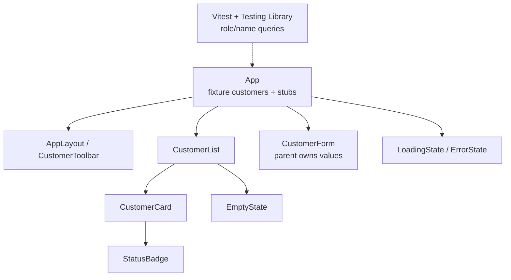
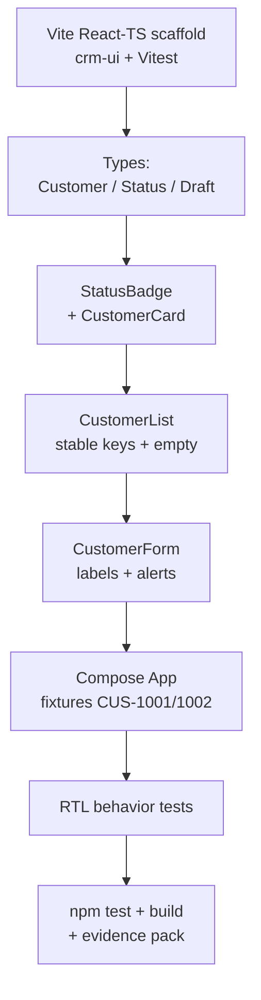

# Lab 33: React Components for the CRM Dashboard

**Module:** 33 — React Components for the CRM Dashboard  
**Lab folder:** `labs/Week 4 - Kafka, React, PostgreSQL and Resilience/module-33/lab33/`  
**Difficulty:** Intermediate  
**Duration:** 4–5 Hours

**Primary IDE:** IntelliJ IDEA Community Edition · **Optional IDE:** VS Code

| OS | How-to for this lab |
| -- | ------------------- |
| Windows | [LAB-33-WINDOWS.md](LAB-33-WINDOWS.md) |
| macOS | [LAB-33-MACOS.md](LAB-33-MACOS.md) |

> **Environment reminder:** Finish [Lab 0](../../../Week%201%20-%20Java%20and%20JVM%20Foundations/module-00/lab0/LAB-0-GUIDE.md). Use **IntelliJ IDEA Community** (primary; optional VS Code) on your laptop with **Node.js 22+** and **npm**. Work under `~/java-bootcamp` (Windows: `%USERPROFILE%\java-bootcamp`).

---

## How to follow this lab

1. Open the **Windows** or **macOS** how-to (links above) in a second tab.
2. Create/work only under your `java-bootcamp/examples/…` folder from the steps (not inside this `labs/` git clone unless a step says otherwise).
3. For each **Step N**: read **Why** (if present) → do the actions → confirm **Expected** / **Expected result** → then continue.
4. When stuck, use **Failure Experiments** / troubleshooting in this guide before asking for help.
5. Capture evidence under `notes/screenshots/lab-33/` (workspace root under `java-bootcamp`; redact secrets). Use the **Pass criteria** tables — write **Pass** or **Fail** in your notes. GitHub file view does not support clickable checkboxes.

## Lab Overview

This Module 33 lab introduces the **Customer Management Platform** React client: typed models, accessible presentational components, composition with stable list keys, and React Testing Library behavior tests. You will scaffold with Vite, build `StatusBadge` / `CustomerCard` / `CustomerList` / `CustomerForm`, compose a dashboard shell, and prove visible behavior with Vitest.

**Purpose.** Before state management (Lab 34) and API integration (Lab 35), leadership freezes the UI contract: every customer surface must be typed, composable, and accessible. Color-only status, index keys, and class-name tests are rejected. Presentation components stay props-driven so Lab 34 can lift state without rewriting markup.

**What you build (exercise).** Create `lab33-crm/crm-ui` with Vite React-TS; define `Customer` / `CustomerStatus` / `CustomerDraft`; implement `StatusBadge`, `CustomerCard`, `CustomerList`, empty/loading/error shells, and labeled `CustomerForm`; compose `App` with fixtures `CUS-1001` / `CUS-1002`; write RTL tests that query by role; document a11y and key decisions.

**What success looks like.** Under `~/java-bootcamp/examples/lab33-crm/crm-ui/` the dashboard renders Amina and Ravi, empty state works, form labels are queryable, `npm run test -- --run` and `npm run build` are green, and you can explain why `customerId` is the list key.

**Depends on Labs Setup / Lab 0.** Node 22+ and npm from Week 4 setup. No prior React lab is required; Labs 34–36 copy this tree forward.

**CRM connection.** Fixtures `CUS-1001` (Amina Khan, ACTIVE), `CUS-1002` (Ravi Singh, PROSPECT), correlation `lab-request-001` on any logged edit callback. Lab 34 lifts state; Lab 35 replaces fixture arrays with fetch—keep props shapes stable.

---

## Learning Objectives

After completing this lab, you will be able to:

* Scaffold a React TypeScript CRM application with Vite
* Define typed `Customer`, `CustomerStatus`, and `CustomerDraft` models
* Create accessible `StatusBadge` and `CustomerCard` components
* Compose `CustomerList` from reusable cards with stable `customerId` keys
* Create a labeled `CustomerForm` presentation component (controlled by parent later)
* Build empty, loading, and error presentation shells
* Compose the CRM dashboard with children and callback props
* Write behavior-focused React Testing Library tests (role + accessible name)
* Document a11y and composition decisions for the next lab

---

## Business Scenario

The CRM stores customer identity, contact details, lifecycle status, and financial accounts. Its React client will later talk to Spring Boot; Spring persists to PostgreSQL, emits Kafka events, and protects outbound calls. This lab builds the **presentational shell** with fixtures only—no API yet.

Leadership freezes:

**No merge of CRM UI components without typed props, stable keys, visible status text (not color alone), and RTL tests that query by role.**

You own that gate for Amina (`CUS-1001` ACTIVE) and Ravi (`CUS-1002` PROSPECT) cards, empty list UX, and an accessible form shell.

Use these examples consistently:

| ID | Name | Notes |
| -- | ---- | ----- |
| `CUS-1001` | Amina Khan | `ACTIVE` — primary card fixture |
| `CUS-1002` | Ravi Singh | `PROSPECT` — second card / grid |
| `lab-request-001` | — | correlation on edit/add console callbacks |
| fictional emails | `amina@example.com`, `ravi@example.com` | never real PII |

**Security note for evidence.** Use fictional emails only. Never commit `.env` secrets, `node_modules/`, or `dist/`. Screenshots of the dashboard and test output go under `notes/screenshots/lab-33/`.

---

## Architecture Context

### NOW (this lab)



### Lab flow (mermaid)



### Architecture NOW vs LATER

| Aspect | Lab 33 (NOW) | Lab 34–35 (LATER) |
| ------ | ------------ | ----------------- |
| Data | Fixture array in `App` | `useState` CRUD (34); `fetch` API (35) |
| Form | Presentation props only | Controlled state + validation (34) |
| Network | None | Typed client + CORS (35) |
| Auth | None | Tokens / guards (36) |

**Lab focus:** React TypeScript components, props, composition, stable list keys, semantics, and accessibility.

---

## Prerequisites

Complete [SETUP](../../../SETUP-INSTRUCTIONS.md) and [Lab 0](../../../Week%201%20-%20Java%20and%20JVM%20Foundations/module-00/lab0/LAB-0-GUIDE.md). Confirm:

* Node.js 22+; npm; Git
* Browser (Chrome/Edge) with DevTools
* No secrets committed to Git

### Pre-flight

```bash
node --version
npm --version
git --version
pwd
ls ~/java-bootcamp/examples
```

Expected: Node `v20` or newer. Fix environment failures before scaffolding.

---

## Suggested Project Files

```text
~/java-bootcamp/examples/lab33-crm/
└── crm-ui/                          (Vite React-TS root)
    ├── src/
    │   ├── types/
    │   │   └── customer.ts
    │   ├── components/
    │   │   ├── StatusBadge.tsx
    │   │   ├── CustomerCard.tsx
    │   │   ├── CustomerList.tsx
    │   │   ├── CustomerList.test.tsx
    │   │   ├── CustomerForm.tsx
    │   │   ├── CustomerToolbar.tsx
    │   │   ├── EmptyState.tsx
    │   │   ├── LoadingState.tsx
    │   │   ├── ErrorState.tsx
    │   │   └── AppLayout.tsx
    │   ├── data/
    │   │   └── seedCustomers.ts     (CUS-1001 / CUS-1002)
    │   ├── App.tsx
    │   ├── App.css
    │   └── main.tsx
    ├── docs/
    │   └── component-notes.md
    ├── notes/screenshots/
    ├── index.html
    ├── package.json
    ├── vite.config.ts               (+ vitest)
    ├── tsconfig.json
    ├── .gitignore
    └── README.md
```

Ignore `node_modules/`, `dist/`, IDE metadata, tokens, and passwords.

---

## Concepts to Discuss

Write 2–3 sentences each in `docs/component-notes.md`:

1. Main UI flow (fixtures → list → card → edit callback)
2. Trust boundary: browser DOM is untrusted display; validation moves up in Lab 34–35
3. Success/failure contracts: empty vs populated list; build/typecheck must pass
4. Stable identity: `customerId` as React `key` and edit callback argument
5. Idempotency of `npm test` (repeatable, no shared mutable DOM fixtures)
6. Why presentational components before `useState` (Lab 34) and fetch (Lab 35)
7. Evidence operators/leads need (RTL green + screenshot of a11y tree landmarks)
8. Two students: same fixtures, same component prop shapes, same test selectors
9. False confidence: testing class names vs roles and accessible names
10. What Lab 34 will change (lift state) without rewriting card markup

---

## Implementation Steps

Complete each step in order. Commands assume `~/java-bootcamp/examples/lab33-crm/crm-ui` (Windows: `%USERPROFILE%\java-bootcamp\examples\lab33-crm/crm-ui`) unless noted.

---

### Step 1 — Scaffold the Vite React-TS project

**Why:** A typed Vite app is the shared base for Labs 33–36; wrong template or missing Vitest blocks every later step.

**Do this:**

```bash
mkdir -p ~/java-bootcamp/examples/lab33-crm
cd ~/java-bootcamp/examples/lab33-crm
npm create vite@latest crm-ui -- --template react-ts
cd crm-ui
npm install
npm install -D vitest jsdom @testing-library/react \
  @testing-library/jest-dom @testing-library/user-event
mkdir -p docs
mkdir -p ~/java-bootcamp/notes/screenshots/lab-33 src/types src/components src/data
```

Wire Vitest in `vite.config.ts` (`test: { environment: 'jsdom', globals: true }`) and add `"test": "vitest"` to `package.json` scripts. Replace the default Vite title with **Customer Management Platform**.

```bash
npm run dev
```

**Expected result:** Vite ready on `http://localhost:5173/`; browser shows CRM title shell.

**If it fails:** Node &lt; 22 → upgrade. Wrong template (`vanilla`) → recreate with `react-ts`. Port busy → stop other Vite or use `--port 5174`.

---

### Step 2 — Define customer types

**Why:** Status must be a closed union so `"UNKNOWN"` never ships; drafts omit server `customerId` for the form.

**Do this:** Create `src/types/customer.ts`:

```typescript
export type CustomerStatus = "PROSPECT" | "ACTIVE" | "SUSPENDED" | "CLOSED";

export interface Customer {
  customerId: string;
  fullName: string;
  email: string;
  phone: string;
  status: CustomerStatus;
}

export type CustomerDraft = Omit<Customer, "customerId">;
```

Create `src/data/seedCustomers.ts` with Amina (`CUS-1001`, ACTIVE, `amina@example.com`) and Ravi (`CUS-1002`, PROSPECT, `ravi@example.com`).

```bash
npm run build
```

**Expected result:** TypeScript compiles. An assignment with status `"UNKNOWN"` fails type checking.

**If it fails:** Strict mode off → enable in `tsconfig`. Forgot `CLOSED` in union → add if StatusBadge needs it later; Lab 15 statuses should stay aligned.

---

### Step 3 — Create `StatusBadge`

**Why:** Status must remain understandable in grayscale; color-only badges fail accessibility review.

**Do this:** Create `src/components/StatusBadge.tsx`:

```tsx
import type { CustomerStatus } from "../types/customer";

const labels: Record<CustomerStatus, string> = {
  PROSPECT: "Prospect",
  ACTIVE: "Active",
  SUSPENDED: "Suspended",
  CLOSED: "Closed",
};

export function StatusBadge({ status }: { status: CustomerStatus }) {
  return (
    <span className={`status status--${status.toLowerCase()}`}>
      {labels[status]}
    </span>
  );
}
```

Add minimal CSS for text contrast; do not rely on color alone.

**Expected result:** ACTIVE renders visible text `Active`; SUSPENDED renders `Suspended`; badge readable in grayscale.

**If it fails:** Missing label for a status → exhaustiveness error (good). Empty children → fix labels map.

---

### Step 4 — Create `CustomerCard`

**Why:** Cards are the reusable unit of the dashboard; semantic headings and mailto links must be testable by role.

**Do this:** Create `src/components/CustomerCard.tsx` that takes `customer` and `onEdit(customerId: string)`:

* `<article aria-labelledby={...}>` with heading id tied to `customerId`
* `StatusBadge`
* mailto link for email
* Edit button calling `onEdit(customer.customerId)`

Render with Amina fixture in Story-style smoke check inside `App` temporarily if needed.

**Expected result:** Heading `Amina Khan`; link `amina@example.com`; status Active; Edit calls `onEdit("CUS-1001")` (log with `lab-request-001` in console if you stub).

**If it fails:** Button not found by name → use accessible name `Edit`. Props typing error → export `Props` interface.

---

### Step 5 — Compose `CustomerList` with stable keys

**Why:** Index keys remount wrong cards on sort/filter; empty arrays must not leave an inaccessible empty grid.

**Do this:** Create `EmptyState` and `CustomerList`:

```tsx
if (customers.length === 0) {
  return <EmptyState title="No customers yet" />;
}
return (
  <section aria-labelledby="customer-list-title">
    <h2 id="customer-list-title">Customers</h2>
    <div className="customer-grid">
      {customers.map((customer) => (
        <CustomerCard
          key={customer.customerId}
          customer={customer}
          onEdit={onEdit}
        />
      ))}
    </div>
  </section>
);
```

Never use array index as `key`.

**Expected result:** Two fixtures → two articles. `[]` → “No customers yet”. No empty grid in the accessibility tree.

**If it fails:** Duplicate keys → check fixture IDs. Index key used → replace with `customerId`.

---

### Step 6 — Create `CustomerForm` presentation

**Why:** Labels and `role="alert"` errors make the form RTL-queryable before Lab 34 wires state.

**Do this:** Create `CustomerForm` with labeled inputs (`htmlFor` / `id`), `aria-describedby` for errors, Save (submit) and Cancel (button) callbacks. Values and errors arrive via props (`value`, `errors`, `onChange`, `onSubmit`, `onCancel`). Use an empty draft for now.

**Expected result:** `getByLabelText("Full name")` locates the input; Tab reaches Save and Cancel; field error announced with `role="alert"`.

**If it fails:** Missing `htmlFor` → labels not associated. Submit button as `type="button"` only → fix so form `onSubmit` fires.

---

### Step 7 — Compose the dashboard in `App`

**Why:** Layout landmarks and one `main` prove composition before state complexity arrives.

**Do this:** Build `AppLayout`, `CustomerToolbar`, optional `LoadingState` / `ErrorState` shells. Wire:

```tsx
<AppLayout>
  <CustomerToolbar onAdd={() => console.log("add", "lab-request-001")} />
  <CustomerList
    customers={seedCustomers}
    onEdit={(id) => console.log("edit", id, "lab-request-001")}
  />
  <CustomerForm
    value={emptyDraft}
    errors={{}}
    onChange={() => {}}
    onSubmit={() => {}}
    onCancel={() => {}}
  />
</AppLayout>
```

Check desktop grid and a 375px viewport (no horizontal scroll); exactly one `main` landmark.

**Expected result:** Toolbar above multi-column grid; mobile one-column; one `main`.

**If it fails:** Nested `main` elements → keep landmark only in layout. Horizontal scroll → fix CSS grid gaps/min-width.

---

### Step 8 — Loading and error presentation shells

**Why:** Lab 35 will swap fixtures for request states; shells now prevent ad-hoc div soup later.

**Do this:** Implement `LoadingState` (progress / “Loading customers…”) and `ErrorState` (message + optional Retry button prop). Toggle them briefly in `App` with a local boolean to screenshot both, then default back to the list.

**Expected result:** Distinct loading and error UIs; Retry callback stub logs `lab-request-001`.

**If it fails:** Same markup as empty state → differentiate copy and roles (`status` vs `alert`).

---

### Step 9 — Write RTL behavior tests

**Why:** Implementation-detail tests (class names) break on restyle; role queries protect user-visible contracts.

**Do this:** Create `src/components/CustomerList.test.tsx`:

* Renders two cards for Amina + Ravi
* Empty state when `customers={[]}`
* Edit click calls `onEdit` with `"CUS-1001"`

```tsx
it("reports the selected customer", async () => {
  const user = userEvent.setup();
  const onEdit = vi.fn();
  render(<CustomerList customers={[amina]} onEdit={onEdit} />);
  await user.click(screen.getByRole("button", { name: "Edit" }));
  expect(onEdit).toHaveBeenCalledWith("CUS-1001");
});
```

Optionally add a `StatusBadge` or `CustomerForm` label test.

```bash
npm run test -- --run
```

**Expected result:** `CustomerList.test.tsx` (≥3 tests) green.

**If it fails:** Multiple Edit buttons → scope with `within(article)` or unique names. Vitest not configured → fix `vite.config.ts` and `setupTests` for jest-dom.

---

### Step 10 — Evidence pack and runbook

**Why:** Peers and instructors must reproduce green test/build without archaeology.

**Do this:** Complete [Failure Experiments](#failure-experiments). Capture screenshots under `notes/screenshots/lab-33/`. Document in README / `docs/component-notes.md`:

```bash
npm run dev
npm run test -- --run
npm run build
```

Run tests twice for determinism. Confirm `git status` clean of `node_modules/` and `dist/`.

**Expected result:** ≥3 experiments; identical consecutive test runs; runbook complete.

**If it fails:** See Troubleshooting.

---

## Implementation Checkpoints

### Checkpoint A — Tooling

_Mark each row **Pass** or **Fail** in your lab notes (GitHub markdown files are not interactive checklists)._

| # | Confirm | Your notes |
| - | ------- | ---------- |
| 1 | `lab33-crm/crm-ui` under `~/java-bootcamp/examples/` | Pass / Fail |
| 2 | Vite React-TS + Vitest + Testing Library installed | Pass / Fail |
| 3 | `npm run build` succeeds | Pass / Fail |

### Checkpoint B — Core components

_Mark each row **Pass** or **Fail** in your lab notes (GitHub markdown files are not interactive checklists)._

| # | Confirm | Your notes |
| - | ------- | ---------- |
| 1 | Types: `Customer` / `CustomerStatus` / `CustomerDraft` | Pass / Fail |
| 2 | `StatusBadge`, `CustomerCard`, `CustomerList` (stable keys), empty state | Pass / Fail |
| 3 | `CustomerForm` with labels and alert errors | Pass / Fail |
| 4 | Fixtures Amina `CUS-1001` and Ravi `CUS-1002` | Pass / Fail |

### Checkpoint C — Composition + tests

_Mark each row **Pass** or **Fail** in your lab notes (GitHub markdown files are not interactive checklists)._

| # | Confirm | Your notes |
| - | ------- | ---------- |
| 1 | Dashboard composed with layout / toolbar / form shells | Pass / Fail |
| 2 | Loading and error presentation shells exist | Pass / Fail |
| 3 | RTL tests query by role; Edit → `CUS-1001` | Pass / Fail |
| 4 | Two consecutive `npm run test -- --run` green | Pass / Fail |

### Checkpoint D — Hygiene

_Mark each row **Pass** or **Fail** in your lab notes (GitHub markdown files are not interactive checklists)._

| # | Confirm | Your notes |
| - | ------- | ---------- |
| 1 | README runbook documents `dev` / `test` / `build` | Pass / Fail |
| 2 | No secrets / `node_modules` / `dist` committed | Pass / Fail |
| 3 | Component notes cover keys, a11y, Lab 34 handoff | Pass / Fail |

---

## Reference Commands, Configuration, and Code

### Types excerpt

```typescript
export type CustomerStatus = "PROSPECT" | "ACTIVE" | "SUSPENDED" | "CLOSED";
export interface Customer {
  customerId: string;
  fullName: string;
  email: string;
  phone: string;
  status: CustomerStatus;
}
export type CustomerDraft = Omit<Customer, "customerId">;
```

### List composition excerpt

```tsx
export function CustomerList({ customers, onEdit }: Props) {
  if (!customers.length) return <EmptyState title="No customers yet" />;
  return (
    <section aria-labelledby="customers-title">
      <h2 id="customers-title">Customers</h2>
      {customers.map((c) => (
        <CustomerCard key={c.customerId} customer={c} onEdit={onEdit} />
      ))}
    </section>
  );
}
```

### Commands

```bash
cd ~/java-bootcamp/examples/lab33-crm/crm-ui
npm run dev
npm run test -- --run
npm run build
git status
```

### Class map

| File | Role |
| ---- | ---- |
| `types/customer.ts` | Shared CRM types |
| `StatusBadge.tsx` | Accessible status label |
| `CustomerCard.tsx` | One customer article |
| `CustomerList.tsx` | Grid + empty state |
| `CustomerForm.tsx` | Labeled presentation form |
| `CustomerList.test.tsx` | RTL behavior suite |
| `seedCustomers.ts` | Amina / Ravi fixtures |

### Seed fixtures excerpt

```typescript
export const seedCustomers: Customer[] = [
  {
    customerId: "CUS-1001",
    fullName: "Amina Khan",
    email: "amina@example.com",
    phone: "+1-555-0101",
    status: "ACTIVE",
  },
  {
    customerId: "CUS-1002",
    fullName: "Ravi Singh",
    email: "ravi@example.com",
    phone: "+1-555-0102",
    status: "PROSPECT",
  },
];
```

### Vitest config sketch

```typescript
// vite.config.ts
export default defineConfig({
  plugins: [react()],
  test: {
    environment: "jsdom",
    globals: true,
    setupFiles: "./src/setupTests.ts",
  },
});
```

### Form label pattern

```tsx
<label htmlFor="fullName">Full name</label>
<input
  id="fullName"
  name="fullName"
  value={value.fullName}
  onChange={onChange}
  aria-describedby="fullName-error"
/>
<p id="fullName-error" role="alert">
  {errors.fullName}
</p>
```

---

## Manual Verification

1. Vite app titled Customer Management Platform loads at `:5173`.
2. Amina (`CUS-1001`) and Ravi (`CUS-1002`) cards render with text status labels.
3. Empty list shows “No customers yet” (force `customers={[]}` briefly).
4. Form fields found by `getByLabelText`; errors use `role="alert"`.
5. Exactly one `main` landmark; usable at 375px width.
6. Edit on Amina invokes callback with `"CUS-1001"`.
7. RTL suite ≥3 tests green twice consecutively.
8. `npm run build` succeeds.
9. No secrets or `node_modules` staged.
10. You can explain why `customerId` is the React key.

---

## Failure Experiments

| # | Experiment | Observe | Restore |
| - | ---------- | ------- | ------- |
| 1 | Use `key={index}` then sort list | Wrong component reuse / focus jump | Restore `customerId` key |
| 2 | Remove status text; keep color only | Grayscale fails a11y intent | Restore label text |
| 3 | Break `htmlFor` / `id` pairing | `getByLabelText` fails | Fix label association |
| 4 | Pass `customers={[]}` | Empty state, no ghost grid | Restore seeds |
| 5 | Run `npm run test -- --run` twice | Identical results | Keep fixtures pure |

---

## Troubleshooting

| Symptom | Likely cause | Fix |
| ------- | ------------ | --- |
| Vite not found | npm create failed / wrong cwd | Recreate under `lab33-crm`; cd `crm-ui` |
| Tests not discovered | Vitest not in config | Add `test` block + script |
| `getByRole` fails | Missing accessible name | Fix button/heading text |
| TS error on status | Non-union string | Use `CustomerStatus` |
| Blank page | Import path typo | Check relative imports |
| Horizontal scroll | Fixed widths | Responsive grid / minmax |

---

## Security and Production Review

Answer in README:

1. Which inputs are untrusted (browser DOM; fixtures only this lab)?
2. Where are authn/authz/validation enforced (not yet—Lab 35–36; forms presentational)?
3. Which values are sensitive—never commit real emails/phones beyond samples?
4. What can be retried safely (`npm test` / `npm run build`)?
5. What happens after partial failure (red build blocks merge)?
6. What would an operator/lead monitor (CI test + build; a11y regressions)?
7. Which local default is unacceptable (index keys, color-only status, secrets in repo)?
8. How are UI contracts versioned with DTO changes (shared types; Lab 35 aligns)?

---

## Cleanup

```bash
cd ~/java-bootcamp/examples/lab33-crm/crm-ui
# stop Vite (Ctrl+C)
git status
```

Do not commit `node_modules/` or `dist/`. Keep notes screenshots.

**Keep `lab33-crm`**—Lab 34 copies it to `lab34-crm` and lifts state into `App`.

---

## Expected Deliverables

* Vite React-TS `crm-ui` under `lab33-crm`
* Typed models + seed fixtures Amina / Ravi
* `StatusBadge`, `CustomerCard`, `CustomerList`, `CustomerForm`, layout shells
* Empty / loading / error presentation components
* RTL behavior tests green
* `npm run build` success
* Component notes + evidence screenshots
* README runbook
* No secrets or generated directories committed

---

## Evaluation Rubric (100 Marks)

| Criteria | Marks |
| -------- | ----: |
| Environment and project structure | 10 |
| Core implementation (types, badge, card, list, form) | 30 |
| Integration/configuration correctness (Vite, Vitest) | 15 |
| Failure handling (empty/error shells + experiments) | 15 |
| Automated verification (RTL by role) | 10 |
| Security and production awareness / a11y discipline | 10 |
| Documentation and evidence | 10 |

**Notes:** Class-name-only tests → lose automated marks. Index keys → honor violation. Color-only status without text → a11y failure.

---

## Reflection Questions

Write 3–6 sentence answers:

1. Which design decision most affected correctness?
2. Which failure was hardest to diagnose?
3. What evidence proves the implementation works?
4. What breaks first at ten times the component count?
5. Which concern should move to shared UI infrastructure?
6. What must change before real customer data is used in the UI (spoiler: still fictional here)?
7. How does this lab connect to Labs 34–36?
8. What metric matters most on the CI dashboard for this gate?
9. (Forward look) Which props stay stable when Lab 34 lifts state?

---

## Bonus Challenges

1. Add `aria-live` polite region for empty→populated transitions.
2. Storybook (or a small gallery route) for card variants.
3. Enforce exhaustive `CustomerStatus` switch with `never` check.
4. Visual regression thought experiment: which CSS change should not break tests?
5. Document keyboard-only path through Edit and form fields.
6. Add `data-testid` only where role queries are genuinely insufficient—and justify why.

---

## Success Criteria

You are finished when:

* Typed components render Amina and Ravi with accessible status text
* List uses stable `customerId` keys; empty state works
* Form is labeled and alert-capable
* RTL tests green (role queries) twice
* `npm run build` succeeds
* Another student can follow your run instructions
* No production secret is hard-coded
* You can explain the Lab 34 handoff (lift state, keep markup)

---

## Instructor Notes

* **Live probe:** Ask for the React key on `CustomerCard` and why index is wrong. Open RTL test and confirm selectors use roles. Ask how grayscale status still works.
* **Assess:** Typed unions, stable keys, labeled form, ≥3 meaningful RTL tests, empty/loading/error shells present.
* **Continuity:** Prefer `examples/lab33-crm/crm-ui`. Keep fixture IDs. Lab 34 should not rewrite card markup—only lift state.
* **Common pitfalls:** Wrong Vite template; Vitest not wired; `key={i}`; testing `.className`; missing `htmlFor`; real PII in seeds.
* **Timing:** 4–5 hours. Scaffold + Vitest often burn 45 minutes—steer students past create-vite prompts early.

---

*End of Lab 33 — React Components for the CRM Dashboard. Keep `lab33-crm` for Lab 34 and portfolio evidence.*
