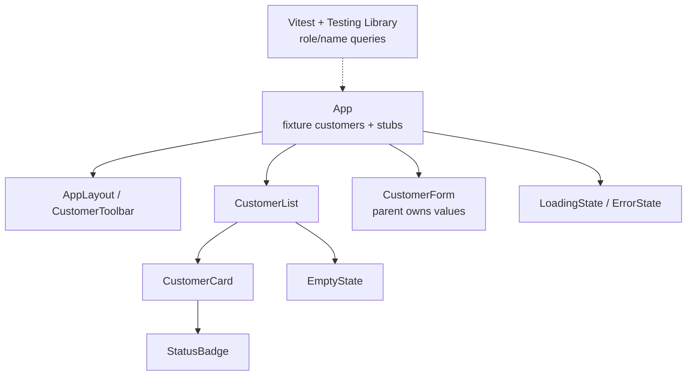

# Lab 33: React Components for the CRM Dashboard

**Module:** 33 — React Components for the CRM Dashboard  
**Duration:** ~45 minutes (timed path with starter) · Full path: 4–5 Hours

**Primary IDE:** IntelliJ IDEA Community Edition · **Optional IDE:** VS Code

| OS | How-to for this lab |
| -- | ------------------- |
| Windows | [LAB-33-WINDOWS.md](LAB-33-WINDOWS.md) |
| macOS | [LAB-33-MACOS.md](LAB-33-MACOS.md) |

---

## Activity card

| | |
| --- | --- |
| **Time** | ~45 min timed · full path 4–5 h |
| **Checkpoint** | **E** (after Ex 1→2→3→4→5→6) |
| **Must prove** | Amina+Ravi render · key=customerId · RTL by role · build green |
| **Hard gate** | Pre-lab Pass · Node 22+ · no API fetch required |

### What you will learn

Build typed, accessible presentational CRM components with Vite + Vitest.

### Enterprise context

Freeze UI contracts so Lab 34/35 can add state and fetch without markup rewrites.

### Predict

If list keys use array index and order changes — what UI bug appears?

### Debug

`getByRole` cannot find Save — what is usually missing on the control?

---

## 45-minute timed path (use starter)

> **Pacing reminder:** [PACING.md](../PACING.md) checkpoint **E**. Homework: CustomerForm labels + component notes.

In class, use the starter templates so the **core** objectives fit **~45 minutes**. The full Steps below remain for homework / extended depth.

1. Open [`starter/README.md`](starter/README.md).
2. Copy `starter/` into your `java-bootcamp/examples/…` target (see starter README).
3. Fill every `// TODO` / `TODO` — do **not** wait on a perfect prior lab; the starter includes a baseline.
4. Run the starter smoke test; evidence under `notes/screenshots/lab-33/`.
5. Mark timed-path Pass criteria in the starter README. Continue remaining GUIDE steps as homework if needed.

| Path | Time | Scope |
| ---- | ---- | ----- |
| **Timed (default)** | ~45 min | Starter TODOs + smoke test |
| **Full (extended)** | see Duration | Every Step in this GUIDE |

---

## What you'll submit (read this first)

Keep this checklist visible while you work.

| # | Deliverable |
| - | ----------- |
| 1 | Vite React-TS `crm-ui` under `lab33-crm` |
| 2 | Typed models + seed fixtures Amina / Ravi |
| 3 | `StatusBadge`, `CustomerCard`, `CustomerList`, `CustomerForm`, layout shells |
| 4 | Empty / loading / error presentation components |
| 5 | RTL behavior tests green |
| 6 | `npm run build` success |
| 7 | Component notes + evidence screenshots |
| 8 | README runbook |

**Must submit:** the items in the table above (sources + evidence + short notes).

**Do not submit:** `target/`, `node_modules/`, secrets, heap dumps, or a verbatim instructor `solution/`.

## Lab Overview

This Module 33 lab introduces the **Customer Management Platform** React client: typed models, accessible presentational components, composition with stable list keys, and React Testing Library behavior tests. You will scaffold with Vite, build `StatusBadge` / `CustomerCard` / `CustomerList` / `CustomerForm`, compose a dashboard shell, and prove visible behavior with Vitest.

## Learning Objectives

After completing this lab, you will be able to:

* Scaffold a React TypeScript CRM application with Vite
* Define typed `Customer`, `CustomerStatus`, and `CustomerDraft` models
* Create accessible `StatusBadge` and `CustomerCard` components
* Compose `CustomerList` from reusable cards with stable `customerId` keys
* Create a labeled `CustomerForm` presentation component (controlled by parent later)

## Business Scenario

The CRM stores customer identity, contact details, lifecycle status, and financial accounts. Its React client will later talk to Spring Boot; Spring persists to PostgreSQL, emits Kafka events, and protects outbound calls. This lab builds the **presentational shell** with fixtures only—no API yet.

Leadership freezes:

**No merge of CRM UI components without typed props, stable keys, visible status text (not color alone), and RTL tests that query by role.**

You own that gate for Amina (`CUS-1001` ACTIVE) and Ravi (`CUS-1002` PROSPECT) cards, empty list UX, and an accessible form shell.

Use these examples consistently:

| ID | Name | Notes |
| -- | ---- | ----- |
| `CUS-1001` | Amina Khan | `ACTIVE` — primary card fixture |
| `CUS-1002` | Ravi Singh | `PROSPECT` — second card / grid |
| `lab-request-001` | — | correlation on edit/add console callbacks |
| fictional emails | `amina.khan@example.com`, `ravi.singh@example.com` | never real PII |

**Security note for evidence.** Use fictional emails only. Never commit `.env` secrets, `node_modules/`, or `dist/`. Screenshots of the dashboard and test output go under `notes/screenshots/lab-33/`.

---

## Architecture Context
### NOW (this lab)


```mermaid
flowchart TB
  App["App<br/>fixture customers + stubs"] --> Layout["AppLayout / CustomerToolbar"]
  App --> List["CustomerList"]
  List --> Card["CustomerCard"]
  Card --> Badge["StatusBadge"]
  List --> Empty["EmptyState"]
  App --> Form["CustomerForm<br/>parent owns values"]
  App --> Shell["LoadingState / ErrorState"]
  Test["Vitest + Testing Library<br/>role/name queries"] -.-> App
```

## Prerequisites

Confirm (Lab 0 tools assumed):

* Node.js 22+; npm; Git
* Browser (Chrome/Edge) with DevTools
* No secrets committed to Git

### Pre-flight

```bash
java -version
mvn -version
```

## Worked example (read before you code)

Study this pattern once before Step 1. Your job is to apply the same idea in the Steps — do not skip ahead to a full solution.

```bash
mkdir -p ~/java-bootcamp/examples/lab33-crm
cd ~/java-bootcamp/examples/lab33-crm
npm create vite@latest crm-ui -- --template react-ts
cd crm-ui
npm install
npm install -D vitest jsdom @testing-library/react \
  @testing-library/jest-dom @testing-library/user-event
mkdir -p docs
mkdir -p ~/java-bootcamp/notes/screenshots/lab-33 src/types src/components src/data
```

**What to notice:** Match names, IDs, and failure behavior from the scenario — instructors check these.

---

## Implementation Steps

Complete each step in order. Commands assume `~/java-bootcamp/examples/lab33-crm/crm-ui` (Windows: `%USERPROFILE%\java-bootcamp\examples\lab33-crm/crm-ui`) unless noted.

---

### Step 1 — Scaffold the Vite React-TS project

**Why:** A typed Vite app is the shared base for Labs 33–36; wrong template or missing Vitest blocks every later step.

**Do this:**

```bash
mkdir -p ~/java-bootcamp/examples/lab33-crm
cd ~/java-bootcamp/examples/lab33-crm
npm create vite@latest crm-ui -- --template react-ts
cd crm-ui
npm install
npm install -D vitest jsdom @testing-library/react \
  @testing-library/jest-dom @testing-library/user-event
mkdir -p docs
mkdir -p ~/java-bootcamp/notes/screenshots/lab-33 src/types src/components src/data
```

Wire Vitest in `vite.config.ts` (`test: { environment: 'jsdom', globals: true }`) and add `"test": "vitest"` to `package.json` scripts. Replace the default Vite title with **Customer Management Platform**.

```bash
npm run dev
```

**Expected result:** Vite ready on `http://localhost:5173/`; browser shows CRM title shell.

**If it fails:** Node &lt; 22 → upgrade. Wrong template (`vanilla`) → recreate with `react-ts`. Port busy → stop other Vite or use `--port 5174`.

---

### Step 2 — Define customer types

**Why:** Status must be a closed union so `"UNKNOWN"` never ships; drafts omit server `customerId` for the form.

**Do this:** Create `src/types/customer.ts`:

```typescript
export type CustomerStatus = "PROSPECT" | "ACTIVE" | "CLOSED";

export interface Customer {
  customerId: string;
  fullName: string;
  email: string;
  status: CustomerStatus;
}

export type CustomerDraft = Omit<Customer, "customerId">;
```

Create `src/data/seedCustomers.ts` with Amina (`CUS-1001`, ACTIVE, `amina.khan@example.com`) and Ravi (`CUS-1002`, PROSPECT, `ravi.singh@example.com`).

```bash
npm run build
```

**Expected result:** TypeScript compiles. An assignment with status `"UNKNOWN"` fails type checking.

**If it fails:** Strict mode off → enable in `tsconfig`. Forgot `CLOSED` in union → add if StatusBadge needs it later; Lab 15 statuses should stay aligned.

---

### Step 3 — Create `StatusBadge`

**Why:** Status must remain understandable in grayscale; color-only badges fail accessibility review.

**Do this:** Create `src/components/StatusBadge.tsx`:

```tsx
import type { CustomerStatus } from "../types/customer";

const labels: Record<CustomerStatus, string> = {
  PROSPECT: "Prospect",
  ACTIVE: "Active",
  CLOSED: "Closed",
};

export function StatusBadge({ status }: { status: CustomerStatus }) {
  return (
    <span className={`status status--${status.toLowerCase()}`}>
      {labels[status]}
    </span>
  );
}
```

Add minimal CSS for text contrast; do not rely on color alone.

**Expected result:** ACTIVE renders visible text `Active`; CLOSED renders `Closed`; badge readable in grayscale. (No `SUSPENDED` in starter status union.)

**If it fails:** Missing label for a status → exhaustiveness error (good). Empty children → fix labels map.

---

### Step 4 — Create `CustomerCard`

**Why:** Cards are the reusable unit of the dashboard; semantic headings and mailto links must be testable by role.

**Do this:** Create `src/components/CustomerCard.tsx` that takes `customer` and `onEdit(customerId: string)`:

* `<article aria-labelledby={...}>` with heading id tied to `customerId`
* `StatusBadge`
* mailto link for email
* Edit button calling `onEdit(customer.customerId)`

Render with Amina fixture in Story-style smoke check inside `App` temporarily if needed.

**Expected result:** Heading `Amina Khan`; link `amina.khan@example.com`; status Active; Edit calls `onEdit("CUS-1001")` (log with `lab-request-001` in console if you stub).

**If it fails:** Button not found by name → use accessible name `Edit`. Props typing error → export `Props` interface.

---

### Step 5 — Compose `CustomerList` with stable keys

**Why:** Index keys remount wrong cards on sort/filter; empty arrays must not leave an inaccessible empty grid.

**Do this:** Create `EmptyState` and `CustomerList`:

```tsx
if (customers.length === 0) {
  return <EmptyState title="No customers yet" />;
}
return (
  <section aria-labelledby="customer-list-title">
    <h2 id="customer-list-title">Customers</h2>
    <div className="customer-grid">
      {customers.map((customer) => (
        <CustomerCard
          key={customer.customerId}
          customer={customer}
          onEdit={onEdit}
        />
      ))}
    </div>
  </section>
);
```

Never use array index as `key`.

**Expected result:** Two fixtures → two articles. `[]` → “No customers yet”. No empty grid in the accessibility tree.

**If it fails:** Duplicate keys → check fixture IDs. Index key used → replace with `customerId`.

---

### Step 6 — Create `CustomerForm` presentation

**Why:** Labels and `role="alert"` errors make the form RTL-queryable before Lab 34 wires state.

**Do this:** Create `CustomerForm` with labeled inputs (`htmlFor` / `id`), `aria-describedby` for errors, Save (submit) and Cancel (button) callbacks. Values and errors arrive via props (`value`, `errors`, `onChange`, `onSubmit`, `onCancel`). Use an empty draft for now.

**Expected result:** `getByLabelText("Full name")` locates the input; Tab reaches Save and Cancel; field error announced with `role="alert"`.

**If it fails:** Missing `htmlFor` → labels not associated. Submit button as `type="button"` only → fix so form `onSubmit` fires.

---

### Step 7 — Compose the dashboard in `App`

**Why:** Layout landmarks and one `main` prove composition before state complexity arrives.

**Do this:** Build `AppLayout`, `CustomerToolbar`, optional `LoadingState` / `ErrorState` shells. Wire:

```tsx
<AppLayout>
  <CustomerToolbar onAdd={() => console.log("add", "lab-request-001")} />
  <CustomerList
    customers={seedCustomers}
    onEdit={(id) => console.log("edit", id, "lab-request-001")}
  />
  <CustomerForm
    value={emptyDraft}
    errors={{}}
    onChange={() => {}}
    onSubmit={() => {}}
    onCancel={() => {}}
  />
</AppLayout>
```

Check desktop grid and a 375px viewport (no horizontal scroll); exactly one `main` landmark.

**Expected result:** Toolbar above multi-column grid; mobile one-column; one `main`.

**If it fails:** Nested `main` elements → keep landmark only in layout. Horizontal scroll → fix CSS grid gaps/min-width.

---

### Step 8 — Loading and error presentation shells

**Why:** Lab 35 will swap fixtures for request states; shells now prevent ad-hoc div soup later.

**Do this:** Implement `LoadingState` (progress / “Loading customers…”) and `ErrorState` (message + optional Retry button prop). Toggle them briefly in `App` with a local boolean to screenshot both, then default back to the list.

**Expected result:** Distinct loading and error UIs; Retry callback stub logs `lab-request-001`.

**If it fails:** Same markup as empty state → differentiate copy and roles (`status` vs `alert`).

---

### Step 9 — Write RTL behavior tests

**Why:** Implementation-detail tests (class names) break on restyle; role queries protect user-visible contracts.

**Do this:** Create `src/components/CustomerList.test.tsx`:

* Renders two cards for Amina + Ravi
* Empty state when `customers={[]}`
* Edit click calls `onEdit` with `"CUS-1001"`

```tsx
it("reports the selected customer", async () => {
  const user = userEvent.setup();
  const onEdit = vi.fn();
  render(<CustomerList customers={[amina]} onEdit={onEdit} />);
  await user.click(screen.getByRole("button", { name: "Edit" }));
  expect(onEdit).toHaveBeenCalledWith("CUS-1001");
});
```

Optionally add a `StatusBadge` or `CustomerForm` label test.

```bash
npm run test -- --run
```

**Expected result:** `CustomerList.test.tsx` (≥3 tests) green.

**If it fails:** Multiple Edit buttons → scope with `within(article)` or unique names. Vitest not configured → fix `vite.config.ts` and `setupTests` for jest-dom.

---

### Step 10 — Evidence pack and runbook

**Why:** Peers and instructors must reproduce green test/build without archaeology.

**Do this:** Complete Failure Experiments. Capture screenshots under `notes/screenshots/lab-33/`. Document in README / `docs/component-notes.md`:

```bash
npm run dev
npm run test -- --run
npm run build
```

Run tests twice for determinism. Confirm `git status` clean of `node_modules/` and `dist/`.

**Expected result:** ≥3 experiments; identical consecutive test runs; runbook complete.

**If it fails:** See Troubleshooting.

---

## Implementation Checkpoints

### Checkpoint A — Tooling

_Mark **Pass** or **Fail** in your lab notes._

| # | Confirm | Your notes |
| - | ------- | ---------- |
| 1 | `lab33-crm/crm-ui` under `~/java-bootcamp/examples/` | Pass / Fail |
| 2 | Vite React-TS + Vitest + Testing Library installed | Pass / Fail |
| 3 | `npm run build` succeeds | Pass / Fail |

### Checkpoint B — Core components

_Mark **Pass** or **Fail** in your lab notes._

| # | Confirm | Your notes |
| - | ------- | ---------- |
| 1 | Types: `Customer` / `CustomerStatus` / `CustomerDraft` | Pass / Fail |
| 2 | `StatusBadge`, `CustomerCard`, `CustomerList` (stable keys), empty state | Pass / Fail |
| 3 | `CustomerForm` with labels and alert errors | Pass / Fail |
| 4 | Fixtures Amina `CUS-1001` and Ravi `CUS-1002` | Pass / Fail |

### Checkpoint C — Composition + tests

_Mark **Pass** or **Fail** in your lab notes._

| # | Confirm | Your notes |
| - | ------- | ---------- |
| 1 | Dashboard composed with layout / toolbar / form shells | Pass / Fail |
| 2 | Loading and error presentation shells exist | Pass / Fail |
| 3 | RTL tests query by role; Edit → `CUS-1001` | Pass / Fail |
| 4 | Two consecutive `npm run test -- --run` green | Pass / Fail |

### Checkpoint D — Hygiene

_Mark **Pass** or **Fail** in your lab notes._

| # | Confirm | Your notes |
| - | ------- | ---------- |
| 1 | README runbook documents `dev` / `test` / `build` | Pass / Fail |
| 2 | No secrets / `node_modules` / `dist` committed | Pass / Fail |
| 3 | Component notes cover keys, a11y, Lab 34 handoff | Pass / Fail |

---

## Reference Commands, Configuration, and Code

### List composition excerpt

```tsx
export function CustomerList({ customers, onEdit }: Props) {
  if (!customers.length) return <EmptyState title="No customers yet" />;
  return (
    <section aria-labelledby="customers-title">
      <h2 id="customers-title">Customers</h2>
      {customers.map((c) => (
        <CustomerCard key={c.customerId} customer={c} onEdit={onEdit} />
      ))}
    </section>
  );
}
```

### Commands

```bash
cd ~/java-bootcamp/examples/lab33-crm/crm-ui
npm run dev
npm run test -- --run
npm run build
git status
```

## Failure Experiments

| # | Experiment | Observe | Restore |
| - | ---------- | ------- | ------- |
| 1 | Use `key={index}` then sort list | Wrong component reuse / focus jump | Restore `customerId` key |
| 2 | Remove status text; keep color only | Grayscale fails a11y intent | Restore label text |
| 3 | Break `htmlFor` / `id` pairing | `getByLabelText` fails | Fix label association |
| 4 | Pass `customers={[]}` | Empty state, no ghost grid | Restore seeds |
| 5 | Run `npm run test -- --run` twice | Identical results | Keep fixtures pure |

---

## Troubleshooting

| Symptom | Likely cause | Fix |
| ------- | ------------ | --- |
| Vite not found | npm create failed / wrong cwd | Recreate under `lab33-crm`; cd `crm-ui` |
| Tests not discovered | Vitest not in config | Add `test` block + script |
| `getByRole` fails | Missing accessible name | Fix button/heading text |
| TS error on status | Non-union string | Use `CustomerStatus` |
| Blank page | Import path typo | Check relative imports |
| Horizontal scroll | Fixed widths | Responsive grid / minmax |
| Index as React key | Unstable identity | Use `customer.customerId` |
| Color-only status | A11y / rubric fail | StatusBadge must include text |

## Security and Production Review

Optional — jot brief notes in your README if useful for your progress check (not a separate essay):

1. Which inputs are untrusted (browser DOM; fixtures only this lab)?
2. Where are authn/authz/validation enforced (not yet—Lab 35–36; forms presentational)?
3. Which values are sensitive—never commit real emails/phones beyond samples?

---


## Cleanup

```bash
cd ~/java-bootcamp/examples/lab33-crm/crm-ui
# stop Vite (Ctrl+C)
git status
```

Do not commit `node_modules/` or `dist/`. Keep notes screenshots.

**Keep `lab33-crm`**—Lab 34 copies it to `lab34-crm` and lifts state into `App`.


## Reflection Questions

Write **1–3 sentence** answers (not essays):

1. Which design decision most affected correctness?
2. What evidence proves the implementation works?
3. Which failure was hardest to diagnose?

---


