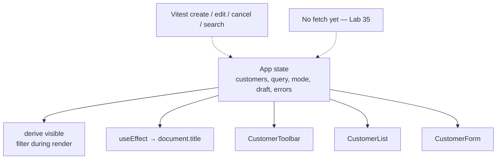
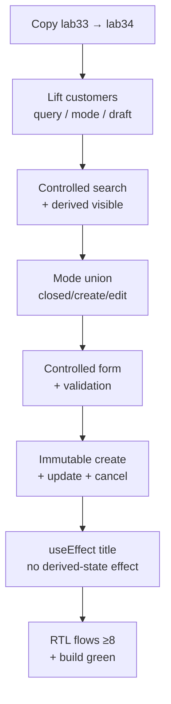

# Lab 34: React State and Event Management

**Module:** 34 — React State and Event Management  
**Lab folder:** `labs/Week 4 - Kafka, React, PostgreSQL and Resilience/module-34/lab34/`  
**Difficulty:** Intermediate  
**Duration:** 4–5 Hours

**Primary IDE:** IntelliJ IDEA Community Edition · **Optional IDE:** VS Code

| OS | How-to for this lab |
| -- | ------------------- |
| Windows | [LAB-34-WINDOWS.md](LAB-34-WINDOWS.md) |
| macOS | [LAB-34-MACOS.md](LAB-34-MACOS.md) |

> **Environment reminder:** Finish [Lab 0](../../../Week%201%20-%20Java%20and%20JVM%20Foundations/module-00/lab0/LAB-0-GUIDE.md). Use **IntelliJ IDEA Community** (primary; optional VS Code) on your laptop with **Node.js 22+** and **npm**. Work under `~/java-bootcamp` (Windows: `%USERPROFILE%\java-bootcamp`).

---

## How to follow this lab

1. Open the **Windows** or **macOS** how-to (links above) in a second tab.
2. Create/work only under your `java-bootcamp/examples/…` folder from the steps (not inside this `labs/` git clone unless a step says otherwise).
3. For each **Step N**: read **Why** (if present) → do the actions → confirm **Expected** / **Expected result** → then continue.
4. When stuck, use **Failure Experiments** / troubleshooting in this guide before asking for help.
5. Capture evidence under `notes/screenshots/` (redact secrets). Use the **Pass criteria** tables — write **Pass** or **Fail** in your notes. GitHub file view does not support clickable checkboxes.

## Lab Overview

This Module 34 lab adds **React state** to the CRM dashboard: `useState` for customers and query, controlled forms, derived filtering, immutable create/update, mutually exclusive form modes, `useEffect` for `document.title`, client validation, and interaction tests. Presentation components from Lab 33 stay props-driven; `App` becomes the single source of truth.

**Purpose.** Leadership freezes an in-browser CRUD contract before API wiring (Lab 35): list/search/create/edit must be immutable, modes must not overlap (create vs edit), and derived filter results must not live in duplicate state. Effects are for external sync only—not for maintaining filtered arrays.

**What you build (exercise).** Copy `lab33-crm` → `lab34-crm`; lift customers, query, mode, draft, and errors into `App`; control search; derive `visible`; implement create/update/cancel immutably; validate before save; sync title with `useEffect`; write RTL flow tests for create/edit/cancel/search; document state decisions.

**What success looks like.** Under `~/java-bootcamp/examples/lab34-crm/crm-ui/` you can create, edit, cancel, and filter Amina/Ravi without mutating arrays in place; title updates with visible count; `npm run test -- --run` (≥8 tests) and `npm run build` are green twice.

**Depends on Lab 33.** Need typed components, `CustomerList`, `CustomerForm`, fixtures. Finish Lab 33 first if cards/form shells are missing.

**CRM connection.** Seed `CUS-1001` / `CUS-1002`; correlation `lab-request-001` in handlers/logs. Lab 35 replaces in-memory arrays with fetch—keep `Customer` / draft shapes stable.

---

## Learning Objectives

After completing this lab, you will be able to:

* Store customer records with `useState` as the single source of truth
* Create controlled search and form inputs
* Derive filtered results during render (no duplicate filtered state)
* Lift selection and form mode into the page with a discriminated union
* Write immutable create and update handlers
* Validate fields and display accessible errors before mutation
* Synchronize `document.title` with `useEffect` (and clean up)
* Avoid effects that mirror derived state
* Test create, edit, cancel, and search flows with React Testing Library
* Document local-state limits before Lab 35’s API integration

---

## Business Scenario

The CRM stores customer identity, contact details, lifecycle status, and financial accounts. React will later call Spring Boot; this lab keeps data **in memory** so students master state mechanics without network noise.

Leadership freezes:

**No merge of CRM page state without immutable updates, derived filters, exclusive form modes, and interaction tests covering create/edit/cancel/search.**

You own that gate for Amina (`CUS-1001`), Ravi (`CUS-1002`), search `amina`, and validation failures on blank name / bad email.

Use these examples consistently:

| ID | Name | Notes |
| -- | ---- | ----- |
| `CUS-1001` | Amina Khan | `ACTIVE` — seed; search target |
| `CUS-1002` | Ravi Singh | `PROSPECT` — seed; edit target |
| `lab-request-001` | — | correlation on create/update/cancel logs |
| new temp IDs | `crypto.randomUUID()` or `CUS-lab-*` | client-side until Lab 35 |

**Security note for evidence.** Fictional emails only. Do not persist tokens. Never commit `node_modules/` or `dist/`.

---

## Architecture Context

### NOW (this lab)



### Lab flow (mermaid)



### Architecture NOW vs LATER

| Aspect | Lab 34 (NOW) | Lab 35 (LATER) |
| ------ | ------------ | -------------- |
| Storage | `useState` array | Server of record via fetch |
| IDs | Client UUID / temp | Server-assigned `CUS-*` |
| Validation | Client-only | Client + HTTP 400 field map |
| Loading | Instant | loading / error / abort |

**Lab focus:** `useState`, controlled forms, derived filtering, immutable updates, lifted state, effects, and interaction tests.

---

## Prerequisites

Complete [SETUP](../../../SETUP-INSTRUCTIONS.md), [Lab 0](../../../Week%201%20-%20Java%20and%20JVM%20Foundations/module-00/lab0/LAB-0-GUIDE.md), and [Lab 33](../../module-33/lab33/LAB-33-GUIDE.md). Confirm:

* Lab 33 `crm-ui` builds and tests green
* Node 22+; npm; React DevTools recommended
* No secrets committed to Git

### Pre-flight

```bash
node --version
npm --version
ls ~/java-bootcamp/examples/lab33-crm/crm-ui
cd ~/java-bootcamp/examples/lab33-crm/crm-ui && npm run test -- --run
```

---

## Suggested Project Files

```text
~/java-bootcamp/examples/lab34-crm/
└── crm-ui/
    ├── src/
    │   ├── types/customer.ts
    │   ├── data/seedCustomers.ts
    │   ├── validation/
    │   │   └── customerValidation.ts
    │   ├── components/          (from Lab 33; props unchanged)
    │   ├── App.tsx              (lifted state + handlers)
    │   ├── App.test.tsx         (flow tests)
    │   └── main.tsx
    ├── docs/
    │   └── state-notes.md
    ├── notes/screenshots/
    ├── package.json
    ├── vite.config.ts
    ├── .gitignore
    └── README.md
```

Ignore `node_modules/`, `dist/`, tokens, and passwords.

---

## Concepts to Discuss

Write 2–3 sentences each in `docs/state-notes.md`:

1. Main state flow (events → setState → derived render)
2. Trust boundary: client validation is UX; server will re-validate (Lab 35)
3. Success/failure contracts: invalid submit shows field errors; cancel discards draft
4. Stable identity: `customerId` for edit mode and list keys
5. Retry / double-submit: disable Save while “saving” flag (soft) before API
6. Why derived `visible` must not be a second `useState`
7. Evidence: RTL flows + DevTools state screenshot
8. Two browsers: independent memory; no shared server yet
9. False confidence: mutating arrays in place “works” until Strict Mode
10. What Lab 35 changes (fetch) without rewriting mode union shapes

---

## Implementation Steps

Complete each step in order. Commands assume `~/java-bootcamp/examples/lab34-crm/crm-ui` (Windows: `%USERPROFILE%\java-bootcamp\examples\lab34-crm/crm-ui`).

---

### Step 1 — Branch Lab 33 and initialize lifted state

**Why:** List, toolbar, and form must share one source of truth before feature work sprawls.

**Do this:**

```bash
cd ~/java-bootcamp/examples
cp -r lab33-crm lab34-crm
cd lab34-crm/crm-ui
mkdir -p src/validation docs notes/screenshots
```

In `App.tsx`, seed state:

```tsx
const [customers, setCustomers] = useState<Customer[]>(seedCustomers);
const [query, setQuery] = useState("");
```

Confirm DevTools: `customers.length === 2`, `query === ""`.

**Expected result:** Two seed cards render; state shows `customers=2`, `query=""`.

**If it fails:** Copy missed `node_modules` → run `npm install`. Seeds missing → import Lab 33 `seedCustomers`.

---

### Step 2 — Control the search input

**Why:** Uncontrolled search diverges from React state and breaks derived filters and tests.

**Do this:** Wire `CustomerToolbar` with `query` / `setQuery` (or `onQueryChange`):

```tsx
<input
  type="search"
  aria-label="Search customers"
  value={query}
  onChange={(e) => setQuery(e.target.value)}
/>
```

**Expected result:** Typing `amina` is reflected in React state (DevTools).

**If it fails:** Input not controlled → missing `value={query}`. Label missing → add `aria-label` for RTL.

---

### Step 3 — Derive visible customers during render

**Why:** A second `filteredCustomers` state causes stale UI and effect loops.

**Do this:**

```tsx
const visible = customers.filter((c) =>
  [c.customerId, c.fullName, c.email].some((v) =>
    v.toLowerCase().includes(query.trim().toLowerCase())
  )
);
```

Pass `visible` (not `customers`) to `CustomerList`.

**Expected result:** Query `amina` → 1 card; `example.com` → 2 cards; `missing` → empty state.

**If it fails:** Filtering `customers` copy in an effect → remove that effect; derive during render.

---

### Step 4 — Model mutually exclusive form modes

**Why:** Overlapping `isEditing` + `isCreating` booleans permit impossible UI (create and edit together).

**Do this:**

```tsx
type Mode =
  | { kind: "closed" }
  | { kind: "create" }
  | { kind: "edit"; id: string };

const [mode, setMode] = useState<Mode>({ kind: "closed" });
```

Add opens create; card Edit sets `{ kind: "edit", id }`; show form only when mode is not `closed`.

**Expected result:** Mode cannot be create and edit together; TypeScript rejects overlapping fields.

**If it fails:** Using two booleans → refactor to union. Edit without id → include `id` in edit variant.

---

### Step 5 — Update controlled form fields

**Why:** Controlled inputs must update draft immutably and clear only the edited field’s error.

**Do this:** Hold `draft` and `errors` in `App` (or a colocated hook). On change:

```tsx
setDraft((prev) => ({ ...prev, [event.target.name]: event.target.value }));
setErrors((prev) => {
  const next = { ...prev };
  delete next[event.target.name];
  return next;
});
```

When entering edit mode, load draft from the selected customer (omit identity mutation of `customerId`).

**Expected result:** Typed draft remains visible; prior field error clears for that field only.

**If it fails:** Spreading into wrong object → lose other fields. Mutating `draft.fullName =` → use functional update.

---

### Step 6 — Validate before saving

**Why:** Persisting invalid drafts (blank name, bad email) poisons the in-memory store and teaches bad habits for Lab 35.

**Do this:** Create `src/validation/customerValidation.ts` returning a field→message map. On submit:

```tsx
const fieldErrors = validateCustomer(draft);
if (Object.keys(fieldErrors).length) {
  setErrors(fieldErrors);
  return;
}
```

Show errors via `CustomerForm` `role="alert"` regions from Lab 33.

**Expected result:** Blank name and invalid email show field errors; `customers` unchanged.

**If it fails:** Errors set but form not re-rendered → ensure errors are state. Validation after mutate → reorder.

---

### Step 7 — Append a new customer immutably

**Why:** In-place `push` breaks purity and confuses Strict Mode double-invoke diagnostics.

**Do this:** On valid create:

```tsx
setCustomers((prev) => [
  ...prev,
  { ...draft, customerId: crypto.randomUUID() },
]);
setMode({ kind: "closed" });
setDraft(emptyDraft);
setErrors({});
console.log("create", "lab-request-001");
```

**Expected result:** New customer appears exactly once; mode closed.

**If it fails:** Double create from Strict Mode + push → switch to functional spread. Same id twice → use UUID.

---

### Step 8 — Replace the selected customer immutably

**Why:** Edit must change only the selected id; accidental shared object mutation corrupts sibling cards.

**Do this:**

```tsx
if (mode.kind !== "edit") return;
setCustomers((prev) =>
  prev.map((c) =>
    c.customerId === mode.id ? { ...c, ...draft, customerId: c.customerId } : c
  )
);
```

Preserve original `customerId`. Log `lab-request-001`.

**Expected result:** Only selected customer fields change; Amina remains if editing Ravi.

**If it fails:** Spreading draft that includes wrong id → force `customerId: c.customerId`. Mutating `c.fullName` → clone.

---

### Step 9 — Cancel and reset safely

**Why:** Cancel must discard draft/errors without touching saved customers.

**Do this:**

```tsx
setMode({ kind: "closed" });
setDraft(emptyDraft);
setErrors({});
console.log("cancel", "lab-request-001");
```

**Expected result:** Cancel preserves saved records; form unmounts or hides.

**If it fails:** Cancel calls `setCustomers` → remove. Draft persists into next create → reset to `emptyDraft`.

---

### Step 10 — Synchronize the browser title with `useEffect`

**Why:** `document.title` is outside React; effects (with cleanup) are the correct seam.

**Do this:**

```tsx
useEffect(() => {
  const original = document.title;
  document.title = `CRM (${visible.length})`;
  return () => {
    document.title = original;
  };
}, [visible.length]);
```

**Expected result:** Title `CRM (2)` → `CRM (1)` when search yields one card.

**If it fails:** Missing dependency → stale count. Setting title during render → move into effect.

---

### Step 11 — Avoid derived-state effects

**Why:** `useEffect(() => setFiltered(...), [customers, query])` causes extra renders and is a common anti-pattern.

**Do this:** Audit `App.tsx` for any effect that writes filtered lists. Delete them. Keep `visible` as a render-time calculation. Document the ban in `docs/state-notes.md`.

**Expected result:** No render loop; no duplicate derived state in DevTools.

**If it fails:** Infinite loop → you have a derived-state effect; remove setter from effect.

---

### Step 12 — Test complete user flows

**Why:** Unit tests on helpers alone miss mode wiring bugs; full flows catch cancel/edit regressions.

**Do this:** Write `App.test.tsx` covering at least:

1. Seeds render Amina and Ravi
2. Search `amina` leaves one card
3. Create valid customer → appears once
4. Invalid create → errors; list unchanged
5. Edit Ravi → save → updated name visible
6. Cancel create → no new card
7. Empty search miss → empty state
8. Title or visible count assertion (optional)

```bash
npm run test -- --run
npm run build
```

Complete [Failure Experiments](#failure-experiments). Capture evidence. Run tests twice.

**Expected result:** ≥8 tests passed; build succeeds; consecutive runs identical.

**If it fails:** Flaky timers → remove sleeps; use `userEvent` + `findBy`. Strict Mode double invoke → ensure immutable updates.

---

## Implementation Checkpoints

### Checkpoint A — Tooling

_Mark each row **Pass** or **Fail** in your lab notes (GitHub markdown files are not interactive checklists)._

| # | Confirm | Your notes |
| - | ------- | ---------- |
| 1 | `lab34-crm/crm-ui` copied from Lab 33 and builds | Pass / Fail |
| 2 | Lifted `customers` / `query` / `mode` / `draft` / `errors` in `App` | Pass / Fail |
| 3 | Validation module present | Pass / Fail |

### Checkpoint B — Core state behavior

_Mark each row **Pass** or **Fail** in your lab notes (GitHub markdown files are not interactive checklists)._

| # | Confirm | Your notes |
| - | ------- | ---------- |
| 1 | Controlled search + derived `visible` | Pass / Fail |
| 2 | Discriminated mode union (closed / create / edit) | Pass / Fail |
| 3 | Immutable create and update; cancel preserves list | Pass / Fail |
| 4 | Field validation blocks bad saves | Pass / Fail |

### Checkpoint C — Effects + tests

_Mark each row **Pass** or **Fail** in your lab notes (GitHub markdown files are not interactive checklists)._

| # | Confirm | Your notes |
| - | ------- | ---------- |
| 1 | `useEffect` title sync with cleanup | Pass / Fail |
| 2 | No derived-state filter effects | Pass / Fail |
| 3 | ≥8 RTL flow tests green twice | Pass / Fail |
| 4 | `npm run build` succeeds | Pass / Fail |

### Checkpoint D — Hygiene

_Mark each row **Pass** or **Fail** in your lab notes (GitHub markdown files are not interactive checklists)._

| # | Confirm | Your notes |
| - | ------- | ---------- |
| 1 | State notes document anti-patterns | Pass / Fail |
| 2 | Correlation logged as `lab-request-001` | Pass / Fail |
| 3 | No secrets / `node_modules` / `dist` committed | Pass / Fail |

---

## Reference Commands, Configuration, and Code

### State + derive

```tsx
const [customers, setCustomers] = useState<Customer[]>(seed);
const [query, setQuery] = useState("");
const visible = customers.filter((c) =>
  [c.customerId, c.fullName, c.email].some((v) =>
    v.toLowerCase().includes(query.trim().toLowerCase())
  )
);
```

### Immutable update

```tsx
setCustomers((previous) =>
  previous.map((customer) =>
    customer.customerId === selectedId
      ? { ...customer, ...validDraft, customerId: customer.customerId }
      : customer
  )
);
```

### Title effect

```tsx
useEffect(() => {
  const original = document.title;
  document.title = `CRM (${visible.length})`;
  return () => {
    document.title = original;
  };
}, [visible.length]);
```

### Commands

```bash
cd ~/java-bootcamp/examples/lab34-crm/crm-ui
npm run dev
npm run test -- --run
npm run build
git status
```

### Class map

| File | Role |
| ---- | ---- |
| `App.tsx` | Lifted state + handlers |
| `customerValidation.ts` | Field error map |
| `CustomerToolbar.tsx` | Controlled search |
| `CustomerForm.tsx` | Controlled draft UI |
| `App.test.tsx` | Create/edit/cancel/search flows |

### Mode union excerpt

```tsx
type Mode =
  | { kind: "closed" }
  | { kind: "create" }
  | { kind: "edit"; id: string };

const [mode, setMode] = useState<Mode>({ kind: "closed" });

function openCreate() {
  setDraft(emptyDraft);
  setErrors({});
  setMode({ kind: "create" });
}

function openEdit(id: string) {
  const row = customers.find((c) => c.customerId === id);
  if (!row) return;
  const { customerId: _id, ...draftFields } = row;
  setDraft(draftFields);
  setErrors({});
  setMode({ kind: "edit", id });
}
```

### Validation sketch

```typescript
export function validateCustomer(draft: CustomerDraft): Record<string, string> {
  const errors: Record<string, string> = {};
  if (!draft.fullName.trim()) errors.fullName = "Full name is required";
  if (!/^[^\s@]+@[^\s@]+\.[^\s@]+$/.test(draft.email)) {
    errors.email = "Enter a valid email";
  }
  return errors;
}
```

### Interaction test sketch

```tsx
it("filters to Amina", async () => {
  const user = userEvent.setup();
  render(<App />);
  await user.type(
    screen.getByRole("searchbox", { name: /search customers/i }),
    "amina"
  );
  expect(screen.getByText("Amina Khan")).toBeInTheDocument();
  expect(screen.queryByText("Ravi Singh")).not.toBeInTheDocument();
});
```

---

## Manual Verification

1. Seeds show Amina (`CUS-1001`) and Ravi (`CUS-1002`).
2. Search `amina` → one card; clear → two cards.
3. Create valid customer → appears once; mode closes.
4. Invalid submit → field alerts; list unchanged.
5. Edit Ravi → only Ravi changes.
6. Cancel discards draft; saved rows intact.
7. Title tracks visible count.
8. No filtered-state effects in `App`.
9. ≥8 tests green twice; build green.
10. You can explain why filter is derived during render.

---

## Failure Experiments

| # | Experiment | Observe | Restore |
| - | ---------- | ------- | ------- |
| 1 | `customers.push(newRow)` instead of spread | Odd Strict Mode / stale UI | Immutable append |
| 2 | Store `filtered` in `useState` via effect | Extra renders / loops | Derive `visible` |
| 3 | Submit blank name | Field errors; no new card | Keep validation |
| 4 | Cancel after typing | Draft discarded; seeds intact | Keep cancel handler |
| 5 | Run tests twice | Identical passes | Keep isolation |

---

## Troubleshooting

| Symptom | Likely cause | Fix |
| ------- | ------------ | --- |
| Input not typing | Missing controlled `value` | Bind state |
| Stale list after edit | Mutated object in place | Map + clone |
| Infinite render | Derived-state effect | Remove effect setter |
| Double create | Push + Strict Mode | Functional `[...prev, row]` |
| Test can’t find search | Missing accessible name | `aria-label="Search customers"` |
| Title wrong | Bad effect deps | Depend on `visible.length` |

---

## Security and Production Review

Answer in README:

1. Which inputs are untrusted (all form fields; still client-only)?
2. Where are authn/authz/validation enforced (client UX now; API later)?
3. Which values are sensitive—never log real PII beyond fixtures?
4. What can be retried safely (`npm test` / refresh loses memory—expected)?
5. What happens after partial failure (validation stop; no half-written row)?
6. What would an operator monitor (Lab 35: API errors; here: test suite)?
7. Which local default is unacceptable (in-place mutation, duplicate filtered state)?
8. How are contracts versioned with Lab 35 DTO fetch (keep `Customer` shape)?

---

## Cleanup

```bash
cd ~/java-bootcamp/examples/lab34-crm/crm-ui
# stop Vite (Ctrl+C)
git status
```

Do not commit `node_modules/` or `dist/`.

**Keep `lab34-crm`**—Lab 35 adds typed fetch, AbortController, and CORS against Spring.

---

## Expected Deliverables

* `lab34-crm/crm-ui` with lifted state CRUD + search
* Discriminated form modes; immutable updates
* Client validation with accessible errors
* Title `useEffect` with cleanup; no derived-state effects
* ≥8 RTL interaction tests + green build
* State notes + evidence screenshots
* README runbook
* No secrets or generated directories committed

---

## Evaluation Rubric (100 Marks)

| Criteria | Marks |
| -------- | ----: |
| Environment and project structure | 10 |
| Core implementation (state, modes, immutable CRUD, filter) | 30 |
| Integration/configuration correctness (controlled inputs, effects) | 15 |
| Failure handling (validation + cancel + experiments) | 15 |
| Automated verification (flow tests) | 10 |
| Security and production awareness / anti-pattern discipline | 10 |
| Documentation and evidence | 10 |

**Notes:** In-place mutations or filtered-state effects → lose core marks. Happy-path-only tests → lose automated marks.

---

## Reflection Questions

Write 3–6 sentence answers:

1. Which design decision most affected correctness?
2. Which failure was hardest to diagnose?
3. What evidence proves the implementation works?
4. What breaks first at ten times the list size?
5. Which concern should move to shared infrastructure?
6. What must change before real customer data is used?
7. How does this lab connect to Labs 33 and 35?
8. What metric matters most on the CI dashboard for this gate?
9. (Forward look) Which state will become request-status enums in Lab 35?

---

## Bonus Challenges

1. Add a `saving` boolean that disables Save (practice for Lab 35).
2. Debounce search input (document why debounce is UX, not correctness).
3. Prefer `customerId` exact match boost in filter ranking.
4. Extract `useCustomerPageState` hook with the same tests.
5. Mutation-testing thought: which one-line bug still keeps tests green?
6. Document rollback if someone reintroduces filtered-state effects.

---

## Success Criteria

You are finished when:

* In-memory CRUD + search works with immutable updates
* Modes are exclusive; validation blocks bad saves; cancel is safe
* Title syncs via effect; no derived-state filter effects
* ≥8 flow tests and build are green twice
* Another student can follow your run instructions
* No production secret is hard-coded
* You can explain the Lab 35 handoff (fetch replaces seed setters)

---

## Instructor Notes

* **Live probe:** Ask student to show `visible` derivation and prove there is no `setFiltered` effect. Break immutability live and watch a test fail.
* **Assess:** Mode union, immutable create/update, validation, cancel, ≥8 meaningful flow tests.
* **Continuity:** Prefer `examples/lab34-crm/crm-ui`. Keep fixture IDs. Lab 35 should keep mode/draft shapes.
* **Common pitfalls:** Index keys backsliding; push mutations; dual booleans for mode; effect-synchronized filters; testing implementation state instead of UI.
* **Timing:** 4–5 hours. Mode union + flow tests often burn 60 minutes—encourage tests early after create path works.

---

*End of Lab 34 — React State and Event Management. Keep `lab34-crm` for Lab 35 and portfolio evidence.*
