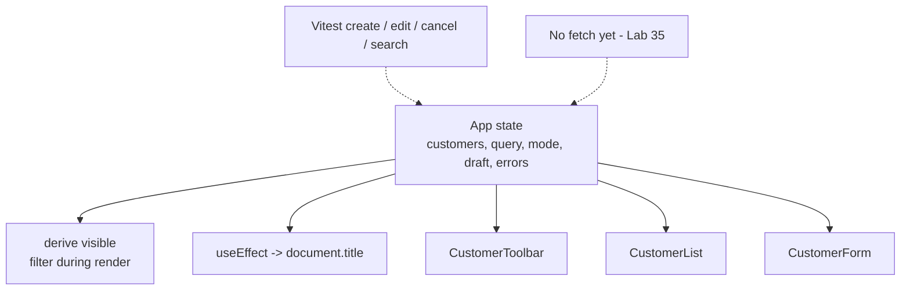

# Lab 34: React State and Event Management

**Module:** 34 — React State and Event Management  
**Duration:** ~45 minutes (timed path with starter) · Full path: 4–5 Hours

**Primary IDE:** IntelliJ IDEA Community Edition · **Optional IDE:** VS Code

| OS | How-to for this lab |
| -- | ------------------- |
| Windows | [LAB-34-WINDOWS.md](LAB-34-WINDOWS.md) |
| macOS | [LAB-34-MACOS.md](LAB-34-MACOS.md) |

---

## Activity card

| | |
| --- | --- |
| **Time** | ~45 min timed · full path 4–5 h |
| **Checkpoint** | **E** (after Ex 1→2→3→5→4→6) |
| **Must prove** | create/edit/cancel/search · validation errors · immutable updates · tests |
| **Hard gate** | Pre-lab Pass · Lab 33 tree or starter · no API required |

### What you will learn

Lift CRM state into App with controlled forms, immutable CRUD, and client validation.

### Enterprise context

Freeze in-browser CRUD contracts so Lab 35 can swap fixtures for fetch safely.

### Predict

If you `customers.push(newRow)` under Strict Mode — what can go wrong?

### Debug

Filtered list stored in useState updated by useEffect — why remove it?

---

## 45-minute timed path (use starter)

> **Pacing reminder:** [PACING.md](../PACING.md) checkpoint **E**. Homework: ≥8 RTL tests + title useEffect + state notes.

In class, use the starter templates so the **core** objectives fit **~45 minutes**. The full Steps below remain for homework / extended depth.

1. Open [`starter/README.md`](starter/README.md).
2. Copy `starter/` into your `java-bootcamp/examples/…` target (see starter README).
3. Fill every `// TODO` / `TODO` — do **not** wait on a perfect prior lab; the starter includes a baseline.
4. Run the starter smoke test; evidence under `notes/screenshots/lab-34/`.
5. Mark timed-path Pass criteria in the starter README. Continue remaining GUIDE steps as homework if needed.

| Path | Time | Scope |
| ---- | ---- | ----- |
| **Timed (default)** | ~45 min | Starter TODOs + smoke test |
| **Full (extended)** | see Duration | Every Step in this GUIDE |

---

## What you'll submit (read this first)

Keep this checklist visible while you work.

| # | Deliverable |
| - | ----------- |
| 1 | `lab34-crm/crm-ui` with lifted state CRUD + search |
| 2 | Discriminated form modes; immutable updates |
| 3 | Client validation with accessible errors |
| 4 | Title `useEffect` with cleanup; no derived-state effects |
| 5 | ≥8 RTL interaction tests + green build |
| 6 | State notes + evidence screenshots |
| 7 | README runbook |
| 8 | No secrets or generated directories committed |

**Must submit:** the items in the table above (sources + evidence + short notes).

**Do not submit:** `target/`, `node_modules/`, secrets, heap dumps, or a verbatim instructor `solution/`.

## Lab Overview

This Module 34 lab adds **React state** to the CRM dashboard: `useState` for customers and query, controlled forms, derived filtering, immutable create/update, mutually exclusive form modes, `useEffect` for `document.title`, client validation, and interaction tests. Presentation components from Lab 33 stay props-driven; `App` becomes the single source of truth.

## Learning Objectives

After completing this lab, you will be able to:

* Store customer records with `useState` as the single source of truth
* Create controlled search and form inputs
* Derive filtered results during render (no duplicate filtered state)
* Lift selection and form mode into the page with a discriminated union
* Write immutable create and update handlers

## Business Scenario

The CRM stores customer identity, contact details, lifecycle status, and financial accounts. React will later call Spring Boot; this lab keeps data **in memory** so students master state mechanics without network noise.

Leadership freezes:

**No merge of CRM page state without immutable updates, derived filters, exclusive form modes, and interaction tests covering create/edit/cancel/search.**

You own that gate for Amina (`CUS-1001`), Ravi (`CUS-1002`), search `amina`, and validation failures on blank name / bad email.

Use these examples consistently:

| ID | Name | Notes |
| -- | ---- | ----- |
| `CUS-1001` | Amina Khan | `ACTIVE` — seed; search target |
| `CUS-1002` | Ravi Singh | `PROSPECT` — seed; edit target |
| `lab-request-001` | — | correlation on create/update/cancel logs |
| new temp IDs | `crypto.randomUUID()` or `CUS-lab-*` | client-side until Lab 35 |

**Security note for evidence.** Fictional emails only. Do not persist tokens. Never commit `node_modules/` or `dist/`.

---

## Architecture Context
### NOW (this lab)


```mermaid
flowchart TB
  App["App state<br/>customers, query, mode, draft, errors"] --> Vis["derive visible<br/>filter during render"]
  App --> Title["useEffect -> document.title"]
  App --> TB["CustomerToolbar"]
  App --> List["CustomerList"]
  App --> Form["CustomerForm"]
  Test["Vitest create / edit / cancel / search"] -.-> App
  Note["No fetch yet - Lab 35"] -.-> App
```

## Prerequisites

Prior labs: [Lab 33](../../module-33/lab33/LAB-33-GUIDE.md).

Confirm (Lab 0 tools assumed):

* Lab 33 `crm-ui` builds and tests green
* Node 22+; npm; React DevTools recommended
* No secrets committed to Git

### Pre-flight

```bash
java -version
mvn -version
```

## Worked example (read before you code)

Study this pattern once before Step 1. Your job is to apply the same idea in the Steps — do not skip ahead to a full solution.

```tsx
type Mode =
  | { kind: "closed" }
  | { kind: "create" }
  | { kind: "edit"; id: string };

const [mode, setMode] = useState<Mode>({ kind: "closed" });
```

**What to notice:** Match names, IDs, and failure behavior from the scenario — graders check these.

---

## Implementation Steps

Complete each step in order. Commands assume `~/java-bootcamp/examples/lab34-crm/crm-ui` (Windows: `%USERPROFILE%\java-bootcamp\examples\lab34-crm/crm-ui`).

---

### Step 1 — Branch Lab 33 and initialize lifted state

**Why:** List, toolbar, and form must share one source of truth before feature work sprawls.

**Do this:**

```bash
cd ~/java-bootcamp/examples
cp -r lab33-crm lab34-crm
cd lab34-crm/crm-ui
mkdir -p src/validation docs ~/java-bootcamp/notes/screenshots/lab-34
```

In `App.tsx`, seed state:

```tsx
const [customers, setCustomers] = useState<Customer[]>(seedCustomers);
const [query, setQuery] = useState("");
```

Confirm DevTools: `customers.length === 2`, `query === ""`.

**Expected result:** Two seed cards render; state shows `customers=2`, `query=""`.

**If it fails:** Copy missed `node_modules` → run `npm install`. Seeds missing → import Lab 33 `seedCustomers`.

---

### Step 2 — Control the search input

**Why:** Uncontrolled search diverges from React state and breaks derived filters and tests.

**Do this:** Wire `CustomerToolbar` with `query` / `setQuery` (or `onQueryChange`):

```tsx
<input
  type="search"
  aria-label="Search customers"
  value={query}
  onChange={(e) => setQuery(e.target.value)}
/>
```

**Expected result:** Typing `amina` is reflected in React state (DevTools).

**If it fails:** Input not controlled → missing `value={query}`. Label missing → add `aria-label` for RTL.

---

### Step 3 — Derive visible customers during render

**Why:** A second `filteredCustomers` state causes stale UI and effect loops.

**Do this:**

```tsx
const visible = customers.filter((c) =>
  [c.customerId, c.fullName, c.email].some((v) =>
    v.toLowerCase().includes(query.trim().toLowerCase())
  )
);
```

Pass `visible` (not `customers`) to `CustomerList`.

**Expected result:** Query `amina` → 1 card; `example.com` → 2 cards; `missing` → empty state.

**If it fails:** Filtering `customers` copy in an effect → remove that effect; derive during render.

---

### Step 4 — Model mutually exclusive form modes

**Why:** Overlapping `isEditing` + `isCreating` booleans permit impossible UI (create and edit together).

**Do this:**

```tsx
type Mode =
  | { kind: "closed" }
  | { kind: "create" }
  | { kind: "edit"; id: string };

const [mode, setMode] = useState<Mode>({ kind: "closed" });
```

Add opens create; card Edit sets `{ kind: "edit", id }`; show form only when mode is not `closed`.

**Expected result:** Mode cannot be create and edit together; TypeScript rejects overlapping fields.

**If it fails:** Using two booleans → refactor to union. Edit without id → include `id` in edit variant.

---

### Step 5 — Update controlled form fields

**Why:** Controlled inputs must update draft immutably and clear only the edited field’s error.

**Do this:** Hold `draft` and `errors` in `App` (or a colocated hook). On change:

```tsx
setDraft((prev) => ({ ...prev, [event.target.name]: event.target.value }));
setErrors((prev) => {
  const next = { ...prev };
  delete next[event.target.name];
  return next;
});
```

When entering edit mode, load draft from the selected customer (omit identity mutation of `customerId`).

**Expected result:** Typed draft remains visible; prior field error clears for that field only.

**If it fails:** Spreading into wrong object → lose other fields. Mutating `draft.fullName =` → use functional update.

---

### Step 6 — Validate before saving

**Why:** Persisting invalid drafts (blank name, bad email) poisons the in-memory store and teaches bad habits for Lab 35.

**Do this:** Create `src/validation/customerValidation.ts` returning a field→message map. On submit:

```tsx
const fieldErrors = validateCustomer(draft);
if (Object.keys(fieldErrors).length) {
  setErrors(fieldErrors);
  return;
}
```

Show errors via `CustomerForm` `role="alert"` regions from Lab 33.

**Expected result:** Blank name and invalid email show field errors; `customers` unchanged.

**If it fails:** Errors set but form not re-rendered → ensure errors are state. Validation after mutate → reorder.

---

### Step 7 — Append a new customer immutably

**Why:** In-place `push` breaks purity and confuses Strict Mode double-invoke diagnostics.

**Do this:** On valid create:

```tsx
setCustomers((prev) => [
  ...prev,
  { ...draft, customerId: crypto.randomUUID() },
]);
setMode({ kind: "closed" });
setDraft(emptyDraft);
setErrors({});
console.log("create", "lab-request-001");
```

**Expected result:** New customer appears exactly once; mode closed.

**If it fails:** Double create from Strict Mode + push → switch to functional spread. Same id twice → use UUID.

---

### Step 8 — Replace the selected customer immutably

**Why:** Edit must change only the selected id; accidental shared object mutation corrupts sibling cards.

**Do this:**

```tsx
if (mode.kind !== "edit") return;
setCustomers((prev) =>
  prev.map((c) =>
    c.customerId === mode.id ? { ...c, ...draft, customerId: c.customerId } : c
  )
);
```

Preserve original `customerId`. Log `lab-request-001`.

**Expected result:** Only selected customer fields change; Amina remains if editing Ravi.

**If it fails:** Spreading draft that includes wrong id → force `customerId: c.customerId`. Mutating `c.fullName` → clone.

---

### Step 9 — Cancel and reset safely

**Why:** Cancel must discard draft/errors without touching saved customers.

**Do this:**

```tsx
setMode({ kind: "closed" });
setDraft(emptyDraft);
setErrors({});
console.log("cancel", "lab-request-001");
```

**Expected result:** Cancel preserves saved records; form unmounts or hides.

**If it fails:** Cancel calls `setCustomers` → remove. Draft persists into next create → reset to `emptyDraft`.

---

### Step 10 — Synchronize the browser title with `useEffect`

**Why:** `document.title` is outside React; effects (with cleanup) are the correct seam.

**Do this:**

```tsx
useEffect(() => {
  const original = document.title;
  document.title = `CRM (${visible.length})`;
  return () => {
    document.title = original;
  };
}, [visible.length]);
```

**Expected result:** Title `CRM (2)` → `CRM (1)` when search yields one card.

**If it fails:** Missing dependency → stale count. Setting title during render → move into effect.

---

### Step 11 — Avoid derived-state effects

**Why:** `useEffect(() => setFiltered(...), [customers, query])` causes extra renders and is a common anti-pattern.

**Do this:** Audit `App.tsx` for any effect that writes filtered lists. Delete them. Keep `visible` as a render-time calculation. Document the ban in `docs/state-notes.md`.

**Expected result:** No render loop; no duplicate derived state in DevTools.

**If it fails:** Infinite loop → you have a derived-state effect; remove setter from effect.

---

### Step 12 — Test complete user flows

**Why:** Unit tests on helpers alone miss mode wiring bugs; full flows catch cancel/edit regressions.

**Do this:** Write `App.test.tsx` covering at least:

1. Seeds render Amina and Ravi
2. Search `amina` leaves one card
3. Create valid customer → appears once
4. Invalid create → errors; list unchanged
5. Edit Ravi → save → updated name visible
6. Cancel create → no new card
7. Empty search miss → empty state
8. Title or visible count assertion (optional)

```bash
npm run test -- --run
npm run build
```

Complete Failure Experiments. Capture evidence. Run tests twice.

**Expected result:** ≥8 tests passed; build succeeds; consecutive runs identical.

**If it fails:** Flaky timers → remove sleeps; use `userEvent` + `findBy`. Strict Mode double invoke → ensure immutable updates.

---

## Implementation Checkpoints

### Checkpoint A — Tooling

_Mark **Pass** or **Fail** in your lab notes._

| # | Confirm | Your notes |
| - | ------- | ---------- |
| 1 | `lab34-crm/crm-ui` copied from Lab 33 and builds | Pass / Fail |
| 2 | Lifted `customers` / `query` / `mode` / `draft` / `errors` in `App` | Pass / Fail |
| 3 | Validation module present | Pass / Fail |

### Checkpoint B — Core state behavior

_Mark **Pass** or **Fail** in your lab notes._

| # | Confirm | Your notes |
| - | ------- | ---------- |
| 1 | Controlled search + derived `visible` | Pass / Fail |
| 2 | Discriminated mode union (closed / create / edit) | Pass / Fail |
| 3 | Immutable create and update; cancel preserves list | Pass / Fail |
| 4 | Field validation blocks bad saves | Pass / Fail |

### Checkpoint C — Effects + tests

_Mark **Pass** or **Fail** in your lab notes._

| # | Confirm | Your notes |
| - | ------- | ---------- |
| 1 | `useEffect` title sync with cleanup | Pass / Fail |
| 2 | No derived-state filter effects | Pass / Fail |
| 3 | ≥8 RTL flow tests green twice | Pass / Fail |
| 4 | `npm run build` succeeds | Pass / Fail |

### Checkpoint D — Hygiene

_Mark **Pass** or **Fail** in your lab notes._

| # | Confirm | Your notes |
| - | ------- | ---------- |
| 1 | State notes document anti-patterns | Pass / Fail |
| 2 | Correlation logged as `lab-request-001` | Pass / Fail |
| 3 | No secrets / `node_modules` / `dist` committed | Pass / Fail |

---

## Reference Commands, Configuration, and Code

### State + derive

```tsx
const [customers, setCustomers] = useState<Customer[]>(seed);
const [query, setQuery] = useState("");
const visible = customers.filter((c) =>
  [c.customerId, c.fullName, c.email].some((v) =>
    v.toLowerCase().includes(query.trim().toLowerCase())
  )
);
```

### Commands

```bash
cd ~/java-bootcamp/examples/lab34-crm/crm-ui
npm run dev
npm run test -- --run
npm run build
git status
```

## Failure Experiments

| # | Experiment | Observe | Restore |
| - | ---------- | ------- | ------- |
| 1 | `customers.push(newRow)` instead of spread | Odd Strict Mode / stale UI | Immutable append |
| 2 | Store `filtered` in `useState` via effect | Extra renders / loops | Derive `visible` |
| 3 | Submit blank name | Field errors; no new card | Keep validation |
| 4 | Cancel after typing | Draft discarded; seeds intact | Keep cancel handler |
| 5 | Run tests twice | Identical passes | Keep isolation |

---

## Troubleshooting

| Symptom | Likely cause | Fix |
| ------- | ------------ | --- |
| Input not typing | Missing controlled `value` | Bind state |
| Stale list after edit | Mutated object in place | Map + clone |
| Infinite render | Derived-state effect | Remove effect setter |
| Double create | Push + Strict Mode | Functional `[...prev, row]` |
| Test can’t find search | Missing accessible name | `aria-label="Search customers"` |
| Title wrong | Bad effect deps | Depend on `visible.length` |
| Create+edit both active | Mode not exclusive | Single discriminated mode state |
| Fetch in App now | Wrong module | In-memory only — Lab 35 |

## Security and Production Review

Optional — jot brief notes in your README if useful for the rubric (not a separate essay):

1. Which inputs are untrusted (all form fields; still client-only)?
2. Where are authn/authz/validation enforced (client UX now; API later)?
3. Which values are sensitive—never log real PII beyond fixtures?

---


## Cleanup

```bash
cd ~/java-bootcamp/examples/lab34-crm/crm-ui
# stop Vite (Ctrl+C)
git status
```

Do not commit `node_modules/` or `dist/`.

**Keep `lab34-crm`**—Lab 35 adds typed fetch, AbortController, and CORS against Spring.

---

## Evaluation Rubric (100 Marks)

| Criteria | Marks |
| -------- | ----: |
| Environment and project structure | 10 |
| Core implementation (state, modes, immutable CRUD, filter) | 30 |
| Integration/configuration correctness (controlled inputs, effects) | 15 |
| Failure handling (validation + cancel + experiments) | 15 |
| Automated verification (flow tests) | 10 |
| Security and production awareness / anti-pattern discipline | 10 |
| Documentation and evidence | 10 |

**Notes:** In-place mutations or filtered-state effects → lose core marks. Happy-path-only tests → lose automated marks.

---

## Reflection Questions

Write **1–3 sentence** answers (not essays):

1. Which design decision most affected correctness?
2. What evidence proves the implementation works?
3. Which failure was hardest to diagnose?

---


