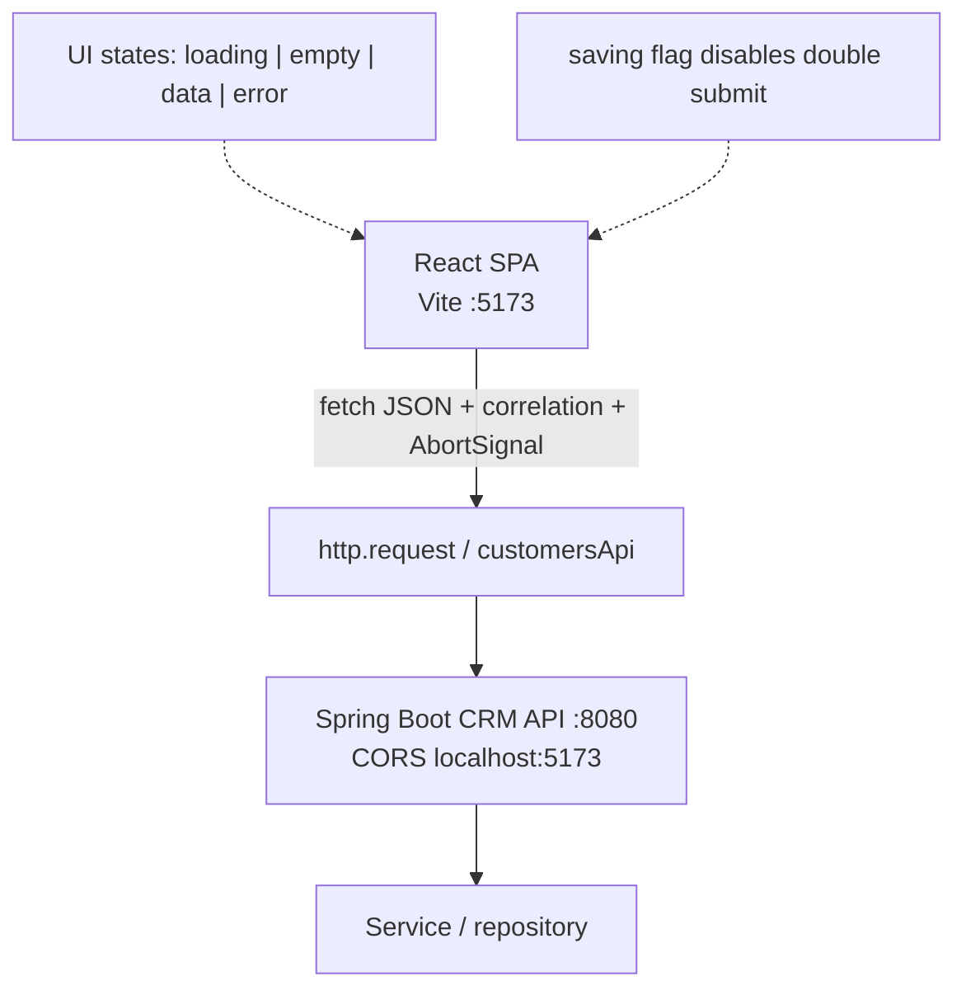
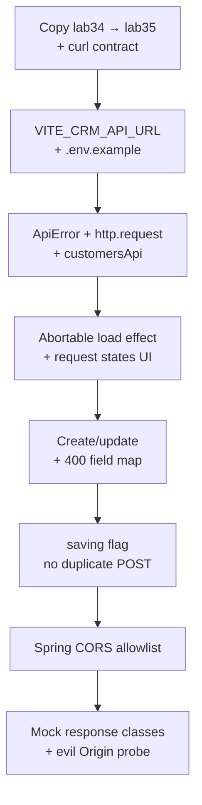

# Lab 35: Integrating React with the Spring CRM API

**Module:** 35 — Integrating React with the Spring CRM API  
**Lab folder:** `labs/Week 4 - Kafka, React, PostgreSQL and Resilience/module-35/lab35/`  
**Difficulty:** Intermediate  
**Duration:** 4–5 Hours

**Primary IDE:** IntelliJ IDEA Community Edition · **Optional IDE:** VS Code

| OS | How-to for this lab |
| -- | ------------------- |
| Windows | [LAB-35-WINDOWS.md](LAB-35-WINDOWS.md) |
| macOS | [LAB-35-MACOS.md](LAB-35-MACOS.md) |

> **Environment reminder:** Finish [Lab 0](../../../Week%201%20-%20Java%20and%20JVM%20Foundations/module-00/lab0/LAB-0-GUIDE.md). Use **IntelliJ IDEA Community** (primary; optional VS Code) on your laptop with **Node.js 22+**, **npm**, **JDK 21**, and **Maven 3.9+** (API + UI). Work under `~/java-bootcamp` (Windows: `%USERPROFILE%\java-bootcamp`).

---

## How to follow this lab

1. Open the **Windows** or **macOS** how-to (links above) in a second tab.
2. Create/work only under your `java-bootcamp/examples/…` folder from the steps (not inside this `labs/` git clone unless a step says otherwise).
3. For each **Step N**: read **Why** (if present) → do the actions → confirm **Expected** / **Expected result** → then continue.
4. When stuck, use **Failure Experiments** / troubleshooting in this guide before asking for help.
5. Capture evidence under `notes/screenshots/lab-35/` (workspace root under `java-bootcamp`; redact secrets). Use the **Pass criteria** tables — write **Pass** or **Fail** in your notes. GitHub file view does not support clickable checkboxes.

## Lab Overview

This Module 35 lab connects the React CRM SPA to the **Spring Boot** customer API: typed `fetch`, normalized `ApiError`, loading/empty/error UX, `AbortController` cancellation, duplicate-submit prevention, backend field-error mapping, restricted CORS, and failure-class tests. In-memory Lab 34 state becomes a cache of server records.

**Purpose.** Leadership freezes a browser↔API contract before frontend security (Lab 36): every request goes through one HTTP helper, every non-2xx becomes `ApiError`, obsolete loads abort cleanly, and CORS allows only the Vite origin. SOAP/XML bridges—if present—stay behind Spring; the browser speaks JSON only.

**What you build (exercise).** Copy to `lab35-crm`; document REST (or SOAP-bridge) shapes with curl; add `VITE_CRM_API_URL`; implement `ApiError` + `http.request` + `customersApi`; load with abortable effects; render request states; map HTTP 400 fields; prevent double POST; restrict Spring CORS; mock 200/400/500/network/abort tests; probe evil Origin.

**What success looks like.** Under `~/java-bootcamp/examples/lab35-crm/` React lists Amina/Ravi from Spring, create/update round-trip, CORS denies hostile origins, tests cover response classes, and two consecutive `npm test` / Spring builds stay green.

**Depends on Labs 33–34 + Spring API.** Need controlled UI state and a running `/api/customers` (or equivalent). Finish those first if UI CRUD or API is missing.

**CRM connection.** Fixtures `CUS-1001` / `CUS-1002` must match API seeds where possible; send header `X-Correlation-Id: lab-request-001` on mutating calls. Lab 36 adds tokens—keep the fetch boundary injectable for Authorization.

---

## Learning Objectives

After completing this lab, you will be able to:

* Document the REST (or SOAP-bridge) customer contract with curl evidence
* Configure a public API base URL via Vite env (no secrets in `VITE_*`)
* Write a typed fetch client and normalized `ApiError`
* Render loading, success, empty, and error states distinctly
* Cancel obsolete requests with `AbortController`
* Submit customer writes without duplicate POSTs
* Map backend validation errors to labeled form fields
* Configure restricted development CORS on Spring
* Test success, validation, server, network, and abort classes
* Probe disallowed `Origin` headers and record results

---

## Business Scenario

The CRM React client must talk to Spring Boot over HTTPS/JSON in production. Spring persists to PostgreSQL, may expose REST while optionally bridging SOAP internally, emits Kafka events, and protects outbound calls. This lab wires the **happy path and failure UX** without auth yet (Lab 36).

Leadership freezes:

**No merge of SPA↔API integration without typed fetch, AbortController cleanup, explicit request states, CORS allowlist, and tests for 2xx / 4xx / 5xx / network / abort.**

You own that gate for listing Amina (`CUS-1001`) and Ravi (`CUS-1002`), creating a draft, mapping email 400s, and rejecting `https://evil.example`.

Use these examples consistently:

| ID | Name | Notes |
| -- | ---- | ----- |
| `CUS-1001` | Amina Khan | `ACTIVE` — list/GET fixture |
| `CUS-1002` | Ravi Singh | `PROSPECT` — update fixture |
| `lab-request-001` | — | `X-Correlation-Id` on writes |
| `VITE_CRM_API_URL` | `http://localhost:8080/api` | public base only |

**Security note for evidence.** Never put secrets in `VITE_*` (they ship to the browser). Use fictional PII. Do not commit `.env` with non-example values if your policy forbids it—commit `.env.example` only.

---

## Architecture Context

### NOW (this lab)



### Lab flow (mermaid)



### Architecture NOW vs LATER

| Aspect | Lab 35 (NOW) | Lab 36 (LATER) |
| ------ | ------------ | -------------- |
| Auth | None / open lab API | Bearer in-memory + guards |
| HTTP | Typed fetch + ApiError | Same + Authorization origin check |
| CORS | Vite origin allowlist | + CSRF/CSP when cookie mode |
| Data | Server of record | Same; session expiry UX |

**Lab focus:** typed fetch integration, request states, cancellation, REST or SOAP bridge boundaries, CORS, and error UX.

---

## Prerequisites

Complete [SETUP](../../../SETUP-INSTRUCTIONS.md), [Lab 0](../../../Week%201%20-%20Java%20and%20JVM%20Foundations/module-00/lab0/LAB-0-GUIDE.md), Labs [33](../../module-33/lab33/LAB-33-GUIDE.md)–[34](../../module-34/lab34/LAB-34-GUIDE.md), and a Spring CRM API module that exposes customer JSON. Confirm:

* Lab 34 `crm-ui` builds/tests green
* Spring Boot API on `:8080` (or documented port)
* Node 22+; browser DevTools Network tab
* No secrets committed to Git

### Pre-flight

```bash
node --version
npm --version
java -version
curl -i http://localhost:8080/api/customers
ls ~/java-bootcamp/examples/lab34-crm/crm-ui
```

If curl fails, start Spring before coding the SPA client.

---

## Suggested Project Files

```text
~/java-bootcamp/examples/lab35-crm/
├── crm-ui/                              (Vite SPA)
│   ├── src/
│   │   ├── api/
│   │   │   ├── ApiError.ts
│   │   │   ├── http.ts
│   │   │   ├── customers.ts
│   │   │   └── customers.test.ts
│   │   ├── hooks/
│   │   │   └── useCustomers.ts
│   │   ├── components/ ...
│   │   ├── App.tsx / pages/CustomerPage.tsx
│   │   └── ...
│   ├── .env.example
│   ├── docs/api-integration-notes.md
│   ├── notes/screenshots/
│   ├── package.json
│   └── README.md
└── (optional sibling) spring-api notes or link to existing labXX-crm backend
    └── WebConfig / CorsConfig.java changes documented
```

If your Spring project lives elsewhere under `examples/`, document the path in README. Ignore `node_modules/`, `dist/`, `target/`, real `.env`.

---

## Concepts to Discuss

Write 2–3 sentences each in `docs/api-integration-notes.md`:

1. Main request flow (UI event → customersApi → Spring → UI state)
2. Trust boundary: browser never trusted; server validates again
3. Success/failure contracts (2xx body vs ApiError kinds)
4. Stable identity: server `customerId` after create
5. Retry/idempotency: disable duplicate POST; safe GET retry
6. Local CORS shortcut vs production allowlist/CDN origins
7. Evidence: Network waterfalls + correlation header
8. Two SPA tabs: abort/race behavior; last-write wins without ETags yet
9. False confidence: swallowing errors into empty list
10. What Lab 36 adds (tokens) without rewriting ApiError shape

---

## Implementation Steps

Complete each step in order. SPA commands assume `~/java-bootcamp/examples/lab35-crm/crm-ui`.

---

### Step 1 — Inspect the API contract

**Why:** Typed clients fail when the assumed JSON shape does not match Spring.

**Do this:**

```bash
cd ~/java-bootcamp/examples
cp -r lab34-crm lab35-crm
# ensure Spring is running, then:
curl -i http://localhost:8080/api/customers
curl -i -X POST http://localhost:8080/api/customers \
  -H "Content-Type: application/json" \
  -H "X-Correlation-Id: lab-request-001" \
  -d "{\"fullName\":\"Amina Khan\",\"email\":\"amina@example.com\",\"phone\":\"+1-555-0101\",\"status\":\"ACTIVE\"}"
```

Confirm list JSON includes (or can seed) `CUS-1001` / `CUS-1002`. Confirm the browser will only need JSON—if a SOAP bridge exists, it stays server-side.

**Expected result:** Documented list/create shapes; 2xx create returns a customer with id; notes capture fields.

**If it fails:** 404 path → fix API base or controller mapping. Connection refused → start Spring first.

---

### Step 2 — Configure the public base URL

**Why:** Hard-coded hosts break laptop vs laptop; secrets in `VITE_*` would ship to every browser.

**Do this:** Add `.env.example`:

```text
VITE_CRM_API_URL=http://localhost:8080/api
# Never place secrets in VITE_* variables — they are embedded in the client bundle.
```

Copy to local `.env` (gitignored). Read with `import.meta.env.VITE_CRM_API_URL`. Restart Vite after changes.

**Expected result:** Vite reads `localhost:8080/api` after restart; `.env.example` committed, secrets absent.

**If it fails:** Env ignored → restart Vite; confirm `VITE_` prefix. Typo `VITE_API` → match code.

---

### Step 3 — Create normalized `ApiError`

**Why:** Callers must not parse ad-hoc `response.text()` in every component.

**Do this:** `src/api/ApiError.ts` with `status`, `code`, `message`, optional `fieldErrors`, and factory `from(response)`. Network failures become `new ApiError(0, "NETWORK", "Cannot reach the CRM service")`.

**Expected result:** Network, validation, and server errors share one safe frontend type.

**If it fails:** Throwing raw `Error` only → wrap. Logging response HTML dumps → sanitize message.

---

### Step 4 — Build the fetch boundary

**Why:** One helper owns headers, empty bodies (204), and non-OK translation.

**Do this:** `src/api/http.ts`:

```typescript
export async function request<T>(path: string, init: RequestInit = {}): Promise<T> {
  const response = await fetch(`${API_URL}${path}`, {
    ...init,
    headers: {
      "Content-Type": "application/json",
      "X-Correlation-Id": "lab-request-001",
      ...init.headers,
    },
  });
  if (!response.ok) throw await ApiError.from(response);
  if (response.status === 204) return undefined as T;
  return response.json() as Promise<T>;
}
```

**Expected result:** 204 does not JSON-parse-fail; non-OK throws `ApiError`.

**If it fails:** Reading JSON on 204 → guard status. Missing CORS → continue to Step 10 after UI wired.

---

### Step 5 — Create typed customer operations

**Why:** Paths and DTOs must live in one module so Lab 36 can attach auth once.

**Do this:** `src/api/customers.ts`:

```typescript
export const customersApi = {
  list: (signal?: AbortSignal) =>
    request<Customer[]>("/customers", { signal }),
  create: (draft: CustomerDraft) =>
    request<Customer>("/customers", {
      method: "POST",
      body: JSON.stringify(draft),
    }),
  update: (id: string, draft: CustomerDraft) =>
    request<Customer>(`/customers/${encodeURIComponent(id)}`, {
      method: "PUT",
      body: JSON.stringify(draft),
    }),
};
```

**Expected result:** GET `/api/customers` returns `Customer[]` through the helper.

**If it fails:** Double `/api/api` → strip trailing slash in base URL. Wrong DTO field names → align with curl JSON.

---

### Step 6 — Cancel obsolete loads with `AbortController`

**Why:** Fast query changes or unmounts must not apply stale responses or warn about setState.

**Do this:** In `useCustomers` / page effect:

```typescript
useEffect(() => {
  const controller = new AbortController();
  let cancelled = false;
  setState({ kind: "loading" });
  customersApi
    .list(controller.signal)
    .then((data) => {
      if (!cancelled) setState({ kind: "data", data });
    })
    .catch((err) => {
      if (err.name === "AbortError" || controller.signal.aborted) return;
      if (!cancelled) setState({ kind: "error", error: err });
    });
  return () => {
    cancelled = true;
    controller.abort();
  };
}, []);
```

**Expected result:** Unmount shows canceled request in Network; no React warning.

**If it fails:** Abort treated as UI error → ignore abort in catch. Missing cleanup → add return abort.

---

### Step 7 — Render explicit request states

**Why:** Silent empty lists hide outages; operators need distinct loading vs error vs empty.

**Do this:** On the customer page:

* `loading` → Lab 33 `LoadingState` / Progress
* `data` with `length === 0` → EmptyState
* `data` with rows → CustomerList
* `error` → ErrorState with Retry (re-run load)

**Expected result:** Loading, empty, error, and data states are visually/semantically distinct.

**If it fails:** Error path shows empty → branch on `kind === "error"` first. Retry no-ops → re-invoke load function.

---

### Step 8 — Map backend field errors to the form

**Why:** Client validation is incomplete; Spring 400 field errors must land beside labels.

**Do this:** On create/update catch:

```tsx
if (error instanceof ApiError && error.status === 400) {
  setErrors(error.fieldErrors ?? { form: error.message });
  return;
}
```

Force a 400 (invalid email) against the API and confirm the Email field alert updates.

**Expected result:** 400 email message appears beside Email; list unchanged.

**If it fails:** Backend sends different error JSON → adapt `ApiError.from`. Errors not shown → pass into `CustomerForm`.

---

### Step 9 — Prevent duplicate submissions

**Why:** Double-clicks produce duplicate customers and confusing inventories.

**Do this:**

```tsx
setSaving(true);
try {
  const created = await customersApi.create(draft);
  setCustomers((prev) => [...prev, created]); // or reload list
} finally {
  setSaving(false);
}
```

Disable Save while `saving`. Prefer server-returned record over optimistic-only duplicates.

**Expected result:** Double click → one POST and one card.

**If it fails:** Two POSTs in Network → disable button synchronously on first click. Optimistic + server append → reconcile once.

---

### Step 10 — Restrict development CORS on Spring

**Why:** `*` origins teach the wrong production habit and allow hostile browser calls.

**Do this:** In Spring `WebConfig` / `CorsRegistry`:

```java
registry.addMapping("/api/**")
    .allowedOrigins("http://localhost:5173")
    .allowedMethods("GET", "POST", "PUT", "DELETE")
    .allowedHeaders("Content-Type", "Authorization", "X-Correlation-Id");
```

Restart Spring. Confirm SPA works from Vite origin.

**Expected result:** `localhost:5173` allowed; browser calls succeed with CORS headers.

**If it fails:** Preflight fails → allow OPTIONS / required headers. Wrong origin port → match Vite port.

---

### Step 11 — Test all response classes

**Why:** UI glue breaks when only happy fetch is mocked.

**Do this:** `customers.test.ts` mocks `fetch` for:

* 200 list with Amina/Ravi
* 201 create
* 400 field errors
* 500 server message → ApiError
* network failure
* abort

```bash
npm run test -- --run
npm run build
```

**Expected result:** 200/201/400/500/network/abort tests pass; build green.

**If it fails:** Unmocked real fetch → use `vi.stubGlobal('fetch', ...)`. Flaky abort → assert promise rejection kind carefully.

---

### Step 12 — Probe disallowed origins + evidence pack

**Why:** Prove CORS deny with curl; capture evidence for the security story.

**Do this:**

```bash
curl -i -H "Origin: https://evil.example" http://localhost:8080/api/customers
```

Confirm no `Access-Control-Allow-Origin: https://evil.example`. Complete [Failure Experiments](#failure-experiments). Screenshot Network for load/create/400. Run SPA tests twice. Document runbook including Spring start + Vite.

**Expected result:** Evil origin denied; ≥3 experiments; consecutive green tests; notes complete.

**If it fails:** Spring reflects any Origin → fix allowlist. See Troubleshooting.

---

## Implementation Checkpoints

### Checkpoint A — Tooling

_Mark each row **Pass** or **Fail** in your lab notes (GitHub markdown files are not interactive checklists)._

| # | Confirm | Your notes |
| - | ------- | ---------- |
| 1 | `lab35-crm/crm-ui` from Lab 34 | Pass / Fail |
| 2 | Spring API reachable; contract documented via curl | Pass / Fail |
| 3 | `.env.example` with `VITE_CRM_API_URL` (no secrets) | Pass / Fail |

### Checkpoint B — Client core

_Mark each row **Pass** or **Fail** in your lab notes (GitHub markdown files are not interactive checklists)._

| # | Confirm | Your notes |
| - | ------- | ---------- |
| 1 | `ApiError` + `http.request` + `customersApi` | Pass / Fail |
| 2 | Abortable list load; distinct UI states | Pass / Fail |
| 3 | Create/update with correlation header | Pass / Fail |
| 4 | 400 field errors mapped; saving disables duplicate POST | Pass / Fail |

### Checkpoint C — CORS + tests

_Mark each row **Pass** or **Fail** in your lab notes (GitHub markdown files are not interactive checklists)._

| # | Confirm | Your notes |
| - | ------- | ---------- |
| 1 | Spring CORS allowlist for Vite origin | Pass / Fail |
| 2 | Evil Origin probe recorded | Pass / Fail |
| 3 | Response-class tests green twice; build green | Pass / Fail |

### Checkpoint D — Hygiene

_Mark each row **Pass** or **Fail** in your lab notes (GitHub markdown files are not interactive checklists)._

| # | Confirm | Your notes |
| - | ------- | ---------- |
| 1 | Integration notes + screenshots | Pass / Fail |
| 2 | No secrets / `node_modules` / `dist` / `.env` secrets committed | Pass / Fail |
| 3 | README runbook starts Spring + Vite | Pass / Fail |

---

## Reference Commands, Configuration, and Code

### `http.ts`

```typescript
export async function request<T>(path: string, init: RequestInit = {}): Promise<T> {
  const response = await fetch(`${API_URL}${path}`, {
    ...init,
    headers: {
      "Content-Type": "application/json",
      "X-Correlation-Id": "lab-request-001",
      ...init.headers,
    },
  });
  if (!response.ok) throw await ApiError.from(response);
  if (response.status === 204) return undefined as T;
  return response.json() as Promise<T>;
}
```

### `customers.ts`

```typescript
export const customersApi = {
  list: (signal?: AbortSignal) =>
    request<Customer[]>("/customers", { signal }),
  create: (draft: CustomerDraft) =>
    request<Customer>("/customers", {
      method: "POST",
      body: JSON.stringify(draft),
    }),
  update: (id: string, draft: CustomerDraft) =>
    request<Customer>(`/customers/${encodeURIComponent(id)}`, {
      method: "PUT",
      body: JSON.stringify(draft),
    }),
};
```

### CORS Java

```java
registry.addMapping("/api/**")
    .allowedOrigins("http://localhost:5173")
    .allowedMethods("GET", "POST", "PUT", "DELETE")
    .allowedHeaders("Content-Type", "Authorization", "X-Correlation-Id");
```

### Commands

```bash
# Spring (path may vary)
cd ~/java-bootcamp/examples/lab32-crm   # or your latest Spring CRM under examples/ (often lab29/lab32)
./mvnw spring-boot:run

# SPA
cd ~/java-bootcamp/examples/lab35-crm/crm-ui
npm run dev
npm run test -- --run
npm run build
curl -i -H "Origin: https://evil.example" http://localhost:8080/api/customers
git status
```

### Class map

| File | Role |
| ---- | ---- |
| `ApiError.ts` | Normalized failure type |
| `http.ts` | fetch boundary |
| `customers.ts` | Typed CRM operations |
| `useCustomers.ts` | Abortable load hook |
| `WebConfig.java` | CORS allowlist |
| `customers.test.ts` | Response-class mocks |

---

## Manual Verification

1. curl list/create matches SPA types.
2. SPA lists Amina/Ravi from API (or seeded equivalents).
3. Loading/empty/error states are distinct.
4. Unmount/abort does not crash or warn.
5. Create returns server id; double-click → one POST.
6. Forced 400 maps to Email (or relevant) field.
7. CORS allows `:5173`; evil Origin denied.
8. Correlation header present on writes.
9. Response-class tests + build green twice.
10. You can explain why secrets never go in `VITE_*`.

---

## Failure Experiments

| # | Experiment | Observe | Restore |
| - | ---------- | ------- | ------- |
| 1 | Stop Spring; reload SPA | Network ApiError + error UI | Restart API |
| 2 | POST invalid email | 400 → field alert | Fix payload |
| 3 | Double-click Save | One POST only | Keep saving flag |
| 4 | Abort by navigating away mid-load | No setState warning | Keep AbortController |
| 5 | Evil Origin curl | No ACAO for evil | Keep allowlist |

---

## Troubleshooting

| Symptom | Likely cause | Fix |
| ------- | ------------ | --- |
| Browser CORS error | Spring allowlist / port | Match Vite origin exactly |
| `Failed to fetch` | API down / wrong URL | curl; fix `VITE_CRM_API_URL` |
| Env not applied | No restart | Restart Vite |
| JSON parse on 204 | No status guard | Handle 204 |
| Abort as error toast | Catch not ignoring abort | Ignore `AbortError` |
| Duplicate customers | No saving flag | Disable submit while pending |
| Wrong `/api/api` | Base URL + path both include api | Normalize join |

---

## Security and Production Review

Answer in README:

1. Which inputs are untrusted (all browser payloads; Origin header)?
2. Where are authn/authz/validation enforced (server validation now; auth Lab 36)?
3. Which values are sensitive—never in `VITE_*` or repo?
4. What can be retried safely (GET list; POST only with idempotency keys later)?
5. What happens after partial failure (ApiError UI; no silent empty)?
6. What would an operator monitor (API 5xx rate, CORS rejects, correlation IDs)?
7. Which local default is unacceptable (`*` CORS, secrets in Vite env)?
8. How are API contracts versioned with DTO changes (shared types + curl snapshots)?

---

## Cleanup

```bash
# stop Vite and Spring (Ctrl+C)
cd ~/java-bootcamp/examples/lab35-crm/crm-ui
git status
```

Do not commit `node_modules/`, `dist/`, or secret `.env`.

**Keep `lab35-crm`**—Lab 36 adds threat model, in-memory tokens, route guards, XSS/CSRF/CSP controls.

---

## Expected Deliverables

* Typed `ApiError` / `http` / `customersApi` with abortable loads
* Distinct loading/empty/data/error UX
* Create/update with correlation + duplicate-submit guard
* Backend 400 field mapping
* Spring CORS allowlist + evil Origin evidence
* Response-class tests + green build
* Integration notes + screenshots
* README runbook (Spring + Vite)
* No secrets or generated directories committed

---

## Evaluation Rubric (100 Marks)

| Criteria | Marks |
| -------- | ----: |
| Environment and project structure | 10 |
| Core implementation (typed client, states, abort, writes) | 30 |
| Integration/configuration correctness (env, CORS) | 15 |
| Failure handling (400/500/network/abort UX + experiments) | 15 |
| Automated verification | 10 |
| Security and production awareness (no Vite secrets, CORS) | 10 |
| Documentation and evidence | 10 |

**Notes:** Swallowing errors into empty lists → fail failure marks. `allowedOrigins("*")` left in code → honor violation.

---

## Reflection Questions

Write 3–6 sentence answers:

1. Which design decision most affected correctness?
2. Which failure was hardest to diagnose?
3. What evidence proves the implementation works?
4. What breaks first at ten times the request rate?
5. Which concern should move to shared infrastructure?
6. What must change before real customer data is used?
7. How does this lab connect to Labs 33–34 and Lab 36?
8. What metric matters most on the CI/ops dashboard for this gate?
9. (Forward look) Where will the bearer token attach without leaking to other origins?

---

## Bonus Challenges

1. Send unique `X-Correlation-Id` per request (UUID) while documenting `lab-request-001` in notes.
2. Add ETag / `If-Match` thought experiment for concurrent edits.
3. Centralize error → toast mapping without losing field errors.
4. MSW (Mock Service Worker) for browser demos offline.
5. Document rollback if CORS is widened accidentally.
6. Measure and note p95 list latency from DevTools.

---

## Success Criteria

You are finished when:

* SPA reads/writes customers through typed fetch
* Abort, loading/error UX, and duplicate-submit guard work
* CORS allowlist proven; evil Origin denied
* Response-class tests and builds are green twice
* Another student can follow Spring + Vite instructions
* No production secret is hard-coded in Vite env
* You can explain the Lab 36 auth attachment point

---

## Instructor Notes

* **Live probe:** Open Network: show correlation header, one POST on double-click, abort on unmount. Curl evil Origin and ask what header must be absent.
* **Assess:** ApiError normalization, abort cleanup, field 400 mapping, CORS allowlist, mock tests for failure classes.
* **Continuity:** Prefer `examples/lab35-crm/crm-ui`. Keep fixture IDs. Lab 36 should wrap `http.request`, not fork it.
* **Common pitfalls:** Secrets in `VITE_*`; `*` CORS; ignoring abort as error; optimistic double-append; mismatched DTO names.
* **Timing:** 4–5 hours. CORS + abort often burn 45 minutes—encourage curl contract evidence before UI polish.

---

*End of Lab 35 — Integrating React with the Spring CRM API. Keep `lab35-crm` for Lab 36 and portfolio evidence.*
