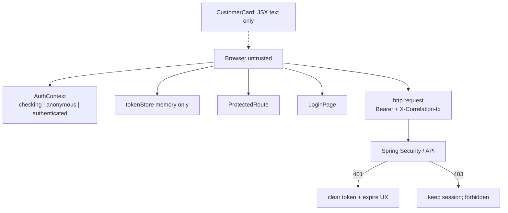
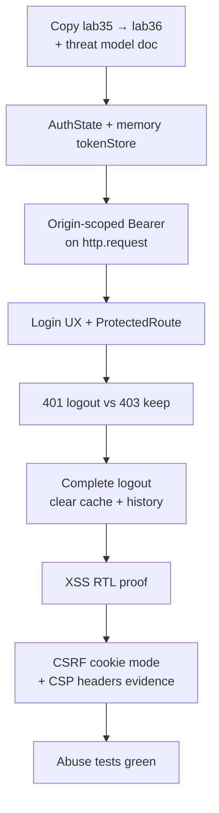

# Lab 36: Frontend Security for the CRM SPA

**Module:** 36 — Frontend Security for the CRM SPA  
**Lab folder:** `labs/Week 4 - Kafka, React, PostgreSQL and Resilience/module-36/lab36/`  
**Difficulty:** Intermediate  
**Duration:** 4–5 Hours

**Primary IDE:** IntelliJ IDEA Community Edition · **Optional IDE:** VS Code

| OS | How-to for this lab |
| -- | ------------------- |
| Windows | [LAB-36-WINDOWS.md](LAB-36-WINDOWS.md) |
| macOS | [LAB-36-MACOS.md](LAB-36-MACOS.md) |

> **Environment reminder:** Finish [Lab 0](../../../Week%201%20-%20Java%20and%20JVM%20Foundations/module-00/lab0/LAB-0-GUIDE.md). Use **IntelliJ IDEA Community** (primary; optional VS Code) on your laptop with **Node.js 22+**, **npm**, **JDK 21**, and **Maven 3.9+** (API + UI). Work under `~/java-bootcamp` (Windows: `%USERPROFILE%\java-bootcamp`).

---

## How to follow this lab

1. Open the **Windows** or **macOS** how-to (links above) in a second tab.
2. Create/work only under your `java-bootcamp/examples/…` folder from the steps (not inside this `labs/` git clone unless a step says otherwise).
3. For each **Step N**: read **Why** (if present) → do the actions → confirm **Expected** / **Expected result** → then continue.
4. When stuck, use **Failure Experiments** / troubleshooting in this guide before asking for help.
5. Capture evidence under `notes/screenshots/lab-36/` (workspace root under `java-bootcamp`; redact secrets). Use the **Pass criteria** tables — write **Pass** or **Fail** in your notes. GitHub file view does not support clickable checkboxes.

## Lab Overview

This Module 36 lab hardens the CRM SPA: threat model, authentication state, **in-memory** access tokens (not `localStorage`), origin-restricted `Authorization` headers, login UX, route guards as UX-only, 401 vs 403 handling, logout, XSS-safe rendering, cookie-mode CSRF notes, CSP/security headers, and abuse-case tests. Backend authorization remains the source of truth.

**Purpose.** Leadership freezes a browser security gate before PostgreSQL persistence labs expand data exposure: route guards are not authorization; tokens never hit persistent web storage in this exercise; XSS payloads in customer names must render as text; CSRF applies when cookie sessions are used; CSP/headers are configured at server/gateway.

**What you build (exercise).** Copy to `lab36-crm`; write `docs/security-decisions.md`; implement `AuthContext` + in-memory `tokenStore`; attach bearer only to CRM API origin; build safe login; add `ProtectedRoute`; distinguish 401/403; complete logout; prove XSS with RTL; document CSRF for cookie mode; add CSP/headers evidence; run abuse tests.

**What success looks like.** Under `~/java-bootcamp/examples/lab36-crm/` anonymous users redirect, authenticated calls send bearer only to the API origin, storage has no token, XSS test passes, CSRF missing-token evidence exists for cookie mode (or N/A with rationale for bearer-only), headers present, abuse tests green.

**Depends on Lab 35.** Need typed `http.request` / `customersApi` and Spring API. Finish API integration first if fetch boundary is missing.

**CRM connection.** Still Amina `CUS-1001` / Ravi `CUS-1002`; correlation `lab-request-001`. Lab 37 designs PostgreSQL storage—security controls here must not assume DB trust.

---

## Learning Objectives

After completing this lab, you will be able to:

* Model JWT/session, XSS, CSRF, and browser threats for the CRM SPA
* Create explicit authentication state (`checking` / `anonymous` / `authenticated`)
* Store short-lived tokens in memory only (exercise pattern)
* Attach bearer tokens only to the approved CRM API origin
* Compare memory-token vs HttpOnly cookie session trade-offs in writing
* Protect navigation while treating guards as UX—not authorization
* Handle 401 (expire), 403 (forbidden), and logout completely
* Render customer data without HTML sinks (`dangerouslySetInnerHTML`, etc.)
* Configure or document CSRF for cookie mode and CSP/security headers
* Run security abuse tests without leaking secrets in output

---

## Business Scenario

Customer PII in the SPA is a high-value browser asset. Attackers aim for token theft, XSS, CSRF (cookie mode), and open redirects after login. Spring must authorize every API call; React route guards only improve UX.

Leadership freezes:

**No merge of CRM SPA auth without a written threat model, in-memory token discipline (this lab), origin-scoped Authorization, XSS-safe rendering tests, and clear 401 vs 403 behavior.**

You own that gate for login → view Amina/Ravi → logout, plus a malicious `fullName` XSS proof.

Use these examples consistently:

| ID | Name | Notes |
| -- | ---- | ----- |
| `CUS-1001` | Amina Khan | `ACTIVE` — authorized list fixture |
| `CUS-1002` | Ravi Singh | `PROSPECT` — authorized list fixture |
| `lab-request-001` | — | correlation on authenticated calls |
| XSS probe | `` | must render as text in card |
| lab user | course-provided demo login | never real prod credentials |

**Security note for evidence.** Never commit access tokens, passwords, or private keys. Redact Authorization headers in screenshots. Prefer demo credentials from the course—not personal accounts.

---

## Architecture Context

### NOW (this lab)



### Lab flow (mermaid)



### Architecture NOW vs LATER

| Aspect | Lab 36 (NOW) | Production / later modules |
| ------ | ------------ | -------------------------- |
| Token storage | In-memory (exercise) | Prefer HttpOnly cookies / BFF where required |
| Route guards | UX only | Same — never sole authz |
| XSS | JSX default escaping + tests | + CSP harden |
| Data | API-backed | PostgreSQL (Lab 37+) still needs authz |

**Lab focus:** tokens and headers, secure session patterns, protected navigation, XSS, CSRF, CSP, and backend authorization.

---

## Prerequisites

Complete [SETUP](../../../SETUP-INSTRUCTIONS.md), [Lab 0](../../../Week%201%20-%20Java%20and%20JVM%20Foundations/module-00/lab0/LAB-0-GUIDE.md), and [Lab 35](../../module-35/lab35/LAB-35-GUIDE.md). Confirm:

* Lab 35 SPA + API integration works
* Spring Security / JWT (or session) awareness for your course stack
* Browser DevTools Application + Network panels
* No secrets committed to Git

### Pre-flight

```bash
node --version
npm --version
curl -i http://localhost:8080/api/customers
ls ~/java-bootcamp/examples/lab35-crm/crm-ui
```

---

## Suggested Project Files

```text
~/java-bootcamp/examples/lab36-crm/
└── crm-ui/
    ├── src/
    │   ├── auth/
    │   │   ├── AuthContext.tsx
    │   │   ├── tokenStore.ts
    │   │   └── ProtectedRoute.tsx
    │   ├── pages/
    │   │   └── LoginPage.tsx
    │   ├── api/http.ts              (origin-scoped Authorization)
    │   ├── security/
    │   │   ├── xss.test.tsx
    │   │   └── security.test.tsx
    │   └── ...
    ├── docs/
    │   └── security-decisions.md
    ├── notes/screenshots/
    ├── .env.example
    ├── package.json
    └── README.md
```

Document Spring Security / header changes in `docs/security-decisions.md` even if Java files live in a sibling backend project.

---

## Concepts to Discuss

Write 2–3 sentences each in `docs/security-decisions.md`:

1. Main auth flow (login → memory token → bearer on API → logout)
2. Trust boundary: browser untrusted; API authorizes every call
3. Success/failure contracts (401 expire vs 403 forbidden)
4. Stable identity: user id vs customer ids (`CUS-1001`)
5. Retry implications after 401 (re-auth; do not infinite refresh without design)
6. Memory token shortcut vs production HttpOnly/BFF
7. Evidence: DevTools storage empty of tokens; XSS test; header dump
8. Two tabs: memory token not shared (document limitation)
9. False confidence: “ProtectedRoute means secure”
10. What Lab 37 changes (data at rest) without relaxing browser controls

---

## Implementation Steps

Complete each step in order. Commands assume `~/java-bootcamp/examples/lab36-crm/crm-ui` (Windows: `%USERPROFILE%\java-bootcamp\examples\lab36-crm/crm-ui`) unless noted.

---

### Step 1 — Write the threat model

**Why:** Controls without a threat model become checkbox theatre.

**Do this:**

```bash
cd ~/java-bootcamp/examples
cp -r lab35-crm lab36-crm
cd lab36-crm/crm-ui
mkdir -p docs src/auth src/pages src/security ~/java-bootcamp/notes/screenshots/lab-36
```

In `docs/security-decisions.md` list assets (customer PII, tokens), browser inputs, trust boundaries, attacker goals (token theft, XSS, CSRF, open redirect), and mapped controls. Explicitly state: **route guards are not authorization**.

**Expected result:** Threats map to controls; doc states API authorizes every call.

**If it fails:** Only listing tools (JWT, CSP) without assets → rewrite asset-first.

---

### Step 2 — Model authentication state

**Why:** Skipping `checking` flashes protected content before session resolution.

**Do this:** `AuthContext` with:

```tsx
type AuthState =
  | { status: "checking" }
  | { status: "anonymous" }
  | { status: "authenticated"; user: User };
```

Expose `login`, `logout`, and `status`. Start as `checking`, then resolve.

**Expected result:** Checking state prevents protected-content flash on refresh.

**If it fails:** Default `authenticated` → wrong. Missing provider → wrap App.

---

### Step 3 — Create an in-memory token store

**Why:** `localStorage` tokens are trivial XSS loot; this lab forbids that pattern.

**Do this:** `src/auth/tokenStore.ts`:

```typescript
let accessToken: string | null = null;
export const tokenStore = {
  get: () => accessToken,
  set: (value: string) => {
    accessToken = value;
  },
  clear: () => {
    accessToken = null;
  },
};
```

After login, confirm Application tab: **no** token in localStorage/sessionStorage.

**Expected result:** Memory holds token; persistent web storage does not.

**If it fails:** Any `localStorage.setItem` for tokens → delete and document ban.

---

### Step 4 — Restrict bearer-token destinations

**Why:** Attaching Authorization to every fetch risks token exfiltration to third parties.

**Do this:** In `http.request`, parse request URL and compare to API origin:

```typescript
const url = new URL(path.startsWith("http") ? path : `${API_URL}${path}`);
if (url.origin === apiOrigin && token) {
  headers.set("Authorization", `Bearer ${token}`);
}
```

Still send `X-Correlation-Id: lab-request-001` on CRM calls.

**Expected result:** Bearer header goes only to CRM API origin.

**If it fails:** Relative URLs mis-parsed → normalize with `API_URL`. Token on CDN calls → tighten check.

---

### Step 5 — Build a safe login form

**Why:** Account-enumeration messages and open redirects are common SPA flaws.

**Do this:** `LoginPage` with password `autoComplete="current-password"`, disabled repeat submit, generic error (“Invalid username or password”), production HTTPS note in docs. Reject external `returnUrl` / open redirects—allow only internal paths.

**Expected result:** Generic login error; no account existence leak; external return URL rejected.

**If it fails:** Distinct “user not found” vs “bad password” → unify message.

---

### Step 6 — Guard client navigation

**Why:** Guards improve UX but must not be mistaken for security.

**Do this:** `ProtectedRoute`:

```tsx
if (status === "checking") return <LoadingPage />;
if (status === "anonymous")
  return <Navigate to="/login" replace state={{ from: location.pathname }} />;
return <Outlet />;
```

Document that API still returns 401 without a token.

**Expected result:** Anonymous users redirect; deep-link path preserved only if internal.

**If it fails:** Guard blocks but API still open without auth in Spring → fix backend authz for the lab profile.

---

### Step 7 — Distinguish 401 and 403

**Why:** Treating 403 like 401 logs users out when they merely lack a role.

**Do this:** In `http.request` / interceptor:

```typescript
if (response.status === 401) {
  tokenStore.clear();
  emit("expired"); // AuthContext → anonymous
}
if (response.status === 403) {
  throw new ForbiddenError(/* safe message */);
}
```

**Expected result:** 401 logs out; 403 preserves login and shows forbidden UX.

**If it fails:** Both clear token → split branches. No 403 test path → mock one in tests.

---

### Step 8 — Implement complete logout

**Why:** Clearing only React state leaves tokens/caches that replay in the same tab.

**Do this:** Logout: call server revoke/logout if available; `tokenStore.clear()`; clear customer cache/state; `navigate("/login", { replace: true })`.

**Expected result:** Logout clears token and customer cache; back button does not show cached PII pages without re-auth.

**If it fails:** Token remains in memory → ensure `clear()`. Cache survives → reset customer state.

---

### Step 9 — Prove customer text cannot execute (XSS)

**Why:** One `dangerouslySetInnerHTML` undoes CSRF/token work.

**Do this:** `src/security/xss.test.tsx`:

```tsx
render(
  <CustomerCard
    customer={{ ...amina, fullName: "" }}
    onEdit={() => {}}
  />
);
expect(document.querySelector("img")).toBeNull();
expect(screen.getByText(/<img onerror/)).toBeInTheDocument();
```

Ban HTML sinks in CRM UI review.

**Expected result:** Attack string renders literally; no `img`/script node.

**If it fails:** Using `dangerouslySetInnerHTML` → remove. Test queries wrong → assert no `img`.

---

### Step 10 — Add cookie-mode CSRF protection (or document N/A)

**Why:** Bearer-only SPAs differ from cookie sessions; students must know which mode they run.

**Do this:** If using cookie sessions on unsafe methods:

```typescript
fetch(`${API_URL}/customers`, {
  method: "POST",
  credentials: "include",
  headers: {
    "Content-Type": "application/json",
    "X-XSRF-TOKEN": csrfToken,
  },
  body: JSON.stringify(draft),
});
```

Prove missing CSRF → 403; valid → 201. If this lab stays bearer-only, write N/A in `security-decisions.md` explaining why CSRF differs for Authorization headers, and still describe cookie-mode controls.

**Expected result:** CSRF evidence **or** explicit N/A with correct rationale (not “CSRF does not exist”).

**If it fails:** Bearer-only but blank docs → add rationale. Cookie mode without token → Spring 403 as expected.

---

### Step 11 — Add browser security headers

**Why:** CSP and frame protections limit XSS/exfil blast radius even when bugs occur.

**Do this:** At Spring, gateway, or static host, configure at least:

```text
Content-Security-Policy: default-src 'self'; object-src 'none'; frame-ancestors 'none'
X-Content-Type-Options: nosniff
Referrer-Policy: no-referrer
```

Document HTTPS/HSTS for production. Capture `curl -I` evidence.

```bash
curl -I http://localhost:8080
```

**Expected result:** CSP, nosniff, frame-ancestors (or equivalent) present in evidence.

**If it fails:** Headers only on SPA host → document both API and UI hosts as needed for your design.

---

### Step 12 — Run security abuse tests + evidence pack

**Why:** Abuse cases prove controls under hostile input—not only happy login.

**Do this:** `security.test.tsx` (+ prior XSS test): expiry/401, forbidden 403, malicious name render, CSRF missing (or N/A assertion skipped with doc), header presence check if feasible.

```bash
npm run test -- --run
npm run build
curl -I http://localhost:8080
```

Complete [Failure Experiments](#failure-experiments). Confirm storage has no token. Redacted screenshots under `notes/screenshots/lab-36/`.

**Expected result:** Abuse-case tests pass without secrets in output; docs complete.

**If it fails:** See Troubleshooting.

---

## Implementation Checkpoints

### Checkpoint A — Tooling + model

_Mark each row **Pass** or **Fail** in your lab notes (GitHub markdown files are not interactive checklists)._

| # | Confirm | Your notes |
| - | ------- | ---------- |
| 1 | `lab36-crm` copied from Lab 35 | Pass / Fail |
| 2 | Threat model written; guards ≠ authorization stated | Pass / Fail |
| 3 | AuthState includes `checking` | Pass / Fail |

### Checkpoint B — Session mechanics

_Mark each row **Pass** or **Fail** in your lab notes (GitHub markdown files are not interactive checklists)._

| # | Confirm | Your notes |
| - | ------- | ---------- |
| 1 | In-memory `tokenStore` only | Pass / Fail |
| 2 | Bearer attached only to CRM API origin | Pass / Fail |
| 3 | Login generic errors; ProtectedRoute UX | Pass / Fail |
| 4 | 401 clears session; 403 does not; logout complete | Pass / Fail |

### Checkpoint C — Hardening proofs

_Mark each row **Pass** or **Fail** in your lab notes (GitHub markdown files are not interactive checklists)._

| # | Confirm | Your notes |
| - | ------- | ---------- |
| 1 | XSS RTL proof green | Pass / Fail |
| 2 | CSRF evidence or documented N/A for bearer-only | Pass / Fail |
| 3 | CSP/security headers evidence | Pass / Fail |
| 4 | Abuse tests + build green twice | Pass / Fail |

### Checkpoint D — Hygiene

_Mark each row **Pass** or **Fail** in your lab notes (GitHub markdown files are not interactive checklists)._

| # | Confirm | Your notes |
| - | ------- | ---------- |
| 1 | No tokens/passwords in Git or screenshots | Pass / Fail |
| 2 | Security decisions doc complete | Pass / Fail |
| 3 | `lab-request-001` on authenticated CRM calls | Pass / Fail |

---

## Reference Commands, Configuration, and Code

### `tokenStore.ts`

```typescript
let accessToken: string | null = null;
export const tokenStore = {
  get: () => accessToken,
  set: (value: string) => {
    accessToken = value;
  },
  clear: () => {
    accessToken = null;
  },
};
// Never mirror tokens to localStorage, sessionStorage, or logs.
```

### `ProtectedRoute.tsx`

```tsx
if (status === "checking") return <LoadingPage />;
if (status === "anonymous")
  return <Navigate to="/login" replace state={{ from: location.pathname }} />;
return <Outlet />;
```

### Cookie-mode CSRF request

```typescript
fetch(`${API_URL}/customers`, {
  method: "POST",
  credentials: "include",
  headers: {
    "Content-Type": "application/json",
    "X-XSRF-TOKEN": csrfToken,
  },
  body: JSON.stringify(draft),
});
```

### Commands

```bash
cd ~/java-bootcamp/examples/lab36-crm/crm-ui
npm run dev
npm run test -- --run
npm run build
curl -I http://localhost:8080
git status
```

### Class map

| File | Role |
| ---- | ---- |
| `security-decisions.md` | Threat model + trade-offs |
| `tokenStore.ts` | Memory token |
| `AuthContext.tsx` | Auth state machine |
| `ProtectedRoute.tsx` | UX navigation guard |
| `http.ts` | Origin-scoped bearer |
| `xss.test.tsx` | XSS non-execution proof |
| `security.test.tsx` | Abuse suite |

### Origin-scoped Authorization sketch

```typescript
const apiOrigin = new URL(API_URL).origin;
const token = tokenStore.get();
const url = new URL(
  path.startsWith("http") ? path : `${API_URL}${path.replace(/^\//, "")}`
);
const headers = new Headers(init.headers);
headers.set("Content-Type", "application/json");
headers.set("X-Correlation-Id", "lab-request-001");
if (url.origin === apiOrigin && token) {
  headers.set("Authorization", `Bearer ${token}`);
}
```

### Threat-model checklist (paste into decisions doc)

```text
Assets: customer PII, access token, session cookie (if any)
Threats: XSS token theft, CSRF (cookie mode), open redirect, privilege confusion
Boundaries: browser untrusted; Spring authorizes every /api call
Controls: memory token, origin-scoped bearer, JSX escaping, CSP, CSRF (cookie),
          generic login errors, 401≠403, complete logout
Non-controls: ProtectedRoute alone, hiding buttons by role alone
```

### XSS test reminder

```tsx
expect(document.querySelector("img")).toBeNull();
expect(document.querySelector("script")).toBeNull();
// Prefer getByText with a function/matcher for the literal attack string
```

---

## Manual Verification

1. Threat model maps threats → controls; guards ≠ authz.
2. Login → memory token; storage tabs empty of token.
3. Bearer only on CRM API requests in Network.
4. Anonymous deep link redirects to login.
5. Forced 401 logs out; forced 403 keeps session.
6. Logout clears token + customer cache.
7. Malicious `fullName` renders as text; XSS test green.
8. CSRF evidence or precise bearer-only N/A.
9. Security headers visible via `curl -I` (or gateway equivalent).
10. Abuse tests green twice; no secrets in logs/screenshots.

---

## Failure Experiments

| # | Experiment | Observe | Restore |
| - | ---------- | ------- | ------- |
| 1 | Put token in `localStorage` then remove | Shows ban rationale | Memory only |
| 2 | Call third-party URL with same helper | No Authorization | Origin check |
| 3 | Render XSS `fullName` | Literal text; test green | Keep JSX |
| 4 | Return 401 from API | Session cleared | Keep handler |
| 5 | Return 403 from API | Still authenticated | Keep distinction |
| 6 | Missing CSRF (cookie mode) | 403 | Send token |

---

## Troubleshooting

| Symptom | Likely cause | Fix |
| ------- | ------------ | --- |
| Flash of protected UI | No `checking` state | Add checking |
| Token in Application tab | Written to web storage | Use memory store |
| Bearer on wrong host | Origin check missing | Compare `apiOrigin` |
| 403 logs user out | Shared 401 handler | Split status branches |
| XSS test finds `img` | HTML sink used | Remove sink; use text |
| CORS + Authorization fail | Preflight headers | Allow `Authorization` |
| Open redirect after login | Unvalidated returnUrl | Allowlist internal paths |

---

## Security and Production Review

Answer in README:

1. Which inputs are untrusted (all browser input, query params, customer fields)?
2. Where are authn/authz/validation enforced (Spring Security / API; guards UX only)?
3. Which values are sensitive—tokens, passwords—and where stored (memory / HttpOnly)?
4. What can be retried safely (GETs after re-auth; not blind POST replay)?
5. What happens after partial failure (401 expire; 403 keep; CSRF 403)?
6. What would an operator monitor (401 spike, CSP reports, auth failures)?
7. Which local default is unacceptable (`localStorage` tokens, `*` CORS, open redirects)?
8. How are auth contracts versioned with API changes (header schemes, error codes)?

---

## Cleanup

```bash
# stop Vite / Spring
cd ~/java-bootcamp/examples/lab36-crm/crm-ui
tokenStore cleared via logout; confirm Application storage empty
git status
```

Do not commit tokens, `.env` secrets, `node_modules/`, or `dist/`.

**Keep `lab36-crm`**—Lab 37 designs PostgreSQL schema for customers/accounts while these browser controls remain in force.

---

## Expected Deliverables

* Threat model document
* Auth state + in-memory token store
* Origin-scoped Authorization on CRM calls
* Login + ProtectedRoute + 401/403/logout behavior
* XSS proof test; CSRF evidence or N/A rationale
* CSP/security headers evidence
* Abuse tests + green build
* Redacted screenshots + README runbook
* No secrets committed

---

## Evaluation Rubric (100 Marks)

| Criteria | Marks |
| -------- | ----: |
| Environment and project structure | 10 |
| Core implementation (auth state, token, guards, http) | 30 |
| Integration/configuration correctness (headers, CSRF/CSP) | 15 |
| Failure handling (401/403/XSS/abuse experiments) | 15 |
| Automated verification | 10 |
| Security and production awareness | 10 |
| Documentation and evidence | 10 |

**Notes:** `localStorage` tokens left in submission → honor violation. Claiming ProtectedRoute authorizes APIs → fail security marks.

---

## Reflection Questions

Write 3–6 sentence answers:

1. Which design decision most affected correctness?
2. Which failure was hardest to diagnose?
3. What evidence proves the implementation works?
4. What breaks first at ten times the session count?
5. Which concern should move to shared infrastructure?
6. What must change before real customer data is used?
7. How does this lab connect to Labs 35 and 37?
8. What metric matters most on the security dashboard for this gate?
9. (Forward look) Why does PostgreSQL schema design not replace XSS/CSP controls?

---

## Bonus Challenges

1. Implement a BFF-style cookie session note with SameSite=Lax/Strict trade-offs.
2. Add refresh-token rotation thought experiment (no long-lived memory secrets).
3. CSP report-uri / report-to dry-run documentation.
4. Role-based UI hiding **plus** 403 proof that UI hide is not authz.
5. Document rollback if someone re-adds `localStorage` tokens.
6. Automated check failing CI when `localStorage.setItem.*token` appears.

---

## Success Criteria

You are finished when:

* Threat model is written and applied
* Memory tokens + origin-scoped bearer work; storage clean
* Guards, 401/403, and logout behave correctly
* XSS test proves non-execution
* CSRF/CSP evidence (or precise N/A) exists
* Abuse tests and build are green twice
* Another student can follow your secure run instructions
* No production secret is hard-coded
* You can explain why backend authorization remains mandatory

---

## Instructor Notes

* **Live probe:** Application tab empty of tokens after login; Network Authorization only on API host; XSS fullName literal; ask “does ProtectedRoute authorize?”
* **Assess:** Threat model quality, memory store, origin check, 401≠403, XSS test, CSRF/CSP honesty.
* **Continuity:** Prefer `examples/lab36-crm/crm-ui`. Keep fixture IDs. Lab 37 should not weaken SPA controls.
* **Common pitfalls:** `localStorage` tokens; guard-as-authz myth; open redirects; logging JWTs; equating 403 with logout.
* **Timing:** 4–5 hours. Threat model + XSS/CSRF conceptual clarity often need a 20-minute mid-lab reset.

---

*End of Lab 36 — Frontend Security for the CRM SPA. Keep `lab36-crm` for Lab 37 continuity and portfolio evidence.*
