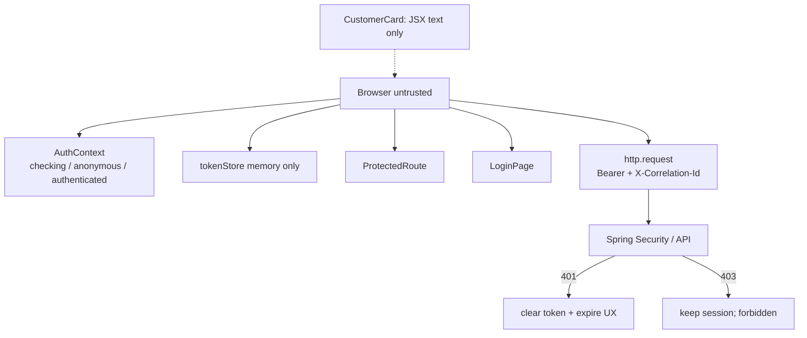

# Lab 36: Frontend Security for the CRM SPA

**Module:** 36 — Frontend Security for the CRM SPA  
**Duration:** ~45 minutes (timed path with starter) · Full path: 4–5 Hours

**Primary IDE:** IntelliJ IDEA Community Edition · **Optional IDE:** VS Code

| OS | How-to for this lab |
| -- | ------------------- |
| Windows | [LAB-36-WINDOWS.md](LAB-36-WINDOWS.md) |
| macOS | [LAB-36-MACOS.md](LAB-36-MACOS.md) |

---

## Activity card

| | |
| --- | --- |
| **Time** | ~45 min timed · full path 4–5 h |
| **Checkpoint** | **E** (after Ex 1→2→3→4→5→6) |
| **Must prove** | Memory token · ProtectedRoute · origin-scoped bearer · XSS test |
| **Hard gate** | Pre-lab Pass · Lab 35 http · no real secrets |

### What you will learn

Harden the CRM SPA with in-memory auth, XSS-safe rendering, and honest 401/403 UX.

### Enterprise context

UI guards improve UX only — Spring Security remains the authorization boundary.

### Predict

If a token appears under Application → Local Storage — does the lab pass?

### Debug

403 response logs the user out — which handler is wrong?

---

## 45-minute timed path (use starter)

> **Pacing reminder:** [PACING.md](../PACING.md) checkpoint **E**. Homework: CSP headers + CSRF evidence/N/A + abuse tests.

In class, use the starter templates so the **core** objectives fit **~45 minutes**. The full Steps below remain for homework / extended depth.

1. Open [`starter/README.md`](starter/README.md).
2. Copy `starter/` into your `java-bootcamp/examples/…` target (see starter README).
3. Fill every `// TODO` / `TODO` — do **not** wait on a perfect prior lab; the starter includes a baseline.
4. Run the starter smoke test; evidence under `notes/screenshots/lab-36/`.
5. Mark timed-path Pass criteria in the starter README. Continue remaining GUIDE steps as homework if needed.

| Path | Time | Scope |
| ---- | ---- | ----- |
| **Timed (default)** | ~45 min | Starter TODOs + smoke test |
| **Full (extended)** | see Duration | Every Step in this GUIDE |

---

## What you'll submit (read this first)

Keep this checklist visible while you work.

| # | Deliverable |
| - | ----------- |
| 1 | Threat model document |
| 2 | Auth state + in-memory token store |
| 3 | Origin-scoped Authorization on CRM calls |
| 4 | Login + ProtectedRoute + 401/403/logout behavior |
| 5 | XSS proof test; CSRF evidence or N/A rationale |
| 6 | CSP/security headers evidence |
| 7 | Abuse tests + green build |
| 8 | Redacted screenshots + README runbook |

**Must submit:** the items in the table above (sources + evidence + short notes).

**Do not submit:** `target/`, `node_modules/`, secrets, heap dumps, or a verbatim instructor `solution/`.

## Lab Overview

This Module 36 lab hardens the CRM SPA: threat model, authentication state, **in-memory** access tokens (not `localStorage`), origin-restricted `Authorization` headers, login UX, route guards as UX-only, 401 vs 403 handling, logout, XSS-safe rendering, cookie-mode CSRF notes, CSP/security headers, and abuse-case tests. Backend authorization remains the source of truth.

## Learning Objectives

After completing this lab, you will be able to:

* Model JWT/session, XSS, CSRF, and browser threats for the CRM SPA
* Create explicit authentication state (`checking` / `anonymous` / `authenticated`)
* Store short-lived tokens in memory only (exercise pattern)
* Attach bearer tokens only to the approved CRM API origin
* Compare memory-token vs HttpOnly cookie session trade-offs in writing

## Business Scenario

Customer PII in the SPA is a high-value browser asset. Attackers aim for token theft, XSS, CSRF (cookie mode), and open redirects after login. Spring must authorize every API call; React route guards only improve UX.

Leadership freezes:

**No merge of CRM SPA auth without a written threat model, in-memory token discipline (this lab), origin-scoped Authorization, XSS-safe rendering tests, and clear 401 vs 403 behavior.**

You own that gate for login → view Amina/Ravi → logout, plus a malicious `fullName` XSS proof.

Use these examples consistently:

| ID | Name | Notes |
| -- | ---- | ----- |
| `CUS-1001` | Amina Khan | `ACTIVE` — authorized list fixture |
| `CUS-1002` | Ravi Singh | `PROSPECT` — authorized list fixture |
| `lab-request-001` | — | correlation on authenticated calls |
| XSS probe | `` | must render as text in card |
| lab user | course-provided demo login | never real prod credentials |

**Security note for evidence.** Never commit access tokens, passwords, or private keys. Redact Authorization headers in screenshots. Prefer demo credentials from the course—not personal accounts.

---

## Architecture Context
### NOW (this lab)


```mermaid
flowchart TB
  Browser["Browser untrusted"] --> Auth["AuthContext<br/>checking / anonymous / authenticated"]
  Browser --> Store["tokenStore memory only"]
  Browser --> Route["ProtectedRoute"]
  Browser --> Login["LoginPage"]
  Browser --> HTTP["http.request<br/>Bearer + X-Correlation-Id"]
  HTTP --> API["Spring Security / API"]
  API -->|401| Clear["clear token + expire UX"]
  API -->|403| Forbid["keep session; forbidden"]
  Card["CustomerCard: JSX text only"] -.-> Browser
```

## Prerequisites

Prior labs: [Lab 35](../../module-35/lab35/LAB-35-GUIDE.md).

Confirm (Lab 0 tools assumed):

* Lab 35 SPA + API integration works
* Spring Security / JWT (or session) awareness for your course stack
* Browser DevTools Application + Network panels
* No secrets committed to Git

### Pre-flight

```bash
java -version
mvn -version
```

## Worked example (read before you code)

Study this pattern once before Step 1. Your job is to apply the same idea in the Steps — do not skip ahead to a full solution.

```bash
npm run test -- --run
npm run build
curl -I http://localhost:8080
```

**What to notice:** Match names, IDs, and failure behavior from the scenario — instructors check these.

---

## Implementation Steps

Complete each step in order. Commands assume `~/java-bootcamp/examples/lab36-crm/crm-ui` (Windows: `%USERPROFILE%\java-bootcamp\examples\lab36-crm/crm-ui`) unless noted.

---

### Step 1 — Write the threat model

**Why:** Controls without a threat model become checkbox theatre.

**Do this:**

```bash
cd ~/java-bootcamp/examples
cp -r lab35-crm lab36-crm
cd lab36-crm/crm-ui
mkdir -p docs src/auth src/pages src/security ~/java-bootcamp/notes/screenshots/lab-36
```

In `docs/security-decisions.md` list assets (customer PII, tokens), browser inputs, trust boundaries, attacker goals (token theft, XSS, CSRF, open redirect), and mapped controls. Explicitly state: **route guards are not authorization**.

**Expected result:** Threats map to controls; doc states API authorizes every call.

**If it fails:** Only listing tools (JWT, CSP) without assets → rewrite asset-first.

---

### Step 2 — Model authentication state

**Why:** Skipping `checking` flashes protected content before session resolution.

**Do this:** `AuthContext` with:

```tsx
type AuthState =
  | { status: "checking" }
  | { status: "anonymous" }
  | { status: "authenticated"; user: User };
```

Expose `login`, `logout`, and `status`. Start as `checking`, then resolve.

**Expected result:** Checking state prevents protected-content flash on refresh.

**If it fails:** Default `authenticated` → wrong. Missing provider → wrap App.

---

### Step 3 — Create an in-memory token store

**Why:** `localStorage` tokens are trivial XSS loot; this lab forbids that pattern.

**Do this:** `src/auth/tokenStore.ts`:

```typescript
let accessToken: string | null = null;
export const tokenStore = {
  get: () => accessToken,
  set: (value: string) => {
    accessToken = value;
  },
  clear: () => {
    accessToken = null;
  },
};
```

After login, confirm Application tab: **no** token in localStorage/sessionStorage.

**Expected result:** Memory holds token; persistent web storage does not.

**If it fails:** Any `localStorage.setItem` for tokens → delete and document ban.

---

### Step 4 — Restrict bearer-token destinations

**Why:** Attaching Authorization to every fetch risks token exfiltration to third parties.

**Do this:** In `http.request`, parse request URL and compare to API origin:

```typescript
const url = new URL(path.startsWith("http") ? path : `${VITE_API_BASE_URL}${path}`);
if (url.origin === apiOrigin && token) {
  headers.set("Authorization", `Bearer ${token}`);
}
```

Still send `X-Correlation-Id: lab-request-001` on CRM calls.

**Expected result:** Bearer header goes only to CRM API origin.

**If it fails:** Relative URLs mis-parsed → normalize with `VITE_API_BASE_URL`. Token on CDN calls → tighten check.

---

### Step 5 — Build a safe login form

**Why:** Account-enumeration messages and open redirects are common SPA flaws.

**Do this:** `LoginPage` with password `autoComplete="current-password"`, disabled repeat submit, generic error (“Invalid username or password”), production HTTPS note in docs. Reject external `returnUrl` / open redirects—allow only internal paths.

**Expected result:** Generic login error; no account existence leak; external return URL rejected.

**If it fails:** Distinct “user not found” vs “bad password” → unify message.

---

### Step 6 — Guard client navigation

**Why:** Guards improve UX but must not be mistaken for security.

**Do this:** `ProtectedRoute`:

```tsx
if (status === "checking") return <LoadingPage />;
if (status === "anonymous")
  return <Navigate to="/login" replace state={{ from: location.pathname }} />;
return <Outlet />;
```

Document that API still returns 401 without a token.

**Expected result:** Anonymous users redirect; deep-link path preserved only if internal.

**If it fails:** Guard blocks but API still open without auth in Spring → fix backend authz for the lab profile.

---

### Step 7 — Distinguish 401 and 403

**Why:** Treating 403 like 401 logs users out when they merely lack a role.

**Do this:** In `http.request` / interceptor:

```typescript
if (response.status === 401) {
  tokenStore.clear();
  emit("expired"); // AuthContext → anonymous
}
if (response.status === 403) {
  throw new ForbiddenError(/* safe message */);
}
```

**Expected result:** 401 logs out; 403 preserves login and shows forbidden UX.

**If it fails:** Both clear token → split branches. No 403 test path → mock one in tests.

---

### Step 8 — Implement complete logout

**Why:** Clearing only React state leaves tokens/caches that replay in the same tab.

**Do this:** Logout: call server revoke/logout if available; `tokenStore.clear()`; clear customer cache/state; `navigate("/login", { replace: true })`.

**Expected result:** Logout clears token and customer cache; back button does not show cached PII pages without re-auth.

**If it fails:** Token remains in memory → ensure `clear()`. Cache survives → reset customer state.

---

### Step 9 — Prove customer text cannot execute (XSS)

**Why:** One `dangerouslySetInnerHTML` undoes CSRF/token work.

**Do this:** `src/security/xss.test.tsx`:

```tsx
render(
  <CustomerCard
    customer={{ ...amina, fullName: "" }}
    onEdit={() => {}}
  />
);
expect(document.querySelector("img")).toBeNull();
expect(screen.getByText(/;
if (status === "anonymous")
  return <Navigate to="/login" replace state={{ from: location.pathname }} />;
return <Outlet />;
```

### Commands

```bash
cd ~/java-bootcamp/examples/lab36-crm/crm-ui
npm run dev
npm run test -- --run
npm run build
curl -I http://localhost:8080
git status
```

### Threat-model checklist (paste into decisions doc)

```text
Assets: customer PII, access token, session cookie (if any)
Threats: XSS token theft, CSRF (cookie mode), open redirect, privilege confusion
Boundaries: browser untrusted; Spring authorizes every /api call
Controls: memory token, origin-scoped bearer, JSX escaping, CSP, CSRF (cookie),
          generic login errors, 401≠403, complete logout
Non-controls: ProtectedRoute alone, hiding buttons by role alone
```

## Failure Experiments

| # | Experiment | Observe | Restore |
| - | ---------- | ------- | ------- |
| 1 | Put token in `localStorage` then remove | Shows ban rationale | Memory only |
| 2 | Call third-party URL with same helper | No Authorization | Origin check |
| 3 | Render XSS `fullName` | Literal text; test green | Keep JSX |
| 4 | Return 401 from API | Session cleared | Keep handler |
| 5 | Return 403 from API | Still authenticated | Keep distinction |
| 6 | Missing CSRF (cookie mode) | 403 | Send token |

---

## Troubleshooting

| Symptom | Likely cause | Fix |
| ------- | ------------ | --- |
| Flash of protected UI | No `checking` state | Add checking |
| Token in Application tab | Written to web storage | Use memory store |
| Bearer on wrong host | Origin check missing | Compare `apiOrigin` |
| 403 logs user out | Shared 401 handler | Split status branches |
| XSS test finds `img` | HTML sink used | Remove sink; use text |
| CORS + Authorization fail | Preflight headers | Allow `Authorization` |
| Open redirect after login | Unvalidated returnUrl | Allowlist internal paths |
| Treating ProtectedRoute as authz | UI-only control | Backend must deny anonymous/forbidden |

## Security and Production Review

Optional — jot brief notes in your README if useful for your progress check (not a separate essay):

1. Which inputs are untrusted (all browser input, query params, customer fields)?
2. Where are authn/authz/validation enforced (Spring Security / API; guards UX only)?
3. Which values are sensitive—tokens, passwords—and where stored (memory / HttpOnly)?

---


## Cleanup

```bash
# stop Vite / Spring
cd ~/java-bootcamp/examples/lab36-crm/crm-ui
tokenStore cleared via logout; confirm Application storage empty
git status
```

Do not commit tokens, `.env` secrets, `node_modules/`, or `dist/`.

**Keep `lab36-crm`**—Lab 37 designs PostgreSQL schema for customers/accounts while these browser controls remain in force.


## Reflection Questions

Write **1–3 sentence** answers (not essays):

1. Which design decision most affected correctness?
2. What evidence proves the implementation works?
3. Which failure was hardest to diagnose?

---


