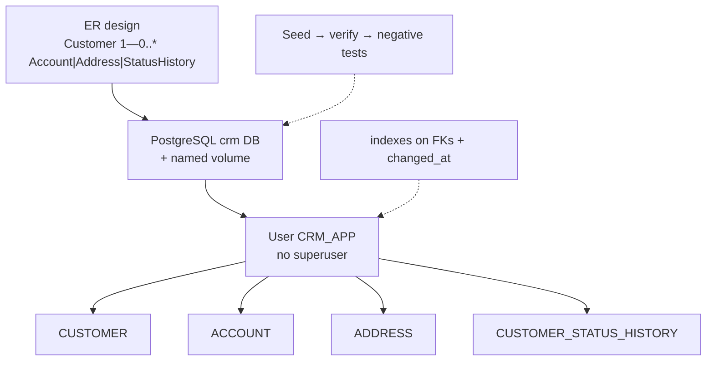
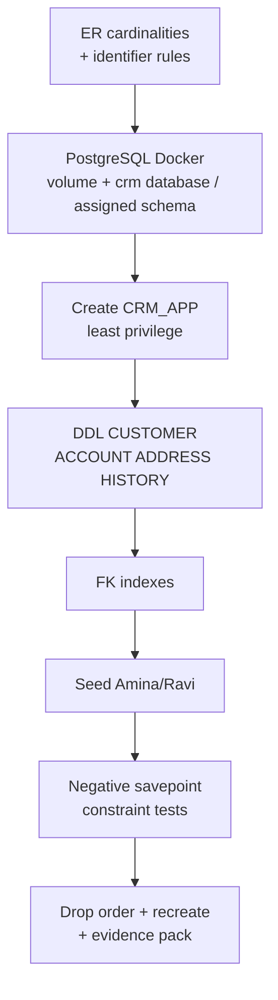

# Lab 37: PostgreSQL Design for Customers and Accounts

**Module:** 37 — PostgreSQL Design for Customers and Accounts  
**Lab folder:** `labs/Week 4 - Kafka, React, PostgreSQL and Resilience/module-37/lab37/`  
**Difficulty:** Intermediate  
**Duration:** 4–5 Hours

**Primary IDE:** IntelliJ IDEA Community Edition · **Optional IDE:** VS Code

| OS | How-to for this lab |
| -- | ------------------- |
| Windows | [LAB-37-WINDOWS.md](LAB-37-WINDOWS.md) |
| macOS | [LAB-37-MACOS.md](LAB-37-MACOS.md) |

> **Environment reminder:** Finish [Lab 0](../../../Week%201%20-%20Java%20and%20JVM%20Foundations/module-00/lab0/LAB-0-GUIDE.md). Use **IntelliJ IDEA Community** (primary; optional VS Code) on your laptop with **psql** or pgAdmin and instructor **shared PostgreSQL** credentials. Work under `~/java-bootcamp` (Windows: `%USERPROFILE%\java-bootcamp`).

---

## How to follow this lab

1. Open the **Windows** or **macOS** how-to (links above) in a second tab.
2. Create/work only under your `java-bootcamp/examples/…` folder from the steps (not inside this `labs/` git clone unless a step says otherwise).
3. For each **Step N**: read **Why** (if present) → do the actions → confirm **Expected** / **Expected result** → then continue.
4. When stuck, use **Failure Experiments** / troubleshooting in this guide before asking for help.
5. Capture evidence under `notes/screenshots/lab-37/` (workspace root under `java-bootcamp`; redact secrets). Use the **Pass criteria** tables — write **Pass** or **Fail** in your notes. GitHub file view does not support clickable checkboxes.

## Lab Overview

This Module 37 lab designs and implements the **PostgreSQL** CRM schema: ER cardinalities, stable identifiers, PostgreSQL in Docker, least-privileged `CRM_APP` user, DDL for `CUSTOMER` / `ACCOUNT` / `ADDRESS` / `CUSTOMER_STATUS_HISTORY`, named constraints, money/timestamp types, FK indexes, seed data for Amina and Ravi, negative constraint tests, and dependency-ordered cleanup scripts.

**Purpose.** Leadership freezes a data model gate before JPA mapping labs: public business ids (`CUS-1001`) are immutable, money uses exact decimal types, status is constrained, history is append-only, and the lab user is not DBA. Schema scripts must be repeatable after cleanup.

**What you build (exercise).** Create `lab37-crm` with ER notes/diagram; run PostgreSQL with a named volume; create `CRM_APP`; author `02_schema.sql` (all four entities + indexes); seed Amina (`CUS-1001` ACTIVE with account) and Ravi (`CUS-1002` PROSPECT, no account); run negative checks with savepoints; prove drop/recreate; document design decisions.

**What success looks like.** Under `~/java-bootcamp/examples/lab37-crm/` PostgreSQL crm database / assigned schema is ready, tables exist with named constraints, seeds verify, invalid status/duplicate email/orphan FK fail with constraint/SQLSTATE errors, cleanup recreates cleanly, and passwords stay out of Git.

**Depends on Labs Setup / Docker.** No React lab is strictly required, but CRM fixture IDs must align with Labs 33–36. Prior Spring/JPA modules help contextually.

**CRM connection.** Seed `CUS-1001` Amina Khan ACTIVE and `CUS-1002` Ravi Singh PROSPECT; use correlation `lab-request-001` in history `reason` or notes when recording a sample transition. Later JPA labs map these tables—keep names stable.

---

## Learning Objectives

After completing this lab, you will be able to:

* Draw a normalized PostgreSQL CRM ER model with cardinalities
* Start PostgreSQL with persistent Docker storage
* Create a least-privileged CRM schema user (no DBA)
* Write CUSTOMER, ACCOUNT, ADDRESS, and status-history DDL
* Apply named primary, unique, foreign-key, and check constraints
* Choose PostgreSQL money (`NUMERIC(19,2)`) and `TIMESTAMPTZ` types
* Index foreign keys and timeline access paths
* Seed and verify representative Amina/Ravi cases
* Prove constraints with negative tests and savepoints
* Write repeatable cleanup scripts in dependency order

---

## Business Scenario

The CRM stores customer identity, contact details, lifecycle status, postal addresses, and financial accounts. React (Labs 33–36) talks to Spring; Spring will persist to PostgreSQL. This lab defines **tables before ORM**—wrong money types or missing history cannot be patched by UI security alone.

Leadership freezes:

**No merge of CRM persistence without named constraints, exact money decimals, UTC timestamps, least-privileged schema user, and seed fixtures `CUS-1001` / `CUS-1002`.**

You own that gate for ER design, shared (or local) PostgreSQL, DDL, seeds, and negative constraint proofs.

Use these examples consistently:

| ID | Name | Notes |
| -- | ---- | ----- |
| `CUS-1001` | Amina Khan | `ACTIVE` — has ≥1 ACCOUNT + ADDRESS |
| `CUS-1002` | Ravi Singh | `PROSPECT` — zero accounts (edge case) |
| `lab-request-001` | — | sample history reason / correlation note |
| emails | `amina@example.com`, `ravi@example.com` | store normalized unique email |

**Security note for evidence.** Lab passwords (`POSTGRES_PASSWORD` / schema password, `CRM_APP`) are **lab-only**—never reuse in production; prefer `.env` / Docker env not committed. Do not seed real PII. Do not commit PostgreSQL data volumes.

---

## Architecture Context

### NOW (this lab)



### Lab flow (mermaid)



### Architecture NOW vs LATER

| Aspect | Lab 37 (NOW) | JPA / later labs |
| ------ | ------------ | ---------------- |
| Access | SQL scripts + psql | Spring Data JPA entities |
| IDs | Identity + `public_id` | Same columns mapped |
| Migrations | Hand DDL | Flyway/Liquibase later |
| Authz | DB user grants | App roles still required |

**Lab focus:** normalized CRM entities, PostgreSQL data types, keys, constraints, relationships, audit history, and DDL.

---

## Prerequisites

Complete [SETUP](../../../SETUP-INSTRUCTIONS.md) and [Lab 0](../../../Week%201%20-%20Java%20and%20JVM%20Foundations/module-00/lab0/LAB-0-GUIDE.md). Confirm:

* Docker with enough RAM/disk for PostgreSQL (often ≥2–4 GB free)
* psql or pgAdmin
* Diagram tool (draw.io, Mermaid, VS Code markdown preview)
* No secrets committed to Git

### Pre-flight

```bash
docker --version
docker ps
git --version
pwd
mkdir -p ~/java-bootcamp/examples/lab37-crm
ls ~/java-bootcamp/examples
```

Pulling the PostgreSQL image the first time can take several minutes—start early.

---

## Suggested Project Files

```text
~/java-bootcamp/examples/lab37-crm/
├── database/
│   ├── design-decisions.md
│   ├── er-diagram.png            (or er-diagram.md mermaid)
│   ├── 01_create_user.sql
│   ├── 02_schema.sql
│   ├── 03_seed.sql
│   ├── 04_verify.sql
│   └── 05_drop.sql
├── compose.yaml                  (optional PostgreSQL service)
├── .env.example                  (POSTGRES password placeholder only)
├── docs/
│   └── postgres-notes.md
├── notes/screenshots/
├── .gitignore
└── README.md
```

Ignore PostgreSQL volume data, real passwords, and local `.env`.

---

## Concepts to Discuss

Write 2–3 sentences each in `database/design-decisions.md`:

1. Main data flow (API later → CRM_APP → tables)
2. Trust boundary: app user least privilege; browser never touches DB
3. Success/failure contracts (constraint ORA vs business 4xx later)
4. Stable identity: `public_id` vs surrogate `customer_id`
5. Idempotency of seed scripts (re-run after drop)
6. Local shared (or local) PostgreSQL vs managed production PDB/service
7. Evidence operators need (DESC, constraint names, seed SELECTs)
8. Two app instances: same schema; transactions isolate writes
9. False confidence: FLOAT for money
10. What JPA labs will map without renaming public ids

---

## Implementation Steps

Complete each step in order. Paths assume `~/java-bootcamp/examples/lab37-crm`.

---

### Step 1 — Capture ER cardinalities

**Why:** Wrong optionality (e.g., forcing an account) breaks PROSPECT onboarding for Ravi.

**Do this:** In `database/design-decisions.md` and optional mermaid:

```text
Customer 1 ---- 0..* Account
Customer 1 ---- 0..* Address
Customer 1 ---- 0..* StatusHistory
```

Document delete rules (RESTRICT vs CASCADE) you choose and why history is never updated in place.

**Expected result:** ER shows optional many relationships; Ravi-without-account is valid.

**If it fails:** Mandatory account drawn → fix to `0..*`.

---

### Step 2 — Choose stable identifiers

**Why:** Surrogate keys churn; public CRM ids (`CUS-1001`) must remain immutable API identifiers.

**Do this:** Document:

```text
customer_id        — PostgreSQL identity surrogate PK
public_id          — immutable business id (CUS-1001)
email_normalized   — unique lookup (lowercased)
account_number     — unique business account identifier
```

Save `er-diagram.png` or mermaid in `database/`.

**Expected result:** Identifiers and delete rules documented before DDL.

**If it fails:** Using email as PK → reject; emails change.

---

### Step 3 — Connect to shared PostgreSQL (preferred)

**Why:** This cohort uses a shared PostgreSQL service with a per-student schema. Local Docker is only a fallback if the instructor allows it.

**Do this (shared — primary):**

1. From the instructor connection sheet, record host, port `5432`, database, username/schema, and password in a local `.env` that is **gitignored**.
2. Test connectivity:

```bash
# Example — replace with your assigned values
psql "host=$CRM_DB_HOST port=5432 dbname=crm user=crm_app" -c 'select version();'
```

**Optional local Docker fallback (only if instructor allows):**

```bash
cd ~/java-bootcamp/examples/lab37-crm
mkdir -p database docs ~/java-bootcamp/notes/screenshots/lab-37

docker run -d --name crm-postgres \
  -p 5432:5432 \
  -e POSTGRES_PASSWORD='LabOnly_Strong1' \
  -e POSTGRES_USER=crm_app -e POSTGRES_DB=crm -v crm-postgres-data:/var/lib/postgresql/data \
  postgres:17
```

Wait until logs show database ready (often several minutes):

```bash
docker logs -f crm-postgres
# look for: database system is ready to accept connections
```

Connect to crm database / assigned schema with psql/pgAdmin as system using the lab password.

**Expected result:** Postgres ready on database `crm` / assigned schema; port 5432 accepting connections.

**If it fails:** Cannot reach shared host → check VPN/firewall/instructor sheet. OOM → increase Docker memory. Name conflict → `docker rm -f crm-postgres` only if you accept reset (volume may persist).

---

### Step 4 — Create the least-privileged user

**Why:** App credentials with DBA turn every SQL injection into total loss.

**Do this:** As a privileged user on crm database / assigned schema, run `database/01_create_user.sql`:

```sql
-- Run as instructor admin / postgres (shared service); adjust names per student
CREATE USER crm_app WITH PASSWORD 'CrmLab_Strong1';
CREATE SCHEMA IF NOT EXISTS crm_app AUTHORIZATION crm_app;
GRANT CONNECT ON DATABASE crm TO crm_app;
GRANT USAGE, CREATE ON SCHEMA crm_app TO crm_app;
-- Do NOT grant superuser or CREATEDB without instructor approval.
```

Reconnect as `crm_app` with `search_path=crm_app`. Confirm you cannot drop unrelated schemas.

**Expected result:** `CRM_APP` created without DBA role; can create tables in its schema.

**If it fails:** Insufficient privileges → run as the instructor DB admin / postgres superuser. Password complexity → strengthen quotes.

---

### Step 5 — Create CUSTOMER

**Why:** Status/email constraints at the database prevent corrupt API writes.

**Do this:** In `database/02_schema.sql` (full script continues in later steps):

```sql
CREATE TABLE customer (
  customer_id        BIGINT GENERATED BY DEFAULT AS IDENTITY,
  public_id          VARCHAR(36) NOT NULL,
  full_name          VARCHAR(150) NOT NULL,
  email_normalized   VARCHAR(254) NOT NULL,
  phone              VARCHAR(30),
  status             VARCHAR(20) DEFAULT 'PROSPECT' NOT NULL,
  version_no         INTEGER DEFAULT 0 NOT NULL,
  created_at         TIMESTAMPTZ DEFAULT CURRENT_TIMESTAMP NOT NULL,
  updated_at         TIMESTAMPTZ DEFAULT CURRENT_TIMESTAMP NOT NULL,
  CONSTRAINT pk_customer PRIMARY KEY (customer_id),
  CONSTRAINT uk_customer_public UNIQUE (public_id),
  CONSTRAINT uk_customer_email UNIQUE (email_normalized),
  CONSTRAINT ck_customer_status CHECK (
    status IN ('PROSPECT', 'ACTIVE', 'SUSPENDED', 'CLOSED')
  )
);
```

**Expected result:** `CUSTOMER` table and named constraints created under `CRM_APP`.

**If it fails:** Identity syntax unsupported → check PostgreSQL version. Name length → use quoted identifiers sparingly.

---

### Step 6 — Create ACCOUNT

**Why:** Binary floating types corrupt money; FK must enforce customer existence.

**Do this:** Append to `02_schema.sql`:

```sql
CREATE TABLE account (
  account_id     BIGINT GENERATED BY DEFAULT AS IDENTITY,
  account_number VARCHAR(34) NOT NULL,
  customer_id    NUMBER NOT NULL,
  account_type   VARCHAR(20) NOT NULL,
  status         VARCHAR(20) DEFAULT 'OPEN' NOT NULL,
  balance        NUMERIC(19, 2) DEFAULT 0 NOT NULL,
  currency       CHAR(3) DEFAULT 'CAD' NOT NULL,
  opened_at      TIMESTAMPTZ DEFAULT CURRENT_TIMESTAMP NOT NULL,
  CONSTRAINT pk_account PRIMARY KEY (account_id),
  CONSTRAINT uk_account_number UNIQUE (account_number),
  CONSTRAINT fk_account_customer FOREIGN KEY (customer_id)
    REFERENCES customer (customer_id),
  CONSTRAINT ck_account_type CHECK (
    account_type IN ('CHECKING', 'SAVINGS', 'CREDIT')
  ),
  CONSTRAINT ck_account_status CHECK (
    status IN ('OPEN', 'CLOSED', 'FROZEN')
  )
);
```

**Expected result:** `ACCOUNT` uses `NUMERIC(19,2)` and valid FK to `CUSTOMER`.

**If it fails:** Using `double precision (forbidden for money)` → replace with `NUMERIC(19,2)`. FK errors → create CUSTOMER first.

---

### Step 7 — Create ADDRESS

**Why:** Repeating address columns on CUSTOMER blocks multiple typed addresses.

**Do this:**

```sql
CREATE TABLE address (
  address_id   BIGINT GENERATED BY DEFAULT AS IDENTITY,
  customer_id  NUMBER NOT NULL,
  address_type VARCHAR(20) NOT NULL,
  line1        VARCHAR(100) NOT NULL,
  line2        VARCHAR(100),
  city         VARCHAR(80) NOT NULL,
  region       VARCHAR(80),
  postal_code  VARCHAR(20),
  country_code CHAR(2) DEFAULT 'CA' NOT NULL,
  CONSTRAINT pk_address PRIMARY KEY (address_id),
  CONSTRAINT fk_address_customer FOREIGN KEY (customer_id)
    REFERENCES customer (customer_id),
  CONSTRAINT ck_address_type CHECK (
    address_type IN ('HOME', 'WORK', 'BILLING', 'OTHER')
  )
);
```

**Expected result:** `ADDRESS` supports multiple typed addresses per customer.

**If it fails:** Missing FK → add. Over-long CHAR → use VARCHAR(n) lengths that match UI constraints.

---

### Step 8 — Create status history (append-only)

**Why:** Overwriting status without history loses auditability for Amina/Ravi transitions.

**Do this:**

```sql
CREATE TABLE customer_status_history (
  history_id   BIGINT GENERATED BY DEFAULT AS IDENTITY,
  customer_id  NUMBER NOT NULL,
  old_status   VARCHAR(20),
  new_status   VARCHAR(20) NOT NULL,
  changed_by   VARCHAR(100) NOT NULL,
  reason       VARCHAR(200),
  correlation_id VARCHAR(64),
  changed_at   TIMESTAMPTZ DEFAULT CURRENT_TIMESTAMP NOT NULL,
  CONSTRAINT pk_cust_status_hist PRIMARY KEY (history_id),
  CONSTRAINT fk_hist_customer FOREIGN KEY (customer_id)
    REFERENCES customer (customer_id)
);
```

Do not update history rows in app design—insert only.

**Expected result:** History accepts ordered append-only transitions with optional `lab-request-001` correlation.

**If it fails:** Table name too long for older limits → shorten constraint names (already done above).

---

### Step 9 — Add relationship indexes

**Why:** Unindexed FKs cause locks and slow timeline queries as accounts grow.

**Do this:**

```sql
CREATE INDEX ix_account_customer ON account (customer_id);
CREATE INDEX ix_address_customer ON address (customer_id);
CREATE INDEX ix_history_customer_time
  ON customer_status_history (customer_id, changed_at);
```

Avoid duplicating unique indexes (`public_id` already unique).

**Expected result:** FK/timeline queries can use indexes (`EXPLAIN PLAN` optional evidence).

**If it fails:** SQLSTATE/01408 duplicate index → skip redundant unique column indexes.

---

### Step 10 — Seed representative records

**Why:** UI/API fixtures must match DB public ids for end-to-end stories later.

**Do this:** `database/03_seed.sql`:

```sql
INSERT INTO customer (public_id, full_name, email_normalized, phone, status)
VALUES ('CUS-1001', 'Amina Khan', 'amina@example.com', '+1-555-0101', 'ACTIVE');

INSERT INTO customer (public_id, full_name, email_normalized, phone, status)
VALUES ('CUS-1002', 'Ravi Singh', 'ravi@example.com', '+1-555-0102', 'PROSPECT');

INSERT INTO account (account_number, customer_id, account_type, balance, currency)
SELECT 'ACCT-1001-01', customer_id, 'CHECKING', 2500.00, 'CAD'
FROM customer WHERE public_id = 'CUS-1001';

INSERT INTO address (customer_id, address_type, line1, city, region, postal_code, country_code)
SELECT customer_id, 'HOME', '100 Maple St', 'Toronto', 'ON', 'M5V 2T6', 'CA'
FROM customer WHERE public_id = 'CUS-1001';

INSERT INTO customer_status_history (
  customer_id, old_status, new_status, changed_by, reason, correlation_id
)
SELECT customer_id, 'PROSPECT', 'ACTIVE', 'lab37', 'Activation', 'lab-request-001'
FROM customer WHERE public_id = 'CUS-1001';

COMMIT;
```

Verify:

```sql
SELECT public_id, status FROM customer ORDER BY public_id;
SELECT c.public_id, a.account_number, a.balance
FROM customer c LEFT JOIN account a ON a.customer_id = c.customer_id;
```

**Expected result:** `CUS-1001` has account; `CUS-1002` has none; history row for Amina with `lab-request-001`.

**If it fails:** Unique violation on re-seed → run drop or delete first. Wrong status → check constraint list.

---

### Step 11 — Run negative constraint tests

**Why:** Green seeds alone do not prove checks/uniques/FKs.

**Do this:** `database/04_verify.sql` using savepoints:

```sql
SAVEPOINT negative_test;

-- invalid status
INSERT INTO customer (public_id, full_name, email_normalized, status)
VALUES ('CUS-X', 'Bad Status', 'bad@example.com', 'UNKNOWN');
-- expect SQLSTATE/02290

ROLLBACK TO SAVEPOINT negative_test;
SAVEPOINT negative_test;

-- duplicate email
INSERT INTO customer (public_id, full_name, email_normalized, status)
VALUES ('CUS-DUPE', 'Dupe', 'amina@example.com', 'PROSPECT');
-- expect SQLSTATE/00001

ROLLBACK TO SAVEPOINT negative_test;
SAVEPOINT negative_test;

-- orphan account FK
INSERT INTO account (account_number, customer_id, account_type, balance)
VALUES ('ACCT-ORPHAN', 999999, 'CHECKING', 0);
-- expect SQLSTATE/02291

ROLLBACK TO SAVEPOINT negative_test;
COMMIT; -- no net change
```

Record SQLSTATE / error codes in notes.

**Expected result:** SQLSTATE/02290 / 00001 / 02291 appear; seeds remain intact after rollbacks.

**If it fails:** Autocommit tools → ensure rollback works. Constraint unnamed → still fails but name evidence weaker; keep named constraints.

---

### Step 12 — Clean up in dependency order + evidence pack

**Why:** Wrong drop order fails; unreproducible schema blocks peers.

**Do this:** `database/05_drop.sql`:

```sql
DROP TABLE customer_status_history CASCADE CONSTRAINTS PURGE;
DROP TABLE address CASCADE CONSTRAINTS PURGE;
DROP TABLE account CASCADE CONSTRAINTS PURGE;
DROP TABLE customer CASCADE CONSTRAINTS PURGE;
```

Re-run `02_schema.sql` + `03_seed.sql` from empty to prove repeatability. Complete [Failure Experiments](#failure-experiments). Screenshot DESCs and seed SELECTs. Document connect strings **without** committing real passwords (use `.env.example`).

Optional stop (keep volume unless resetting):

```bash
docker stop crm-postgres
```

**Expected result:** Cleanup succeeds; schema recreates from empty; README runbook complete; `git status` clean of secrets/volumes.

**If it fails:** errors on drop → children first. See Troubleshooting.

---

## Implementation Checkpoints

### Checkpoint A — Design + runtime

_Mark each row **Pass** or **Fail** in your lab notes (GitHub markdown files are not interactive checklists)._

| # | Confirm | Your notes |
| - | ------- | ---------- |
| 1 | ER cardinalities + identifier decisions documented | Pass / Fail |
| 2 | PostgreSQL container ready on crm database / assigned schema with volume | Pass / Fail |
| 3 | `CRM_APP` least-privilege user created | Pass / Fail |

### Checkpoint B — Schema

_Mark each row **Pass** or **Fail** in your lab notes (GitHub markdown files are not interactive checklists)._

| # | Confirm | Your notes |
| - | ------- | ---------- |
| 1 | CUSTOMER / ACCOUNT / ADDRESS / HISTORY DDL with named constraints | Pass / Fail |
| 2 | `NUMERIC(19,2)` money; TIMESTAMPTZ audit columns | Pass / Fail |
| 3 | FK indexes created | Pass / Fail |

### Checkpoint C — Data + proofs

_Mark each row **Pass** or **Fail** in your lab notes (GitHub markdown files are not interactive checklists)._

| # | Confirm | Your notes |
| - | ------- | ---------- |
| 1 | Seed Amina `CUS-1001` (account) and Ravi `CUS-1002` (no account) | Pass / Fail |
| 2 | History correlation `lab-request-001` present | Pass / Fail |
| 3 | Negative ORA tests recorded; drop/recreate works | Pass / Fail |

### Checkpoint D — Hygiene

_Mark each row **Pass** or **Fail** in your lab notes (GitHub markdown files are not interactive checklists)._

| # | Confirm | Your notes |
| - | ------- | ---------- |
| 1 | Passwords only in local env / Docker—not Git | Pass / Fail |
| 2 | Design notes + screenshots | Pass / Fail |
| 3 | README documents connect + script order | Pass / Fail |

---

## Reference Commands, Configuration, and Code

### CUSTOMER excerpt

```sql
CREATE TABLE customer (
  customer_id      BIGINT GENERATED BY DEFAULT AS IDENTITY,
  public_id        VARCHAR(36) NOT NULL,
  full_name        VARCHAR(150) NOT NULL,
  email_normalized VARCHAR(254) NOT NULL,
  status           VARCHAR(20) DEFAULT 'PROSPECT' NOT NULL,
  version_no       INTEGER DEFAULT 0 NOT NULL,
  created_at       TIMESTAMPTZ DEFAULT CURRENT_TIMESTAMP NOT NULL,
  CONSTRAINT pk_customer PRIMARY KEY (customer_id),
  CONSTRAINT uk_customer_public UNIQUE (public_id),
  CONSTRAINT uk_customer_email UNIQUE (email_normalized),
  CONSTRAINT ck_customer_status CHECK (
    status IN ('PROSPECT', 'ACTIVE', 'SUSPENDED', 'CLOSED')
  )
);
```

### ACCOUNT excerpt

```sql
CREATE TABLE account (
  account_id     BIGINT GENERATED BY DEFAULT AS IDENTITY,
  account_number VARCHAR(34) NOT NULL,
  customer_id    NUMBER NOT NULL,
  account_type   VARCHAR(20) NOT NULL,
  balance        NUMERIC(19, 2) DEFAULT 0 NOT NULL,
  currency       CHAR(3) DEFAULT 'CAD' NOT NULL,
  CONSTRAINT pk_account PRIMARY KEY (account_id),
  CONSTRAINT uk_account_number UNIQUE (account_number),
  CONSTRAINT fk_account_customer FOREIGN KEY (customer_id)
    REFERENCES customer (customer_id)
);
CREATE INDEX ix_account_customer ON account (customer_id);
```

### Docker

```powershell
docker run -d --name crm-postgres -p 5432:5432 `
  -e POSTGRES_PASSWORD=LabOnly_Strong1 `
  -e POSTGRES_USER=crm_app -e POSTGRES_DB=crm -v crm-postgres-data:/var/lib/postgresql/data `
  postgres:17
```

### Commands

```bash
cd ~/java-bootcamp/examples/lab37-crm
docker ps
docker logs crm-postgres --tail 100
# run SQL scripts via psql / pgAdmin as CRM_APP
git status
```

### Script map

| Script | Role |
| ------ | ---- |
| `01_create_user.sql` | Least-privilege user |
| `02_schema.sql` | Tables + constraints + indexes |
| `03_seed.sql` | Amina / Ravi fixtures |
| `04_verify.sql` | Negative constraint proofs |
| `05_drop.sql` | Dependency-ordered cleanup |
| `design-decisions.md` | ER + type rationale |

---

## Manual Verification

1. PostgreSQL ready; connected to crm database / assigned schema as `CRM_APP`.
2. Four tables exist with named PK/UK/FK/CK constraints.
3. Money columns are `NUMERIC(19,2)`; timestamps are WITH TIME ZONE.
4. Amina `CUS-1001` ACTIVE with account + address + history (`lab-request-001`).
5. Ravi `CUS-1002` PROSPECT with zero accounts.
6. Invalid status → SQLSTATE/02290; duplicate email → SQLSTATE/00001; orphan FK → SQLSTATE/02291.
7. Drop order works; schema+seed recreate cleanly.
8. `CRM_APP` is not DBA.
9. No passwords committed; volume not in Git.
10. You can explain why `public_id` is not the surrogate PK.

---

## Failure Experiments

| # | Experiment | Observe | Restore |
| - | ---------- | ------- | ------- |
| 1 | Insert status `UNKNOWN` | SQLSTATE/02290 | Rollback; keep check |
| 2 | Duplicate `amina@example.com` | SQLSTATE/00001 | Rollback |
| 3 | Account for missing customer_id | SQLSTATE/02291 | Rollback |
| 4 | Use `double precision (forbidden for money)` for balance briefly | Document precision risk | Restore NUMERIC(19,2) |
| 5 | Drop CUSTOMER before children | ORA dependency error | Drop children first |

---

## Troubleshooting

| Symptom | Likely cause | Fix |
| ------- | ------------ | --- |
| Container never ready | Slow first boot / memory | Wait; raise Docker RAM; check logs |
| Cannot connect to shared Postgres | VPN / wrong host / firewall | Re-check instructor connection sheet |
| SQLSTATE/01017 | Wrong password/service | crm database / assigned schema service; reset lab pwd carefully |
| SQLSTATE/00955 name exists | Re-run without drop | Run `05_drop.sql` first |
| SQLSTATE/02292 child records | Delete/drop order | Children before parent |
| Listener refuse | Port 5432 busy | Stop other PostgreSQL; change publish port |
| Quota exceeded | Small quota | Raise QUOTA on USERS |

---

## Security and Production Review

Answer in README:

1. Which inputs are untrusted (any SQL from apps; never expose DB to browser)?
2. Where are authn/authz/validation enforced (DB constraints + app authz)?
3. Which values are sensitive—DB passwords, PII—and where stored?
4. What can be retried safely (read queries; seeds after drop)?
5. What happens after partial failure (transaction rollback; savepoints in tests)?
6. What would an operator monitor (tablespace, constraint violations, slow FK scans)?
7. Which local default is unacceptable (DBA app user, FLOAT money, real PII seeds)?
8. How are schema contracts versioned with API/JPA (Flyway later; keep public_id stable)?

---

## Cleanup

Capture evidence first.

```bash
# optional: stop container but keep volume for next session
docker stop crm-postgres

# full reset (destructive):
# docker rm -f crm-postgres
# docker volume rm crm-postgres-data
```

Remove lab passwords from shell history where practical. Recheck `git status`.

**Keep `lab37-crm` scripts**—later JPA/PostgreSQL labs should map these table/column names rather than inventing a parallel model.

---

## Expected Deliverables

* ER notes/diagram with cardinalities and identifier rules
* PostgreSQL Docker runtime with persistent volume
* `CRM_APP` least-privilege user script
* Full DDL for CUSTOMER, ACCOUNT, ADDRESS, HISTORY + indexes
* Seed script for Amina/Ravi (+ history correlation)
* Negative verification script with ORA evidence
* Drop/recreate proof
* Design decisions + screenshots
* README runbook
* No secrets or data volumes committed

---

## Evaluation Rubric (100 Marks)

| Criteria | Marks |
| -------- | ----: |
| Environment and project structure | 10 |
| Core implementation (ER + DDL + seeds) | 30 |
| Integration/configuration correctness (Docker, grants, types) | 15 |
| Failure handling (negatives + drop order) | 15 |
| Automated/scripted verification | 10 |
| Security and production awareness (least privilege, no PII) | 10 |
| Documentation and evidence | 10 |

**Notes:** DBA grants to `CRM_APP` → honor violation. FLOAT/BINARY money → lose core marks. Missing Ravi zero-account case → incomplete seeds.

---

## Reflection Questions

Write 3–6 sentence answers:

1. Which design decision most affected correctness?
2. Which failure was hardest to diagnose?
3. What evidence proves the implementation works?
4. What breaks first at ten times the row count?
5. Which concern should move to shared infrastructure?
6. What must change before real customer data is used?
7. How does this lab connect to Labs 33–36 and later JPA labs?
8. What metric matters most on the DBA dashboard for this gate?
9. (Forward look) Which columns must remain stable when Spring entities are mapped?

---

## Bonus Challenges

1. Add a partial uniqueness rule thought experiment (one BILLING address)—document PostgreSQL approach.
2. Flashback / auditing note for HISTORY vs UPDATE.
3. Partitioning thought experiment for history by `changed_at`.
4. Flyway baseline script wrapping `02_schema.sql`.
5. Document rollback if someone grants DBA to `CRM_APP`.
6. `EXPLAIN PLAN` screenshot for history timeline query using `ix_history_customer_time`.

---

## Success Criteria

You are finished when:

* ER + identifier rules are documented
* PostgreSQL is usable with `CRM_APP` least privilege
* All four entity tables exist with proper types and constraints
* Amina/Ravi seeds verify (account vs no-account)
* Negative ORA tests and drop/recreate succeed
* Another student can follow your SQL runbook
* No production secret or real PII is committed
* You can explain the handoff to JPA mapping labs

---

## Instructor Notes

* **Live probe:** `SELECT` Amina/Ravi join accounts (Ravi NULL). Ask for ORA code on bad status. Ask why `CRM_APP` must not be DBA. Ask money type.
* **Assess:** Cardinalities, named constraints, NUMERIC(19,2), history append-only, seeds, negatives, drop order.
* **Continuity:** Prefer `examples/lab37-crm/database`. Keep `CUS-1001` / `CUS-1002`. Later ORM labs should reuse column names.
* **Common pitfalls:** FLOAT money; email as PK; missing FK indexes; DBA grants; committing passwords; dropping parent first; mandatory account in ER.
* **Timing:** 4–5 hours. PostgreSQL first boot often burns 30–60 minutes—start Docker pull at lab open.

---

*End of Lab 37 — PostgreSQL Design for Customers and Accounts. Keep `lab37-crm` for persistence/JPA labs and portfolio evidence.*
