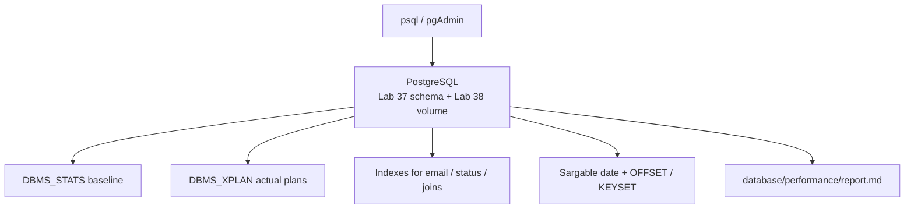
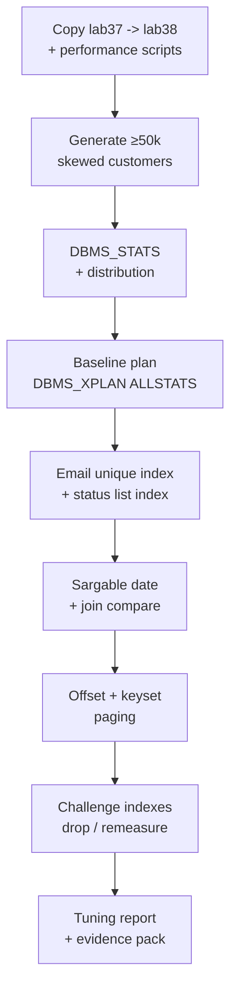

# Lab 38: PostgreSQL SQL and CRM Query Performance — DBMS_XPLAN, Indexes, Sargable Predicates

**Module:** 38 — PostgreSQL SQL and CRM Query Performance  
**Lab folder:** `labs/Week 4 - Kafka, React, PostgreSQL and Resilience/module-38/lab38/`  
**Difficulty:** Intermediate  
**Duration:** ~45 minutes (timed path with starter) · Full path: 4–5 Hours

**Primary IDE:** IntelliJ IDEA Community Edition · **Optional IDE:** VS Code

| OS | How-to for this lab |
| -- | ------------------- |
| Windows | [LAB-38-WINDOWS.md](LAB-38-WINDOWS.md) |
| macOS | [LAB-38-MACOS.md](LAB-38-MACOS.md) |

> **Environment reminder:** Finish [Lab 0](../../../Week%201%20-%20Java%20and%20JVM%20Foundations/module-00/lab0/LAB-0-GUIDE.md). Use **IntelliJ IDEA Community** (primary; optional VS Code) on your laptop with **psql** or pgAdmin and instructor **shared PostgreSQL** credentials. Work under `~/java-bootcamp` (Windows: `%USERPROFILE%\java-bootcamp`).

---

## 45-minute timed path (use starter)

In class, use the starter templates so the **core** objectives fit **~45 minutes**. The full Steps below remain for homework / extended depth.

1. Open [`starter/README.md`](starter/README.md).
2. Copy `starter/` into your `java-bootcamp/examples/…` target (see starter README).
3. Fill every `// TODO` / `TODO` — do **not** wait on a perfect prior lab; the starter includes a baseline.
4. Run the starter smoke test; evidence under `notes/screenshots/lab-38/`.
5. Mark timed-path Pass criteria in the starter README. Continue remaining GUIDE steps as homework if needed.

| Path | Time | Scope |
| ---- | ---- | ----- |
| **Timed (default)** | ~45 min | Starter TODOs + smoke test |
| **Full (extended)** | see Duration | Every Step in this GUIDE |

---

## How to follow this lab

1. **In class (timed path):** prefer [`starter/README.md`](starter/README.md) — copy starter → `java-bootcamp/examples/lab38-crm`, fill TODOs, run smoke test (~45 min).
2. Open the **Windows** or **macOS** how-to (links above) in a second tab for OS-specific commands.
3. Create/work only under your `java-bootcamp/examples/…` folder from the steps (not inside this `labs/` git clone unless a step says otherwise).
4. For each **Step N** (full path / homework): read **Why** (if present) → do the actions → confirm **Expected** / **Expected result** → then continue.
5. When stuck, use **Failure Experiments** / troubleshooting in this guide before asking for help.
6. Capture evidence under `notes/screenshots/lab-38/` (workspace root under `java-bootcamp`; redact secrets). Use the **Pass criteria** tables — write **Pass** or **Fail** in your notes. GitHub file view does not support clickable checkboxes.

## What you'll submit (read this first)

Keep this checklist visible while you work. Full detail is under [Expected Deliverables](#expected-deliverables) at the end.

| # | Deliverable |
| - | ----------- |
| 1 | `database/performance/01`–`05` SQL scripts |
| 2 | ≥50k load with documented skew + preserved CRM fixtures |
| 3 | Baseline and after-index `DBMS_XPLAN` evidence |
| 4 | Sargable date rewrite comparison |
| 5 | Join strategy notes (selective vs broad) |
| 6 | Deterministic OFFSET + keyset paging demos |
| 7 | Index challenge cycle with retained-index justification |
| 8 | `report.md` with plan hash, buffers, median time, write cost |


## Lab Overview

This Module 38 lab teaches **evidence-based PostgreSQL tuning** for the **Customer Management Platform**: generate volume, gather statistics, capture **actual** plans with `DBMS_XPLAN`, create selective indexes, rewrite non-sargable predicates, compare join strategies, implement deterministic and **keyset** paging, and write a tuning report that another engineer can reproduce.

**Purpose.** Leadership freezes a performance gate before Spring Data JPA (Lab 39): no “add index because it felt slow” without before/after plans, buffer counts, and median timings. Guesswork indexes waste storage and slow writes; this lab makes you earn every retained index.

**What you build (exercise).** Copy Lab 37 scripts into `lab38-crm`; generate ≥50k customers with skewed status; gather `DBMS_STATS`; baseline email lookup with `gather_plan_statistics` + `DISPLAY_CURSOR ALLSTATS LAST`; add unique email and status/created indexes; rewrite `TRUNC(created_at)` to a half-open range; compare nested loops vs hash join on customer→account; implement offset and keyset paging; challenge each index by dropping and re-measuring; publish `database/performance/report.md`.

**What success looks like.** Under `~/java-bootcamp/examples/lab38-crm/` you have scripts `01`–`05`, a report with plan hash / buffers / median time / write cost, and you can explain why keyset paging beats deep `OFFSET` for CRM list APIs.

**Depends on Lab 37.** Need `CUSTOMER` / `ACCOUNT` tables, `email_normalized`, `status`, `created_at`, and seeds for `CUS-1001` / `CUS-1002`. Finish Lab 37 first if the schema is incomplete.

**CRM connection.** Fixtures `CUS-1001` (Amina) / `CUS-1002` (Ravi) / correlation `lab-request-001`. Lab 39 will map these tables with Flyway + JPA—keep column names and indexes that the repository and list APIs will use.

---

## Learning Objectives

After completing this lab, you will be able to:

* Generate CRM volume and gather optimizer statistics with `DBMS_STATS`
* Capture actual plans with `DBMS_XPLAN.DISPLAY_CURSOR` (`ALLSTATS LAST`)
* Interpret scans, joins, cardinality, and buffer gets
* Create indexes for measured queries (not speculative ones)
* Rewrite non-sargable predicates (`TRUNC` on columns) into range forms
* Compare nested-loops vs hash-join strategies by selectivity
* Implement deterministic `OFFSET`/`FETCH` and efficient **keyset** paging
* Write an evidence-based tuning report with before/after metrics
* Challenge every index: drop, re-plan, keep only justified indexes
* Keep secret-free SQL and synthetic fixtures only

---

## Business Scenario

Before Spring Data JPA wires the CRM API to PostgreSQL, leadership freezes:

**No merge of “performance” DDL without actual plans, bind-comparable before/after numbers, and a report that names which CRM query was measured.**

You own that gate for list-by-status, email lookup, customer→account joins, and deep paging for Amina (`CUS-1001` ACTIVE), Ravi (`CUS-1002` PROSPECT), and bulk synthetic rows.

Use these examples consistently:

| ID | Name | Notes |
| -- | ---- | ----- |
| `CUS-1001` | Amina Khan | `ACTIVE` — selective public_id and join smoke |
| `CUS-1002` | Ravi Singh | `PROSPECT` — list/filter contrast |
| `CUS-9999` | — | not-found / empty result paths in app tests later |
| `lab-request-001` | — | correlation when noting support symptoms |
| `lab38-001`, … | — | report experiment IDs |

**Security note for evidence.** Use fictional emails only (`amina.khan@example.test`). Never commit database passwords, production dumps, or full 50k-row exports—paste plan excerpts and aggregate counts into notes.

---

## Architecture Context

### NOW (this lab)



### Lab flow (mermaid)



### Architecture NOW vs LATER

| Aspect | Lab 38 (NOW) | Lab 39 / Spring |
| ------ | ------------ | --------------- |
| Access | psql scripts, manual plans | JPA repositories + Flyway |
| Performance proof | DBMS_XPLAN + report.md | IT query counts + paging APIs |
| Indexes | Created/challenged in SQL | Assumed by Hibernate; keep names |
| Paging | SQL OFFSET + keyset | Spring `Pageable` + later keyset API |

**Lab focus:** indexes, sargable predicates, statistics, execution plans, joins, paging, and evidence-based tuning—not Spring yet.

---

## Prerequisites

Complete [SETUP](../../../SETUP-INSTRUCTIONS.md), [Lab 0](../../../Week%201%20-%20Java%20and%20JVM%20Foundations/module-00/lab0/LAB-0-GUIDE.md), and [Lab 37](../../module-37/lab37/LAB-37-GUIDE.md). Confirm:

* PostgreSQL from Lab 37 running (`crm database / assigned schema`)
* psql or pgAdmin connected as schema owner / least-priv user
* Docker; Git for script versioning
* No secrets committed to Git

### Pre-flight

```bash
java -version
docker --version
docker ps
sql -version 2>/dev/null || echo "use pgAdmin / sqlplus"
git --version
pwd
ls ~/java-bootcamp/examples
```

Confirm PostgreSQL is healthy (Lab 37 container) before generating volume.

---

## Suggested Project Files

Prefer a self-contained lab tree under examples (SQL-first). If you also integrate with the shared platform repo later, keep scripts portable:

```text
~/java-bootcamp/examples/lab38-crm/
├── database/
│   ├── ddl/                         (from Lab 37 — do not silently rewrite)
│   └── performance/
│       ├── 01_generate_data.sql
│       ├── 02_baseline.sql
│       ├── 03_indexes.sql
│       ├── 04_optimized.sql
│       ├── 05_cleanup_indexes.sql
│       └── report.md
├── notes/screenshots/
├── docs/
│   └── performance-concepts.md
├── .gitignore
└── README.md
```

Optional platform path note: if your cohort shares `customer-management-platform/`, place the same files under `database/performance/` there—do **not** commit PostgreSQL passwords or dumps.

Ignore `*.dmp`, volume mounts with secrets, IDE metadata, tokens, and passwords.

---

## Concepts to Discuss

Write 2–3 sentences each in `docs/performance-concepts.md`:

1. Main flow: how a CRM email lookup and ACTIVE list query hit PostgreSQL
2. Trust boundary: who may run DDL/DML vs who runs SELECT (app least-priv)
3. Success/failure contracts: plan must show expected access path; wrong cardinality is a “failure”
4. Stable fixtures (`CUS-1001`) vs synthetic bulk generators
5. Idempotency of `GATHER_TABLE_STATS` and recreate-from-script indexes
6. Why measure actual rows/buffers, not only EXPLAIN without execute
7. Evidence operators need (plan hash, buffers, median latency, storage delta)
8. Two sessions: same binds → comparable plans
9. Non-sargable predicates vs half-open ranges
10. What Lab 39 will change (JPA/Flyway) without dropping justified indexes

---

## Implementation Steps

Complete each step in order. Commands assume `~/java-bootcamp/examples/lab38-crm` (Windows: `%USERPROFILE%\java-bootcamp\examples\lab38-crm`) unless noted. Run SQL via psql against your Lab 37 schema.

---

### Step 1 — Branch Lab 37 and scaffold performance scripts

**Why:** Performance work must be scripted and reviewable, not ad-hoc console history.

**Do this:**

```bash
cd ~/java-bootcamp/examples
cp -r lab37-crm lab38-crm
cd lab38-crm
mkdir -p database/performance docs ~/java-bootcamp/notes/screenshots/lab-38
```

Create empty script stubs `01_generate_data.sql` … `05_cleanup_indexes.sql` and `report.md` headings (Baseline / After indexes / Joins / Paging / Retained indexes).

**Expected result:** Tree matches Suggested Project Files; Lab 37 DDL still present.

**If it fails:** Missing `lab37-crm` → finish Lab 37 first. Accidental overwrite of DDL → restore from Lab 37 copy.

---

### Step 2 — Generate representative volume (≥50,000)

**Why:** Optimizer choices on tiny tables are meaningless; CRM lists need skew and volume.

**Do this:** In `01_generate_data.sql`, load at least 50,000 customers with ~70/30 ACTIVE/PROSPECT skew. Preserve Lab 37 seeds for `CUS-1001` / `CUS-1002` (or re-insert after bulk load). Adapt column lists to your Lab 37 DDL:

```sql
BEGIN
  FOR i IN 1..50000 LOOP
    INSERT INTO customer (public_id, status /*, email_normalized, created_at, ... */)
    VALUES (
      'CUS-BULK-' || LPAD(i, 6, '0'),
      CASE WHEN MOD(i, 10) < 7 THEN 'ACTIVE' ELSE 'PROSPECT' END
      /*, lower('user'||i||'@example.test'), CURRENT_TIMESTAMP - NUMTODSINTERVAL(MOD(i, 90), 'DAY'), ... */
    );
  END LOOP;
  COMMIT;
END;
/
```

```sql
SELECT COUNT(*), status FROM customer GROUP BY status;
```

**Expected result:** ≥50,000 rows; roughly 70% ACTIVE / 30% PROSPECT (or documented skew); fixtures `CUS-1001` / `CUS-1002` still present.

**If it fails:** Constraint violations on unique email → generate unique `email_normalized`. Slow inserts → batch commits every 5k rows. Disk full → prune Docker volumes with instructor approval only.

---

### Step 3 — Gather optimizer statistics

**Why:** Plans after bulk load without stats are fiction.

**Do this:** In `02_baseline.sql`:

```sql
EXEC DBMS_STATS.GATHER_TABLE_STATS(USER, 'CUSTOMER', cascade => TRUE);
EXEC DBMS_STATS.GATHER_TABLE_STATS(USER, 'ACCOUNT', cascade => TRUE);

SELECT table_name, num_rows, last_analyzed
FROM user_tables
WHERE table_name IN ('CUSTOMER', 'ACCOUNT');
```

**Expected result:** `NUM_ROWS` approximates your load; `LAST_ANALYZED` is current.

**If it fails:** Wrong table name casing → PostgreSQL stores unquoted names as UPPER. Insufficient privilege → use Lab 37 schema owner.

---

### Step 4 — Record data distribution and bind values

**Why:** Plan comparisons must use the same binds and known selectivity.

**Do this:** Still in `02_baseline.sql`, capture status counts and the exact email bind you will measure (prefer a bulk row’s email for “typical” selectivity, and also probe Amina if unique):

```sql
SELECT COUNT(*) AS cnt, status FROM customer GROUP BY status ORDER BY status;

-- Document in report.md:
-- email bind: e.g. user000001@example.test
-- public_id bind: CUS-1001
-- status bind: ACTIVE
```

**Expected result:** Distribution and binds recorded in `report.md` so a peer can re-run the same predicates.

**If it fails:** Empty tables → Step 2 did not commit. Histogram surprises later → note that Lab 38 baseline is without advanced hist tuning unless instructor asks.

---

### Step 5 — Capture an actual baseline plan (email lookup)

**Why:** `EXPLAIN PLAN` without execution misses actual cardinality and buffers.

**Do this:**

```sql
ALTER SESSION SET statistics_level = ALL;

VARIABLE email VARCHAR(320)
EXEC :email := 'user000001@example.test';  -- use a real row from your load

SELECT /*+ gather_plan_statistics */ customer_id, public_id, full_name, status
FROM customer
WHERE email_normalized = :email;

SELECT * FROM TABLE(
  DBMS_XPLAN.DISPLAY_CURSOR(NULL, NULL, 'ALLSTATS LAST +PREDICATE')
);
```

Paste the plan (operation, E-Rows vs A-Rows, Buffers) into `report.md` under **Baseline**.

**Expected result:** Baseline shows operation (often `TABLE ACCESS FULL` before index), actual rows, and buffer gets.

**If it fails:** `DISPLAY_CURSOR` empty → SQL child not found; run SELECT and DISPLAY_CURSOR in the same session immediately. Bind mismatch → confirm column is `email_normalized`.

---

### Step 6 — Index selective email lookup

**Why:** Email login / uniqueness checks are highly selective; a unique index is the measured fix.

**Do this:** In `03_indexes.sql`:

```sql
CREATE UNIQUE INDEX ux_customer_email_norm ON customer (email_normalized);
```

Re-run the **identical** email query + `DISPLAY_CURSOR` from Step 5. Compare plan hash, buffers, and elapsed.

**Expected result:** Plan becomes `INDEX UNIQUE SCAN` (or equivalent); buffers and median time drop substantially vs baseline.

**If it fails:** SQLSTATE/01452 duplicate emails → clean generator uniqueness first. Still FULL → wrong predicate column / function wrapper; do not wrap indexed column in `LOWER()` if you stored normalized lowercase already.

---

### Step 7 — Build the active-list index

**Why:** CRM ACTIVE lists usually filter equality on status and order by created date / id.

**Do this:**

```sql
CREATE INDEX ix_customer_status_created
  ON customer (status, created_at DESC, customer_id DESC);
```

Measure a representative list:

```sql
SELECT /*+ gather_plan_statistics */ customer_id, public_id, created_at
FROM customer
WHERE status = 'ACTIVE'
ORDER BY created_at DESC, customer_id DESC
FETCH FIRST 20 ROWS ONLY;

SELECT * FROM TABLE(DBMS_XPLAN.DISPLAY_CURSOR(NULL, NULL, 'ALLSTATS LAST'));
```

**Expected result:** List plan uses the status-leading index where selective; ordered access or reduced buffers vs full scan + sort for small pages.

**If it fails:** Index unused → check predicate uses `status = :bind` without wrapping; verify stats gathered after index create (`cascade=>TRUE` or gather again).

---

### Step 8 — Rewrite the non-sargable date predicate

**Why:** `TRUNC(created_at) = DATE '...'` disables normal index range scans on `created_at`.

**Do this:** In `04_optimized.sql`, prove old vs new return the same IDs:

```sql
-- Non-sargable (for contrast)
SELECT customer_id FROM customer
WHERE TRUNC(created_at) = DATE '2026-07-01';

-- Sargable half-open range
SELECT customer_id FROM customer
WHERE created_at >= TIMESTAMP '2026-07-01 00:00:00'
  AND created_at <  TIMESTAMP '2026-07-02 00:00:00';
```

Capture plans for both. Prefer the range form in application SQL going forward.

**Expected result:** Old/new queries return identical ID sets for the chosen day; range form shows index range capability when a suitable index exists.

**If it fails:** Time zone surprises → document Lab uses DB/session timestamps consistently (ISO-8601 UTC in app later). No rows for that day → pick a day that exists in your synthetic distribution.

---

### Step 9 — Compare join strategies (customer → account)

**Why:** Selective customer→accounts should nested-loop; broad reports often hash join—both can be right.

**Do this:**

```sql
CREATE INDEX ix_account_customer ON account (customer_id);

-- Selective: one customer (Amina / public_id bind)
SELECT /*+ gather_plan_statistics */ c.public_id, a.account_id, a.balance
FROM customer c
JOIN account a ON a.customer_id = c.customer_id
WHERE c.public_id = 'CUS-1001';

SELECT * FROM TABLE(DBMS_XPLAN.DISPLAY_CURSOR(NULL, NULL, 'ALLSTATS LAST'));

-- Broader: many ACTIVE customers with accounts (report-style)
-- Capture plan without forcing hints; note HASH vs NESTED LOOPS
```

**Expected result:** Selective join tends toward nested loops + index on `account(customer_id)`; broad join may hash; both documented with cardinality.

**If it fails:** No accounts for Amina → seed Lab 37 account for `CUS-1001`. Missing FK index → create `ix_account_customer`.

---

### Step 10 — Implement deterministic offset paging

**Why:** `ORDER BY created_at` alone allows ties; CRM pages must not shuffle siblings.

**Do this:**

```sql
SELECT customer_id, public_id, created_at
FROM customer
WHERE status = 'ACTIVE'
ORDER BY created_at DESC, customer_id DESC
OFFSET :offset ROWS FETCH NEXT :page_size ROWS ONLY;
```

Run page 0 and page 1; assert no duplicate `customer_id` across pages for a frozen dataset.

**Expected result:** Offset page has deterministic tie-breaker; adjacent pages disjoint for static data.

**If it fails:** Duplicates → missing ID in `ORDER BY`. Different results on re-run → concurrent writers; freeze or note MVCC expectations.

---

### Step 11 — Implement keyset paging

**Why:** Deep `OFFSET` scans/skips work the engine already did; keyset continues after the last `(created_at, customer_id)` tuple.

**Do this:**

```sql
-- After seeing last row (:last_created, :last_id) from previous page:
SELECT customer_id, public_id, created_at
FROM customer
WHERE status = 'ACTIVE'
  AND (
        created_at < :last_created
     OR (created_at = :last_created AND customer_id < :last_id)
      )
ORDER BY created_at DESC, customer_id DESC
FETCH FIRST :page_size ROWS ONLY;
```

Walk three pages with keyset; compare cost/buffers to a deep offset (e.g. `OFFSET 5000`).

**Expected result:** Keyset pages have no duplicate/missing IDs for static data; deep offset is slower/heavier in measured buffers or elapsed.

**If it fails:** Off-by-one duplicates → wrong inequality direction vs sort. Ascending sort → flip operators to match `ORDER BY`.

---

### Step 12 — Challenge each index and write the report

**Why:** Indexes have write cost; only keep what measured queries need.

**Do this:** In `05_cleanup_indexes.sql`:

```sql
-- Example challenge cycle:
DROP INDEX ix_customer_status_created;
-- Rerun ACTIVE list plan from Step 7; record regression.
-- Recreate only if evidence justifies:
CREATE INDEX ix_customer_status_created
  ON customer (status, created_at DESC, customer_id DESC);
```

Complete `database/performance/report.md` with before/after lines like:

```text
Email lookup before: TABLE ACCESS FULL, buffers≈420, median≈18.4ms
Email lookup after:  INDEX UNIQUE SCAN, buffers≈3,   median≈1.2ms
Plan hash: ...
Write cost / index storage: ...
Retained indexes: ux_customer_email_norm, ix_customer_status_created, ix_account_customer
Dropped / not retained: ...
```

Capture plan excerpts under `notes/screenshots/lab-38/`.

**Expected result:** Each retained index has measured evidence; report includes plan hash, buffers, median time, write cost; peer can re-run from scripts.

**If it fails:** Report missing binds → add Step 4 values. “Felt faster” without numbers → re-measure with `ALLSTATS LAST`.

---

### Step 13 — Failure experiments + evidence pack

**Why:** Tuning culture fails when people cannot reproduce regressions.

**Do this:** Complete [Failure Experiments](#failure-experiments). Save sanitized plan text (not password prompts). Confirm `git status` excludes dumps and credentials.

**Expected result:** ≥3 experiments documented; scripts runnable; evidence pack complete.

**If it fails:** See Troubleshooting.

---

## Implementation Checkpoints

### Checkpoint A — Tooling and volume

_Mark each row **Pass** or **Fail** in your lab notes (GitHub markdown files are not interactive checklists)._

| # | Confirm | Your notes |
| - | ------- | ---------- |
| 1 | `lab38-crm` under `~/java-bootcamp/examples/` | Pass / Fail |
| 2 | ≥50k customers with documented skew | Pass / Fail |
| 3 | `DBMS_STATS` gathered; `NUM_ROWS` / `LAST_ANALYZED` recorded | Pass / Fail |

### Checkpoint B — Plans and indexes

_Mark each row **Pass** or **Fail** in your lab notes (GitHub markdown files are not interactive checklists)._

| # | Confirm | Your notes |
| - | ------- | ---------- |
| 1 | Baseline email plan with `ALLSTATS LAST` | Pass / Fail |
| 2 | Unique email index + improved plan evidence | Pass / Fail |
| 3 | Status/created list index + measured list query | Pass / Fail |

### Checkpoint C — Sargability, joins, paging

_Mark each row **Pass** or **Fail** in your lab notes (GitHub markdown files are not interactive checklists)._

| # | Confirm | Your notes |
| - | ------- | ---------- |
| 1 | Half-open date range vs `TRUNC` comparison | Pass / Fail |
| 2 | Selective vs broad join notes | Pass / Fail |
| 3 | Deterministic OFFSET + keyset paging without dup/miss IDs | Pass / Fail |

### Checkpoint D — Hygiene and report

_Mark each row **Pass** or **Fail** in your lab notes (GitHub markdown files are not interactive checklists)._

| # | Confirm | Your notes |
| - | ------- | ---------- |
| 1 | Each retained index challenged with drop/remeasure evidence | Pass / Fail |
| 2 | `report.md` complete (plan hash, buffers, median, write cost) | Pass / Fail |
| 3 | No secrets / dumps / passwords in Git | Pass / Fail |

---

## Reference Commands, Configuration, and Code

### Plan capture pattern

```sql
ALTER SESSION SET statistics_level = ALL;
SELECT /*+ gather_plan_statistics */ customer_id, public_id, full_name
FROM customer WHERE email_normalized = :email;
SELECT * FROM TABLE(DBMS_XPLAN.DISPLAY_CURSOR(NULL, NULL,
  'ALLSTATS LAST +PREDICATE'));
```

### Index set (justify each)

```sql
CREATE UNIQUE INDEX ux_customer_email_norm ON customer (email_normalized);
CREATE INDEX ix_customer_status_created ON customer (status, created_at DESC, customer_id DESC);
CREATE INDEX ix_account_customer ON account (customer_id);
```

### Sargable date range

```sql
SELECT customer_id, public_id, created_at FROM customer
WHERE created_at >= TIMESTAMP '2026-07-01 00:00:00'
  AND created_at <  TIMESTAMP '2026-07-02 00:00:00'
ORDER BY created_at, customer_id;
```

### Keyset predicate (DESC list)

```sql
AND (created_at < :last_created
  OR (created_at = :last_created AND customer_id < :last_id))
```

### Commands

```bash
cd ~/java-bootcamp/examples/lab38-crm
# connect with sql / sqlplus using instructor connection string — never commit passwords
ls database/performance
git status
```

### Artifact map

| Artifact | Role |
| -------- | ---- |
| `01_generate_data.sql` | Volume + skew |
| `02_baseline.sql` | Stats + baseline plans |
| `03_indexes.sql` | Measured indexes |
| `04_optimized.sql` | Sargable + join + paging |
| `05_cleanup_indexes.sql` | Challenge cycle |
| `report.md` | Evidence gate |

---

## Manual Verification

1. ≥50k customers loaded; fixtures `CUS-1001` / `CUS-1002` intact.
2. Stats gathered after load (and after major index adds if needed).
3. Baseline vs indexed email plans differ with lower buffers after unique index.
4. ACTIVE list query measured with status-leading index evidence.
5. Date filter rewritten without `TRUNC` on the indexed column.
6. Selective join plan captured for `CUS-1001` (or documented bind).
7. OFFSET pages deterministic; keyset pages have no dup/miss for static data.
8. At least one index challenged with drop + remeasure notes.
9. `report.md` includes plan hash, buffers, median time, write cost.
10. No passwords, dumps, or real PII in the repo.

---

## Failure Experiments

| # | Experiment | Observe | Restore |
| - | ---------- | ------- | ------- |
| 1 | Query with `TRUNC(created_at)` vs half-open range | Plan/pred differences | Prefer sargable SQL |
| 2 | Drop `ux_customer_email_norm` and re-run email plan | Regression to full scan / higher buffers | Recreate unique index |
| 3 | `ORDER BY created_at` without `customer_id` across ties | Non-deterministic page peers | Add ID tie-breaker |
| 4 | Deep `OFFSET 5000` vs keyset after 5k | Cost/buffers jump on offset | Document keyset preference |
| 5 | Skip `DBMS_STATS` after bulk load | Wild E-Rows vs A-Rows | Gather stats; re-plan |

---

## Troubleshooting

| Symptom | Likely cause | Fix |
| ------- | ------------ | --- |
| `DISPLAY_CURSOR` empty | Different session / no cursor | Same session; run select then display immediately |
| Index not used | Non-sargable function / stale stats | Remove wrappers; gather stats |
| ORA unique violation on load | Duplicate emails | Fix generator uniqueness |
| Plans differ randomly | Different binds / histograms | Fix binds in report; same session NLS |
| Out of space | 50k + indexes + Docker volume | Instructor-approved cleanup; do not wipe peers’ DBs |
| “Fast enough” debate | No median/buffers | Re-run with `ALLSTATS LAST`; record numbers |
| Missing Amina | Bulk load wiped seed | Re-insert `CUS-1001` / `CUS-1002` after load |

---

## Security and Production Review

Answer in README / `report.md`:

1. Which inputs are untrusted (ad-hoc SQL in prod? app binds only)?
2. Where are authn/authz/validation enforced (still not in SQL scripts—app later)?
3. Which values are sensitive—never in scripts/logs (passwords, real emails)?
4. What can be retried safely (`GATHER_STATS`, re-run SELECTs, recreate indexes from script)?
5. What happens after partial failure (failed index create; incomplete load commit)?
6. What would an operator monitor (buffer gets, slow SQL, index bloat)?
7. Which local default is unacceptable (unguessed indexes on prod; running as SYS forever)?
8. How are index/DDL contracts versioned with Lab 39 Flyway?

---

## Cleanup

```bash
cd ~/java-bootcamp/examples/lab38-crm
# Keep indexes you justified; optional: truncate bulk rows only if instructor allows shared DB reclaim
git status
```

Do not commit PostgreSQL password files, datapump dumps, or full plan HTML exports with connection strings.

**Keep `lab38-crm`**—Lab 39 maps these tables with Spring Data JPA + Flyway and should preserve justified indexes.

---

## Expected Deliverables

Same checklist as [What you'll submit](#what-youll-submit-read-this-first) above.

* `database/performance/01`–`05` SQL scripts
* ≥50k load with documented skew + preserved CRM fixtures
* Baseline and after-index `DBMS_XPLAN` evidence
* Sargable date rewrite comparison
* Join strategy notes (selective vs broad)
* Deterministic OFFSET + keyset paging demos
* Index challenge cycle with retained-index justification
* `report.md` with plan hash, buffers, median time, write cost
* Concepts notes + no secrets in Git

---

## Evaluation Rubric (100 Marks)

| Criteria | Marks |
| -------- | ----: |
| Environment and project structure | 10 |
| Core implementation (volume, stats, indexes, sargable SQL, paging) | 30 |
| Integration/configuration correctness (actual plans, comparable binds) | 15 |
| Failure handling (challenge indexes, regression observations) | 15 |
| Automated / scripted verification (rerunnable SQL) | 10 |
| Security and production awareness | 10 |
| Documentation and evidence (`report.md`) | 10 |

**Notes:** Adding indexes without before/after plans → lose evidence marks. Keeping every experimental index without challenge → lose production-awareness marks. Tweaking hints to force a pretty plan without explaining why → call it out in the report or lose honesty marks.

---

## Reflection Questions

Write 3–6 sentence answers:

1. Which design decision most affected correctness of page results?
2. Which failure was hardest to diagnose (wrong plan, skew, ties)?
3. What evidence proves the email index was worth the write cost?
4. What breaks first at ten times the row count?
5. Which concern should move to shared DBA / Flyway infrastructure?
6. What must change before real customer data is used (spoiler: don’t dump it locally)?
7. How does this lab connect to Lab 37 DDL and Lab 39 JPA?
8. What metric matters most on a slow CRM list ticket?
9. (Forward look) Which queries will Hibernate generate that still need these indexes?

---

## Bonus Challenges

1. Histogram / column-group thought experiment on `status` skew—document only.
2. Compare `INDEX SKIP SCAN` myths vs your actual plans.
3. Measure index storage (`user_segments`) before/after.
4. Add covering index debate: include `public_id` in leaf—cost vs gain.
5. Document rollback DDL if a bad index locks nightly batch writes.
6. Sketch how a Spring keyset API would pass `(lastCreated, lastId)` as query params.

---

## Success Criteria

You are finished when:

* Volume, stats, and actual plans are captured
* Email and list indexes are justified with before/after numbers
* Sargable date predicates and join notes are documented
* OFFSET and keyset paging are demoed without dup/miss IDs
* Indexes were challenged; report is peer-reproducible
* No production secret or real PII is hard-coded
* You can explain local shortcuts vs production change control

---

## Instructor Notes

* **Live probe:** Ask the student to open a plan and point to A-Rows vs E-Rows mismatch before stats or after a bad predicate. Have them walk keyset vs deep offset numbers.
* **Assess:** Actual `ALLSTATS` evidence, sargable rewrite, index challenge honesty, fixture continuity (`CUS-1001` / `CUS-1002`).
* **Continuity:** Prefer `examples/lab38-crm`. Keep index and column names Lab 39 will map. Do not require Spring in this lab.
* **Common pitfalls:** EXPLAIN-only without execute; `TRUNC` on columns; ORDER BY without tie-breaker; committing passwords; wiping Lab 37 seeds during bulk load.
* **Timing:** Timed path ~45 minutes with starter; full path remains 4–5 hours. Bulk load + first plans often burn 60–90 minutes—urge early commit of `01`/`02` scripts.

---

*End of Lab 38 — PostgreSQL SQL and CRM Query Performance. Keep `lab38-crm` for Lab 39 Spring Data JPA and portfolio evidence.*
