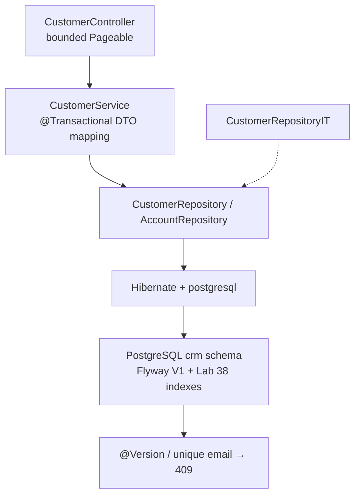
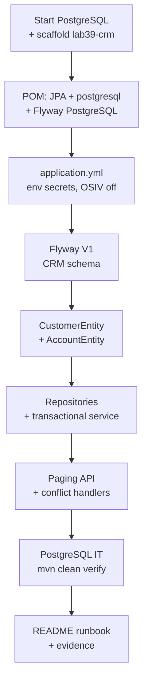

# Lab 39: Spring Data JPA with PostgreSQL — Flyway, Entities, Repositories, Paging, Optimistic Lock

**Module:** 39 — Spring Data JPA with PostgreSQL  
**Lab folder:** `labs/Week 4 - Kafka, React, PostgreSQL and Resilience/module-39/lab39/`  
**Difficulty:** Intermediate  
**Duration:** 4–5 Hours

**Primary IDE:** IntelliJ IDEA Community Edition · **Optional IDE:** VS Code

| OS | How-to for this lab |
| -- | ------------------- |
| Windows | [LAB-39-WINDOWS.md](LAB-39-WINDOWS.md) |
| macOS | [LAB-39-MACOS.md](LAB-39-MACOS.md) |

> **Environment reminder:** Finish [Lab 0](../../../Week%201%20-%20Java%20and%20JVM%20Foundations/module-00/lab0/LAB-0-GUIDE.md). Use **IntelliJ IDEA Community** (primary; optional VS Code) on your laptop with **JDK 21**, **Maven 3.9+**, and instructor **shared PostgreSQL**. Work under `~/java-bootcamp` (Windows: `%USERPROFILE%\java-bootcamp`).

---

## How to follow this lab

1. Open the **Windows** or **macOS** how-to (links above) in a second tab.
2. Create/work only under your `java-bootcamp/examples/…` folder from the steps (not inside this `labs/` git clone unless a step says otherwise).
3. For each **Step N**: read **Why** (if present) → do the actions → confirm **Expected** / **Expected result** → then continue.
4. When stuck, use **Failure Experiments** / troubleshooting in this guide before asking for help.
5. Capture evidence under `notes/screenshots/` (redact secrets). Use the **Pass criteria** tables — write **Pass** or **Fail** in your notes. GitHub file view does not support clickable checkboxes.

## Lab Overview

This Module 39 lab wires the **Customer Management Platform** to PostgreSQL with **Spring Data JPA**: Flyway-managed schema, accurate entity mappings, focused repositories, transactional DTO services, deterministic paging, optimistic locking, safe conflict translation, and PostgreSQL-backed integration tests.

**Purpose.** Leadership freezes a persistence gate before security testing (Lab 40) and containers (Lab 41): Hibernate must **validate** schema (not `create-drop`), Open Session in View stays **off**, money uses `BigDecimal`, and duplicate / optimistic conflicts return controlled HTTP **409** without leaking `SQLSTATE/` text.

**What you build (exercise).** Copy forward into `lab39-crm`; start PostgreSQL; add JPA + postgresql + Flyway PostgreSQL; configure env-based datasource; author `V1__crm_schema.sql` (aligned with Lab 37/38); map `CustomerEntity` / `AccountEntity` with `@Version`; build repositories and transactional service; bound paging with sort allow-list + ID tie-breaker; map integrity/optimistic failures; run `CustomerRepositoryIT` (Testcontainers optional) until `mvn clean verify` is green.

**What success looks like.** Under `~/java-bootcamp/examples/lab39-crm/` you can create Amina (`CUS-1001`), activate paths for Ravi (`CUS-1002`), page ACTIVE customers stably, get 409 on duplicate email and optimistic conflict, and show IT evidence against PostgreSQL—not H2 pretending to be PostgreSQL.

**Depends on Labs 37–38.** Need CRM tables, normalized email uniqueness, status, timestamps, and preferably Lab 38 indexes. Bring forward column names so Flyway matches measured DDL.

**CRM connection.** Fixtures `CUS-1001` / `CUS-1002` / `CUS-9999`, correlation `lab-request-001`. Lab 40 scans this backend; Lab 41 containerizes it—keep actuator health and env-based secrets from day one.

---

## Learning Objectives

After completing this lab, you will be able to:

* Configure Spring Data JPA for PostgreSQL with env-based credentials
* Manage schema changes with Flyway (`validate` + migrations only)
* Map customer and account entities to PostgreSQL types accurately
* Map `NUMERIC(19,2)` to `BigDecimal` and timestamps correctly
* Create repository lookups, existence checks, and paging queries
* Keep lazy collections out of equals/hashCode/JSON serialization
* Write transactional services that map entities to response DTOs
* Handle unique and optimistic-lock conflicts as safe API errors
* Test PostgreSQL mappings, constraints, paging, and query counts in IT
* Propagate `lab-request-001`-style correlation without logging secrets

---

## Business Scenario

Before containers and cluster deploy, leadership freezes:

**No merge of JPA mapping that uses `ddl-auto=update/create`, embeds DB passwords in Git, or returns raw PostgreSQL exception text to clients.**

You own that gate for CRM create/find/list/update with Amina (`CUS-1001` ACTIVE), Ravi (`CUS-1002` PROSPECT→ACTIVE), duplicate email, not-found `CUS-9999`, and concurrent update races.

Use these examples consistently:

| ID | Name | Notes |
| -- | ---- | ----- |
| `CUS-1001` | Amina Khan | `ACTIVE` — happy find / accounts |
| `CUS-1002` | Ravi Singh | `PROSPECT` → `ACTIVE` |
| `CUS-9999` | — | not-found paths |
| `lab-request-001` | — | correlation on conflict/error responses |
| `lab39-001`, … | — | IT scenario IDs |

**Security note for evidence.** Use fictional emails only. Never commit `CRM_DB_PASSWORD`, `.env`, or PostgreSQL wallet files—use `.env.example` with empty placeholders.

---

## Architecture Context

### NOW (this lab)



### Lab flow (mermaid)



### Architecture NOW vs LATER

| Aspect | Lab 39 (NOW) | Lab 40–42 |
| ------ | ------------ | --------- |
| Schema | Flyway validate | Same migrations in image/cluster |
| Security | No ORA leak; env passwords | Dependency-Check + SAST (40) |
| Packaging | Local `mvn spring-boot:run` | Multi-stage Docker (41), K8s (42) |
| Tests | PostgreSQL IT | Security regression + container health |

**Lab focus:** PostgreSQL configuration, JPA entities, repositories, DTO mapping, transactions, paging, locking, and integration tests.

---

## Prerequisites

Complete [SETUP](../../../SETUP-INSTRUCTIONS.md), [Lab 0](../../../Week%201%20-%20Java%20and%20JVM%20Foundations/module-00/lab0/LAB-0-GUIDE.md), and Labs [37](../../module-37/lab37/LAB-37-GUIDE.md)–[38](../../module-38/lab38/LAB-38-GUIDE.md). Confirm:

* JDK 21; Maven Wrapper or Maven 3.9+; Spring Boot 3.x
* PostgreSQL reachable on `localhost:5432/crm (or instructor host/schema)` (or instructor host)
* Testcontainers optional for IT (Docker required if used)
* No secrets committed to Git

### Pre-flight

```bash
java -version
mvn -version
docker --version
docker ps
git --version
pwd
ls ~/java-bootcamp/examples
```

Confirm PostgreSQL logs show ready / healthy before Spring starts.

---

## Suggested Project Files

Prefer the examples tree. You may note alignment with `customer-management-platform/backend/` if your cohort integrates into the shared platform later—mirror package/`db/migration` layout.

```text
~/java-bootcamp/examples/lab39-crm/
├── src/
│   ├── main/
│   │   ├── java/com/northstar/crm/
│   │   │   ├── customer/
│   │   │   │   ├── CustomerEntity.java
│   │   │   │   ├── CustomerRepository.java
│   │   │   │   ├── CustomerService.java
│   │   │   │   ├── CustomerController.java
│   │   │   │   └── CustomerMapper.java
│   │   │   ├── account/
│   │   │   │   ├── AccountEntity.java
│   │   │   │   └── AccountRepository.java
│   │   │   ├── api/
│   │   │   │   └── ApiExceptionHandler.java
│   │   │   └── CrmApplication.java
│   │   └── resources/
│   │       ├── application.yml
│   │       └── db/migration/
│   │           └── V1__crm_schema.sql
│   └── test/java/com/northstar/crm/customer/
│       └── CustomerRepositoryIT.java
├── docs/
│   └── jpa-postgres-notes.md
├── notes/screenshots/
├── .env.example
├── compose.yaml                    (optional: PostgreSQL only)
├── pom.xml
├── .gitignore
└── README.md
```

Ignore `target/`, `.env`, IDE metadata, tokens, and passwords.

---

## Concepts to Discuss

Write 2–3 sentences each in `docs/jpa-postgres-notes.md`:

1. Main flow: HTTP create/find/list → service → JPA → PostgreSQL
2. Trust boundary: validation at DTO/controller; DB constraints as last line
3. Success/failure contracts: 201/200 vs 404/409 Problem Details
4. Stable fixtures (`CUS-1001`) vs generated `public_id` strategies
5. Idempotency: duplicate create vs safe GET; Flyway migrate once
6. Why `ddl-auto=validate` + Flyway, never `update` in shared DBs
7. Evidence: IT logs, Flyway history, conflict response bodies (sanitized)
8. Two app instances: optimistic lock vs last-write-wins without `@Version`
9. OSIV off: why lazy load after transaction fails (by design)
10. What Lab 41 will package (JAR + env) without baking passwords into images

---

## Implementation Steps

Complete each step in order. Commands assume `~/java-bootcamp/examples/lab39-crm` (Windows: `%USERPROFILE%\java-bootcamp\examples\lab39-crm`) unless noted.

---

### Step 1 — Start PostgreSQL and scaffold `lab39-crm`

**Why:** Spring Boot must not race a cold database; schema work starts from a reachable PDB.

**Do this:**

```bash
docker start crm-postgres
# Wait until logs show DATABASE IS READY TO USE / healthy

cd ~/java-bootcamp/examples
# Prefer copying a prior Spring CRM lab if you have one; else springboot archetype / prior week module
mkdir -p lab39-crm && cd lab39-crm
mkdir -p src/main/java/com/northstar/crm src/main/resources/db/migration \
  src/test/java/com/northstar/crm/customer docs notes/screenshots
```

Export credentials into the shell or a local `.env` (gitignored)—never into `pom.xml`.

**Expected result:** PostgreSQL service healthy on `crm database / assigned schema`; project skeleton exists.

**If it fails:** Port 5432 busy → stop conflicting containers. Auth failed → reset Lab 37 app user password with instructor guidance.

---

### Step 2 — Add JPA, PostgreSQL JDBC, and Flyway dependencies

**Why:** The classpath must resolve `postgresql` and Flyway’s PostgreSQL support once, without duplicate drivers.

**Do this:** In `pom.xml`, ensure Spring Boot parent and add:

```xml
<dependency>
  <groupId>org.springframework.boot</groupId>
  <artifactId>spring-boot-starter-data-jpa</artifactId>
</dependency>
<dependency>
  <groupId>org.postgresql</groupId>
  <artifactId>postgresql</artifactId>
  <scope>runtime</scope>
</dependency>
<dependency>
  <groupId>org.flywaydb</groupId>
  <artifactId>flyway-core</artifactId>
</dependency>
<dependency>
  <groupId>org.flywaydb</groupId>
  <artifactId>flyway-database-postgresql</artifactId>
</dependency>
```

Optional IT: Testcontainers PostgreSQL module. Then:

```bash
mvn -q -DincludeArtifactIds=postgresql,flyway-core dependency:tree
```

**Expected result:** Maven resolves JPA, `postgresql`, and Flyway once without conflicts.

**If it fails:** Wrong Boot version → align with course BOM. Duplicate JDBC → exclude transitive H2 for runtime if it sneaks into main.

---

### Step 3 — Configure PostgreSQL safely

**Why:** Passwords in YAML are a Lab 40 finding waiting to happen; OSIV hides N+1 until prod.

**Do this:** `src/main/resources/application.yml`:

```yaml
spring:
  datasource:
    url: ${CRM_DB_URL:jdbc:postgresql://localhost:5432/crm}
    username: ${CRM_DB_USERNAME:crm_app}
    password: ${CRM_DB_PASSWORD}
  jpa:
    open-in-view: false
    hibernate:
      ddl-auto: validate
    properties:
      hibernate:
        jdbc:
          time_zone: UTC
  flyway:
    enabled: true
```

Create `.env.example` with keys only (no values). Document required exports in README.

**Expected result:** Pool starts when password is set; Hibernate validates; OSIV false; no password in Git.

**If it fails:** Startup fails without password → expected; set env. `ddl-auto` create → fix to `validate`.

---

### Step 4 — Create the Flyway migration

**Why:** Shared databases never accept silent Hibernate schema mutation.

**Do this:** Author `V1__crm_schema.sql` aligned with Labs 37–38 (expand to full CRM DDL you already validated):

```sql
CREATE TABLE customer (
  customer_id        NUMBER GENERATED BY DEFAULT AS IDENTITY PRIMARY KEY,
  public_id          VARCHAR(36)  NOT NULL,
  full_name          VARCHAR(200) NOT NULL,
  email_normalized   VARCHAR(320) NOT NULL,
  status             VARCHAR(32)  NOT NULL,
  created_at         TIMESTAMPTZ DEFAULT CURRENT_TIMESTAMP NOT NULL,
  version_no         BIGINT DEFAULT 0 NOT NULL,
  CONSTRAINT uk_customer_public_id UNIQUE (public_id),
  CONSTRAINT uk_customer_email_norm UNIQUE (email_normalized)
);

CREATE TABLE account (
  account_id    NUMBER GENERATED BY DEFAULT AS IDENTITY PRIMARY KEY,
  customer_id   NUMBER NOT NULL,
  balance       NUMERIC(19,2) NOT NULL,
  status        VARCHAR(32) NOT NULL,
  CONSTRAINT fk_account_customer FOREIGN KEY (customer_id) REFERENCES customer (customer_id)
);

CREATE INDEX ix_account_customer ON account (customer_id);
-- Prefer Lab 38 indexes if not already present:
-- CREATE UNIQUE INDEX ux_customer_email_norm ... (covered by UNIQUE constraint)
-- CREATE INDEX ix_customer_status_created ON customer (status, created_at DESC, customer_id DESC);
```

Never edit a migration already applied to a shared DB—add `V2__...` instead.

```bash
mvn -q spring-boot:run
# watch Flyway apply V1 once
```

**Expected result:** Flyway applies `V1` once; `flyway_schema_history` records success; app starts.

**If it fails:** Checksum mismatch → do not `repair` lightly; ask instructor. Privilege errors → grant Lab 37 privileges to app user.

---

### Step 5 — Map `CustomerEntity`

**Why:** Identity, public ID, normalized email, enum status, timestamps, and `@Version` must match PostgreSQL columns exactly.

**Do this:** Create `CustomerEntity` roughly as:

```java
@Entity
@Table(name = "CUSTOMER")
public class CustomerEntity {
  @Id
  @GeneratedValue(strategy = GenerationType.IDENTITY)
  @Column(name = "CUSTOMER_ID")
  private Long id;

  @Column(name = "PUBLIC_ID", nullable = false, unique = true)
  private String publicId;

  @Column(name = "EMAIL_NORMALIZED", nullable = false, unique = true)
  private String normalizedEmail;

  @Enumerated(EnumType.STRING)
  @Column(name = "STATUS", nullable = false)
  private CustomerStatus status;

  @Column(name = "CREATED_AT", nullable = false)
  private Instant createdAt;

  @Version
  @Column(name = "VERSION_NO")
  private long version;

  @OneToMany(mappedBy = "customer")
  private Set<AccountEntity> accounts = new HashSet<>();
}
```

**Expected result:** Identity ID generated; `version` begins at 0; public IDs can store `CUS-1001`.

**If it fails:** Dialect/identity issues on older XE → document strategy change (`SEQUENCE`) with instructor. Enum ordinal accidents → use `EnumType.STRING`.

---

### Step 6 — Map `AccountEntity` with `BigDecimal`

**Why:** Floating point money is a production defect; FK ownership stays on the account side.

**Do this:**

```java
@Entity
@Table(name = "ACCOUNT")
public class AccountEntity {
  @Id
  @GeneratedValue(strategy = GenerationType.IDENTITY)
  @Column(name = "ACCOUNT_ID")
  private Long id;

  @ManyToOne(fetch = FetchType.LAZY, optional = false)
  @JoinColumn(name = "CUSTOMER_ID", nullable = false)
  private CustomerEntity customer;

  @Column(name = "BALANCE", precision = 19, scale = 2, nullable = false)
  private BigDecimal balance;
}
```

Round-trip `1250.50` in an IT.

**Expected result:** `1250.50` persists and reads exactly; no join table; lazy `@ManyToOne`.

**If it fails:** Scale truncation → check `precision/scale`. Eager fetch storms → keep `LAZY`.

---

### Step 7 — Protect entity collections and equality

**Why:** Lazy collections in `equals`/`toString`/JSON cause lazy init exceptions or accidental full graph loads.

**Do this:** Exclude `accounts` from `equals`/`hashCode`/`toString`. Map API responses via DTOs—never return entities from controllers. Confirm listing customers does not select all accounts (log SQL or p6spy if enabled).

**Expected result:** Customer list does not N+1-load all accounts; serialization stays DTO-based.

**If it fails:** OSIV re-enabled “to make it work” → turn back off and fetch what you need explicitly.

---

### Step 8 — Create focused repositories

**Why:** CRM reads are specific: public ID, email uniqueness, status pages—not `findAll()` unbounded.

**Do this:**

```java
public interface CustomerRepository extends JpaRepository<CustomerEntity, Long> {
  Optional<CustomerEntity> findByPublicId(String publicId);
  boolean existsByNormalizedEmail(String normalizedEmail);
  Page<CustomerEntity> findByStatus(CustomerStatus status, Pageable pageable);
}
```

Optional: `@EntityGraph` or dedicated projection for account detail.

```bash
mvn -q test -Dtest=CustomerRepositoryIT#findByPublicId
```

**Expected result:** Public-ID lookup returns Amina; ACTIVE `Page` returns expected content/total.

**If it fails:** Property name mismatch (`normalizedEmail` vs column) → align entity field names with Spring Data conventions.

---

### Step 9 — Write the transactional service + DTO mapping

**Why:** Normalization and business rules belong in the service transaction, not in controllers or entities.

**Do this:**

```java
@Transactional
public CustomerResponse create(CreateCustomerRequest request) {
  String email = normalize(request.email());
  if (repository.existsByNormalizedEmail(email)) {
    throw new DuplicateCustomerException(/* code + lab-request correlation */);
  }
  CustomerEntity saved = repository.save(mapper.toEntity(request, email));
  return mapper.toResponse(saved);
}
```

Seed/create `CUS-1001` Amina and `CUS-1002` Ravi in IT or a data loader.

**Expected result:** Duplicate normalized email maps to controlled conflict (eventually 409); happy create returns DTO without password/internal id leakage if policy requires public ids only.

**If it fails:** Unchecked rollback surprises → mark exceptions correctly. Validation only in DB → add Bean Validation on request DTO.

---

### Step 10 — Expose deterministic paging

**Why:** Unbounded `size=100000` and unstable sorts break CRM UIs and Lab 38’s lessons.

**Do this:** In controller:

```java
int safeSize = Math.min(Math.max(size, 1), 100);
Pageable page = PageRequest.of(
    number,
    safeSize,
    Sort.by("fullName").and(Sort.by("id"))
);
```

Allow-list sort properties; reject unknown fields. Prefer status filter `ACTIVE` for demos.

**Expected result:** `size=1000` bounded to 100; sorting stable with ID tie-breaker; ACTIVE page deterministic for frozen data.

**If it fails:** Invalid sort property → 400 with safe message. Page content shuffle → add ID to `Sort`.

---

### Step 11 — Translate persistence conflicts

**Why:** Clients must never see `SQLSTATE/00001` or stack traces; operators need correlation IDs.

**Do this:** In `ApiExceptionHandler`:

```java
@ExceptionHandler(DataIntegrityViolationException.class)
ResponseEntity<ProblemDetail> duplicate(DataIntegrityViolationException ex) { /* 409 */ }

@ExceptionHandler(OptimisticLockingFailureException.class)
ResponseEntity<ProblemDetail> conflict(OptimisticLockingFailureException ex) { /* 409 */ }
```

Include correlation header/value `lab-request-001` in tests. Omit SQL and constraint names from bodies if they reveal schema internals beyond policy.

**Expected result:** Duplicate email and optimistic conflict return controlled **409**; no raw PostgreSQL text.

**If it fails:** Still 500 → ensure exception type matches Spring’s translation. Swallowed exception → rethrow domain types from service.

---

### Step 12 — Run PostgreSQL integration tests and verify

**Why:** H2 “green” is not PostgreSQL green for identity, types, and constraints.

**Do this:** Implement `CustomerRepositoryIT` covering mappings, unique constraint, paging stability, optimistic lock race, and account detail without N+1. Then:

```bash
export CRM_DB_PASSWORD=...   # local only
./mvnw -q test -Dtest=CustomerRepositoryIT
./mvnw -q clean verify
```

Capture Surefire excerpts under `notes/screenshots/`.

**Expected result:** PostgreSQL tests pass; verify green; no N+1 in account detail path; fixtures documented.

**If it fails:** Flaky IT → isolate schema (`@Sql` / Testcontainers) or truncate carefully. Connection refused → Step 1.

---

### Step 13 — Failure experiments + runbook

**Why:** The next engineer must recreate 409 and paging without Slack archaeology.

**Do this:** Complete [Failure Experiments](#failure-experiments). Document run commands, required env vars, and Flyway notes in README / `docs/jpa-postgres-notes.md`.

**Expected result:** ≥3 experiments; peer can follow README to green verify; `git status` clean of `.env` / `target/`.

**If it fails:** See Troubleshooting.

---

## Implementation Checkpoints

### Checkpoint A — Tooling

_Mark each row **Pass** or **Fail** in your lab notes (GitHub markdown files are not interactive checklists)._

| # | Confirm | Your notes |
| - | ------- | ---------- |
| 1 | `lab39-crm` under `examples/` | Pass / Fail |
| 2 | PostgreSQL healthy; JPA + postgresql + Flyway on classpath | Pass / Fail |
| 3 | Env-based credentials; `.env` gitignored | Pass / Fail |

### Checkpoint B — Schema and entities

_Mark each row **Pass** or **Fail** in your lab notes (GitHub markdown files are not interactive checklists)._

| # | Confirm | Your notes |
| - | ------- | ---------- |
| 1 | Flyway `V1` applied; `ddl-auto=validate` | Pass / Fail |
| 2 | `CustomerEntity` + `AccountEntity` mapped; `@Version` present | Pass / Fail |
| 3 | Lazy collections excluded from equality/JSON | Pass / Fail |

### Checkpoint C — API / persistence behavior

_Mark each row **Pass** or **Fail** in your lab notes (GitHub markdown files are not interactive checklists)._

| # | Confirm | Your notes |
| - | ------- | ---------- |
| 1 | Repositories: publicId, email exists, status paging | Pass / Fail |
| 2 | Transactional create/find; bounded deterministic paging | Pass / Fail |
| 3 | 409 for duplicate + optimistic lock without ORA text | Pass / Fail |

### Checkpoint D — Hygiene

_Mark each row **Pass** or **Fail** in your lab notes (GitHub markdown files are not interactive checklists)._

| # | Confirm | Your notes |
| - | ------- | ---------- |
| 1 | `CustomerRepositoryIT` + `mvn clean verify` green | Pass / Fail |
| 2 | README runbook complete | Pass / Fail |
| 3 | No secrets / `target/` committed | Pass / Fail |

---

## Reference Commands, Configuration, and Code

### `application.yml` (excerpt)

```yaml
spring:
  datasource:
    url: ${CRM_DB_URL:jdbc:postgresql://localhost:5432/crm}
    username: ${CRM_DB_USERNAME:crm_app}
    password: ${CRM_DB_PASSWORD}
  jpa:
    open-in-view: false
    hibernate:
      ddl-auto: validate
  flyway:
    enabled: true
```

### Repository excerpt

```java
interface CustomerRepository extends JpaRepository<CustomerEntity, Long> {
  Optional<CustomerEntity> findByPublicId(String publicId);
  boolean existsByNormalizedEmail(String email);
  Page<CustomerEntity> findByStatus(CustomerStatus status, Pageable pageable);
}
```

### Commands

```bash
cd ~/java-bootcamp/examples/lab39-crm
docker start crm-postgres
export CRM_DB_PASSWORD=...    # never commit
./mvnw -q test -Dtest=CustomerRepositoryIT
./mvnw -q clean verify
./mvnw -q spring-boot:run
git status
```

### Class map

| Class | Role |
| ----- | ---- |
| `CustomerEntity` / `AccountEntity` | JPA mappings + `@Version` |
| `CustomerRepository` | Lookups + paging |
| `CustomerService` | Transaction + DTO mapping |
| `ApiExceptionHandler` | Safe 409 translation |
| `CustomerRepositoryIT` | PostgreSQL proof |

---

## Manual Verification

1. Flyway applies `V1` once; Hibernate validates on startup.
2. Create/find Amina `CUS-1001`; Ravi status path works per rules.
3. Duplicate normalized email yields **409** without ORA text.
4. Optimistic lock conflict yields controlled **409**.
5. `CUS-9999` not-found behaves explicitly (404/domain error).
6. Paging bounds size and sorts stably with ID tie-breaker.
7. Account balance `1250.50` round-trips as `BigDecimal`.
8. OSIV is false; list customers does not load all accounts accidentally.
9. `CustomerRepositoryIT` passes against PostgreSQL.
10. No password or wallet in Git; correlation present on error paths.

---

## Failure Experiments

| # | Experiment | Observe | Restore |
| - | ---------- | ------- | ------- |
| 1 | Stop PostgreSQL and start app | Fail fast / pool errors | Start PostgreSQL; retry |
| 2 | Insert duplicate email | 409 or IT assertion | Use unique email |
| 3 | Stale `@Version` update | Optimistic failure → 409 | Reload entity; retry |
| 4 | Request `size=1000` | Capped to 100 | Keep allow-list |
| 5 | Temporarily set `ddl-auto=update` | Document risk; do not leave it | Restore `validate` |

---

## Troubleshooting

| Symptom | Likely cause | Fix |
| ------- | ------------ | --- |
| ORA listener / IO | PostgreSQL down / wrong URL | `docker ps`; fix JDBC URL |
| Flyway checksum | Edited applied migration | New `V2`; avoid silent repair |
| LazyInitializationException | OSIV off + lazy after TX | Fetch join / DTO inside TX |
| IT passes on H2 only | Wrong test profile | Force PostgreSQL / Testcontainers |
| 500 on duplicate | Unhandled integrity exception | Map to ProblemDetail 409 |
| Money drift | `double` mapping | Use `BigDecimal` + precision |
| N+1 on detail | Missing graph/query | EntityGraph or join fetch |

---

## Security and Production Review

Answer in README:

1. Which inputs are untrusted (HTTP bodies, sort params, page size)?
2. Where are authn/authz/validation enforced (filters/service—JPA is not authz)?
3. Which values are sensitive (DB password, real PII)—where stored?
4. What can be retried safely (GET; optimistic update after reload)?
5. What happens after partial failure (TX rollback; Flyway fail stops boot)?
6. What would an operator monitor (Flyway history, pool errors, 409 rates)?
7. Which local default is unacceptable (`ddl-auto=update`, password in YAML)?
8. How are schema contracts versioned (Flyway `V*`; API DTOs separately)?

---

## Cleanup

```bash
cd ~/java-bootcamp/examples/lab39-crm
./mvnw -q clean
# leave PostgreSQL running if Lab 40–41 need it; or docker stop crm-postgres
git status
```

Do not commit `.env`, wallets, or `target/`.

**Keep `lab39-crm`**—Lab 40 security scans and Lab 41 container builds use this backend.

---

## Expected Deliverables

* Spring Boot app with PostgreSQL JPA + Flyway `V1`
* `CustomerEntity` / `AccountEntity` with correct types and `@Version`
* Repositories, transactional service, bounded paging controller
* Exception handler mapping duplicate + optimistic conflicts to 409
* `CustomerRepositoryIT` + `mvn clean verify` success evidence
* `.env.example` + README runbook
* Concepts notes; no secrets committed

---

## Evaluation Rubric (100 Marks)

| Criteria | Marks |
| -------- | ----: |
| Environment and project structure | 10 |
| Core implementation (entities, repos, service, paging) | 30 |
| Integration/configuration correctness (Flyway, validate, OSIV off) | 15 |
| Failure handling (409 paths, not-found, lock) | 15 |
| Automated verification (PostgreSQL IT, verify) | 10 |
| Security and production awareness | 10 |
| Documentation and evidence | 10 |

**Notes:** Shipping `ddl-auto=create-drop` → honor violation. Returning entities with lazy bags to JSON “because it worked with OSIV” → lose production marks. H2-only tests when PostgreSQL was available → lose verification marks.

---

## Reflection Questions

Write 3–6 sentence answers:

1. Which design decision most affected correctness (types, OSIV, Flyway)?
2. Which failure was hardest to diagnose?
3. What evidence proves PostgreSQL mappings work (not just unit mocks)?
4. What breaks first at ten times the write concurrency?
5. Which concern should move to shared platform/DBA pipelines?
6. What must change before real customer data is used?
7. How does this lab connect to Labs 37–38 and Lab 40–41?
8. What metric/log field matters most for a stuck migration or 409 spike?
9. (Forward look) What env vars must become K8s Secrets in Lab 42?

---

## Bonus Challenges

1. Assert ProblemDetail code + `lab-request-001` on every conflict path.
2. Add `@EntityGraph` IT proving one query for customer+accounts detail.
3. Flyway `V2` additive column with expand/contract notes.
4. Testcontainers PostgreSQL profile for CI-like local runs.
5. Document rollback if a bad migration is applied to a shared training DB.
6. Projection interface for ACTIVE list to avoid over-fetching.

---

## Success Criteria

You are finished when:

* Flyway + validate boot against PostgreSQL succeeds
* Entities/repos/service/paging behave with CRM fixtures
* Duplicate and optimistic conflicts are safe 409s
* PostgreSQL IT + `mvn clean verify` are green
* Another student can follow your env + verify instructions
* No production secret is hard-coded
* You can explain local shortcuts vs production schema control

---

## Instructor Notes

* **Live probe:** Ask for the 409 body on duplicate email and confirm no `SQLSTATE/` text. Have the student show `open-in-view: false` and `ddl-auto: validate`.
* **Assess:** Flyway discipline, `BigDecimal`, `@Version`, paging bounds, PostgreSQL IT reality.
* **Continuity:** Prefer `examples/lab39-crm`. Keep fixture IDs. Align column names with Lab 38 indexes.
* **Common pitfalls:** Password in YAML; editing applied migrations; OSIV on; entity JSON; H2-only confidence.
* **Timing:** 4–5 hours. Mapping + first IT often burn 90 minutes—steer early to Flyway apply proof.

---

*End of Lab 39 — Spring Data JPA with PostgreSQL. Keep `lab39-crm` for Lab 40 security testing and Lab 41 containerization.*
