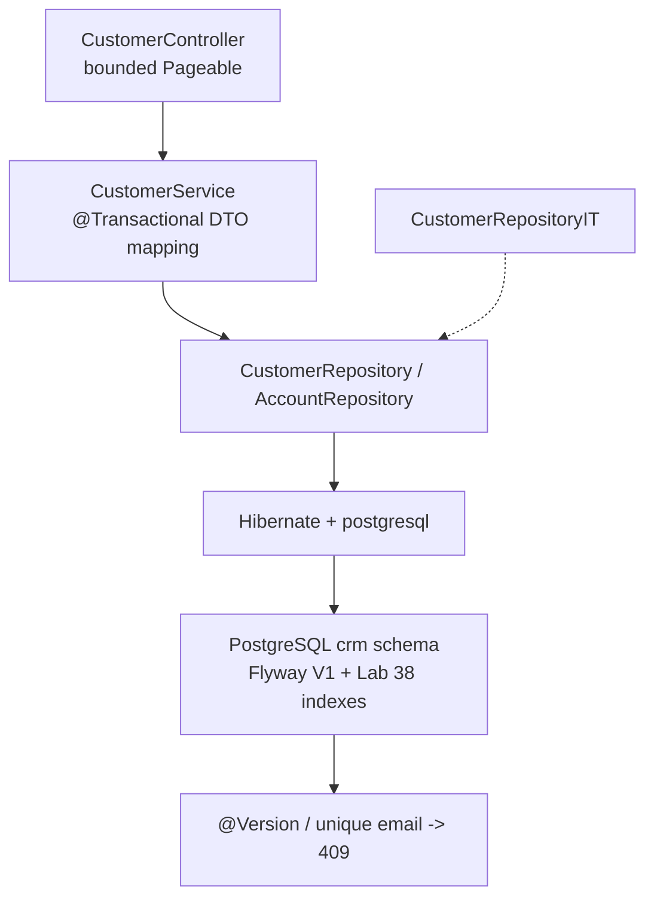

# Lab 39: Spring Data JPA with PostgreSQL — Flyway, Entities, Repositories, Paging, Optimistic Lock

**Module:** 39 — Spring Data JPA with PostgreSQL  
**Duration:** ~45 minutes (timed path with starter) · Full path: 4–5 Hours

**Primary IDE:** IntelliJ IDEA Community Edition · **Optional IDE:** VS Code

| OS | How-to for this lab |
| -- | ------------------- |
| Windows | [LAB-39-WINDOWS.md](LAB-39-WINDOWS.md) |
| macOS | [LAB-39-MACOS.md](LAB-39-MACOS.md) |

---

## Activity card

| | |
| --- | --- |
| **Time** | ~45 min timed · full path 4–5 h |
| **Checkpoint** | **E** (after Ex 1→2→3→4→5→6) |
| **Must prove** | Flyway V1 · entities/@Version · paging · 409 · IT on Postgres |
| **Hard gate** | Pre-lab Pass · Lab 37/38 DDL · Postgres · no secrets in Git |

### What you will learn

Persist CRM customers/accounts with Flyway + Spring Data JPA against real PostgreSQL.

### Enterprise context

Schema is migration-owned; ORM validates and serves transactional APIs without leaking SQL errors.

### Predict

Two concurrent updates with stale @Version — which HTTP status?

### Debug

IT green on H2 but fails on Postgres types/SQL — what was wrong with the test profile?

---

## 45-minute timed path (use starter)

> **Timed-path contract:** map starter Flyway `V1` + entities — lowercase tables `customer`/`account`, column `email` (not `email_normalized`), `String status` (`PROSPECT`/`ACTIVE`/`CLOSED`), `@Version` field `version`, account money as `balance_cents` (`BIGINT`). Instructor **solution** may follow the Lab 37 GUIDE schema (`email_normalized`, `NUMERIC` balance, `SUSPENDED`) as a full-path reference — graded timed work follows **starter**.

> **Pacing reminder:** [PACING.md](../PACING.md) checkpoint **E**. Homework: optimistic-lock 409 + sort allow-list. Optional Week 4 review **235–243**.

In class, use the starter templates so the **core** objectives fit **~45 minutes**. The full Steps below remain for homework / extended depth.

1. Open [`starter/README.md`](starter/README.md).
2. Copy `starter/` into your `java-bootcamp/examples/…` target (see starter README).
3. Fill every `// TODO` / `TODO` — do **not** wait on a perfect prior lab; the starter includes a baseline.
4. Run the starter smoke test; evidence under `notes/screenshots/lab-39/`.
5. Mark timed-path Pass criteria in the starter README. Continue remaining GUIDE steps as homework if needed.

| Path | Time | Scope |
| ---- | ---- | ----- |
| **Timed (default)** | ~45 min | Starter TODOs + smoke test |
| **Full (extended)** | see Duration | Every Step in this GUIDE |

---

## What you'll submit (read this first)

Keep this checklist visible while you work.

| # | Deliverable |
| - | ----------- |
| 1 | Spring Boot app with PostgreSQL JPA + Flyway `V1` |
| 2 | `CustomerEntity` / `AccountEntity` with correct types and `@Version` |
| 3 | Repositories, transactional service, bounded paging controller |
| 4 | Exception handler mapping duplicate + optimistic conflicts to 409 |
| 5 | `CustomerRepositoryIT` + `mvn clean verify` success evidence |
| 6 | `.env.example` + README runbook |
| 7 | Concepts notes; no secrets committed |

**Must submit:** the items in the table above (sources + evidence + short notes).

**Do not submit:** `target/`, `node_modules/`, secrets, heap dumps, or a verbatim instructor `solution/`.

## Lab Overview

This Module 39 lab wires the **Customer Management Platform** to PostgreSQL with **Spring Data JPA**: Flyway-managed schema, accurate entity mappings, focused repositories, transactional DTO services, deterministic paging, optimistic locking, safe conflict translation, and PostgreSQL-backed integration tests.

## Learning Objectives

After completing this lab, you will be able to:

* Configure Spring Data JPA for PostgreSQL with env-based credentials
* Manage schema changes with Flyway (`validate` + migrations only)
* Map customer and account entities to PostgreSQL types accurately
* Map `NUMERIC(19,2)` to `BigDecimal` and timestamps correctly
* Create repository lookups, existence checks, and paging queries

## Business Scenario

Before containers and cluster deploy, leadership freezes:

**No merge of JPA mapping that uses `ddl-auto=update/create`, embeds DB passwords in Git, or returns raw PostgreSQL exception text to clients.**

You own that gate for CRM create/find/list/update with Amina (`CUS-1001` ACTIVE), Ravi (`CUS-1002` PROSPECT→ACTIVE), duplicate email, not-found `CUS-9999`, and concurrent update races.

Use these examples consistently:

| ID | Name | Notes |
| -- | ---- | ----- |
| `CUS-1001` | Amina Khan | `ACTIVE` — happy find / accounts |
| `CUS-1002` | Ravi Singh | `PROSPECT` → `ACTIVE` |
| `CUS-9999` | — | not-found paths |
| `lab-request-001` | — | correlation on conflict/error responses |
| `lab39-001`, … | — | IT scenario IDs |

**Security note for evidence.** Use fictional emails only. Never commit `CRM_DB_PASSWORD`, `.env`, or PostgreSQL wallet files—use `.env.example` with empty placeholders.

---

## Architecture Context
### NOW (this lab)


```mermaid
flowchart TB
  Ctrl["CustomerController<br/>bounded Pageable"] --> Svc["CustomerService<br/>@Transactional DTO mapping"]
  Svc --> Repo["CustomerRepository / AccountRepository"]
  Repo --> Hib["Hibernate + postgresql"]
  Hib --> PG["PostgreSQL crm schema<br/>Flyway V1 + Lab 38 indexes"]
  PG --> Opt["@Version / unique email -> 409"]
  IT["CustomerRepositoryIT"] -.-> Repo
```

## Prerequisites

Prior labs: [37](../../module-37/lab37/LAB-37-GUIDE.md) · [38](../../module-38/lab38/LAB-38-GUIDE.md).

Confirm (Lab 0 tools assumed):

* JDK 21; Maven Wrapper or Maven 3.9+; Spring Boot 3.x
* PostgreSQL reachable on `localhost:5432/crm (or instructor host/schema)` (or instructor host)
* Testcontainers optional for IT (Docker required if used)
* No secrets committed to Git

### Pre-flight

```bash
java -version
mvn -version
```

## Worked example (read before you code)

Study this pattern once before Step 1. Your job is to apply the same idea in the Steps — do not skip ahead to a full solution.

```sql
CREATE TABLE customer (
  customer_id        BIGINT GENERATED BY DEFAULT AS IDENTITY PRIMARY KEY,
  public_id          VARCHAR(36)  NOT NULL,
  full_name          VARCHAR(200) NOT NULL,
  email   VARCHAR(320) NOT NULL,
  status             VARCHAR(32)  NOT NULL,
  created_at         TIMESTAMPTZ DEFAULT CURRENT_TIMESTAMP NOT NULL,
  version         BIGINT DEFAULT 0 NOT NULL,
  CONSTRAINT uk_customer_public_id UNIQUE (public_id),
  CONSTRAINT uk_customer_email_norm UNIQUE (email)
);

CREATE TABLE account (
  account_id    BIGINT GENERATED BY DEFAULT AS IDENTITY PRIMARY KEY,
  customer_id   BIGINT NOT NULL,
  balance_cents BIGINT NOT NULL DEFAULT 0,
  status        VARCHAR(32) NOT NULL,
  CONSTRAINT fk_account_customer FOREIGN KEY (customer_id) REFERENCES customer (customer_id)
);

CREATE INDEX ix_account_customer ON account (customer_id);
-- Prefer Lab 38 indexes if not already present:
-- CREATE UNIQUE INDEX ux_customer_email_norm ... (covered by UNIQUE constraint)
-- CREATE INDEX ix_customer_status_created ON customer (status, created_at DESC, customer_id DESC);
```

**What to notice:** Match names, IDs, and failure behavior from the scenario — instructors check these.

---

## Implementation Steps

Complete each step in order. Commands assume `~/java-bootcamp/examples/lab39-crm` (Windows: `%USERPROFILE%\java-bootcamp\examples\lab39-crm`) unless noted.

---

### Step 1 — Start PostgreSQL and scaffold `lab39-crm`

**Why:** Spring Boot must not race a cold database; schema work starts from a reachable PDB.

**Do this:**

```bash
docker start crm-postgres
# Wait until logs show DATABASE IS READY TO USE / healthy

cd ~/java-bootcamp/examples
# Prefer copying a prior Spring CRM lab if you have one; else springboot archetype / prior week module
mkdir -p lab39-crm && cd lab39-crm
mkdir -p src/main/java/com/northstar/crm src/main/resources/db/migration \
  src/test/java/com/northstar/crm/customer docs notes/screenshots
```

Export credentials into the shell or a local `.env` (gitignored)—never into `pom.xml`.

**Expected result:** PostgreSQL service healthy on `crm database / assigned schema`; project skeleton exists.

**If it fails:** Port 5432 busy → stop conflicting containers. Auth failed → reset Lab 37 app user password with instructor guidance.

---

### Step 2 — Add JPA, PostgreSQL JDBC, and Flyway dependencies

**Why:** The classpath must resolve `postgresql` and Flyway’s PostgreSQL support once, without duplicate drivers.

**Do this:** In `pom.xml`, ensure Spring Boot parent and add:

```xml
<dependency>
  <groupId>org.springframework.boot</groupId>
  <artifactId>spring-boot-starter-data-jpa</artifactId>
</dependency>
<dependency>
  <groupId>org.postgresql</groupId>
  <artifactId>postgresql</artifactId>
  <scope>runtime</scope>
</dependency>
<dependency>
  <groupId>org.flywaydb</groupId>
  <artifactId>flyway-core</artifactId>
</dependency>
<dependency>
  <groupId>org.flywaydb</groupId>
  <artifactId>flyway-database-postgresql</artifactId>
</dependency>
```

Optional IT: Testcontainers PostgreSQL module. Then:

```bash
mvn -q -DincludeArtifactIds=postgresql,flyway-core dependency:tree
```

**Expected result:** Maven resolves JPA, `postgresql`, and Flyway once without conflicts.

**If it fails:** Wrong Boot version → align with course BOM. Duplicate JDBC → exclude transitive H2 for runtime if it sneaks into main.

---

### Step 3 — Configure PostgreSQL safely

**Why:** Passwords in YAML are a Lab 40 finding waiting to happen; OSIV hides N+1 until prod.

**Do this:** `src/main/resources/application.yml`:

```yaml
spring:
  datasource:
    url: ${CRM_DB_URL:jdbc:postgresql://localhost:5432/crm}
    username: ${CRM_DB_USERNAME:crm_app}
    password: ${CRM_DB_PASSWORD}
  jpa:
    open-in-view: false
    hibernate:
      ddl-auto: validate
    properties:
      hibernate:
        jdbc:
          time_zone: UTC
  flyway:
    enabled: true
```

Create `.env.example` with keys only (no values). Document required exports in README.

**Expected result:** Pool starts when password is set; Hibernate validates; OSIV false; no password in Git.

**If it fails:** Startup fails without password → expected; set env. `ddl-auto` create → fix to `validate`.

---

### Step 4 — Create the Flyway migration

**Why:** Shared databases never accept silent Hibernate schema mutation.

**Do this:** Author `V1__crm_schema.sql` aligned with Labs 37–38 (expand to full CRM DDL you already validated):

```sql
CREATE TABLE customer (
  customer_id        BIGINT GENERATED BY DEFAULT AS IDENTITY PRIMARY KEY,
  public_id          VARCHAR(36)  NOT NULL,
  full_name          VARCHAR(200) NOT NULL,
  email   VARCHAR(320) NOT NULL,
  status             VARCHAR(32)  NOT NULL,
  created_at         TIMESTAMPTZ DEFAULT CURRENT_TIMESTAMP NOT NULL,
  version         BIGINT DEFAULT 0 NOT NULL,
  CONSTRAINT uk_customer_public_id UNIQUE (public_id),
  CONSTRAINT uk_customer_email_norm UNIQUE (email)
);

CREATE TABLE account (
  account_id    BIGINT GENERATED BY DEFAULT AS IDENTITY PRIMARY KEY,
  customer_id   BIGINT NOT NULL,
  balance_cents BIGINT NOT NULL DEFAULT 0,
  status        VARCHAR(32) NOT NULL,
  CONSTRAINT fk_account_customer FOREIGN KEY (customer_id) REFERENCES customer (customer_id)
);

CREATE INDEX ix_account_customer ON account (customer_id);
-- Prefer Lab 38 indexes if not already present:
-- CREATE UNIQUE INDEX ux_customer_email_norm ... (covered by UNIQUE constraint)
-- CREATE INDEX ix_customer_status_created ON customer (status, created_at DESC, customer_id DESC);
```

Never edit a migration already applied to a shared DB—add `V2__...` instead.

```bash
mvn -q spring-boot:run
# watch Flyway apply V1 once
```

**Expected result:** Flyway applies `V1` once; `flyway_schema_history` records success; app starts.

**If it fails:** Checksum mismatch → do not `repair` lightly; ask instructor. Privilege errors → grant Lab 37 privileges to app user.

---

### Step 5 — Map `CustomerEntity`

**Why:** Identity, public ID, normalized email, enum status, timestamps, and `@Version` must match PostgreSQL columns exactly.

**Do this:** Create `CustomerEntity` roughly as:

```java
import jakarta.persistence.Column;
import jakarta.persistence.Entity;
import jakarta.persistence.Enumerated;
import jakarta.persistence.GeneratedValue;
import jakarta.persistence.Id;
import jakarta.persistence.OneToMany;
import jakarta.persistence.Table;
import jakarta.persistence.Version;
import jakarta.persistence.EnumType;
import jakarta.persistence.GenerationType;
import java.util.HashSet;
import java.time.Instant;
import java.util.Set;

@Entity
@Table(name = "customer")
public class CustomerEntity {
  @Id
  @GeneratedValue(strategy = GenerationType.IDENTITY)
  @Column(name = "customer_id")
  private Long id;

  @Column(name = "PUBLIC_ID", nullable = false, unique = true)
  private String publicId;

  @Column(name = "email", nullable = false, unique = true)
  private String email;

  @Enumerated(EnumType.STRING)
  @Column(name = "STATUS", nullable = false)
  private String status;

  @Column(name = "CREATED_AT", nullable = false)
  private Instant createdAt;

  @Version
  @Column(name = "version")
  private long version;

  @OneToMany(mappedBy = "customer")
  private Set<AccountEntity> accounts = new HashSet<>();
}
```

**Expected result:** Identity ID generated; `version` begins at 0; public IDs can store `CUS-1001`.

**If it fails:** Dialect/identity issues on older XE → document strategy change (`SEQUENCE`) with instructor. Enum ordinal accidents → use `EnumType.STRING`.

---

### Step 6 — Map `AccountEntity` with `BigDecimal`

**Why:** Floating point money is a production defect; FK ownership stays on the account side.

**Do this:**

```java
import jakarta.persistence.Column;
import jakarta.persistence.Entity;
import jakarta.persistence.GeneratedValue;
import jakarta.persistence.Id;
import jakarta.persistence.ManyToOne;
import jakarta.persistence.Table;
import jakarta.persistence.FetchType;
import jakarta.persistence.GenerationType;

@Entity
@Table(name = "account")
public class AccountEntity {
  @Id
  @GeneratedValue(strategy = GenerationType.IDENTITY)
  @Column(name = "ACCOUNT_ID")
  private Long id;

  @ManyToOne(fetch = FetchType.LAZY, optional = false)
  @Column(name = "customer_id", nullable = false)
  private CustomerEntity customer;

  @Column(name = "BALANCE", precision = 19, scale = 2, nullable = false)
  private long balanceCents; // column balance_cents
}
```

Round-trip `1250.50` in an IT.

**Expected result:** `1250.50` persists and reads exactly; no join table; lazy `@ManyToOne`.

**If it fails:** Scale truncation → check `precision/scale`. Eager fetch storms → keep `LAZY`.

---

### Step 7 — Protect entity collections and equality

**Why:** Lazy collections in `equals`/`toString`/JSON cause lazy init exceptions or accidental full graph loads.

**Do this:** Exclude `accounts` from `equals`/`hashCode`/`toString`. Map API responses via DTOs—never return entities from controllers. Confirm listing customers does not select all accounts (log SQL or p6spy if enabled).

**Expected result:** Customer list does not N+1-load all accounts; serialization stays DTO-based.

**If it fails:** OSIV re-enabled “to make it work” → turn back off and fetch what you need explicitly.

---

### Step 8 — Create focused repositories

**Why:** CRM reads are specific: public ID, email uniqueness, status pages—not `findAll()` unbounded.

**Do this:**

```java
import org.springframework.data.jpa.repository.JpaRepository;
import java.util.Optional;
import org.springframework.data.domain.Page;
import org.springframework.data.domain.Pageable;

public interface CustomerRepository extends JpaRepository<CustomerEntity, Long> {
  Optional<CustomerEntity> findByPublicId(String publicId);
  boolean existsByEmail(String email);
  Page<CustomerEntity> findByStatus(String status, Pageable pageable);
}
```

Optional: `@EntityGraph` or dedicated projection for account detail.

```bash
mvn -q test -Dtest=CustomerRepositoryIT#findByPublicId
```

**Expected result:** Public-ID lookup returns Amina; ACTIVE `Page` returns expected content/total.

**If it fails:** Property name mismatch (`email` vs column) → align entity field names with Spring Data conventions.

---

### Step 9 — Write the transactional service + DTO mapping

**Why:** Normalization and business rules belong in the service transaction, not in controllers or entities.

**Do this:**

```java
import org.springframework.transaction.annotation.Transactional;

@Transactional
public CustomerResponse create(CreateCustomerRequest request) {
  String email = normalize(request.email());
  if (repository.existsByEmail(email)) {
    throw new DuplicateCustomerException(/* code + lab-request correlation */);
  }
  CustomerEntity saved = repository.save(mapper.toEntity(request, email));
  return mapper.toResponse(saved);
}
```

Seed/create `CUS-1001` Amina and `CUS-1002` Ravi in IT or a data loader.

**Expected result:** Duplicate normalized email maps to controlled conflict (eventually 409); happy create returns DTO without password/internal id leakage if policy requires public ids only.

**If it fails:** Unchecked rollback surprises → mark exceptions correctly. Validation only in DB → add Bean Validation on request DTO.

---

### Step 10 — Expose deterministic paging

**Why:** Unbounded `size=100000` and unstable sorts break CRM UIs and Lab 38’s lessons.

**Do this:** In controller:

```java
import org.springframework.data.domain.PageRequest;
import org.springframework.data.domain.Pageable;

int safeSize = Math.min(Math.max(size, 1), 100);
Pageable page = PageRequest.of(
    number,
    safeSize,
    Sort.by("fullName").and(Sort.by("id"))
);
```

Allow-list sort properties; reject unknown fields. Prefer status filter `ACTIVE` for demos.

**Expected result:** `size=1000` bounded to 100; sorting stable with ID tie-breaker; ACTIVE page deterministic for frozen data.

**If it fails:** Invalid sort property → 400 with safe message. Page content shuffle → add ID to `Sort`.

---

### Step 11 — Translate persistence conflicts

**Why:** Clients must never see `SQLSTATE/00001` or stack traces; operators need correlation IDs.

**Do this:** In `ApiExceptionHandler`:

```java
import org.springframework.web.bind.annotation.ExceptionHandler;
import org.springframework.dao.DataIntegrityViolationException;
import org.springframework.http.ResponseEntity;

@ExceptionHandler(DataIntegrityViolationException.class)
ResponseEntity<ProblemDetail> duplicate(DataIntegrityViolationException ex) { /* 409 */ }

@ExceptionHandler(OptimisticLockingFailureException.class)
ResponseEntity<ProblemDetail> conflict(OptimisticLockingFailureException ex) { /* 409 */ }
```

Include correlation header/value `lab-request-001` in tests. Omit SQL and constraint names from bodies if they reveal schema internals beyond policy.

**Expected result:** Duplicate email and optimistic conflict return controlled **409**; no raw PostgreSQL text.

**If it fails:** Still 500 → ensure exception type matches Spring’s translation. Swallowed exception → rethrow domain types from service.

---

### Step 12 — Run PostgreSQL integration tests and verify

**Why:** H2 “green” is not PostgreSQL green for identity, types, and constraints.

**Do this:** Implement `CustomerRepositoryIT` covering mappings, unique constraint, paging stability, optimistic lock race, and account detail without N+1. Then:

```bash
export CRM_DB_PASSWORD=...   # local only
./mvnw -q test -Dtest=CustomerRepositoryIT
./mvnw -q clean verify
```

Capture Surefire excerpts under `notes/screenshots/lab-39/`.

**Expected result:** PostgreSQL tests pass; verify green; no N+1 in account detail path; fixtures documented.

**If it fails:** Flaky IT → isolate schema (`@Sql` / Testcontainers) or truncate carefully. Connection refused → Step 1.

---

### Step 13 — Failure experiments + runbook

**Why:** The next engineer must recreate 409 and paging without Slack archaeology.

**Do this:** Complete Failure Experiments. Document run commands, required env vars, and Flyway notes in README / `docs/jpa-postgres-notes.md`.

**Expected result:** ≥3 experiments; peer can follow README to green verify; `git status` clean of `.env` / `target/`.

**If it fails:** See Troubleshooting.

---

## Implementation Checkpoints

### Checkpoint A — Tooling

_Mark **Pass** or **Fail** in your lab notes._

| # | Confirm | Your notes |
| - | ------- | ---------- |
| 1 | `lab39-crm` under `examples/` | Pass / Fail |
| 2 | PostgreSQL healthy; JPA + postgresql + Flyway on classpath | Pass / Fail |
| 3 | Env-based credentials; `.env` gitignored | Pass / Fail |

### Checkpoint B — Schema and entities

_Mark **Pass** or **Fail** in your lab notes._

| # | Confirm | Your notes |
| - | ------- | ---------- |
| 1 | Flyway `V1` applied; `ddl-auto=validate` | Pass / Fail |
| 2 | `CustomerEntity` + `AccountEntity` mapped; `@Version` present | Pass / Fail |
| 3 | Lazy collections excluded from equality/JSON | Pass / Fail |

### Checkpoint C — API / persistence behavior

_Mark **Pass** or **Fail** in your lab notes._

| # | Confirm | Your notes |
| - | ------- | ---------- |
| 1 | Repositories: publicId, email exists, status paging | Pass / Fail |
| 2 | Transactional create/find; bounded deterministic paging | Pass / Fail |
| 3 | 409 for duplicate + optimistic lock without ORA text | Pass / Fail |

### Checkpoint D — Hygiene

_Mark **Pass** or **Fail** in your lab notes._

| # | Confirm | Your notes |
| - | ------- | ---------- |
| 1 | `CustomerRepositoryIT` + `mvn clean verify` green | Pass / Fail |
| 2 | README runbook complete | Pass / Fail |
| 3 | No secrets / `target/` committed | Pass / Fail |

---

## Reference Commands, Configuration, and Code

### `application.yml` (excerpt)

```yaml
spring:
  datasource:
    url: ${CRM_DB_URL:jdbc:postgresql://localhost:5432/crm}
    username: ${CRM_DB_USERNAME:crm_app}
    password: ${CRM_DB_PASSWORD}
  jpa:
    open-in-view: false
    hibernate:
      ddl-auto: validate
  flyway:
    enabled: true
```

### Commands

```bash
cd ~/java-bootcamp/examples/lab39-crm
docker start crm-postgres
export CRM_DB_PASSWORD=...    # never commit
./mvnw -q test -Dtest=CustomerRepositoryIT
./mvnw -q clean verify
./mvnw -q spring-boot:run
git status
```

## Failure Experiments

| # | Experiment | Observe | Restore |
| - | ---------- | ------- | ------- |
| 1 | Stop PostgreSQL and start app | Fail fast / pool errors | Start PostgreSQL; retry |
| 2 | Insert duplicate email | 409 or IT assertion | Use unique email |
| 3 | Stale `@Version` update | Optimistic failure → 409 | Reload entity; retry |
| 4 | Request `size=1000` | Capped to 100 | Keep allow-list |
| 5 | Temporarily set `ddl-auto=update` | Document risk; do not leave it | Restore `validate` |

---

## Troubleshooting

| Symptom | Likely cause | Fix |
| ------- | ------------ | --- |
| ORA listener / IO | PostgreSQL down / wrong URL | `docker ps`; fix JDBC URL |
| Flyway checksum | Edited applied migration | New `V2`; avoid silent repair |
| LazyInitializationException | OSIV off + lazy after TX | Fetch join / DTO inside TX |
| IT passes on H2 only | Wrong test profile | Force PostgreSQL / Testcontainers |
| 500 on duplicate | Unhandled integrity exception | Map to ProblemDetail 409 |
| Money drift | `double` mapping | Use `BigDecimal` + precision |
| N+1 on detail | Missing graph/query | EntityGraph or join fetch |
| ddl-auto=create-drop in app | Schema drift | Flyway + `validate` |

## Security and Production Review

Optional — jot brief notes in your README if useful for your progress check (not a separate essay):

1. Which inputs are untrusted (HTTP bodies, sort params, page size)?
2. Where are authn/authz/validation enforced (filters/service—JPA is not authz)?
3. Which values are sensitive (DB password, real PII)—where stored?

---


## Cleanup

```bash
cd ~/java-bootcamp/examples/lab39-crm
./mvnw -q clean
# leave PostgreSQL running if Lab 40–41 need it; or docker stop crm-postgres
git status
```

Do not commit `.env`, wallets, or `target/`.

**Keep `lab39-crm`**—Lab 40 security scans and Lab 41 container builds use this backend.


## Reflection Questions

Write **1–3 sentence** answers (not essays):

1. Which design decision most affected correctness (types, OSIV, Flyway)?
2. What evidence proves PostgreSQL mappings work (not just unit mocks)?
3. Which failure was hardest to diagnose?

---


