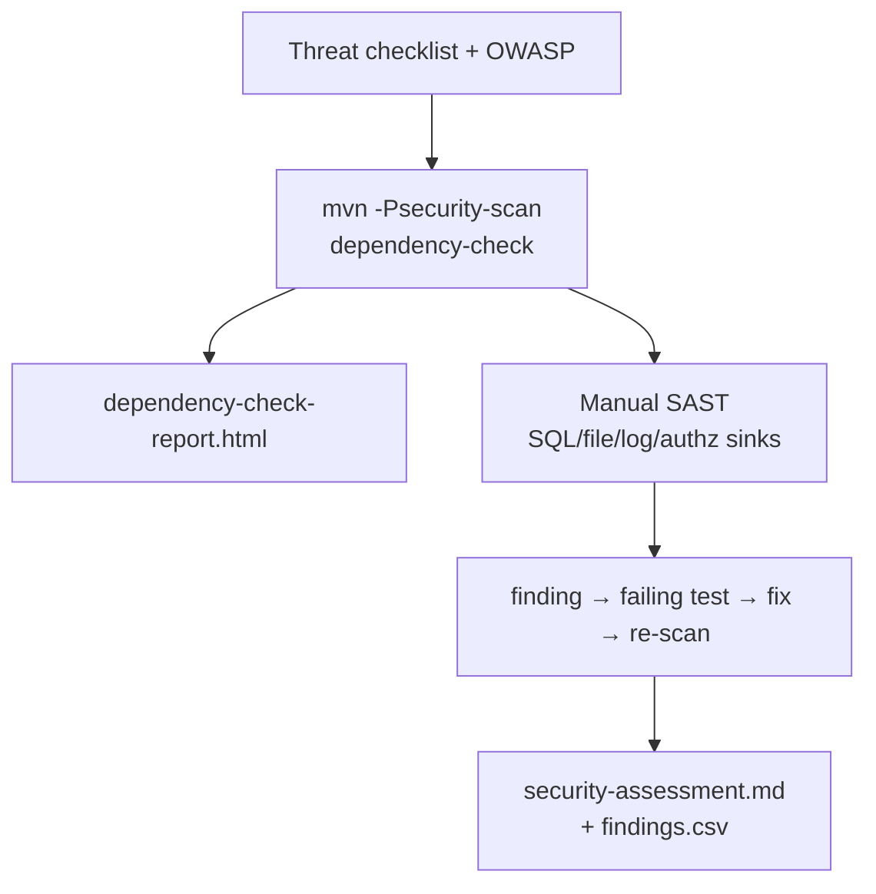
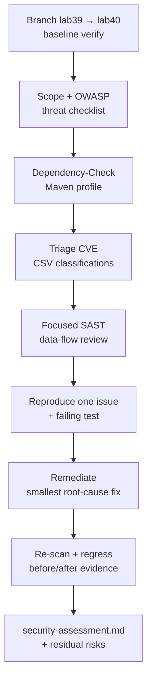

# Lab 40: Application Security Testing for the CRM — Dependency-Check, SAST, Remediation

**Module:** 40 — Application Security Testing for the CRM  
**Lab folder:** `labs/Week 5 - DevOps, CI-CD and OpenShift/module-40/lab40/`  
**Difficulty:** Intermediate  
**Duration:** 3–4 Hours

**Primary IDE:** IntelliJ IDEA Community Edition · **Optional IDE:** VS Code

| OS | How-to for this lab |
| -- | ------------------- |
| Windows | [LAB-40-WINDOWS.md](LAB-40-WINDOWS.md) |
| macOS | [LAB-40-MACOS.md](LAB-40-MACOS.md) |

> **Environment reminder:** Finish [Lab 0](../../../Week%201%20-%20Java%20and%20JVM%20Foundations/module-00/lab0/LAB-0-GUIDE.md). Use **IntelliJ IDEA Community** (primary; optional VS Code) on your laptop with **JDK 21** and **Maven 3.9+** (OWASP Dependency-Check via Maven). Work under `~/java-bootcamp` (Windows: `%USERPROFILE%\java-bootcamp`).

---

## How to follow this lab

1. Open the **Windows** or **macOS** how-to (links above) in a second tab.
2. Create/work only under your `java-bootcamp/examples/…` folder from the steps (not inside this `labs/` git clone unless a step says otherwise).
3. For each **Step N**: read **Why** (if present) → do the actions → confirm **Expected** / **Expected result** → then continue.
4. When stuck, use **Failure Experiments** / troubleshooting in this guide before asking for help.
5. Capture evidence under `notes/screenshots/lab-40/` (workspace root under `java-bootcamp`; redact secrets). Use the **Pass criteria** tables — write **Pass** or **Fail** in your notes. GitHub file view does not support clickable checkboxes.

## Lab Overview

This Module 40 lab turns the CRM into a **defensible security gate**: map OWASP-relevant attack surfaces, run **OWASP Dependency-Check**, triage CVEs, perform focused **manual SAST**, reproduce one confirmed issue, remediate with the smallest safe fix, re-scan and regression-test, and publish `docs/security-assessment.md`.

**Purpose.** Leadership freezes a release gate before containers (Lab 41): scanners alone are not enough. Every confirmed finding needs severity rationale, evidence, and either a fix, a time-bounded acceptance with owner, or a documented false positive—never silent suppressions.

**What you build (exercise).** Branch `lab40-crm` from Lab 39; define scope and threat checklist; add Dependency-Check Maven profile (HTML+JSON, CVSS fail threshold); run and triage findings; perform SAST on request→sink paths and object-level authz; write a failing regression test; remediate; re-scan; complete `security-assessment.md` + `security-findings.csv`.

**What success looks like.** Under `~/java-bootcamp/examples/lab40-crm/` (or platform `backend/` if integrating) you have before/after scan evidence, one verified remediation, a green functional regression, and an assessment a peer can reproduce without verbal hand-waving.

**Depends on Lab 39.** Need a building Spring CRM with fixtures and tests. Finish Lab 39 if verify is already red—do not hide inherited failures.

**CRM connection.** Fixtures `CUS-1001` (Amina) / `CUS-1002` (Ravi) / correlation `lab-request-001`. Security tests must use synthetic emails only. Lab 41 must not bake secrets into images—findings here become Dockerfile rules.

---

## Learning Objectives

After completing this lab, you will be able to:

* Map CRM attack surfaces to OWASP-aligned risks
* Run OWASP Dependency-Check via Maven with HTML/JSON output
* Interpret CVE, CVSS, CPE, and transitive dependency paths
* Perform focused manual SAST on injection, authz, and secrets
* Triage false positives and accepted risks with owners and expiry
* Reproduce one confirmed issue with an automated regression test
* Apply the smallest root-cause remediation and re-scan
* Write a before-and-after security assessment without leaking secrets
* Keep suppressions narrow, justified, and time-bounded
* Refuse to weaken tests or controls just to get a green badge

---

## Business Scenario

A release candidate handles customer identifiers, contact details, agent roles, PostgreSQL queries, and (later) Kafka events. Leadership freezes:

**No “ship it” based on raw scanner volume. No merge that commits secrets, disables the scan gate without approval, or leaves a confirmed High without owner and due date.**

You own that gate for the CRM backend that serves Amina (`CUS-1001`), Ravi (`CUS-1002`), and agent role boundaries.

Use these examples consistently:

| ID | Name | Notes |
| -- | ---- | ----- |
| `CUS-1001` | Amina Khan | `ACTIVE` — object-level authz fixture |
| `CUS-1002` | Ravi Singh | `PROSPECT` — cross-agent access attempts |
| `CUS-9999` | — | not-found vs unauthorized distinctions |
| `lab-request-001` | — | correlation on security-relevant errors |
| `lab40-001`, … | — | finding IDs in CSV / assessment |

**Security note for evidence.** Use fictional emails (`amina.khan@example.test`). Sanitize scanner output before commit. Never commit NVD API keys, `.env`, tokens, or customer exports.

---

## Architecture Context

### NOW (this lab)



### Lab flow (mermaid)



### Architecture NOW vs LATER

| Aspect | Lab 40 (NOW) | Lab 41–42 |
| ------ | ------------ | --------- |
| Focus | Deps + SAST + assessment | Image hardening, cluster RBAC |
| Gate | CVSS threshold + remediation proof | Non-root image, Secrets, probes |
| Artifacts | `security-assessment.md`, HTML report | Dockerfile, K8s manifests |
| Authz tests | `@WithMockUser` / MockMvc | Same tests still must pass in CI |

**Lab focus:** OWASP-aware review, dependency scanning, focused SAST, one verified remediation, before-and-after report—not full penetration testing or attacking shared systems.

---

## Prerequisites

Complete [SETUP](../../../SETUP-INSTRUCTIONS.md), [Lab 0](../../../Week%201%20-%20Java%20and%20JVM%20Foundations/module-00/lab0/LAB-0-GUIDE.md), and [Lab 39](../../../Week%204%20-%20Kafka,%20React,%20PostgreSQL%20and%20Resilience/module-39/lab39/LAB-39-GUIDE.md). Confirm:

* CRM backend builds with Java 21 + Maven Wrapper
* OWASP Dependency-Check via Maven plugin (version pinned)
* Authorized synthetic test data only; local or training env only
* No secrets committed to Git

### Pre-flight

```bash
java -version
./mvnw --version 2>/dev/null || mvn -version
docker --version
git status --short
pwd
ls ~/java-bootcamp/examples
```

Record baseline:

```bash
cd ~/java-bootcamp/examples
cp -r lab39-crm lab40-crm
cd lab40-crm
./mvnw -B clean verify
```

If baseline fails, save the exact error and agree with the instructor whether it is pre-existing. Do not skip tests to hide inherited failure.

---

## Suggested Project Files

Prefer `~/java-bootcamp/examples/lab40-crm/`. For platform integration cohorts, mirror the same artifacts under `customer-management-platform/backend/` and `docs/` / `reports/`.

```text
~/java-bootcamp/examples/lab40-crm/
├── src/
│   ├── main/java/com/northstar/crm/...
│   └── test/java/com/northstar/crm/
│       └── security/
│           └── ObjectOwnershipSecurityTest.java
├── docs/
│   ├── security-assessment.md
│   ├── security-findings.csv
│   └── threat-checklist.md
├── reports/                         (sanitized; gitignore bulky HTML if policy requires)
│   └── dependency-check-report.html
├── dependency-check-suppressions.xml
├── notes/screenshots/
├── pom.xml                          (security-scan profile)
├── .gitignore
└── README.md
```

Ignore real `.env`, NVD keys, private reports with tokens, `target/`, and customer dumps.

---

## Concepts to Discuss

Write 2–3 sentences each in `docs/threat-checklist.md` (or assessment appendix):

1. Main flow under review (HTTP API → service → PostgreSQL; optional Kafka later)
2. Trust boundary: who is authenticated vs what every agent may read
3. Success/failure contracts for unauthorized access (403 vs 404 policy)
4. Stable fixtures (`CUS-1001`) vs real PII (never)
5. Idempotency of re-scan (`mvn -Psecurity-scan`) and regression tests
6. Why CVSS alone is insufficient without reachability notes
7. Evidence leads need (command, plugin version, finding ID, fix commit)
8. Two machines: same suppressions file, same threshold, same results intent
9. False positives vs silent ignores
10. What Lab 41 changes (container attack surface) without invalidating this assessment’s code findings

---

## Implementation Steps

Complete each step in order. Commands assume `~/java-bootcamp/examples/lab40-crm` (Windows: `%USERPROFILE%\java-bootcamp\examples\lab40-crm`) unless noted.

---

### Step 1 — Establish scope and threat checklist

**Why:** Scanners without a scope produce noise; security work needs stated targets and severity fields first.

**Do this:**

```bash
cd ~/java-bootcamp/examples/lab40-crm
mkdir -p docs reports ~/java-bootcamp/notes/screenshots/lab-40 src/test/java/com/northstar/crm/security
```

In `docs/threat-checklist.md`, record components (API, PostgreSQL, config), data classes (customer PII fields), users (agent/admin), trust boundaries, and authorized scan targets (this repo/module only). Map at least: broken access control, injection, auth failures, security misconfig, logging failures to concrete endpoints.

Define CSV columns before scanning: `finding_id,source,package_or_location,cve_or_rule,cvss,classification,owner,due_date,notes`.

**Expected result:** Checklist and empty `security-findings.csv` header committed; scope excludes attacking third-party systems.

**If it fails:** Over-broad “scan the internet” scope → rewrite to training CRM only.

---

### Step 2 — Add OWASP Dependency-Check Maven profile

**Why:** The gate must be executable by peers via Maven, not a one-off GUI click.

**Do this:** Add a pinned plugin profile (adapt version to course pin):

```xml
<profile>
  <id>security-scan</id>
  <build>
    <plugins>
      <plugin>
        <groupId>org.owasp</groupId>
        <artifactId>dependency-check-maven</artifactId>
        <version>${dependency-check.version}</version>
        <configuration>
          <formats>
            <format>HTML</format>
            <format>JSON</format>
          </formats>
          <failBuildOnCVSS>7</failBuildOnCVSS>
          <suppressionFile>dependency-check-suppressions.xml</suppressionFile>
        </configuration>
        <executions>
          <execution>
            <goals><goal>check</goal></goals>
          </execution>
        </executions>
      </plugin>
    </plugins>
  </build>
</profile>
```

Create an empty or commented `dependency-check-suppressions.xml` with a policy note: suppressions need CVE, rationale, owner, expiry.

**Expected result:** Profile present; suppression file exists; version pinned in properties.

**If it fails:** Plugin not found → check version/property. Accidental always-on fail in default build → keep under profile unless CI already requires it.

---

### Step 3 — Run dependency scanning and preserve command evidence

**Why:** Reproducibility requires exact command + tool version + date.

**Do this:**

```bash
./mvnw -v
./mvnw -B -Psecurity-scan dependency-check:check
```

Copy sanitized HTML/JSON into `reports/` (or link to `target/` and paste excerpts). Record plugin version and whether NVD update succeeded. First run may be slow—do not kill mid-DB update without noting it.

**Expected result:** HTML + JSON reports produced; command + version recorded in assessment drafts.

**If it fails:** NVD download blocked → use instructor-cached data directory flags if provided. OOM → increase Maven memory for this profile only.

---

### Step 4 — Triage findings (not just count them)

**Why:** “87 vulnerabilities” is not a decision; classification is.

**Do this:** Sort by exploitability, reachability (is the class on the runtime classpath?), and CVSS. For each top item enter CSV:

* `confirmed` / `false_positive` / `mitigated` / `accepted` / `needs_review`

Every `accepted` or suppression gets **owner**, **rationale**, and **expiry date**. Prefer fixing reachable High/Critical over mass suppression.

Include at least one intentional analysis of a transitive dependency path (`dependency:tree` excerpt).

**Expected result:** CSV populated for top findings; no “ignore forever” without expiry.

**If it fails:** Blank classifications → stop and finish triage before remediating randomly.

---

### Step 5 — Perform focused manual SAST

**Why:** Dependency-Check misses authz bugs and your own SQL concatenation.

**Do this:** Trace untrusted request values (`@RequestParam`, body fields, headers) to sinks: JPQL/SQL, file paths, process exec, logs, outbound events. Inspect endpoint and **object-level** authorization (agent A must not read agent B’s customer if that is the policy). Search for secrets, verbose errors, unsafe logging of PII, and weak defaults (`ddl-auto`, open actuator).

Document method FQNs and risk notes under finding IDs `lab40-001`….

Prefer parameterized access:

```java
@Query("select c from CustomerEntity c where lower(c.normalizedEmail) = lower(:email)")
Optional<CustomerEntity> findByEmailIgnoreCase(@Param("email") String email);
```

**Expected result:** Written SAST notes covering injection + access control + secrets/logging; at least one concrete code location cited.

**If it fails:** Only “looks fine” with no file:line → deepen the data-flow pass.

---

### Step 6 — Reproduce one confirmed issue with a failing test

**Why:** Unreproduced findings invite cosmetic patches.

**Do this:** Choose a safe, confirmed, high-value issue (example: object ownership / broken access control). Write a failing automated test first:

```java
@Test
@WithMockUser(username = "agent-a", roles = "AGENT")
void agentCannotReadAnotherAgentsCustomer() throws Exception {
  mvc.perform(get("/api/customers/{id}", otherAgentsCustomerId)
          .header("X-Correlation-Id", "lab-request-001"))
     .andExpect(status().isForbidden()); // or policy-accurate status
}
```

Use fixtures/`CUS-1001`/`CUS-1002` synthetically. Capture sanitized before-fix evidence.

**Expected result:** Red test (or deterministic repro script) proving the issue; evidence saved.

**If it fails:** Flaky security test → fix fixtures isolation. 404 vs 403 debate → document policy and assert that policy.

---

### Step 7 — Remediate safely (smallest root-cause fix)

**Why:** Wide refactors and blanket suppressions hide residual risk.

**Do this:** Apply the smallest fix (authz check, parameterization, dependency bump with release notes review). Keep unrelated formatting out of the diff. Do **not** disable the scanner, lower `failBuildOnCVSS` silently, or `@Disabled` the security test.

If upgrading a library, note breaking changes and run the CRM suite.

**Expected result:** Focused remediation commit-ready diff; rationale in assessment linked to `lab40-00x`.

**If it fails:** Fix breaks unrelated features → narrow further or add compensating tests before proceeding.

---

### Step 8 — Re-scan, regress, and write the assessment

**Why:** Green tests without a before/after security story do not satisfy the gate.

**Do this:**

```bash
./mvnw -B test
./mvnw -B -Psecurity-scan dependency-check:check
./mvnw -B clean verify
```

Compare before/after for the remediating finding. Confirm the reproducer now passes. Write `docs/security-assessment.md` covering: scope, method, tooling versions, findings summary, severity rationale, remediation, residual risks (owners + dates), and explicit separation of facts vs assumptions. Sanitize all evidence.

**Expected result:** Assessment + CSV complete; before/after clear; verify green; residual risks owned.

**If it fails:** Scanner still fails on unrelated Critical → triage/suppress with expiry or fix; do not delete the profile.

---

### Step 9 — Failure experiments + evidence hygiene

**Why:** Security work fails socially when evidence contains secrets or cannot be reproduced.

**Do this:** Complete [Failure Experiments](#failure-experiments). Run `git status` and scrub reports of tokens. Ensure `.gitignore` covers local NVD data and `.env`.

**Expected result:** ≥3 experiments; peer-reviewable packet; no secrets staged.

**If it fails:** See Troubleshooting.

---

### Step 10 — Peer walkthrough and residual-risk register

**Why:** A security gate that only the author understands will be skipped under delivery pressure.

**Do this:** Walk a peer through: (1) threat checklist scope, (2) one CSV row classification, (3) the ownership test, (4) the remediation diff, (5) residual risks table. Ask them to re-run:

```bash
./mvnw -B test -Dtest=ObjectOwnershipSecurityTest
./mvnw -B -Psecurity-scan dependency-check:check
```

Update the residual-risk register with any peer questions that revealed undocumented assumptions (for example “does actuator expose env?”). Record peer initials and date in the assessment appendix—not as a grade substitute, as reproducibility proof.

**Expected result:** Peer can reproduce the primary security result from docs alone; residual risks have owners and dates; assumptions list updated.

**If it fails:** Peer blocked on missing command → fix assessment. Peer finds a secret in a report → scrub, rotate if needed, re-attach sanitized evidence.

---

## Implementation Checkpoints

### Checkpoint A — Scope and tooling

_Mark each row **Pass** or **Fail** in your lab notes (GitHub markdown files are not interactive checklists)._

| # | Confirm | Your notes |
| - | ------- | ---------- |
| 1 | `lab40-crm` baseline `verify` known | Pass / Fail |
| 2 | Threat checklist + CSV headers | Pass / Fail |
| 3 | Dependency-Check profile + pinned version | Pass / Fail |

### Checkpoint B — Scan and triage

_Mark each row **Pass** or **Fail** in your lab notes (GitHub markdown files are not interactive checklists)._

| # | Confirm | Your notes |
| - | ------- | ---------- |
| 1 | HTML/JSON reports generated | Pass / Fail |
| 2 | Top findings classified with owners/expiry where needed | Pass / Fail |
| 3 | Transitive path examined for ≥1 finding | Pass / Fail |

### Checkpoint C — SAST and remediation

_Mark each row **Pass** or **Fail** in your lab notes (GitHub markdown files are not interactive checklists)._

| # | Confirm | Your notes |
| - | ------- | ---------- |
| 1 | Manual SAST notes for injection/authz/secrets | Pass / Fail |
| 2 | Failing reproducer then fix | Pass / Fail |
| 3 | Re-scan + regression pass for that finding | Pass / Fail |

### Checkpoint D — Hygiene

_Mark each row **Pass** or **Fail** in your lab notes (GitHub markdown files are not interactive checklists)._

| # | Confirm | Your notes |
| - | ------- | ---------- |
| 1 | `security-assessment.md` complete | Pass / Fail |
| 2 | Two consecutive test runs green for suite | Pass / Fail |
| 3 | No secrets / raw customer data in Git | Pass / Fail |
| 4 | Peer walkthrough recorded (initials + date) | Pass / Fail |
| 5 | Residual risks have owners and due dates | Pass / Fail |
| 6 | Suppressions (if any) include expiry | Pass / Fail |

---

## Safety Rules (restate before scanning)

* Work only against local services or the authorized training environment.
* Use synthetic records (`amina.khan@example.test`); never real customer information.
* Read every Maven/plugin command before running it; first NVD update can take a long time.
* Store NVD API keys (if used) in environment variables—not in `pom.xml`.
* Do not weaken authorization, TLS, scanning, validation, or tests to obtain a green result.
* Pin Dependency-Check and document the version in the assessment.
* Keep remediations narrowly scoped; do not reformat unrelated files.
* Record assumptions, deviations, residual risks, owners, and due dates.
* Stop before destructive database actions; obtain instructor approval.

---

## Reference Commands, Configuration, and Code

### Dependency-Check profile

See Step 2 XML sample (`failBuildOnCVSS` 7, HTML+JSON, suppressions file). Keep the plugin under `-Psecurity-scan` unless your CI already requires it by default.

### Suppression snippet (time-bounded)

```xml
<?xml version="1.0" encoding="UTF-8"?>
<suppressions xmlns="https://jeremylong.github.io/DependencyCheck/dependency-suppression.1.3.xsd">
  <!-- Example only — fill CVE, rationale, owner, expiry in assessment -->
  <suppress until="2026-10-01Z">
    <notes>lab40: accepted transitive X until upgrade Y; owner=student; review before expiry</notes>
    <cve>CVE-2099-0000</cve>
  </suppress>
</suppressions>
```

### Parameterized query reminder

```java
@Query("select c from CustomerEntity c where lower(c.normalizedEmail) = lower(:email)")
Optional<CustomerEntity> findByEmailIgnoreCase(@Param("email") String email);
```

### Object-ownership security test

```java
@Test
@WithMockUser(username = "agent-a", roles = "AGENT")
void agentCannotReadAnotherAgentsCustomer() throws Exception {
  mvc.perform(get("/api/customers/{id}", otherAgentsCustomerId)
          .header("X-Correlation-Id", "lab-request-001"))
     .andExpect(status().isForbidden());
}
```

### Findings CSV header

```csv
finding_id,source,package_or_location,cve_or_rule,cvss,classification,owner,due_date,notes
lab40-001,dependency-check,example:lib:1.2.3,CVE-2024-XXXX,7.5,needs_review,student,2026-07-21,transitive via spring-boot
lab40-002,sast,CustomerController#get,ACL-missing,,confirmed,student,2026-07-15,agent-a vs CUS-1002
```

### Assessment outline (minimum sections)

```markdown
# Security Assessment — Lab 40 CRM
## Scope and assets
## Method and tool versions
## Dependency findings (before / after)
## Manual SAST findings
## Remediation summary (lab40-00x)
## Residual risks (owner, due date)
## Facts vs assumptions
## Reproduce commands
```

### Commands

```bash
cd ~/java-bootcamp/examples/lab40-crm
./mvnw -B clean verify
./mvnw -B -Psecurity-scan dependency-check:check
./mvnw -B test -Dtest=ObjectOwnershipSecurityTest
./mvnw -q dependency:tree -Dincludes=*vulnerable-example*   # adapt package
git status --short
```

### Artifact map

| Artifact | Role |
| -------- | ---- |
| `threat-checklist.md` | Scope / OWASP map |
| Dependency-Check HTML/JSON | SCA evidence |
| `security-findings.csv` | Triage ledger |
| `dependency-check-suppressions.xml` | Time-bounded exceptions |
| `ObjectOwnershipSecurityTest` | Authz regression |
| `security-assessment.md` | Gate narrative |

---

## Manual Verification

1. Baseline verify recorded before security changes.
2. Dependency-Check runs via `-Psecurity-scan` with pinned version.
3. Findings classified; accepted risks have owner + expiry.
4. Manual SAST covers request→sink and object-level authz.
5. One issue reproduced with automated test (red then green).
6. Remediation is minimal and reviewable.
7. Re-scan shows improvement for that finding (or honest residual note).
8. Assessment separates facts vs assumptions; evidence sanitized.
9. CRM fixtures only; no real PII; correlation used where relevant.
10. No secrets, kubeconfig, or wallet files committed.

---

## Failure Experiments

| # | Experiment | Observe | Restore |
| - | ---------- | ------- | ------- |
| 1 | Temporarily set `failBuildOnCVSS` to `1` | Build fails on more findings | Restore agreed threshold |
| 2 | Add a suppression without expiry | Document why policy rejects it | Add expiry or remove |
| 3 | Break authz check; run ownership test | Test red | Restore fix |
| 4 | Log a password in a test assertion message | Evidence hygiene catch | Remove; rotate lab secret if real |
| 5 | Re-run scan twice | Comparable top findings | Note NVD DB update diffs if any |

---

## Troubleshooting

| Symptom | Likely cause | Fix |
| ------- | ------------ | --- |
| NVD download fails | Network / rate limit | Instructor cache; API key in env not Git |
| Scan extremely slow | First DB populate | Wait; reuse data directory |
| Build fails only on scan | High CVSS present | Triage/fix; don’t delete profile |
| False positive CPE | Wrong package match | Suppression with evidence + expiry |
| Security test 401 | Test security config | Align `@WithMockUser` / filter chain |
| Report too large for Git | Bulky HTML | Excerpt + gitignore; keep JSON summary |
| Inherited verify red | Lab 39 drift | Fix baseline first |
| Plugin version drift | Unpinned property | Pin `${dependency-check.version}` |
| CPE mismatch noise | Wrong package identity | Confirm artifactId/groupId path |
| Authz test always 200 | Security filter not applied in `@WebMvcTest` | Use slice/`@SpringBootTest` + security config as designed |
| Assessment vague | No commands/versions | Add reproduce section from Reference |

---

## Evidence Log Template

```markdown
# Lab 40 Evidence Log
- Branch / commit:
- JDK / Maven / Dependency-Check versions:
- Baseline verify: PASS/FAIL (paste narrow excerpt)
- Scan command:
- Finding remediated (lab40-00x):
- Before CVSS / after:
- Regression test:
- Residual risks:
```

---

## Security and Production Review

Answer in `security-assessment.md`:

1. Which inputs are untrusted (HTTP, headers, file uploads if any)?
2. Where are authn/authz/validation enforced?
3. Which values are sensitive—where stored (never in reports)?
4. What can be retried safely (re-scan, re-test)?
5. What happens after partial failure (scan fail vs app still running)?
6. What would an operator/security lead monitor (CI gate, CVE aging)?
7. Which local default is unacceptable (empty suppressions forever, disabled tests)?
8. How are dependency/API contracts versioned with remediations?

---

## Cleanup

```bash
cd ~/java-bootcamp/examples/lab40-crm
./mvnw -q clean
# Keep sanitized assessment; remove ephemeral NVD temp dirs if created locally
git status --short
```

Do not commit live credentials rotated during the lab without scrubbing history instructions from instructor.

**Keep `lab40-crm`**—Lab 41 containerizes this hardened backend; security tests should still pass.

---

## Expected Deliverables

* Threat checklist + OWASP mapping notes
* Dependency-Check profile, reports (sanitized), triage CSV
* Focused SAST notes with code locations
* Security regression test + remediation evidence
* Before/after scan comparison for the fixed finding
* `docs/security-assessment.md` with residual risks owned
* Baseline and final `verify` results
* No secrets or real customer records

---

## Evaluation Rubric (100 Marks)

| Criteria | Marks |
| -------- | ----: |
| Environment and project structure | 10 |
| Core implementation (scan, SAST, remediation, test) | 30 |
| Integration/configuration correctness (plugin profile, outputs) | 15 |
| Failure handling (triage, repro, residual risk) | 15 |
| Automated verification | 10 |
| Security and production awareness | 10 |
| Documentation and evidence | 10 |

**Notes:** Mass suppressions without expiry → lose security marks. Disabling the gate or `@Disabled` on the ownership test → honor violation. Assessment without commands/versions → lose documentation marks.

---

## Reflection Questions

Write 3–6 sentence answers:

1. Which design decision most affected correctness of the security gate?
2. Which failure was hardest to triage (tool noise vs real bug)?
3. What evidence proves the remediation worked?
4. What breaks first at ten times the dependency graph size?
5. Which concern should move to shared CI security infrastructure?
6. What must change before real customer data is used in tests?
7. How does this lab connect to Labs 39 and 41–42?
8. What metric matters most on the security dashboard for this CRM?
9. (Forward look) Which findings become image/K8s issues rather than Java issues?

---

## Bonus Challenges

1. Generate a CycloneDX SBOM and link it in the assessment.
2. Add a time-bounded suppression with evidence and expiry.
3. Create a CI snippet that archives reports on failure.
4. Threat-model one Kafka event path (even if stubbed).
5. Compare tool output with a second manual data-flow pass; note gaps.
6. Document incident response if a Critical is found the day before release.

---

## Success Criteria

You are finished when:

* Scope + scanner + triage + SAST are documented
* One confirmed issue is reproduced, fixed, and regression-tested
* Re-scan and `mvn clean verify` support the story
* Assessment is peer-reproducible and sanitized
* Residual risks have owners and dates
* No production secret or real PII is in the packet
* You did not weaken controls to force a green result

---

## Instructor Notes

* **Live probe:** Ask which suggestion/finding they rejected as false positive and why. Have them show the ownership test red→green story.
* **Assess:** Triage quality, minimal remediation, assessment honesty, secret hygiene.
* **Continuity:** Prefer `examples/lab40-crm`; allow platform `backend/` if cohort integrates. Keep CRM fixtures.
* **Common pitfalls:** Counting CVEs instead of classifying; forever suppressions; committing HTML with tokens; skipping baseline verify.
* **Timing:** 3–4 hours. First Dependency-Check DB update can burn 30–45 minutes—start the scan early.

---

*End of Lab 40 — Application Security Testing for the CRM. Keep `lab40-crm` for Lab 41 containerization and portfolio evidence.*
