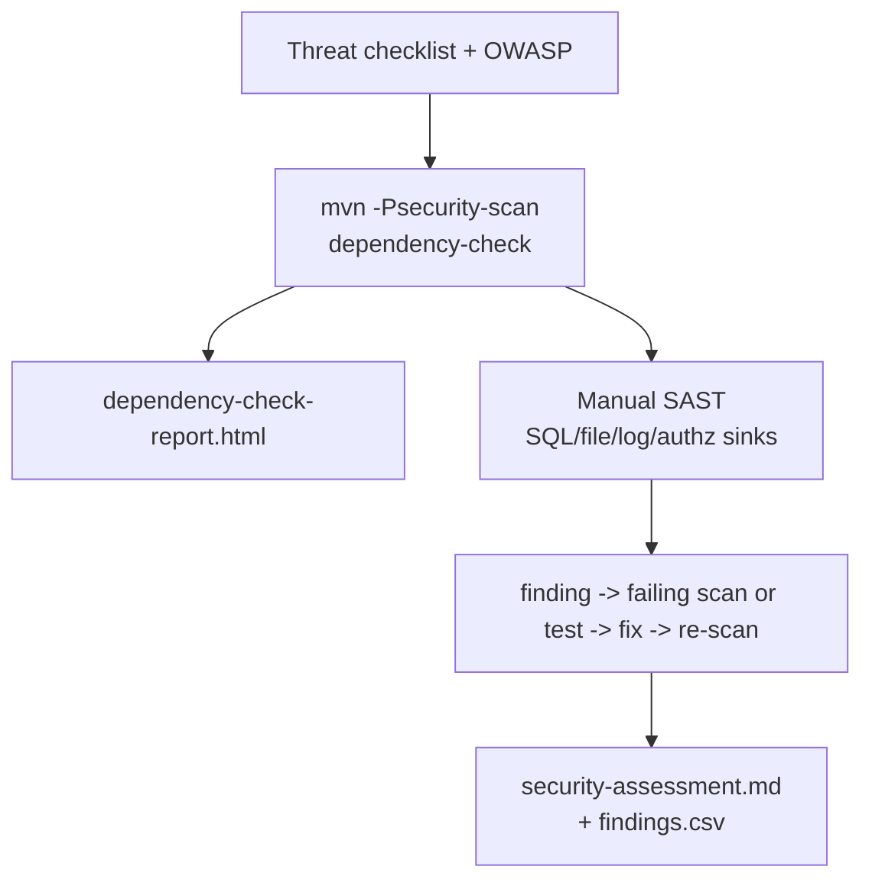

# Lab 40: Application Security Testing for the CRM — Dependency-Check, SAST, Remediation

**Module:** 40 — Application Security Testing for the CRM  
**Duration:** ~45 minutes (timed path with starter) · Full path: 3–4 Hours

**Primary IDE:** IntelliJ IDEA Community Edition · **Optional IDE:** VS Code

| OS | How-to for this lab |
| -- | ------------------- |
| Windows | [LAB-40-WINDOWS.md](LAB-40-WINDOWS.md) |
| macOS | [LAB-40-MACOS.md](LAB-40-MACOS.md) |

> **Two folders (do not mix):** [Clone the course repo · Commit in your own repo](../../../CLONE-AND-OWN-REPO-GUIDE.md). Read this GUIDE in the **course clone**. Write and run everything in **your** `java-bootcamp` repo.

---

## Activity card

| | |
| --- | --- |
| **Time** | ~45 min timed · full path 3–4 h |
| **Checkpoint** | **E** (after Ex 1→4→2→3→5→6) |
| **Must prove** | `-Psecurity-scan` · triage CSV row · assessment residual risk |
| **Hard gate** | Pre-lab Pass · Lab 39 verify green · no secrets in Git |

### What you will learn

Run a CRM AppSec gate: Dependency-Check, triage, focused SAST, remediate, re-scan.

### Enterprise context

Scanners alone are not a release decision — every finding needs fix, timed accept, or evidenced FP.

### Predict

Suppressing a Critical CVE with no owner/expiry — does the gate pass?

### Debug

Scan fails only because of high CVSS — delete profile or triage?

---

## Two folders — every command below uses these paths

| Folder | Remote | You… |
| ------ | ------ | ---- |
| **Course clone** (handouts) | `bc-sw-engineer-java-participant` | **Read** this GUIDE / starter. **Never** commit homework here. |
| **Your repo** | private `java-bootcamp` | **Copy** Lab 39 here, **merge** starter stubs, **run** Maven, **commit**. |

| Item | Course clone (read) | Your `java-bootcamp` (write) |
| ---- | ------------------- | ---------------------------- |
| This GUIDE | `labs/…/module-40/lab40/LAB-40-GUIDE.md` | — |
| Starter stubs | `labs/…/module-40/lab40/starter/` | merged into `examples/lab40-crm/` |
| Graded CRM | — | `examples/lab40-crm/` |
| Pre-lab notes | — | `examples/module-40-exercises/notes/` |
| Screenshots | — | `notes/screenshots/lab-40/` (gitignored) |

IntelliJ stays on `java-bootcamp`. Keep the course clone in a browser tab or a second window.

**Lab 39 baseline (what you copy):** Spring Boot **3.3.5**, `mvn` (no Maven Wrapper unless you added one), **no** Spring Security, list-only `GET /api/customers`, entity field **`emailNormalized`**. Point the copy at database **`crm_lab40`** — do not Flyway-migrate `crm` or `crm_lab39`.

---

## 45-minute timed path (use starter)

> **Pacing reminder:** [PACING.md](../PACING.md) checkpoint **E**. Homework: Boot/Tomcat upgrade so `failBuildOnCVSS=7` can pass, plus SAST notes and assessment.

In class, use the starter stubs so the **core** objectives fit **~45 minutes**. The full Steps below remain for homework / extended depth.

1. Open [`starter/README.md`](starter/README.md) **in the course clone**.
2. In **`java-bootcamp`**, copy your Lab 39 CRM to `examples/lab40-crm`, then merge `starter/` from the course clone (commands in the starter README).
3. Fill every `TODO` in the merged docs / POM snippet — do **not** work under `labs/`.
4. Run the starter smoke test from `examples/lab40-crm`; evidence under `notes/screenshots/lab-40/`.
5. Mark timed-path Pass criteria in the starter README. Continue remaining GUIDE steps as homework if needed.

| Path | Time | Scope |
| ---- | ---- | ----- |
| **Timed (default)** | ~45 min | Profile + one scan (NVD key required) + one CSV row + assessment draft |
| **Full (extended)** | see Duration | Every Step in this GUIDE (upgrade Boot/Tomcat; SAST; re-scan) |

First NVD populate can take **tens of minutes** even with an API key. Request the key before class. Do not expect a green `failBuildOnCVSS=7` on Boot **3.3.5** in the timed block — triage the Highs; upgrade on the full path.

---

## What you'll submit (read this first)

Keep this checklist visible while you work. All of these live under **`java-bootcamp`**, not the course clone.

| # | Deliverable | Where |
| - | ----------- | ----- |
| 1 | Threat checklist + OWASP mapping notes | `examples/lab40-crm/docs/threat-checklist.md` |
| 2 | Dependency-Check profile, sanitized reports, triage CSV | `pom.xml` + `docs/security-findings.csv` + excerpts under `notes/screenshots/lab-40/` |
| 3 | Focused SAST notes with code locations | assessment / threat checklist |
| 4 | Remediation evidence (Boot/Tomcat bump and/or SAST fix) | `pom.xml` + notes |
| 5 | Before/after scan comparison for the fixed finding | `docs/security-assessment.md` |
| 6 | Residual risks owned | `docs/security-assessment.md` |
| 7 | Baseline and final `mvn -B test` (or `verify`) results | notes |
| 8 | No secrets or real customer records | Git status clean of `.env`, NVD keys, HTML dumps |

**Must submit:** the items in the table above (sources + evidence + short notes).

**Do not submit:** `target/`, `dependency-check-data/`, secrets, heap dumps, or a verbatim instructor `solution/`.

---

## Lab Overview

This Module 40 lab turns the CRM into a **defensible security gate**: map OWASP-relevant attack surfaces, run **OWASP Dependency-Check**, triage CVEs, perform focused **manual SAST**, reproduce one confirmed issue, remediate with the smallest safe fix, re-scan and regression-test, and publish `docs/security-assessment.md`.

## Learning Objectives

After completing this lab, you will be able to:

* Map CRM attack surfaces to OWASP-aligned risks
* Run OWASP Dependency-Check via Maven with HTML/JSON output
* Interpret CVE, CVSS, CPE, and transitive dependency paths
* Perform focused manual SAST on injection, authz, and secrets
* Triage false positives and accepted risks with owners and expiry

## Business Scenario

A release candidate handles customer identifiers, contact details, agent roles, PostgreSQL queries, and (later) Kafka events. Leadership freezes:

**No “ship it” based on raw scanner volume. No merge that commits secrets, disables the scan gate without approval, or leaves a confirmed High without owner and due date.**

You own that gate for the CRM backend that serves Amina (`CUS-1001`), Ravi (`CUS-1002`), and agent role boundaries.

Use these examples consistently:

| ID | Name | Notes |
| -- | ---- | ----- |
| `CUS-1001` | Amina Khan | `ACTIVE` — object-level authz fixture |
| `CUS-1002` | Ravi Singh | `PROSPECT` — cross-agent access attempts |
| `CUS-9999` | — | not-found vs unauthorized distinctions |
| `lab-request-001` | — | correlation on security-relevant errors |
| `lab40-001`, … | — | finding IDs in CSV / assessment |

**Security note for evidence.** Use fictional emails (`amina.khan@example.test`). Sanitize scanner output before commit. Never commit NVD API keys, `.env`, tokens, or customer exports.

---

## Architecture Context
### NOW (this lab)


```mermaid
flowchart TB
  Threat["Threat checklist + OWASP"] --> Scan["mvn -Psecurity-scan<br/>dependency-check"]
  Scan --> Report["dependency-check-report.html"]
  Scan --> SAST["Manual SAST<br/>SQL/file/log/authz sinks"]
  SAST --> Fix["finding -> failing scan or test -> fix -> re-scan"]
  Fix --> Docs["security-assessment.md<br/>+ findings.csv"]
```

## Prerequisites

Prior labs: [Lab 39](../../../Week%204%20-%20Kafka,%20React,%20PostgreSQL%20and%20Resilience/module-39/lab39/LAB-39-GUIDE.md) already in **`java-bootcamp/examples/lab39-crm`**.

Confirm (Lab 0 tools assumed):

* JDK 21 + Maven 3.9.x (`mvn -version`). Use `./mvnw` only if **your** project already has a wrapper.
* Lab 39 `mvn -B test` green in `java-bootcamp` before you copy
* Authorized synthetic test data only; local or training env only
* No secrets committed to Git
* **NVD API key** (free, personal): [Request an NVD API Key](https://nvd.nist.gov/developers/request-an-api-key) — store in an environment variable, never in `pom.xml` or Git. NIST returns **403** without a key.

### Pre-flight

```bash
java -version
mvn -version
```

Working directory for every later command unless noted:

```text
~/java-bootcamp/examples/lab40-crm
# Windows: %USERPROFILE%\java-bootcamp\examples\lab40-crm
```

## Worked example (read before you code)

The graded gate is a **pinned** Maven profile plus a triage row — not a GUI click. Course pin for this cohort:

```xml
<properties>
  <dependency-check.version>10.0.4</dependency-check.version>
</properties>
```

```text
mvn -B -Psecurity-scan dependency-check:check -DnvdApiKey=*** -DdataDirectory=./dependency-check-data
```

**What to notice:** The version is a property, not `LATEST`. The key is a CLI/env value, not a committed secret. Instructors check the property and one classified CSV row.

Lab 39 has **no** Spring Security and **no** `GET /api/customers/{id}`. Treat missing object-level authz as a **manual SAST** finding (`lab40-002`). Do not expect `@WithMockUser` to compile until you add `spring-boot-starter-security` on the full path (feeds Lab 41).

---

## Implementation Steps

Complete each step in order. **Write** under `java-bootcamp`. **Read** starter XML/docs from the course clone.

---

### Step 1 — Copy Lab 39 into your repo, then merge starter stubs

**Why:** Graded work belongs in `java-bootcamp`. The course `starter/` is docs + a POM snippet, not a CRM.

**Where:** IntelliJ Terminal in **`java-bootcamp`**. Starter copy source is the **course clone**.

**Do this:**

**Windows (PowerShell)** — adjust the course-clone path if yours differs:

```powershell
# Write: your repo
$jb = "$env:USERPROFILE\java-bootcamp"
$courseLab40 = "$env:USERPROFILE\bc-sw-engineer-java-participant\labs\Week 5 - DevOps, CI-CD and OpenShift\module-40\lab40"

Copy-Item -Recurse -Force "$jb\examples\lab39-crm" "$jb\examples\lab40-crm"
Copy-Item -Recurse -Force "$courseLab40\starter\*" "$jb\examples\lab40-crm\"
New-Item -ItemType Directory -Force -Path "$jb\notes\screenshots\lab-40" | Out-Null

docker exec -e PGPASSWORD=change-me crm-postgres psql -U crm -d postgres -c "CREATE DATABASE crm_lab40;"
```

**macOS / Linux:**

```bash
JB=~/java-bootcamp
COURSE_LAB40=~/bc-sw-engineer-java-participant/labs/Week\ 5\ -\ DevOps,\ CI-CD\ and\ OpenShift/module-40/lab40

cp -R "$JB/examples/lab39-crm" "$JB/examples/lab40-crm"
cp -R "$COURSE_LAB40/starter/." "$JB/examples/lab40-crm/"
mkdir -p "$JB/notes/screenshots/lab-40"

docker exec -e PGPASSWORD=change-me crm-postgres psql -U crm -d postgres -c "CREATE DATABASE crm_lab40;"
```

In **`java-bootcamp/examples/lab40-crm`**:

1. Point `application.yml` (or `SPRING_DATASOURCE_URL`) at `jdbc:postgresql://localhost:5432/crm_lab40`.
2. Add `dependency-check-data/` to `.gitignore`.
3. Fill `docs/threat-checklist.md` (components, PII fields, agent/admin, training-CRM-only scope). Map broken access control, injection, auth failures, security misconfig, logging failures to concrete Lab 39 endpoints (`GET /api/customers` is the list API).
4. Keep CSV headers exactly:

```text
finding_id,source,package_or_location,cve_or_rule,cvss,classification,owner,due_date,notes
```

Classifications (use these words only): `confirmed` · `false_positive` · `mitigated` · `accepted` · `needs_review`.

**Expected result:** `examples/lab40-crm` exists in **your** repo with Lab 39 sources **plus** starter docs; `crm_lab40` created; checklist started; CSV header present.

**If it fails:** Copied into the course clone → delete that copy; start over in `java-bootcamp`. No `lab39-crm` → finish Lab 39 first.

---

### Step 2 — Add OWASP Dependency-Check Maven profile (pin 10.0.4)

**Why:** The gate must be executable by peers via Maven, not a one-off GUI click.

**Where:** `java-bootcamp/examples/lab40-crm/pom.xml` (merge from `pom-security-scan-snippet.xml` you copied in Step 1).

**Do this:** Add the property **and** the profile. Course pin is **10.0.4** (do not use `LATEST`):

```xml
<properties>
  <java.version>21</java.version>
  <dependency-check.version>10.0.4</dependency-check.version>
</properties>
```

```xml
<profile>
  <id>security-scan</id>
  <build>
    <plugins>
      <plugin>
        <groupId>org.owasp</groupId>
        <artifactId>dependency-check-maven</artifactId>
        <version>${dependency-check.version}</version>
        <configuration>
          <formats>
            <format>HTML</format>
            <format>JSON</format>
          </formats>
          <failBuildOnCVSS>7</failBuildOnCVSS>
          <suppressionFile>dependency-check-suppressions.xml</suppressionFile>
          <ossindexAnalyzerEnabled>false</ossindexAnalyzerEnabled>
        </configuration>
        <executions>
          <execution>
            <goals><goal>check</goal></goals>
          </execution>
        </executions>
      </plugin>
    </plugins>
  </build>
</profile>
```

Keep `dependency-check-suppressions.xml` empty except for the policy comment: every suppression needs CVE, rationale, owner, expiry.

Do **not** put an NVD key in the POM.

**Expected result:** Profile present; suppression file exists; `dependency-check.version` is `10.0.4`.

**If it fails:** Plugin not found → check the property spelling. Accidental always-on fail in the default build → keep the plugin **under** `-Psecurity-scan`.

---

### Step 3 — Run dependency scanning (NVD key required)

**Why:** Reproducibility requires exact command + tool version + date. NIST NVD API 2.0 returns **403** without a key.

**Where:** `java-bootcamp/examples/lab40-crm` (IntelliJ Terminal).

**Do this:**

1. Request a free key: [nvd.nist.gov/developers/request-an-api-key](https://nvd.nist.gov/developers/request-an-api-key). Wait until the email arrives (new keys can take a few minutes to activate).
2. Set it in the **environment** for this terminal only.

**Windows (PowerShell):**

```powershell
cd $env:USERPROFILE\java-bootcamp\examples\lab40-crm
$env:NVD_API_KEY = "paste-your-key-here"   # do not commit this
mvn -v
mvn -B -Psecurity-scan dependency-check:check "-DnvdApiKey=$env:NVD_API_KEY" "-DdataDirectory=$pwd\dependency-check-data"
```

**macOS / Linux:**

```bash
cd ~/java-bootcamp/examples/lab40-crm
export NVD_API_KEY='paste-your-key-here'   # do not commit this
mvn -v
mvn -B -Psecurity-scan dependency-check:check -DnvdApiKey="$NVD_API_KEY" -DdataDirectory="$PWD/dependency-check-data"
```

Quote every `-D…` argument in PowerShell. First populate is slow — do not kill it mid-update. Later runs reuse `dependency-check-data/` (~1 min).

On Boot **3.3.5**, expect the build to **fail** `failBuildOnCVSS=7` (many Tomcat/Spring Highs). That red scan **is** Step 3 success if HTML/JSON were written. Do not lower the threshold. Copy **sanitized excerpts** to `notes/screenshots/lab-40/` — do not commit the full HTML.

**Expected result:** HTML + JSON under `target/`; command + plugin **10.0.4** recorded; NVD update succeeded (no 403).

**If it fails:** 403 → key missing, not activated, or typed into Git/POM by mistake. OOM → increase Maven memory for this profile only. Instructor-cached `dependency-check-data/` is allowed if the network is blocked.

---

### Step 4 — Triage findings (not just count them)

**Why:** “87 vulnerabilities” is not a decision; classification is.

**Where:** `java-bootcamp/examples/lab40-crm/docs/security-findings.csv`

**Do this:** Sort by exploitability, reachability (is the class on the runtime classpath?), and CVSS. Enter at least the top items with:

* `confirmed` / `false_positive` / `mitigated` / `accepted` / `needs_review`

Every `accepted` or suppression gets **owner**, **rationale**, and **expiry date**. Prefer fixing reachable High/Critical over mass suppression.

Use `lab40-001` for your primary SCA row (likely a Tomcat or Spring CVE on the 3.3.5 classpath). Include at least one `mvn -q dependency:tree` excerpt for a transitive path.

```bash
mvn -q dependency:tree
```

**Expected result:** CSV populated for top findings; no “ignore forever” without expiry.

**If it fails:** Blank classifications → stop and finish triage before remediating randomly.

---

### Step 5 — Perform focused manual SAST (against Lab 39 code)

**Why:** Dependency-Check misses authz bugs and your own SQL concatenation.

**Where:** Sources under `java-bootcamp/examples/lab40-crm/src/main/java` — especially `CustomerController` (`GET /api/customers`), `CustomerRepository`, logs, `application.yml`.

**Do this:** Trace untrusted request values (`@RequestParam status/page/size`, later body fields, headers) to sinks: JPQL/SQL, file paths, process exec, logs. Record that Lab 39:

* exposes the customer **list** with **no** authentication
* has **no** `GET /api/customers/{id}` and **no** owner/agent column — object-level authz is **missing**, not broken
* uses field **`emailNormalized`** (not `normalizedEmail`)

Search for secrets, verbose errors, unsafe logging of PII, and weak defaults (`ddl-auto`, open actuator).

Document method FQNs under `lab40-002` (authz/SAST) in the CSV and checklist.

If you add a query, match the entity:

```java
@Query("select c from CustomerEntity c where lower(c.emailNormalized) = lower(:email)")
Optional<CustomerEntity> findByEmailIgnoreCase(@Param("email") String email);
```

**Expected result:** Written SAST notes covering injection + access control + secrets/logging; at least one concrete file/method cited.

**If it fails:** Only “looks fine” with no file:line → deepen the data-flow pass.

---

### Step 6 — Reproduce one confirmed issue

**Why:** Unreproduced findings invite cosmetic patches.

**Where:** `java-bootcamp/examples/lab40-crm`

**Do this (timed + full — SCA):** The red Step 3 scan **is** the reproducer for `lab40-001`. Save the fail excerpt (CVSS ≥ 7 count / example CVE). That is the before-fix evidence.

**Do this (full path — SAST, optional until Security exists):** Lab 39 cannot compile `@WithMockUser` yet. Either:

* keep `lab40-002` as a documented gap (missing authn/authz on `GET /api/customers`), or
* add `spring-boot-starter-security` + a deny-path test (feeds Lab 41). If you add `GET /{publicId}`, assert agent A cannot read agent B’s customer (`CUS-1001` / `CUS-1002`) — or document that ownership is not in the schema yet.

```java
@Test
@WithMockUser(username = "agent-a", roles = "AGENT")
void agentCannotReadAnotherAgentsCustomer() throws Exception {
  mvc.perform(get("/api/customers/{id}", otherAgentsCustomerId)
          .header("X-Correlation-Id", "lab-request-001"))
     .andExpect(status().isForbidden()); // or policy-accurate status
}
```

**Expected result:** Before-fix evidence saved (scan excerpt and/or red test).

**If it fails:** Flaky security test → fix fixtures. 404 vs 403 → document policy and assert that policy.

---

### Step 7 — Remediate safely (smallest root-cause fix)

**Why:** Wide refactors and blanket suppressions hide residual risk.

**Where:** `java-bootcamp/examples/lab40-crm/pom.xml` (and SAST code only if you chose that finding).

**Do this:** For `lab40-001` on the Lab 39 baseline, the verified smallest SCA fix is:

* Spring Boot parent **3.5.16** (last OSS 3.x line used in the Windows verification)
* `<tomcat.version>10.1.57</tomcat.version>`

Do **not** lower `failBuildOnCVSS`. Do **not** disable the scanner. Do **not** `@Disabled` a security test you added.

If upgrading, note breaking changes and run `mvn -B test`. Keep unrelated formatting out of the diff.

**Expected result:** Focused remediation; rationale in the assessment linked to `lab40-001` (and `lab40-002` if you fixed SAST).

**If it fails:** Fix breaks unrelated features → narrow further or add compensating tests before proceeding.

---

### Step 8 — Re-scan, regress, and write the assessment

**Why:** Green tests without a before/after security story do not satisfy the gate.

**Where:** `java-bootcamp/examples/lab40-crm` and `docs/security-assessment.md`

**Do this:**

```bash
cd ~/java-bootcamp/examples/lab40-crm
mvn -B test
mvn -B -Psecurity-scan dependency-check:check -DnvdApiKey="$NVD_API_KEY" -DdataDirectory="$PWD/dependency-check-data"
```

(Windows: quote `"-DnvdApiKey=$env:NVD_API_KEY"` and `"-DdataDirectory=$pwd\dependency-check-data"`.)

Compare before/after for `lab40-001`. Write `docs/security-assessment.md` covering: scope, method, tooling versions (**Dependency-Check 10.0.4**, JDK, Boot), findings summary, severity rationale, remediation, residual risks (owners + dates), and facts vs assumptions. Sanitize all evidence.

**Expected result:** Assessment + CSV complete; before/after clear; tests green; residual risks owned. After the Boot/Tomcat bump, `failBuildOnCVSS=7` should pass; if a new High remains, triage it — do not delete the profile.

**If it fails:** Scanner still fails on unrelated Critical → triage/suppress with expiry or fix.

---

### Step 9 — Failure experiments + evidence hygiene

**Why:** Security work fails socially when evidence contains secrets or cannot be reproduced.

**Where:** `java-bootcamp` working tree (`git status` from `examples/lab40-crm` or repo root).

**Do this:** Complete Failure Experiments. Scrub reports of tokens. Ensure `.gitignore` covers `dependency-check-data/`, `target/`, and `.env`. Confirm you are **not** inside the course clone.

**Expected result:** ≥3 experiments; peer-reviewable packet; no secrets staged; commits only to **your** `java-bootcamp` remote.

**If it fails:** See Troubleshooting.

---

### Step 10 — Peer walkthrough and residual-risk register

**Why:** A security gate that only the author understands will be skipped under delivery pressure.

**Where:** Peer clones or pulls **your** `java-bootcamp`, not the course handouts.

**Do this:** Walk a peer through: (1) threat checklist scope, (2) one CSV row classification, (3) before/after scan for `lab40-001`, (4) the remediation diff, (5) residual risks table. Ask them to re-run from `examples/lab40-crm`:

```bash
mvn -B test
mvn -B -Psecurity-scan dependency-check:check -DnvdApiKey="$NVD_API_KEY" -DdataDirectory="$PWD/dependency-check-data"
```

If you added `ObjectOwnershipSecurityTest`, they also run:

```bash
mvn -B test "-Dtest=ObjectOwnershipSecurityTest"
```

Update the residual-risk register with any peer questions (for example “does actuator expose env?”). Record peer initials and date in the assessment appendix.

**Expected result:** Peer can reproduce from docs in **your** repo; residual risks have owners and dates.

**If it fails:** Peer blocked on missing command → fix assessment. Peer finds a secret → scrub, rotate if needed, re-attach sanitized evidence.

---

## Implementation Checkpoints

### Checkpoint A — Scope and tooling

_Mark **Pass** or **Fail** in your lab notes._

| # | Confirm | Your notes |
| - | ------- | ---------- |
| 1 | Work is in `java-bootcamp/examples/lab40-crm` (not the course clone) | Pass / Fail |
| 2 | Threat checklist + CSV headers (canonical columns) | Pass / Fail |
| 3 | Dependency-Check profile + pin **10.0.4** | Pass / Fail |

### Checkpoint B — Scan and triage

_Mark **Pass** or **Fail** in your lab notes._

| # | Confirm | Your notes |
| - | ------- | ---------- |
| 1 | HTML/JSON reports generated (NVD 403 resolved with env key) | Pass / Fail |
| 2 | Top findings classified with owners/expiry where needed | Pass / Fail |
| 3 | Transitive path examined for ≥1 finding | Pass / Fail |

### Checkpoint C — SAST and remediation

_Mark **Pass** or **Fail** in your lab notes._

| # | Confirm | Your notes |
| - | ------- | ---------- |
| 1 | Manual SAST notes for injection/authz/secrets on Lab 39 code | Pass / Fail |
| 2 | Before-fix scan (or test) then fix | Pass / Fail |
| 3 | Re-scan + regression for that finding | Pass / Fail |

### Checkpoint D — Hygiene

_Mark **Pass** or **Fail** in your lab notes._

| # | Confirm | Your notes |
| - | ------- | ---------- |
| 1 | `security-assessment.md` complete | Pass / Fail |
| 2 | Two consecutive test runs green for suite | Pass / Fail |
| 3 | No secrets / raw customer data / NVD key in Git | Pass / Fail |
| 4 | Peer walkthrough recorded (initials + date) | Pass / Fail |
| 5 | Residual risks have owners and due dates | Pass / Fail |
| 6 | Suppressions (if any) include expiry | Pass / Fail |
| 7 | Pushes went to **your** `java-bootcamp` remote | Pass / Fail |

---

## Safety Rules (restate before scanning)

* Work only against local services or the authorized training environment.
* Use synthetic records (`amina.khan@example.test`); never real customer information.
* Read every Maven/plugin command before running it; first NVD update can take a long time.
* Store NVD API keys in environment variables—not in `pom.xml` or Git.
* Do not weaken authorization, TLS, scanning, validation, or tests to obtain a green result.
* Pin Dependency-Check **10.0.4** and document the version in the assessment.
* Keep remediations narrowly scoped; do not reformat unrelated files.
* Record assumptions, deviations, residual risks, owners, and due dates.
* Stop before destructive database actions; obtain instructor approval.

---

## Reference Commands, Configuration, and Code

### Suppression snippet (time-bounded)

```xml
<?xml version="1.0" encoding="UTF-8"?>
<suppressions xmlns="https://jeremylong.github.io/DependencyCheck/dependency-suppression.1.3.xsd">
  <!-- Example only — fill CVE, rationale, owner, expiry in assessment -->
  <suppress until="2026-10-01Z">
    <notes>lab40: accepted transitive X until upgrade Y; owner=student; review before expiry</notes>
    <cve>CVE-2099-0000</cve>
  </suppress>
</suppressions>
```

### Assessment outline (paste into `docs/security-assessment.md`)

```markdown
## Scope and assets
## Method and tool versions
## Dependency findings (before / after)
## Manual SAST findings
## Remediation summary (lab40-00x)
## Residual risks (owner, due date)
## Facts vs assumptions
## Reproduce commands
```

### Commands (from `java-bootcamp/examples/lab40-crm`)

```bash
mvn -B test
mvn -B -Psecurity-scan dependency-check:check -DnvdApiKey="$NVD_API_KEY" -DdataDirectory="$PWD/dependency-check-data"
mvn -q dependency:tree
git status --short
git remote -v   # must be YOUR java-bootcamp, not the course clone
```

### Artifact map

| Artifact | Role |
| -------- | ---- |
| `docs/threat-checklist.md` | Scope / OWASP map |
| Dependency-Check HTML/JSON | SCA evidence (excerpt only in Git) |
| `docs/security-findings.csv` | Triage ledger |
| `dependency-check-suppressions.xml` | Time-bounded exceptions |
| Boot 3.5.16 + `tomcat.version` 10.1.57 | Verified SCA remediation on Lab 39 baseline |
| `ObjectOwnershipSecurityTest` | Optional full-path authz regression (needs Security) |
| `docs/security-assessment.md` | Gate narrative |

---

## Failure Experiments

| # | Experiment | Observe | Restore |
| - | ---------- | ------- | ------- |
| 1 | Temporarily set `failBuildOnCVSS` to `1` | Build fails on more findings | Restore **7** |
| 2 | Add a suppression without expiry | Document why policy rejects it | Add expiry or remove |
| 3 | Omit `-DnvdApiKey` | 403 or stalled NVD update | Restore env key |
| 4 | Log a password in a test assertion message | Evidence hygiene catch | Remove; rotate lab secret if real |
| 5 | Re-run scan twice | Comparable top findings | Note NVD DB update diffs if any |

---

## Troubleshooting

| Symptom | Likely cause | Fix |
| ------- | ------------ | --- |
| NVD **403** | No/invalid API key | Personal key in env; `-DnvdApiKey`; never commit it |
| NVD download slow | First DB populate | Wait; reuse `dependency-check-data/` |
| `./mvnw` not found | Lab 39 has no wrapper | Use `mvn` |
| Build fails only on scan | High CVSS on Boot 3.3.5 | Upgrade Boot/Tomcat (Step 7); don’t delete profile |
| OSS Index “Invalid credentials” | Analyzer on by default | Keep `<ossindexAnalyzerEnabled>false</ossindexAnalyzerEnabled>` |
| `@WithMockUser` will not compile | Lab 39 has no Security | Document as SAST or add starter-security |
| `normalizedEmail` unknown | Wrong field name | Use `emailNormalized` |
| False positive CPE | Wrong package match | Suppression with evidence + expiry |
| Report too large for Git | Bulky HTML | Excerpt + gitignore; keep CSV |
| Inherited verify red | Lab 39 drift | Fix baseline first |
| Accidental work in course clone | Wrong folder | Move to `java-bootcamp`; never push homework to participant remote |
| Plugin version drift | Unpinned property | Pin `10.0.4` |

## Evidence Log Template

```markdown
# Lab 40 Evidence Log
- Repo (must be java-bootcamp):
- Branch / commit:
- JDK / Maven / Dependency-Check 10.0.4:
- Baseline test: PASS/FAIL (paste narrow excerpt)
- Scan command (key redacted):
- Finding remediated (lab40-00x):
- Before CVSS / after:
- Residual risks:
```

---

## Security and Production Review

Optional — jot brief notes in your README if useful for your progress check (not a separate essay):

1. Which inputs are untrusted (HTTP, headers, file uploads if any)?
2. Where are authn/authz/validation enforced? (Lab 39: nowhere yet — say so.)
3. Which values are sensitive—where stored (never in reports)?

---

## Cleanup

```bash
cd ~/java-bootcamp/examples/lab40-crm
mvn -q clean
# Keep sanitized assessment; do not commit dependency-check-data/
git status --short
```

Do not commit live credentials rotated during the lab without scrubbing history instructions from instructor.

**Keep `lab40-crm` in `java-bootcamp`**—Lab 41 containerizes this hardened backend.

---

## Reflection Questions

Write **1–3 sentence** answers (not essays):

1. Which design decision most affected correctness of the security gate?
2. What evidence proves the remediation worked?
3. Which failure was hardest to triage (tool noise vs real bug)?

---
