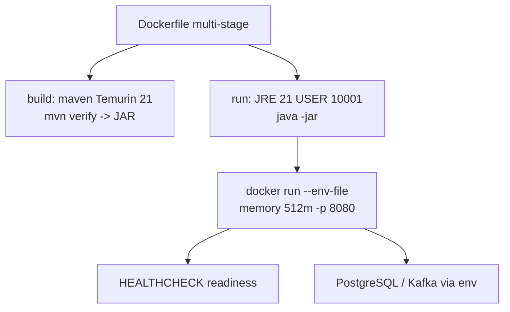
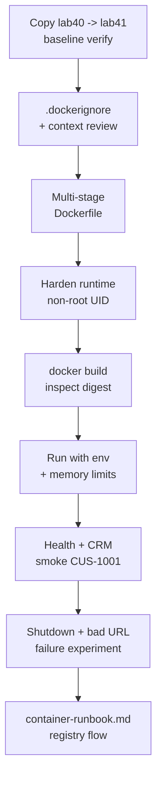

# Lab 41: Containerize the Spring Boot CRM — Multi-Stage Dockerfile, Non-Root, Health

**Module:** 41 — Containerize the Spring Boot CRM  
**Lab folder:** `labs/Week 5 - DevOps, CI-CD and k3s/lab41/`  
**Difficulty:** Intermediate  
**Duration:** ~45 minutes (timed path with starter) · Full path: 3–4 Hours

**Primary IDE:** IntelliJ IDEA Community Edition · **Optional IDE:** VS Code

| OS | How-to for this lab |
| -- | ------------------- |
| Windows | [LAB-41-WINDOWS.md](LAB-41-WINDOWS.md) |
| macOS | [LAB-41-MACOS.md](LAB-41-MACOS.md) |

> **Environment reminder:** Finish [Lab 0](../../../Week%201%20-%20Java%20and%20JVM%20Foundations/module-00/lab0/LAB-0-GUIDE.md). Use **IntelliJ IDEA Community** (primary; optional VS Code) on your laptop with **JDK 21**, **Maven 3.9+**, and **Docker** (image builds). Work under `~/java-bootcamp` (Windows: `%USERPROFILE%\java-bootcamp`).

---

## 45-minute timed path (use starter)

In class, use the starter templates so the **core** objectives fit **~45 minutes**. The full Steps below remain for homework / extended depth.

1. Open [`starter/README.md`](starter/README.md).
2. Copy `starter/` into your `java-bootcamp/examples/…` target (see starter README).
3. Fill every `// TODO` / `TODO` — do **not** wait on a perfect prior lab; the starter includes a baseline.
4. Run the starter smoke test; evidence under `notes/screenshots/lab-41/`.
5. Mark timed-path Pass criteria in the starter README. Continue remaining GUIDE steps as homework if needed.

| Path | Time | Scope |
| ---- | ---- | ----- |
| **Timed (default)** | ~45 min | Starter TODOs + smoke test |
| **Full (extended)** | see Duration | Every Step in this GUIDE |

---

## How to follow this lab

1. **In class (timed path):** prefer [`starter/README.md`](starter/README.md) — copy starter → `java-bootcamp/examples/lab41-crm`, fill TODOs, run smoke test (~45 min).
2. Open the **Windows** or **macOS** how-to (links above) in a second tab for OS-specific commands.
3. Create/work only under your `java-bootcamp/examples/…` folder from the steps (not inside this `labs/` git clone unless a step says otherwise).
4. For each **Step N** (full path / homework): read **Why** (if present) → do the actions → confirm **Expected** / **Expected result** → then continue.
5. When stuck, use **Failure Experiments** / troubleshooting in this guide before asking for help.
6. Capture evidence under `notes/screenshots/lab-41/` (workspace root under `java-bootcamp`; redact secrets). Use the **Pass criteria** tables — write **Pass** or **Fail** in your notes. GitHub file view does not support clickable checkboxes.

## What you'll submit (read this first)

Keep this checklist visible while you work. Full detail is under [Expected Deliverables](#expected-deliverables) at the end.

| # | Deliverable |
| - | ----------- |
| 1 | `Dockerfile` (multi-stage, non-root, health) |
| 2 | `.dockerignore` + `.env.example` |
| 3 | Image build evidence (id/size/user) + digest notes |
| 4 | Readiness + CRM smoke evidence (`CUS-1001`) |
| 5 | Graceful stop + dependency failure evidence |
| 6 | `docs/container-runbook.md` (registry flow included) |
| 7 | No secrets in Git or image layers |


## Lab Overview

This Module 41 lab packages the CRM backend as a **small, reproducible, non-root** container image: multi-stage Maven build, hardened JRE runtime, runtime configuration via env, meaningful health checks, resource limits, log hygiene, graceful shutdown, and a `docs/container-runbook.md` another engineer can follow.

**Purpose.** Operations rejects images that embed secrets, run as root, or cannot report readiness. Leadership freezes:

**No registry push of `:latest`-only root images with passwords in layers.**

**What you build (exercise).** Branch `lab41-crm`; add `.dockerignore` and multi-stage `Dockerfile`; build `crm-api:lab41`; inspect user/layers/digest; run with `.env.example`-driven runtime config and memory limits; verify readiness and create/retrieve synthetic Amina; test graceful stop and bad dependency URL behavior; document registry tagging/digest pinning (auth outside Git).

**What success looks like.** Under `~/java-bootcamp/examples/lab41-crm/` the image runs as UID `10001`, readiness returns success, CRM fixtures work with correlation `lab-request-001`, and the runbook lists exact `docker build` / `run` / `stop` commands with digest evidence.

**Depends on Labs 39–40.** Need a bootable Spring JAR with actuator health (add if missing) and env-based datasource. Lab 42 deploys this image to Kubernetes (k3s).

**CRM connection.** Fixtures `CUS-1001` / `CUS-1002` / `lab-request-001`. Never bake PostgreSQL passwords into the image—inject at `docker run` / later K8s Secret.

---

## Learning Objectives

After completing this lab, you will be able to:

* Explain image layers and build-context hygiene
* Create a multi-stage Maven → JRE Dockerfile for Java 21
* Run Spring Boot as a fixed non-root UID
* Inject profile, JDBC, and broker settings at runtime
* Add container `HEALTHCHECK` aligned with readiness
* Inspect image size, user, entrypoint, architecture, and digest
* Troubleshoot startup, health, and graceful shutdown
* Document registry auth, immutable tags, and digest pinning
* Keep `.env` secrets out of Git and out of image layers
* Prove a controlled failure when a dependency URL is wrong

---

## Business Scenario

The CRM must run consistently from developer laptops through the delivery platform. Leadership freezes:

**No production promotion of images that run as root, embed `.env`, or lack readiness signals.**

You own that packaging gate for the API that serves Amina (`CUS-1001`) and Ravi (`CUS-1002`).

Use these examples consistently:

| ID | Name | Notes |
| -- | ---- | ----- |
| `CUS-1001` | Amina Khan | `ACTIVE` — create/get smoke in container |
| `CUS-1002` | Ravi Singh | `PROSPECT` — optional second smoke |
| `CUS-9999` | — | not-found path from inside container network |
| `lab-request-001` | — | correlation header in request/logs |
| `lab41-001`, … | — | runbook experiment IDs |

**Security note for evidence.** Use fictional emails. Never commit `.env.local`, registry passwords, or `docker history` dumps that include secrets. Prefer `.env.example` with empty values.

---

## Architecture Context

### NOW (this lab)



### Lab flow (mermaid)



### Architecture NOW vs LATER

| Aspect | Lab 41 (NOW) | Lab 42 (k3s) |
| ------ | ------------ | ---------------------- |
| Packaging | Local Docker image | Same image in cluster |
| Config | `--env-file` / `-e` | ConfigMap + Secret |
| Health | Docker `HEALTHCHECK` | startup/readiness/liveness probes |
| Identity | Tag `crm-api:lab41` | Digest-pinned Deployment |

**Lab focus:** layers, multi-stage build, non-root, runtime config, health, inspect/troubleshoot—not yet Routes or rollouts.

---

## Prerequisites

Complete [SETUP](../../../SETUP-INSTRUCTIONS.md), [Lab 0](../../../Week%201%20-%20Java%20and%20JVM%20Foundations/module-00/lab0/LAB-0-GUIDE.md), and Labs [39](../../../Week%204%20-%20Kafka,%20React,%20PostgreSQL%20and%20Resilience/module-39/lab39/LAB-39-GUIDE.md)–[40](../../module-40/lab40/LAB-40-GUIDE.md) as available. Confirm:

* Java 21 + Maven Wrapper; `./mvnw -B clean verify` green
* Docker Engine for multi-stage builds
* Actuator health endpoints (add dependency if needed)
* No production secrets in images or Git

### Pre-flight

```bash
java -version
./mvnw --version 2>/dev/null || mvn -version
docker --version
docker info >/dev/null
git status --short
pwd
ls ~/java-bootcamp/examples
```

```bash
cd ~/java-bootcamp/examples
cp -r lab40-crm lab41-crm   # or lab39-crm if needed
cd lab41-crm
./mvnw -B clean verify
```

---

## Suggested Project Files

Prefer examples. Platform cohorts may place the same files at `customer-management-platform/backend/` (Dockerfile beside `pom.xml`).

```text
~/java-bootcamp/examples/lab41-crm/
├── src/...
├── Dockerfile
├── .dockerignore
├── .env.example
├── docs/
│   └── container-runbook.md
├── notes/screenshots/
├── pom.xml
├── .gitignore
└── README.md
```

Expected evidence: image digest, readiness curl output, non-root `docker inspect` user, graceful stop note.

Ignore `.env`, `.env.local`, `target/` in Git (and via `.dockerignore`).

---

## Concepts to Discuss

Write 2–3 sentences each in `docs/container-runbook.md` (concepts section):

1. Main flow: build context → layers → runtime process
2. Trust boundary: what is in the image vs injected at run
3. Success/failure contracts: readiness vs liveness meaning
4. Stable tags/digests vs floating `latest`
5. Idempotency of `docker build` with cache; when to `--pull`
6. Why multi-stage shrinks attack surface vs fat Maven image
7. Evidence operators need (digest, health, logs without secrets)
8. Two hosts: same Dockerfile + pinned bases → comparable images
9. Root vs UID 10001 blast radius
10. What Lab 42 adds (probes, Route, rollout) without rewriting the JAR

---

## Implementation Steps

Complete each step in order. Commands assume `~/java-bootcamp/examples/lab41-crm` (Windows: `%USERPROFILE%\java-bootcamp\examples\lab41-crm`) unless noted.

---

### Step 1 — Prepare application and build context

**Why:** Secrets and `target/` in context bloat layers and risk leaks.

**Do this:** Confirm executable Spring Boot JAR from `./mvnw -B clean verify`. Note port (`8080`), required env (`CRM_DB_*`), and actuator paths. Create `.dockerignore`:

```gitignore
target/
.git/
.idea/
.vscode/
.env
.env.*
!.env.example
*.log
reports/
**/node_modules/
notes/screenshots/
```

Confirm `mvnw`, `pom.xml`, and `src/` remain in context.

**Expected result:** Context excludes secrets and build output; wrapper still included if you build inside Docker.

**If it fails:** Accidental ignore of `src` → fix `.dockerignore`. Verify still red → fix Lab 39/40 first.

---

### Step 2 — Create the multi-stage Dockerfile

**Why:** Builder tools must not ship in the runtime image.

**Do this:** Add `Dockerfile` (pin base tags per instructor if provided):

```dockerfile
# syntax=docker/dockerfile:1
FROM maven:3.9-eclipse-temurin-21 AS build
WORKDIR /workspace
COPY pom.xml .
COPY .mvn .mvn
COPY mvnw mvnw
RUN chmod +x mvnw && ./mvnw -B -q -DskipTests dependency:go-offline
COPY src ./src
RUN ./mvnw -B clean verify

FROM eclipse-temurin:21-jre
RUN useradd --system --uid 10001 --create-home spring
WORKDIR /app
COPY --from=build --chown=spring:spring /workspace/target/*-SNAPSHOT.jar app.jar
# Prefer a single Boot jar name; adjust pattern to your artifact
USER 10001
EXPOSE 8080
ENV JAVA_TOOL_OPTIONS="-XX:MaxRAMPercentage=75"
HEALTHCHECK --interval=30s --timeout=3s --start-period=40s --retries=3 \
  CMD wget -qO- http://127.0.0.1:8080/actuator/health/readiness || exit 1
ENTRYPOINT ["java","-jar","/app/app.jar"]
```

Adapt jar copy (`*.jar` vs exact name). If `wget` is missing in JRE image, use a documented alternative (`curl`, CMD-SHELL with actuator) or install only with instructor-approved slim tooling—prefer distroless-friendly approaches discussed in class.

**Expected result:** Multi-stage file present; dependency layer cached before source copy.

**If it fails:** `dependency:go-offline` incomplete → still OK if final `verify` works; document. Wrong jar glob → list `/workspace/target` in build.

---

### Step 3 — Harden runtime (non-root, no secrets)

**Why:** Root containers turn RCE into host privilege stories.

**Do this:** Confirm `USER 10001`, no `CRM_DB_PASSWORD` in `ENV`, no copying `.env`, no package-manager leftovers in final stage. Optional: OCI labels for version/git SHA (bonus). Ensure working directory is writable only as needed.

**Expected result:** Runtime stage is JRE-only + jar + non-root user; no credentials in Dockerfile.

**If it fails:** App needs write to `/tmp` only → keep that; avoid writable whole rootfs unless Lab bonus.

---

### Step 4 — Build and inspect the image

**Why:** Digests—not just tags—identify what you will deploy in Lab 42.

**Do this:**

```bash
docker build --pull -t crm-api:lab41 .
docker image inspect crm-api:lab41 --format '{{.Id}} {{.Size}} {{json .Config.User}}'
docker image inspect crm-api:lab41 --format '{{index .RepoDigests 0}}'
# If RepoDigests empty before push, record Image Id and later digest on push
docker history crm-api:lab41 --no-trunc | head
```

Record size, user `10001`, entrypoint, architecture in the runbook.

**Expected result:** Image builds; user is non-root; size materially smaller than a Maven-based single stage (note comparison if you measure).

**If it fails:** Build context huge → fix `.dockerignore`. Permission on `mvnw` → `chmod` in Dockerfile.

---

### Step 5 — Run with configuration and limits

**Why:** Config must be injectable; memory limits surface MaxRAMPercentage behavior.

**Do this:** Create `.env.example`:

```bash
SPRING_PROFILES_ACTIVE=docker
CRM_DB_URL=jdbc:postgresql://${CRM_DB_HOST:localhost}:5432/${CRM_DB_NAME:crm}
CRM_DB_USERNAME=crm_app
CRM_DB_PASSWORD=
# KAFKA_BOOTSTRAP=...
```

Copy to gitignored `.env.local`, fill training values, run:

```bash
docker run --rm --name crm-api -p 8080:8080 \
  --memory=512m --env-file .env.local crm-api:lab41
```

Use Compose network DNS (`crm-postgres`) instead of `host.docker.internal` when PostgreSQL is a sibling container—document which.

**Expected result:** Container starts with injected env; port published; memory capped.

**If it fails:** Cannot reach PostgreSQL → fix JDBC host for Docker networking. Immediate exit → `docker logs crm-api`.

---

### Step 6 — Verify health and CRM workflow

**Why:** A listening port is not readiness; CRM smoke proves the image is useful.

**Do this:**

```bash
curl -fsS http://localhost:8080/actuator/health/readiness
# Create/get Amina with synthetic payload; include correlation:
curl -fsS -H "X-Correlation-Id: lab-request-001" ...
docker logs crm-api --tail 100
```

Confirm logs show correlation where instrumented, **no** password or full PAN/PII dumps.

**Expected result:** Readiness success; `CUS-1001` create/get works (or documented seed + get); logs sanitized.

**If it fails:** Health 404 → enable actuator exposure for health. 503 readiness → DB down; fix dependency first.

---

### Step 7 — Test graceful shutdown and dependency failure

**Why:** Orchestrators need SIGTERM behavior; bad config must fail clearly.

**Do this:**

```bash
docker stop --time 20 crm-api
```

Confirm logs show orderly shutdown (Spring shutdown hooks) within timeout. Then run once with an invalid JDBC URL; observe readiness failure / exit; capture logs; remove the failed container without deleting your runbook notes.

**Expected result:** Graceful stop within ~20s; invalid dependency produces bounded, understandable failure evidence.

**If it fails:** Forced kill only → check `server.shutdown=graceful` / timeout settings. Hang forever → reduce work on shutdown; document.

---

### Step 8 — Document registry flow and finish evidence pack

**Why:** Lab 42 needs an immutable identity story even if you do not push yet.

**Do this:** In `docs/container-runbook.md` describe: registry login outside source control; tag by version + git SHA (not only `latest`); push authorization; digest pinning; cleanup of old tags. Complete [Failure Experiments](#failure-experiments). Save inspect excerpts under `notes/screenshots/lab-41/`.

```bash
git status --short
```

**Expected result:** Runbook alone suffices for a peer to build/run/stop; digest/ID recorded; no `.env.local` staged.

**If it fails:** See Troubleshooting.

---

### Step 9 — Optional Compose wiring for PostgreSQL sibling (document either way)

**Why:** Many CRM stacks fail first on Docker DNS (`localhost` inside the container is the container itself).

**Do this:** If PostgreSQL runs as `crm-postgres` on a user-defined bridge network, document one of:

```bash
docker network ls
docker network connect <crm-net> crm-api   # if started separately
# or run:
docker run --rm --name crm-api --network <crm-net> -p 8080:8080 \
  -e CRM_DB_URL='jdbc:postgresql://crm-postgres:5432/crm' \
  --env-file .env.local crm-api:lab41
```

Record in the runbook which hostname works on the local workstation (`host.docker.internal` vs Compose service name). Do not commit a Compose file that embeds passwords.

**Expected result:** Documented working JDBC host for container→PostgreSQL; smoke still green.

**If it fails:** Connection timed out → wrong network; inspect `docker inspect crm-postgres` networks. TLS/TCPS surprises → stay on training thin URL unless instructor requires wallet.

---

### Step 10 — Peer build from runbook only

**Why:** Operator docs that require tribal knowledge fail Lab 42 under time pressure.

**Do this:** Have a peer (or you on a clean shell) follow **only** `docs/container-runbook.md` to rebuild/run/curl readiness. Note any missing step and patch the runbook. Capture second build image ID (cache may make it fast—still record User and health).

**Expected result:** Peer reaches readiness without Slack help; runbook gaps closed; evidence of second successful run.

**If it fails:** Missing `--pull` / jar name / env keys → fix runbook immediately.

---

## Implementation Checkpoints

### Checkpoint A — Context and Dockerfile

_Mark each row **Pass** or **Fail** in your lab notes (GitHub markdown files are not interactive checklists)._

| # | Confirm | Your notes |
| - | ------- | ---------- |
| 1 | `lab41-crm` verifies before image work | Pass / Fail |
| 2 | `.dockerignore` excludes secrets/`target` | Pass / Fail |
| 3 | Multi-stage Dockerfile builds JAR then JRE runtime | Pass / Fail |

### Checkpoint B — Hardening and inspect

_Mark each row **Pass** or **Fail** in your lab notes (GitHub markdown files are not interactive checklists)._

| # | Confirm | Your notes |
| - | ------- | ---------- |
| 1 | Runs as UID `10001` (or fixed non-root) | Pass / Fail |
| 2 | No secrets in image env/layers | Pass / Fail |
| 3 | Image id/size/user recorded | Pass / Fail |

### Checkpoint C — Run and prove

_Mark each row **Pass** or **Fail** in your lab notes (GitHub markdown files are not interactive checklists)._

| # | Confirm | Your notes |
| - | ------- | ---------- |
| 1 | Runtime env via `.env.example` pattern | Pass / Fail |
| 2 | Readiness healthy; CRM smoke with `CUS-1001` | Pass / Fail |
| 3 | Graceful stop + bad URL experiment documented | Pass / Fail |

### Checkpoint D — Hygiene

_Mark each row **Pass** or **Fail** in your lab notes (GitHub markdown files are not interactive checklists)._

| # | Confirm | Your notes |
| - | ------- | ---------- |
| 1 | `container-runbook.md` complete | Pass / Fail |
| 2 | Registry/digest notes present | Pass / Fail |
| 3 | No `.env` / tokens in Git | Pass / Fail |
| 4 | Peer build from runbook succeeded (or gaps fixed) | Pass / Fail |
| 5 | JDBC hostname for container→PostgreSQL documented | Pass / Fail |
| 6 | Actuator does not expose `env`/`beans` publicly without auth | Pass / Fail |

---

## Safety Rules (restate before building)

* Work only against local Docker / authorized training hosts.
* Never `COPY` `.env` or kubeconfig into the image.
* Pin or record base image tags (`maven:…`, `eclipse-temurin:…`).
* Prefer digest identity for anything you will promote to Lab 42.
* Do not run training containers as root “just to make volume mounts work”—fix ownership instead.
* Keep CRM smoke traffic synthetic (`CUS-1001` / `CUS-1002` only).
* Delete failed containers after capturing logs; do not leave password-bearing env files on shared disks.

---

## Reference Commands, Configuration, and Code

### Multi-stage Dockerfile (full pattern)

```dockerfile
# syntax=docker/dockerfile:1
FROM maven:3.9-eclipse-temurin-21 AS build
WORKDIR /workspace
COPY pom.xml .
COPY .mvn .mvn
COPY mvnw mvnw
RUN chmod +x mvnw && ./mvnw -B -q -DskipTests dependency:go-offline
COPY src ./src
RUN ./mvnw -B clean verify

FROM eclipse-temurin:21-jre
RUN useradd --system --uid 10001 --create-home spring
WORKDIR /app
COPY --from=build --chown=spring:spring /workspace/target/*.jar app.jar
USER 10001
EXPOSE 8080
ENV JAVA_TOOL_OPTIONS="-XX:MaxRAMPercentage=75"
HEALTHCHECK --interval=30s --timeout=3s --start-period=40s --retries=3 \
  CMD wget -qO- http://127.0.0.1:8080/actuator/health/readiness || exit 1
ENTRYPOINT ["java","-jar","/app/app.jar"]
```

### `.dockerignore` (minimum)

```gitignore
target/
.git/
.idea/
.vscode/
.env
.env.*
!.env.example
*.log
reports/
**/node_modules/
```

### Build and run

```bash
cd ~/java-bootcamp/examples/lab41-crm
docker build --pull -t crm-api:lab41 .
docker image inspect crm-api:lab41 --format 'id={{.Id}} size={{.Size}} user={{json .Config.User}}'
docker run --rm --name crm-api -p 8080:8080 \
  --memory=512m --env-file .env.local crm-api:lab41
curl -fsS http://localhost:8080/actuator/health/readiness
curl -fsS -H "X-Correlation-Id: lab-request-001" \
  -H "Content-Type: application/json" \
  -d '{"publicId":"CUS-1001","fullName":"Amina Khan","email":"amina.khan@example.test"}' \
  http://localhost:8080/api/customers   # adapt to your API
docker logs crm-api --tail 50
docker stop --time 20 crm-api
```

### Actuator exposure reminder (`application.yml`)

```yaml
management:
  endpoint:
    health:
      probes:
        enabled: true
  endpoints:
    web:
      exposure:
        include: health,info
```

Do not expose `env`/`beans` in training images that leave the private network without auth.

### Tagging for Lab 42

```bash
GIT_SHA=$(git rev-parse --short HEAD)
docker tag crm-api:lab41 crm-api:1.0.0-${GIT_SHA}
# docker login …  (credentials never in Git)
# docker push registry.example.com/training/crm-api:1.0.0-${GIT_SHA}
```

### Artifact map

| Artifact | Role |
| -------- | ---- |
| `Dockerfile` | Multi-stage build + non-root |
| `.dockerignore` | Context hygiene |
| `.env.example` | Runtime contract |
| `container-runbook.md` | Operator evidence |
| Image id / digest notes | Immutable identity for Lab 42 |

---

## Manual Verification

1. `./mvnw -B clean verify` green before and after Dockerfile (as applicable).
2. Image builds with multi-stage; runtime not full Maven.
3. `Config.User` is non-root (`10001`).
4. No password ARG/ENV baked into the image.
5. Readiness endpoint succeeds when dependencies are up.
6. Synthetic customer smoke works with `lab-request-001`.
7. `docker stop --time 20` shows graceful behavior.
8. Invalid dependency URL failure is captured and understood.
9. Runbook lists build/run/stop and digest/ID.
10. `.env.local` is not committed.

---

## Failure Experiments

| # | Experiment | Observe | Restore |
| - | ---------- | ------- | ------- |
| 1 | Run as root by commenting `USER` | Inspect user `0`; note risk | Restore `USER 10001` |
| 2 | Invalid `CRM_DB_URL` | Readiness fail / crash loop | Fix URL |
| 3 | Omit `.dockerignore` `target/` | Slower/messier context | Restore ignore |
| 4 | `docker stop --time 1` | Possible forced kill | Prefer 20s; tune app |
| 5 | Tag only `latest` in notes | Document why Lab 42 rejects it | Use version+SHA |

---

## Troubleshooting

| Symptom | Likely cause | Fix |
| ------- | ------------ | --- |
| Huge context | Missing `.dockerignore` | Ignore `target`, `.git`, `.env` |
| Jar not found | Wrong COPY glob | Match Boot jar name |
| Permission denied | Root-owned files | `--chown=spring:spring` |
| Cannot connect DB | Docker DNS/host | Use compose service name / host gateway |
| HEALTHCHECK fail | No wget/curl | Adjust check; expose actuator |
| OOM kill | Memory limit tight | Tune limit / MaxRAMPercentage |
| Secrets in history | ARG password | Rebuild without; rotate |
| Slow repeated builds | Cache busted by COPY order | Keep pom-first pattern |
| Health 401 | Security locks actuator | Permit `/actuator/health/**` only |
| Wrong timezone logs | Container TZ unset | Set UTC deliberately if required |
| Jar is plain not Boot | Wrong classifier/name | Ensure `spring-boot-maven-plugin` repackage |

---

## Evidence Log Template

```markdown
# Lab 41 Evidence Log
- Image tag / id:
- Config.User:
- Size (bytes):
- Readiness curl result:
- Smoke CUS-1001 result:
- Stop --time 20 observation:
- Bad JDBC experiment:
- Runbook peer-tested: Y/N
```

---

## Security and Production Review

Answer in the runbook:

1. Which inputs are untrusted (env files, image bases, registry)?
2. Where are authn/authz/validation enforced (still in app—not Docker alone)?
3. Which values are sensitive—how injected (env/secret store)?
4. What can be retried safely (`docker build`, recreate container)?
5. What happens after partial failure (crash loop vs ready)?
6. What would an operator monitor (health, restart count, image digest)?
7. Which local default is unacceptable (root, `latest`, secrets in image)?
8. How are image contracts versioned (tag + digest + git SHA)?

---

## Cleanup

```bash
docker stop crm-api 2>/dev/null || true
docker rm crm-api 2>/dev/null || true
# optional: docker rmi crm-api:lab41
cd ~/java-bootcamp/examples/lab41-crm
git status --short
```

Keep Dockerfile and runbook; delete plaintext env files from shared hosts.

**Keep `lab41-crm`**—Lab 42 deploys this image with Deployment/Service/Route and probes.

---

## Expected Deliverables

Same checklist as [What you'll submit](#what-youll-submit-read-this-first) above.

* `Dockerfile` (multi-stage, non-root, health)
* `.dockerignore` + `.env.example`
* Image build evidence (id/size/user) + digest notes
* Readiness + CRM smoke evidence (`CUS-1001`)
* Graceful stop + dependency failure evidence
* `docs/container-runbook.md` (registry flow included)
* No secrets in Git or image layers

---

## Evaluation Rubric (100 Marks)

| Criteria | Marks |
| -------- | ----: |
| Environment and project structure | 10 |
| Core implementation (Dockerfile, ignore, run) | 30 |
| Integration/configuration correctness (env, health, limits) | 15 |
| Failure handling (shutdown, bad dependency) | 15 |
| Automated / scripted verification | 10 |
| Security and production awareness (non-root, no secrets) | 10 |
| Documentation and evidence | 10 |

**Notes:** Root runtime → lose security marks. Password `ENV` in Dockerfile → honor violation. Runbook without inspect evidence → lose documentation marks.

---

## Reflection Questions

Write 3–6 sentence answers:

1. Which design decision most affected image safety/size?
2. Which failure was hardest to diagnose (network vs health vs perms)?
3. What evidence proves non-root + readiness?
4. What breaks first at ten times the build frequency (cache, base CVEs)?
5. Which concern should move to shared CI image pipelines?
6. What must change before real customer data is used in container logs?
7. How does this lab connect to Labs 39–40 and Lab 42?
8. What metric matters most when a pod/container restarts?
9. (Forward look) Which Docker HEALTHCHECK semantics differ from K8s probes?

---

## Bonus Challenges

1. Add OCI labels (`org.opencontainers.image.revision`, version).
2. Compare image size single-stage vs multi-stage with numbers.
3. Generate and inspect an image SBOM.
4. Scan the image (Trivy/Grype if available) and triage one result.
5. Run with read-only rootfs + explicit tmp volume.
6. Document rollback if a bad base image tag is pulled.

---

## Success Criteria

You are finished when:

* Multi-stage non-root image builds reproducibly
* Runtime config is injected safely
* Readiness and CRM smoke succeed
* Shutdown and failure experiments are documented
* Runbook enables a peer to reproduce
* No production secret is in Git or layers
* Digests/tags are ready for Lab 42

---

## Instructor Notes

* **Live probe:** `docker image inspect` → show User `10001`. Curl readiness; ask where the DB password lives (env, not image).
* **Assess:** `.dockerignore`, multi-stage, non-root, health alignment, runbook quality.
* **Continuity:** Prefer `examples/lab41-crm`. Same image coordinates for Lab 42.
* **Common pitfalls:** Copying `.env` into image; root user; `latest` only; HEALTHCHECK on liveness path only; host networking assumptions.
* **Timing:** Timed path ~45 minutes with starter; full path remains 3–4 hours. First multi-stage build often 20–40 minutes with dependency download—start early.

---

*End of Lab 41 — Containerize the Spring Boot CRM. Keep `lab41-crm` and image tag notes for Lab 42 Kubernetes (k3s) deployment.*
