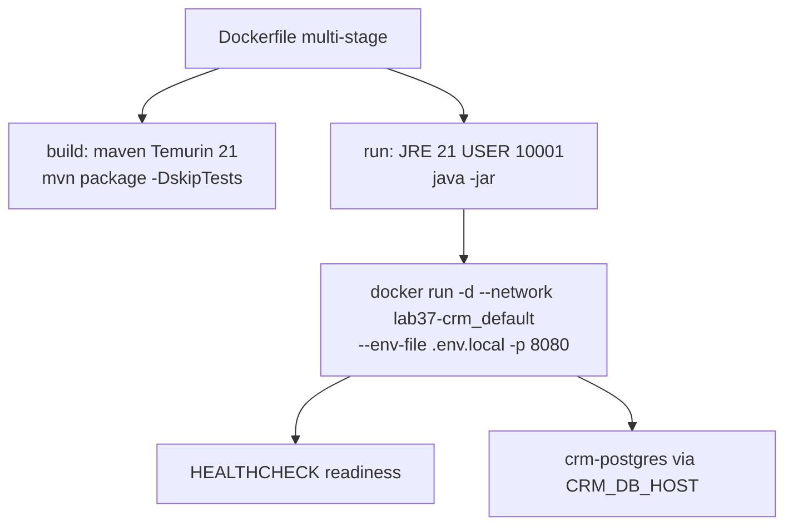

# Lab 41: Containerize the Spring Boot CRM — Multi-Stage Dockerfile, Non-Root, Health

**Module:** 41 — Containerize the Spring Boot CRM  
**Duration:** ~45 minutes (timed path with starter) · Full path: 3–4 Hours

**Primary IDE:** IntelliJ IDEA Community Edition · **Optional IDE:** VS Code

| OS | How-to for this lab |
| -- | ------------------- |
| Windows | [LAB-41-WINDOWS.md](LAB-41-WINDOWS.md) |
| macOS | [LAB-41-MACOS.md](LAB-41-MACOS.md) |

> **Two folders (do not mix):** [Clone the course repo · Commit in your own repo](../../../CLONE-AND-OWN-REPO-GUIDE.md). Read this GUIDE in the **course clone**. Write and run everything in **your** `java-bootcamp` repo.

---

## Activity card

| | |
| --- | --- |
| **Time** | ~45 min timed · full path 3–4 h |
| **Checkpoint** | **E** (after Ex 1→4→2→3→5→6) |
| **Must prove** | Multi-stage build · USER 10001 · no secrets in layers · HEALTHCHECK |
| **Hard gate** | Pre-lab Pass · Docker engine · bootable Lab 40 CRM in `java-bootcamp` |

### What you will learn

Package the Spring CRM as a small non-root image with runtime env and readiness checks.

### Enterprise context

Ops rejects root/`latest`-only images with passwords baked into layers.

### Predict

If `.env` is not dockerignored, where might the DB password appear?

### Debug

Readiness never UP — `localhost` inside the container, or missing `--network`?

---

## Two folders — every command below uses these paths

| Folder | Remote | You… |
| ------ | ------ | ---- |
| **Course clone** (handouts) | `bc-sw-engineer-java-participant` | **Read** this GUIDE / starter. **Never** commit homework here. |
| **Your repo** | private `java-bootcamp` | **Copy** Lab 40 here, **merge** starter stubs, **build** the image, **commit**. |

| Item | Course clone (read) | Your `java-bootcamp` (write) |
| ---- | ------------------- | ---------------------------- |
| This GUIDE | `labs/…/module-41/lab41/LAB-41-GUIDE.md` | — |
| Starter stubs | `labs/…/module-41/lab41/starter/` | merged into `examples/lab41-crm/` |
| Graded CRM + Dockerfile | — | `examples/lab41-crm/` |
| Pre-lab notes | — | `examples/module-41-exercises/notes/` |
| Screenshots | — | `notes/screenshots/lab-41/` (gitignored) |

IntelliJ stays on `java-bootcamp`. Keep the course clone in a browser tab or a second window.

**Lab 40 baseline (what you copy):** Spring Boot JAR built with **`mvn`** (no Maven Wrapper unless you added one), **`GET /api/customers`** list API, **no** Spring Security, **no** `/api/v1/interactions`, datasource today is `SPRING_DATASOURCE_*` until you add the docker profile in Step 2. PostgreSQL user from Lab 37 compose is **`crm` / `change-me`**, not `crm_app`. Point the copy at database **`crm_lab41`**. JDBC hostname from another container is **`crm-postgres`** on network **`lab37-crm_default`** (confirm with `docker network ls`).

---

## 45-minute timed path (use starter)

> **Pacing reminder:** [PACING.md](../PACING.md) checkpoint **E**. Homework: digest evidence + graceful stop + full runbook.

1. Open [`starter/README.md`](starter/README.md) **in the course clone**.
2. In **`java-bootcamp`**, copy Lab 40 → `examples/lab41-crm`, then merge `starter/` from the course clone.
3. Fill every `TODO` — do **not** work under `labs/`.
4. Build/run from `examples/lab41-crm`; evidence under `notes/screenshots/lab-41/`.
5. Mark timed-path Pass criteria in the starter README.

| Path | Time | Scope |
| ---- | ---- | ----- |
| **Timed (default)** | ~45 min | Dockerfile TODOs + non-root inspect + readiness (first image pull is several minutes) |
| **Full (extended)** | see Duration | Every Step (networked run, smoke, stop, runbook, peer) |

---

## What you'll submit (read this first)

All of these live under **`java-bootcamp`**, not the course clone.

| # | Deliverable | Where |
| - | ----------- | ----- |
| 1 | `Dockerfile` (multi-stage, non-root, health) | `examples/lab41-crm/Dockerfile` |
| 2 | `.dockerignore` + `.env.example` | same folder (`.env.local` gitignored) |
| 3 | Image build evidence (id/size/user) + digest notes | `docs/container-runbook.md` + `notes/screenshots/lab-41/` |
| 4 | Readiness + CRM list smoke (`GET /api/customers`) | notes |
| 5 | Graceful stop + bad `CRM_DB_HOST` evidence | notes |
| 6 | `docs/container-runbook.md` (registry flow included) | `examples/lab41-crm/docs/` |
| 7 | No secrets in Git or image layers | `git status` on **your** repo |

**Do not submit:** `target/`, secrets, `.env.local`, or a verbatim instructor `solution/`.

---

## Lab Overview

This Module 41 lab packages the CRM backend as a **small, reproducible, non-root** container image: multi-stage Maven build, hardened JRE runtime, runtime configuration via env, meaningful health checks, resource limits, log hygiene, graceful shutdown, and a `docs/container-runbook.md` another engineer can follow.

## Learning Objectives

After completing this lab, you will be able to:

* Explain image layers and build-context hygiene
* Create a multi-stage Maven → JRE Dockerfile for Java 21
* Run Spring Boot as a fixed non-root UID
* Inject profile, JDBC, and (later) broker settings at runtime
* Add container `HEALTHCHECK` aligned with readiness

## Business Scenario

The CRM must run consistently from developer laptops through the delivery platform. Leadership freezes:

**No production promotion of images that run as root, embed `.env`, or lack readiness signals.**

You own that packaging gate for the API that serves Amina (`CUS-1001`) and Ravi (`CUS-1002`).

| ID | Name | Notes |
| -- | ---- | ----- |
| `CUS-1001` | Amina Khan | `ACTIVE` — list-API smoke fixture |
| `CUS-1002` | Ravi Singh | `PROSPECT` — optional second smoke |
| `lab-request-001` | — | correlation header |
| `lab41-001`, … | — | runbook experiment IDs |

**Security note.** Never commit `.env.local`, registry passwords, or `docker history` dumps that include secrets. Prefer `.env.example` with **empty** password.

---

## Architecture Context
### NOW (this lab)


```mermaid
flowchart TB
  DF["Dockerfile multi-stage"] --> Build["build: maven Temurin 21<br/>mvn package -DskipTests"]
  DF --> Run["run: JRE 21 USER 10001<br/>java -jar"]
  Run --> Docker["docker run -d --network lab37-crm_default<br/>--env-file .env.local -p 8080"]
  Docker --> HC["HEALTHCHECK readiness"]
  Docker --> Ext["crm-postgres via CRM_DB_HOST"]
```

## Prerequisites

Prior labs: [Lab 40](../../module-40/lab40/LAB-40-GUIDE.md) already in **`java-bootcamp/examples/lab40-crm`**.

Confirm:

* JDK 21 + Maven 3.9.x (`mvn -version`). Use `./mvnw` only if **your** project already has a wrapper
* Docker Engine (`docker version` shows a Server)
* Lab 40 `mvn -B test` green on the host before you copy
* `crm-postgres` running (Lab 37 compose). Do not Flyway-migrate `crm` / `crm_lab39` / `crm_lab40`

### Pre-flight

```bash
java -version
mvn -version
docker version
```

Working directory for every later command unless noted:

```text
~/java-bootcamp/examples/lab41-crm
# Windows: %USERPROFILE%\java-bootcamp\examples\lab41-crm
```

## Worked example (read before you code)

Lab 39/40 has **no** `mvnw`. Build inside Docker with **`mvn`**. Skip tests in the image build (Testcontainers cannot start Docker-in-Docker here).

```dockerfile
# syntax=docker/dockerfile:1
FROM maven:3.9-eclipse-temurin-21 AS build
WORKDIR /workspace
COPY pom.xml .
RUN mvn -B -q dependency:go-offline || true
COPY src ./src
RUN mvn -B -DskipTests package && cp target/*-SNAPSHOT.jar target/app.jar

FROM eclipse-temurin:21-jre
RUN groupadd --system --gid 10001 spring \
 && useradd --system --uid 10001 --gid spring --create-home spring
WORKDIR /app
COPY --from=build --chown=spring:spring /workspace/target/app.jar /app/app.jar
USER 10001
EXPOSE 8080
ENV JAVA_TOOL_OPTIONS="-XX:MaxRAMPercentage=75.0"
HEALTHCHECK --interval=30s --timeout=3s --start-period=40s --retries=3 \
  CMD ["bash", "-c", "exec 3<>/dev/tcp/127.0.0.1/8080 && printf 'GET /actuator/health/readiness HTTP/1.0\r\nHost: localhost\r\n\r\n' >&3 && cat <&3 | grep -q UP"]
ENTRYPOINT ["java","-jar","/app/app.jar"]
```

**What to notice:** JRE has no `curl`/`wget` — HEALTHCHECK uses `/dev/tcp`. No password in `ENV`. Instructors check `Config.User=10001`.

---

## Implementation Steps

Complete each step in order. **Write** under `java-bootcamp`. **Read** starter files from the course clone.

---

### Step 1 — Copy Lab 40 into your repo, then merge starter stubs

**Why:** Graded work belongs in `java-bootcamp`. The course `starter/` is Dockerfile/docs, not a CRM.

**Where:** IntelliJ Terminal in **`java-bootcamp`**. Starter copy source is the **course clone**.

**Do this:**

**Windows (PowerShell):**

```powershell
$jb = "$env:USERPROFILE\java-bootcamp"
$courseLab41 = "$env:USERPROFILE\bc-sw-engineer-java-participant\labs\Week 5 - DevOps, CI-CD and OpenShift\module-41\lab41"

Copy-Item -Recurse -Force "$jb\examples\lab40-crm" "$jb\examples\lab41-crm"
Copy-Item -Recurse -Force "$courseLab41\starter\*" "$jb\examples\lab41-crm\"
New-Item -ItemType Directory -Force -Path "$jb\notes\screenshots\lab-41" | Out-Null

docker exec -e PGPASSWORD=change-me crm-postgres psql -U crm -d postgres -c "CREATE DATABASE crm_lab41;"
```

**macOS / Linux:**

```bash
JB=~/java-bootcamp
COURSE_LAB41=~/bc-sw-engineer-java-participant/labs/Week\ 5\ -\ DevOps,\ CI-CD\ and\ OpenShift/module-41/lab41

cp -R "$JB/examples/lab40-crm" "$JB/examples/lab41-crm"
cp -R "$COURSE_LAB41/starter/." "$JB/examples/lab41-crm/"
mkdir -p "$JB/notes/screenshots/lab-41"

docker exec -e PGPASSWORD=change-me crm-postgres psql -U crm -d postgres -c "CREATE DATABASE crm_lab41;"
```

Confirm `examples/lab41-crm` has `pom.xml`, `src/`, and the merged `Dockerfile`. Add `.env.local` and `dependency-check-data/` to `.gitignore` if missing.

**Expected result:** `lab41-crm` exists in **your** repo; `crm_lab41` created; you are not editing files under `labs/`.

**If it fails:** Copied into the course clone → start over in `java-bootcamp`. No `lab40-crm` → finish Lab 40 first.

---

### Step 2 — Build-context hygiene, actuator, and `CRM_DB_*` mapping

**Why:** Secrets in context leak into layers. Lab 40 yml listens to `SPRING_DATASOURCE_*`; Lab 42 ConfigMaps use `CRM_DB_*`. You must map them before `docker run`.

**Where:** `java-bootcamp/examples/lab41-crm`

**Do this:**

1. Keep / finish `.dockerignore` (starter already excludes `target/`, `.git/`, `.env`, `.env.*`, with `!.env.example`).
2. Add `spring-boot-starter-actuator` to `pom.xml` (merge `pom-actuator-snippet.xml`).
3. Add `src/main/resources/application-docker.yml` (starter file) so profile `docker` binds:

```yaml
spring:
  datasource:
    url: jdbc:postgresql://${CRM_DB_HOST:crm-postgres}:${CRM_DB_PORT:5432}/${CRM_DB_NAME:crm_lab41}
    username: ${CRM_DB_USER:crm}
    password: ${CRM_DB_PASSWORD}
  lifecycle:
    timeout-per-shutdown-phase: 20s
server:
  shutdown: graceful
management:
  endpoint:
    health:
      probes:
        enabled: true
  endpoints:
    web:
      exposure:
        include: health,info
```

4. Host check (not inside Docker): `mvn -B test` from `lab41-crm`.

Do **not** expose `env` / `beans`. Lab 40 has **no** Spring Security — health 401 is not the default failure mode.

**Expected result:** Ignore file present; actuator on the classpath; docker profile maps `CRM_DB_*`; host tests green.

**If it fails:** Accidental ignore of `src` or `Dockerfile` → fix `.dockerignore`.

---

### Step 3 — Create the multi-stage Dockerfile

**Why:** Builder tools must not ship in the runtime image.

**Where:** `java-bootcamp/examples/lab41-crm/Dockerfile` (fill starter TODOs).

**Do this:** Use **`mvn`**, not `mvnw`. Use **`-DskipTests`** in the image build. Rename the Boot jar to `app.jar` so `COPY` is a single file. Create UID **10001**. HEALTHCHECK via `/dev/tcp` (see Worked example). Never `ENV CRM_DB_PASSWORD`.

**Expected result:** Multi-stage file present; pom copied before `src` for cache.

**If it fails:** `COPY mvnw` not found → you followed the old wrapper snippet; use `mvn`. `verify` hung/failed on Testcontainers → use `package -DskipTests`.

---

### Step 4 — Harden runtime (non-root, no secrets)

**Why:** Root containers turn RCE into host privilege stories.

**Do this:** Confirm `USER 10001`, `--chown=spring:spring` on the jar, no `.env` `COPY`, no password `ARG`/`ENV`.

**Expected result:** Runtime stage is JRE + jar + non-root user.

**If it fails:** App needs `/tmp` — that is fine; do not run as root to “fix” mounts.

---

### Step 5 — Build and inspect the image

**Why:** Digests—not just tags—identify what you will deploy in Lab 42.

**Where:** `java-bootcamp/examples/lab41-crm`

```bash
docker build --pull -t crm-api:lab41 .
docker image inspect crm-api:lab41 --format "{{.Id}} {{.Size}} {{json .Config.User}}"
docker image inspect crm-api:lab41 --format "{{index .RepoDigests 0}}"
```

`RepoDigests` is empty until push — record **Image Id**. First `--pull` downloads Maven + JRE (several minutes).

**Expected result:** Image builds; user is `"10001"`; size noted (Windows reference ~404 MB).

**If it fails:** Huge context → `.dockerignore`. Permission on scripts → not applicable without wrapper.

---

### Step 6 — Run with configuration, network, and limits

**Why:** `localhost` inside the CRM container is the container itself. Config must be injectable.

**Where:** `java-bootcamp/examples/lab41-crm`

**Do this:** Copy `.env.example` → **`.env.local`** (gitignored). Fill `CRM_DB_PASSWORD=change-me`. Do **not** `--env-file .env.example` while the password is empty.

```bash
# confirm postgres network name if this fails:
docker network ls
```

**Windows (PowerShell):**

```powershell
cd $env:USERPROFILE\java-bootcamp\examples\lab41-crm
docker run -d --name crm-lab41 --network lab37-crm_default `
  --memory=512m --env-file .env.local -p 8080:8080 crm-api:lab41
```

**macOS / Linux:**

```bash
cd ~/java-bootcamp/examples/lab41-crm
docker run -d --name crm-lab41 --network lab37-crm_default \
  --memory=512m --env-file .env.local -p 8080:8080 crm-api:lab41
```

If port 8080 is busy, stop leftover `mvn spring-boot:run` first.

**Expected result:** Container running (`docker ps`); env injected; memory capped; on the postgres network.

**If it fails:** Cannot reach PostgreSQL → `--network` + `CRM_DB_HOST=crm-postgres`. Immediate exit → `docker logs crm-lab41`. Wrong DB user → Lab 37 user is **`crm`**, not `crm_app`.

---

### Step 7 — Verify health and CRM list smoke

**Why:** A listening port is not readiness.

**Do this:**

```bash
curl -fsS http://127.0.0.1:8080/actuator/health/readiness
curl -fsS -H "X-Correlation-Id: lab-request-001" "http://127.0.0.1:8080/api/customers?status=ACTIVE"
docker exec crm-lab41 id
docker logs crm-lab41 --tail 100
```

(Windows: `curl.exe`.) Lab 39/40 has **no** POST `/api/v1/interactions` and **no** Basic `admin:change-me`. A **200** list (possibly empty) is a valid smoke. Optionally seed `CUS-1001` with `psql` against `crm_lab41` if you want a named row.

Confirm logs have **no** password dumps.

**Expected result:** Readiness `UP`; list endpoint 200; `uid=10001(spring)`.

**If it fails:** Health 404 → actuator + `application-docker.yml` + `SPRING_PROFILES_ACTIVE=docker`. 503 → DB host/network/name. Do not look for SecurityConfig unless you added Security.

---

### Step 8 — Graceful shutdown and dependency failure

**Why:** Orchestrators need SIGTERM behavior; bad config must fail clearly.

```bash
docker stop --time 20 crm-lab41
docker logs crm-lab41 --tail 50
docker rm crm-lab41
```

Then run once with `CRM_DB_HOST=no-such-host` (same network, same `--env-file` plus `-e CRM_DB_HOST=no-such-host`). Capture Flyway/JDBC failure; remove that container.

**Expected result:** Orderly stop within ~20s; invalid host produces bounded logs.

**If it fails:** Forced kill only → confirm `server.shutdown=graceful` in the docker profile.

---

### Step 9 — Registry notes and evidence pack

**Why:** Lab 42 needs an immutable identity story even if you do not push yet.

**Where:** `java-bootcamp/examples/lab41-crm/docs/container-runbook.md` and `git status` in **your** repo.

**Do this:** Record image id, user, size, JDBC hostname, smoke command, tag-by-SHA (not only `latest`). Complete Failure Experiments. Confirm `.env.local` is **not** staged.

```bash
git status --short
git remote -v   # must be YOUR java-bootcamp
```

**Expected result:** Peer can build/run/stop from the runbook; no secrets staged.

---

### Step 10 — Peer build from runbook only

**Why:** Operator docs that require tribal knowledge fail Lab 42 under time pressure.

**Where:** Peer clones **your** `java-bootcamp`, not the course handouts.

**Do this:** Follow **only** `docs/container-runbook.md` to rebuild/run/curl readiness. Patch gaps. Record second image id.

**Expected result:** Peer reaches readiness without extra chat; evidence of second successful run.

**If it fails:** Missing `--network` / jar name / env keys → fix runbook immediately.

---

## Implementation Checkpoints

### Checkpoint A — Context and Dockerfile

| # | Confirm | Your notes |
| - | ------- | ---------- |
| 1 | Work is in `java-bootcamp/examples/lab41-crm` (not the course clone) | Pass / Fail |
| 2 | `.dockerignore` excludes secrets/`target` | Pass / Fail |
| 3 | Multi-stage Dockerfile uses `mvn` + `-DskipTests` + UID 10001 | Pass / Fail |

### Checkpoint B — Hardening and inspect

| # | Confirm | Your notes |
| - | ------- | ---------- |
| 1 | `docker inspect` user is `10001` | Pass / Fail |
| 2 | No secrets in image env/layers | Pass / Fail |
| 3 | Image id/size/user recorded | Pass / Fail |

### Checkpoint C — Run and prove

| # | Confirm | Your notes |
| - | ------- | ---------- |
| 1 | `.env.local` (not empty `.env.example`) + `crm_lab41` + `crm-postgres` | Pass / Fail |
| 2 | Readiness healthy; `GET /api/customers` 200 | Pass / Fail |
| 3 | Graceful stop + bad host experiment documented | Pass / Fail |

### Checkpoint D — Hygiene

| # | Confirm | Your notes |
| - | ------- | ---------- |
| 1 | `container-runbook.md` complete | Pass / Fail |
| 2 | Registry/digest notes present | Pass / Fail |
| 3 | No `.env.local` / tokens in Git | Pass / Fail |
| 4 | Peer build from runbook succeeded (or gaps fixed) | Pass / Fail |
| 5 | JDBC hostname for container→PostgreSQL documented | Pass / Fail |
| 6 | Actuator does not expose `env`/`beans` | Pass / Fail |
| 7 | Pushes went to **your** `java-bootcamp` remote | Pass / Fail |

---

## Safety Rules (restate before building)

* Work only against local Docker / authorized training hosts.
* Never `COPY` `.env` or kubeconfig into the image.
* Pin or record base image tags (`maven:3.9-eclipse-temurin-21`, `eclipse-temurin:21-jre`).
* Prefer digest identity for anything you will promote to Lab 42.
* Do not run training containers as root to make volume mounts work.
* Keep CRM smoke synthetic (`CUS-1001` / `CUS-1002` only).
* Delete failed containers after capturing logs; do not leave password-bearing env files on shared disks.

---

## Reference Commands, Configuration, and Code

### Build and run (from `java-bootcamp/examples/lab41-crm`)

```bash
docker build --pull -t crm-api:lab41 .
docker run -d --name crm-lab41 --network lab37-crm_default \
  --memory=512m --env-file .env.local -p 8080:8080 crm-api:lab41
curl -fsS http://127.0.0.1:8080/actuator/health/readiness
curl -fsS -H "X-Correlation-Id: lab-request-001" \
  "http://127.0.0.1:8080/api/customers?status=ACTIVE"
docker exec crm-lab41 id
docker stop --time 20 crm-lab41
```

### Tagging for Lab 42

```bash
GIT_SHA=$(git rev-parse --short HEAD)
docker tag crm-api:lab41 crm-api:1.0.0-${GIT_SHA}
# docker login …  (credentials never in Git)
```

## Failure Experiments

| # | Experiment | Observe | Restore |
| - | ---------- | ------- | ------- |
| 1 | Comment out `USER` | Inspect user `0`; note risk | Restore `USER 10001` |
| 2 | `CRM_DB_HOST=no-such-host` | Flyway/JDBC fail; unhealthy/exit | Fix host |
| 3 | Omit `.dockerignore` `target/` | Slower/messier context | Restore ignore |
| 4 | `docker stop --time 1` | Possible forced kill | Prefer 20s |
| 5 | Tag only `latest` in notes | Document why Lab 42 rejects it | Use version+SHA |
| 6 | `--env-file .env.example` with empty password | Auth fail | Use `.env.local` |

---

## Troubleshooting

| Symptom | Likely cause | Fix |
| ------- | ------------ | --- |
| Huge context | Missing `.dockerignore` | Ignore `target`, `.git`, `.env` |
| `COPY mvnw` fails | Lab 40 has no wrapper | Dockerfile must use `mvn` |
| Testcontainers during `docker build` | `mvn verify` in image | `package -DskipTests` |
| Jar not found | Glob matched 0 or 2 files | Copy renamed `target/app.jar` |
| Cannot connect DB | Docker DNS | `--network lab37-crm_default` + `CRM_DB_HOST=crm-postgres` |
| Password authentication failed | User `crm_app` vs compose `crm` | `CRM_DB_USER=crm` |
| Migrated the wrong database | `CRM_DB_NAME=crm` | Use **`crm_lab41`** |
| HEALTHCHECK fail | No wget/curl | `/dev/tcp` HEALTHCHECK; expose actuator health |
| Port 8080 bind | Leftover Java | Stop host `spring-boot:run` |
| `./mvnw` not found on host | No wrapper | Use `mvn` |
| Accidental work in course clone | Wrong folder | Move to `java-bootcamp` |

## Evidence Log Template

```markdown
# Lab 41 Evidence Log
- Repo (must be java-bootcamp):
- Image tag / id:
- Config.User:
- Size (bytes):
- Readiness curl result:
- GET /api/customers result:
- Stop --time 20 observation:
- Bad JDBC experiment:
- Runbook peer-tested: Y/N
```

---

## Cleanup

```bash
docker stop crm-lab41 2>/dev/null || true
docker rm crm-lab41 2>/dev/null || true
cd ~/java-bootcamp/examples/lab41-crm
git status --short
```

Keep Dockerfile and runbook; delete plaintext env files from shared hosts.

**Keep `lab41-crm` in `java-bootcamp`**—Lab 42 deploys this image.

---

## Reflection Questions

Write **1–3 sentence** answers (not essays):

1. Which design decision most affected image safety/size?
2. What evidence proves non-root + readiness?
3. Which failure was hardest to diagnose (network vs health vs perms)?

---
