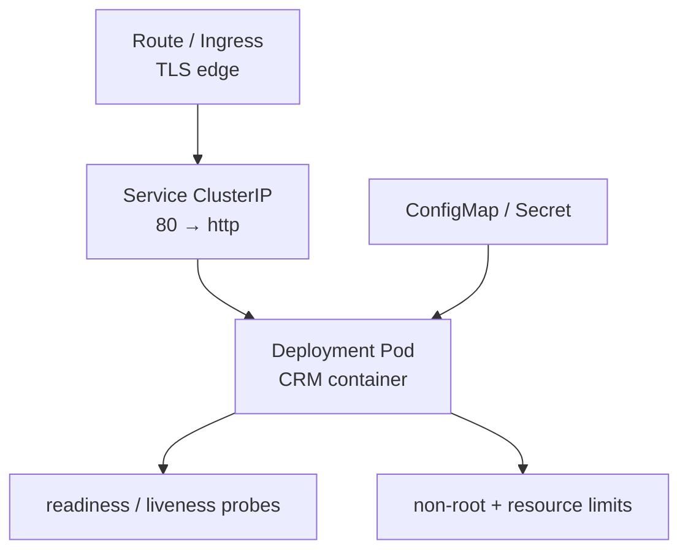
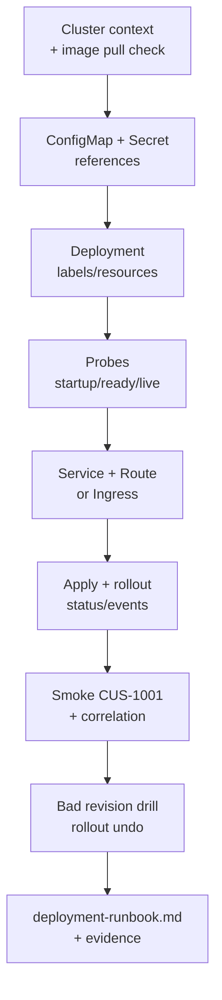

# Lab 42: Kubernetes (k3s) Deployment — Deployment, Service, ConfigMap, Ingress, Probes, Rollout

**Module:** 42 — Kubernetes (k3s) Deployment  
**Lab folder:** `labs/Week 5 - DevOps, CI-CD and OpenShift/module-42/lab42/`  
**Difficulty:** Intermediate  
**Duration:** 4–5 Hours

**Primary IDE:** IntelliJ IDEA Community Edition · **Optional IDE:** VS Code

| OS | How-to for this lab |
| -- | ------------------- |
| Windows | [LAB-42-WINDOWS.md](LAB-42-WINDOWS.md) |
| macOS | [LAB-42-MACOS.md](LAB-42-MACOS.md) |

> **Environment reminder:** Finish [Lab 0](../../../Week%201%20-%20Java%20and%20JVM%20Foundations/module-00/lab0/LAB-0-GUIDE.md). Use **IntelliJ IDEA Community** (primary; optional VS Code) on your laptop with **JDK 21**, **Docker**, and instructor **k3s** access (`kubectl`). Work under `~/java-bootcamp` (Windows: `%USERPROFILE%\java-bootcamp`).

---

## How to follow this lab

1. Open the **Windows** or **macOS** how-to (links above) in a second tab.
2. Create/work only under your `java-bootcamp/examples/…` folder from the steps (not inside this `labs/` git clone unless a step says otherwise).
3. For each **Step N**: read **Why** (if present) → do the actions → confirm **Expected** / **Expected result** → then continue.
4. When stuck, use **Failure Experiments** / troubleshooting in this guide before asking for help.
5. Capture evidence under `notes/screenshots/lab-42/` (workspace root under `java-bootcamp`; redact secrets). Use the **Pass criteria** tables — write **Pass** or **Fail** in your notes. GitHub file view does not support clickable checkboxes.

## Lab Overview

This Module 42 lab deploys the CRM **declaratively**: Deployment, Service, ConfigMap, Secret references, resource requests/limits, distinct **startup / readiness / liveness** probes, **Traefik Ingress**, rollout observation, smoke test with CRM fixtures, and a practiced **rollback**.

**Purpose.** Platform engineers require consistent labels, least privilege, traffic-safe probes, bounded resources, TLS at the edge, and rollback evidence. Leadership freezes:

**No “it works on my laptop Docker” as the production definition of done without manifests, probes, and a verified rollback.**

**What you build (exercise).** Create `lab42-crm` manifests under `k8s/`; apply ConfigMap + Secret reference pattern; Deployment with non-root, resources, and three probes; ClusterIP Service; Ingress with TLS redirect; deploy and diagnose; smoke health + customer API with `CUS-1001` / `lab-request-001`; rehearse bad revision and `rollout undo`; write `docs/deployment-runbook.md`.

**What success looks like.** Under `~/java-bootcamp/examples/lab42-crm/` (or platform `k8s/`) a peer can `kubectl apply -f k8s/`, wait for rollout, hit the Ingress, and roll back—using digest-pinned images and no secrets in Git.

**Depends on Lab 41.** Need a published or cluster-pullable image (`crm-api` version/digest). Finish container health paths first.

**CRM connection.** Fixtures `CUS-1001` (Amina) / `CUS-1002` (Ravi) / correlation `lab-request-001`. ConfigMaps hold non-secret URLs; Secrets hold DB passwords—created out-of-band in the training project.

---

## Learning Objectives

After completing this lab, you will be able to:

* Author valid Deployment, Service, ConfigMap, and Ingress manifests
* Separate non-secret config from Secret references
* Set realistic CPU/memory requests and limits
* Implement distinct startup, readiness, and liveness probes
* Expose the CRM safely through Service + Ingress
* Verify rollout status, endpoints, events, and logs
* Rehearse a bad revision and execute rollback to a known-good RS
* Keep kubeconfig and Secret data out of source control
* Document operator steps in `deployment-runbook.md`
* Align labels/selectors so Service endpoints actually populate

---

## Business Scenario

The Lab 41 container is ready for a shared cluster. Leadership freezes:

**No shared-namespace deploy without probes, resource bounds, non-root policy, and a rollback drill.**

You own that gate for the CRM API serving Amina (`CUS-1001`) and Ravi (`CUS-1002`) in the instructor project/namespace.

Use these examples consistently:

| ID | Name | Notes |
| -- | ---- | ----- |
| `CUS-1001` | Amina Khan | `ACTIVE` — smoke create/get via Route |
| `CUS-1002` | Ravi Singh | `PROSPECT` — optional second smoke |
| `CUS-9999` | — | not-found vs error distinction |
| `lab-request-001` | — | correlation across edge → pod logs |
| `lab42-001`, … | — | rollout experiment IDs |

**Security note for evidence.** Never paste `kubectl` login tokens, kubeconfig, or `kubectl get secret -o yaml` into Git or screenshots. Use synthetic customers only.

---

## Architecture Context

### NOW (this lab)



### Lab flow (mermaid)



### Architecture NOW vs LATER

| Aspect | Lab 42 (NOW) | Later / production |
| ------ | ------------ | ------------------ |
| Delivery | Manual `kubectl apply` | CI/CD GitOps |
| Config | ConfigMap + Secret objects | External secret operators |
| Scale | Small replica count | HPA / PDB (bonus) |
| Network | Ingress | Mesh / NetworkPolicy (bonus) |

**Lab focus:** manifests, probes, Service/Route, rollout and rollback—not Terraform or full mesh.

---

## Prerequisites

Complete [SETUP](../../../SETUP-INSTRUCTIONS.md), [Lab 0](../../../Week%201%20-%20Java%20and%20JVM%20Foundations/module-00/lab0/LAB-0-GUIDE.md), and [Lab 41](../../module-41/lab41/LAB-41-GUIDE.md). Confirm:

* Lab 41 image available to the cluster (push to training registry or load per instructor)
* `kubectl` installed and authenticated to your **namespace**
* Permission to create Deployments, Services, ConfigMaps, Ingress, Secrets (or Secret exists)
* No secrets committed to Git

### Pre-flight

```bash
kubectl version --client
kubectl config current-context
kubectl get ns
docker --version
git status --short
pwd
ls ~/java-bootcamp/examples
```

Record client/server versions **without** dumping kubeconfig contents into notes.

---

## Suggested Project Files

Prefer examples. Platform integration cohorts typically use `customer-management-platform/k8s/`—same filenames and runbook expectations.

```text
~/java-bootcamp/examples/lab42-crm/
├── k8s/
│   ├── configmap.yaml
│   ├── secret.example.yaml          # placeholders ONLY — or omit real Secret
│   ├── deployment.yaml
│   ├── service.yaml
│   └── ingress.yaml
├── docs/
│   └── deployment-runbook.md
├── notes/screenshots/
├── .gitignore
└── README.md
```

Also keep Lab 41 Dockerfile nearby or reference image coordinates from `lab41-crm`.

Ignore kubeconfig copies, `*-secret.yaml` with data, `.env`, and TLS private keys.

---

## Concepts to Discuss

Write 2–3 sentences each in `docs/deployment-runbook.md`:

1. Main flow: Route → Service → Pod → app → PostgreSQL
2. Trust boundary: cluster auth vs app authz; who can `exec`
3. Success/failure contracts: Ready vs Live vs Started
4. Stable image digest vs moving tag
5. Idempotency of `kubectl apply`; when apply is not enough (Secret rotation)
6. Why readiness gates traffic but liveness kills processes
7. Evidence operators need (rollout history, events, logs, endpoints)
8. Two replicas: session stickiness assumptions (prefer stateless API)
9. ConfigMap vs Secret misuse (password in ConfigMap)
10. What GitOps would change later without rewriting probe intent

---

## Implementation Steps

Complete each step in order. Use instructor namespace (`kubectl -n …`). Use `kubectl`.

---

### Step 1 — Check cluster prerequisites and image reachability

**Why:** Half of failed labs are wrong context, empty pull secrets, or wrong namespace.

**Do this:**

```bash
cd ~/java-bootcamp/examples
mkdir -p lab42-crm/k8s lab42-crm/docs
mkdir -p ~/java-bootcamp/notes/screenshots/lab-42
cd lab42-crm

kubectl config current-context
kubectl get sa,rolebinding -o name | head
# Confirm you can pull or that instructor preloaded the image:
kubectl run crm-pull-test --image=REGISTRY/training/crm-api:lab41 --restart=Never --command -- sleep 5
kubectl delete pod crm-pull-test --wait=false 2>/dev/null || true
```

Record registry image name/digest from Lab 41. Do not screenshot tokens.

**Expected result:** Correct context/namespace; image pull strategy understood; lab folder scaffolded.

**If it fails:** Unauthorized → stop; ask instructor. ImagePullBackOff on test → fix pull secret/registry before writing manifests.

---

### Step 2 — Create ConfigMap and Secret references

**Why:** Mixing passwords into ConfigMaps is a Lab 40-class finding in production.

**Do this:** `k8s/configmap.yaml`:

```yaml
apiVersion: v1
kind: ConfigMap
metadata:
  name: crm-api-config
data:
  SPRING_PROFILES_ACTIVE: "kubernetes"
  CRM_DB_URL: "jdbc:postgresql://postgres.example.svc:5432/crm"
  CRM_DB_USERNAME: "crm_app"
```

Create the Secret **out of band** (instructor may provide):

```bash
kubectl create secret generic crm-api-secrets \
  --from-literal=CRM_DB_PASSWORD='REDACTED_TRAINING_ONLY' \
  --dry-run=client -o yaml   # review; apply only in training ns
```

Commit `secret.example.yaml` with empty placeholders or keys listed—**no values**. Document rotation ownership in the runbook.

**Expected result:** ConfigMap in Git; Secret exists in cluster only; example file has no real password.

**If it fails:** Password committed → remove, rotate training secret, rewrite history only with instructor help.

---

### Step 3 — Define the Deployment (labels, image, env)

**Why:** Selector mismatches yield Services with no Endpoints—the classic silent break.

**Do this:** `k8s/deployment.yaml` core:

```yaml
apiVersion: apps/v1
kind: Deployment
metadata:
  name: crm-api
  labels:
    app: crm-api
spec:
  replicas: 2
  selector:
    matchLabels:
      app: crm-api
  template:
    metadata:
      labels:
        app: crm-api
    spec:
      securityContext:
        runAsNonRoot: true
      containers:
        - name: crm-api
          image: registry.example.com/training/crm-api:lab41   # prefer @sha256:…
          imagePullPolicy: IfNotPresent
          ports:
            - name: http
              containerPort: 8080
          envFrom:
            - configMapRef:
                name: crm-api-config
            - secretRef:
                name: crm-api-secrets
```

Replace registry/image with your Lab 41 coordinates. Prefer digest pinning when available.

**Expected result:** Valid Deployment YAML; labels match selector; envFrom references exist.

**If it fails:** Schema validation → fix apiVersion/fields. Wrong secret name →  CreateContainerConfigError.

---

### Step 4 — Set resources and container security context

**Why:** Unbounded pods starve neighbors; privileged pods expand blast radius.

**Do this:** Under the container:

```yaml
resources:
  requests:
    cpu: 100m
    memory: 256Mi
  limits:
    cpu: 500m
    memory: 512Mi
securityContext:
  allowPrivilegeEscalation: false
  readOnlyRootFilesystem: false   # set true only if app/tmp volumes allow
  runAsNonRoot: true
  # runAsUser: 10001              # if SCC/PSA requires explicit UID
```

Align with Lab 41 UID `10001` when the cluster security context constraints require it.

**Expected result:** Requests/limits present; non-root enforced; no privileged flag.

**If it fails:** SCC/PSA denial → adjust UID/fsGroup per instructor notes—not by requesting privileged.

---

### Step 5 — Configure startup, readiness, and liveness probes

**Why:** One probe for everything causes restart storms under load or cut traffic during boot.

**Do this:**

```yaml
startupProbe:
  httpGet:
    path: /actuator/health/liveness
    port: http
  failureThreshold: 30
  periodSeconds: 5
readinessProbe:
  httpGet:
    path: /actuator/health/readiness
    port: http
  periodSeconds: 10
livenessProbe:
  httpGet:
    path: /actuator/health/liveness
    port: http
  periodSeconds: 20
```

Tune thresholds for PostgreSQL-warm boots. Do **not** point liveness at readiness if DB blips should only shed traffic.

**Expected result:** Three distinct probes; startup covers slow init; readiness gates traffic; liveness reserved for dead process cases.

**If it fails:** CrashLoop from aggressive liveness → lengthen startup; separate paths.

---

### Step 6 — Create Service and Route (or Ingress)

**Why:** ClusterIP alone is not user-reachable; edge TLS policy matters.

**Do this:** `k8s/service.yaml`:

```yaml
apiVersion: v1
kind: Service
metadata:
  name: crm-api
spec:
  selector:
    app: crm-api
  ports:
    - name: http
      port: 80
      targetPort: http
```

Traefik Ingress `k8s/ingress.yaml` (adjust host / class per instructor):

```yaml
apiVersion: networking.k8s.io/v1
kind: Ingress
metadata:
  name: crm-api
  annotations:
    traefik.ingress.kubernetes.io/router.entrypoints: websecure
spec:
  rules:
    - host: crm-api.example.local
      http:
        paths:
          - path: /
            pathType: Prefix
            backend:
              service:
                name: crm-api
                port:
                  name: http
```

Document the hostname assigned for your namespace.

**Expected result:** Service selects pods; Ingress exposes HTTPS (or training HTTP if TLS not available—note residual risk).

**If it fails:** No endpoints → label mismatch. Ingress admission errors → ask instructor for allowed host patterns.

---

### Step 7 — Deploy, observe, and fix from evidence

**Why:** `apply` without `rollout status` and events misses ImagePull/probe failures.

**Do this:**

```bash
kubectl apply -f k8s/configmap.yaml
# Secret already created out-of-band
kubectl apply -f k8s/deployment.yaml -f k8s/service.yaml -f k8s/route.yaml
kubectl rollout status deployment/crm-api --timeout=180s
kubectl get pods,svc,endpoints,route -l app=crm-api
kubectl describe deployment crm-api
kubectl logs deployment/crm-api --all-containers --tail=100
kubectl get events --sort-by=.lastTimestamp | tail
```

Correct selector, pull, resource, and probe failures using those signals—not random sleeps.

**Expected result:** Rollout successful; Endpoints populated; pods Ready; logs free of secrets.

**If it fails:** See Troubleshooting table; capture `describe`/`events` excerpts (sanitized).

---

### Step 8 — Smoke test with CRM fixtures

**Why:** Ready pods that return 500 on `/api/customers` are not done.

**Do this:** Get Route host and:

```bash
HOST=$(kubectl get route crm-api -o jsonpath='{.spec.host}')
curl -fsS "https://${HOST}/actuator/health/readiness"
curl -fsS -H "X-Correlation-Id: lab-request-001" \
  -H "Content-Type: application/json" \
  "https://${HOST}/api/customers/..."   # create/get CUS-1001 per your API
```

Verify correlation appears in pod logs when instrumented. Use synthetic emails only.

**Expected result:** Health OK; Amina path succeeds; correlation traceable; `CUS-9999` not-found explicit.

**If it fails:** TLS/cert issues in training → follow instructor insecure-test guidance carefully and document. 401 → use provided training token header if required.

---

### Step 9 — Rollout drill, rollback, and runbook

**Why:** Rollback unrehearsed is fiction.

**Do this:** In sandbox only, change to a bad image tag or broken ConfigMap value; observe failed rollout; then:

```bash
kubectl rollout history deployment/crm-api
kubectl rollout undo deployment/crm-api
kubectl rollout status deployment/crm-api --timeout=180s
```

Verify previous revision Ready and smoke still works. Write `docs/deployment-runbook.md` with apply order, probe meanings, rollback commands, residual risks. Complete [Failure Experiments](#failure-experiments).

**Expected result:** History shows revisions; undo restores known-good; runbook peer-complete; Git clean of secrets.

**If it fails:** No history (recreate) → use `apply` changes that create new RS; don’t `delete` casually in shared ns.

---

### Step 10 — Two-replica behavior and correlation check

**Why:** CRM APIs must remain correct when more than one pod serves traffic.

**Do this:** Confirm `replicas: 2` (or scale up temporarily):

```bash
kubectl scale deployment/crm-api --replicas=2
kubectl get pods -l app=crm-api -o wide
```

Send several smoke requests with `lab-request-001` (and varying correlation IDs). Confirm responses stay correct for `CUS-1001` without sticky-session assumptions (stateless JWT/session notes if any). Check that both pods appear in Endpoints.

Optional: delete one pod and watch Service continue serving while the ReplicaSet replaces it—record downtime expectations (should be minimal with readiness).

**Expected result:** ≥2 Ready pods (or documented single-replica training limit); Endpoints list both; smoke still green after pod delete.

**If it fails:** Only one pod scheduled → resource quota; ask instructor. Sticky assumption bugs → fix app state (no local-only caches for customer writes without shared store).

---

### Step 11 — Peer apply from runbook

**Why:** Manifests without operable docs fail the lab’s operator bar.

**Do this:** Have a peer apply from `docs/deployment-runbook.md` alone (or you from a fresh terminal), reach readiness via Route, and execute `rollout history`. Patch any missing image coordinates, Secret prerequisites, or hostname discovery steps.

**Expected result:** Peer succeeds without undocumented Slack commands; runbook updated; evidence retained.

**If it fails:** Missing Secret prerequisite → call it out in runbook Step 0. Wrong namespace → add explicit `kubectl config` / `kubectl config set-context --current --namespace` lines.

---

## Implementation Checkpoints

### Checkpoint A — Access and config

_Mark each row **Pass** or **Fail** in your lab notes (GitHub markdown files are not interactive checklists)._

| # | Confirm | Your notes |
| - | ------- | ---------- |
| 1 | Correct context/namespace recorded | Pass / Fail |
| 2 | Image pull strategy verified | Pass / Fail |
| 3 | ConfigMap in Git; Secret only in cluster (+ example without values) | Pass / Fail |

### Checkpoint B — Workload manifests

_Mark each row **Pass** or **Fail** in your lab notes (GitHub markdown files are not interactive checklists)._

| # | Confirm | Your notes |
| - | ------- | ---------- |
| 1 | Deployment labels/selectors aligned | Pass / Fail |
| 2 | Resources + non-root security context | Pass / Fail |
| 3 | Startup, readiness, liveness distinct | Pass / Fail |

### Checkpoint C — Exposure and proof

_Mark each row **Pass** or **Fail** in your lab notes (GitHub markdown files are not interactive checklists)._

| # | Confirm | Your notes |
| - | ------- | ---------- |
| 1 | Service Endpoints populated | Pass / Fail |
| 2 | Ingress reachable | Pass / Fail |
| 3 | Smoke with `CUS-1001` + correlation | Pass / Fail |

### Checkpoint D — Operations hygiene

_Mark each row **Pass** or **Fail** in your lab notes (GitHub markdown files are not interactive checklists)._

| # | Confirm | Your notes |
| - | ------- | ---------- |
| 1 | Rollout undo rehearsed and verified | Pass / Fail |
| 2 | `deployment-runbook.md` complete | Pass / Fail |
| 3 | No kubeconfig/Secret data in Git | Pass / Fail |

---

## Reference Commands, Configuration, and Code

### Full Deployment sketch (assemble from Steps 3–5)

```yaml
apiVersion: apps/v1
kind: Deployment
metadata:
  name: crm-api
spec:
  replicas: 2
  selector:
    matchLabels: { app: crm-api }
  template:
    metadata:
      labels: { app: crm-api }
    spec:
      securityContext: { runAsNonRoot: true }
      containers:
        - name: crm-api
          image: registry.example.com/training/crm-api:1.0.0
          ports: [{ name: http, containerPort: 8080 }]
          envFrom:
            - configMapRef: { name: crm-api-config }
            - secretRef: { name: crm-api-secrets }
          resources:
            requests: { cpu: 100m, memory: 256Mi }
            limits: { cpu: 500m, memory: 512Mi }
          startupProbe:
            httpGet: { path: /actuator/health/liveness, port: http }
            failureThreshold: 30
            periodSeconds: 5
          readinessProbe:
            httpGet: { path: /actuator/health/readiness, port: http }
            periodSeconds: 10
          livenessProbe:
            httpGet: { path: /actuator/health/liveness, port: http }
            periodSeconds: 20
```

### Service and Ingress

```yaml
apiVersion: v1
kind: Service
metadata: { name: crm-api }
spec:
  selector: { app: crm-api }
  ports: [{ name: http, port: 80, targetPort: http }]
---
apiVersion: networking.k8s.io/v1
kind: Ingress
metadata:
  name: crm-api
  annotations:
    traefik.ingress.kubernetes.io/router.entrypoints: websecure
spec:
  rules:
    - host: crm-api.example.local
      http:
        paths:
          - path: /
            pathType: Prefix
            backend:
              service:
                name: crm-api
                port:
                  name: http
```

### Deploy and inspect

```bash
cd ~/java-bootcamp/examples/lab42-crm
kubectl apply -f k8s/configmap.yaml
kubectl apply -f k8s/deployment.yaml -f k8s/service.yaml -f k8s/route.yaml
kubectl rollout status deployment/crm-api --timeout=180s
kubectl get pods,svc,endpoints -l app=crm-api
kubectl describe deployment crm-api
kubectl logs deployment/crm-api --all-containers --tail=100
kubectl rollout history deployment/crm-api
kubectl rollout undo deployment/crm-api
HOST=$(kubectl get route crm-api -o jsonpath='{.spec.host}')
curl -fsS "https://${HOST}/actuator/health/readiness"
```

### Probe excerpt

```yaml
startupProbe:   { httpGet: { path: /actuator/health/liveness,  port: http }, failureThreshold: 30, periodSeconds: 5 }
readinessProbe: { httpGet: { path: /actuator/health/readiness, port: http }, periodSeconds: 10 }
livenessProbe:  { httpGet: { path: /actuator/health/liveness,  port: http }, periodSeconds: 20 }
```

### Artifact map

| Artifact | Role |
| -------- | ---- |
| `configmap.yaml` | Non-secret env |
| Secret (cluster) | DB password |
| `deployment.yaml` | Workload + probes |
| `service.yaml` | Cluster IP exposure |
| `route.yaml` / Ingress | Edge access |
| `deployment-runbook.md` | Operator evidence |

---

## Manual Verification

1. Context/namespace is the approved training project.
2. ConfigMap applied; Secret not stored in Git.
3. Deployment Ready with matching Service Endpoints.
4. Probes are distinct; startup allows slow boot.
5. Ingress returns readiness success.
6. CRM smoke works for `CUS-1001` with `lab-request-001`.
7. Non-root / resource limits present in live pod spec.
8. Rollout history exists; undo restores known-good.
9. Events/logs interpreted for at least one failure drill.
10. Runbook enables peer apply → smoke → rollback.

---

## Failure Experiments

| # | Experiment | Observe | Restore |
| - | ---------- | ------- | ------- |
| 1 | Break Service selector labels | Empty Endpoints | Fix labels |
| 2 | Point liveness at readiness with DB blip | Restart storm risk | Separate probes |
| 3 | Deploy bad image tag | ImagePull/CrashLoop; rollout fail | `rollout undo` |
| 4 | Put password in ConfigMap temporarily | Document why forbidden | Move to Secret; rotate |
| 5 | Scale to 0 then back | Outage then recovery | `replicas: 2` |

---

## Troubleshooting

| Symptom | Likely cause | Fix |
| ------- | ------------ | --- |
| ImagePullBackOff | Wrong image/pull secret | Fix registry coords; ask instructor |
| CreateContainerConfigError | Missing Secret/ConfigMap | Create/reference correctly |
| CrashLoopBackOff | App/probe misconfig | Logs + lengthen startup |
| 0/1 Ready | Readiness failing | DB URL/network; readiness path |
| No Endpoints | Selector mismatch | Align labels |
| Ingress host DNS fail | Platform lag / wrong domain | Wait; confirm `kubectl get ingress` |
| Forbidden PSA | Soft privilege request | Non-root UID per PSA docs |
| Undo no-op | Single revision only | Make a second revision first |

---

## Security and Production Review

Answer in the runbook:

1. Which inputs are untrusted (Traffic from Route; ConfigMap data from Git)?
2. Where are authn/authz enforced (edge + app—not Deployment alone)?
3. Which values are sensitive—Secret vs ConfigMap?
4. What can be retried safely (`apply`, rollout undo, pod delete)?
5. What happens after partial failure (mixed Ready pods during rollout)?
6. What would an operator monitor (replicas, probe fails, events, error rate)?
7. Which local default is unacceptable (privileged, latest tag, secret in Git)?
8. How are manifest/image contracts versioned (Git SHA + digest)?

---

## Cleanup

Capture evidence first. Delete **only** resources you created in the training namespace (instructor policy may keep shared PostgreSQL).

```bash
kubectl delete -f k8s/route.yaml -f k8s/service.yaml -f k8s/deployment.yaml -f k8s/configmap.yaml --ignore-not-found
# Do not delete shared Secrets/DBs unless instructed
kubectl config current-context   # confirm you did not leave a prod context
cd ~/java-bootcamp/examples/lab42-crm
git status --short
```

Remove local kubeconfig copies and plaintext password files from the jump host.

**Keep `lab42-crm` manifests**—portfolio evidence for the container→cluster path (Labs 41–42).

---

## Expected Deliverables

* `k8s/configmap.yaml`, `deployment.yaml`, `service.yaml`, `route.yaml` or `ingress.yaml`
* Secret handling documented (`secret.example.yaml` without values)
* Probe configuration with distinct startup/ready/live
* Rollout success evidence + rollback rehearsal evidence
* CRM smoke evidence (`CUS-1001`, correlation)
* `docs/deployment-runbook.md`
* No kubeconfig, tokens, or Secret data in Git

---

## Evaluation Rubric (100 Marks)

| Criteria | Marks |
| -------- | ----: |
| Environment and project structure | 10 |
| Core implementation (manifests, probes, Service/Route) | 30 |
| Integration/configuration correctness (labels, env, image) | 15 |
| Failure handling (events diagnosis, rollback) | 15 |
| Automated / scripted verification (apply + rollout status) | 10 |
| Security and production awareness | 10 |
| Documentation and evidence | 10 |

**Notes:** Password in ConfigMap/Git → honor violation. Single combined probe without rationale → lose core marks. No rollback drill → lose failure-handling marks.

---

## Reflection Questions

Write 3–6 sentence answers:

1. Which design decision most affected traffic safety (which probe)?
2. Which failure was hardest to diagnose from events/logs?
3. What evidence proves rollback worked?
4. What breaks first at ten times the replica count or QPS?
5. Which concern should move to shared platform GitOps?
6. What must change before real customer data is used via the Route?
7. How does this lab connect to Labs 40–41 and the CRM architecture?
8. What metric matters most during a rolling update?
9. (Forward look) What would NetworkPolicy / PDB change in failure modes?

---

## Bonus Challenges

1. Add a PodDisruptionBudget and explain its limits.
2. Add a NetworkPolicy for API ingress and DB egress.
3. Use Kustomize overlays for dev vs test images.
4. Capture readiness during rolling update (`kubectl get pods -w`).
5. Pin the image by registry digest in the Deployment.
6. Document blue/green vs rolling trade-offs for this CRM API.

---

## Success Criteria

You are finished when:

* Manifests deploy cleanly in the training namespace
* Probes are distinct and empirically tuned enough to stay Ready
* Service/Route expose a working CRM smoke path
* Rollback was rehearsed and verified
* Runbook enables peer reproduction
* No production secret or kubeconfig is in Git
* You can explain local Docker vs cluster differences honestly

---

## Instructor Notes

* **Live probe:** Show Endpoints non-empty; curl Route readiness; walk `rollout undo` with history before/after.
* **Assess:** Label correctness, probe separation, Secret hygiene, rollback evidence, runbook clarity.
* **Continuity:** Prefer `examples/lab42-crm` or platform `k8s/`. Image must match Lab 41 digest/tag discipline.
* **Common pitfalls:** Selector typos; liveness=readiness; secrets in Git; wrong context; deleting shared DB Secrets; `latest` image.
* **Timing:** 4–5 hours. Cluster access and first ImagePull often burn 45–60 minutes—validate pull in Step 1 early.

---

*End of Lab 42 — Kubernetes (k3s) Deployment. Keep manifests and runbook for portfolio evidence of the CRM container-to-cluster path.*
