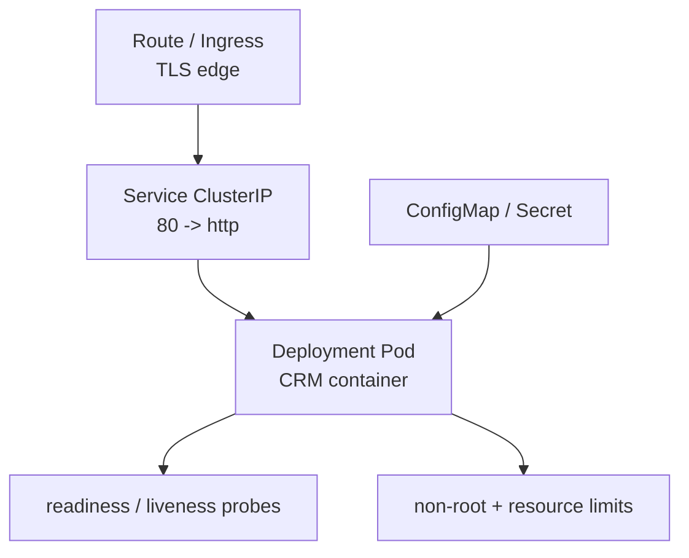

# Lab 42: Kubernetes (k3s) Deployment — Deployment, Service, ConfigMap, Ingress, Probes, Rollout

**Module:** 42 — Kubernetes (k3s) Deployment  
**Duration:** ~45 minutes (timed path with starter) · Full path: 4–5 Hours

**Primary IDE:** IntelliJ IDEA Community Edition · **Optional IDE:** VS Code

| OS | How-to for this lab |
| -- | ------------------- |
| Windows | [LAB-42-WINDOWS.md](LAB-42-WINDOWS.md) |
| macOS | [LAB-42-MACOS.md](LAB-42-MACOS.md) |

---

## Activity card

| | |
| --- | --- |
| **Time** | ~45 min timed · full path 4–5 h |
| **Checkpoint** | **E** (after Ex 1→2→3→4→5→6) |
| **Must prove** | Dry-run manifests · three probes · Secret example empty · runbook apply/undo |
| **Hard gate** | Pre-lab Pass · Lab 41 digest · no kubeconfig/Secret values in Git |

### What you will learn

Deploy CRM declaratively on k3s with safe probes, ConfigMap/Secret split, and verified rollback.

### Enterprise context

Platform DoD includes manifests, traffic-safe probes, and rollback evidence—not laptop Docker alone.

### Predict

Readiness failing while liveness OK — do users get traffic?

### Debug

ImagePullBackOff after apply — digest, registry, or pull secret?

---

## 45-minute timed path (use starter)

> **Pacing reminder:** [PACING.md](../PACING.md) checkpoint **E**. Homework: live apply + smoke + rollback evidence.

In class, use the starter templates so the **core** objectives fit **~45 minutes**. The full Steps below remain for homework / extended depth.

1. Open [`starter/README.md`](starter/README.md).
2. Copy `starter/` into your `java-bootcamp/examples/…` target (see starter README).
3. Fill every `// TODO` / `TODO` — do **not** wait on a perfect prior lab; the starter includes a baseline.
4. Run the starter smoke test; evidence under `notes/screenshots/lab-42/`.
5. Mark timed-path Pass criteria in the starter README. Continue remaining GUIDE steps as homework if needed.

| Path | Time | Scope |
| ---- | ---- | ----- |
| **Timed (default)** | ~45 min | Starter TODOs + smoke test |
| **Full (extended)** | see Duration | Every Step in this GUIDE |

---

## What you'll submit (read this first)

Keep this checklist visible while you work.

| # | Deliverable |
| - | ----------- |
| 1 | `k8s/configmap.yaml`, `deployment.yaml`, `service.yaml`, `ingress.yaml` |
| 2 | Secret handling documented (`secret.example.yaml` without values) |
| 3 | Probe configuration with distinct startup/ready/live |
| 4 | Rollout success evidence + rollback rehearsal evidence |
| 5 | CRM smoke evidence (`CUS-1001`, correlation) |
| 6 | `docs/deployment-runbook.md` |
| 7 | No kubeconfig, tokens, or Secret data in Git |

**Must submit:** the items in the table above (sources + evidence + short notes).

**Do not submit:** `target/`, `node_modules/`, secrets, heap dumps, or a verbatim instructor `solution/`.

## Lab Overview

This Module 42 lab deploys the CRM **declaratively**: Deployment, Service, ConfigMap, Secret references, resource requests/limits, distinct **startup / readiness / liveness** probes, **Traefik Ingress**, rollout observation, smoke test with CRM fixtures, and a practiced **rollback**.

## Learning Objectives

After completing this lab, you will be able to:

* Author valid Deployment, Service, ConfigMap, and Ingress manifests
* Separate non-secret config from Secret references
* Set realistic CPU/memory requests and limits
* Implement distinct startup, readiness, and liveness probes
* Expose the CRM safely through Service + Ingress

## Business Scenario

The Lab 41 container is ready for a shared cluster. Leadership freezes:

**No shared-namespace deploy without probes, resource bounds, non-root policy, and a rollback drill.**

You own that gate for the CRM API serving Amina (`CUS-1001`) and Ravi (`CUS-1002`) in the instructor project/namespace.

Use these examples consistently:

| ID | Name | Notes |
| -- | ---- | ----- |
| `CUS-1001` | Amina Khan | `ACTIVE` — smoke create/get via Route |
| `CUS-1002` | Ravi Singh | `PROSPECT` — optional second smoke |
| `CUS-9999` | — | not-found vs error distinction |
| `lab-request-001` | — | correlation across edge → pod logs |
| `lab42-001`, … | — | rollout experiment IDs |

**Security note for evidence.** Never paste `kubectl` login tokens, kubeconfig, or `kubectl get secret -o yaml` into Git or screenshots. Use synthetic customers only.

---

## Architecture Context
### NOW (this lab)


```mermaid
flowchart TB
  Ing["Route / Ingress<br/>TLS edge"] --> Svc["Service ClusterIP<br/>80 -> http"]
  Svc --> Pod["Deployment Pod<br/>CRM container"]
  Pod --> Ready["readiness / liveness probes"]
  Pod --> Sec["non-root + resource limits"]
  Cfg["ConfigMap / Secret"] --> Pod
```

## Prerequisites

Prior labs: [Lab 41](../../module-41/lab41/LAB-41-GUIDE.md).

Confirm (Lab 0 tools assumed):

* Lab 41 image available to the cluster (push to training registry or load per instructor)
* `kubectl` installed and authenticated to your **namespace**
* Permission to create Deployments, Services, ConfigMaps, Ingress, Secrets (or Secret exists)
* No secrets committed to Git

### Pre-flight

```bash
java -version
mvn -version
```

## Worked example (read before you code)

Study this pattern once before Step 1. Your job is to apply the same idea in the Steps — do not skip ahead to a full solution.

```bash
cd ~/java-bootcamp/examples
mkdir -p lab42-crm/k8s lab42-crm/docs
mkdir -p ~/java-bootcamp/notes/screenshots/lab-42
cd lab42-crm

kubectl config current-context
kubectl get sa,rolebinding -o name | head
# Confirm you can pull or that instructor preloaded the image:
kubectl run crm-pull-test --image=REGISTRY/training/crm-api:lab41 --restart=Never --command -- sleep 5
kubectl delete pod crm-pull-test --wait=false 2>/dev/null || true
```

**What to notice:** Match names, IDs, and failure behavior from the scenario — instructors check these.

---

## Implementation Steps

Complete each step in order. Use instructor namespace (`kubectl -n …`). Use `kubectl`.

---

### Step 1 — Check cluster prerequisites and image reachability

**Why:** Half of failed labs are wrong context, empty pull secrets, or wrong namespace.

**Do this:**

```bash
cd ~/java-bootcamp/examples
mkdir -p lab42-crm/k8s lab42-crm/docs
mkdir -p ~/java-bootcamp/notes/screenshots/lab-42
cd lab42-crm

kubectl config current-context
kubectl get sa,rolebinding -o name | head
# Confirm you can pull or that instructor preloaded the image:
kubectl run crm-pull-test --image=REGISTRY/training/crm-api:lab41 --restart=Never --command -- sleep 5
kubectl delete pod crm-pull-test --wait=false 2>/dev/null || true
```

Record registry image name/digest from Lab 41. Do not screenshot tokens.

**Expected result:** Correct context/namespace; image pull strategy understood; lab folder scaffolded.

**If it fails:** Unauthorized → stop; ask instructor. ImagePullBackOff on test → fix pull secret/registry before writing manifests.

---

### Step 2 — Create ConfigMap and Secret references

**Why:** Mixing passwords into ConfigMaps is a Lab 40-class finding in production.

**Do this:** `k8s/configmap.yaml`:

```yaml
apiVersion: v1
kind: ConfigMap
metadata:
  name: crm-api-config
data:
  SPRING_PROFILES_ACTIVE: "k8s"
  CRM_DB_HOST: "postgres.training.svc.cluster.local"
  CRM_DB_PORT: "5432"
  CRM_DB_NAME: "crm"
  CRM_DB_USER: "crm_app"
```

Create the Secret **out of band** (instructor may provide):

```bash
kubectl create secret generic crm-api-secrets \
  --from-literal=CRM_DB_PASSWORD='REDACTED_TRAINING_ONLY' \
  --dry-run=client -o yaml   # review; apply only in training ns
```

Commit `secret.example.yaml` with empty placeholders or keys listed—**no values**. Document rotation ownership in the runbook.

**Expected result:** ConfigMap in Git; Secret exists in cluster only; example file has no real password.

**If it fails:** Password committed → remove, rotate training secret, rewrite history only with instructor help.

---

### Step 3 — Define the Deployment (labels, image, env)

**Why:** Selector mismatches yield Services with no Endpoints—the classic silent break.

**Do this:** `k8s/deployment.yaml` core:

```yaml
apiVersion: apps/v1
kind: Deployment
metadata:
  name: crm-api
  labels:
    app: crm-api
spec:
  replicas: 1
  selector:
    matchLabels:
      app: crm-api
  template:
    metadata:
      labels:
        app: crm-api
    spec:
      securityContext:
        runAsNonRoot: true
      containers:
        - name: crm-api
          image: registry.example.com/training/crm-api:lab41   # prefer @sha256:…
          imagePullPolicy: IfNotPresent
          ports:
            - name: http
              containerPort: 8080
          envFrom:
            - configMapRef:
                name: crm-api-config
            - secretRef:
                name: crm-api-secrets
```

Replace registry/image with your Lab 41 coordinates. Prefer digest pinning when available.

**Expected result:** Valid Deployment YAML; labels match selector; envFrom references exist.

**If it fails:** Schema validation → fix apiVersion/fields. Wrong secret name →  CreateContainerConfigError.

---

### Step 4 — Set resources and container security context

**Why:** Unbounded pods starve neighbors; privileged pods expand blast radius.

**Do this:** Under the container:

```yaml
resources:
  requests:
    cpu: 100m
    memory: 256Mi
  limits:
    cpu: 500m
    memory: 512Mi
securityContext:
  allowPrivilegeEscalation: false
  readOnlyRootFilesystem: false   # set true only if app/tmp volumes allow
  runAsNonRoot: true
  # runAsUser: 10001              # if SCC/PSA requires explicit UID
```

Align with Lab 41 UID `10001` when the cluster security context constraints require it.

**Expected result:** Requests/limits present; non-root enforced; no privileged flag.

**If it fails:** SCC/PSA denial → adjust UID/fsGroup per instructor notes—not by requesting privileged.

---

### Step 5 — Configure startup, readiness, and liveness probes

**Why:** One probe for everything causes restart storms under load or cut traffic during boot.

**Do this:**

```yaml
startupProbe:
  httpGet:
    path: /actuator/health/liveness
    port: http
  failureThreshold: 30
  periodSeconds: 5
readinessProbe:
  httpGet:
    path: /actuator/health/readiness
    port: http
  periodSeconds: 10
livenessProbe:
  httpGet:
    path: /actuator/health/liveness
    port: http
  periodSeconds: 20
```

Tune thresholds for PostgreSQL-warm boots. Do **not** point liveness at readiness if DB blips should only shed traffic.

**Expected result:** Three distinct probes; startup covers slow init; readiness gates traffic; liveness reserved for dead process cases.

**If it fails:** CrashLoop from aggressive liveness → lengthen startup; separate paths.

---

### Step 6 — Create Service and Ingress

**Why:** ClusterIP alone is not user-reachable; edge TLS policy matters.

**Do this:** `k8s/service.yaml`:

```yaml
apiVersion: v1
kind: Service
metadata:
  name: crm-api
spec:
  selector:
    app: crm-api
  ports:
    - name: http
      port: 80
      targetPort: http
```

Traefik Ingress `k8s/ingress.yaml` (matches starter / k3s training defaults):

```yaml
apiVersion: networking.k8s.io/v1
kind: Ingress
metadata:
  name: crm-api
  annotations:
    traefik.ingress.kubernetes.io/router.entrypoints: web
spec:
  ingressClassName: traefik
  rules:
    - host: crm-api.training.example.test
      http:
        paths:
          - path: /
            pathType: Prefix
            backend:
              service:
                name: crm-api
                port:
                  number: 80
```

Document the hostname for your namespace (`crm-api.training.example.test` unless the instructor assigns another).

> **Optional (OpenShift only):** If your cohort uses OpenShift Routes instead of Kubernetes Ingress, author `route.yaml` and use `kubectl get route` — otherwise stay on `ingress.yaml` with the starter.

**Expected result:** Service selects pods; Ingress exposes HTTP via Traefik `web` (TLS optional for training—note residual risk).

**If it fails:** No endpoints → label mismatch. Ingress admission errors → ask instructor for allowed host patterns.

---

### Step 7 — Deploy, observe, and fix from evidence

**Why:** `apply` without `rollout status` and events misses ImagePull/probe failures.

**Do this:**

```bash
kubectl apply -f k8s/configmap.yaml
# Secret already created out-of-band
kubectl apply -f k8s/deployment.yaml -f k8s/service.yaml -f k8s/ingress.yaml
kubectl rollout status deployment/crm-api --timeout=180s
kubectl get pods,svc,endpoints,ingress -l app=crm-api
kubectl describe deployment crm-api
kubectl logs deployment/crm-api --all-containers --tail=100
kubectl get events --sort-by=.lastTimestamp | tail
```

Correct selector, pull, resource, and probe failures using those signals—not random sleeps.

**Expected result:** Rollout successful; Endpoints populated; pods Ready; logs free of secrets.

**If it fails:** See Troubleshooting table; capture `describe`/`events` excerpts (sanitized).

---

### Step 8 — Smoke test with CRM fixtures

**Why:** Ready pods that return 500 on `/api/customers` are not done.

**Do this:** Get Route host and:

```bash
HOST=$(kubectl get ingress crm-api -o jsonpath='{.spec.rules[0].host}')
curl -fsS "http://${HOST}/actuator/health/readiness"
curl -fsS -H "X-Correlation-Id: lab-request-001" \
  -H "Content-Type: application/json" \
  -X POST "http://${HOST}/api/v1/interactions" \
  -d '{"customerId":"CUS-1001","interactionType":"NOTE","summary":"lab42 smoke"}'
```

Verify correlation appears in pod logs when instrumented. Use synthetic emails only.

**Expected result:** Health OK; Amina path succeeds; correlation traceable; `CUS-9999` not-found explicit.

**If it fails:** TLS/cert issues in training → follow instructor insecure-test guidance carefully and document. 401 → use provided training token header if required.

---

### Step 9 — Rollout drill, rollback, and runbook

**Why:** Rollback unrehearsed is fiction.

**Do this:** In sandbox only, change to a bad image tag or broken ConfigMap value; observe failed rollout; then:

```bash
kubectl rollout history deployment/crm-api
kubectl rollout undo deployment/crm-api
kubectl rollout status deployment/crm-api --timeout=180s
```

Verify previous revision Ready and smoke still works. Write `docs/deployment-runbook.md` with apply order, probe meanings, rollback commands, residual risks. Complete Failure Experiments.

**Expected result:** History shows revisions; undo restores known-good; runbook peer-complete; Git clean of secrets.

**If it fails:** No history (recreate) → use `apply` changes that create new RS; don’t `delete` casually in shared ns.

---

### Step 10 — Two-replica behavior and correlation check

**Why:** CRM APIs must remain correct when more than one pod serves traffic.

**Do this:** Default manifests use `replicas: 1`. Scale up temporarily to observe multi-pod Endpoints:

```bash
kubectl scale deployment/crm-api --replicas=2
kubectl get pods -l app=crm-api -o wide
```

Send several smoke requests with `lab-request-001` (and varying correlation IDs). Confirm responses stay correct for `CUS-1001` without sticky-session assumptions (stateless JWT/session notes if any). Check that both pods appear in Endpoints.

Optional: delete one pod and watch Service continue serving while the ReplicaSet replaces it—record downtime expectations (should be minimal with readiness).

**Expected result:** After scale, ≥2 Ready pods; Endpoints list both; smoke still green after pod delete. Leave default at `replicas: 1` unless the instructor asks otherwise.

**If it fails:** Only one pod scheduled → resource quota; ask instructor. Sticky assumption bugs → fix app state (no local-only caches for customer writes without shared store).

---

### Step 11 — Peer apply from runbook

**Why:** Manifests without operable docs fail the lab’s operator bar.

**Do this:** Have a peer apply from `docs/deployment-runbook.md` alone (or you from a fresh terminal), reach readiness via Ingress, and execute `rollout history`. Patch any missing image coordinates, Secret prerequisites, or hostname discovery steps.

**Expected result:** Peer succeeds without undocumented Slack commands; runbook updated; evidence retained.

**If it fails:** Missing Secret prerequisite → call it out in runbook Step 0. Wrong namespace → add explicit `kubectl config` / `kubectl config set-context --current --namespace` lines.

---

## Implementation Checkpoints

### Checkpoint A — Access and config

_Mark **Pass** or **Fail** in your lab notes._

| # | Confirm | Your notes |
| - | ------- | ---------- |
| 1 | Correct context/namespace recorded | Pass / Fail |
| 2 | Image pull strategy verified | Pass / Fail |
| 3 | ConfigMap in Git; Secret only in cluster (+ example without values) | Pass / Fail |

### Checkpoint B — Workload manifests

_Mark **Pass** or **Fail** in your lab notes._

| # | Confirm | Your notes |
| - | ------- | ---------- |
| 1 | Deployment labels/selectors aligned | Pass / Fail |
| 2 | Resources + non-root security context | Pass / Fail |
| 3 | Startup, readiness, liveness distinct | Pass / Fail |

### Checkpoint C — Exposure and proof

_Mark **Pass** or **Fail** in your lab notes._

| # | Confirm | Your notes |
| - | ------- | ---------- |
| 1 | Service Endpoints populated | Pass / Fail |
| 2 | Ingress reachable | Pass / Fail |
| 3 | Smoke with `CUS-1001` + correlation | Pass / Fail |

### Checkpoint D — Operations hygiene

_Mark **Pass** or **Fail** in your lab notes._

| # | Confirm | Your notes |
| - | ------- | ---------- |
| 1 | Rollout undo rehearsed and verified | Pass / Fail |
| 2 | `deployment-runbook.md` complete | Pass / Fail |
| 3 | No kubeconfig/Secret data in Git | Pass / Fail |

---

## Reference Commands, Configuration, and Code

### Full Deployment sketch (assemble from Steps 3–5)

```yaml
apiVersion: apps/v1
kind: Deployment
metadata:
  name: crm-api
spec:
  replicas: 1
  selector:
    matchLabels: { app: crm-api }
  template:
    metadata:
      labels: { app: crm-api }
    spec:
      securityContext: { runAsNonRoot: true }
      containers:
        - name: crm-api
          image: registry.example.com/training/crm-api:1.0.0
          ports: [{ name: http, containerPort: 8080 }]
          envFrom:
            - configMapRef: { name: crm-api-config }
            - secretRef: { name: crm-api-secrets }
          resources:
            requests: { cpu: 100m, memory: 256Mi }
            limits: { cpu: 500m, memory: 512Mi }
          startupProbe:
            httpGet: { path: /actuator/health/liveness, port: http }
// ... see Steps for full sample
```

### Deploy and inspect

```bash
cd ~/java-bootcamp/examples/lab42-crm
kubectl apply -f k8s/configmap.yaml
kubectl apply -f k8s/deployment.yaml -f k8s/service.yaml -f k8s/ingress.yaml
kubectl rollout status deployment/crm-api --timeout=180s
kubectl get pods,svc,endpoints,ingress -l app=crm-api
kubectl describe deployment crm-api
kubectl logs deployment/crm-api --all-containers --tail=100
kubectl rollout history deployment/crm-api
kubectl rollout undo deployment/crm-api
HOST=$(kubectl get ingress crm-api -o jsonpath='{.spec.rules[0].host}')
curl -fsS "http://${HOST}/actuator/health/readiness"
```

## Failure Experiments

| # | Experiment | Observe | Restore |
| - | ---------- | ------- | ------- |
| 1 | Break Service selector labels | Empty Endpoints | Fix labels |
| 2 | Point liveness at readiness with DB blip | Restart storm risk | Separate probes |
| 3 | Deploy bad image tag | ImagePull/CrashLoop; rollout fail | `rollout undo` |
| 4 | Put password in ConfigMap temporarily | Document why forbidden | Move to Secret; rotate |
| 5 | Scale to 0 then back | Outage then recovery | `replicas: 1` (or scale back to prior) |

---

## Troubleshooting

| Symptom | Likely cause | Fix |
| ------- | ------------ | --- |
| ImagePullBackOff | Wrong image/pull secret | Fix registry coords; ask instructor |
| CreateContainerConfigError | Missing Secret/ConfigMap | Create/reference correctly |
| CrashLoopBackOff | App/probe misconfig | Logs + lengthen startup |
| 0/1 Ready | Readiness failing | DB URL/network; readiness path |
| No Endpoints | Selector mismatch | Align labels |
| Ingress host DNS fail | Platform lag / wrong domain | Wait; confirm `kubectl get ingress` |
| Forbidden PSA | Soft privilege request | Non-root UID per PSA docs |
| Undo no-op | Single revision only | Make a second revision first |

## Security and Production Review

Optional — jot brief notes in your README if useful for your progress check (not a separate essay):

1. Which inputs are untrusted (Traffic from Ingress; ConfigMap data from Git)?
2. Where are authn/authz enforced (edge + app—not Deployment alone)?
3. Which values are sensitive—Secret vs ConfigMap?

---


## Cleanup

Capture evidence first. Delete **only** resources you created in the training namespace (instructor policy may keep shared PostgreSQL).

```bash
kubectl delete -f k8s/ingress.yaml -f k8s/service.yaml -f k8s/deployment.yaml -f k8s/configmap.yaml --ignore-not-found
# Do not delete shared Secrets/DBs unless instructed
kubectl config current-context   # confirm you did not leave a prod context
cd ~/java-bootcamp/examples/lab42-crm
git status --short
```

Remove local kubeconfig copies and plaintext password files from the jump host.

**Keep `lab42-crm` manifests**—portfolio evidence for the container→cluster path (Labs 41–42).


## Reflection Questions

Write **1–3 sentence** answers (not essays):

1. Which design decision most affected traffic safety (which probe)?
2. What evidence proves rollback worked?
3. Which failure was hardest to diagnose from events/logs?

---


