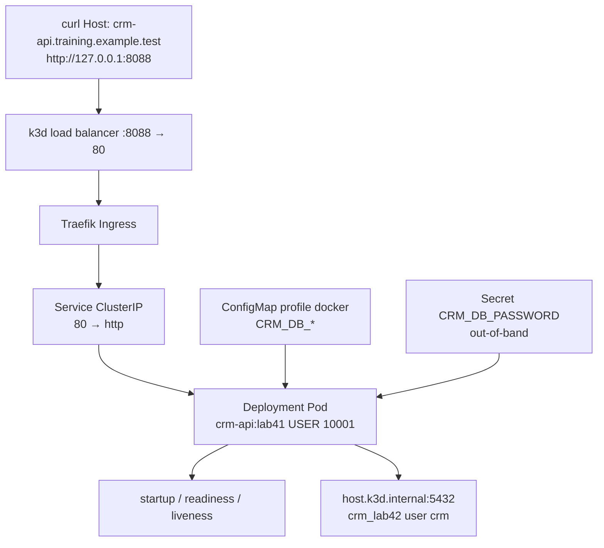

# Lab 42: Kubernetes (k3s) Deployment — Deployment, Service, ConfigMap, Ingress, Probes, Rollout

**Module:** 42 — Kubernetes (k3s) Deployment  
**Duration:** ~45 minutes (timed path with starter) · Full path: 4–5 Hours

**Primary IDE:** IntelliJ IDEA Community Edition · **Optional IDE:** VS Code

| OS | How-to for this lab |
| -- | ------------------- |
| Windows | [LAB-42-WINDOWS.md](LAB-42-WINDOWS.md) |
| macOS | [LAB-42-MACOS.md](LAB-42-MACOS.md) |

> **Two folders (do not mix):** [Clone the course repo · Commit in your own repo](../../../CLONE-AND-OWN-REPO-GUIDE.md). Read this GUIDE in the **course clone**. Write and run everything in **your** `java-bootcamp` repo.

---

## Activity card

| | |
| --- | --- |
| **Time** | ~45 min timed · full path 4–5 h |
| **Checkpoint** | **E** (after Ex 1→2→3→4→5→6) |
| **Must prove** | Dry-run manifests · three probes · Secret example empty · runbook apply/undo |
| **Hard gate** | Pre-lab Pass · Lab 41 image `crm-api:lab41` · no kubeconfig/Secret values in Git |

### What you will learn

Deploy CRM declaratively on local k3s (k3d) with safe probes, ConfigMap/Secret split, and verified rollback.

### Enterprise context

Platform DoD includes manifests, traffic-safe probes, and rollback evidence—not laptop `docker run` alone.

### Predict

Readiness failing while liveness OK — do users get traffic?

### Debug

ImagePullBackOff after apply — missing `k3d image import`, or a fake `@sha256:` pin?

---

## Two folders — every command below uses these paths

| Folder | Remote | You… |
| ------ | ------ | ---- |
| **Course clone** (handouts) | `bc-sw-engineer-java-participant` | **Read** this GUIDE / starter. **Never** commit homework here. |
| **Your repo** | private `java-bootcamp` | **Copy** starter YAML here, **apply** to local k3d, **commit**. |

| Item | Course clone (read) | Your `java-bootcamp` (write) |
| ---- | ------------------- | ---------------------------- |
| This GUIDE | `labs/…/module-42/lab42/LAB-42-GUIDE.md` | — |
| Starter manifests | `labs/…/module-42/lab42/starter/` | copied into `examples/lab42-crm/` |
| Graded k8s + runbook | — | `examples/lab42-crm/` |
| Pre-lab notes | — | `examples/module-42-exercises/notes/` |
| Screenshots | — | `notes/screenshots/lab-42/` (gitignored) |

IntelliJ stays on `java-bootcamp`. Keep the course clone in a browser tab or a second window.

**Lab 41 baseline (what you deploy):** image tag **`crm-api:lab41`**, UID **10001**, profile **`docker`** (`application-docker.yml` maps `CRM_DB_*`). HTTP smoke is **`GET /api/customers`**. There is **no** Spring Security and **no** `/api/v1/interactions`. PostgreSQL user from Lab 37 compose is **`crm` / `change-me`**, not `crm_app`. Point this lab at database **`crm_lab42`**. From a k3d **pod**, JDBC host is **`host.k3d.internal`** (host-published `5432`) — **not** `crm-postgres` (that name exists only on the Docker compose network) and **not** `postgres.training.svc.cluster.local`.

**Default cluster (verified local path):** create **k3d** `lab42` with k3s **`v1.28.15-k3s1`** and load balancer **`8088:80`**. There is no instructor kubeconfig for a shared IP in this course path. If a later cohort *does* get a shared cluster, the instructor will publish image pull coords and JDBC host — until then, use k3d.

**Image identity:** Lab 41 `RepoDigests` is empty until you push. Record **Image Id**. For k3d, import the **tag** `crm-api:lab41` and keep `imagePullPolicy: IfNotPresent`. Do **not** put `@sha256:REPLACE_WITH_LAB41_DIGEST` on the live Deployment.

---

## 45-minute timed path (use starter)

> **Pacing reminder:** [PACING.md](../PACING.md) checkpoint **E**. Homework: live apply + Host-header smoke + rollback evidence.

1. Open [`starter/README.md`](starter/README.md) **in the course clone**.
2. In **`java-bootcamp`**, copy `starter/` → `examples/lab42-crm`. Starter is YAML only — not a cluster and not a CRM.
3. Fill every `TODO` — do **not** work under `labs/`.
4. Dry-run from `examples/lab42-crm`; evidence under `notes/screenshots/lab-42/`.
5. Mark timed-path Pass criteria in the starter README. Continue remaining GUIDE steps as homework if needed.

| Path | Time | Scope |
| ---- | ---- | ----- |
| **Timed (default)** | ~45 min | Starter TODOs + dry-run + probe/Secret checklist |
| **Full (extended)** | see Duration | Every Step (k3d, import, apply, smoke, undo, peer) |

---

## What you'll submit (read this first)

All of these live under **`java-bootcamp`**, not the course clone.

| # | Deliverable | Where |
| - | ----------- | ----- |
| 1 | `k8s/configmap.yaml`, `deployment.yaml`, `service.yaml`, `ingress.yaml` | `examples/lab42-crm/k8s/` |
| 2 | Secret handling documented (`secret.example.yaml` without values — **never applied**) | same folder |
| 3 | Probe configuration with distinct startup / readiness / liveness | `deployment.yaml` |
| 4 | Rollout success evidence + rollback rehearsal evidence | `notes/screenshots/lab-42/` |
| 5 | CRM list smoke (`GET /api/customers`) via Ingress Host header | notes |
| 6 | `docs/deployment-runbook.md` | `examples/lab42-crm/docs/` |
| 7 | No kubeconfig, tokens, or Secret data in Git | `git status` on **your** repo |

**Do not submit:** `target/`, secrets, kubeconfig, or a verbatim instructor `solution/`.

---

## Lab Overview

This Module 42 lab deploys the Lab 41 CRM image **declaratively** on local k3s: Deployment, Service, ConfigMap, Secret references, resource requests/limits, distinct **startup / readiness / liveness** probes, **Traefik Ingress**, rollout observation, list-API smoke, and a practiced **rollback**.

## Learning Objectives

After completing this lab, you will be able to:

* Author valid Deployment, Service, ConfigMap, and Ingress manifests
* Separate non-secret config from Secret references
* Set realistic CPU/memory requests and limits
* Implement distinct startup, readiness, and liveness probes
* Expose the CRM through Service + Ingress (Host header on the k3d load balancer)

## Business Scenario

The Lab 41 container is ready for a cluster. Leadership freezes:

**No deploy without probes, resource bounds, non-root policy, and a rollback drill.**

You own that gate for the API that serves Amina (`CUS-1001`) and Ravi (`CUS-1002`).

| ID | Name | Notes |
| -- | ---- | ----- |
| `CUS-1001` | Amina Khan | `ACTIVE` — list-API smoke fixture |
| `CUS-1002` | Ravi Singh | `PROSPECT` — optional second smoke |
| `CUS-9999` | — | not-found vs error distinction |
| `lab-request-001` | — | correlation header |
| `lab42-001`, … | — | rollout experiment IDs |

**Security note.** Never paste `kubectl` login tokens, kubeconfig, or `kubectl get secret -o yaml` into Git or screenshots. Use synthetic customers only.

---

## Architecture Context
### NOW (this lab)


```mermaid
flowchart TB
  Curl["curl Host: crm-api.training.example.test<br/>http://127.0.0.1:8088"] --> LB["k3d load balancer :8088 → 80"]
  LB --> Ing["Traefik Ingress"]
  Ing --> Svc["Service ClusterIP<br/>80 → http"]
  Svc --> Pod["Deployment Pod<br/>crm-api:lab41 USER 10001"]
  Pod --> Ready["startup / readiness / liveness"]
  Cfg["ConfigMap profile docker<br/>CRM_DB_*"] --> Pod
  Sec["Secret CRM_DB_PASSWORD<br/>out-of-band"] --> Pod
  Pod --> Pg["host.k3d.internal:5432<br/>crm_lab42 user crm"]
```

## Prerequisites

Prior labs: [Lab 41](../../module-41/lab41/LAB-41-GUIDE.md) image **`crm-api:lab41`** already built (Image Id recorded). `crm-postgres` running from Lab 37 compose with port **5432** published on the host.

Confirm:

* Docker Engine (`docker version` shows a Server)
* `k3d` and `kubectl` on PATH (Windows often: `%USERPROFILE%\bin`)
* Lab 41 `docker image inspect crm-api:lab41` succeeds
* You will **not** Flyway-migrate `crm` / `crm_lab39` / `crm_lab40` / `crm_lab41`

### Pre-flight

```bash
docker version
k3d version
kubectl version --client
docker image inspect crm-api:lab41 --format "{{.Id}} {{json .Config.User}}"
```

Working directory for every later command unless noted:

```text
~/java-bootcamp/examples/lab42-crm
# Windows: %USERPROFILE%\java-bootcamp\examples\lab42-crm
```

## Worked example (read before you code)

Local k3d + imported image + Host-header smoke. Secret is created with `kubectl create`, not by applying `secret.example.yaml`.

```bash
# cluster (pin k3s — default latest can fail cgroup v1 on Docker Desktop)
k3d cluster create lab42 --image rancher/k3s:v1.28.15-k3s1 -p "8088:80@loadbalancer"
k3d image import crm-api:lab41 -c lab42

kubectl -n crm-training apply -f k8s/configmap.yaml
kubectl -n crm-training apply -f k8s/deployment.yaml -f k8s/service.yaml -f k8s/ingress.yaml
kubectl -n crm-training rollout status deployment/crm-api --timeout=180s

curl -fsS -H "Host: crm-api.training.example.test" \
  http://127.0.0.1:8088/actuator/health/readiness
curl -fsS -H "Host: crm-api.training.example.test" \
  -H "X-Correlation-Id: lab-request-001" \
  "http://127.0.0.1:8088/api/customers?status=ACTIVE"
```

**What to notice:** `crm-api.training.example.test` does **not** need a hosts-file entry. Send the name as an HTTP **Host** header to **localhost:8088**. Profile must be **`docker`** so Lab 41 `application-docker.yml` maps `CRM_DB_*` and enables actuator probes.

---

## Implementation Steps

Complete each step in order. **Write** under `java-bootcamp`. **Read** starter files from the course clone. Use `-n crm-training` on every `kubectl` that talks to the cluster.

---

### Step 1 — Copy starter into your repo, create k3d, import the Lab 41 image

**Why:** Graded work belongs in `java-bootcamp`. The course `starter/` is YAML, not a cluster. Half of failed labs are wrong context or ImagePullBackOff because the image never landed in k3d.

**Where:** IntelliJ Terminal in **`java-bootcamp`**. Starter copy source is the **course clone**.

**Do this:**

**Windows (PowerShell):**

```powershell
$jb = "$env:USERPROFILE\java-bootcamp"
$courseLab42 = "$env:USERPROFILE\bc-sw-engineer-java-participant\labs\Week 5 - DevOps, CI-CD and OpenShift\module-42\lab42"
$env:Path = "$env:USERPROFILE\bin;" + $env:Path

New-Item -ItemType Directory -Force -Path "$jb\examples\lab42-crm","$jb\notes\screenshots\lab-42" | Out-Null
Copy-Item -Recurse -Force "$courseLab42\starter\*" "$jb\examples\lab42-crm\"
Set-Location "$jb\examples\lab42-crm"

docker exec -e PGPASSWORD=change-me crm-postgres psql -U crm -d postgres -c "CREATE DATABASE crm_lab42;"

k3d cluster create lab42 --image rancher/k3s:v1.28.15-k3s1 -p "8088:80@loadbalancer"
# If the cluster already exists, skip create and continue.

$kc = "$env:USERPROFILE\.config\k3d\kubeconfig-lab42.yaml"
(Get-Content $kc) -replace 'host.docker.internal','127.0.0.1' | Set-Content $kc
$env:KUBECONFIG = $kc

kubectl create namespace crm-training --dry-run=client -o yaml | kubectl apply -f -
kubectl config current-context
kubectl -n crm-training get sa

k3d image import crm-api:lab41 -c lab42
```

**macOS / Linux:**

```bash
JB=~/java-bootcamp
COURSE_LAB42=~/bc-sw-engineer-java-participant/labs/Week\ 5\ -\ DevOps,\ CI-CD\ and\ OpenShift/module-42/lab42

mkdir -p "$JB/examples/lab42-crm" "$JB/notes/screenshots/lab-42"
cp -R "$COURSE_LAB42/starter/." "$JB/examples/lab42-crm/"
cd "$JB/examples/lab42-crm"

docker exec -e PGPASSWORD=change-me crm-postgres psql -U crm -d postgres -c "CREATE DATABASE crm_lab42;"

k3d cluster create lab42 --image rancher/k3s:v1.28.15-k3s1 -p "8088:80@loadbalancer"

KC="${HOME}/.config/k3d/kubeconfig-lab42.yaml"
# If server: still uses host.docker.internal, rewrite to 127.0.0.1 (Docker Desktop).
sed -i.bak 's/host.docker.internal/127.0.0.1/g' "$KC"
export KUBECONFIG="$KC"

kubectl create namespace crm-training --dry-run=client -o yaml | kubectl apply -f -
kubectl config current-context
kubectl -n crm-training get sa

k3d image import crm-api:lab41 -c lab42
```

If `k3d cluster create` says the name already exists, that is fine — import the image and continue.

**Expected result:** `lab42-crm` exists in **your** repo; `crm_lab42` created; k3d context works; image imported; you are not editing files under `labs/`.

**If it fails:** Copied into the course clone → start over in `java-bootcamp`. No `crm-api:lab41` → finish Lab 41 first. kubelet **cgroup v1 unsupported** → you used default k3s; pin **`rancher/k3s:v1.28.15-k3s1`**. kubectl times out on a LAN IP → rewrite kubeconfig `server:` to **`https://127.0.0.1:<mapped-port>`**.

---

### Step 2 — Create ConfigMap and Secret references

**Why:** Mixing passwords into ConfigMaps is a Lab 40-class finding. Lab 41 only maps `CRM_DB_*` when profile **`docker`** is active.

**Where:** `java-bootcamp/examples/lab42-crm/k8s/configmap.yaml`

**Do this:** Fill non-secret keys (starter TODOs):

```yaml
apiVersion: v1
kind: ConfigMap
metadata:
  name: crm-api-config
  labels:
    app: crm-api
data:
  SPRING_PROFILES_ACTIVE: "docker"
  SERVER_PORT: "8080"
  CRM_DB_HOST: "host.k3d.internal"
  CRM_DB_PORT: "5432"
  CRM_DB_NAME: "crm_lab42"
  CRM_DB_USER: "crm"
```

Do **not** set `SPRING_PROFILES_ACTIVE: k8s` or `kubernetes` — the Lab 41 image has **`application-docker.yml`**, not `application-k8s.yml`. Without `docker`, probes 404 and JDBC stays on `localhost`.

Create the Secret **out of band** (never apply `k8s/secret.example.yaml`):

```bash
kubectl -n crm-training create secret generic crm-api-secrets \
  --from-literal=CRM_DB_PASSWORD='change-me' \
  --dry-run=client -o yaml | kubectl apply -f -
```

Commit `secret.example.yaml` with keys listed and **no real password**. Document rotation ownership in the runbook.

**Expected result:** ConfigMap in Git; Secret exists in cluster only; example file has no real password.

**If it fails:** Password committed → remove, rotate, ask instructor before rewriting Git history. `kubectl apply -f k8s/` applied the example file → delete that Secret and recreate out-of-band with `change-me`.

---

### Step 3 — Define the Deployment (labels, image, env)

**Why:** Selector mismatches yield Services with no Endpoints—the classic silent break.

**Do this:** `k8s/deployment.yaml` core (fill starter TODOs):

```yaml
apiVersion: apps/v1
kind: Deployment
metadata:
  name: crm-api
  labels:
    app: crm-api
spec:
  replicas: 1
  selector:
    matchLabels:
      app: crm-api
  template:
    metadata:
      labels:
        app: crm-api
    spec:
      securityContext:
        runAsNonRoot: true
        runAsUser: 10001
      containers:
        - name: crm-api
          image: crm-api:lab41
          imagePullPolicy: IfNotPresent
          ports:
            - name: http
              containerPort: 8080
          envFrom:
            - configMapRef:
                name: crm-api-config
            - secretRef:
                name: crm-api-secrets
```

Record Lab 41 **Image Id** in the runbook. Do not invent a registry digest for a never-pushed local image.

**Expected result:** Valid Deployment YAML; labels match selector; envFrom references exist; image is the imported tag.

**If it fails:** Schema validation → fix apiVersion/fields. Wrong secret name → CreateContainerConfigError.

---

### Step 4 — Set resources and container security context

**Why:** Unbounded pods starve neighbors; privileged pods expand blast radius. k3s PSA often requires an explicit UID.

**Do this:** Under the container (starter already has requests/limits — confirm UID):

```yaml
resources:
  requests:
    cpu: 100m
    memory: 256Mi
  limits:
    cpu: 500m
    memory: 512Mi
securityContext:
  allowPrivilegeEscalation: false
  readOnlyRootFilesystem: false
  runAsNonRoot: true
  runAsUser: 10001
```

Align with Lab 41 UID **10001**. Leave `readOnlyRootFilesystem: false` unless you also mount `emptyDir` at `/tmp` (Spring Boot writes temp files).

**Expected result:** Requests/limits present; non-root UID 10001; no privileged flag.

**If it fails:** PSA denial → set `runAsUser: 10001` at **pod and** container — do not request privileged.

---

### Step 5 — Configure startup, readiness, and liveness probes

**Why:** One probe for everything causes restart storms under load or cut traffic during boot.

**Do this:** Uncomment / fill **three** probes. Startup uses **readiness** so Flyway can finish; liveness stays on **liveness** so a DB blip does not restart the JVM:

```yaml
startupProbe:
  httpGet:
    path: /actuator/health/readiness
    port: http
  failureThreshold: 30
  periodSeconds: 5
readinessProbe:
  httpGet:
    path: /actuator/health/readiness
    port: http
  periodSeconds: 10
livenessProbe:
  httpGet:
    path: /actuator/health/liveness
    port: http
  periodSeconds: 20
```

Do **not** point **liveness** at readiness. Timed path requires all three probe types present.

**Expected result:** Three distinct probes; startup covers slow init; readiness gates traffic; liveness reserved for a wedged process.

**If it fails:** CrashLoop from aggressive liveness → lengthen startup; confirm profile `docker` so `/actuator/health/*` exists.

---

### Step 6 — Create Service and Ingress

**Why:** ClusterIP alone is not laptop-reachable; Traefik needs a host rule plus the k3d load-balancer port.

**Do this:** `k8s/service.yaml` selector `app: crm-api`, port 80 → `targetPort: http`.

`k8s/ingress.yaml` (k3s Traefik defaults):

```yaml
apiVersion: networking.k8s.io/v1
kind: Ingress
metadata:
  name: crm-api
  annotations:
    traefik.ingress.kubernetes.io/router.entrypoints: web
spec:
  ingressClassName: traefik
  rules:
    - host: crm-api.training.example.test
      http:
        paths:
          - path: /
            pathType: Prefix
            backend:
              service:
                name: crm-api
                port:
                  number: 80
```

This lab grades **Ingress**, not OpenShift Route. Do not author `route.yaml` unless the instructor switches the cohort to OpenShift.

**Expected result:** Service selects pods; Ingress host is `crm-api.training.example.test`; class `traefik`.

**If it fails:** No endpoints → label mismatch. Ingress ignored → missing `ingressClassName: traefik`.

---

### Step 7 — Deploy, observe, and fix from evidence

**Why:** `apply` without `rollout status` and events misses ImagePull/probe failures. Applying the whole `k8s/` folder installs the fake Secret.

**Do this:**

```bash
cd ~/java-bootcamp/examples/lab42-crm
# Windows: cd $env:USERPROFILE\java-bootcamp\examples\lab42-crm

kubectl -n crm-training apply -f k8s/configmap.yaml
# Secret already created out-of-band in Step 2 — do not apply secret.example.yaml
kubectl -n crm-training apply -f k8s/deployment.yaml -f k8s/service.yaml -f k8s/ingress.yaml
kubectl -n crm-training rollout status deployment/crm-api --timeout=180s
kubectl -n crm-training get pods,svc,endpoints,ingress -l app=crm-api
kubectl -n crm-training describe deployment crm-api
kubectl -n crm-training logs deployment/crm-api --tail=100
kubectl -n crm-training get events --sort-by=.lastTimestamp
```

Correct selector, pull, resource, and probe failures using those signals—not random sleeps.

**Expected result:** Rollout successful; Endpoints populated; pods Ready; logs free of secrets.

**If it fails:** See Troubleshooting. Capture `describe` / events excerpts (sanitized).

---

### Step 8 — Smoke test with CRM list API

**Why:** Ready pods that 404 on a made-up interactions URL are not done. Lab 41 smoke is the list API.

**Do this:** Use the k3d load balancer and a **Host** header. Do not curl `http://crm-api.training.example.test` unless you added a hosts-file entry (not required).

```bash
curl -fsS -H "Host: crm-api.training.example.test" \
  http://127.0.0.1:8088/actuator/health/readiness
curl -fsS -H "Host: crm-api.training.example.test" \
  -H "X-Correlation-Id: lab-request-001" \
  "http://127.0.0.1:8088/api/customers?status=ACTIVE"
```

(Windows: `curl.exe`.) A **200** list (possibly empty) is a valid smoke. Optionally seed `CUS-1001` with `psql` against `crm_lab42` if you want a named row.

There is **no** `POST /api/v1/interactions` and **no** Basic `admin:change-me`.

**Expected result:** Readiness `UP`; list endpoint 200; correlation header usable in notes.

**If it fails:** Connection refused on 8088 → k3d port map `8088:80@loadbalancer`. 404 Host → Ingress host / Traefik class. 503 readiness → `CRM_DB_HOST=host.k3d.internal`, db `crm_lab42`, user `crm`, profile `docker`. Health 404 → profile not `docker`.

---

### Step 9 — Rollout drill, rollback, and runbook

**Why:** Rollback unrehearsed is fiction.

**Do this:** In this local cluster only, set a bad image tag; observe `ErrImagePull` / failed rollout; then undo:

```bash
kubectl -n crm-training set image deployment/crm-api crm-api=crm-api:does-not-exist
kubectl -n crm-training rollout status deployment/crm-api --timeout=60s || true
kubectl -n crm-training rollout history deployment/crm-api
kubectl -n crm-training rollout undo deployment/crm-api
kubectl -n crm-training rollout status deployment/crm-api --timeout=180s
```

Re-run the Step 8 curls. Write `docs/deployment-runbook.md` with apply order (listed files, not `k8s/`), Host-header smoke, rollback commands, residual risks. Complete Failure Experiments.

**Expected result:** History shows revisions; undo restores known-good; runbook peer-complete; Git clean of secrets.

**If it fails:** Undo no-op → you never created a second revision; `set image` first.

---

### Step 10 — Two-replica behavior

**Why:** CRM APIs must remain correct when more than one pod serves traffic.

**Do this:** Default manifests use `replicas: 1`. Scale up temporarily:

```bash
kubectl -n crm-training scale deployment/crm-api --replicas=2
kubectl -n crm-training get pods -l app=crm-api -o wide
```

Send several Step 8 list requests. Confirm both pods appear in Endpoints. Optional: delete one pod and watch the Service keep serving.

Leave default at `replicas: 1` unless the instructor asks otherwise (`kubectl scale --replicas=1` when done).

**Expected result:** After scale, ≥2 Ready pods; Endpoints list both; list smoke still 200.

**If it fails:** Only one pod scheduled → laptop resource pressure; note it and scale back to 1.

---

### Step 11 — Peer apply from runbook

**Why:** Manifests without operable docs fail the operator bar.

**Where:** Peer clones **your** `java-bootcamp`, not the course handouts.

**Do this:** Follow **only** `docs/deployment-runbook.md` to apply (listed files), curl readiness via Host header, and run `rollout history`. Patch missing image import, Secret, namespace, or kubeconfig rewrite steps.

**Expected result:** Peer reaches readiness without extra chat; evidence of a second successful apply path.

**If it fails:** Missing Secret / `k3d image import` / Host header → fix the runbook immediately.

---

## Implementation Checkpoints

### Checkpoint A — Access and config

| # | Confirm | Your notes |
| - | ------- | ---------- |
| 1 | Work is in `java-bootcamp/examples/lab42-crm` (not the course clone) | Pass / Fail |
| 2 | k3d `lab42` context works; namespace `crm-training`; image imported | Pass / Fail |
| 3 | ConfigMap in Git (profile `docker`, `crm_lab42`, `host.k3d.internal`, user `crm`); Secret only in cluster | Pass / Fail |

### Checkpoint B — Workload manifests

| # | Confirm | Your notes |
| - | ------- | ---------- |
| 1 | Deployment labels/selectors aligned; image `crm-api:lab41` (no fake digest) | Pass / Fail |
| 2 | Resources + `runAsUser: 10001` | Pass / Fail |
| 3 | Startup, readiness, liveness all present (startup on readiness path) | Pass / Fail |

### Checkpoint C — Exposure and proof

| # | Confirm | Your notes |
| - | ------- | ---------- |
| 1 | Service Endpoints populated | Pass / Fail |
| 2 | Ingress reachable via Host header on `127.0.0.1:8088` | Pass / Fail |
| 3 | `GET /api/customers` 200 + correlation header | Pass / Fail |

### Checkpoint D — Operations hygiene

| # | Confirm | Your notes |
| - | ------- | ---------- |
| 1 | Rollout undo rehearsed and verified | Pass / Fail |
| 2 | `deployment-runbook.md` lists files (not `apply -f k8s/`) | Pass / Fail |
| 3 | No kubeconfig/Secret data in Git; `secret.example.yaml` never applied | Pass / Fail |
| 4 | Peer apply from runbook succeeded (or gaps fixed) | Pass / Fail |
| 5 | Pushes went to **your** `java-bootcamp` remote | Pass / Fail |

---

## Safety Rules (restate before applying)

* Work only against local k3d / authorized training hosts.
* Never commit kubeconfig, tokens, or Secret values.
* Never `kubectl apply -f k8s/` while `secret.example.yaml` lives in that folder.
* Keep CRM smoke synthetic (`CUS-1001` / `CUS-1002` only).
* Do not Flyway-migrate shared Lab 39–41 databases.
* Pin k3s **`v1.28.15-k3s1`** on Docker Desktop that rejects cgroup v1.

---

## Reference Commands, Configuration, and Code

### Apply and smoke (from `java-bootcamp/examples/lab42-crm`)

```bash
kubectl -n crm-training apply -f k8s/configmap.yaml
kubectl -n crm-training apply -f k8s/deployment.yaml -f k8s/service.yaml -f k8s/ingress.yaml
kubectl -n crm-training rollout status deployment/crm-api --timeout=180s
curl -fsS -H "Host: crm-api.training.example.test" \
  http://127.0.0.1:8088/actuator/health/readiness
curl -fsS -H "Host: crm-api.training.example.test" \
  -H "X-Correlation-Id: lab-request-001" \
  "http://127.0.0.1:8088/api/customers?status=ACTIVE"
kubectl -n crm-training rollout history deployment/crm-api
kubectl -n crm-training rollout undo deployment/crm-api
```

### Dry-run (schema only — still skip applying the example Secret live)

```bash
kubectl apply --dry-run=client -n crm-training \
  -f k8s/configmap.yaml -f k8s/deployment.yaml -f k8s/service.yaml -f k8s/ingress.yaml
```

## Failure Experiments

| # | Experiment | Observe | Restore |
| - | ---------- | ------- | ------- |
| 1 | Break Service selector labels | Empty Endpoints | Fix labels |
| 2 | Point liveness at readiness | Restart risk on DB blip | Separate probes |
| 3 | `set image …:does-not-exist` | ErrImagePull; rollout fail | `rollout undo` |
| 4 | Put password in ConfigMap | Document why forbidden | Move to Secret; rotate |
| 5 | Scale to 0 then back | Outage then recovery | `replicas: 1` |
| 6 | `kubectl apply -f k8s/` | Fake password `REPLACE-OUT-OF-BAND` | Delete Secret; recreate out-of-band |

---

## Troubleshooting

| Symptom | Likely cause | Fix |
| ------- | ------------ | --- |
| kubelet cgroup v1 unsupported | Default k3s (e.g. v1.35) | Pin `rancher/k3s:v1.28.15-k3s1` |
| kubectl timeout / LAN IP | kubeconfig `host.docker.internal` | Rewrite `server:` to `127.0.0.1` |
| ImagePullBackOff | Image not in k3d, or fake `@sha256:` | `k3d image import crm-api:lab41 -c lab42`; tag only |
| CreateContainerConfigError | Missing Secret | Create out-of-band; do not apply the example file |
| CrashLoop / probe 404 | Profile `k8s` | `SPRING_PROFILES_ACTIVE=docker` |
| 0/1 Ready / JDBC localhost | docker profile not loaded, or wrong host | ConfigMap host `host.k3d.internal`, db `crm_lab42`, user `crm` |
| Password authentication failed | User `crm_app` | Compose user is **`crm`** |
| Migrated the wrong database | `CRM_DB_NAME=crm` | Use **`crm_lab42`** |
| No Endpoints | Selector mismatch | Align `app: crm-api` |
| curl host DNS fail | Curling the Ingress hostname | Host header + `http://127.0.0.1:8088` |
| 404 on `/api/v1/interactions` | Wrong API | **`GET /api/customers`** |
| Health 401 / Basic admin | Expected old CRM | Lab 41 has **no** Spring Security |
| Forbidden PSA | No numeric UID | `runAsUser: 10001` |
| Undo no-op | Single revision | `set image` first |
| Accidental work in course clone | Wrong folder | Move to `java-bootcamp` |

## Evidence Log Template

```markdown
# Lab 42 Evidence Log
- Repo (must be java-bootcamp):
- k3d cluster / k3s image pin:
- Lab 41 Image Id:
- ConfigMap profile / JDBC host / db / user:
- Readiness curl (Host header):
- GET /api/customers result:
- Rollback undo observation:
- Runbook peer-tested: Y/N
```

---

## Cleanup

Capture evidence first. Delete **only** resources you created.

```bash
kubectl -n crm-training delete -f k8s/ingress.yaml -f k8s/service.yaml \
  -f k8s/deployment.yaml -f k8s/configmap.yaml --ignore-not-found
kubectl -n crm-training delete secret crm-api-secrets --ignore-not-found
# Optional: k3d cluster delete lab42
cd ~/java-bootcamp/examples/lab42-crm
git status --short
```

Do not delete `crm-postgres` or Lab 37 volumes. Remove plaintext password files from shared disks.

**Keep `lab42-crm` manifests** in `java-bootcamp` — Labs 43–44 reuse this deploy story.

---

## Reflection Questions

Write **1–3 sentence** answers (not essays):

1. Which design decision most affected traffic safety (which probe)?
2. What evidence proves rollback worked?
3. Which failure was hardest to diagnose from events/logs (pull vs probes vs JDBC)?

---
