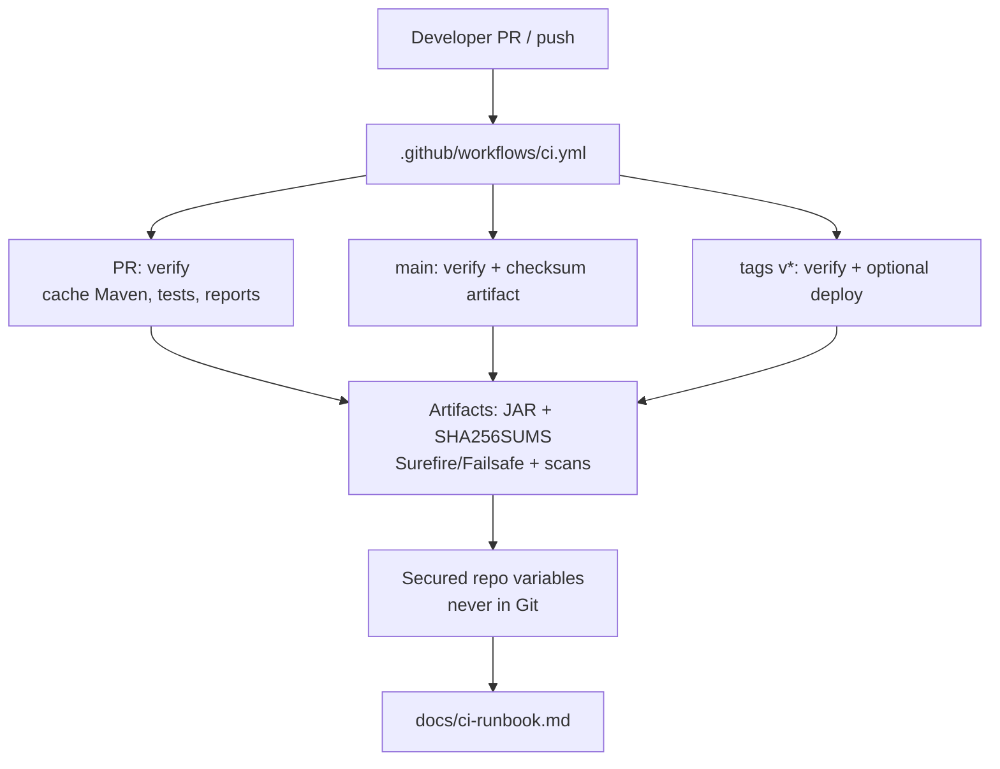
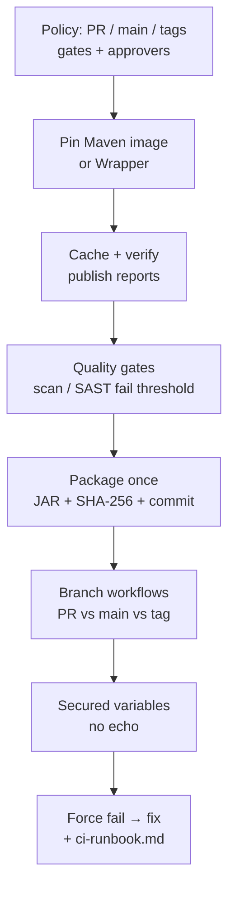

# Lab 43: GitHub CI/CD Pipeline for the CRM — Northstar Delivery Gates

**Module:** 43 — GitHub CI/CD Pipeline for the CRM  
**Lab folder:** `labs/Week 5 - DevOps, CI-CD and OpenShift/module-43/lab43/`  
**Difficulty:** Intermediate  
**Duration:** 3–4 Hours

**Primary IDE:** IntelliJ IDEA Community Edition · **Optional IDE:** VS Code

| OS | How-to for this lab |
| -- | ------------------- |
| Windows | [LAB-43-WINDOWS.md](LAB-43-WINDOWS.md) |
| macOS | [LAB-43-MACOS.md](LAB-43-MACOS.md) |

> **Environment reminder:** Finish [Lab 0](../../../Week%201%20-%20Java%20and%20JVM%20Foundations/module-00/lab0/LAB-0-GUIDE.md). Use **IntelliJ IDEA Community** (primary; optional VS Code) on your laptop with **JDK 21**, **Maven 3.9+**, and a **GitHub** repo with **Actions** enabled. Work under `~/java-bootcamp` (Windows: `%USERPROFILE%\java-bootcamp`).

---

## How to follow this lab

1. Open the **Windows** or **macOS** how-to (links above) in a second tab.
2. Create/work only under your `java-bootcamp/examples/…` folder from the steps (not inside this `labs/` git clone unless a step says otherwise).
3. For each **Step N**: read **Why** (if present) → do the actions → confirm **Expected** / **Expected result** → then continue.
4. When stuck, use **Failure Experiments** / troubleshooting in this guide before asking for help.
5. Capture evidence under `notes/screenshots/lab-43/` (workspace root under `java-bootcamp`; redact secrets). Use the **Pass criteria** tables — write **Pass** or **Fail** in your notes. GitHub file view does not support clickable checkboxes.

## Lab Overview

This Module 43 lab gives the **Customer Management Platform** a reviewable **GitHub Actions** workflow: verify, scan, package once, protect secrets, and document how peers re-run CI. You will produce `.github/workflows/ci.yml`, publish Surefire/Failsafe (and scan) reports, pass an immutable JAR + SHA-256 between isolated steps, and write `docs/ci-runbook.md`.

**Purpose.** Leadership freezes a delivery rule: pull requests get fast feedback; `main` and version tags get stronger gates; deployment credentials never live in Git; the JAR verified in CI is the JAR promoted later—not a silently rebuilt binary. A green demo without evidence is not enough.

**What you build (exercise).** Copy or branch into `lab43-crm`; define pipeline policy for PR / main / tags; pin Maven image or Wrapper; cache `~/.m2`; run `clean verify` without skipping tests; add quality gates (dependency scan / available SAST); package once with checksum and commit identity; configure branch behavior and secured variables; force one safe test failure, restore, and document the runbook.

**What success looks like.** Under `~/java-bootcamp/examples/lab43-crm/` a peer can open `.github/workflows/ci.yml` + `docs/ci-runbook.md`, understand which steps deploy, where secrets live, how to re-run a failed verify step, and locate a JAR checksum tied to a commit—using fixtures `CUS-1001` / `CUS-1002` / correlation `lab-request-001` only as synthetic CRM identity in any smoke evidence.

**Depends on Labs 41–42 (and prior CRM).** Need a CRM module that compiles and tests under Maven. GitHub account/repository with Actions; Docker available for pipeline/agent steps as instructed. Finish inherited build failures before claiming CI credit.

**CRM connection.** Fixtures `CUS-1001` (Amina Khan) / `CUS-1002` (Ravi Singh) / correlation `lab-request-001` may appear in integration-test or smoke evidence only as fictional IDs—never real customer data. Lab 44 promotes the **same** immutable artifact identity you freeze here.

---

## Reference GitHub Actions workflow

```yaml
# .github/workflows/ci.yml
name: CRM CI
on:
  pull_request:
  push:
    branches: [main]
    tags: ["v*"]
jobs:
  verify:
    runs-on: ubuntu-latest
    steps:
      - uses: actions/checkout@v4
      - uses: actions/setup-java@v4
        with:
          distribution: temurin
          java-version: "21"
          cache: maven
      - name: Verify
        run: ./mvnw -B clean verify
      - name: Upload reports
        if: always()
        uses: actions/upload-artifact@v4
        with:
          name: test-reports
          path: "**/target/surefire-reports/**"
  package:
    needs: verify
    if: github.ref == 'refs/heads/main' || startsWith(github.ref, 'refs/tags/')
    runs-on: ubuntu-latest
    steps:
      - uses: actions/checkout@v4
      - uses: actions/setup-java@v4
        with:
          distribution: temurin
          java-version: "21"
          cache: maven
      - name: Package once
        run: |
          ./mvnw -B -DskipTests package
          sha256sum target/*.jar > target/SHA256SUMS
          echo "commit=${GITHUB_SHA}" >> target/SHA256SUMS
      - uses: actions/upload-artifact@v4
        with:
          name: crm-jar
          path: |
            target/*.jar
            target/SHA256SUMS
```

## Learning Objectives

After completing this lab, you will be able to:

* Model CI stages and gates for PR, `main`, and version tags
* Configure Maven dependency caching in GitHub Actions
* Publish Surefire, Failsafe, and security-scan reports as artifacts
* Use branch and pull-request pipelines with distinct rigor
* Pass immutable artifacts (JAR + checksum + commit) between isolated steps
* Protect deployment and registry variables as secured, scoped secrets
* Force a safe pipeline failure, interpret evidence, and document rerun policy
* Write a peer-usable `docs/ci-runbook.md` for the CRM delivery path

---

## Business Scenario

Pull requests need fast feedback while `main` and release tags require stronger gates. Build output must be traceable and passed between isolated steps—otherwise staging and production silently diverge (“it passed CI” vs “we rebuilt on the deploy agent”).

Before week’s end, CD (Lab 44) will promote one digest through staging and production. You own the CI contract for Labs 41–43 behavior: verify the CRM backend that serves Amina (`CUS-1001`) and Ravi (`CUS-1002`), keep credentials out of Git, and leave evidence an on-call engineer can trust.

Use these examples consistently:

| ID | Name | Notes |
| -- | ---- | ----- |
| `CUS-1001` | Amina Khan | `ACTIVE` — synthetic CRM fixture in tests/smoke only |
| `CUS-1002` | Ravi Singh | `PROSPECT` — synthetic CRM fixture in tests/smoke only |
| `lab-request-001` | — | correlation on API or pipeline evidence labels |
| `GITHUB_SHA` | — | commit identity recorded with the JAR checksum |

**Security note for evidence.** Use fictional emails only. Never paste secured variable values, `.env`, kubeconfig, or registry tokens into screenshots or `docs/`. Redact pipeline log excerpts that echo credentials.

---

## Architecture Context

### NOW (this lab)



### Lab flow (mermaid)



### Architecture NOW vs LATER

| Aspect | Lab 43 (NOW) | Lab 44 / production CD |
| ------ | ------------ | ---------------------- |
| Scope | Build, test, scan, package, secret hygiene | Promote same digest test → staging → prod |
| Artifact | JAR + SHA-256 + commit in pipeline artifacts | Image digest / manifest; no rebuild on promote |
| Deploy | Manual/tag step sketch only (optional) | Formal release plan, gates, rollback runbook |
| AI | Optional YAML draft + human review | Same discipline for release docs |

**Lab focus:** GitHub Actions for CRM CI—gates, cache, secrets, immutable package, `ci-runbook.md`.

---

## Prerequisites

Complete [SETUP](../../../SETUP-INSTRUCTIONS.md), [Lab 0](../../../Week%201%20-%20Java%20and%20JVM%20Foundations/module-00/lab0/LAB-0-GUIDE.md), and preferably Labs [41](../../module-41/lab41/LAB-41-GUIDE.md)–[42](../../module-42/lab42/LAB-42-GUIDE.md). Confirm:

* JDK 21; Maven or Maven Wrapper; Git
* GitHub account/repository with Actions enabled
* Docker available for pipeline/agent steps as instructor directs
* CRM module that already passes `mvn clean verify` (or `./mvnw`) locally
* No secrets committed to Git

### Pre-flight

```bash
java -version
./mvnw --version 2>/dev/null || mvn -version
docker --version
git --version
pwd
ls ~/java-bootcamp/examples
```

If Actions will use a Maven image, note the image tag you will pin. Record GitHub organization or repository/repo names in notes (not secrets).

---

## Suggested Project Files

Primary training layout (prefer this):

```text
~/java-bootcamp/examples/lab43-crm/
├── .github/workflows/ci.yml
├── src/main/java/com/northstar/crm/...
├── src/test/java/com/northstar/crm/...
├── scripts/
│   └── deploy.sh                 (stub or lab-safe deploy; no embedded secrets)
├── docs/
│   └── ci-runbook.md
├── notes/screenshots/            (sanitized pipeline + report excerpts)
├── pom.xml                       (or Maven Wrapper)
├── .gitignore
└── README.md
```

Platform / monorepo secondary paths (adapt if your cohort uses the larger CRM layout):

```text
~/java-bootcamp/examples/customer-management-platform/
├── backend/
├── .github/workflows/ci.yml
├── docs/ci-runbook.md
└── reports/                      (sanitized generated evidence)
```

Ignore `target/`, IDE metadata, `.env`, tokens, passwords, and raw pipeline logs that contain secrets.

---

## Concepts to Discuss

Write 2–3 sentences each in `docs/ci-runbook.md` (or a short concepts section):

1. Main CI flow for the CRM (commit → verify → artifact → optional tag deploy)
2. Trust boundary: what Actions proves vs what it assumes about GitHub runners and caches
3. Success/failure contracts (verify red, scan threshold, missing artifact)
4. Stable fixtures (`CUS-1001`) in tests vs random CI data that breaks flakes
5. Idempotency of re-running a verify step on the same commit
6. Why PR gates differ from `main` / tag gates
7. Evidence operators need (Surefire, checksum, commit SHA)
8. Two machines / two workflow runs: same YAML, same image pin, same gate
9. False confidence: green pipeline that skipped tests or rebuilt on deploy
10. What Lab 44 will change (promotion of this artifact) without changing fixture IDs

---

## Implementation Steps

Complete each step in order. Commands assume `~/java-bootcamp/examples/lab43-crm` (Windows: `%USERPROFILE%\java-bootcamp\examples\lab43-crm`) unless noted. Map of legacy Parts → steps: Part 1→Step 1 … Part 8→Step 8; Step 9 closes failure experiments.

---

### Step 1 — Define pipeline policy (Part 1)

**Why:** Without an explicit policy, teams invent different gates per branch and cannot explain who may deploy.

**Do this:** In `docs/ci-runbook.md`, list checks for commits, pull requests, `main`, and tags. Identify which steps may deploy and who may approve. Define failure, retry, and evidence-retention rules (keep Surefire even when verify fails if your steps allow).

Create the working copy:

```bash
cd ~/java-bootcamp/examples
# Prefer branching from your latest green CRM tree (e.g. lab42-crm)
cp -r lab42-crm lab43-crm 2>/dev/null || cp -r lab41-crm lab43-crm
cd lab43-crm
mkdir -p docs
mkdir -p ~/java-bootcamp/notes/screenshots/lab-43 scripts
git switch -c lab/43-crm 2>/dev/null || true
```

**Expected result:** Written policy covering PR / main / tags; deploy authority named; retention rules stated.

**If it fails:** Policy that says “always deploy from PR” → reject; keep deploy on manual tag or controlled `main` only as instructor allows.

---

### Step 2 — Prepare reproducible commands (Part 2)

**Why:** Local and pipeline JDK/Maven drift is the classic “works on my laptop” failure mode.

**Do this:** Prefer Maven Wrapper **or** a pinned Maven image (`maven:3.9-eclipse-temurin-21` or instructor pin). Run clean verify without `-DskipTests`. Capture Java and Maven versions in logs (and paste sanitized excerpts into notes).

```bash
cd ~/java-bootcamp/examples/lab43-crm
java -version
./mvnw --version 2>/dev/null || mvn -version
./mvnw -B -ntp clean verify
```

**Expected result:** Local `BUILD SUCCESS`; versions recorded; no skipped tests for the default verify path.

**If it fails:** Baseline red → fix CRM tests first; do not “green” CI by skipping tests.

---

### Step 3 — Create verification step with Maven cache (Part 3)

**Why:** Cold Maven downloads waste minutes and encourage developers to push incomplete local builds.

**Do this:** Author `.github/workflows/ci.yml` with verify job, Maven cache via `actions/setup-java`, and report artifacts. Example:

```yaml
# .github/workflows/ci.yml
name: CRM CI
on:
  pull_request:
  push:
    branches: [main]
    tags: ["v*"]

jobs:
  verify:
    runs-on: ubuntu-latest
    steps:
      - uses: actions/checkout@v4
      - uses: actions/setup-java@v4
        with:
          distribution: temurin
          java-version: "21"
          cache: maven
      - name: Verify CRM backend
        run: ./mvnw -B -ntp clean verify
      - name: Upload test reports
        if: always()
        uses: actions/upload-artifact@v4
        with:
          name: test-reports
          path: |
            **/target/surefire-reports/**
            **/target/failsafe-reports/**
```

**Expected result:** PR pipeline runs verify; cache declared; Surefire/Failsafe paths listed as artifacts.

**If it fails:** Wrong working directory for multi-module → `cd backend` (or your module) before `mvn`. Empty `target/*.jar` → match your packaging layout.

---

### Step 4 — Add quality gates (Part 4)

**Why:** Compile-only green builds miss vulnerable dependencies; reports must survive a failed gate for triage.

**Do this:** Add a dependency-scan and/or available SAST step (Maven profile, OWASP Dependency-Check, or instructor-provided scanner). Fail at the agreed threshold. Preserve reports even when the gate fails (separate artifact paths or `after-script` as GitHub allows).

```bash
# Local analogue (adjust profile/plugin to cohort tooling)
./mvnw -B -ntp -Psecurity-scan dependency-check:check || true
```

Document the fail threshold and where HTML/XML reports land in `docs/ci-runbook.md`.

**Expected result:** Scan step present; threshold documented; report path retained for peer review.

**If it fails:** “Scan optional forever” with no owner → assign residual risk owner/date or fix blockers.

---

### Step 5 — Package once with checksum (Part 5)

Add a `package` job that depends on `verify` and uploads a checksummed JAR:

```yaml
  package:
    needs: verify
    if: github.ref == 'refs/heads/main' || startsWith(github.ref, 'refs/tags/')
    runs-on: ubuntu-latest
    steps:
      - uses: actions/checkout@v4
      - uses: actions/setup-java@v4
        with:
          distribution: temurin
          java-version: "21"
          cache: maven
      - name: Package once + checksum
        run: |
          ./mvnw -B -ntp -DskipTests package
          sha256sum target/*.jar > target/SHA256SUMS
          echo "commit=${GITHUB_SHA}" >> target/SHA256SUMS
          echo "run=${GITHUB_RUN_NUMBER}" >> target/SHA256SUMS
      - uses: actions/upload-artifact@v4
        with:
          name: crm-jar
          path: |
            target/*.jar
            target/SHA256SUMS
```

**Why:** Rebuilding on the deploy agent breaks the chain of custody Lab 44 depends on.

**Do this:** After verify on `main` (or release path), calculate SHA-256, record commit identity, and attach JAR + `SHA256SUMS` as artifacts. Do **not** rebuild in deployment steps.

```yaml
  branches:
    main:
      - step: *verify
      - step:
          name: Checksum artifact
          script:
            - sha256sum target/*.jar > target/SHA256SUMS
            - echo "commit=${GITHUB_SHA}" >> target/SHA256SUMS
          artifacts:
            - target/*.jar
            - target/SHA256SUMS
```

**Expected result:** Artifact pack includes JAR + checksum lines + commit reference.

**If it fails:** Deploy script runs `mvn package` again → remove rebuild; consume prior artifacts only.

---

### Step 6 — Configure branch behavior (Part 6)

**Why:** PR noise should stay light; release tags need explicit approval for environment deploy.

**Do this:** Keep focused validation on pull requests; complete gates on `main`; use version tags (`v*`) and **manual** environment deployment where required.

```yaml
  tags:
    'v*':
      - step: *verify
      - step:
          name: Deploy to test
          deployment: test
          trigger: manual
          script:
            - ./scripts/deploy.sh "$GITHUB_REF_NAME"
```

Ensure `scripts/deploy.sh` reads credentials from environment variables—never hard-codes them.

**Expected result:** Distinct PR / main / tag behaviors; tag deploy is manual.

**If it fails:** Automatic prod deploy from every PR → tighten triggers immediately.

---

### Step 7 — Protect variables (Part 7)

**Why:** Leaked registry tokens in Git or pipeline echo logs become internship-ending incidents.

**Do this:** In GitHub repository settings → Repository variables / Deployments, store registry and deployment credentials as **secured** variables. Scope by deployment environment (`test` / `staging`). Ensure scripts never `echo` secrets; prefer `set +x` around sensitive lines if shell tracing is on.

Document variable **names** (not values) in `docs/ci-runbook.md`:

```text
GitHub Environment secrets: CRM_REGISTRY_USER, CRM_REGISTRY_TOKEN (secured, deployment=test)
```

**Expected result:** Secured, scoped variables; runbook lists names only; no secrets in YAML or scripts.

**If it fails:** Plaintext password in `.github/workflows/ci.yml` → remove, rotate if pushed, rewrite history per instructor policy.

---

### Step 8 — Test, document, and force one failure (Part 8)

**Why:** Untested YAML and unwritten reruns recreate tribal knowledge.

**Do this:** Push to a lab branch and run the pipeline. Deliberately break one test (or introduce a failing assert on a throwaway branch), inspect Surefire artifacts, restore green, and document troubleshooting + rerun steps in `docs/ci-runbook.md`.

Include at minimum:

```bash
# Local mirrors of CI
./mvnw -B -ntp clean verify
sha256sum target/*.jar
git status --short
```

**Expected result:** Green pipeline after restore; documented failure evidence; peer-usable runbook.

**If it fails:** Missing failure evidence → repeat Step 8; do not submit happy-path-only.

---

### Step 9 — Failure experiments + evidence pack

**Why:** Flaky cache myths and secret leakage are the cultural failure modes of this lab.

**Do this:** Complete [Failure Experiments](#failure-experiments). Capture sanitized pipeline screenshots under `notes/screenshots/lab-43/`. Confirm `git status` has no secrets or huge binary dumps. Paste a short “definition of done” into `docs/ci-runbook.md`:

```markdown
## Definition of done
_Mark each row **Pass** or **Fail** in your lab notes (GitHub markdown files are not interactive checklists)._

| # | Confirm | Your notes |
| - | ------- | ---------- |
| 1 | PR pipeline green on a sample branch | Pass / Fail |
| 2 | main checksum artifact present | Pass / Fail |
| 3 | secured variable names documented | Pass / Fail |
| 4 | forced failure + restore attached | Pass / Fail |
| 5 | peer can rerun verify from this runbook | Pass / Fail |
```

**Expected result:** ≥3 experiments recorded; evidence sanitized; `.github/workflows/ci.yml` + `docs/ci-runbook.md` ready for rubric.

**If it fails:** See Troubleshooting.

---

## Implementation Checkpoints

### Checkpoint A — Tooling

_Mark each row **Pass** or **Fail** in your lab notes (GitHub markdown files are not interactive checklists)._

| # | Confirm | Your notes |
| - | ------- | ---------- |
| 1 | `lab43-crm` (or agreed path) under `examples/` | Pass / Fail |
| 2 | `.github/workflows/ci.yml` with pinned image / Wrapper policy | Pass / Fail |
| 3 | Maven cache declared; local `clean verify` green | Pass / Fail |

### Checkpoint B — Core pipeline

_Mark each row **Pass** or **Fail** in your lab notes (GitHub markdown files are not interactive checklists)._

| # | Confirm | Your notes |
| - | ------- | ---------- |
| 1 | PR verify + main verify paths | Pass / Fail |
| 2 | Reports published (Surefire/Failsafe) | Pass / Fail |
| 3 | Package-once checksum with commit identity | Pass / Fail |

### Checkpoint C — Gates + secrets

_Mark each row **Pass** or **Fail** in your lab notes (GitHub markdown files are not interactive checklists)._

| # | Confirm | Your notes |
| - | ------- | ---------- |
| 1 | Quality gate / scan step with documented threshold | Pass / Fail |
| 2 | Secured, environment-scoped variables (names documented) | Pass / Fail |
| 3 | Tag/manual deploy does not rebuild the JAR | Pass / Fail |

### Checkpoint D — Hygiene

_Mark each row **Pass** or **Fail** in your lab notes (GitHub markdown files are not interactive checklists)._

| # | Confirm | Your notes |
| - | ------- | ---------- |
| 1 | Controlled failure then restore documented | Pass / Fail |
| 2 | `docs/ci-runbook.md` complete | Pass / Fail |
| 3 | No secrets / `.env` / raw credential screenshots committed | Pass / Fail |

---

## Reference Commands, Configuration, and Code

### Full pipeline skeleton (adapt deliberately)

```yaml
# .github/workflows/ci.yml
name: CRM CI
on:
  pull_request:
  push:
    branches: [main]
    tags: ["v*"]

jobs:
  verify:
    runs-on: ubuntu-latest
    steps:
      - uses: actions/checkout@v4
      - uses: actions/setup-java@v4
        with:
          distribution: temurin
          java-version: "21"
          cache: maven
      - name: Verify CRM backend
        run: ./mvnw -B -ntp clean verify
      - name: Upload test reports
        if: always()
        uses: actions/upload-artifact@v4
        with:
          name: test-reports
          path: |
            **/target/surefire-reports/**
            **/target/failsafe-reports/**
```

### Local equivalent checks

```bash
cd ~/java-bootcamp/examples/lab43-crm
./mvnw -B -ntp clean verify
./mvnw -B -ntp -Psecurity-scan dependency-check:check
sha256sum target/*.jar
git status --short
```

### `docs/ci-runbook.md` minimum outline

```markdown
# CI Runbook — lab43-crm
## Policy
- PR: verify only
- main: verify + checksum
- tags v*: verify + manual deploy
## Re-run
1. Open Actions → failed job → Re-run jobs
2. Prefer rerun on same commit (no silent code drift)
## Gates
- Surefire/Failsafe must be green
- Scan threshold: <document>
## Secrets
- Names only: CRM_REGISTRY_USER, CRM_REGISTRY_TOKEN (secured)
## Troubleshooting
- See lab README Troubleshooting table
```

### Deploy script stub (no secrets)

```bash
#!/usr/bin/env bash
set -euo pipefail
TAG="${1:?tag required}"
: "${CRM_REGISTRY_USER:?}"
: "${CRM_REGISTRY_TOKEN:?}"
echo "Would deploy artifact for tag=${TAG} commit=${GITHUB_SHA:-local}"
# Consume CI artifacts / digest — do NOT mvn package here
```

### Evidence log template

```markdown
# Lab 43 Evidence Log
- Branch/commit:
- Pipeline build URL (sanitized):
- Java/Maven versions:
## Results
| Check | Result | Evidence |
| ----- | ------ | -------- |
| Baseline verify | PASS/FAIL | |
| PR pipeline | PASS/FAIL | |
| Checksum artifact | PASS/FAIL | |
| Forced test failure | PASS/FAIL | |
| Restore green | PASS/FAIL | |
## Residual risks
- Risk / owner / date:
```

### Class / artifact map

| Artifact | Role |
| -------- | ---- |
| `.github/workflows/ci.yml` | CI contract |
| `target/*.jar` + `SHA256SUMS` | Immutable build evidence |
| Surefire/Failsafe reports | Test gate evidence |
| Scan report | Security gate evidence |
| `docs/ci-runbook.md` | Peer reproduction + rerun policy |
| `scripts/deploy.sh` | Manual deploy stub (env secrets only) |
| `notes/screenshots/lab-43/` | Sanitized pipeline evidence |

---

## Manual Verification

1. PR pipeline runs verify without deploying production.
2. `main` (or release path) produces JAR + checksum + commit reference.
3. Maven cache is configured; second run is faster or logs show cache hit (as environment allows).
4. Quality gate fails or warns at documented threshold; report path exists.
5. Secured variables are used for deploy/registry—no secrets in Git.
6. Tag or manual deploy consumes prior artifact (no rebuild).
7. Controlled test failure produced Surefire evidence, then restored green.
8. Fixtures `CUS-1001` / `CUS-1002` / `lab-request-001` appear only as synthetic CRM data if at all.
9. Peer can follow `docs/ci-runbook.md` without Slack archaeology.
10. You can point to the commit SHA that produced the checksummed JAR.

---

## Failure Experiments

| # | Experiment | Observe | Restore |
| - | ---------- | ------- | ------- |
| 1 | Break a unit test briefly | Pipeline/verify red; Surefire shows failure | Fix test; re-run green |
| 2 | Remove Maven cache definition | Longer cold build | Restore cache |
| 3 | Echo a fake “secret” in script | Log pollution / security smell | Remove echo; use secured vars |
| 4 | Add `mvn package` in deploy step | Breaks immutability story | Deploy from artifacts only |
| 5 | Skip tests on `main` | False-green CI | Forbid skip on default verify |

---

## Troubleshooting

| Symptom | Likely cause | Fix |
| ------- | ------------ | --- |
| Pipeline cannot find `pom.xml` | Wrong default path / monorepo | `cd` to module; set working directory |
| Tests pass locally, fail in CI | JDK/Maven/profile drift | Pin image or Wrapper; match flags |
| Empty artifacts | Paths wrong / packaging skipped | Align `artifacts:` globs with `target/` |
| Cache never hits | Cache key path mismatch | Use `~/.m2/repository` consistently |
| Secrets in logs | `set -x` / echo | Redact; rotate; secured variables |
| Deploy rebuilds JAR | Script runs Maven again | Pass artifacts; prohibit rebuild |
| Scan always skipped | No profile / optional forever | Document gate or enforce profile |
| PR slower than laptop | Cold cache / parallel limits | Warm cache on `main`; document expected time |
| Tag deploy missing vars | Variable not scoped to deployment | Attach secured vars to `test` deployment |
| Checksum file empty | No JAR produced / wrong glob | Confirm `package` phase ran in verify |

---

## Security and Production Review

Answer in README or `docs/ci-runbook.md`:

1. Which inputs are untrusted (PR branch code vs secured variables)?
2. Where are authn/authz for deploy enforced (GitHub deployments, approvals)?
3. Which values are sensitive—never in YAML or screenshots?
4. What can be retried safely (verify on same commit)?
5. What happens after partial failure (failed scan vs failed tests)?
6. What would an operator monitor (pipeline duration, flake rate, gate fails)?
7. Which local default is unacceptable (skipTests, plaintext tokens, `latest` image forever)?
8. How is artifact identity versioned for Lab 44 promotion?

---

## Cleanup

```bash
cd ~/java-bootcamp/examples/lab43-crm
./mvnw -q clean 2>/dev/null || mvn -q clean
git status --short
```

Delete temporary plaintext secret files. Keep sanitized screenshots. Do not commit `target/` or Dependency-Check HTML dumps unless course policy allows.

**Keep `lab43-crm`**—Lab 44 promotes the immutable artifact identity and CI evidence practices established here.

---

## Expected Deliverables

* `.github/workflows/ci.yml` with PR / main / tag behavior
* Test reports (Surefire/Failsafe) evidence
* Security / scan report evidence (or documented residual risk)
* JAR and SHA-256 checksum tied to commit
* `docs/ci-runbook.md` with policy, rerun, and troubleshooting
* Controlled failure-path result then restore
* No secrets or real customer records in Git

---

## Evaluation Rubric (100 Marks)

| Criteria | Marks |
| -------- | ----: |
| Environment and project structure | 10 |
| Core implementation (`.github/workflows/ci.yml`, cache, package-once) | 30 |
| Integration/configuration correctness (gates, branch workflows) | 15 |
| Failure handling (forced fail + restore) | 15 |
| Automated verification | 10 |
| Security and production awareness (secured vars, no secret leakage) | 10 |
| Documentation and evidence (`ci-runbook.md`) | 10 |

**Notes:** Green pipeline that skips tests or rebuilds on deploy → lose security/operability marks. Committed secrets → honor violation until remediated.

---

## Reflection Questions

Write 3–6 sentence answers:

1. Which design decision most affected correctness (cache, image pin, or package-once)?
2. Which failure was hardest to diagnose?
3. What evidence proves the JAR matches the commit?
4. What breaks first at ten times the pipeline concurrency?
5. Which concern should move to shared org pipeline templates?
6. What must change before real customer data appears in CI logs (spoiler: don’t)?
7. How does this lab connect to Labs 41–42 and Lab 44?
8. What metric matters most on the CI dashboard for this gate?
9. (Forward look) What changes when promotion becomes formal CD without changing fixtures?

---

## Bonus Challenges

1. Split unit and integration tests with explicit artifacts.
2. Publish a dependency-scan report artifact on every `main` build.
3. Publish a container image only on version tags (digest recorded).
4. Add parallel backend and frontend check steps.
5. Document a safe pipeline rerun policy (what is idempotent vs not).
6. Fail PRs on JaCoCo regression if your CRM already has Lab 17 gates.

---

## Success Criteria

You are finished when:

* GitHub Actions verify the CRM with caching and published reports
* An immutable JAR + checksum + commit identity exist for promotion
* PR / main / tag behaviors match the written policy
* Secrets are secured and never committed
* A controlled failure was observed and restored
* Another student can follow `docs/ci-runbook.md`
* No production secret or real customer PII is hard-coded

---

## Instructor Notes

* **Live probe:** Ask the student to open the checksum artifact and match it to `GITHUB_SHA`. Then ask which step is allowed to deploy and whether it rebuilds.
* **Assess:** Package-once discipline, secured variables, honest scan gate, forced-failure evidence, usable runbook.
* **Continuity:** Prefer `examples/lab43-crm`. Keep fixture IDs. Lab 44 consumes this artifact identity—do not invent a parallel “staging rebuild.”
* **Common pitfalls:** `skipTests` on main; secrets in YAML; wrong artifact globs; deploy `mvn package`; unpinned `maven:latest`; PR auto-deploy to prod.
* **Timing:** 3–4 hours. YAML debugging and GitHub UI permissions often burn 45 minutes—ensure Actions are enabled before the lab session.

---

*End of Lab 43 — GitHub CI/CD Pipeline for the CRM: Northstar Delivery Gates. Keep `lab43-crm` for Lab 44 promotion evidence.*
