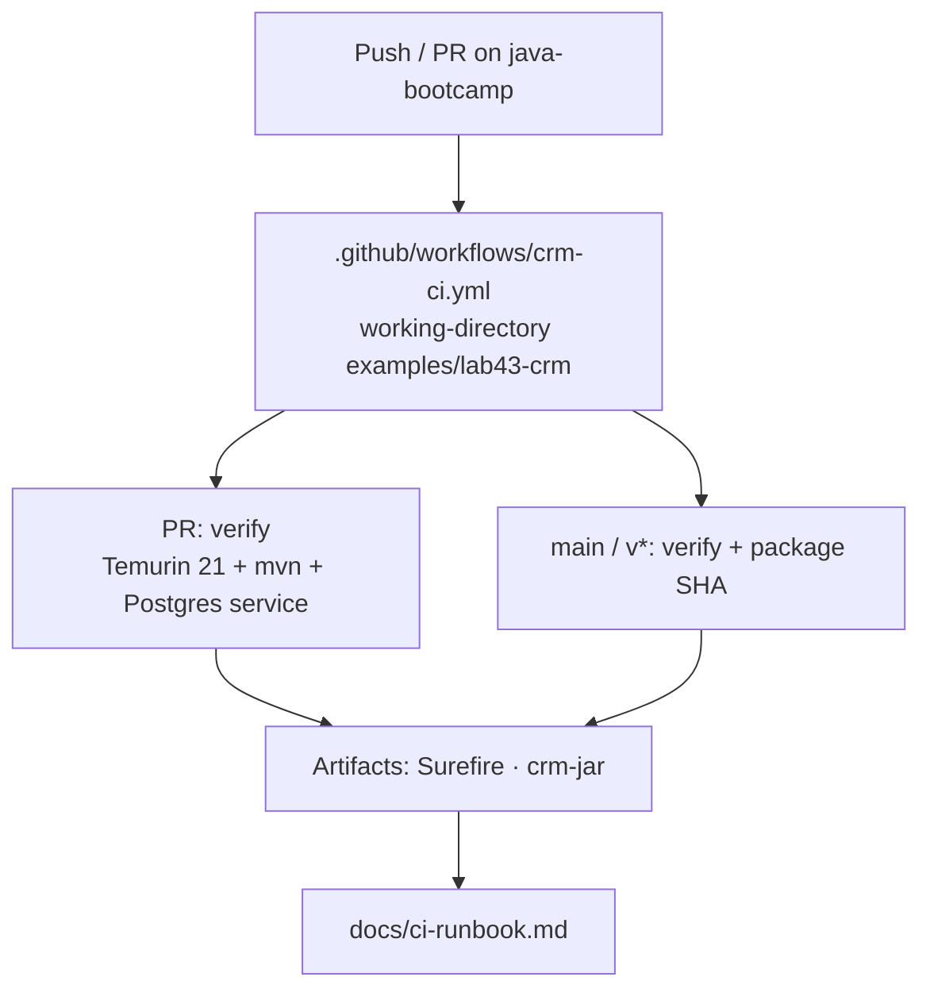

# Lab 43: GitHub CI/CD Pipeline for the CRM — Northstar Delivery Gates

**Module:** 43 — GitHub CI/CD Pipeline for the CRM  
**Duration:** ~45 minutes (timed path with starter) · Full path: 3–4 Hours

**Primary IDE:** IntelliJ IDEA Community Edition · **Optional IDE:** VS Code

| OS | How-to for this lab |
| -- | ------------------- |
| Windows | [LAB-43-WINDOWS.md](LAB-43-WINDOWS.md) |
| macOS | [LAB-43-MACOS.md](LAB-43-MACOS.md) |

> **Two folders (do not mix):** [Clone the course repo · Commit in your own repo](../../../CLONE-AND-OWN-REPO-GUIDE.md). Read this GUIDE in the **course clone**. Write, run, and **push** everything in **your** `java-bootcamp` repo.

---

## Activity card

| | |
| --- | --- |
| **Time** | ~45 min timed · full path 3–4 h |
| **Checkpoint** | **E** (after Ex 1→4→2→3→5→6) |
| **Must prove** | PR/main triggers · verify no skipTests · package-once SHA · secrets not in YAML · runbook |
| **Hard gate** | Pre-lab Pass · Lab 41 CRM in `java-bootcamp` · Actions enabled on **your** remote |

### What you will learn

Ship a reviewable GitHub Actions workflow: verify, optional scan, package-once identity, secrets hygiene, peer runbook.

### Enterprise context

Green demo without artifact identity and secret discipline is not a delivery gate.

### Predict

Should the Lab 44 deploy job rebuild the JAR with Maven?

### Debug

Actions tab stays empty after push — nested `.github/` under `examples/`, or no workflow at the **repo root**?

---

## Two folders — every command below uses these paths

| Folder | Remote | You… |
| ------ | ------ | ---- |
| **Course clone** (handouts) | `bc-sw-engineer-java-participant` | **Read** this GUIDE / starter. **Never** commit homework here. |
| **Your repo** | private `java-bootcamp` | **Copy** Lab 41 here, **merge** starter, **put the workflow at the git root**, **commit and push**. |

| Item | Course clone (read) | Your `java-bootcamp` (write) |
| ---- | ------------------- | ---------------------------- |
| This GUIDE | `labs/…/module-43/lab43/LAB-43-GUIDE.md` | — |
| Starter workflow + runbook | `labs/…/module-43/lab43/starter/` | workflow → **`.github/workflows/crm-ci.yml`** (repo root); runbook → `examples/lab43-crm/docs/` |
| Graded CRM | — | `examples/lab43-crm/` (copy of **Lab 41**, not Lab 42) |
| Pre-lab notes | — | `examples/module-43-exercises/notes/` |
| Screenshots | — | `notes/screenshots/lab-43/` (gitignored) |

IntelliJ stays on `java-bootcamp`. Keep the course clone in a browser tab or a second window.

**Lab 41 baseline (what CI builds):** Spring Boot JAR built with **`mvn`** (no Maven Wrapper unless you added one). **`GET /api/customers`** list API, **no** Spring Security, **no** `/api/v1/interactions`, **no** `anonymousReadIs401` test. PostgreSQL user is **`crm` / `change-me`**. Point this lab at database **`crm_lab43`**. Host tests still use **`SPRING_DATASOURCE_*`** (the docker profile / `CRM_DB_*` is for containers). Do **not** copy `lab42-crm` — that folder is Kubernetes YAML only and has no `pom.xml`.

**Where GitHub looks for workflows:** only `<your-repo>/.github/workflows/*.yml` at the **repository root**. A file at `examples/lab43-crm/.github/workflows/ci.yml` is **ignored**. Default `java-bootcamp` layout therefore uses `defaults.run.working-directory: examples/lab43-crm` plus `cache-dependency-path: examples/lab43-crm/pom.xml`. If you split `lab43-crm` into its **own** GitHub repo, omit those two settings.

**Package-once (honest version):** `mvn verify` already packages. A separate GHA `package` job does not share the verify job’s disk, so it runs `mvn -DskipTests package` again **after** tests passed. Lab 44 must **download** the `crm-jar` artifact — it must **not** run Maven a third time.

---

## 45-minute timed path (use starter)

> **Pacing reminder:** [PACING.md](../PACING.md) checkpoint **E**. Homework: live Actions run, failure path, package-once checksum, full runbook.

1. Open [`starter/README.md`](starter/README.md) **in the course clone**.
2. In **`java-bootcamp`**, copy Lab 41 → `examples/lab43-crm`, merge starter **docs**, copy the workflow to **repo-root** `.github/workflows/crm-ci.yml`.
3. Fill every `TODO` — do **not** work under `labs/`.
4. Local `mvn -B clean verify` from `examples/lab43-crm`; evidence under `notes/screenshots/lab-43/`.
5. Mark timed-path Pass criteria in the starter README.

| Path | Time | Scope |
| ---- | ---- | ----- |
| **Timed (default)** | ~45 min | Workflow TODOs + local verify + runbook secrets names |
| **Full (extended)** | see Duration | Every Step (push, PR evidence, break/restore a real test, checksum on `main`) |

---

## What you'll submit (read this first)

All of these live under **`java-bootcamp`**, not the course clone.

| # | Deliverable | Where |
| - | ----------- | ----- |
| 1 | `.github/workflows/crm-ci.yml` (PR / main / tag behavior) | **repo root** of `java-bootcamp` |
| 2 | Test reports (Surefire) evidence | Actions artifacts + notes |
| 3 | Security / scan evidence or documented residual risk | notes / runbook |
| 4 | JAR and SHA-256 checksum tied to commit | `crm-jar` artifact on `main` or `v*` |
| 5 | `docs/ci-runbook.md` | `examples/lab43-crm/docs/` |
| 6 | Controlled failure-path then restore | notes |
| 7 | No secrets in Git | `git status` on **your** repo |

**Do not submit:** `target/`, secrets, NVD keys, or a verbatim instructor `solution/`.

---

## Lab Overview

This Module 43 lab gives the CRM a reviewable **GitHub Actions** workflow: verify, optional scan, package once, protect secrets, and document how peers re-run CI.

## Learning Objectives

After completing this lab, you will be able to:

* Model CI stages and gates for PR, `main`, and version tags
* Configure Maven dependency caching in GitHub Actions
* Publish Surefire reports as artifacts
* Pass a checksummed JAR + commit identity for Lab 44 to promote
* Keep credentials in Actions secrets, never in YAML

## Business Scenario

Pull requests need fast feedback while `main` and release tags require stronger gates. Build output must be traceable—otherwise staging and production silently diverge.

You own the CI contract for the API that serves Amina (`CUS-1001`) and Ravi (`CUS-1002`).

| ID | Name | Notes |
| -- | ---- | ----- |
| `CUS-1001` | Amina Khan | `ACTIVE` — synthetic fixture in tests/smoke only |
| `CUS-1002` | Ravi Singh | `PROSPECT` — synthetic fixture in tests/smoke only |
| `lab-request-001` | — | correlation on API or pipeline evidence labels |
| `GITHUB_SHA` | — | commit identity recorded with the JAR checksum |

**Security note.** Never paste NVD keys, `.env`, kubeconfig, or registry tokens into screenshots or `docs/`.

---

## Architecture Context
### NOW (this lab)


```mermaid
flowchart TB
  Dev["Push / PR on java-bootcamp"] --> Root[".github/workflows/crm-ci.yml<br/>working-directory examples/lab43-crm"]
  Root --> PRJob["PR: verify<br/>Temurin 21 + mvn + Postgres service"]
  Root --> MainJob["main / v*: verify + package SHA"]
  PRJob --> Art["Artifacts: Surefire · crm-jar"]
  MainJob --> Art
  Art --> Doc["docs/ci-runbook.md"]
```

## Prerequisites

Prior labs: [Lab 41](../../module-41/lab41/LAB-41-GUIDE.md) already in **`java-bootcamp/examples/lab41-crm`**. Lab 42 is **not** the Maven source.

Confirm:

* JDK 21 + Maven 3.9.x (`mvn -version`). Use `./mvnw` only if **your** project already has a wrapper
* Lab 41 `mvn -B test` green on the host
* GitHub remote on **`java-bootcamp`** with Actions enabled
* `crm-postgres` running if you verify locally against Postgres

### Pre-flight

```bash
java -version
mvn -version
git remote -v   # must be YOUR java-bootcamp
```

Working directory for Maven unless noted:

```text
~/java-bootcamp/examples/lab43-crm
# Windows: %USERPROFILE%\java-bootcamp\examples\lab43-crm
```

Workflow file:

```text
~/java-bootcamp/.github/workflows/crm-ci.yml
```

## Worked example (read before you code)

Root workflow for the Lab 0 `java-bootcamp` layout. `run:` steps use `working-directory`; `uses:` steps do **not**, so cache and artifact **paths** are repo-relative.

```yaml
name: CRM CI
on:
  pull_request:
  push:
    branches: [main]
    tags: ["v*"]
defaults:
  run:
    working-directory: examples/lab43-crm
jobs:
  verify:
    runs-on: ubuntu-latest
    services:
      postgres:
        image: postgres:16
        env:
          POSTGRES_USER: crm
          POSTGRES_PASSWORD: change-me
          POSTGRES_DB: crm_lab43
        ports: ["5432:5432"]
        options: >-
          --health-cmd "pg_isready -U crm -d crm_lab43"
          --health-interval 10s
          --health-timeout 5s
          --health-retries 5
    env:
      SPRING_DATASOURCE_URL: jdbc:postgresql://localhost:5432/crm_lab43
      SPRING_DATASOURCE_USERNAME: crm
      SPRING_DATASOURCE_PASSWORD: change-me
    steps:
      - uses: actions/checkout@v4
      - uses: actions/setup-java@v4
        with:
          distribution: temurin
          java-version: "21"
          cache: maven
          cache-dependency-path: examples/lab43-crm/pom.xml
      - name: Verify
        run: mvn -B -ntp clean verify
      - name: Upload test reports
        if: always()
        uses: actions/upload-artifact@v4
        with:
          name: test-reports
          path: examples/lab43-crm/target/surefire-reports/**
```

**What to notice:** Instructors check `mvn` (not `mvnw`), **no** `-DskipTests` on verify, and the workflow file at the **git root**.

---

## Implementation Steps

Complete each step in order. **Write** under `java-bootcamp`. **Read** starter files from the course clone.

---

### Step 1 — Copy Lab 41 into your repo, merge starter, install the root workflow

**Why:** Graded work belongs in `java-bootcamp`. Lab 42 has no `pom.xml`. Nested `.github/` never runs.

**Where:** IntelliJ Terminal in **`java-bootcamp`**. Starter copy source is the **course clone**.

**Do this:**

**Windows (PowerShell):**

```powershell
$jb = "$env:USERPROFILE\java-bootcamp"
$courseLab43 = "$env:USERPROFILE\bc-sw-engineer-java-participant\labs\Week 5 - DevOps, CI-CD and OpenShift\module-43\lab43"

Copy-Item -Recurse -Force "$jb\examples\lab41-crm" "$jb\examples\lab43-crm"
New-Item -ItemType Directory -Force -Path "$jb\examples\lab43-crm\docs","$jb\notes\screenshots\lab-43","$jb\.github\workflows" | Out-Null
Copy-Item -Force "$courseLab43\starter\docs\*" "$jb\examples\lab43-crm\docs\"
Copy-Item -Force "$courseLab43\starter\.github\workflows\ci.yml" "$jb\.github\workflows\crm-ci.yml"

docker exec -e PGPASSWORD=change-me crm-postgres psql -U crm -d postgres -c "CREATE DATABASE crm_lab43;"
```

**macOS / Linux:**

```bash
JB=~/java-bootcamp
COURSE_LAB43=~/bc-sw-engineer-java-participant/labs/Week\ 5\ -\ DevOps,\ CI-CD\ and\ OpenShift/module-43/lab43

cp -R "$JB/examples/lab41-crm" "$JB/examples/lab43-crm"
mkdir -p "$JB/examples/lab43-crm/docs" "$JB/notes/screenshots/lab-43" "$JB/.github/workflows"
cp "$COURSE_LAB43/starter/docs/"* "$JB/examples/lab43-crm/docs/"
cp "$COURSE_LAB43/starter/.github/workflows/ci.yml" "$JB/.github/workflows/crm-ci.yml"

docker exec -e PGPASSWORD=change-me crm-postgres psql -U crm -d postgres -c "CREATE DATABASE crm_lab43;"
```

Confirm `examples/lab43-crm/pom.xml` exists and `.github/workflows/crm-ci.yml` is at the **repo root** (sibling of `examples/`, not inside `lab43-crm`).

**Expected result:** `lab43-crm` is a Maven CRM; workflow is at git root; `crm_lab43` created; you are not editing `labs/`.

**If it fails:** Copied Lab 42 → no `pom.xml`; start over from Lab 41. Copied starter only → no CRM sources. Workflow only under `examples/lab43-crm/.github/` → Actions will never start.

---

### Step 2 — Local verify with the same Maven the pipeline will use

**Why:** Local and pipeline JDK/Maven drift is the classic “works on my laptop” failure.

**Where:** `java-bootcamp/examples/lab43-crm`

**Do this:** Use **`mvn`**, not `./mvnw`. Do **not** `-DskipTests`. Point host tests at `crm_lab43` if your `application.yml` still names another database.

```bash
cd ~/java-bootcamp/examples/lab43-crm
java -version
mvn -version
```

**Windows (PowerShell):**

```powershell
mvn -B -ntp clean verify "-Dspring.datasource.url=jdbc:postgresql://localhost:5432/crm_lab43" `
  "-Dspring.datasource.username=crm" "-Dspring.datasource.password=change-me"
```

**macOS / Linux:**

```bash
mvn -B -ntp clean verify \
  -Dspring.datasource.url=jdbc:postgresql://localhost:5432/crm_lab43 \
  -Dspring.datasource.username=crm \
  -Dspring.datasource.password=change-me
```

**Expected result:** `BUILD SUCCESS`; versions recorded; tests actually ran.

**If it fails:** Baseline red → fix CRM tests first. `./mvnw` not found → use `mvn`. Wrong database → `crm_lab43`, not `crm` / `crm_lab41`.

---

### Step 3 — Verification job, Maven cache, Postgres service

**Why:** Cold Maven downloads waste minutes. ITs that talk to Postgres need a service on the runner (Testcontainers cannot assume Docker-in-Docker).

**Do this:** Fill TODOs in **`java-bootcamp/.github/workflows/crm-ci.yml`** (starter already has the shape). Confirm:

* `defaults.run.working-directory: examples/lab43-crm`
* `cache-dependency-path: examples/lab43-crm/pom.xml`
* verify command is `mvn -B -ntp clean verify` with **no** `-DskipTests`
* `services.postgres` + `SPRING_DATASOURCE_*` as in the Worked example
* Surefire upload path is `examples/lab43-crm/target/surefire-reports/**` with `if: always()`

**Expected result:** PR path will run verify; cache declared; report path is repo-relative.

**If it fails:** `pom.xml` not found → working-directory / cache-dependency-path. Empty reports → path not repo-relative (`uses:` ignores `working-directory`).

---

### Step 4 — Optional quality gate (Dependency-Check)

**Why:** Compile-only green builds miss vulnerable dependencies. Lab 40 already added `-Psecurity-scan` and pin **10.0.4**.

**Do this:** Keep the optional scan on `main` / tags with `continue-on-error: true` so NVD outages do not block training. Store **`NVD_API_KEY`** as a GitHub Actions **secret** (never in YAML). Document residual risk if the scan is skipped or yellow.

Do not paste the key into the runbook.

**Expected result:** Scan step present or residual risk owned; reports retained when the step runs.

**If it fails:** NVD 403 → missing secret; same Lab 40 story. Do not lower `failBuildOnCVSS` to greenwash.

---

### Step 5 — Package job with checksum (main / tags only)

**Why:** Lab 44 must promote a known JAR, not a silent rebuild on the deploy agent.

**Do this:** `package` job `needs: verify`, `if: github.ref == 'refs/heads/main' || startsWith(github.ref, 'refs/tags/')`. After `mvn -B -ntp -DskipTests package`:

```bash
sha256sum target/*.jar > target/SHA256SUMS
echo "commit=${GITHUB_SHA}" >> target/SHA256SUMS
```

Upload artifact `crm-jar` with repo-relative paths:

```text
examples/lab43-crm/target/*.jar
examples/lab43-crm/target/SHA256SUMS
```

A PR **will not** produce `crm-jar`. Push to `main` or tag `v*` for that evidence. Local Windows checksum (from `lab43-crm`):

```powershell
Get-ChildItem .\target\*.jar | Where-Object { $_.Name -notlike '*.original' } |
  ForEach-Object { Get-FileHash $_ -Algorithm SHA256 }
```

Do not assume the file is named `lab43-crm-0.0.1-SNAPSHOT.jar` — Lab 41 keeps its existing `artifactId`.

**Expected result:** On `main` / `v*`, artifact pack includes JAR + checksum + commit.

**If it fails:** Empty glob → `package` did not write under `examples/lab43-crm/target`. Deploy script later runs `mvn package` → remove it in Lab 44.

---

### Step 6 — PR vs main vs tag (no deploy in this lab)

**Why:** PR noise should stay light. Production deploy is Lab 44.

**Do this:** PR = verify only. `main` and `v*` = verify + package. Do **not** add `scripts/deploy.sh` or a deploy job here.

**Expected result:** Distinct behaviors; no registry tokens in YAML.

**If it fails:** Automatic prod deploy from every PR → delete that job.

---

### Step 7 — Protect variables

**Why:** Leaked NVD keys or registry tokens in Git become incidents.

**Do this:** GitHub → Settings → Secrets and variables. Names only in the runbook, for example:

```text
NVD_API_KEY (Actions secret, optional scan)
CRM_REGISTRY_USER / CRM_REGISTRY_TOKEN (Lab 44 — do not put in ci.yml)
```

Never `echo` secrets. Prefer `set +x` around sensitive shell if tracing is on.

**Expected result:** Runbook lists **names** only; YAML has `${{ secrets.NVD_API_KEY }}` or nothing.

**If it fails:** Plaintext password in `crm-ci.yml` → remove, rotate if pushed.

---

### Step 8 — Push, break a real test, restore

**Why:** Untested YAML and unwritten reruns recreate tribal knowledge.

**Do this:** Commit and push **`java-bootcamp`** (workflow at root + `examples/lab43-crm`). Open a PR or watch the Actions run.

Deliberately break **one existing unit test** under `src/test/java` (change an assertion). There is **no** `anonymousReadIs401` / Spring Security test on this CRM. Push → red verify → Surefire artifact → restore → green.

Document troubleshooting in `docs/ci-runbook.md`.

**Expected result:** Green pipeline after restore; failure evidence; peer-usable runbook.

**If it fails:** Actions never starts → workflow is not at repo root. Tests fail on missing Postgres → service + `SPRING_DATASOURCE_*`. Health/API 401 experiments → wrong app; use a real unit test.

---

### Step 9 — Evidence pack

**Why:** Flaky cache myths and secret leakage are the cultural failure modes of this lab.

**Do this:** Complete Failure Experiments. Screenshots under `notes/screenshots/lab-43/`. Confirm `git status` in **your** repo has no secrets.

```markdown
## Definition of done
| # | Confirm | Notes |
| - | ------- | ----- |
| 1 | Work is in java-bootcamp (not the course clone) | Pass / Fail |
| 2 | crm-ci.yml is at the git root | Pass / Fail |
| 3 | PR pipeline green after restore | Pass / Fail |
| 4 | main checksum artifact present (or tagged) | Pass / Fail |
| 5 | Secret names only in the runbook | Pass / Fail |
```

**Expected result:** ≥3 experiments recorded; `.github/workflows/crm-ci.yml` + `docs/ci-runbook.md` ready.

---

## Implementation Checkpoints

### Checkpoint A — Tooling

| # | Confirm | Your notes |
| - | ------- | ---------- |
| 1 | `examples/lab43-crm` is a copy of Lab 41 (has `pom.xml`) | Pass / Fail |
| 2 | `java-bootcamp/.github/workflows/crm-ci.yml` exists | Pass / Fail |
| 3 | Local `mvn -B clean verify` green (no `mvnw` required) | Pass / Fail |

### Checkpoint B — Core pipeline

| # | Confirm | Your notes |
| - | ------- | ---------- |
| 1 | PR verify + main/tag package paths | Pass / Fail |
| 2 | Surefire published (`if: always()`) | Pass / Fail |
| 3 | Package-once checksum with `GITHUB_SHA` | Pass / Fail |

### Checkpoint C — Gates + secrets

| # | Confirm | Your notes |
| - | ------- | ---------- |
| 1 | Scan step or residual risk documented | Pass / Fail |
| 2 | Secret **names** only in the runbook | Pass / Fail |
| 3 | No deploy job / no JAR rebuild planned for Lab 44 | Pass / Fail |

### Checkpoint D — Hygiene

| # | Confirm | Your notes |
| - | ------- | ---------- |
| 1 | Controlled failure then restore | Pass / Fail |
| 2 | `docs/ci-runbook.md` complete | Pass / Fail |
| 3 | No secrets in Git; pushes went to **your** remote | Pass / Fail |

---

## Safety Rules

* Work only in **your** `java-bootcamp` remote.
* Never commit NVD keys, `.env`, kubeconfig, or registry tokens.
* Verify must not use `-DskipTests`.
* Do not Flyway-migrate Lab 39–42 databases; use **`crm_lab43`**.
* Keep CRM evidence synthetic (`CUS-1001` / `CUS-1002` only).

---

## Reference Commands

### Local (from `examples/lab43-crm`)

```bash
mvn -B -ntp clean verify
mvn -B -ntp -DskipTests package
# Linux/macOS:
sha256sum target/*.jar
# Windows: Get-FileHash as in Step 5
git status --short
git remote -v
```

### Policy

- PR: verify only
- main: verify + checksum artifact
- tags `v*`: verify + checksum artifact
- Deploy: Lab 44

## Failure Experiments

| # | Experiment | Observe | Restore |
| - | ---------- | ------- | ------- |
| 1 | Break one unit test | Verify red; Surefire shows failure | Restore; re-run green |
| 2 | Leave workflow only under `examples/lab43-crm/.github/` | Actions never starts | Move to repo-root `crm-ci.yml` |
| 3 | `./mvnw` in the workflow | Step fails (no wrapper) | Use `mvn` |
| 4 | Echo a fake secret | Log smell | Remove; use Actions secrets |
| 5 | `-DskipTests` on verify | False green | Forbid skip on verify |

---

## Troubleshooting

| Symptom | Likely cause | Fix |
| ------- | ------------ | --- |
| Actions tab empty | Nested `.github/` | Root `java-bootcamp/.github/workflows/crm-ci.yml` |
| `pom.xml` not found | Wrong directory | `working-directory` + `cache-dependency-path` |
| `./mvnw` not found | Lab 41 has no wrapper | Use `mvn` |
| Tests fail in CI, pass locally | No Postgres on the runner | `services.postgres` + `SPRING_DATASOURCE_*` |
| Password authentication failed | User `crm_app` | User **`crm`** |
| Migrated the wrong database | `crm` / `crm_lab41` | Use **`crm_lab43`** |
| Empty `crm-jar` | You only opened a PR | Push `main` or tag `v*` |
| JAR name mismatch | Assumed `lab43-crm-*.jar` | Glob `target/*.jar` (not `*.original`) |
| `anonymousReadIs401` missing | Old CRM with Security | Break a real unit test |
| NVD 403 | No Actions secret | Optional `NVD_API_KEY`; `continue-on-error` |
| Copied Lab 42 | No Maven project | Copy **Lab 41** |
| Work in course clone | Wrong folder | Move to `java-bootcamp` |
| Full CD promotions | Wrong module | Lab 44 |

## Evidence Log Template

```markdown
# Lab 43 Evidence Log
- Repo (must be java-bootcamp):
- Workflow path (must be .github/workflows/crm-ci.yml):
- Java/Maven versions:
- Local verify:
- Actions URL (sanitized):
- Forced test failure + restore:
- JAR checksum / GITHUB_SHA:
```

---

## Cleanup

```bash
cd ~/java-bootcamp/examples/lab43-crm
mvn -q clean
git status --short
```

Do not commit `target/` or Dependency-Check HTML dumps.

**Keep `lab43-crm` and root `crm-ci.yml`**—Lab 44 promotes this artifact identity.

---

## Reflection Questions

Write **1–3 sentence** answers (not essays):

1. Which design decision most affected correctness (root workflow, image pin, or package-once)?
2. What evidence proves the JAR matches the commit?
3. Which failure was hardest to diagnose (path vs tests vs secrets)?

---
