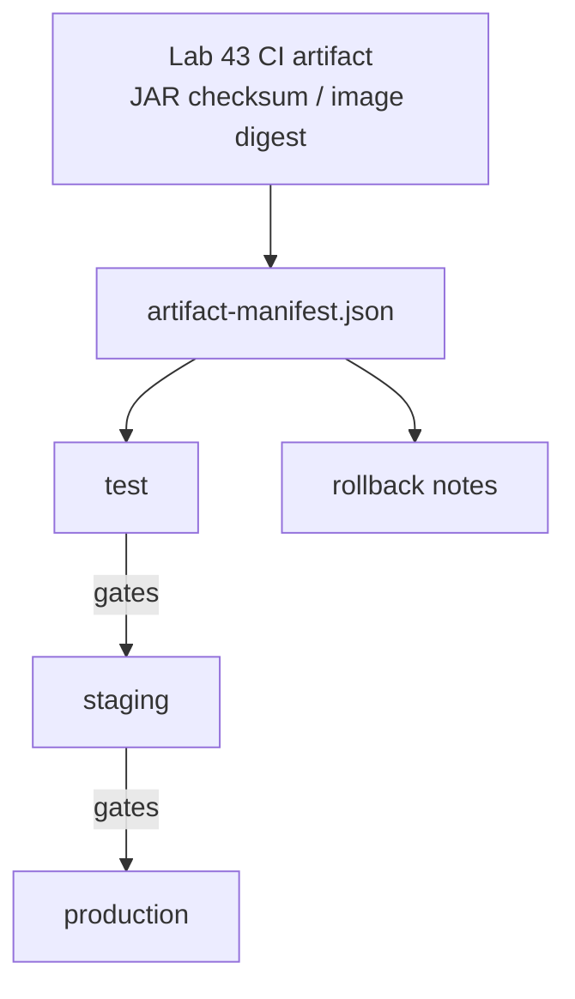
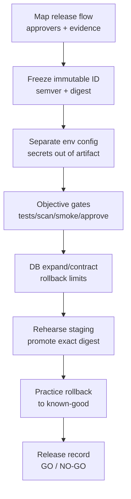

# Lab 44: Continuous Delivery and Environment Promotion — Northstar Release Path

**Module:** 44 — Continuous Delivery and Environment Promotion  
**Lab folder:** `labs/Week 5 - DevOps, CI-CD and k3s/lab44/`  
**Difficulty:** Intermediate  
**Duration:** 3–4 Hours

**Primary IDE:** IntelliJ IDEA Community Edition · **Optional IDE:** VS Code

| OS | How-to for this lab |
| -- | ------------------- |
| Windows | [LAB-44-WINDOWS.md](LAB-44-WINDOWS.md) |
| macOS | [LAB-44-MACOS.md](LAB-44-MACOS.md) |

> **Environment reminder:** Finish [Lab 0](../../../Week%201%20-%20Java%20and%20JVM%20Foundations/module-00/lab0/LAB-0-GUIDE.md). Use **IntelliJ IDEA Community** (primary; optional VS Code) on your laptop with **JDK 21**, **Maven 3.9+**, and a **GitHub** repo with **Actions** enabled. Work under `~/java-bootcamp` (Windows: `%USERPROFILE%\java-bootcamp`).

---

## How to follow this lab

1. Open the **Windows** or **macOS** how-to (links above) in a second tab.
2. Create/work only under your `java-bootcamp/examples/…` folder from the steps (not inside this `labs/` git clone unless a step says otherwise).
3. For each **Step N**: read **Why** (if present) → do the actions → confirm **Expected** / **Expected result** → then continue.
4. When stuck, use **Failure Experiments** / troubleshooting in this guide before asking for help.
5. Capture evidence under `notes/screenshots/` (redact secrets). Use the **Pass criteria** tables — write **Pass** or **Fail** in your notes. GitHub file view does not support clickable checkboxes.

## Lab Overview

This Module 44 lab turns CI success into **continuous delivery** for the **Customer Management Platform**: one immutable artifact promoted through test → staging → production with objective gates, approvals, release evidence, and rehearsed rollback. You will produce `docs/release-plan.md`, `docs/release-checklist.md`, `docs/rollback-runbook.md`, and `artifact-manifest.json`, plus staging evidence.

**Purpose.** Leadership freezes a release rule: the binary (or image) that passed staging gates is **exactly** what production receives—identified by digest/checksum, not by the mutable tag `latest`. Environment configuration stays outside the artifact. Rollback names a known-good digest and a verification check. A demo deploy without a manifest is not credit-worthy.

**What you build (exercise).** Copy to `lab44-crm`; map the release flow; freeze immutable identity (semver + commit + JAR SHA-256 / image digest); separate environment config and secrets; define objective promotion gates; plan expand-before-contract DB compatibility; rehearse staging promotion with smoke checks (fixtures `CUS-1001` / `CUS-1002`, correlation `lab-request-001`); practice rollback; complete the release record and go/no-go evidence.

**What success looks like.** Under `~/java-bootcamp/examples/lab44-crm/` a peer can follow the release plan, verify the manifest digests match staging and the intended prod candidate, walk the rollback runbook against a known-good digest, and see staging smoke results for Amina/Ravi without secrets in Git.

**Depends on Lab 43.** Need `.github/workflows/ci.yml`, package-once checksums, and secured deployment variables. Environments or variables per instructor. If Lab 43 is incomplete, finish CI identity before claiming CD credit.

**CRM connection.** Smoke and synthetic checks may create or read `CUS-1001` (Amina Khan), `CUS-1002` (Ravi Singh), and correlation `lab-request-001` in **non-production** only. Lab 45 shifts to IaC; keep promotion evidence portable and secret-free.

---

## Learning Objectives

After completing this lab, you will be able to:

* Distinguish continuous delivery (releasable always) from continuous deployment (auto-prod)
* Promote artifacts by digest/checksum rather than rebuilding
* Separate environment configuration from immutable application bits
* Define objective, measurable release gates with evidence links
* Write release and rollback checklists operators can execute under stress
* Capture traceable deployment evidence (who, when, which digest, which env)
* State database expand/contract limits that constrain rollback
* Make an explicit go / no-go decision with residual risk owners

---

## Business Scenario

The CRM release has passed CI (Lab 43). The organization needs confidence that the artifact tested in staging is exactly the artifact deployed later, with environment configuration separated and recovery prepared.

Week’s leadership question: “If staging said GO on digest X, can we prove production is X—and roll back to Y in under N minutes?” You own that answer for Northstar’s release of customer APIs serving agents who look up Amina and Ravi.

Use these examples consistently:

| ID | Name | Notes |
| -- | ---- | ----- |
| `CUS-1001` | Amina Khan | `ACTIVE` — staging smoke read/update target |
| `CUS-1002` | Ravi Singh | `PROSPECT` → activate path in smoke if allowed |
| `lab-request-001` | — | correlation on smoke API calls |
| `sha256:…` / JAR SHA | — | immutable artifact identity in manifest |
| `1.3.2` | — | prior known-good rollback target (example) |

**Security note for evidence.** Fictional customers only. Never commit kubeconfig, Terraform state, `.env`, or registry credentials. Redact URLs that embed tokens. Prefer screenshots of readiness and smoke JSON with fixtures—not production dumps.

---

## Architecture Context

### NOW (this lab)



### Lab flow (mermaid)



### Architecture NOW vs LATER

| Aspect | Lab 44 (NOW) | Lab 45+ / production |
| ------ | ------------ | -------------------- |
| Infra | Assume Lab 42/43 deploy path | Formal Terraform/Ansible (Lab 45) |
| Artifact | Manifest + digest promotion | Same discipline + signed provenance |
| Rollback | Rehearsed digests + checklist | Automated canary / progressive delivery |
| Docs | Release plan + rollback runbook | Org change-management ticket integration |

**Lab focus:** Continuous delivery—immutable promotion, staging/prod gates, rollback readiness. Treat digest identity as a first-class deliverable equal to the application code.

---

## Prerequisites

Complete [SETUP](../../../SETUP-INSTRUCTIONS.md), [Lab 0](../../../Week%201%20-%20Java%20and%20JVM%20Foundations/module-00/lab0/LAB-0-GUIDE.md), and [Lab 43](../../module-43/lab43/LAB-43-GUIDE.md). Confirm:

* Lab 43 pipeline building successfully with package-once evidence
* Environments or variables per instructor (test / staging / prod names)
* Artifact promotion path defined (registry, GitHub deployments, or approved substitute)
* `kubectl` or deploy script access only as instructor directs
* No secrets committed to Git

### Pre-flight

```bash
java -version
./mvnw --version 2>/dev/null || mvn -version
docker --version
git --version
pwd
ls ~/java-bootcamp/examples
# If cluster deploy is in scope:
kubectl config current-context 2>/dev/null || true
```

Fix environment failures before claiming promotion credit. Record tool versions in evidence.

---

## Suggested Project Files

Primary training layout:

```text
~/java-bootcamp/examples/lab44-crm/
├── .github/workflows/ci.yml       (from Lab 43; extend only if needed)
├── artifact-manifest.json
├── scripts/
│   ├── promote.sh                (digest-based promote; no rebuild)
│   └── smoke-crm.sh              (CUS-1001 / CUS-1002 / lab-request-001)
├── docs/
│   ├── release-plan.md
│   ├── release-checklist.md
│   └── rollback-runbook.md
├── notes/screenshots/            (staging evidence, rollout, smoke)
├── src/...
├── pom.xml
├── .gitignore
└── README.md
```

Platform secondary paths:

```text
customer-management-platform/
├── docs/release-plan.md
├── docs/release-checklist.md
├── docs/rollback-runbook.md
├── artifact-manifest.json
└── reports/                      (sanitized staging evidence)
```

Ignore `target/`, plaintext secrets, kubeconfig, and production data exports.

---

## Concepts to Discuss

Write 2–3 sentences each in `docs/release-plan.md`:

1. Main promotion flow (CI artifact → test → staging → prod)
2. Trust boundary: what staging smoke proves vs what it assumes about traffic mix
3. Success/failure contracts of a gate (measurable pass/fail)
4. Stable fixtures (`CUS-1001`) vs production sampling
5. Idempotency of promoting the same digest twice
6. Why immutable identity beats `latest`
7. Evidence operators need at go/no-go
8. Two regions / two clusters: same digest, different config
9. False confidence: green smoke while Kafka lag explodes
10. What Lab 45 changes (IaC) without rewriting fixture IDs

Also note (short paragraph each) in the same file:

* **Delivery vs deployment.** Continuous delivery means the artifact is *always releasable*; continuous deployment means every green commit ships to production automatically. This lab rehearses delivery with human GO/NO-GO.
* **Config ownership.** Who may change staging Kafka bootstrap without a new JAR? If the answer is “nobody documented,” promotion will invent secrets mid-outage.

---

## Implementation Steps

Complete each step in order. Commands assume `~/java-bootcamp/examples/lab44-crm` (Windows: `%USERPROFILE%\java-bootcamp\examples\lab44-crm`) unless noted. Parts 1–8 map to Steps 1–8; Step 9 closes experiments.

---

### Step 1 — Map release flow (Part 1)

**Why:** Unnamed handoffs produce “someone thought prod was updated” outages.

**Do this:** Copy Lab 43 work forward and draw commit → build → registry → test → staging → production handoffs in `docs/release-plan.md`. Name approvers and evidence at each gate. Identify where a rebuild or mutable tag could break traceability.

```bash
cd ~/java-bootcamp/examples
cp -r lab43-crm lab44-crm
cd lab44-crm
mkdir -p docs notes/screenshots scripts
git switch -c lab/44-crm 2>/dev/null || true
```

**Expected result:** Diagram or ordered list with owners, evidence, and anti-rebuild notes.

**If it fails:** Flow that says “rebuild on each environment” → redesign around one artifact.

---

### Step 2 — Define immutable identity (Part 2)

**Why:** Without digest identity, rollback and forensics are guesses.

**Do this:** Choose semantic version and commit labels. Calculate JAR checksum and record image digest if containers are used. Prohibit `latest` and environment-specific rebuilds. Create `artifact-manifest.json`:

```json
{
  "application": "crm-api",
  "version": "1.4.0",
  "gitCommit": "${GITHUB_SHA}",
  "jarSha256": "<calculated-value>",
  "image": "registry.example.com/training/crm-api:1.4.0",
  "imageDigest": "sha256:<registry-digest>",
  "builtBy": "github-actions"
}
```

Fill real values from Lab 43 artifacts (replace placeholders deliberately).

```bash
sha256sum target/*.jar
```

**Expected result:** Manifest with concrete checksum/digest and commit; no `latest`.

**If it fails:** Missing digests → pull from registry or CI artifacts before continuing.

---

### Step 3 — Separate configuration (Part 3)

**Why:** Baking staging URLs into the JAR guarantees the wrong backend in prod.

**Do this:** In `docs/release-plan.md`, list values that vary by environment (DB URL, Kafka bootstrap, base URLs, feature flags). Keep secrets outside artifacts and committed manifests. Assign configuration ownership and safe defaults (fail closed on missing secrets).

**Expected result:** Explicit config inventory per env; secrets mechanism named (GitHub secured vars / cluster Secret)—values not committed.

**If it fails:** Password in ConfigMap YAML → move to Secret / secured var and scrub Git.

---

### Step 4 — Create promotion gates (Part 4)

**Why:** Subjective “looks good” approvals do not survive audit or 2 a.m. handoffs.

**Do this:** In `docs/release-checklist.md`, require tests, scan results, migration review, smoke checks, and approval. Define measurable pass/fail criteria. Preserve links and approver timestamps.

Example go/no-go fragment:

```markdown
_Mark each row **Pass** or **Fail** in your lab notes (GitHub markdown files are not interactive checklists)._

| # | Confirm | Your notes |
| - | ------- | ---------- |
| 1 | Artifact digest verified against artifact-manifest.json | Pass / Fail |
| 2 | Automated gates passed (CI verify + scan) | Pass / Fail |
| 3 | Database migration reviewed | Pass / Fail |
| 4 | Staging smoke: CUS-1001 / CUS-1002 with lab-request-001 | Pass / Fail |
| 5 | Rollback target confirmed (prior digest) | Pass / Fail |
| 6 | On-call owner acknowledged | Pass / Fail |
- Decision: GO / NO-GO
- Approver and timestamp:
- Evidence links:
```

**Expected result:** Checklist with objective criteria and evidence slots.

**If it fails:** Vague “QA approved” with no links → reject and require evidence URLs/paths.

---

### Step 5 — Plan database compatibility (Part 5)

**Why:** App rollback cannot undo destructive migrations; teams learn this the hard way.

**Do this:** Document expand-before-contract migrations in `docs/release-plan.md`. State backward and forward compatibility assumptions between app versions `1.3.2` and `1.4.0` (example). Explain rollback limits after data changes (when digest rollback is insufficient).

**Expected result:** Explicit migration compatibility section and rollback limits.

**If it fails:** “Just roll back the pod” after DROP COLUMN → rewrite limits before GO.

---

### Step 6 — Rehearse staging release (Part 6)

**Why:** First-time promotion should not be production.

**Do this:** Promote the **exact** tested digest to staging (script or kubectl set image by digest). Run smoke and synthetic checks for CRM fixtures. Observe errors, latency, readiness, and Kafka lag if in scope.

Promotion guard pattern:

```bash
set -eu
: "${RELEASE_DIGEST:?release digest is required}"
# Adapt resource names to instructor environment
kubectl set image deployment/crm-api \
  crm-api="registry.example.com/training/crm-api@${RELEASE_DIGEST}"
kubectl rollout status deployment/crm-api --timeout=180s
curl -fsS -H "X-Correlation-Id: lab-request-001" \
  "${CRM_BASE_URL}/actuator/health/readiness"
# Smoke fixtures (adapt endpoints)
curl -fsS -H "X-Correlation-Id: lab-request-001" \
  "${CRM_BASE_URL}/api/customers/CUS-1001"
```

Capture staging evidence under `notes/screenshots/`.

**Expected result:** Staging running the manifest digest; smoke green for fixtures; evidence saved.

**If it fails:** Deployed `:latest` instead of digest → stop; fix to digest promote; redo smoke.

---

### Step 7 — Practice rollback (Part 7)

**Why:** Untested rollback is fiction.

**Do this:** In `docs/rollback-runbook.md`, define trigger thresholds (error rate, readiness, lag) and decision authority. Redeploy the previous known-good digest (example `1.3.2`). Verify service, data, and event compatibility. Record timing.

```bash
# Example — replace with your known-good digest from the manifest history
export ROLLBACK_DIGEST="sha256:<prior-known-good>"
# reuse promote path pointing at ROLLBACK_DIGEST
```

**Expected result:** Rollback runbook with triggers, commands, verification, and rehearsal note.

**If it fails:** Rollback doc without verification → add curl/readiness/fixture checks.

---

### Step 8 — Complete release record (Part 8)

**Why:** Support and auditors need one coherent story after the window closes.

**Do this:** Write release notes and known issues in `docs/release-plan.md` (or adjacent notes). Include support contacts and change references. Record go or no-go with evidence links and residual risks (owner + date).

**Expected result:** Complete packet: plan, checklist with decision, rollback runbook, manifest, staging evidence.

**If it fails:** Decision logged without evidence links → backfill before submission.

---

### Step 9 — Failure experiments + evidence pack

**Why:** Promotion theater without adverse checks fails production on day one.

**Do this:** Complete [Failure Experiments](#failure-experiments). Ensure `git status` is clean of secrets. Ask a peer to follow the rollback runbook dry-run. Add this close-out block to `docs/release-checklist.md`:

```markdown
## Evidence pack pass criteria
_Mark each row **Pass** or **Fail** in your lab notes (GitHub markdown files are not interactive checklists)._

| # | Confirm | Your notes |
| - | ------- | ---------- |
| 1 | artifact-manifest.json filled | Pass / Fail |
| 2 | staging digest screenshot / command output | Pass / Fail |
| 3 | smoke with CUS-1001, CUS-1002, lab-request-001 | Pass / Fail |
| 4 | rollback rehearsal note (time + verifier) | Pass / Fail |
| 5 | residual risks with owners | Pass / Fail |
```

**Expected result:** ≥3 experiments; peer confirmation; sanitized evidence.

**If it fails:** See Troubleshooting.

---

## Implementation Checkpoints

### Checkpoint A — Tooling

_Mark each row **Pass** or **Fail** in your lab notes (GitHub markdown files are not interactive checklists)._

| # | Confirm | Your notes |
| - | ------- | ---------- |
| 1 | `lab44-crm` under `examples/` | Pass / Fail |
| 2 | Lab 43 artifact identity available | Pass / Fail |
| 3 | Environment access / variables confirmed (or documented substitute) | Pass / Fail |

### Checkpoint B — Core CD design

_Mark each row **Pass** or **Fail** in your lab notes (GitHub markdown files are not interactive checklists)._

| # | Confirm | Your notes |
| - | ------- | ---------- |
| 1 | Release flow mapped with owners | Pass / Fail |
| 2 | `artifact-manifest.json` with digest/checksum | Pass / Fail |
| 3 | Env config separated; secrets not in artifact | Pass / Fail |

### Checkpoint C — Gates + rehearsal

_Mark each row **Pass** or **Fail** in your lab notes (GitHub markdown files are not interactive checklists)._

| # | Confirm | Your notes |
| - | ------- | ---------- |
| 1 | Objective checklist with measurable criteria | Pass / Fail |
| 2 | Staging promote by digest + smoke (`CUS-1001` / `CUS-1002`) | Pass / Fail |
| 3 | Rollback rehearsal to known-good digest | Pass / Fail |

### Checkpoint D — Hygiene

_Mark each row **Pass** or **Fail** in your lab notes (GitHub markdown files are not interactive checklists)._

| # | Confirm | Your notes |
| - | ------- | ---------- |
| 1 | GO/NO-GO recorded with evidence | Pass / Fail |
| 2 | `docs/rollback-runbook.md` complete | Pass / Fail |
| 3 | No secrets / kubeconfig / state files committed | Pass / Fail |

---

## Reference Commands, Configuration, and Code

### Artifact manifest

```json
{
  "application": "crm-api",
  "version": "1.4.0",
  "gitCommit": "${GITHUB_SHA}",
  "jarSha256": "<calculated-value>",
  "image": "registry.example.com/training/crm-api:1.4.0",
  "imageDigest": "sha256:<registry-digest>",
  "builtBy": "github-actions",
  "knownGoodPrevious": {
    "version": "1.3.2",
    "imageDigest": "sha256:<prior-digest>"
  }
}
```

### Promotion guard

```bash
set -eu
: "${RELEASE_DIGEST:?release digest is required}"
: "${CRM_BASE_URL:?}"
kubectl set image deployment/crm-api \
  crm-api="registry.example.com/training/crm-api@${RELEASE_DIGEST}"
kubectl rollout status deployment/crm-api --timeout=180s
curl -fsS -H "X-Correlation-Id: lab-request-001" \
  "${CRM_BASE_URL}/actuator/health/readiness"
curl -fsS -H "X-Correlation-Id: lab-request-001" \
  "${CRM_BASE_URL}/api/customers/CUS-1001" | head
curl -fsS -H "X-Correlation-Id: lab-request-001" \
  "${CRM_BASE_URL}/api/customers/CUS-1002" | head
```

### Rollback runbook outline

```markdown
# Rollback — crm-api
## Triggers
- Readiness failing > 3m
- Error rate above threshold
- Kafka lag critical (see Lab 46 notes)
## Authority
- Release commander decides; on-call executes
## Steps
1. Confirm current digest != known-good
2. Promote knownGoodPrevious.imageDigest
3. Verify readiness + CUS-1001/CUS-1002 smoke
4. Record time-to-recover
## Limits
- If migration is not backward compatible, stop and escalate
```

### Release-plan outline

```markdown
# Release plan 1.4.0
## Flow
commit → CI artifact → test → staging → prod
## Approvers
- Staging: <role>
- Prod: <role>
## Config per env
- DB URL, Kafka bootstrap, base URL (secrets via secured vars)
## DB compatibility
- Expand/contract notes:
## Watch window
- 60 minutes: errors, latency, lag, support volume
```

### Smoke script sketch (`scripts/smoke-crm.sh`)

```bash
#!/usr/bin/env bash
set -euo pipefail
: "${CRM_BASE_URL:?}"
CORR="${CORR:-lab-request-001}"
for id in CUS-1001 CUS-1002; do
  echo "GET $id"
  curl -fsS -H "X-Correlation-Id: ${CORR}" \
    "${CRM_BASE_URL}/api/customers/${id}" >/dev/null
done
curl -fsS -H "X-Correlation-Id: ${CORR}" \
  "${CRM_BASE_URL}/actuator/health/readiness"
echo "smoke ok corr=${CORR}"
```

Record exit codes in staging evidence. If endpoints differ in your CRM, adapt paths—keep fixtures and correlation stable.

### Commands

```bash
cd ~/java-bootcamp/examples/lab44-crm
./mvnw -B -ntp clean verify
sha256sum target/*.jar
# Digest check example (registry CLI varies)
echo "Compare manifest imageDigest to deployed pod image"
kubectl get deploy crm-api -o jsonpath='{.spec.template.spec.containers[0].image}{"\n"}' 2>/dev/null || true
chmod +x scripts/smoke-crm.sh 2>/dev/null || true
# CRM_BASE_URL=https://staging.example.test ./scripts/smoke-crm.sh
git status --short
```

### Evidence log template

```markdown
# Lab 44 Evidence Log
- Manifest version/digest:
- Staging promote time (UTC):
- Smoke correlation: lab-request-001
## Results
| Check | Result | Evidence |
| ----- | ------ | -------- |
| Digest match | PASS/FAIL | |
| Staging smoke CUS-1001 | PASS/FAIL | |
| Staging smoke CUS-1002 | PASS/FAIL | |
| Rollback rehearsal | PASS/FAIL | |
| GO/NO-GO recorded | PASS/FAIL | |
```

### Document map

| Document | Role |
| -------- | ---- |
| `docs/release-plan.md` | Flow, compatibility, release notes |
| `docs/release-checklist.md` | Gates + GO/NO-GO |
| `docs/rollback-runbook.md` | Triggers + restore known-good |
| `artifact-manifest.json` | Immutable identity |
| `scripts/promote.sh` / `smoke-crm.sh` | Repeatable promote + smoke |
| `notes/screenshots/` | Staging + rollback evidence |

---

## Manual Verification

1. Manifest digests/checksums match CI and staging deployment.
2. No rebuild occurs on promotion scripts.
3. Environment secrets are not inside the JAR or committed YAML values.
4. Checklist criteria are measurable (not “QA feels good”).
5. Staging smoke uses `CUS-1001`, `CUS-1002`, and `lab-request-001`.
6. Rollback runbook names prior digest and verification commands.
7. DB compatibility limits are explicit.
8. GO/NO-GO includes approver, timestamp, evidence links.
9. Peer can rehearse rollback dry-run from docs alone.
10. Git has no secrets, kubeconfig, or Terraform state.
11. Watch-window owner and signals (errors, latency, lag) are named.
12. `knownGoodPrevious` in the manifest matches the rollback rehearsal target.

---

## Failure Experiments

| # | Experiment | Observe | Restore |
| - | ---------- | ------- | ------- |
| 1 | Promote with wrong digest intentionally | Rollout or smoke fails / mismatch | Correct digest; re-smoke |
| 2 | Tabletop NO-GO (migration risk) | Checklist blocks prod | Document decision + owner |
| 3 | Roll back to prior digest | Readiness + fixtures recover | Leave known-good noted |
| 4 | Use `:latest` once (lab only) | Traceability broken | Ban latest; update runbook |
| 5 | Skip smoke checklist item | False confidence | Restore mandatory smoke |

---

## Troubleshooting

| Symptom | Likely cause | Fix |
| ------- | ------------ | --- |
| Staging digest ≠ manifest | Tag moved / rebuild | Pin digest; re-pull; never retag silently |
| Smoke 401/403 | Env secrets / auth drift | Fix config; do not weaken auth |
| Rollback incomplete | Migration not backward compatible | Follow expand/contract limits |
| Kafka lag after promote | Consumer incompatibility | Hold GO; check Lab 46 patterns |
| “Unauthorized” kubectl | Wrong context/namespace | Confirm instructor context; no privilege broaden |
| Checklist unsigned | Process gap | Require approver field |
| Smoke passes, agents still fail | Synthetic path ≠ real traffic | Expand smoke; watch error budget |
| Manifest missing prior digest | Forgot known-good capture | Record prior digest before every promote |
| Promote script rebuilds | Accidental `mvn package` | Delete rebuild; consume Lab 43 artifact only |
| GO without watch window | Checklist incomplete | Require 60m monitor owner |

---

## Security and Production Review

Answer in `docs/release-plan.md`:

1. Which inputs are untrusted at promote time (human approval, registry contents)?
2. Where are authn/authz for prod deploy enforced?
3. Which values are sensitive in release evidence?
4. What can be retried safely (re-promote same digest)?
5. What happens after partial failure (staging green, prod aborted)?
6. What would an operator monitor during the watch window?
7. Which local default is unacceptable (`latest`, skipped smoke, secrets in manifest)?
8. How are release contracts versioned with DTO/API changes?

---

## Cleanup

```bash
cd ~/java-bootcamp/examples/lab44-crm
./mvnw -q clean 2>/dev/null || mvn -q clean
kubectl config current-context 2>/dev/null || true
git status --short
```

Leave staging on instructor-approved version. Delete temporary secret files. Keep sanitized staging evidence.

**Keep `lab44-crm`**—Lab 45 may automate environment setup; do not discard promotion docs.

---

## Expected Deliverables

* `docs/release-plan.md`
* `docs/release-checklist.md`
* `docs/rollback-runbook.md`
* `artifact-manifest.json`
* Staging promotion evidence (digest + smoke)
* Controlled failure / NO-GO or rollback rehearsal
* No secrets or real customer records committed

---

## Evaluation Rubric (100 Marks)

| Criteria | Marks |
| -------- | ----: |
| Environment and project structure | 10 |
| Core implementation (manifest, promotion by digest, docs) | 30 |
| Integration/configuration correctness (gates, env separation) | 15 |
| Failure handling (rollback / NO-GO rehearsal) | 15 |
| Automated / staged verification (smoke evidence) | 10 |
| Security and production awareness | 10 |
| Documentation and evidence | 10 |

**Notes:** Promoting `latest` or rebuilding per environment → lose core marks. Missing rollback verification → cap recovery marks.

---

## Reflection Questions

Write 3–6 sentence answers:

1. Which design decision most affected correctness (digest vs tag)?
2. Which failure was hardest to diagnose?
3. What evidence proves staging and prod candidate are the same bits?
4. What breaks first at ten times the release frequency?
5. Which concern should move to shared CD platform tooling?
6. What must change before production customer data is used in smoke (spoiler: use synthetics)?
7. How does this lab connect to Labs 43 and 45–46?
8. What metric matters most during the post-release watch window?
9. (Forward look) How do canaries change the checklist without changing fixtures?

---

## Bonus Challenges

1. Add canary decision criteria (error budget / lag).
2. Create an automated artifact-identity check script.
3. Model expand-and-contract migration steps for one CRM schema change.
4. Define a release SLO watch window (duration + signals).
5. Run a tabletop no-go decision with a peer.
6. Integrate Lab 43 pipeline tag deploy with this checklist as a required manual gate.

---

## Success Criteria

You are finished when:

* One immutable artifact identity is documented and promoted by digest
* Staging smoke proves CRM fixtures behave as expected
* Rollback to a known-good digest is rehearsed and documented
* GO/NO-GO is evidence-backed
* Another student can follow plan + rollback runbook
* Secrets remain outside Git and outside the artifact
* No production secret is hard-coded

---

## Instructor Notes

* **Live probe:** Ask for the staging digest and the prior rollback digest; have the student explain how they would detect a silent rebuild.
* **Assess:** Manifest quality, objective gates, staging smoke with fixtures, honest rollback limits, clean secrets hygiene.
* **Continuity:** Prefer `examples/lab44-crm`. Keep fixture IDs. Lab 45 should not require rewriting promotion docs—only infra automation around them.
* **Common pitfalls:** `:latest`; rebuild on promote; secrets in manifests; checklist without timestamps; rollback without verification; ignoring migration limits.
* **Timing:** 3–4 hours. Cluster permissions and registry digest lookup often burn 40 minutes—pre-stage credentials.

---

*End of Lab 44 — Continuous Delivery and Environment Promotion: Northstar Release Path. Keep `lab44-crm` for Lab 45 and portfolio release evidence.*

