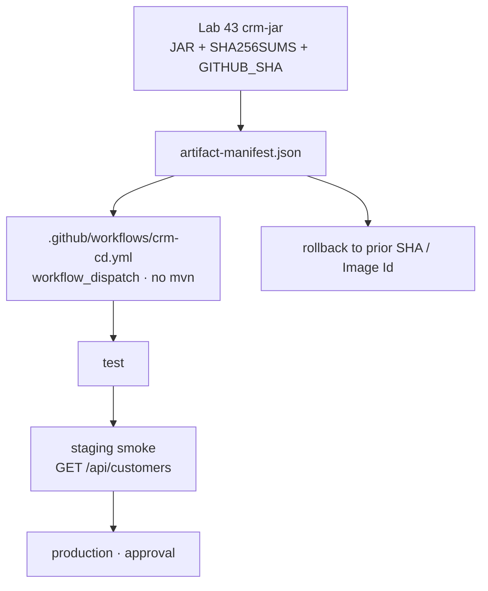

# Lab 44: Continuous Delivery and Environment Promotion — Northstar Release Path

**Module:** 44 — Continuous Delivery and Environment Promotion  
**Duration:** ~45 minutes (timed path with starter) · Full path: 3–4 Hours

**Primary IDE:** IntelliJ IDEA Community Edition · **Optional IDE:** VS Code

| OS | How-to for this lab |
| -- | ------------------- |
| Windows | [LAB-44-WINDOWS.md](LAB-44-WINDOWS.md) |
| macOS | [LAB-44-MACOS.md](LAB-44-MACOS.md) |

> **Two folders (do not mix):** [Clone the course repo · Commit in your own repo](../../../CLONE-AND-OWN-REPO-GUIDE.md). Read this GUIDE in the **course clone**. Write, run, and **push** everything in **your** `java-bootcamp` repo.

---

## Activity card

| | |
| --- | --- |
| **Time** | ~45 min timed · full path 3–4 h |
| **Checkpoint** | **E** (after Ex 1→2→3→5→4→6) |
| **Must prove** | Manifest from Lab 43 SHA · release plan/checklist · rollback known-good · no secrets in artifact |
| **Hard gate** | Pre-lab Pass · Lab 43 `crm-jar` / `SHA256SUMS` · no rebuild on promote |

### What you will learn

Promote one immutable CRM identity through environments with objective gates, evidence, and rehearsed rollback.

### Enterprise context

`:latest` or a rebuild on the deploy host is not a credit-worthy production candidate.

### Predict

Staging JAR SHA ≠ manifest `jarSha256` — promote to prod or stop?

### Debug

Promote job runs `mvn package` again — what broke?

---

## Two folders — every command below uses these paths

| Folder | Remote | You… |
| ------ | ------ | ---- |
| **Course clone** (handouts) | `bc-sw-engineer-java-participant` | **Read** this GUIDE / starter. **Never** commit homework here. |
| **Your repo** | private `java-bootcamp` | **Copy** Lab 43 here, **merge** starter docs, **put CD YAML at the git root**, **commit**. |

| Item | Course clone (read) | Your `java-bootcamp` (write) |
| ---- | ------------------- | ---------------------------- |
| This GUIDE | `labs/…/module-44/lab44/LAB-44-GUIDE.md` | — |
| Starter docs + `cd.yml` | `labs/…/module-44/lab44/starter/` | docs/manifest → `examples/lab44-crm/`; workflow → **`.github/workflows/crm-cd.yml`** |
| Graded CRM + CD packet | — | `examples/lab44-crm/` (copy of **Lab 43**, not starter-only) |
| Pre-lab notes | — | `examples/module-44-exercises/notes/` |
| Screenshots | — | `notes/screenshots/lab-44/` (gitignored) |

IntelliJ stays on `java-bootcamp`.

**Lab 43 identity (what you promote):** Actions artifact **`crm-jar`** = JAR + `SHA256SUMS` + `GITHUB_SHA`. That is the required immutable field **`jarSha256`**. Lab 41 `RepoDigests` is empty until you push — **do not invent** `ghcr.io/…@sha256:…`. Image digest / GHCR is **optional**. Local cluster from Lab 42 is **k3d** (`crm-api:lab41`, Host header on `:8088`), not instructor GHCR.

**Do not rebuild:** `mvn package` / `./mvnw` on the deploy agent or in CD is a fail. Download `crm-jar` (`gh run download` or `download-artifact` with **Lab 43 `run-id`**).

**Smoke API:** **`GET /api/customers?status=ACTIVE`**. There is **no** `GET /api/customers/{id}`, **no** Spring Security, **no** `/api/v1/interactions`. On k3d use `Host: crm-api.training.example.test` + `http://127.0.0.1:8088`.

**Where GitHub looks:** only `<repo>/.github/workflows/*.yml` at the **repository root**. Nested `examples/lab44-crm/.github/` is ignored (same as Lab 43).

---

## 45-minute timed path (use starter)

> **Pacing reminder:** [PACING.md](../PACING.md) checkpoint **E**. Homework: optional live k3d promote + Host-header smoke + rollback undo.

1. Open [`starter/README.md`](starter/README.md) **in the course clone**.
2. In **`java-bootcamp`**, copy Lab 43 → `examples/lab44-crm`, merge starter **docs/manifest**, copy CD YAML to **repo-root** `.github/workflows/crm-cd.yml`.
3. Fill every `TODO` from Lab 43 `SHA256SUMS` — do **not** work under `labs/`.
4. Validate JSON; evidence under `notes/screenshots/lab-44/`.
5. Mark timed-path Pass criteria in the starter README.

| Path | Time | Scope |
| ---- | ---- | ----- |
| **Timed (default)** | ~45 min | Manifest + plan/checklist/rollback + root `crm-cd.yml` |
| **Full (extended)** | see Duration | Live download of `crm-jar`, optional k3d promote, Host-header smoke, undo |

---

## What you'll submit (read this first)

All of these live under **`java-bootcamp`**, not the course clone.

| # | Deliverable | Where |
| - | ----------- | ----- |
| 1 | `docs/release-plan.md` | `examples/lab44-crm/docs/` |
| 2 | `docs/release-checklist.md` | same |
| 3 | `docs/rollback-runbook.md` | same |
| 4 | `artifact-manifest.json` (`jarSha256` + `gitCommit` from Lab 43) | `examples/lab44-crm/` |
| 5 | Staging evidence (SHA match + list-API smoke, or tabletop if no cluster) | `notes/screenshots/lab-44/` |
| 6 | NO-GO or rollback rehearsal | notes |
| 7 | Root `.github/workflows/crm-cd.yml` (no secrets, no `mvn package`) | **git root** |
| 8 | No secrets in Git | `git status` on **your** repo |

**Do not submit:** `target/`, secrets, kubeconfig, or a verbatim instructor `solution/`.

---

## Lab Overview

This Module 44 lab turns Lab 43 CI success into **continuous delivery**: one immutable identity promoted test → staging → production with objective gates, approvals, evidence, and rehearsed rollback. Live GHCR is **not** required on the laptop path.

## Learning Objectives

After completing this lab, you will be able to:

* Distinguish continuous delivery (releasable always) from continuous deployment (auto-prod)
* Promote by checksum/digest rather than rebuilding
* Separate environment configuration from immutable application bits
* Define measurable release gates with evidence links
* Write rollback steps operators can execute under stress

## Business Scenario

Leadership asks: “If staging said GO on checksum X, can we prove production is X—and roll back to Y?” You own that answer for Amina (`CUS-1001`) and Ravi (`CUS-1002`).

| ID | Name | Notes |
| -- | ---- | ----- |
| `CUS-1001` | Amina Khan | `ACTIVE` — list-API smoke fixture |
| `CUS-1002` | Ravi Singh | `PROSPECT` — optional second list filter |
| `lab-request-001` | — | correlation header |
| `jarSha256` / `GITHUB_SHA` | — | Lab 43 identity |
| Prior SHA / Image Id | — | rollback target (record **before** promote) |

**Security note.** Never commit kubeconfig, `.env`, or registry tokens. Synthetic customers only.

---

## Architecture Context
### NOW (this lab)


```mermaid
flowchart TB
  CI["Lab 43 crm-jar<br/>JAR + SHA256SUMS + GITHUB_SHA"] --> Man["artifact-manifest.json"]
  Man --> CD[".github/workflows/crm-cd.yml<br/>workflow_dispatch · no mvn"]
  CD --> Test["test"]
  Test --> Stg["staging smoke<br/>GET /api/customers"]
  Stg --> Prod["production · approval"]
  Man --> RB["rollback to prior SHA / Image Id"]
```

## Prerequisites

Prior labs: [Lab 43](../../module-43/lab43/LAB-43-GUIDE.md) in **`java-bootcamp`**. Optional live promote: [Lab 42](../../module-42/lab42/LAB-42-GUIDE.md) k3d still running.

Confirm:

* Lab 43 `SHA256SUMS` / Actions run that uploaded **`crm-jar`**
* Root **`crm-ci.yml`** already in `java-bootcamp` (Lab 43)
* `gh` CLI helpful for `gh run download`
* No secrets in Git

### Pre-flight

```bash
git remote -v   # must be YOUR java-bootcamp
gh run list --workflow "CRM CI" --limit 5
```

Working directory for docs unless noted:

```text
~/java-bootcamp/examples/lab44-crm
```

CD workflow file:

```text
~/java-bootcamp/.github/workflows/crm-cd.yml
```

## Worked example (read before you code)

Download Lab 43 bits. **Do not** Maven. Smoke is the **list** API.

```bash
# From java-bootcamp root (after a Lab 43 run that uploaded crm-jar):
gh run download <LAB43_RUN_ID> -n crm-jar -D dist/
# Compare dist/SHA256SUMS to artifact-manifest.json jarSha256

# Optional local k3d (Lab 42) — tag already imported; not GHCR:
curl.exe -fsS -H "Host: crm-api.training.example.test" \
  -H "X-Correlation-Id: lab-request-001" \
  "http://127.0.0.1:8088/api/customers?status=ACTIVE"
```

**What to notice:** Instructors check `jarSha256` from Lab 43, workflow at **git root**, and **no** `mvn` in CD.

---

## Implementation Steps

Complete each step in order. **Write** under `java-bootcamp`. **Read** starter from the course clone.

---

### Step 1 — Copy Lab 43, merge starter, install root CD workflow

**Why:** Graded work belongs in `java-bootcamp`. Nested `.github/` never runs. Starter is docs, not a CRM.

**Do this:**

**Windows (PowerShell):**

```powershell
$jb = "$env:USERPROFILE\java-bootcamp"
$courseLab44 = "$env:USERPROFILE\bc-sw-engineer-java-participant\labs\Week 5 - DevOps, CI-CD and OpenShift\module-44\lab44"

Copy-Item -Recurse -Force "$jb\examples\lab43-crm" "$jb\examples\lab44-crm"
New-Item -ItemType Directory -Force -Path "$jb\examples\lab44-crm\docs","$jb\notes\screenshots\lab-44","$jb\.github\workflows" | Out-Null
Copy-Item -Force "$courseLab44\starter\docs\*" "$jb\examples\lab44-crm\docs\"
Copy-Item -Force "$courseLab44\starter\artifact-manifest.json" "$jb\examples\lab44-crm\"
Copy-Item -Force "$courseLab44\starter\.github\workflows\cd.yml" "$jb\.github\workflows\crm-cd.yml"
```

**macOS / Linux:**

```bash
JB=~/java-bootcamp
COURSE_LAB44=~/bc-sw-engineer-java-participant/labs/Week\ 5\ -\ DevOps,\ CI-CD\ and\ OpenShift/module-44/lab44

cp -R "$JB/examples/lab43-crm" "$JB/examples/lab44-crm"
mkdir -p "$JB/examples/lab44-crm/docs" "$JB/notes/screenshots/lab-44" "$JB/.github/workflows"
cp "$COURSE_LAB44/starter/docs/"* "$JB/examples/lab44-crm/docs/"
cp "$COURSE_LAB44/starter/artifact-manifest.json" "$JB/examples/lab44-crm/"
cp "$COURSE_LAB44/starter/.github/workflows/cd.yml" "$JB/.github/workflows/crm-cd.yml"
```

Confirm `examples/lab44-crm/pom.xml` exists (Lab 43/41 CRM) and **`java-bootcamp/.github/workflows/crm-cd.yml`** is at the git root next to `crm-ci.yml`.

In `docs/release-plan.md` sketch commit → Lab 43 CI → test → staging → prod. Name approvers. Call out “rebuild on each env” as forbidden.

**Expected result:** `lab44-crm` is a Maven CRM; CD YAML at git root; you are not editing `labs/`.

**If it fails:** Copied starter only → no `pom.xml`. Copied into course clone → start over in `java-bootcamp`. CD YAML only under `examples/lab44-crm/.github/` → Actions will never start.

---

### Step 2 — Fill immutable identity from Lab 43 (do not rebuild)

**Why:** Hashing a freshly built `target/*.jar` is a **new** artifact, not Lab 43.

**Do this:** Copy hex from Lab 43 `SHA256SUMS` and the `commit=` line into `artifact-manifest.json`. Set `imageDigest` to **`null`** or `"not-pushed"` unless you actually pushed to a registry.

```json
{
  "application": "crm-api",
  "version": "1.4.0-lab44",
  "gitCommit": "<GITHUB_SHA from SHA256SUMS>",
  "jarSha256": "<hex from Lab 43>",
  "imageRepository": null,
  "imageDigest": null,
  "lab42ImageId": "<optional docker inspect Id from Lab 41/42>",
  "builtBy": "lab43-ci",
  "knownGoodPrevious": {
    "jarSha256": "<record BEFORE this promote>",
    "version": "lab43-prior"
  }
}
```

Download (do not Maven):

```bash
# java-bootcamp root
gh run download <LAB43_RUN_ID> -n crm-jar -D dist/
```

**Expected result:** Manifest has a real `jarSha256`; no `latest`; no fake GHCR digest.

**If it fails:** No `crm-jar` → Lab 43 package job only runs on `main` / `v*`. Empty Actions → Lab 43 workflow was nested.

---

### Step 3 — Separate configuration

**Why:** Baking JDBC URLs into the JAR guarantees the wrong backend in prod.

**Do this:** In `docs/release-plan.md` list values that vary by env: `SPRING_DATASOURCE_*` / Lab 42 ConfigMap `CRM_DB_*` (profile **`docker`**), Ingress host. Secrets stay in GitHub Environments or cluster Secrets — **names only** in Git.

This CRM has **no** Kafka requirement for Lab 44 smoke.

**Expected result:** Config inventory; secret **names** only.

**If it fails:** Password in `artifact-manifest.json` → remove, rotate if pushed.

---

### Step 4 — Objective promotion gates

**Why:** “Looks good” does not survive audit.

**Do this:** Fill `docs/release-checklist.md`: digest/SHA match, Lab 43 verify green, list-API smoke, rollback target recorded, approver timestamp.

**Expected result:** Measurable GO/NO-GO slots.

---

### Step 5 — Database compatibility notes

**Why:** App rollback cannot undo DROP COLUMN.

**Do this:** In `docs/release-plan.md` state expand-before-contract. Lab 43/44 on isolated DB **`crm_lab43`** (do not migrate Lab 42’s `crm_lab42` as “prod”). Record when digest rollback is **not** enough.

**Expected result:** Explicit rollback limits.

---

### Step 6 — Staging rehearsal (download + smoke; optional k3d)

**Why:** First-time promotion should not be production.

**Do this:**

1. Confirm `dist/` JAR SHA matches the manifest (from Step 2 download).
2. **Timed path / no cluster:** screenshot Actions artifact + SHA compare; tabletop “staging GO.”
3. **Optional live path (Lab 42 k3d):** do **not** `kubectl set image` to `ghcr.io`. Keep `crm-api:lab41` / Image Id already imported. Smoke:

```powershell
curl.exe -fsS -H "Host: crm-api.training.example.test" `
  http://127.0.0.1:8088/actuator/health/readiness
curl.exe -fsS -H "Host: crm-api.training.example.test" `
  -H "X-Correlation-Id: lab-request-001" `
  "http://127.0.0.1:8088/api/customers?status=ACTIVE"
```

A **200** list (possibly empty) is valid. Do **not** curl `/api/customers/CUS-1001`.

**Expected result:** Staging identity matches manifest SHA; smoke is the list API; evidence saved.

**If it fails:** 404 on `/{id}` → use query list. NXDOMAIN hostname → Host header + `:8088`. `mvn package` to “fix” staging → stop; download `crm-jar`.

---

### Step 7 — Rollback rehearsal

**Why:** Untested rollback is fiction.

**Do this:** Record **prior** `jarSha256` / Image Id **before** you change anything. Fill `docs/rollback-runbook.md`.

Optional k3d (Lab 42):

```bash
kubectl -n crm-training rollout undo deployment/crm-api
kubectl -n crm-training rollout status deployment/crm-api --timeout=180s
```

Re-run Step 6 list-API curls.

**Expected result:** Runbook with triggers, commands, verification; rehearsal note.

---

### Step 8 — Release record + CD workflow TODOs

**Why:** Auditors need one story.

**Do this:** GO/NO-GO in the checklist with evidence links. Finish **`java-bootcamp/.github/workflows/crm-cd.yml`**:

* `workflow_dispatch` with environment + Lab 43 **`run-id`** + **`jar_sha256`**
* `environment:` for GitHub Environment protection (document production reviewers)
* Download `crm-jar` from **that run-id** (not from the CD run itself)
* **No** `mvn` / `./mvnw`
* Smoke sketch uses **`GET /api/customers`**

**Expected result:** Complete packet; CD YAML at git root with no secrets.

---

### Step 9 — Failure experiments + evidence pack

**Do this:** Complete Failure Experiments. `git status` on **your** repo. Peer dry-run of the rollback runbook.

```markdown
| # | Confirm | Notes |
| - | ------- | ----- |
| 1 | Work in java-bootcamp; crm-cd.yml at git root | Pass / Fail |
| 2 | jarSha256 from Lab 43 (not a local rebuild) | Pass / Fail |
| 3 | List-API smoke or documented tabletop | Pass / Fail |
| 4 | Rollback rehearsal | Pass / Fail |
| 5 | No secrets in Git | Pass / Fail |
```

---

## Implementation Checkpoints

### Checkpoint A — Tooling

| # | Confirm | Your notes |
| - | ------- | ---------- |
| 1 | `examples/lab44-crm` is a Lab 43 copy (`pom.xml` present) | Pass / Fail |
| 2 | Lab 43 `jarSha256` available | Pass / Fail |
| 3 | `java-bootcamp/.github/workflows/crm-cd.yml` exists | Pass / Fail |

### Checkpoint B — Core CD design

| # | Confirm | Your notes |
| - | ------- | ---------- |
| 1 | Release flow mapped; rebuild forbidden | Pass / Fail |
| 2 | Manifest: `jarSha256` + `gitCommit`; image optional | Pass / Fail |
| 3 | Env config separated | Pass / Fail |

### Checkpoint C — Gates + rehearsal

| # | Confirm | Your notes |
| - | ------- | ---------- |
| 1 | Objective checklist | Pass / Fail |
| 2 | SHA match + `GET /api/customers` (or tabletop) | Pass / Fail |
| 3 | Rollback to known-good recorded | Pass / Fail |

### Checkpoint D — Hygiene

| # | Confirm | Your notes |
| - | ------- | ---------- |
| 1 | GO/NO-GO with evidence | Pass / Fail |
| 2 | Rollback runbook complete | Pass / Fail |
| 3 | No secrets; pushes to **your** remote | Pass / Fail |

---

## Safety Rules

* Never `mvn package` as “the same” release.
* Never commit kubeconfig, tokens, or NVD keys.
* Never require GHCR digest unless you pushed.
* Synthetic `CUS-1001` / `CUS-1002` only.
* Do not Flyway-migrate shared Lab 42 DB as production.

---

## Reference Commands

```bash
# java-bootcamp root
gh run download <LAB43_RUN_ID> -n crm-jar -D dist/
# Windows hash of downloaded JAR:
# Get-FileHash dist\*.jar -Algorithm SHA256

curl.exe -fsS -H "Host: crm-api.training.example.test" `
  -H "X-Correlation-Id: lab-request-001" `
  "http://127.0.0.1:8088/api/customers?status=ACTIVE"
```

## Failure Experiments

| # | Experiment | Observe | Restore |
| - | ---------- | ------- | ------- |
| 1 | Promote with a wrong SHA | Manifest grep fails | Correct Lab 43 hex |
| 2 | Tabletop NO-GO (migration risk) | Checklist blocks prod | Document owner |
| 3 | `rollout undo` on k3d (optional) | List API still 200 | Leave known-good noted |
| 4 | Use `:latest` in the manifest | Traceability broken | Ban latest |
| 5 | Nested `cd.yml` only | Actions never starts | Move to repo root |
| 6 | `mvn -DskipTests package` in CD | New bits | Delete that step |

---

## Troubleshooting

| Symptom | Likely cause | Fix |
| ------- | ------------ | --- |
| Actions never starts | Nested `.github/` | Root `crm-cd.yml` |
| `crm-jar` empty in CD | `download-artifact` without Lab 43 `run-id` | `gh run download` / `run-id` + token |
| Fake GHCR digest | Lab 43 never pushed | Use `jarSha256`; image `null` |
| `GET /api/customers/CUS-1001` 404 | No per-id route | **`GET /api/customers`** |
| Smoke 401 | Expected old Security CRM | Lab 41 has **no** Spring Security |
| curl hostname NXDOMAIN | Ingress DNS | Host header + `:8088` |
| `./mvnw` / `mvn package` on promote | Rebuild | Download `crm-jar` |
| Copied starter only | No CRM | Copy **Lab 43** |
| Work in course clone | Wrong folder | Move to `java-bootcamp` |
| Terraform urge | Wrong module | Lab 45 |

## Evidence Log Template

```markdown
# Lab 44 Evidence Log
- Repo (must be java-bootcamp):
- Lab 43 run id / jarSha256:
- crm-cd.yml path (must be git root):
- Smoke (list API or tabletop):
- Rollback rehearsal:
```

---

## Cleanup

```bash
cd ~/java-bootcamp/examples/lab44-crm
git status --short
```

Do not commit `dist/` JARs or kubeconfig. **Keep `lab44-crm` and root `crm-cd.yml`**—Lab 45 may automate env setup.

---

## Reflection Questions

Write **1–3 sentence** answers (not essays):

1. Which design decision most affected correctness (SHA vs `:latest`)?
2. What evidence proves staging and the prod candidate are the same bits?
3. Why must CD not run Maven?

---
